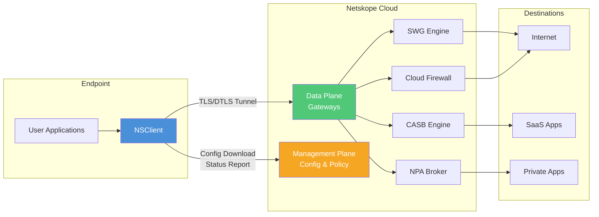
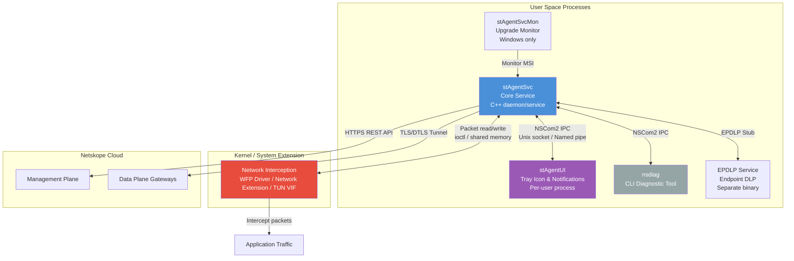
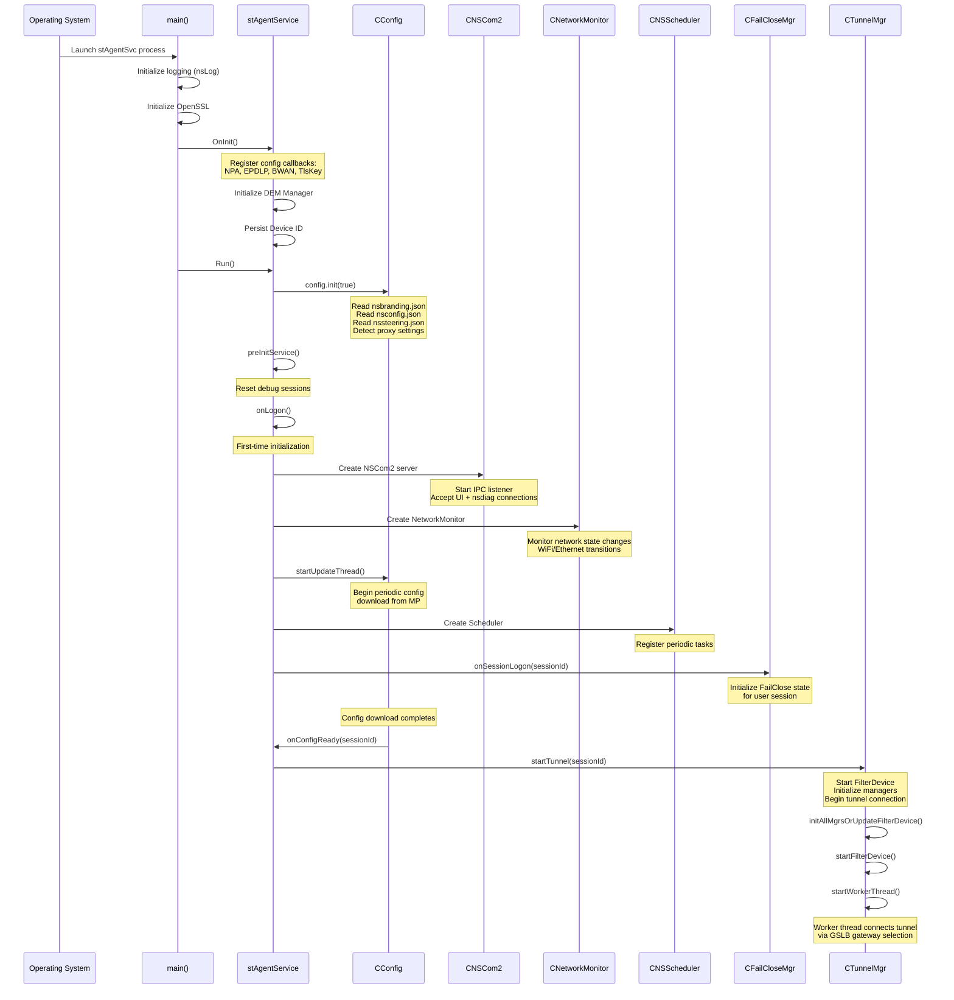
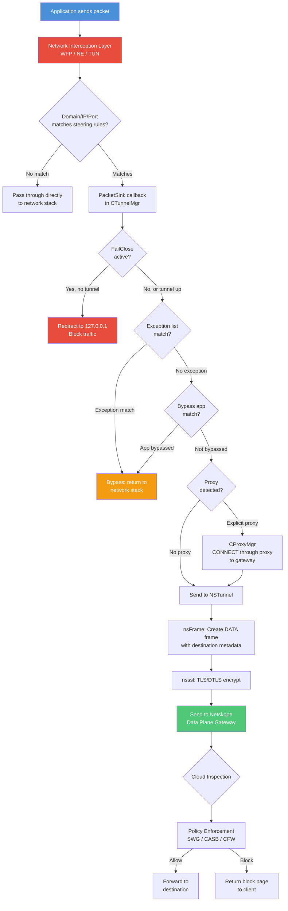
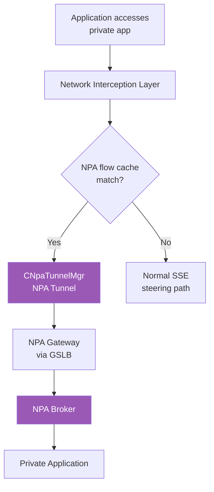
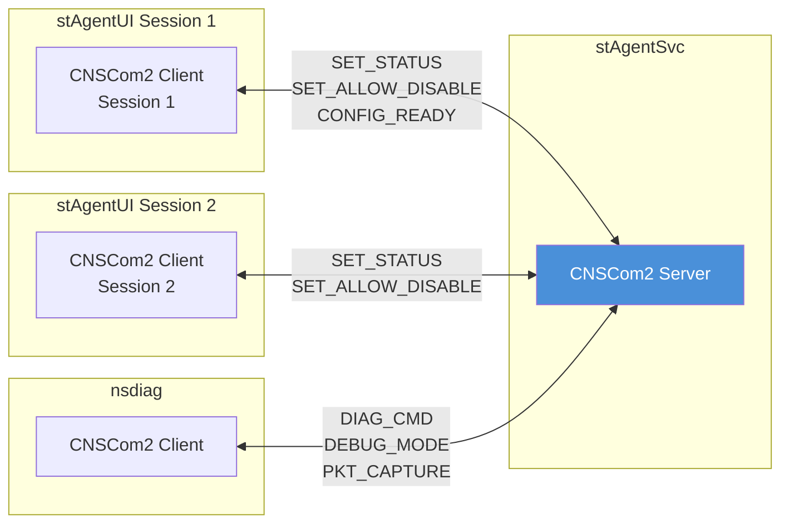
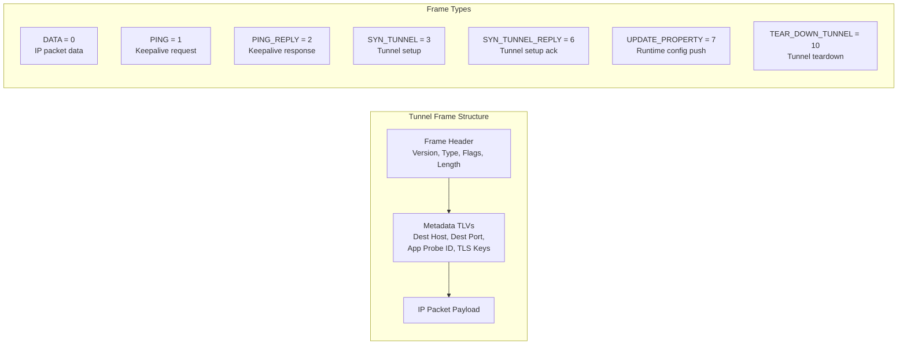

# 00. NSClient Architecture Overview

> This chapter provides a comprehensive view of the NSClient (Netskope Client) architecture -- its product positioning, component structure, module decomposition, platform support, service lifecycle, data flow, and key design decisions. This is the recommended starting point for anyone working with or testing NSClient.

---

## Overview

NSClient, also known internally as **STAgent** (SkopeTunnel Agent), is the endpoint security client for the **Netskope SASE (Secure Access Service Edge) platform**. Its core mission is to intercept network traffic on the endpoint and route it through the Netskope Security Cloud for inspection, policy enforcement, and threat protection.

NSClient supports a broad set of security functions that are controlled centrally via the Netskope Management Plane (MP):

- **Secure Web Gateway (SWG)** -- inspects and enforces policy on web traffic (HTTP/HTTPS)
- **Cloud Access Security Broker (CASB)** -- monitors and controls access to cloud applications
- **Cloud Firewall (CFW)** -- applies firewall rules to all IP traffic (not just web)
- **Zero Trust Network Access (NPA)** -- provides private access to internal applications without a traditional VPN
- **Endpoint DLP (EPDLP)** -- monitors endpoint-level data for data loss prevention
- **Borderless WAN (BWAN)** -- SD-WAN functionality for branch and remote users
- **Digital Experience Monitoring (DEM)** -- measures network path quality and application reachability

The client operates as a system-level service (running with elevated privileges) that manages one or more encrypted tunnels to the nearest Netskope Data Plane (DP) gateway. It uses a platform-specific network interception mechanism (WFP driver on Windows, Network Extension on macOS, TUN virtual interface on Linux) to capture packets, make steering decisions, and either tunnel traffic to the Netskope cloud or bypass it locally.

---

## Product Positioning

NSClient sits at the intersection of endpoint security and network security. It is the enforcement point that connects the user's device to the Netskope cloud infrastructure.

The Management Plane (MP) provides centralized configuration -- administrators set steering rules, FailClose policies, bypass exceptions, NPA app definitions, and DEM probes from the Netskope admin console. NSClient periodically downloads this configuration and applies it locally. The Data Plane (DP) consists of geographically distributed gateways that NSClient connects to via encrypted tunnels. GSLB (Global Server Load Balancing) selects the optimal gateway based on proximity and RTT measurements.

---

## Component Architecture

NSClient is composed of several OS-level processes and a kernel/system-level network interception driver or extension. These components interact through IPC (Inter-Process Communication) and shared configuration files.

### Process Descriptions

**stAgentSvc** is the core service process. It runs as a Windows service (SCM-managed), a macOS launchd daemon, or a Linux systemd service. It owns all critical state: configuration, tunnel connections, steering decisions, FailClose enforcement, NPA tunnels, and DEM probes. This single process orchestrates all other components.

**stAgentUI** is a per-user GUI process that displays the system tray icon, shows notifications (tunnel status, FailClose alerts, captive portal prompts), and provides the user-facing settings dialog. It communicates with stAgentSvc through the NSCom2 IPC channel. On Linux, this component is absent -- the client is headless.

**nsdiag** is a command-line diagnostic tool that connects to stAgentSvc via NSCom2 to trigger log collection, packet captures, config checks, debug mode, and status queries. It is the primary troubleshooting interface for support engineers.

**stAgentSvcMon** (Windows only) is a monitor process that watches MSI installer progress during auto-upgrades. It retries failed installations up to 3 times and reports results back to the service. On macOS, the equivalent functionality is handled by launchd.

**EPDLP Service** is a separate binary for Endpoint DLP that runs alongside stAgentSvc on Windows and macOS. It communicates through the `EpdlpSvcStub` interface for configuration and status updates.

**Network Interception Layer** is the platform-specific mechanism that captures packets from the network stack. It operates at the kernel level (Windows WFP driver) or system extension level (macOS Network Extension) or as a user-space TUN device (Linux VIF). This component receives steering rules from stAgentSvc and routes matching packets to the service for tunneling.

---

## Module Decomposition

The stAgentSvc process is built from a set of C++ library modules under the `lib/` directory. Each module has a focused responsibility, and the service's main class `stAgentService` ties them together.

```mermaid
graph TB
    subgraph stAgentSvc Core
        MAIN[stAgentService<br/>Main Orchestrator]
        TMGR[CTunnelMgr<br/>Tunnel Manager]
        FCMGR[CFailCloseMgr<br/>FailClose Manager]
        SMGR[CSessionMgr<br/>Session Manager]
        EMGR[CExceptionMgr<br/>Exception Manager]
        BAMGR[CBypassAppMgr<br/>Bypass App Manager]
        PMGR[CProxyMgr<br/>Proxy Manager]
        OMGR[COverlapMgr<br/>Overlap Domain Manager]
        CPMGR[CCustomPortDomainMgr<br/>Custom Port Manager]
        TPMGR[CTunnelPolicyMgr<br/>Tunnel Policy Manager]
        DEMMGR[CDemMgr<br/>DEM Manager]
    end

    subgraph Library Modules
        CFG[nsConfig<br/>Configuration & Persistence]
        TUN[nsTunnel<br/>TLS/DTLS Connection]
        FD[nsFilterDevice<br/>Packet Interception]
        NPA[npa_core<br/>Private Access]
        COM[nscom2<br/>IPC Framework]
        MSG[nsmsg2<br/>IPC Message Encoding]
        FRM[nsFrame<br/>Tunnel Protocol Framing]
        SSL[nsssl<br/>TLS/DTLS Wrapper]
        DEM[nsDEM<br/>DEM Probes & Scheduling]
        REST[nsRestApi<br/>MP API Client]
        DL[nsDownloader<br/>HTTP Download Client]
        CERT[nsCert<br/>Device Certificate]
        CRYPT[nsCrypto<br/>Encryption Utilities]
        UTIL[nsUtils<br/>Shared Utilities]
        LOG[nsLog<br/>Logging Framework]
        SCHED[nsScheduler<br/>Periodic Task Scheduler]
        BWAN[nsbwan<br/>Borderless WAN Config]
        TAG[nsDeviceTag<br/>Device Tags & Install Tags]
        MET[nsMetrics<br/>Telemetry Metrics]
        DISP[nsDispatcher<br/>Event Dispatch & Timers]
    end

    MAIN --> TMGR
    MAIN --> FCMGR
    MAIN --> DEMMGR
    MAIN --> COM
    TMGR --> FD
    TMGR --> FCMGR
    TMGR --> SMGR
    TMGR --> EMGR
    TMGR --> BAMGR
    TMGR --> PMGR
    TMGR --> OMGR
    TMGR --> CPMGR
    TMGR --> TPMGR
    MAIN --> CFG
    MAIN --> NPA
    CFG --> REST
    CFG --> DL
    TUN --> FRM
    TUN --> SSL
    NPA --> FD
    NPA --> PMGR
    COM --> MSG
    DEMMGR --> DEM
    CFG --> CERT
    CFG --> CRYPT

    style MAIN fill:#4A90D9,color:#fff
    style TMGR fill:#3498DB,color:#fff
    style FCMGR fill:#E74C3C,color:#fff
    style CFG fill:#F5A623,color:#fff
    style FD fill:#E74C3C,color:#fff
    style NPA fill:#9B59B6,color:#fff
```

### Key Module Responsibilities

| Module | Path | Responsibility |
|--------|------|----------------|
| **nsConfig** | `lib/nsConfig/` | Configuration download, parsing, persistence, version management. Contains `CConfig` (main config), `SteeringConfig` (traffic steering rules), `failCloseConfig`, `GatewaySelection` (GSLB), `deviceId`, `deviceInfo`, `branding`, `idpConfig`, and per-user config management. |
| **nsTunnel** | `lib/nsTunnel/` | Manages a single tunnel connection to a Netskope gateway. Handles TLS/DTLS handshake, SPDY-like frame protocol, ping/keepalive, reconnection with exponential backoff. |
| **nsFilterDevice** | `lib/nsFilterDevice/` | Abstracts the platform-specific packet interception mechanism. Provides a unified `nsFilterDevice` class with platform backends: `win/nsKernelUserShim` (WFP), `osx/nsKernelUserShim` + `FilterDeviceNE` (Network Extension), `linux/nsKernelUserShim` (TUN/VIF). |
| **npa_core** | `lib/npa_core/` | NPA (Private Access) tunnel management, enrollment, gateway selection, flow caching, and per-app routing. Operates as a separate tunnel alongside the main SWG tunnel. |
| **nscom2** | `lib/nscom2/` | IPC communication framework. Server/client model using Unix domain sockets (macOS/Linux) or Named Pipes (Windows). Used for Service-to-UI and Service-to-nsdiag communication. |
| **nsmsg2** | `lib/nsmsg2/` | Message serialization/deserialization for IPC. Defines message IDs and tag-value encoding for all NSCom2 messages (`stmsgs.h`). |
| **nsFrame** | `lib/nsFrame/` | Implements the Netskope tunnel protocol framing. Frame types include DATA, PING, SYN_TUNNEL, TEAR_DOWN_TUNNEL, UPDATE_PROPERTY, and TLS_KEY. This is a custom SPDY-like binary protocol. |
| **nsssl** | `lib/nsssl/` | OpenSSL wrapper for TLS and DTLS connections. Handles certificate verification, session resumption, and the encrypted transport layer for tunnels. |
| **nsDEM** | `lib/nsDEM/` | Digital Experience Monitoring. Manages probe tasks (HTTP probes, traceroute), task scheduling, and result reporting. Integrates with `nsAppProbeStats` for application-level metrics. |
| **nsRestApi** | `lib/nsRestApi/` | REST API client for communicating with the Management Plane addon manager. Handles versioned API endpoints (v2/v5/v7), authentication, and response parsing. |
| **nsDownloader** | `lib/nsDownloader/` | HTTP download client used by config module for downloading configuration files, certificates, and upgrade packages. |
| **nsCert** | `lib/nsCert/` | Device certificate management. Handles CA cert, user cert, and tenant cert lifecycle including download, validation, and rotation. |
| **nsCrypto** | `lib/nsCrypto/` | Encryption utilities including encrypted file storage, RSA operations, and platform-specific key management (Linux `nsEncKey`). |
| **nsUtils** | `lib/nsUtils/` | Shared utility functions: captive portal detection, DNS resolution, domain matching, network monitoring, file utilities, packet handling (`nsPkt`), OS utilities, process management, and DNS flush. |
| **nsLog** | `lib/nsLog/` | Logging framework with per-module log levels, log rotation, async logging, and packet dump support. |
| **nsScheduler** | `lib/nsScheduler/` | Periodic task scheduler. Used to schedule recurring checks (SFCheck, JavaCert, OnPrem detection, proxy detection, DEM heartbeat). |
| **nsbwan** | `lib/nsbwan/` | Borderless WAN (SD-WAN) configuration and status monitoring. |
| **nsDeviceTag** | `lib/nsDeviceTag/` | Device classification tags and install-time tags for posture checking. |
| **nsNotification** | `lib/nsNotification/` | User notification framework for displaying alerts and messages. |
| **nsMetrics** | `lib/nsMetrics/` | Telemetry and metrics collection for client health reporting. |

### Manager Classes in stAgentSvc

The `stAgentSvc/` directory contains several manager classes that coordinate between library modules.

| Manager | File | Responsibility |
|---------|------|----------------|
| **CTunnelMgr** | `tunnelMgr.h/.cpp` | Central traffic management. Owns `nsFilterDevice`, manages multiple `NSTunnel` instances (one per session), coordinates steering decisions, bypass processing, proxy detection, and FailClose state. Implements `IPacketSink` to receive packets from the filter device. |
| **CFailCloseMgr** | `FailCloseMgr.h/.cpp` | Manages FailClose policy state machine. Tracks tunnel connectivity per session, enforces traffic blocking when tunnels are down, handles captive portal detection, and coordinates with CTunnelMgr for filter device rule updates. |
| **CSessionMgr** | `sessionMgr.h/.cpp` | Maps user sessions to tunnel instances. Supports multi-user scenarios (VDI, Windows multi-session). |
| **CExceptionMgr** | `ExceptionMgr.h/.cpp` | Manages bypass exception lists (domains, IPs, IP ranges, categories). Determines which traffic should skip the tunnel. |
| **CBypassAppMgr** | `bypassAppMgr.h/.cpp` | Application-level bypass management. Identifies processes that should not have their traffic steered. |
| **CProxyMgr** | `proxyMgr.h/.cpp` | Proxy detection and management. Handles explicit proxy connections, CONNECT tunnel through corporate proxies, and proxy credential prompting. |
| **COverlapMgr** | `overlapMgr.h/.cpp` | Manages overlapping domain rules when multiple tenants or policies define conflicting steering for the same domains. |
| **CTunnelPolicyMgr** | `tunnelPolicyMgr.h/.cpp` | Manages tunnel policies that define which traffic goes to which tunnel based on destination and policy rules. |
| **CCustomPortDomainMgr** | `customPortDomainMgr.h/.cpp` | Handles custom port-to-domain mappings for non-standard port traffic steering. |
| **CDemMgr** | `demMgr.h/.cpp` | Orchestrates DEM probe execution and heartbeat reporting. |

---

## Platform Support Matrix

NSClient supports six platforms with significant architectural differences in the network interception layer, installation method, and available features.

| Feature | Windows | macOS | Linux | Android | iOS | ChromeOS |
|---------|---------|-------|-------|---------|-----|----------|
| **Installation** | MSI installer | PKG installer | .run / .deb / .rpm | Google Play | App Store / MDM | Chrome Extension |
| **Service Type** | Windows Service (SCM) | launchd daemon | systemd service | Android Service | App Extension | Extension background |
| **Network Interception** | WFP (Windows Filtering Platform) driver | Network Extension (System Extension) | TUN virtual interface (VIF) with lwIP | VPN Service API | NEPacketTunnelProvider | Chrome Extension API |
| **Interception Level** | Kernel mode callout | System Extension (user space) | User space TUN device | VPN framework | Network Extension | Browser only |
| **Traffic Modes** | Web, Cloud, Firewall, None | Web, Cloud, Firewall, None | Web, Cloud, Firewall, None | Web, Cloud, Firewall | Web, Cloud | Web (browser only) |
| **GUI** | System tray (stAgentUI) | Menu bar (stAgentUI) | None (headless) | Android UI | iOS UI | Extension popup |
| **IPC Mechanism** | Named Pipe (NSCom2) | Unix Domain Socket (NSCom2) | Unix Domain Socket (NSCom2) | JNI + NSCom2 | In-process | N/A |
| **NPA Support** | Full | Full | Full | Full | Limited | No |
| **EPDLP Support** | Yes (separate process) | Yes (separate process) | No | No | No | No |
| **BWAN Support** | Yes | Yes | Yes | No | No | No |
| **FailClose** | Full (WFP rules) | Full (NE rules) | Full (iptables/nftables) | Full | No | No |
| **Multi-User** | Yes (per-session) | Yes (per-uid) | Yes (per-uid) | Single user | Single user | Single user |
| **Auto-Upgrade** | stAgentSvcMon + MSI | launchd + PKG | Self-extracting .run | Play Store | App Store | Extension update |
| **Self-Protection** | Yes (service stop protection) | Yes (tamperproof) | Partial | No | No | No |

### Platform-Specific Driver Architecture

Each platform uses a different mechanism to intercept network traffic. This is the most significant architectural difference across platforms.

```mermaid
graph TB
    subgraph Windows
        W_APP[Applications] --> W_WFP[WFP Driver<br/>Kernel Mode<br/>stadrv.sys]
        W_WFP --> W_SVC[stAgentSvc<br/>User Mode]
        W_SVC -->|Tunneled packets| W_TUN[TLS/DTLS Tunnel]
        W_WFP -->|Bypassed packets| W_NET[Network Stack]
    end

    subgraph macOS
        M_APP[Applications] --> M_NE[Network Extension<br/>System Extension<br/>Transparent Proxy]
        M_NE --> M_SVC[stAgentSvc<br/>User Mode]
        M_SVC -->|Tunneled packets| M_TUN[TLS/DTLS Tunnel]
        M_NE -->|Bypassed flows| M_NET[Network Stack]
    end

    subgraph Linux
        L_APP[Applications] --> L_IPTAB[iptables/nftables<br/>TPROXY or REDIRECT]
        L_IPTAB --> L_TUN_D[TUN Device<br/>Virtual Interface]
        L_TUN_D --> L_LWIP[lwIP TCP/IP Stack<br/>User Mode]
        L_LWIP --> L_SVC[stAgentSvc]
        L_SVC -->|Tunneled packets| L_TUN[TLS/DTLS Tunnel]
        L_IPTAB -->|Bypassed packets| L_NET[Network Stack]
    end

    style W_WFP fill:#E74C3C,color:#fff
    style M_NE fill:#E74C3C,color:#fff
    style L_TUN_D fill:#E74C3C,color:#fff
```

**Windows (WFP Driver)**: The `stadrv.sys` kernel-mode driver registers WFP callouts at the network layer. It intercepts TCP/UDP flows based on domain lists, port lists, and IP rules pushed down from the service. Intercepted packets are delivered to `stAgentSvc` via an ioctl/shared-memory interface. The driver can also enforce FailClose blocking rules independently when the service is not running.

**macOS (Network Extension)**: A System Extension implements a transparent proxy using Apple's Network Extension framework (`NETransparentProxyProvider`). It operates in user space but with system-level privileges. Flow-level decisions (steer or bypass) are made when a new TCP/UDP flow is initiated. On macOS 11+ (Big Sur and later), the legacy kernel extension was replaced by the System Extension. An auxiliary service (`nsAuxSvc`) handles certificate utilities and DNS flush operations.

**Linux (TUN/VIF)**: A TUN virtual interface captures traffic redirected by iptables/nftables rules. A lightweight TCP/IP stack (lwIP) in user space processes the captured packets, making it possible to perform TCP termination and reconstruction without a kernel driver. This architecture is entirely user-space, which simplifies deployment but adds some overhead.

---

## Service Startup Sequence

When the stAgentSvc process starts, it follows a specific initialization order that ensures each subsystem is ready before dependent systems attempt to use it. The sequence varies slightly by platform but follows the same logical pattern.

The key phases are:

1. **Process Initialization**: Logging, OpenSSL, crash handler setup. Platform-specific initialization (Winsock on Windows, signal handlers on Linux, compatibility check on macOS).

2. **Config Callback Registration**: Modules that need config change notifications (NPA, EPDLP, BWAN, TlsKey) register their callbacks with `CConfig`.

3. **Configuration Load**: `config.init()` reads the branding file, main config, steering config, and proxy settings from local files. If this is a fresh install, enrollment happens first.

4. **IPC and Monitoring**: The NSCom2 server starts listening for UI and nsdiag connections. The NetworkMonitor begins tracking network state changes. The scheduler registers periodic tasks (SecureForwarder check every 3 min, Java cert check every 60 min, on-prem detection every 1 min, proxy check every 5-10 min, DEM heartbeat every 5 min).

5. **Config Download and Tunnel Start**: The config update thread contacts the Management Plane to check for configuration updates. Once configuration is ready (`onConfigReady`), the tunnel manager starts the filter device, initializes all sub-managers (exception, bypass, overlap, custom port, tunnel policy), and begins the tunnel connection process via GSLB gateway selection.

---

## Data Flow

When an application on the endpoint generates network traffic, it flows through the NSClient interception layer where a steering decision is made. The following diagram traces a packet from the application through the steering decision tree to its final destination.

### Packet Processing Path in Detail

1. **Interception**: The platform-specific driver/extension captures the packet. On Windows, the WFP driver performs an initial domain/port match in kernel mode. On macOS, the Network Extension makes a flow-level decision when a new connection is initiated. On Linux, iptables/nftables redirects matching traffic to the TUN device.

2. **PacketSink**: The `CTunnelMgr::PacketSink()` callback receives intercepted packets. This is the central steering decision point in user space.

3. **Session Resolution**: The `CSessionMgr` determines which user session the packet belongs to (relevant for multi-user/VDI scenarios). The session ID maps to a specific tunnel instance and FailClose state.

4. **FailClose Check**: If FailClose is active and no tunnel is connected for the session, traffic is blocked by redirecting it to 127.0.0.1 (except for captive portal detection traffic and configured exception domains).

5. **Exception Processing**: The `CExceptionMgr` checks the packet against bypass lists (domains, IPs, IP ranges) and bypass categories. Matching traffic is returned to the network stack without tunneling.

6. **Bypass App Check**: The `CBypassAppMgr` checks if the originating process is in the bypass application list.

7. **Proxy Handling**: The `CProxyMgr` determines if the connection should go through an explicit proxy. If so, it establishes a CONNECT tunnel through the proxy to the Netskope gateway.

8. **Tunnel Framing**: The `nsFrame` module wraps the packet in a DATA frame that includes the destination hostname (extracted from DNS or SNI), flow metadata, and optional flags (app firewall, TLS key, flow bypass).

9. **Encryption and Transmission**: The `nsssl` module encrypts the frame using the established TLS (or DTLS for UDP) session and sends it to the Netskope Data Plane gateway.

### NPA (Private Access) Data Path

NPA traffic follows a separate path through the `CNpaTunnelMgr` and its own tunnel to the NPA broker.

---

## IPC Architecture (NSCom2 / NSMsg2)

All inter-process communication within NSClient uses the NSCom2 framework with NSMsg2 message encoding. The service acts as the server; UI processes, nsdiag, and other clients connect to it.

The NSMsg2 protocol uses a tag-value encoding where each message has a message ID (e.g., `SET_STATUS`, `CONFIG_READY`, `SET_ALLOW_DISABLE`) and a set of key-value pairs. Message IDs are defined in `lib/nsmsg2/stmsgs.h`. Key messages include:

- **SET_STATUS**: Service sends tunnel status, gateway IP, POP name, traffic mode to UI
- **CONFIG_READY**: Service notifies UI that configuration is loaded
- **SET_ALLOW_DISABLE**: Service notifies UI of the allow-disable and NPA disable policies
- **SET_USER_LOG_LEVEL**: Service adjusts UI log level
- **DIAG_CMD**: nsdiag sends diagnostic commands
- **DEBUG_MODE**: nsdiag triggers debug mode (elevated logging + packet capture)

On Windows, NSCom2 uses Named Pipes. On macOS and Linux, it uses Unix Domain Sockets. The client name convention is `NSCOM_CLIENT_UI` for UI processes and includes the session ID for multi-user disambiguation.

---

## Tunnel Protocol

NSClient uses a custom binary framing protocol (implemented in `nsFrame`) that wraps IP packets for transmission over a TLS or DTLS encrypted channel. This protocol is inspired by SPDY but is not a standard protocol.

**Why a custom protocol instead of standard SPDY/HTTP2?** The Netskope tunnel protocol was designed specifically for packet tunneling rather than HTTP request/response multiplexing. Key design choices include:

- **Binary frame format** optimized for minimal overhead on every IP packet
- **Destination hostname metadata** embedded in each frame, enabling the cloud to apply domain-based policy without performing DNS resolution
- **PING/PING_REPLY** for lightweight keepalive (every 10 seconds for DTLS, every 120 seconds for TLS)
- **SYN_TUNNEL** handshake that carries authentication credentials and client metadata
- **UPDATE_PROPERTY** for the gateway to push runtime configuration changes to the client
- **DTLS support** for UDP traffic without TCP head-of-line blocking

---

## Key Design Decisions

### Separate Service and UI Processes

The service (`stAgentSvc`) runs as a system daemon with elevated privileges, while the UI (`stAgentUI`) runs in the user's session. This separation provides several benefits:

- **Security**: The service can enforce policies even if the user attempts to kill the UI process. Self-protection mechanisms prevent unauthorized service termination.
- **Multi-user support**: On Windows (VDI, RDP) and macOS, multiple users can have their own UI instances while sharing a single service that manages per-user tunnels and FailClose states.
- **Stability**: A UI crash does not affect tunnel connectivity or policy enforcement.
- **Headless operation**: Linux systems run without any UI component.

### Platform-Specific Network Interception

Rather than using a single cross-platform approach (e.g., a proxy), NSClient uses the native network interception mechanism on each platform:

- **Windows WFP**: Provides kernel-level interception with the highest performance and lowest latency. The driver can enforce FailClose rules even when the service process is not running (during upgrades or crashes).
- **macOS Network Extension**: Apple's required approach since macOS 11. System Extensions run in user space but with system-level privileges. Flow-level decisions reduce per-packet overhead.
- **Linux TUN/VIF + lwIP**: A fully user-space approach that avoids the need for a custom kernel module, simplifying deployment on diverse Linux distributions. The lwIP stack handles TCP reassembly in user space.

This design maximizes interception reliability on each platform at the cost of maintaining three distinct codebases for the interception layer.

### SPDY-like Custom Tunnel Protocol

The custom framing protocol (nsFrame) was chosen over standard protocols for several reasons:

- **Minimal overhead**: Each frame adds only a small header to the IP packet, minimizing bandwidth and latency impact on user traffic.
- **Destination metadata**: The frame carries the destination hostname alongside the packet, allowing the cloud to apply domain-based policy without DNS resolution. This is critical because DNS responses may not be visible to the cloud gateway.
- **Protocol agnostic**: The same framing works for both TCP (TLS) and UDP (DTLS) tunnel transports.
- **Keepalive efficiency**: The PING/PING_REPLY mechanism is lighter than HTTP/2 PING frames and tuned for the specific timeout requirements of the client (10s for DTLS, 120s for TLS, 45s on Android for battery optimization).

### Config-Driven Architecture

Almost all NSClient behavior is controlled by configuration downloaded from the Management Plane. This includes:

- **Steering rules**: Which domains, IPs, and ports to intercept (SteeringConfig / nssteering.json)
- **Traffic mode**: Web (HTTP/HTTPS only), Cloud (SaaS apps only), Firewall (all IP traffic), or None
- **Exception lists**: Domains and IPs that should always bypass the tunnel
- **FailClose policy**: Whether to block traffic when the tunnel is down, and for how long
- **NPA app definitions**: Which private apps to route through NPA tunnels
- **DEM probes**: Which endpoints to monitor and how frequently
- **Dynamic steering**: On-prem detection rules that switch behavior when the device is inside the corporate network

This config-driven design means that grey box testing must cover configuration parsing, version management, rollback protection, and the interaction between configuration changes and runtime state. See [04. Config Download](04_config_download.md) and [05. Steering Config](05_steering_config.md) for details.

---

## Configuration Files

NSClient stores its state in several JSON configuration files on disk. Understanding these files is essential for grey box testing and troubleshooting.

| File | Description |
|------|-------------|
| `nsbranding.json` | Tenant branding and enrollment parameters. Created during enrollment. |
| `nsconfig.json` | Main configuration downloaded from MP. Contains feature flags, FailClose settings, upgrade settings, proxy settings, etc. |
| `nssteering.json` | Steering configuration with domain lists, port lists, traffic mode, on-prem detection labels, and location-based FailClose rules. |
| `nsbypass.json` | Exception/bypass domain and IP lists. |
| `nsbypasscat.json` | Bypass-by-category rules (e.g., bypass all streaming media). |
| `nsexception.json` | Steering exception rules from the V2 steering config API. |
| `nsoverlap.json` | Overlapping domain resolution rules. |
| `nstunnelpolicy.json` | Tunnel routing policies. |
| `nscacert.pem` | CA certificate for TLS interception. |
| `nsusercert.p12` | Per-user client certificate for tunnel authentication. |
| `nstenantcert.pem` | Tenant-level certificate. |
| `nsdeviceid.json` | Device classification rules. |
| `nsdeviceidstatus.json` | Device classification status cache. |
| `dps.json` | Data Plane Service configuration (gateway endpoints). |
| `eventcache.json` | Client status event cache for offline reporting. |
| `nsdebugmode.json` | Debug mode settings (when debug mode is active). |

---

## Periodic Scheduled Tasks

The `CNSScheduler` runs several periodic tasks that maintain client health and status.

| Task ID | Name | Interval | Purpose |
|---------|------|----------|---------|
| 1 | SFCheck (Secure Forwarder) | 3 min | Verify that the steering forwarder is functioning correctly |
| 2 | Java Cert Check | 60 min | Check and update certificates in the Java certificate store |
| 3 | DNS Health Check | 1 min (Android) | Monitor DNS resolution health (Android only) |
| 4 | On-Prem Detection | 1 min (BWAN) / 3 min (SSE) | Detect whether the device is on-premises or remote, for dynamic steering |
| 5 | Proxy Detection | 5-10 min | Re-detect proxy settings in case of network changes |
| 6 | DEM Heartbeat | 5 min | Report DEM probe results and maintain DEM monitoring status |
| 7 | POP Pinning Timeout | On demand | Handle POP (Point of Presence) pinning timeout for gateway selection |

Additionally, the `CConfig::startUpdateThread()` runs a background thread that periodically checks the Management Plane for configuration updates (polling interval is configurable, typically every few minutes).

---

## Testing Implications

This architecture overview highlights several areas that are particularly important for grey box testing:

**Cross-Component Interactions**: The most dangerous bugs occur at component boundaries -- between the filter device and the service (FailClose during upgrade), between the config module and the tunnel manager (config version rollback), and between multiple user sessions (VDI deadlocks).

**Platform-Specific Code Paths**: Each platform has a unique interception mechanism with its own failure modes. Windows WFP driver issues, macOS System Extension approval flows, and Linux iptables rule conflicts all require platform-specific test coverage.

**State Machine Complexity**: Several subsystems (FailClose, tunnel connection, config update) implement state machines that can enter unexpected states during error conditions, sleep/wake cycles, or network transitions.

**Configuration Sensitivity**: Since behavior is config-driven, testing must cover malformed configs, version rollback, concurrent config updates, and the interaction between multiple config files.

For detailed testing guidance, see [21. Grey Box Testing Guide](21_grey_box_testing_guide.md). For deep-dive analysis of specific subsystems with bug-annotated flow diagrams, see the following chapters that have been enriched with escalation bug data:

- [01. Installation & Upgrade](01_installation.md) -- 54 escalation bugs, upgrade + FailClose interaction
- [05. Steering Config](05_steering_config.md) -- Steering rules parsing and traffic mode transitions
- [07. Tunnel Management](07_tunnel_management.md) -- Tunnel lifecycle, reconnection, and GSLB
- [11. FailClose](11_failclose.md) -- FailClose state machine, captive portal detection

---

## Related Chapters

| Chapter | Topic | Relationship to Architecture |
|---------|-------|------------------------------|
| [01. Installation & Upgrade](01_installation.md) | How the client gets installed and upgraded | Installer deploys all components; upgrade restarts the service |
| [02. Enrollment](02_enrollment.md) | First-time device registration | Enrollment populates nsbranding.json and certificates |
| [03. Service Lifecycle](03_service_lifecycle.md) | How stAgentSvc starts and manages modules | Detailed startup, shutdown, and error recovery |
| [04. Config Download](04_config_download.md) | Configuration download from MP | CConfig module internals and version management |
| [05. Steering Config](05_steering_config.md) | Traffic steering rules | SteeringConfig parsing and domain/port matching |
| [06. Client Status](06_client_status.md) | Status reporting to MP | Client health and status telemetry |
| [07. Tunnel Management](07_tunnel_management.md) | Tunnel establishment and management | NSTunnel, GSLB, reconnection, SPDY framing |
| [08. Gateway Selection](08_gateway_selection.md) | GSLB gateway selection | GatewaySelection module, RTT probing, POP selection |
| [09. Traffic Steering](09_traffic_steering.md) | Packet interception and routing | nsFilterDevice, PacketSink, steering decision tree |
| [10. Bypass](10_bypass.md) | Exception and bypass mechanisms | ExceptionMgr, BypassAppMgr, category bypass |
| [11. FailClose](11_failclose.md) | FailClose enforcement | FailCloseMgr state machine, captive portal detection |
| [12. Device Classification](12_device_classification.md) | Device posture checking | DeviceTag, DeviceInfo, posture check |
| [13. Certificate Management](13_certificate_management.md) | TLS certificate lifecycle | CA cert, user cert, tenant cert, Java cert store |
| [14. Proxy Management](14_proxy_management.md) | Proxy detection and handling | ProxyMgr, CONNECT tunnel, proxy credentials |
| [15. NPA Integration](15_npa_integration.md) | Private Access tunneling | npa_core, NPA enrollment, NPA gateway selection |
| [16. DEM](16_dem.md) | Digital Experience Monitoring | nsDEM, probe scheduling, traceroute |
| [17. IPC (NSCom2)](17_ipc_nscom2.md) | Inter-process communication | NSCom2, NSMsg2, message protocol |
| [18. Security](18_security.md) | Security mechanisms | Self-protection, tamperproof, encrypted config |
| [19. Integration Architecture](19_integration_architecture.md) | Multi-component integration | EPDLP, BWAN, V2 Credential Provider |
| [20. Supportability](20_supportability.md) | Troubleshooting tools | nsdiag, debug mode, log collection |
| [21. Grey Box Testing Guide](21_grey_box_testing_guide.md) | Testing methodology | Test strategy and comprehensive test scenarios |

---

**Chapter Summary**: NSClient is a multi-platform endpoint security client built around a central service process (stAgentSvc) that orchestrates configuration management, tunnel connections, traffic steering, FailClose enforcement, NPA private access, and DEM monitoring. Its architecture separates concerns into library modules (nsConfig, nsTunnel, nsFilterDevice, npa_core, nscom2) coordinated by manager classes (CTunnelMgr, CFailCloseMgr, CSessionMgr). Platform-specific network interception (WFP on Windows, Network Extension on macOS, TUN/VIF on Linux) is abstracted behind the nsFilterDevice interface. All behavior is config-driven via JSON files downloaded from the Netskope Management Plane, and communication between processes uses the NSCom2/NSMsg2 IPC framework.
