# 01. Installation & Upgrade

**Escalation Bug Count**: 54 | **Regression**: 14 (26%) | **Day-1**: 9 (17%) | **Test Gap**: 12 (22%)

📋 **[Test Cases — Google Sheet](https://docs.google.com/spreadsheets/d/1ackCZ-EcepXw1BkSGoi5Go9Ex1I72-fXqcqLGMGiuio/edit?gid=2076150392#gid=2076150392)**

> This chapter covers how NSClient is installed, upgraded, enrolled, and uninstalled across all platforms. Each flow is illustrated with mermaid diagrams annotated with known escalation bug failure points (🔴 red) and predicted risk points (🟡 yellow). Platform-specific sections follow the shared flows.

---

## Overview

NSClient installation involves three core processes that vary significantly by platform:

1. **Installation** — Platform-specific package deployment (MSI on Windows, PKG on macOS, .run/.deb on Linux, app store on mobile)
2. **Enrollment** — First-time device registration with the Management Plane, obtaining configuration and certificates
3. **Auto-Upgrade** — Periodic version check against MP, package download, signature verification, and in-place upgrade with rollback capability

The highest-risk area is **upgrade + FailClose interaction** (S1): when a service restart during upgrade leaves FilterDevice rules in an inconsistent state, users can experience permanent network outage. VDI multi-user scenarios and AOAC (Modern Standby) are also significant testing gaps.

---

## Enrollment Flow (All Platforms)

NSClient supports multiple enrollment methods. The installer detects the method based on input parameters, filenames, or local config files. This decision tree is shared across all desktop platforms — mobile platforms use app-store-specific enrollment instead.

Enrollment failures tend to be environment-specific (VDI, Autopilot, MDM) rather than logic errors, making them hard to catch without dedicated environment testing.

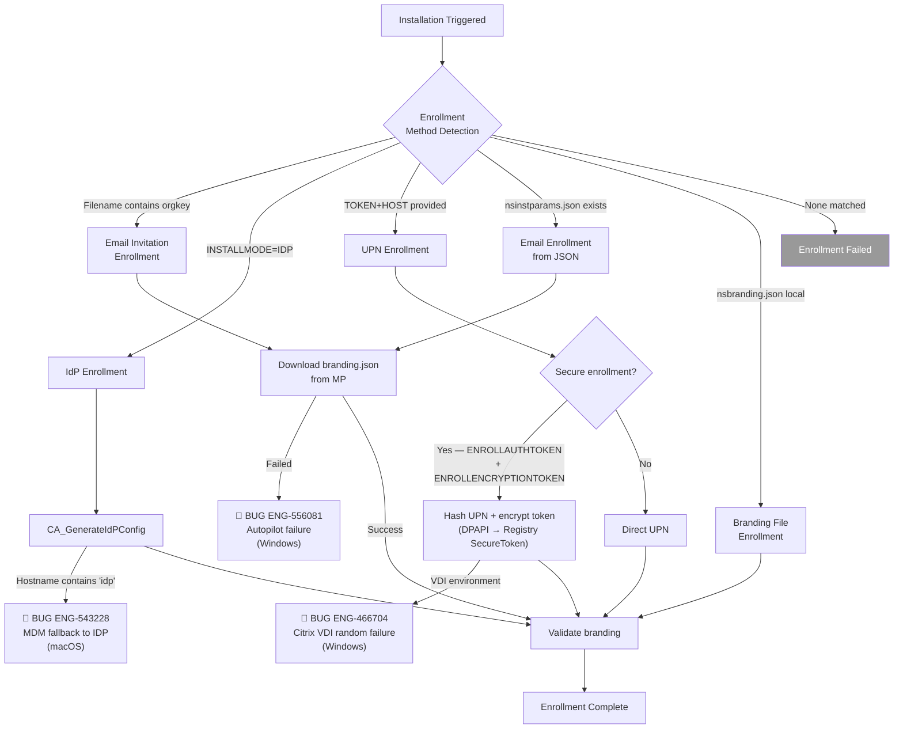

---

## Windows

**Bug Count**: 24 direct + 3 shared with macOS | **Key Gaps**: VDI scenarios, AOAC, Domain Controller, Self-Protection + Upgrade

Windows installation uses MSI (Microsoft Installer) with a series of Custom Actions (CA_*) that handle driver installation, service registration, enrollment, and branding. The `stAgentSvc` service polls MP every 240 minutes for new versions (via `CConfig::tryToUpgradeClient()` in `lib/nsConfig/config.cpp`). A separate `stAgentSvcMon` monitor process handles MSI install progress monitoring and retry on failure.

Windows accounts for **46% of all escalation bugs** — the largest share of any platform. The most dangerous failure pattern is the upgrade + FailClose interaction, where service restart during upgrade can leave WFP FilterDevice rules in an inconsistent state.

### Windows MSI Install Parameters

The MSI installer accepts the following parameters via `msiexec /i`. Incorrect parameter combinations are a common source of enrollment failures in MDM/Autopilot deployments.

**Enrollment Mode Parameters**:

| Parameter | Value | Description |
|---|---|---|
| `INSTALLMODE` | `idP` | IdP authentication enrollment |
| `INSTALLMODE` | `idPOnly` | IdP only (no UPN fallback) |
| `INSTALLMODE` | `EAM` | Enterprise Access Management integration |
| `TOKEN` | `<org_token>` | Organization token (UPN mode) |
| `HOST` | `<addon_host>` | Addon host (must start with `addon-`) |
| `TENANT` | `<hostname>` | Tenant hostname |
| `DOMAIN` | `<sp_domain>` | Service provider domain |
| `REQUESTEMAIL` | `<flag>` | Request email from user during enrollment |

**Security Feature Parameters**:

| Parameter | Value | Description |
|---|---|---|
| `ENROLLAUTHTOKEN` | `<token>` | Secure enrollment authentication token |
| `ENROLLENCRYPTIONTOKEN` | `<token>` | Secure enrollment encryption token |
| `FAIL-CLOSE` | `disable` / `no-npa` | Fail-close mode control |

**Configuration Parameters**:

| Parameter | Value | Description |
|---|---|---|
| `MODE` | `peruserconfig` | Multi-user mode (VDI environments) |
| `USERCONFIGLOCATION` | `<path>` | User config file location |
| `AUTOUPDATE` | `ON` / `OFF` | Auto-update control (default: `ON`) |
| `NPAVDIMODE` | `ON` / `OFF` | NPA VDI mode |
| `PRELOGONUSER` | `<username>` | Pre-logon user |
| `INSTTAG` | `<tag1,tag2,...>` | Device tags assigned during install |

**IdP External Browser Parameters** (NPLAN-6364):

| Parameter | Value | Description |
|---|---|---|
| `IDPMODE` | `scheme` | Enable external browser for IDP authentication |
| `HTTPMETHOD` | `get` / `post` | HTTP method for IDP (default: `post`) |

**Enforce Enrollment Parameters** (IDP mode only):

| Parameter | Value | Description |
|---|---|---|
| `ENFORCEENROLLSTEERINGPROFILEID` | `<profile_id>` | Steering profile ID |
| `ENFORCEENROLLFREQUENCY` | `1-1440` | Enrollment popup frequency in minutes (default: `5`) |

### Windows MSI Installation Flow

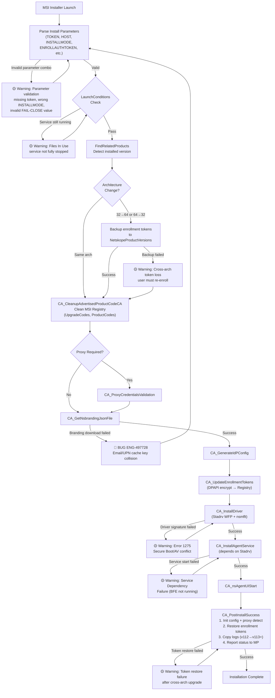

**Node Risk Assessment**:

| Node | Risk | Assessment |
|---|---|---|
| MSI Installer Launch | 🟢 Low | Standard Windows Installer entry point |
| Parse Install Parameters | 🟡 Medium | Invalid parameter combos (missing token, wrong INSTALLMODE, invalid FAIL-CLOSE) fail silently |
| LaunchConditions Check | 🟡 Medium | Files-in-use warning when service not stopped |
| FindRelatedProducts | 🔴 High | **ENG-446703** — Registry residue causing MSI pile-up |
| Architecture Change Detection | 🟡 Medium | 32→64 / 64→32 upgrade needs token backup; failure causes re-enrollment |
| CA_CleanupAdvertisedProductCodeCA | 🟡 Medium | Incomplete cleanup of UpgradeCodes/ProductCodes can leave orphans |
| CA_ProxyCredentialsValidation | 🟡 Medium | Proxy credential caching may cause auth loops |
| CA_GetNsbrandingJsonFile | 🔴 High | **ENG-497728** — Email/UPN cache key collision |
| CA_GenerateIdPConfig | 🟡 Medium | Misconfiguration could cause silent enrollment failure |
| CA_UpdateEnrollmentTokens | 🟡 Medium | DPAPI encrypt → Registry; token format must match |
| CA_InstallDriver | 🟡 Medium | Predicted: driver signature + Secure Boot conflict (Error 1275) |
| CA_InstallAgentService | 🟡 Medium | Predicted: service dependency (BFE not running) or startup order issue |
| CA_nsAgentUIStart | 🟢 Low | UI process launch; failure is non-critical |
| CA_PostInstallSuccess | 🟡 Medium | Multi-step: init config, restore tokens (cross-arch risk), migrate logs, report status |

**Confirmed Bug Mapping**:

| Flow Step | Known Bugs | Root Cause | Automation |
|---|---|---|---|
| FindRelatedProducts | ENG-446703 (MSI pile-up) | Registry residue causing duplicate detection | ❌ Not covered |
| CA_GetNsbrandingJsonFile | ENG-497728 (cache key collision) | Email vs UPN branding cache design flaw | ❌ Not covered |

**Predicted Risk Points (No Known Escalation)**:

| Flow Step | Predicted Risk | Potential Impact | Automation |
|---|---|---|---|
| Parse Install Parameters | Invalid parameter combo (missing token, wrong INSTALLMODE) | Silent enrollment failure, wrong FailClose mode | ❌ Not covered |
| Architecture Change Detection | Cross-arch (32→64) token backup failure | Enrollment tokens lost, user must re-enroll | ❌ Not covered |
| CA_CleanupAdvertisedProductCodeCA | Incomplete registry cleanup | Feeds into FindRelatedProducts MSI pile-up pattern | ❌ Not covered |
| CA_ProxyCredentialsValidation | Proxy credential caching auth loop | Install hangs or fails silently behind proxy | ❌ Not covered |
| CA_GenerateIdPConfig | IdP config mismatch for non-standard enrollment types | Silent enrollment failure post-install | ❌ Not covered |
| CA_InstallDriver | Driver signature + Secure Boot conflict | Error 1275, driver fails to load | ❌ Not covered |
| CA_InstallAgentService | Service dependency startup order (BFE not running) | Service fails to start after install | ❌ Not covered |
| CA_PostInstallSuccess | Token restore failure after cross-arch upgrade | Tokens not migrated, user must re-enroll | ❌ Not covered |

### Windows Auto-Upgrade Flow

The auto-upgrade flow is the most bug-prone area in Installation. `stAgentSvc` periodically checks MP for a newer version (every 240 minutes via `CConfig::tryToUpgradeClient()`), downloads the package, verifies its signature, and launches the MSI installer. In the legacy path, the separate `stAgentSvcMon` process monitors MSI install progress with up to 3 retries; in the new Watchdog path, the Upgrade Monitor Thread inside `stAgentSvc` handles this instead.

Three critical failure patterns have emerged from escalation bugs:
- **MSI pile-up** (ENG-446703): Failed installs leave residual MSI files that accumulate over retry cycles
- **Self-Protection blocking** (ENG-733657): Post-R125, the `disableWinStopServiceProtection` flag must be set or the service cannot be stopped for upgrade
- **Rollback version mismatch** (ENG-601667): Failed upgrades report the wrong version to MP

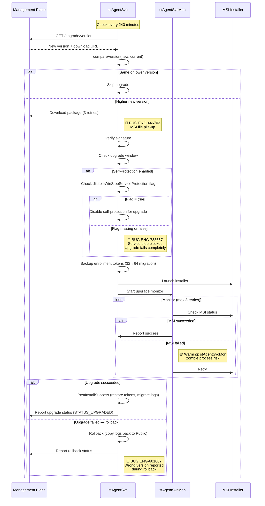

**Confirmed Bug Mapping**:

| Upgrade Step | Known Bugs | Severity | Impact | Automation |
|---|---|---|---|---|
| Package download | ENG-446703 (MSI pile-up) | S2 | Multiple MSIs accumulate consuming disk space | ❌ Not covered |
| Upgrade window check | ENG-733657 (flag missing) | S2 | R126→R129 upgrade completely fails | ⚠️ Partial — `upgrade_with_failclose/test_p0.py::test_01_auto_upgrade_with_failclose` |
| Version rollback | ENG-601667 (wrong version reported) | S3 | Backend displays wrong version | ❌ Not covered |

**Predicted Risk Points**:

| Upgrade Step | Predicted Risk | Severity Estimate | Automation |
|---|---|---|---|
| Signature verify | No signature validation bypass bug filed yet | S1 potential | ❌ Not covered |
| Monitor retry | Zombie process risk | S3 | ❌ Not covered |

### Windows Upgrade Monitor Retry Flow (Legacy Path)

In the legacy path (Watchdog feature flag OFF), the separate `stAgentSvcMon` process monitors MSI install progress. If the MSI fails, the monitor retries up to 3 times. However, if IPC communication times out, the monitor can become a zombie process that blocks future upgrades. When the Watchdog feature flag is ON, the Upgrade Monitor Thread inside `stAgentSvc` replaces this behavior (see Watchdog section below).

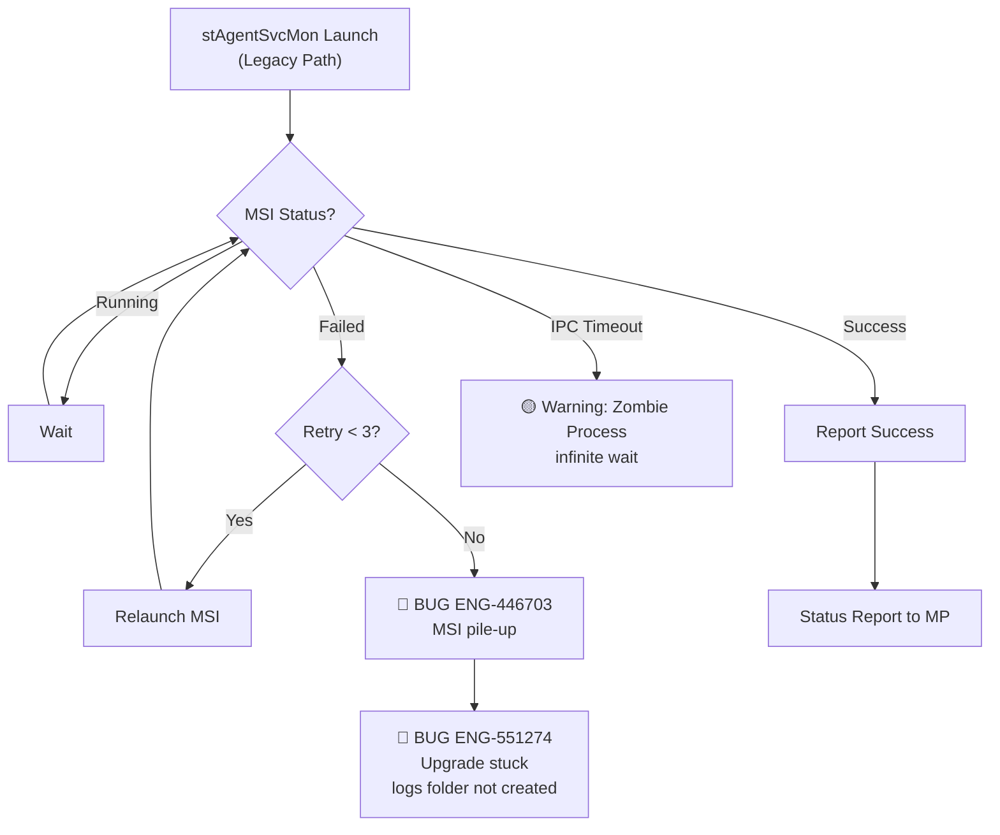

### Windows Watchdog in Install/Upgrade Context

The Watchdog feature provides automatic service recovery and upgrade resilience. Two threads run inside the main `stAgentSvc` process: the **Watchdog Thread** (monitors service health every 60 seconds) and the **Upgrade Monitor Thread** (detects aborted upgrades every 60 minutes, retries up to 3 times). A feature flag (`GetWatchdogMonitorEnabledFlag()`) controls whether the new integrated watchdog is used or the legacy `stAgentSvcMon` monitor service.

The critical interaction is between the Watchdog and the MSI installer: during upgrade, the MSI stops `stAgentSvc`, which the Watchdog would normally interpret as a crash. The `isClientUpgradeInProgress()` check (reads `UpgradeInProgress` registry flag) prevents the Watchdog from interfering. If the MSI crashes *before* setting this flag, a race condition can occur.

For the full Watchdog feature analysis (beyond install/upgrade scope), see [21. Watchdog](21_watchdog.md).

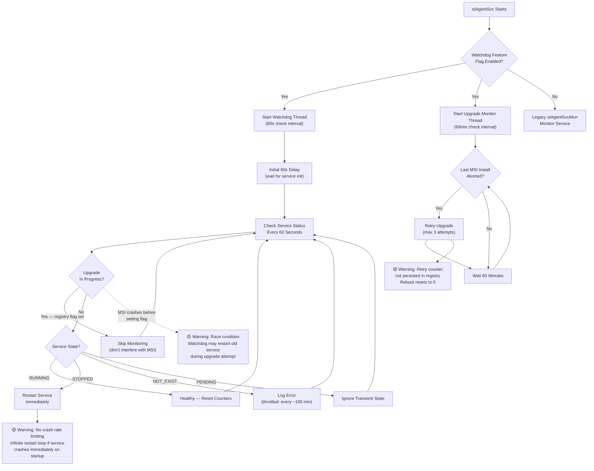

**Watchdog Components Installed**:

| Component | Executable | Startup | Purpose |
|---|---|---|---|
| Watchdog Thread | (inside `stAgentSvc.exe`) | Auto (with service) | Service crash detection + restart |
| Upgrade Monitor Thread | (inside `stAgentSvc.exe`) | Auto (with service) | Aborted upgrade detection + retry |
| stWatchdog (legacy) | `stAgentSvcMon.exe -watchdog` | Started by service | Legacy watchdog (feature flag OFF) |

**Watchdog + Upgrade Interaction**:

| Scenario | Watchdog Behavior | Risk |
|---|---|---|
| Normal upgrade (MSI sets UpgradeInProgress) | Skips monitoring during upgrade | None |
| MSI crashes before setting registry flag | May restart old service, conflicting with upgrade | 🟡 Race condition |
| System reboot during upgrade | Upgrade Monitor detects aborted MSI, retries | Retry counter resets on reboot |
| Service crash (non-upgrade) | Restarts within 60 seconds | No rate limiting — potential infinite loop |

**Key Code**: `stAgent/stAgentSvc/stAgentSvcEx.cpp` — `ThreadWatchdog()`, `ThreadUpgradeMonitor()`, `isClientUpgradeInProgress()`, `GetWatchdogMonitorEnabledFlag()`

### Windows Registry Reference

Windows installation writes, reads, and cleans up numerous registry keys. Understanding which keys persist across upgrades vs. which are removed on uninstall is essential for verifying correct install/upgrade behavior and debugging MSI pile-up issues (ENG-446703).

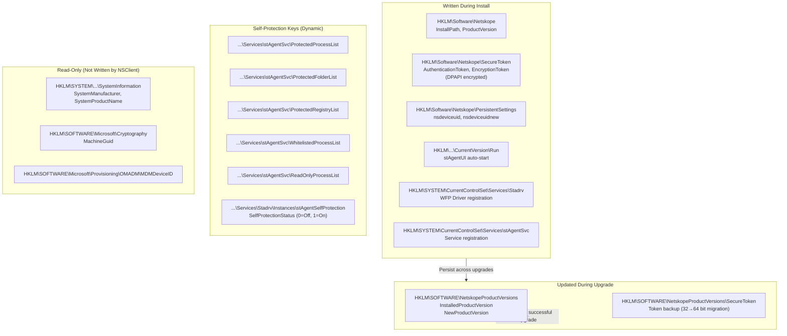

**Registry Key Lifecycle**:

| Registry Path | Key Values | Written | Persist Upgrade? | Removed on Uninstall? |
|---|---|---|---|---|
| `HKLM\Software\Netskope` | `InstallPath`, `ProductVersion` | Install | Yes (updated) | Yes |
| `HKLM\Software\Netskope\SecureToken\AuthenticationToken` | `data` (REG_BINARY), `size` (DWORD) | Install (DPAPI encrypted) | Yes | Yes |
| `HKLM\Software\Netskope\SecureToken\EncryptionToken` | `data` (REG_BINARY), `size` (DWORD) | Install (DPAPI encrypted) | Yes | Yes |
| `HKLM\Software\Netskope\PersistentSettings` | `nsdeviceuid`, `nsdeviceuidnew` | First run | Yes | Yes |
| `HKLM\Software\Netskope\Provisioning` | IdP provisioning data | Install (IdP mode) | Yes | Yes |
| `HKLM\Software\Netskope\bwan` | BWAN config subkeys | Runtime | Yes | Yes |
| `HKLM\...\CurrentVersion\Run` | `stAgentUI` (path to exe) | Install | Yes | Yes |
| `HKLM\SOFTWARE\NetskopeProductVersions` | `InstalledProductVersion`, `NewProductVersion`, `RollbackFailure` | Upgrade | Temp — cleaned after success | Yes |
| `HKLM\SOFTWARE\NetskopeProductVersions\SecureToken` | Token backup for 32→64 bit migration | Upgrade | Temp — restored then removed | Yes |
| `HKLM\SYSTEM\...\Services\stAgentSvc` | Service binary path, dependencies | Install | Yes (updated) | Yes |
| `HKLM\SYSTEM\...\Services\Stadrv` | Driver binary, load order group | Install | Yes (updated) | Yes |
| `...\Services\stAgentSvc\ProtectedProcessList` | Numbered entries → protected exe paths | Service start | Yes | Yes |
| `...\Services\stAgentSvc\ProtectedFolderList` | Numbered entries → install folder paths | Service start | Yes | Yes |
| `...\Services\stAgentSvc\ProtectedRegistryList` | Protected registry paths (Netskope, Stadrv, epdlp) | Service start | Yes | Yes |
| `...\Services\stAgentSvc\WhitelistedProcessList` | System processes (csrss, svchost, lsass) | Service start | Yes | Yes |
| `...\Services\stAgentSvc\ReadOnlyProcessList` | msiexec.exe (System32 + SysWOW64) | Service start | Yes | Yes |
| `...\Services\stAgentSvc\ReadOnlyFolderList` | Read-only protected paths | Service start | Yes | Yes |
| `...\Services\Stadrv\Instances\stAgentSelfProtection` | `SelfProtectionStatus` (DWORD: 0/1) | Service start | Yes | Yes |

**MSI Cleanup Keys** (removed during uninstall by `CA_CleanupAdvertisedProductCodeCA`):

| Registry Path | Purpose |
|---|---|
| `HKLM\SOFTWARE\Classes\Installer\Features\{ProductCode}` | MSI feature tracking |
| `HKLM\SOFTWARE\Classes\Installer\Products\{ProductCode}` | MSI product tracking |
| `HKLM\...\Installer\UserData\{SID}\Products\{ProductCode}` | Per-user MSI data |
| `HKLM\...\Installer\UserData\{SID}\Components\{ComponentCode}` | Per-component tracking |
| `HKLM\...\Installer\Managed\{SID}\Installer\Products\{ProductCode}` | Managed install tracking |
| `HKLM\SOFTWARE\Classes\Installer\UpgradeCodes\{UpgradeCode}` | Upgrade detection (shared: `a0a7215c-1c8e-4540-a699-96df5eaf016a`) |

**32-bit vs 64-bit Registry Views**:

| View | Path | When Used |
|---|---|---|
| 64-bit (native) | `HKLM\SOFTWARE\Netskope` | Default for 64-bit installer |
| 32-bit (WOW64) | `HKLM\SOFTWARE\WOW6432Node\Netskope` | 32-bit processes on 64-bit OS |
| Both views cleaned | Both paths deleted recursively | Uninstall always cleans both views |
| Token storage | Always `REG_VIEW_64BIT` | Even 32-bit installer stores tokens in 64-bit view |

**Credential Provider (V2CP) Registry** (when enabled):

| Registry Path | Purpose |
|---|---|
| `HKLM\...\Authentication\Credential Providers\{0322d1fa-...}` | Credential Provider registration (value: "nsV2CP") |
| `HKCR\CLSID\{0322d1fa-...}\InprocServer32` | COM class (ThreadingModel: "Apartment") |

---

### Windows 32-bit vs 64-bit Installation

The Windows installer ships in both 32-bit and 64-bit variants. While both use the same UpgradeCode (`a0a7215c-1c8e-4540-a699-96df5eaf016a`) allowing cross-architecture upgrades, there are important differences in component layout, driver files, and DLL packaging.

| Aspect | 32-bit Installer | 64-bit Installer |
|---|---|---|
| **WiX Project** | `wixinstaller/stagent.wixproj` | `wixinstaller64/stagent64.wixproj` |
| **Platform** | (no attribute — defaults to x86) | `Platform="x64"` |
| **Install Folder** | `C:\Program Files (x86)\Netskope\STAgent` | `C:\Program Files\Netskope\STAgent` |
| **ProgramFiles Variable** | `ProgramFilesFolder` | `ProgramFiles64Folder` |
| **WFP Driver** | Includes all 3 native drivers: `stadrv6x32.sys` (x86), `stadrv6x64.sys` (x64), `stadrv6x64.sys` (ARM64) — installs the one matching OS CPU architecture | Same 3 native drivers; installs matching one for OS CPU architecture |
| **V2CP (Credential Provider)** | Both `CMP_nsV2CPx32` + `CMP_nsV2CPx64` | Only `CMP_nsV2CPx64` |
| **Trampoline DLL** | `CMP_tloader` (32-bit loader) | `CMP_tramp64` (64-bit trampoline) |
| **EPDLP Module** | `epdlp_module.msm` | `epdlp_module_x64.msm` |
| **Registry View** | Writes to `WOW6432Node` path | Writes to native 64-bit path |
| **Token Storage** | Uses `REG_VIEW_64BIT` (64-bit view) | Uses `REG_VIEW_64BIT` (native) |
| **UpgradeCode** | `a0a7215c-1c8e-4540-a699-96df5eaf016a` | Same — enables cross-arch upgrade |

**Cross-Architecture Upgrade Flow** (32-bit → 64-bit):

When upgrading from a 32-bit to 64-bit installer (or vice versa), the installer performs token backup/restore through `NetskopeProductVersions\SecureToken`:

1. Pre-install: Backup enrollment tokens from current registry view to `NetskopeProductVersions\SecureToken`
2. Install: New architecture installer writes to its native registry view
3. Post-install (`CA_PostInstallSuccess`): Restore tokens from backup to new registry location
4. Cleanup: Remove temporary `NetskopeProductVersions` backup keys

---

### Windows Service and Driver Validation

After installation or upgrade, the following services and drivers should be verified. Service dependency ordering is critical — `stAgentSvc` depends on `Stadrv`, which depends on `TCPIP.sys`.

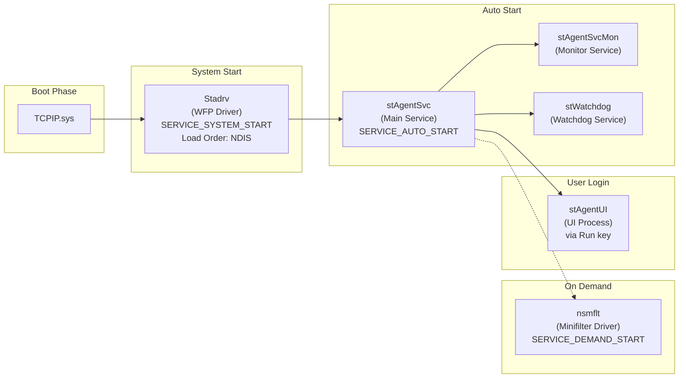

**Windows Services**:

| Service Name | Display Name | Executable | Startup Type | Dependencies | Purpose |
|---|---|---|---|---|---|
| `stAgentSvc` | Netskope Client Service | `stAgentSvc.exe` | Automatic | `Stadrv` | Core service — config, tunnel, steering |
| `stAgentSvcMon` | (Monitor) | `stAgentSvcMon.exe -monitor` | (Started by service) | `stAgentSvc` | Upgrade monitor, up to 3 retries |
| `stWatchdog` | (Watchdog) | `stAgentSvcMon.exe -watchdog` | (Started by service) | `stAgentSvc` | Service health watchdog |

**Windows Drivers**:

Both 32-bit and 64-bit installers bundle all three native driver versions. At install time, the installer detects the OS CPU architecture and installs only the matching driver binary.

| Driver Name | Display Name | Driver Files (3 architectures) | Type | Startup | Load Order | Dependencies |
|---|---|---|---|---|---|---|
| `Stadrv` | Netskope Client Driver | `stadrv6x32.sys` (x86), `stadrv6x64.sys` (x64), `stadrv6x64.sys` (ARM64 — separate folder) | WFP Callout (Kernel) | System Start | NDIS | TCPIP |
| `nsmflt` | Netskope mini-filter driver | `nsmflt32.sys` (x86), `nsmflt64.sys` (x64), `nsmflt64.sys` (ARM64 — separate folder) | File System Minifilter | Demand | FSFilter Content Screener | FltMgr |

**Driver Details**:

| Property | Stadrv (WFP) | nsmflt (Minifilter) |
|---|---|---|
| **Catalog File** | `stadrv6x.cat` | `nsmflt.cat` |
| **INF Signature** | `$Windows NT$` | `$Windows NT$` |
| **PnpLockdown** | `1` (prevents post-install modification) | — |
| **Self-Protection Instance** | `stAgentSelfProtection` (altitude `401350.5`) | — |
| **Minifilter Altitude** | — | `370030` |
| **Instance Name** | — | `Nsmflt Instance` |

**Service Failure Recovery Policy** (configured during install):

| Failure | Action | Delay |
|---|---|---|
| First failure | Restart service | 30 seconds |
| Second failure | Restart service | 30 seconds |
| Third failure | No action | — |
| Reset period | 1 hour (3600s) | — |

See [Standard Verification Checklist](#standard-verification-checklist-per-platform) for the complete per-platform validation commands.

**Programmatic Validation Functions** (from codebase):

| Function | File | What It Checks |
|---|---|---|
| `IsServiceRunning()` | `lib/nsWinSvc/nsWinSvcUtils.cpp` | Opens SC Manager → QueryServiceStatus → checks `SERVICE_RUNNING` |
| `IsServiceExist()` | `lib/nsWinSvc/nsWinSvcCtrl.cpp` | Opens SC Manager → attempts OpenService → returns handle success |
| `isBFERunning()` | `lib/nsFilterDevice/nsFilterDevice.cpp` | Validates Base Filtering Engine is running before WFP init |
| `StopDriverService()` | `installer/win/nsInstallerHelper/.../DriverInstall.cpp` | Interrogates → stops → waits up to 30s for `SERVICE_STOPPED` |
| `StartSTAgentDriver()` | `installer/win/nsInstallerHelper/.../DriverInstall.cpp` | StartService → monitors checkpoint progress → confirms `SERVICE_RUNNING` |
| `isPathChanged()` | `lib/nsWinSvc/nsWinSvcCtrl.cpp` | Compares service binary path against expected install path |

---

## macOS

**Bug Count**: 8 direct + 3 shared with Windows | **Key Gaps**: System Extension restart, AOAC/Dark Wake, DHCP interop

macOS installation uses a PKG installer that deploys a System Extension for network filtering. The uninstall process has two modes: **UPDATE** (preserves config, certs, device ID for upgrades) and **FULL** (removes everything). A key difference from Windows is that auto-upgrade is triggered via **launchd** rather than an internal monitor process.

The most critical macOS-specific issue is **ENG-773191**: after upgrading from R130→R131 on macOS 15.x, NPA traffic stops being tunneled because the transparent proxy stops when NPA is in DISABLED state.

### macOS Services and Extensions

| Component | Label / Name | Executable | Type | Recovery |
|---|---|---|---|---|
| Main daemon | `com.netskope.client.stAgentSvc` | `/Library/Application Support/Netskope/STAgent/stAgentSvc` | launchd daemon | `KeepAlive=true` (auto-restart) |
| UI agent | `com.netskope.client.stagentui` | `/Applications/Netskope Client.app/.../Netskope Client` | launchd user agent (Aqua session) | `KeepAlive=true` |
| Auxiliary service | `com.netskope.client.Netskope-Client.nsauxsvc` | `.../XPCServices/nsAuxiliarySvc` | XPC MachService | `KeepAlive=true` |
| App Proxy extension | Bundle ID (product-specific) | Network Extension (AppProxyProvider) | System Extension | Managed by NE framework |
| DNS Proxy extension | Bundle ID (product-specific) | Network Extension (DNSProxyProvider) | System Extension | Managed by NE framework |

**macOS Install Config Files** (placed in `/tmp/nsbranding/` before PKG install):

| File | Purpose |
|---|---|
| `silent.conf` | Value `"1"` for silent installation |
| `enroll.conf` | Enrollment tokens (auth + encryption) |
| `nsinstparams.json` | Email enrollment parameters (JSON) |
| `nsbranding.json` | Pre-staged branding file |

**macOS Log Locations**: `stdout`/`stderr` → `/Library/Logs/Netskope/stAgentSvc.out.log` and `.err.log`; auxiliary service → `/Library/Logs/Netskope/nsauxsvc.out.log` and `.err.log`

### macOS Installation & Upgrade Flow

macOS uses a PKG installer that deploys a System Extension (Network Extension) for network filtering. Auto-upgrade version polling is triggered via **launchd** (the macOS equivalent of the `CConfig::workerThread()` polling loop on Windows). The uninstall process has two modes: **UPDATE** (preserves config for upgrades) and **FULL** (removes everything). The most critical issue is ENG-773191 where NPA transparent proxy stops after upgrade on macOS 15.x.

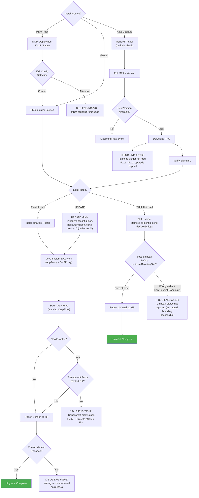

**Confirmed Bug Mapping**:

| Upgrade Step | Known Bugs | Severity | Impact | Automation |
|---|---|---|---|---|
| launchd trigger | ENG-472565 (not triggered) | S2 | R111→R114 upgrade does not start | ⚠️ Partial — `auto_upgrade/test_p0.py::test_05_auto_upgrade` exists but Linux only |
| Uninstall status | ENG-671884 (status not reported) | S3 | Backend doesn't know device was uninstalled | ❌ Not covered |
| MDM install | ENG-543228 (IDP misjudge) | S2 | JAMF script incorrectly detects enrollment mode | ❌ Not covered |
| NPA after upgrade | ENG-773191 (transparent proxy stops) | S1 | NPA traffic not tunneled after R130→R131 upgrade on macOS 15.x | ❌ Not covered |
| Version report | ENG-601667 (wrong version on rollback) | S3 | Backend displays wrong version | ❌ Not covered |

## Linux

**Bug Count**: 2 direct | **Key Gaps**: /tmp noexec, Ubuntu 24.04 support

Linux installation uses a self-extracting `.run` script (or `.deb`/`.rpm` packages). The installer extracts to `/tmp` by default and registers a **systemd** service. Enterprise Linux environments with security hardening (e.g., `/tmp` mounted as `noexec`) break this default path.

### Linux Services

| Service | Description | Executable | Type | Restart | Target |
|---|---|---|---|---|---|
| `stagentd.service` | Netskope client daemon | `/opt/netskope/stagent/stAgentSvc` | `simple` | `always` (10s delay) | `multi-user.target` |
| `stagentapp.service` | Netskope client Agent | `/opt/netskope/stagent/stAgentApp` | `simple` | `on-failure` (5s delay) | `default.target` |

**Linux .run Install Parameters**:

| Flag | Long Form | Description |
|---|---|---|
| `-H` | `--tenantHostname` | Tenant hostname |
| `-o` | `--orgkey` | Organization key |
| `-m` | `--email` | User email (email enrollment mode) |
| `-u` | `--upn` | User principal name (UPN enrollment mode) |
| `-i` | `--idp` | IDP enrollment mode |
| `-t` | `--tenantName` | Tenant name |
| `-d` | `--domain` | Tenant domain |
| `-f` | `--config` | Config file path |
| `-a` | `--enroll-auth-token` | Secure enrollment auth token |
| `-e` | `--enroll-encrypt-token` | Secure enrollment encryption token |
| `-c` | `--cli` | CLI-only mode (no GUI) |
| | `--autoUpgrading` | Auto-upgrade flag (internal) |

**Install Directory**: `/opt/netskope/stagent/`
**Logs**: `/opt/netskope/stagent/logs/`

### Linux Installation Flow

Linux supports three package formats (.run, .deb, .rpm), each with different deployment paths. The self-extracting .run script extracts to `/tmp` by default, which fails in enterprise-hardened environments where `/tmp` is mounted as `noexec`. The .deb package has a known compatibility issue with Ubuntu 24.04.

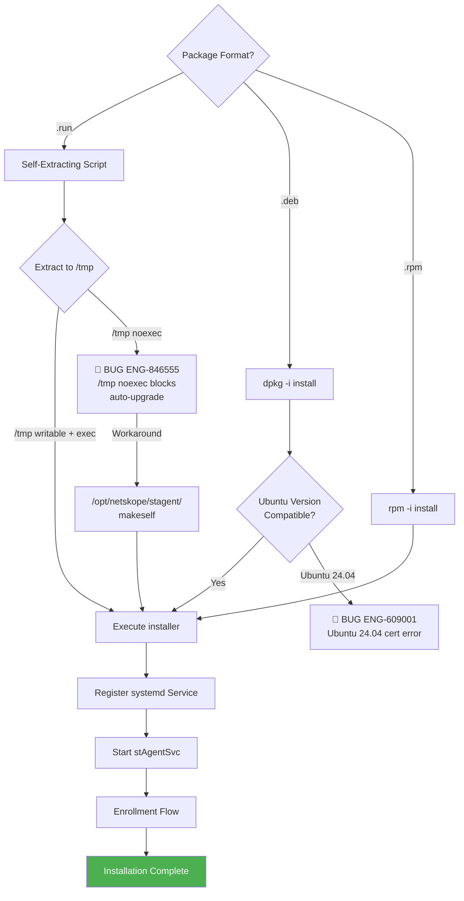

### Linux-Specific Bugs

| Bug ID | Problem Summary | Root Cause | Fix |
|--------|----------------|-----------|-----|
| **ENG-609001** | Ubuntu 24.04 cert error (.deb install) | .deb package not supported on Ubuntu 24.04 | Support newer Ubuntu versions |
| **ENG-846555** | Auto-upgrade + security hardening failure | Install script executes from /tmp; fails if /tmp mounted as noexec | Use /opt/netskope/stagent/makeself instead |

## Android

**Bug Count**: 1 direct | **Key Gaps**: Xiaomi enrollment, app store upgrade path

Android installation is handled through Google Play Store distribution. The client-side installation complexity is lower than desktop platforms, but device-specific issues (e.g., Xiaomi IDP enrollment) arise from vendor customizations.

### Android Installation & Enrollment Flow

Android installation goes through Google Play Store. The client has lower installation complexity than desktop platforms, but vendor-specific customizations (especially Xiaomi) introduce enrollment failures that are difficult to reproduce without physical devices.

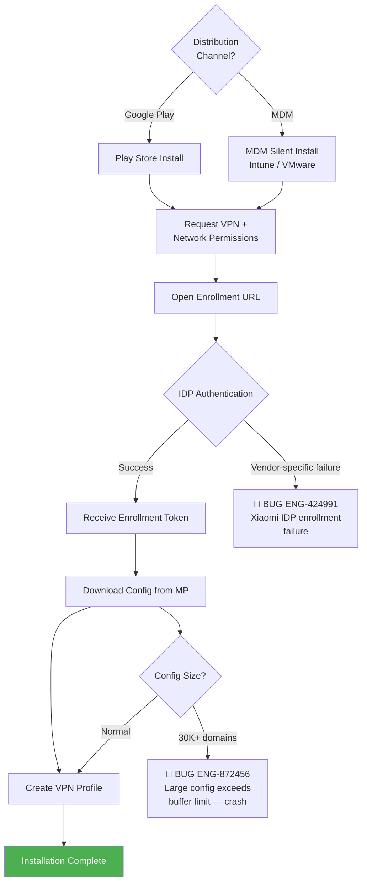

### Android-Specific Bugs

| Bug ID | Problem Summary | Root Cause | Fix |
|--------|----------------|-----------|-----|
| **ENG-424991** | Xiaomi Android enrollment failure | Xiaomi-specific IDP enrollment issue | Purchased Xiaomi device for regression testing |
| **ENG-872456** | 30K+ domains crash (shared with ChromeOS) | Large steering config exceeds buffer limit | Add volume test data preparation |

*No Android-specific test cases identified for Installation & Upgrade.*

---

## iOS

**Bug Count**: 1 direct | **Key Gaps**: Internal app access after upgrade

iOS installation is managed through Apple App Store or MDM (e.g., Intune, JAMF). The primary risk area is regression bugs where upgrades break existing functionality, as seen with ENG-450735 where internal apps became inaccessible after R114.

### iOS Installation & Upgrade Flow

iOS is distributed via Apple App Store or MDM. The primary risk is upgrade regressions — a fix for one bug can break existing functionality, as demonstrated by the ENG-441957 → ENG-450735 regression chain where internal apps became inaccessible after R114.

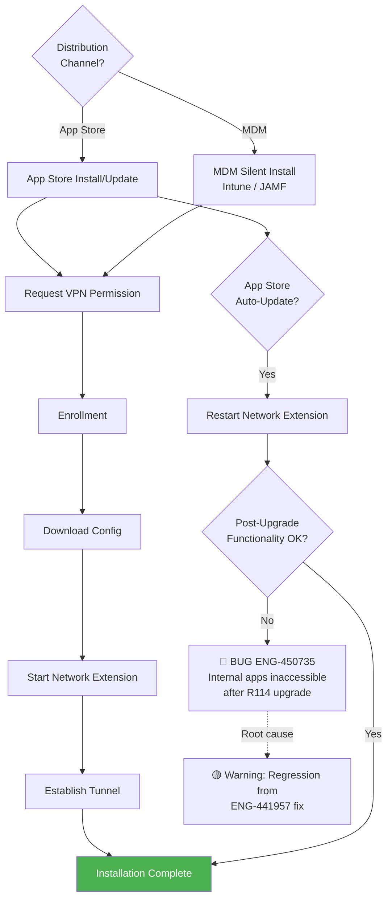

### iOS-Specific Bugs

| Bug ID | Problem Summary | Root Cause | Fix |
|--------|----------------|-----------|-----|
| **ENG-450735** | Internal apps inaccessible after R114 upgrade | Regression introduced by ENG-441957 fix | Add monthly regression coverage |

## ChromeOS

**Bug Count**: 1 | **Key Gaps**: Large domain crash after install

ChromeOS uses a Chrome extension-based installation. The primary known issue is shared with Android: large steering configs (30K+ domains) exceeding buffer limits cause crashes post-installation.

### ChromeOS Installation Flow

ChromeOS uses a Chrome extension distributed via Chrome Web Store or Google Admin Console. The extension communicates with the backend through Chrome APIs. The primary known issue is shared with Android: large steering configs (30K+ domains) exceeding buffer limits cause post-install crashes.

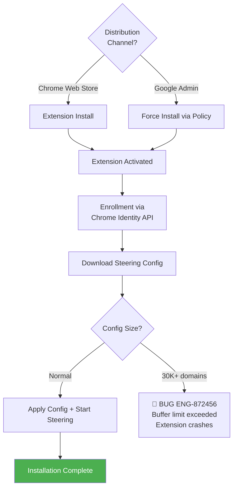

### ChromeOS-Specific Bugs

| Bug ID | Problem Summary | Root Cause | Fix |
|--------|----------------|-----------|-----|
| **ENG-872456** | 30K+ domains crash Android/ChromeOS | Large domain steering config exceeds buffer limit | Add volume test data preparation |

*No ChromeOS-specific test cases identified for Installation & Upgrade.*

---

## Backend

**Bug Count**: 2 | **Key Gaps**: JWT validation, branding cache

Backend issues affect enrollment across all platforms. The branding cache key collision (ENG-497728) is particularly insidious — the provisioner's common code doesn't differentiate between email-based and UPN-based enrollment cache keys, causing wrong branding to be served silently.

### Backend Enrollment & Provisioner Flow

Backend issues affect enrollment across all platforms. The branding cache key collision (ENG-497728) is particularly insidious — the provisioner's common code doesn't differentiate between email-based and UPN-based enrollment, causing wrong branding to be served silently. The JWT signature issue (ENG-608191) affects NPA addon config downloads.

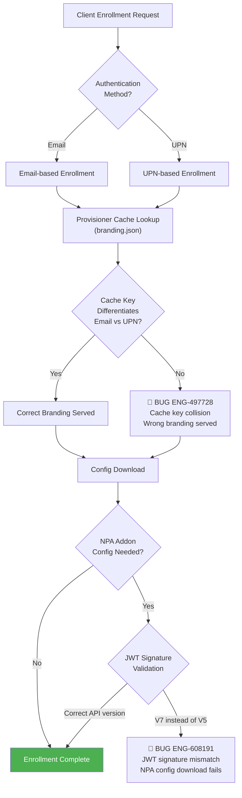

### Backend-Specific Bugs

| Bug ID | Problem Summary | Root Cause | Fix |
|--------|----------------|-----------|-----|
| **ENG-497728** | Email vs UPN branding cache key collision | Provisioner code doesn't differentiate email and UPN cache keys | Add qualifier to cache key |
| **ENG-608191** | NPA addon config JWT signature issue | Wrong authorize version used (V7 instead of V5) | Cover V2/V5/V7 API compatibility |

---

## Install/Upgrade with Features

Several security-sensitive features interact with the install/upgrade process. Each feature changes what gets written to disk, how enrollment works, or what must be preserved across upgrades. Testing install/upgrade without these features enabled misses real-world failure modes.

### Feature Interaction Matrix

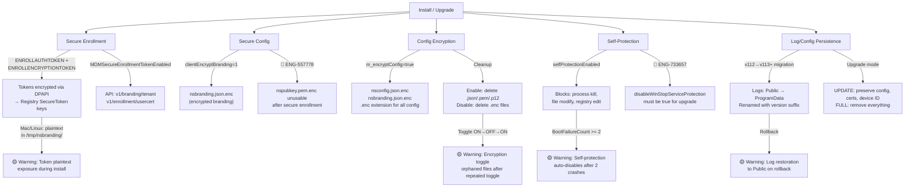

### Secure Enrollment

Secure enrollment encrypts enrollment tokens using DPAPI (Windows) before storing them in the registry. The feature is controlled by `MDMSecureEnrollmentTokenEnabled` and has three states: `NotConfigured`, `Enabled`, `Disabled`.

**MSI Parameters**: `ENROLLAUTHTOKEN=<token>` and `ENROLLENCRYPTIONTOKEN=<token>` (passed via `msiexec /i`)

**Token Storage** (Windows):
- Path: `HKLM\Software\Netskope\SecureToken\AuthenticationToken` and `\EncryptionToken`
- Format: `data` (REG_BINARY, DPAPI encrypted), `size` (DWORD)
- DPAPI flags: `CRYPTPROTECT_LOCAL_MACHINE` (machine-scoped)
- Entropy: `"This is global Entropy string"`
- Always stored in `REG_VIEW_64BIT` regardless of installer architecture

**Mac/Linux**: Tokens read from `/tmp/nsbranding/enroll.conf`, processed via `InstallerUtil --update_enrollment_tokens`

**API Endpoints**: `v1/branding/tenant` (branding download), `v1/enrollment/usercert` (certificate enrollment)

**Key Code**: `lib/nsEnrollmentToken/win/nsEnrollmentToken.cpp` — `saveEnrollmentTokens()`, `fetchAuthenticationToken()`, `fetchEncryptionToken()`

### Secure Config (clientEncryptBranding)

When `clientEncryptBranding=1`, the branding file is stored encrypted. This interacts with uninstall reporting — **ENG-671884** (macOS): `InstallerUtil --post_uninstall` call order must come before `uninstallAuxiliarySvc()` or the encrypted branding becomes inaccessible.

**ENG-557778** (Windows): After secure enrollment with this flag, `nspubkey.pem.enc` becomes unusable for remote log collection because neither Dev nor QE tested the Secure Config + encryptClientConfig combination.

### Config Encryption

Config encryption uses the `CEncryptedFile` class to transparently read/write `.enc` files. Controlled by `m_encryptConfig` flag.

**Encrypted Files**: `nsconfig.json.enc`, `nsbranding.json.enc`, `nsconfig.json.backup.enc`

**Never Encrypted** (ignored list): `nsinternal.json`, `nspubkey.pem`, `certutil.json`, `nsbranding.json` (prelogon copy), `nsenforceEnrollExceptions.json`

**Cleanup Behavior**:
- When encryption **enabled**: deletes plaintext `.json`, `.pem`, `.p12` files (except ignored list)
- When encryption **disabled**: deletes `.enc` files (except DEM patterns `dem_\d+\.json\.enc`)
- Cleanup only runs as root/SYSTEM (`sessionID == 0`)

**Platform Note**: macOS requires Big Sur or above for config encryption support.

**Key Code**: `lib/nsConfig/nsConfigSec.cpp` — `readConfigFile()`, `writeConfigFile()`, `setConfigEncryption()`

### Self-Protection During Install/Upgrade

Self-Protection uses the `Stadrv` WFP driver to protect Netskope processes, files, folders, and registry keys from modification. During upgrade, this creates a conflict — the MSI installer must stop the service, but Self-Protection blocks service stops.

**Critical Flag**: `disableWinStopServiceProtection` must be set to `true` (post-R125) or upgrade fails completely (**ENG-733657**).

**What Self-Protection Blocks**:

| Protection Type | Registry Key | What's Protected |
|---|---|---|
| Process kill | `...\stAgentSvc\ProtectedProcessList` | stAgentSvc.exe, stAgentUI.exe, nspacparser.exe, nsdiag.exe, BWAN executables |
| File modify | `...\stAgentSvc\ProtectedFolderList` | Installation directory (excludes BWAN path) |
| Registry edit | `...\stAgentSvc\ProtectedRegistryList` | `SOFTWARE\Netskope`, `Services\stAgentSvc`, `Services\Stadrv`, EPDLP services |
| File read-only | `...\stAgentSvc\ReadOnlyFolderList` | Read-only protected paths |

**Whitelisted Processes** (exempt from protection): `csrss.exe`, `svchost.exe`, `services.exe`, `lsass.exe`

**Read-Only Processes** (can read but not modify): `msiexec.exe` (from System32 and SysWOW64)

**Safety Mechanism**: If the driver crashes twice consecutively (`BootFailureCount` check), self-protection auto-disables.

**EPDLP Virtualization Folders** (also protected): `C:\Program Files\Netskope\EPDLP\win\nsvirt-backup`, `nsvirt-cache`

**Key Code**: `stAgent/stadrv/stadrv6x/selfprotection/SystemProtectionMgr.cpp` — `enableSystemProtection()`, `disableSystemProtection()`

### Log and Config File Persistence Across Upgrades

During upgrade, logs and config files must be preserved. Starting from v113, the log location migrated from `%PUBLIC%\netskope` to `%PROGRAMDATA%\netskope\stagent\Logs`.

**Files Preserved During Upgrade**:

| File | Source (v112-) | Destination (v113+) | Purpose |
|---|---|---|---|
| `nsdebuglog.log` / `_old.log` | `%PUBLIC%\netskope\` | `%PROGRAMDATA%\netskope\stagent\Logs\` | Main debug log |
| `npadebuglog.log` (`.1.log` through `.5.log`) | `%PUBLIC%\netskope\` | `%PROGRAMDATA%\netskope\stagent\Logs\` | NPA debug logs |
| `nsAppUI.log` / `_old.log` | — | `%PROGRAMDATA%\netskope\stagent\Logs\` | UI logs (v113+ only) |
| `nsInstallation.log` / `_old.log` | — | `%PROGRAMDATA%\netskope\stagent\Logs\` | Installation logs |
| `stAgentSvc.dmp` / `stAgentUI.dmp` | `%PUBLIC%\netskope\` | `%PROGRAMDATA%\netskope\stagent\Logs\` | Crash dumps |
| `STAUpdate.txt` | `%PUBLIC%\netskope\` | `%PROGRAMDATA%\netskope\stagent\Logs\` | Upgrade status |

**Upgrade Behavior**: Logs are renamed with version suffix (e.g., `nsdebuglog.112.log`) during v112→v113+ migration. On rollback, logs are copied back to the Public folder.

**macOS Uninstall Modes**:

| Mode | Config | Certs | Device ID | Logs | When Used |
|---|---|---|---|---|---|
| **UPDATE** | Preserved | Preserved | Preserved | Preserved | Upgrade (PKG re-install) |
| **FULL** | Removed | Removed | Removed | Removed | Complete uninstall |

**Key Code**: `stAgent/installer/win/nsInstallerHelper/.../CustomAction.cpp` — `copyLogsFromToProgramDataFolder()`

---

## Standard Verification Checklist (Per Platform)

After every install or upgrade, verify the following items. This checklist consolidates validation commands across platforms, cross-referencing the service/driver/registry details documented above.

### Windows Verification Checklist

**Service & Driver Checks**:

| # | Check | Command | Expected |
|---|---|---|---|
| 1 | Service running | `sc query stAgentSvc` | `STATE: 4 RUNNING` |
| 2 | Service startup type | `sc qc stAgentSvc` | `START_TYPE: 2 AUTO_START` |
| 3 | Service dependency | `sc qc stAgentSvc` | `DEPENDENCIES: Stadrv` |
| 4 | WFP driver running | `sc query Stadrv` | `STATE: 4 RUNNING`, `TYPE: 1 KERNEL_DRIVER` |
| 5 | BFE running | `sc query BFE` | `STATE: 4 RUNNING` |
| 6 | Minifilter loaded | `fltmc` | `nsmflt` at altitude `370030` (if EPDLP) |
| 7 | No zombie monitor | `tasklist /FI "IMAGENAME eq stAgentSvcMon.exe"` | Absent (unless upgrade in progress) |

**Registry Checks**:

| # | Check | Registry Path | Expected |
|---|---|---|---|
| 8 | UI auto-start | `HKLM\...\CurrentVersion\Run` → `stAgentUI` | Path to `stAgentUI.exe` |
| 9 | Product version | `HKLM\Software\Netskope` → `ProductVersion` | Expected version string |
| 10 | Device UID | `HKLM\Software\Netskope\PersistentSettings` → `nsdeviceuid` | Non-empty GUID |
| 11 | Self-protection | `HKLM\SYSTEM\...\Services\Stadrv\Instances\stAgentSelfProtection` → `SelfProtectionStatus` | `0x1` (on) or `0x0` (off) per config |
| 12 | Enrollment tokens | `HKLM\Software\Netskope\SecureToken\AuthenticationToken` | `data` + `size` values present (if secure enrollment) |
| 13 | No orphan UpgradeCodes | `HKLM\SOFTWARE\Classes\Installer\UpgradeCodes` | No stale Netskope entries |

**File System Checks**:

| # | Check | Path / Command | Expected |
|---|---|---|---|
| 14 | No MSI pile-up | `dir C:\Windows\Installer\*.msi /O-D` | No duplicate Netskope MSI files |
| 15 | Log location (v113+) | `%PROGRAMDATA%\netskope\stagent\Logs\nsdebuglog.log` | File exists and is being written |
| 16 | Config file | `%ProgramFiles%\Netskope\STAgent\nsconfig.json*` | `nsconfig.json` or `.enc` exists |
| 17 | Tunnel connected | UI tray icon or `nsdiag -s` | Tunnel established to gateway |

### macOS Verification Checklist

| # | Check | Command / Method | Expected Result |
|---|---|---|---|
| 1 | Service daemon running | `launchctl list` then grep `netskope` | `com.netskope.client.stAgentSvc` listed with PID |
| 2 | UI agent running | `launchctl list` then grep `stagentui` | `com.netskope.client.stagentui` listed |
| 3 | System Extension loaded | `systemextensionsctl list` | Netskope extension listed as `[activated enabled]` |
| 4 | Network Extension active | System Settings → Network → Filters | Netskope Client filter shown as active |
| 5 | Auxiliary service | `launchctl list` then grep `nsauxsvc` | XPC service listed |
| 6 | App bundle intact | `ls /Applications/Netskope\ Client.app` | App bundle exists |
| 7 | Config preserved (upgrade) | `ls /Library/Application\ Support/Netskope/STAgent/nsconfig.json*` | Config file exists |
| 8 | Branding preserved (upgrade) | `ls /Library/Application\ Support/Netskope/STAgent/nsbranding.json*` | Branding file exists |
| 9 | Device ID preserved (upgrade) | Compare `nsdeviceuid` before and after upgrade | Same GUID |
| 10 | Log files | `ls /Users/Shared/Netskope/` | `nsdebuglog.log` exists and is being written |
| 11 | NPA transparent proxy | Check if NPA traffic flows after upgrade | Proxy active (if NPA enabled) — **ENG-773191** risk |
| 12 | Uninstall reported | Check MP device list after uninstall | Device shows uninstalled status — **ENG-671884** risk |
| 13 | Tunnel connected | UI menu bar shows "Connected" | Tunnel established to gateway |

### Linux Verification Checklist

| # | Check | Command / Method | Expected Result |
|---|---|---|---|
| 1 | Daemon running | `systemctl status stagentd` | `active (running)` |
| 2 | Agent app running | `systemctl status stagentapp` | `active (running)` |
| 3 | Install directory | `ls /opt/netskope/stagent/stAgentSvc` | Binary exists |
| 4 | Config file | `ls /opt/netskope/stagent/nsconfig.json*` | Config exists |
| 5 | Log files | `ls /opt/netskope/stagent/logs/` | Log files exist and are being written |
| 6 | /tmp noexec check | `mount` then grep `/tmp.*noexec` | If noexec, verify `/opt/netskope/stagent/makeself` used — **ENG-846555** |
| 7 | Ubuntu 24.04 cert | (after .deb install) check cert errors in log | No cert errors — **ENG-609001** |
| 8 | Tunnel connected | `nsdiag -s` or check UI | Tunnel established to gateway |

---

## Cross-Flow Interactions

Installation & Upgrade interacts with Tunnel, Steering, and FailClose in ways that produce compound failures. Of the 174 total escalation bugs, **37 (21%) span multiple categories**, and the Installation + FailClose combination is one of the highest-risk intersections.

The core problem: during an upgrade, the service must stop (tearing down the tunnel) and restart (re-establishing the tunnel). If FailClose is active during this window, FilterDevice rules may persist in an inconsistent state — either permanently blocking or permanently bypassing traffic. See [11. FailClose](11_failclose.md#upgrade--failclose-chain-reaction) for detailed diagrams and analysis of the Upgrade + FailClose and VDI Multi-User scenarios.

### Cross-Flow Risk Matrix (Installation-Relevant)

| Interaction | Known Bugs | Severity | Test Priority |
|---|---|---|---|
| Upgrade + FailClose | ENG-733657, ENG-751720 | **S1** | P1 |
| VDI + enrollment + FailClose | ENG-570306, ENG-752117 | **S2** | P2 |
| Proxy + Upgrade + Tunnel | ENG-463329, ENG-593814 | **S2** | P2 |
| Upgrade + NPA | ENG-773191 | **S2** | P1 |
| Large config (30K) + Upgrade | (Predicted risk) | **S2** | P2 |

## Appendix A: Bug Quick Reference

> Problem summaries, root causes, and fixes for all Installation & Upgrade bugs referenced in this chapter. Sorted by Bug ID for quick lookup.

| Bug ID | Problem Summary | Root Cause | Fix | Platform |
|--------|----------------|-----------|-----|----------|
| **ENG-420917** | Devices not showing on Devices page | Backend migration issue, device status not synced correctly | Add device visibility verification test case | Win/Mac |
| **ENG-424991** | Xiaomi Android enrollment failure | Xiaomi-specific IDP enrollment issue | Purchased Xiaomi device for regression testing | Android |
| **ENG-446703** | MSI file pile-up: R108→R111 upgrade failure | Residual MSI files not cleaned after install failure, repeated retry causes accumulation | Partially fixed in R105/R107; need stronger negative scenario validation | Windows |
| **ENG-450735** | iOS internal apps inaccessible after R114 upgrade | Regression introduced by ENG-441957 fix | Add monthly regression coverage | iOS |
| **ENG-466704** | Citrix VDI secure enrollment random failure | Day-1: error handling bug when UPN secure enrollment fails | Fix enrollment failure error handling logic | Windows |
| **ENG-472565** | Mac auto-upgrade R111→R114 not triggered | Auto upgrade trigger conditions incomplete | Add more auto upgrade trigger scenario test coverage | macOS |
| **ENG-487939** | Upgrade fails when Self-Protection enabled | Regression from Log Improvement change, Self-Protection blocks service stop | Add Self-Protection scenarios to auto-upgrade flow | Windows |
| **ENG-497728** | Email vs UPN branding cache key collision | Provisioner common code doesn't differentiate email and UPN cache keys | Add qualifier to cache key to differentiate UPN and email | Backend |
| **ENG-533221** | Client disabled after scheduled upgrade, no error | Day-1: client disabled after scheduled upgrade with no error message | Add scheduled upgrade test cases | Windows |
| **ENG-543228** | MDM install script misjudges IDP mode | Mac install script incorrectly checks if hostname contains 'idp' keyword | Update JAMF script judgment logic | macOS |
| **ENG-551274** | R117→R120 upgrade stuck | Logs folder not created during upgrade (normally created by stAgentUI) | Corner case; add test case | Windows |
| **ENG-556081** | MS Autopilot enrollment failure | Enrollment flow not covered in Autopilot environment | Add Intune MDM environment testing | Windows |
| **ENG-557778** | Remote log collection fails (Steering Hardening) | nspubkey.pem.enc unusable after secure enrollment; neither Dev nor QE tested this | Add Secure Config + encryptClientConfig test case | Windows |
| **ENG-573164** | OTP disabled after consecutive wrong attempts | Backend API (addonman) crashes on incorrect payload (ENG-475524) | Fix backend OTP API payload validation | Windows |
| **ENG-591721** | NSComs multi-user deadlock | NSComs module can't handle socket connections between stAgentSvc and UI | Fix NSComs communication module connection handling | Windows |
| **ENG-593814** | Proxy detection fails after reboot, tunnel start delayed | `addonhost` not populated after reboot, proxy re-detection not triggered | Ensure proxy re-detection when addonhost is not populated | Windows |
| **ENG-601667** | Wrong version reported during rollback | Client reports incorrect version to backend during upgrade failure rollback | Fix version reporting logic during rollback | Windows |
| **ENG-608191** | NPA addon config JWT signature issue | `/v6/addon/publisher/config` uses `authorizeV7` instead of `authorizeV5` | NPA QE needs to cover V2/V5/V7 API compatibility | Backend |
| **ENG-609001** | Ubuntu 24.04 cert error (.deb install) | .deb package not supported on Ubuntu 24.04 | Enhancement: support newer Ubuntu versions | Linux |
| **ENG-637576** | DEM tenant ID reset to 0 | Token rotation error during config update, client resets tenant ID to '0' | Fix tenant ID protection logic during config update | Windows |
| **ENG-654108** | Citrix VPN traffic shows as SYSTEM, blocked by Defender | R122 design change: CFW mode IPv4/IPv6 exception handling moved to service level | Use `handleExceptionsAtDriver` FF for IPv6 exceptions | Windows |
| **ENG-671884** | Mac uninstall status not reported to backend | Only with `clientEncryptBranding=1`; `InstallerUtil --post_uninstall` call order incorrect | Move post_uninstall before uninstallAuxiliarySvc() | macOS |
| **ENG-726784** | AOAC upgrade creates duplicate device entries | AOAC devices never tested for Install/Upgrade, device UID generation falls back to legacy method | Add AOAC devices to test plan | Windows |
| **ENG-729176** | High CPU after Domain Controller installation | Massive SMB connections processed by driver in Web steering mode | Fix driver to only process web traffic in Web mode | Windows |
| **ENG-733657** | R126→R129 auto-upgrade failure | Post R125 must enable `disableWinStopServiceProtection: true` flag | Mandatory requirement to enable the flag | Windows |
| **ENG-773191** | NPA traffic not tunneled (R131 macOS) | macOS 15.x regression: transparent proxy stops when NPA in DISABLED state | Fix transparent proxy behavior after NPA state change | macOS |
| **ENG-846555** | Linux auto-upgrade + security hardening failure | Install script executes from /tmp; fails if /tmp mounted as noexec | If /tmp has noexec, use /opt/netskope/stagent/makeself instead | Linux |
| **ENG-872456** | 30K+ domains crash Android/ChromeOS | Large domain steering config exceeds buffer limit | Add volume test data preparation | ChromeOS |
| **ENG-925894** | Amazon Workspaces installation failure | Smart card DLL missing at VDI startup, DLL loading timing controlled by OS driver scheduler | Corner case, hard to reproduce | Windows |

## Appendix B: Methodology

### Severity Rating

| Level | Label | Definition | Impact Scope |
|---|---|---|---|
| **S1** | Critical | Complete network outage or security mechanism failure | All users, immediate impact |
| **S2** | High | Core functionality anomaly affecting connectivity | Most users under specific conditions |
| **S3** | Medium | Partial functionality failure or performance issue | Specific scenarios, workaround available |
| **S4** | Low | UI/Log anomaly or edge case | Few users, does not affect core functionality |
| **S5** | Enhancement | Feature improvement request | Not a bug |

### Test Case Format

| Field | Description |
|---|---|
| **Severity** | S1-S5 |
| **Related Bugs** | Related ENG-XXXXXX |
| **Flow Point** | Corresponding step in flow diagram |
| **Preconditions** | Prerequisites |
| **Steps** | Test steps |
| **Expected Result** | Expected result |
| **Gap Type** | Missing / Incomplete / Platform-specific |
| **Automation Priority** | P1 (must) / P2 (should) / P3 (manual OK) |
