# 02. Enrollment

**Escalation Bug Count**: 17 | **Test Gap**: 7 (50%) | **Corner Case**: 4 (29%) | **Day-1**: 2 (14%)

📋 **[Test Cases — Google Sheet](https://docs.google.com/spreadsheets/d/1ackCZ-EcepXw1BkSGoi5Go9Ex1I72-fXqcqLGMGiuio/edit?gid=1486840166#gid=1486840166)**

> This chapter covers the enrollment process — how a freshly installed NSClient registers with the Management Plane to obtain its configuration, certificates, and identity. Enrollment is the critical bridge between installation and normal operation: without successful enrollment, the client cannot steer traffic, establish tunnels, or enforce security policies. Each flow is illustrated with mermaid diagrams annotated with known escalation bug failure points (🔴 red) and predicted risk points (🟡 yellow).

---

## Executive Summary

**Why Enrollment Exists**

After installation, the NSClient binary is a generic agent with no tenant identity. Enrollment is the process by which the client authenticates against the Netskope Management Plane and receives:

1. **nsbranding.json** — Contains tenant-specific metadata: AddonManagerHost, UserKey, OrgKey, OrgName, SFCheckerHost, tenantID. This is the client's "identity card".
2. **nsconfig.json** — The full tenant configuration: steering rules, tunnel endpoints, feature flags, etc.
3. **Certificates** — Root CA cert (nscacert.pem), user cert (nsusercert.p12), and tenant cert (nstenantcert.pem) for TLS interception and tunnel authentication.
4. **Device Identity** — A unique device ID registered with the backend for device management and classification.

Without these artifacts, the client is inert.

**Design Decision: Multiple Enrollment Methods**

Netskope supports diverse enterprise deployment scenarios — from user-driven email invitations to fully automated MDM pushes. Rather than mandating a single enrollment mechanism, the client implements a priority-based detection system that selects the appropriate method from the available inputs. This flexibility is the source of both power and complexity: the detection logic must handle edge cases where inputs are ambiguous (e.g., ENG-543228 where a hostname containing "idp" was misidentified as IdP mode).

**Design Decision: Secure Enrollment**

For enterprises requiring higher security, secure enrollment encrypts the branding data in transit using AES with a per-tenant nonce. The encryption token is passed as an MSI property and stored in platform-specific secure storage (Windows DPAPI, macOS Keychain, Linux encrypted file). This prevents branding data interception on the network, but introduces a new failure mode when the encryption token is missing or corrupt (ENG-557778).

---

## Enrollment Methods

NSClient supports seven enrollment methods, each suited to different deployment scenarios:

| Method | Enum Value | Trigger | Use Case |
|--------|-----------|---------|----------|
| **Email Invitation** | `emailInvitaion` (1) | MSI filename contains orgkey tokens | User clicked email invite link, downloaded personalized installer |
| **Install Param Email** | `installParamEmail` (2) | `nsinstparams.json` exists alongside installer | MDM pre-stages a JSON file with TenantHostName, Email, OrgKey |
| **Branding File** | `brandingFile` (3) | `nsbranding.json` exists alongside installer | Pre-provisioned branding bundled with installer package |
| **Active Directory (UPN)** | `activeDirectory` (4) | TOKEN + HOST provided, or multiUser mode | AD-joined machines; UPN looked up from directory |
| **IdP** | `idP` (5) | INSTALLMODE=IDP, or fallback default | Browser-based SAML/OAuth; user authenticates via corporate IdP |
| **IdP Only** | `idPOnly` (6) | INSTALLMODE=idPOnly | IdP without UPN fallback; for non-AD environments |
| **EAM** | `eamMode` (7) | INSTALLMODE=EAM + HOST + TOKEN | Enterprise Access Management (e.g., Imprivata) integration |

---

## Enrollment Method Detection

The client determines which enrollment method to use through a priority-based detection algorithm. This logic runs during installation (in the MSI Custom Action on Windows, the InstallerHelper on Linux, or the pre-install script on macOS). The detection is not purely declarative — it falls through from the most specific method to the most general.

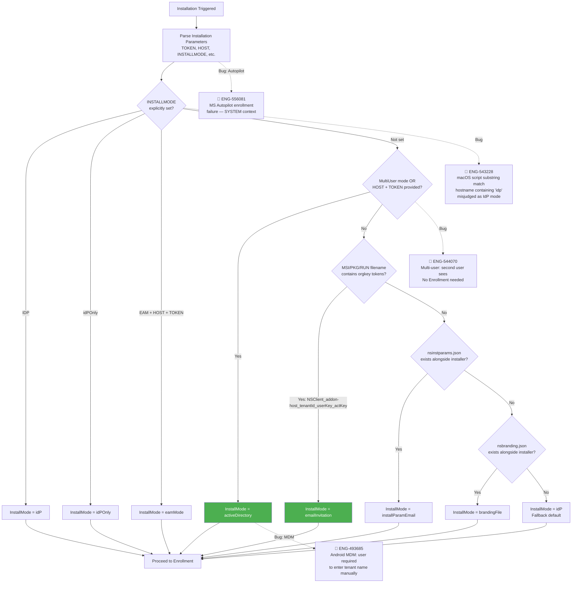

**Node Risk Assessment**:

| Node | Risk | Assessment |
|---|---|---|
| Parse Installation Parameters | 🔴 High | **ENG-556081** — Autopilot: SYSTEM context has no user session |
| INSTALLMODE check | 🔴 High | **ENG-543228** — macOS script substring match misjudges mode |
| MultiUser / HOST+TOKEN | 🔴 High | **ENG-544070** — Second user sees "No Enrollment needed" if branding exists |
| Filename parsing | 🟡 Medium | Filename rename or special characters cause fallthrough |
| nsinstparams.json check | 🟢 Low | File existence check, straightforward |
| IdP fallback | 🟡 Medium | Predicted: orphaned config files from failed earlier steps |

**Confirmed Bug Mapping**:

| Flow Step | Known Bugs | Root Cause | Automation |
|---|---|---|---|
| INSTALLMODE detection | ENG-543228 (macOS IDP misjudge) | Substring match instead of exact match for "idp" | ❌ Not covered |
| MultiUser mode | ENG-544070 (No Enrollment needed) | Branding file already exists from first user | ❌ Not covered |
| Autopilot context | ENG-556081 (SYSTEM context failure) | No user session during OOBE phase | ❌ Not covered |

The full detection priority chain is visualized in the flowchart above (`InstallOptions::setInstallMode()`). The filename parsing (`parseMsiFilename()`) splits the MSI filename by underscore (`_`) and expects exactly 5 tokens: `NSClient`, addonHost, tenantID, userKey, activationKey. If the filename does not match this pattern (e.g., it was renamed), the method falls through to the next check.

---

## Email Invitation Enrollment

Email invitation is the simplest enrollment method. The administrator sends an invitation email to the user containing a download link. The link URL embeds tenant-specific parameters in the installer filename itself.

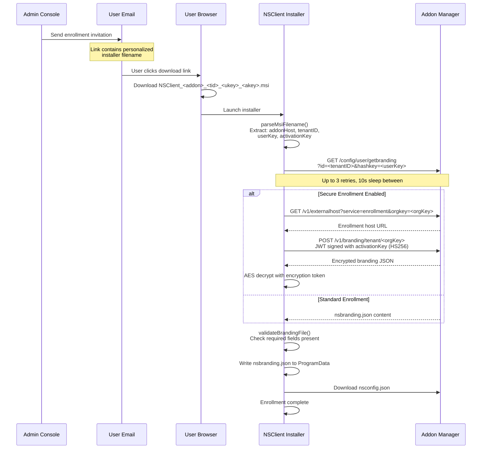

**Branding File Validation**: After download, the installer validates the branding file by checking that essential fields are present: `AddonManagerHost`, `UserKey`, `OrgKey`, `OrgName`, `SFCheckerHost`, `tenantID`. If the addon manager returns `{"status":"error"}`, individual key validity check catches it.

**API Endpoint**:
```
GET https://<addonHost>/config/user/getbranding?id=<tenantID>&hashkey=<userKey>
```

**Response** (nsbranding.json structure):
```json
{
    "branding": {
        "AddonManagerHost": "addon-corp.goskope.com",
        "AddonCheckerHost": "addonchecker-corp.goskope.com",
        "SFCheckerHost": "sfchecker-corp.goskope.com",
        "SFCheckerIP": "163.116.x.x",
        "UserEmail": "user@corp.com",
        "UserKey": "abcdef123456",
        "OrgKey": "xyz789",
        "OrgName": "Corp Inc",
        "tenantID": "12345",
        "ValidateConfig": false,
        "EncryptBranding": false
    },
    "status": "success",
    "message": ""
}
```

---

## IdP Enrollment

IdP enrollment uses a browser-based SAML or OAuth flow. The user authenticates through their corporate Identity Provider (Okta, Azure AD, Ping Identity, etc.), and the IdP returns a JWT token that the NSClient service exchanges for branding data. This is the most flexible method and serves as the default fallback.

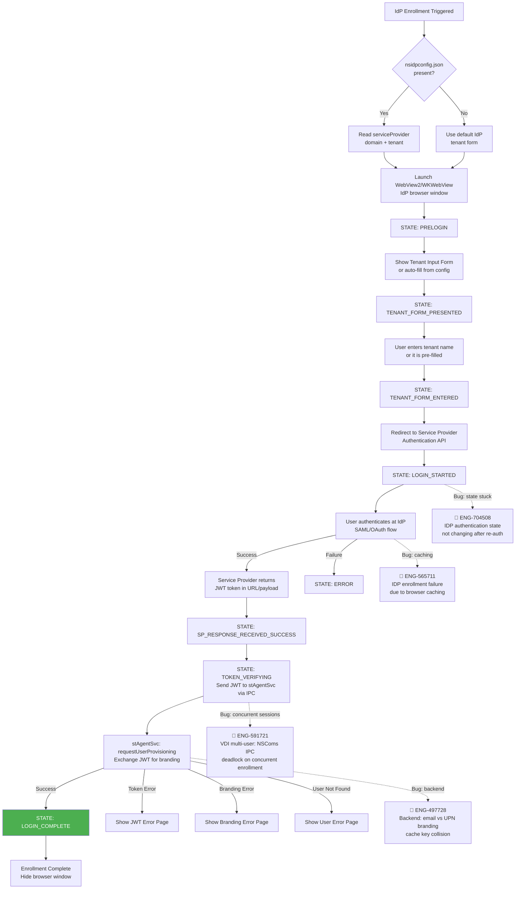

### IdP Workflow States

The IdP enrollment follows a state machine defined by `NS_LOGIN_WORKFLOW_STATE`:

| State | Value | Description |
|-------|-------|-------------|
| `NS_IDP_WORKFLOW_STATE_PRELOGIN` | 1 | Initial state before any user interaction |
| `NS_IDP_WORKFLOW_STATE_TENTANT_FORM_PRESENTED` | 2 | Tenant input form displayed to user |
| `NS_IDP_WORKFLOW_STATE_TENTANT_FORM_ENTERED` | 3 | User has entered tenant name |
| `NS_IDP_WORKFLOW_STATE_LOGIN_STARTED` | 4 | Redirect to IdP initiated |
| `NS_IDP_WORKFLOW_STATE_SERVICE_PROVIDER_RESPONSE_RECEIVED_FAILURE` | 5 | IdP returned error |
| `NS_IDP_WORKFLOW_STATE_SERVICE_PROVIDER_RESPONSE_RECEIVED_SUCCESS` | 6 | IdP returned JWT token |
| `NS_IDP_WORKFLOW_STATE_TOKEN_VERIFYING` | 7 | JWT being verified by service |
| `NS_IDP_WORKFLOW_STATE_TOKEN_VERIFY_FAILURE` | 8 | JWT verification failed |
| `NS_IDP_WORKFLOW_STATE_LOGIN_COMPLETE` | 9 | Enrollment successful |
| `NS_IDP_WORKFLOW_STATE_ERROR` | 10 | Unrecoverable error |

### IdP Work Modes

The IdP provisioning system supports multiple work modes beyond initial enrollment:

| Mode | Enum | Description |
|------|------|-------------|
| `NS_IDP_WORK_MODE_ENROLL` | 0 | First-time enrollment |
| `NS_IDP_WORK_MODE_REAUTH` | 1 | Re-authentication after enrollment (e.g., cert expired) |
| `NS_IDP_WORK_MODE_REAUTH_PARTNER` | 2 | Re-authentication for NPA partner tenant |
| `NS_IDP_WORK_MODE_PARTNER_ENROLL` | 3 | NPA partner tenant enrollment |

### IdP Browser Modes

The `nsidpconfig.json` file controls how the IdP browser window is presented:

| Mode | Value | Description |
|------|-------|-------------|
| Embedded | `NS_IDP_EMBEDDED` (0) | Built-in WebView2 (Windows) or WKWebView (macOS) |
| App Link | `NS_IDP_APPLINK` (1) | Opens system browser, uses HTTPS scheme |
| Custom Scheme | `NS_IDP_CUSTOM_SCHEME` (2) | Opens system browser, uses `netskopeclient://` scheme for callback |

**nsidpconfig.json Format**:

```json
{
    "serviceProvider": {
        "domain": "goskope.com",
        "tenant": "corp",
        "mode": "scheme",
        "preferEphemeral": true,
        "httpMethod": "post"
    },
    "requestEmail": "true"
}
```

### IdP Provisioning Response Codes

When the service processes the JWT token exchange, it returns one of these status codes:

| Status | Enum | Description |
|--------|------|-------------|
| Unknown | `NS_IDP_PROV_REQ_STATUS_UNK` (0) | Initial/unknown state |
| Provisioned | `NS_IDP_PROV_REQ_STATUS_PROVISIONED` (1) | Success |
| Token Error | `NS_IDP_PROV_REQ_STATUS_TOKEN_ERROR` (2) | Invalid or expired JWT |
| Branding Error | `NS_IDP_PROV_REQ_STATUS_BRANDING_FILE_ERROR` (3) | Failed to download branding |
| User Not Found | `NS_IDP_PROV_REQ_STATUS_USER_NOT_PRESENT_ERROR` (4) | User not provisioned in tenant |
| IPC Error | `NS_IDP_PROV_REQ_STATUS_NSCOM_ERROR` (5) | Communication failure between UI and service |
| Internal Error | `NS_IDP_PROV_REQ_STATUS_INTERNAL_ERROR` (6) | Unexpected error |
| Window Closed | `NS_IDP_PROV_REQ_STATUS_USER_CLOSED_WINDOW` (7) | User dismissed the browser |
| Encrypted Branding | `NS_IDP_PROV_REQ_STATUS_BRANDING_FILE_ENCRYPTED` (8) | Branding is encrypted (secure enrollment) |

---

## UPN (Active Directory) Enrollment

UPN enrollment is designed for AD-joined machines deployed via MDM (Intune, SCCM, JAMF). The installer receives the `TOKEN` (OrgKey) and `HOST` (addon hostname) as parameters, looks up the user's UPN from the local directory, and uses it to download the branding file.

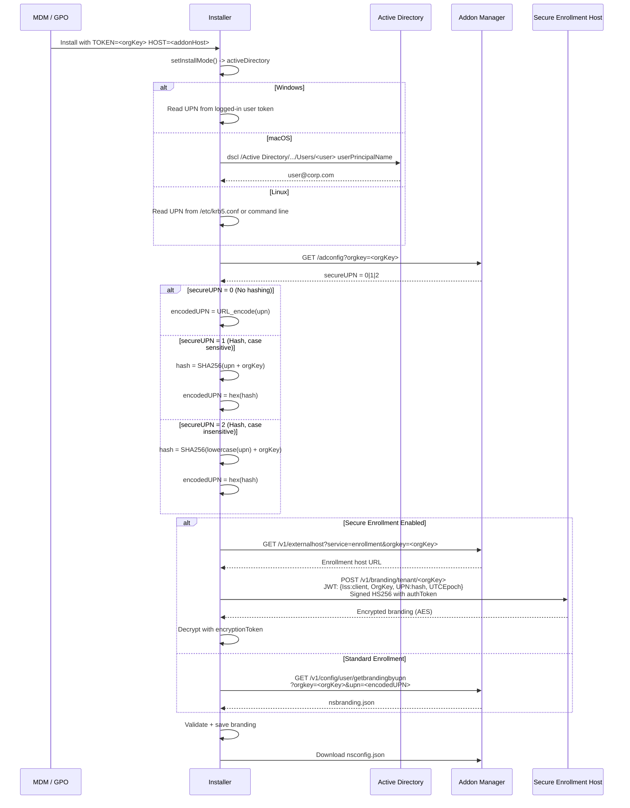

### UPN Hashing Algorithm

The UPN hashing is controlled by the `secureUPN` flag returned from the `/adconfig` API:

| secureUPN | Behavior |
|-----------|----------|
| 0 | No hashing; UPN sent as-is (URL-encoded) |
| 1 | SHA256(UPN + OrgKey), case-sensitive UPN |
| 2 | SHA256(lowercase(UPN) + OrgKey), case-insensitive |

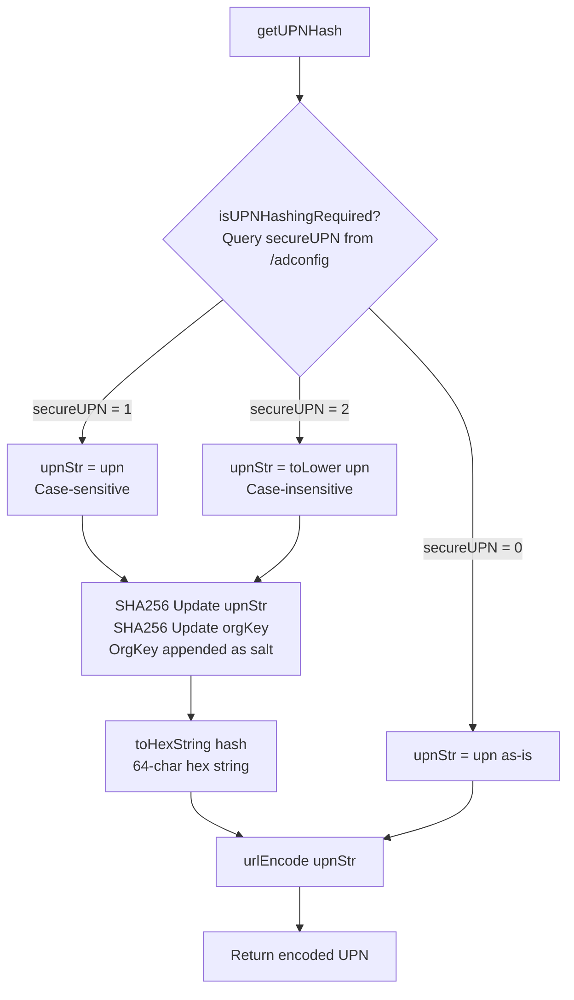

**API Endpoints**:

| API | Purpose |
|-----|---------|
| `GET /adconfig?orgkey=<orgKey>` | Query UPN hashing policy (secureUPN flag) |
| `GET /v1/config/user/getbrandingbyupn?orgkey=<orgKey>&upn=<encodedUPN>` | Download branding by UPN (v1 API) |
| `GET /v5/config/user/getbrandingbyupn?orgkey=<orgKey>&upn=<encodedUPN>` | Download branding by UPN (v5 API) |

---

## Secure Enrollment

Secure enrollment adds a layer of encryption and authentication on top of standard enrollment. When enabled, the branding data and user certificate are transmitted encrypted, and the enrollment request is authenticated with a JWT signed using an enrollment token.

### Architecture

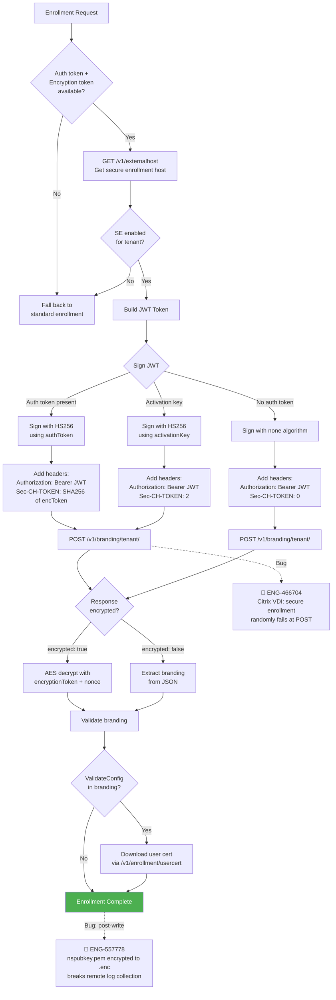

### JWT Token Structure

The secure enrollment JWT contains these claims:

```json
{
    "Iss": "client",
    "OrgKey": "<orgKey>",
    "<idKey>": "<idValue>",
    "UTCEpoch": 1714000000,
    "nbf": 1713999700,
    "exp": 1714000300
}
```

Where `<idKey>/<idValue>` varies by enrollment type:

| Enrollment Type | idKey | idValue |
|----------------|-------|---------|
| Email (IdP) | `UserEmail` | `user@corp.com` |
| UPN | `UPN` | SHA256 hash of UPN |
| Activation Key | `UserKey` | Raw user key |
| User Cert download | `UserKey` | Raw user key |

The JWT is signed using HS256 with either the `authToken` or the `activationKey` as the secret. If no auth token is available, the JWT is signed with `algorithm::none` (no signature).

### Encryption Token Handling

The `Sec-CH-TOKEN` header tells the server what level of token security the client has:

| Header Value | Meaning |
|-------------|---------|
| `0` | No encryption token available |
| `1` | Encryption token present but hash generation failed |
| `2` | Activation key enrollment (implicit token) |
| `<hex>` | SHA256 hex hash of the encryption token |

### Secure Branding Response

```json
{
    "encrypted": true,
    "nonce": "<hex-encoded-nonce>",
    "branding": "<base64-encoded-AES-encrypted-branding-JSON>"
}
```

When `encrypted` is true, the client decrypts the branding field using AES with the encryption token as the key and the nonce as the IV. When false, the branding is returned as a plain JSON object.

### Token Storage by Platform

| Platform | Auth Token Storage | Encryption Token Storage |
|----------|-------------------|------------------------|
| Windows | Registry `HKLM\Software\Netskope\SecureToken\AuthenticationToken` encrypted with DPAPI | Registry `HKLM\Software\Netskope\SecureToken\EncryptionToken` encrypted with DPAPI |
| macOS | Keychain `com.netskope.client.branding.authToken` | Keychain `com.netskope.client.branding.encryptToken` |
| Linux | Encrypted file `.eetk` in config directory | Same encrypted file |

**Windows DPAPI Details**: The tokens are encrypted using `CryptProtectData()` with `CRYPTPROTECT_LOCAL_MACHINE` flag and a static entropy string (`"This is global Entropy string"`). The encrypted blob and its size are stored as REG_BINARY and REG_DWORD values respectively under the 64-bit registry view.

---

## Enforce Enrollment

Enforce Enrollment is a feature that ensures unenrolled users in an IdP deployment cannot bypass enrollment. When enabled, the client applies a restricted steering profile that blocks most traffic while allowing only enrollment-related traffic through.

### Configuration

Enforce Enrollment requires these MSI parameters:

| Parameter | Description |
|-----------|-------------|
| `ENFORCEENROLLSTEERINGPROFILEID` | Steering profile ID to apply during enforcement |
| `ENFORCEENROLLFREQUENCY` | Popup frequency in minutes (1-1440, default 5) |
| `HOST` | Addon Manager host |
| `TOKEN` | Organization token |
| `TENANT` | Tenant hostname |
| `DOMAIN` | Service provider domain |

All six parameters (TENANT, DOMAIN, HOST, TOKEN, plus the enforce-specific ones) must be provided together. If `ENFORCEENROLLSTEERINGPROFILEID` is set without the others, installation fails.

The enforcement state is stored in `nsuserconfig.json`:

```json
{
    "nsUserConfig": {
        "enablePerUserConfig": false,
        "host": "addon-corp.goskope.com",
        "token": "<orgKey>",
        "enforceEnrollment": {
            "steeringProfileID": "<profile-id>",
            "frequency": "5"
        },
        "autoupdate": "true"
    }
}
```

When enforce enrollment is active, the installer does NOT download `nsconfig.json` during installation — the service will handle config download after IdP enrollment completes. The exception domains for enforce enrollment are stored in `nsenforceEnrollExceptions.json`.

---

## Platform-Specific Enrollment

### Windows (MSI Custom Actions)

Windows enrollment is orchestrated by a series of MSI Custom Actions that run during installation. The execution order is defined in the WiX installer `Product.wxs`:

```
CA_GetUserConfigJsonFile  -->  CA_GetNsbrandingJsonFile  -->  CA_GenerateIdPConfig  -->  CA_UpdateEnrollmentTokens
```

**CA_GetUserConfigJsonFile** (`GetUserConfigJsonFile()`):
- Generates `nsuserconfig.json` from MSI properties for UPN/IdP/EAM modes
- Validates that TOKEN and HOST are consistent (both present or both absent)
- For multi-user (peruserconfig) mode, creates the user config directory structure
- Validates prelogon user format: must end with `@prelogon.netskope.com`
- Writes enforce enrollment settings if `ENFORCEENROLLSTEERINGPROFILEID` is set

**CA_GetNsbrandingJsonFile** (`GetNsbrandingJsonFile()`):
- The core enrollment action; behavior depends on detected InstallMode:

| InstallMode | Action |
|-------------|--------|
| `emailInvitation` | `DownloadBrandingFileFromLicenseKey()` — Download via activation key |
| `installParamEmail` | `DownloadBrandingFileFromJSONFile()` — Download via email from nsinstparams.json |
| `brandingFile` | `CopyLocalBrandingFile()` — Copy local nsbranding.json to ProgramData |
| `idP` / `idPOnly` | Skip (enrollment happens later via IdP browser) |
| `activeDirectory` | Skip (enrollment happens at user logon via UPN) |
| `eamMode` | Skip (enrollment happens via EAM integration) |

- After successful branding download, also downloads `nsconfig.json` (unless enforce enrollment is active)
- All download operations retry up to 3 times

**CA_GenerateIdPConfig** (`GenerateIdPConfig()`):
- Creates `nsidpconfig.json` from MSI parameters: DOMAIN, TENANT, REQUESTEMAIL, IDPMODE, HTTPMETHOD
- If not in IdP mode, deletes any existing `nsidpconfig.json`
- For multi-user mode, DOMAIN and TENANT are mandatory

**CA_UpdateEnrollmentTokens** (`updateEnrollmentTokens()`):
- Reads `ENROLLAUTHTOKEN` and `ENROLLENCRYPTIONTOKEN` from MSI properties
- Encrypts tokens with DPAPI and stores in registry
- Supports 64-bit MSI upgrade: backup tokens are stored in `SOFTWARE\NetskopeProductVersions\SecureToken\`

**MSI Command Line Examples**:

```bash
# UPN enrollment with secure tokens
msiexec /i NSClient.msi TOKEN=<orgKey> HOST=addon-corp.goskope.com ENROLLAUTHTOKEN=<auth> ENROLLENCRYPTIONTOKEN=<enc>

# IdP enrollment
msiexec /i NSClient.msi INSTALLMODE=IDP DOMAIN=goskope.com TENANT=corp

# IdP with external browser (scheme mode)
msiexec /i NSClient.msi INSTALLMODE=IDP DOMAIN=goskope.com TENANT=corp IDPMODE=scheme HTTPMETHOD=post

# Multi-user IdP with enforce enrollment
msiexec /i NSClient.msi INSTALLMODE=IDP DOMAIN=goskope.com TENANT=corp MODE=peruserconfig HOST=addon-corp.goskope.com TOKEN=<orgKey> ENFORCEENROLLSTEERINGPROFILEID=<profile> ENFORCEENROLLFREQUENCY=10

# EAM mode
msiexec /i NSClient.msi INSTALLMODE=EAM TOKEN=<orgKey> HOST=addon-corp.goskope.com

# Email invitation (filename-based, no extra params needed)
msiexec /i NSClient_addon-corp.goskope.com_12345_userkey_actkey.msi
```

### macOS (PKG Pre-install Scripts)

macOS enrollment is driven by shell scripts that run before or after the PKG installer. The primary enrollment script is `nsclientconfig.sh`, which is typically executed via JAMF, Intune, or Workspace ONE as a pre-install script.

**Detection Logic in nsclientconfig.sh**:

| Parameter Position | Check | Mode |
|-------------------|-------|------|
| `$4` == "idp" | Exact match | IdP mode |
| `$6` == "upn" | Exact match | UPN mode |
| Contains "peruserconfig" | Keyword match | Multi-user mode |
| Contains "preference_email" | Keyword match | Email from plist preference |
| Contains "cli_mode" | Keyword match | CLI tool email lookup |
| Default | Fall through | Email mode (read from AD) |

**Script Usage Examples**:

```bash
# IdP mode via JAMF
nsclientconfig.sh 0 0 0 idp goskope.com corp 1

# UPN mode
nsclientconfig.sh 0 0 username addon-corp.goskope.com orgKey upn

# UPN mode with enrollment tokens
nsclientconfig.sh 0 0 username addon-corp.goskope.com orgKey upn enrollauthtoken=<token> enrollencryptiontoken=<token>

# Email mode (AD lookup)
nsclientconfig.sh 0 0 username tenant.goskope.com DomainName orgKey

# IdP with external browser and enforce enrollment
nsclientconfig.sh 0 0 0 idp goskope.com corp 0 mode=scheme host=addon-corp.goskope.com token=<orgKey> ENFORCEENROLLSTEERINGPROFILEID=<id> ENFORCEENROLLFREQUENCY=10
```

**Output Files**:

| File | Location | Content |
|------|----------|---------|
| `nsinstparams.json` | `/tmp/nsbranding/` | `{"TenantHostName":"...", "Email":"...", "OrgKey":"..."}` for email mode; `{"AddonHostName":"...", "Upn":"...", "OrgKey":"..."}` for UPN mode |
| `nsidpconfig.json` | `/Library/Application Support/Netskope/STAgent/` | IdP configuration (IdP mode only) |
| `nsuserconfig.json` | `/Library/Application Support/Netskope/STAgent/` | User config (peruserconfig / enforce enrollment) |
| `enroll.conf` | `/tmp/nsbranding/` | Enrollment tokens JSON |
| `silent.conf` | `/tmp/nsbranding/` | Silent mode flag |

**UPN Lookup on macOS**: The script uses `dscl /Active Directory/<domain>/All Domains -read /Users/<username> userPrincipalName` to fetch the UPN. It retries up to 5 times with 5-second intervals in case the AD binding is not yet ready (common during MDM enrollment).

### Linux (.run Script + InstallerHelper)

Linux enrollment uses a two-stage approach:

1. **install.sh** — Shell script that parses command-line arguments and calls the InstallerHelper binary
2. **InstallerHelper** — C++ binary (`InstallerHelper.cpp`) that performs the actual branding download

**install.sh Usage**:

```bash
# Email invitation (filename-based)
./NSClient_addon-corp.goskope.com_12345_userkey_actkey.run

# UPN mode
./NSClient.run --tenantHostname corp.goskope.com --orgkey <orgKey> --upn user@corp.com

# IdP mode (default)
./NSClient.run -i --tenantName corp --domain goskope.com

# With enrollment tokens
./NSClient.run --tenantHostname corp.goskope.com --orgkey <orgKey> -a <authToken> -e <encToken>
```

**InstallerHelper Detection Priority** (`InstallerHelper.cpp::downloadBrandingFileImp()`):

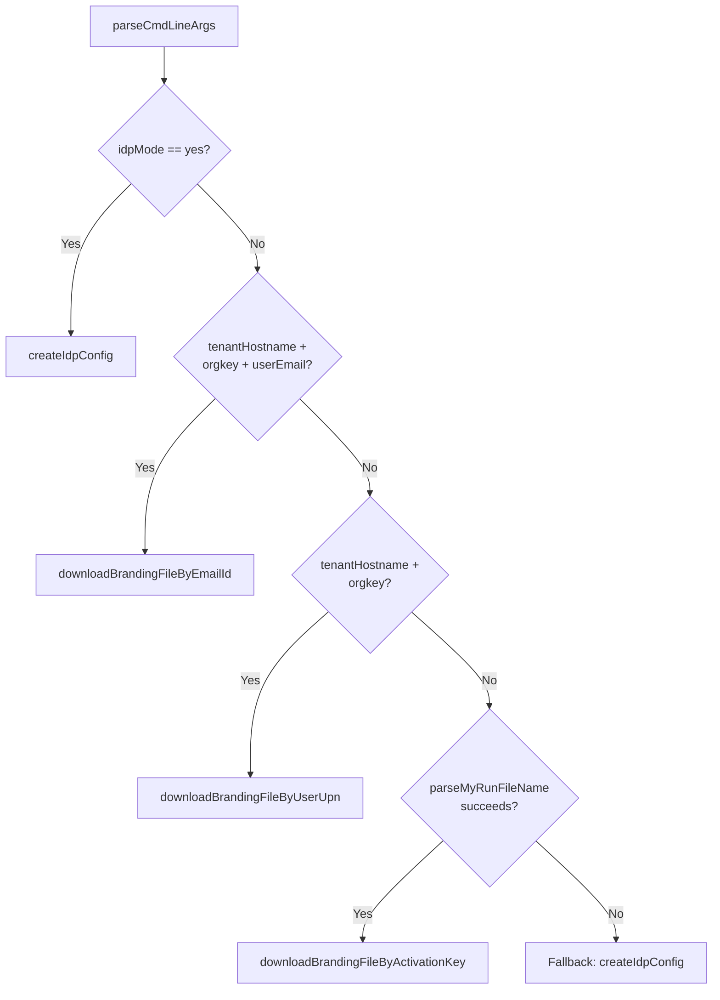

**Linux Filename Format**: `NSClient_<addonHost>_<tenantId>_<userKey>_<activationKey>_.run` (6 underscore-separated tokens; first must be "NSClient")

**UPN Lookup on Linux**: The InstallerHelper can read the UPN from the logged-in user's environment or from a down-level logon name (DOMAIN\user) converted to UPN format.

### Android (App-Based)

Android enrollment is handled natively by the NSClient app. The app can receive enrollment parameters from three sources:

1. **App Restrictions (MDM)** — Managed configuration pushed via EMM (Intune, Workspace ONE, etc.)
2. **Intent from NSBroadcastReceiver** — Direct enrollment command via Android Intent
3. **User-key based config** — Manual enrollment via in-app UI

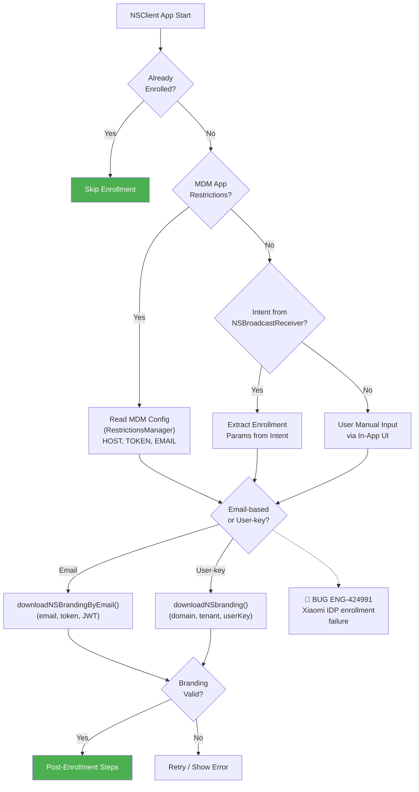

**MDM Keys** (App Restrictions): The Android client reads enrollment parameters from managed app configuration using standard Android `RestrictionsManager`:

| Key | Description |
|-----|-------------|
| `ENROLLMENT_TOKEN` | JWT or enrollment token from MDM |
| `HOST` | Addon Manager hostname |
| `TOKEN` | Organization key |
| `EMAIL` | User email address |

### iOS (App-Based)

iOS enrollment follows a similar pattern to Android but uses Apple-specific mechanisms:

1. **MDM Managed App Config** — Configuration pushed via Intune/JAMF/Workspace ONE as managed app configuration
2. **IdP via SFSafariViewController** — Browser-based SAML/OAuth flow using Apple's in-app browser
3. **NE (Network Extension)** enrollment — The tunnel provider extension handles enrollment data

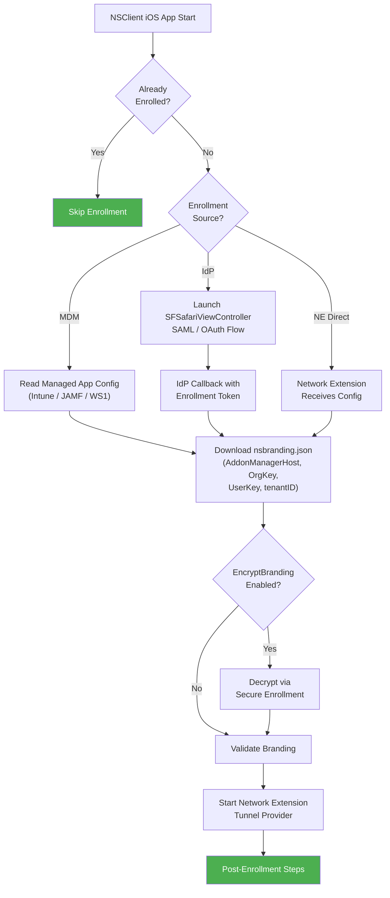

**nsbranding.json Parsing** (from `EnrollmentHelper.swift`):

The iOS `BrandingJSON` struct maps the branding response fields:
- `AddonManagerHost`, `OrgKey`, `OrgName`, `UserKey`, `UserEmail`, `tenantID`
- `EncryptBranding` (bool) — indicates if secure enrollment is in use
- `SFCheckerHost`, `SFCheckerIP` — for connectivity checking

### ChromeOS (Extension-Based)

ChromeOS enrollment is handled through a Chrome browser extension. The extension receives enrollment parameters from Google Admin Console managed configuration and communicates with the backend using standard HTTPS APIs. The enrollment flow is similar to the web-based IdP flow but runs entirely within the Chrome extension context.

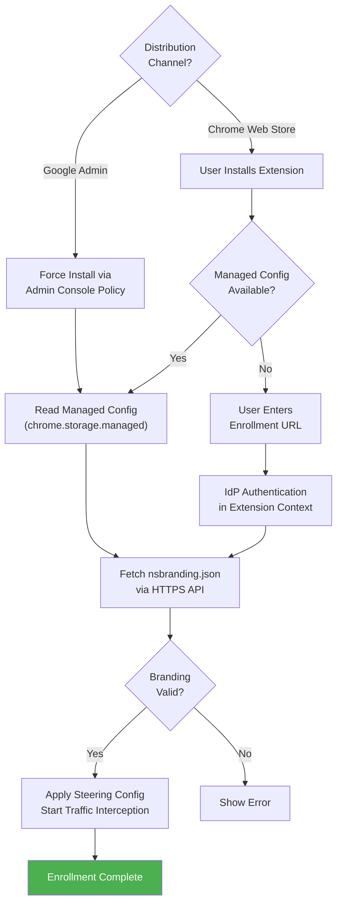

---

## Post-Enrollment Steps

After successful enrollment (branding file obtained), the client proceeds with:

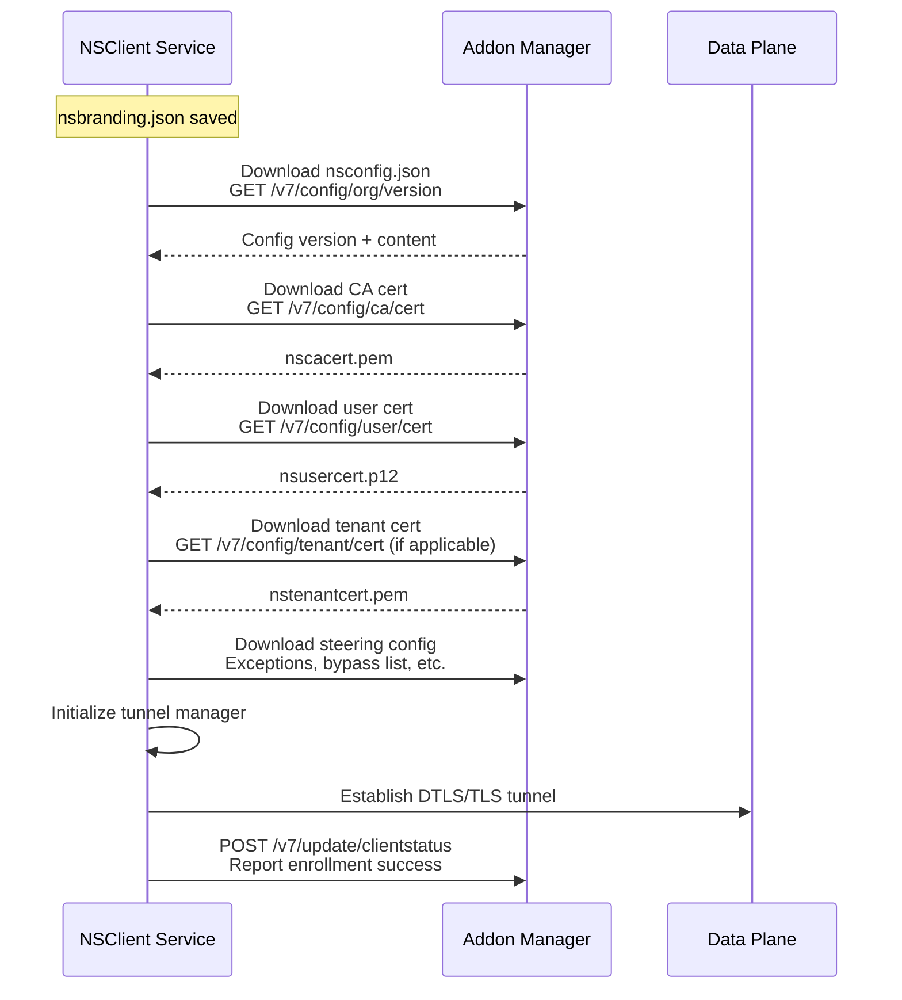

The config download and certificate acquisition are covered in detail in [04_config_download.md](04_config_download.md) and [13_certificate_management.md](13_certificate_management.md).

---

## Config Encryption and Enrollment

When the `encryptClientConfig` flag is enabled in the tenant configuration, all config files (nsconfig.json, nsbranding.json, certificates, etc.) are stored encrypted on disk with the `.enc` suffix. This affects enrollment in two ways:

1. **During enrollment**: The branding file may be written as `nsbranding.json.enc` instead of `nsbranding.json`
2. **After enrollment**: All subsequently downloaded configs are encrypted

Files that are NEVER encrypted (from `CConfigSec::m_ignoredFiles`):
- `nsinternal.json`
- `nspubkey.pem` 
- `certutil.json`
- `nsbranding.json` (always readable for pre-logon scenarios)
- `nsenforceEnrollExceptions.json`

The `nspubkey.pem` file (public key for remote log encryption) is one of the files that caused issues with secure enrollment. See ENG-557778 below.

---

## Troubleshooting

### Log Keywords

| Scenario | Log Search |
|----------|-----------|
| Enrollment mode detection | `grep -i "installMode\|install mode\|IdP Mode\|email.*invit\|activeDirectory\|eamMode" nsdebuglog.log` |
| Branding download | `grep -i "branding.*download\|nsbranding\|getbranding\|brandingbyupn\|brandingbyemail" nsdebuglog.log` |
| Branding validation | `grep -i "validateBrandingFile\|Invalid branding\|branding file" nsdebuglog.log` |
| IdP enrollment | `grep -i "IdP.*enroll\|JWT\|provisioning\|TOKEN_VERIF" nsdebuglog.log` |
| UPN hash | `grep -i "UPN.*hash\|secureUPN\|SHA256\|getUPNHash" nsdebuglog.log` |
| Secure enrollment | `grep -i "\[SE\]\|secure.*enroll\|enrollment.*host\|externalhost\|Sec-CH-TOKEN" nsdebuglog.log` |
| Enrollment tokens | `grep -i "enrollment.*token\|authToken\|encryptToken\|CryptProtect\|DPAPI" nsdebuglog.log` |
| Enforce enrollment | `grep -i "enforceEnroll\|enforce.*enrollment\|steeringProfileID" nsdebuglog.log` |

### Common Problem: IdP Window Does Not Appear

**Symptoms**: After installation with INSTALLMODE=IDP, the IdP browser window never appears.

**Diagnosis**:
1. Check `nsidpconfig.json` exists: `ls "/Library/Application Support/Netskope/STAgent/nsidpconfig.json"` (macOS) or check `%ProgramData%\netskope\stagent\nsidpconfig.json` (Windows)
2. Check the service is running and can communicate with UI: `grep -i "nscom\|IPC\|IdPProvisioning" nsdebuglog.log`
3. Check if WebView2 runtime is installed (Windows): `reg query "HKLM\SOFTWARE\WOW6432Node\Microsoft\EdgeUpdate\Clients\{F3017226-FE2A-4295-8BEB-EB81E5E36084}"`

**Resolution**: If `nsidpconfig.json` is missing, the pre-install script may have failed. Re-run the enrollment configuration script.

### Common Problem: Branding Download Fails Behind Proxy

**Symptoms**: `grep -i "Failed to download branding" nsdebuglog.log` shows repeated failures.

**Diagnosis**:
1. Check proxy detection: `grep -i "proxy.*detect\|GetProxyForUrl" nsdebuglog.log`
2. Check if FPC (Forward Proxy Credentials) are set: the installer reads the `FPC` MSI property
3. Verify connectivity to addon host: `curl -v https://addon-<tenant>.goskope.com/config/user/getbranding`

**Resolution**: Pass proxy credentials via the `FPC` MSI property or configure system proxy before installation.

### Common Problem: Secure Enrollment Token Invalid

**Symptoms**: `grep -i "invalid enrollment token\|CryptUnprotect.*failed\|enrollment.*token.*error" nsdebuglog.log`

**Diagnosis**:
1. Check token storage: (Windows) `reg query "HKLM\Software\Netskope\SecureToken" /s`
2. Check if DPAPI decryption fails (Windows) — this happens if the token was encrypted on a different machine
3. Check if the token was passed correctly during installation

**Resolution**: Re-install with correct ENROLLAUTHTOKEN and ENROLLENCRYPTIONTOKEN values.

---

## Test Cases

---

---

---

---

---

## Automation Coverage Summary

| Test Suite | Tests | Coverage Area | Key Test IDs |
|---|---|---|---|
| `install_uninstall/test_p0.py` | 2 | Basic install + uninstall | C1159861, C1159893 |
| `install_uninstall_idp/test_p0.py` | 1 | IDP enrollment via desktop automation | C1159861 |
| `install_uninstall_upn/test_p0.py` | 1 | UPN install with secure enrollment tokens | — |
| `email_based_installation/test_p0.py` | 1 (5 planned) | Email link install + 64-bit label verification | C1534570 |
| `auto_upgrade/test_p0.py` | 1 | Install older version + auto-upgrade | C1159875 |
| `nplan_6268/nplan_6268_idp_installation.py` | 1 | IDP install + enrollment validation (R134+) | NPLAN-6268 |
| `custom_client_configuration/test_p0.py` | 1 | Group-based config via UPN + tokens | C1160201 |
| `uninstall_password/test_p0.py` | 1 | Uninstall password protection | C1159880 |
| `otp/test_p0.py` | 1 | OTP disable + auto re-enable | C_OTP_E2E_P0_001 |
| `master_passcode/test_p0.py` | 1 | Master passcode disable/enable via nsdiag | C1809261 |
| **Total** | **11** | | **10 unique test IDs** |

### Coverage Gaps

| Gap Area | Bug References | Priority |
|---|---|---|
| Secure enrollment AES decryption end-to-end | ENG-557778, ENG-466704 | P1 |
| UPN hash variants (secureUPN 0/1/2) | ENG-497728 | P1 |
| VDI multi-user concurrent enrollment | ENG-591721, ENG-544070 | P1 |
| MDM/Autopilot SYSTEM context | ENG-556081, ENG-543428 | P2 |
| Branding cache collision (email vs UPN) | ENG-497728, ENG-693785 | P2 |
| Enforce enrollment flow | — | P2 |
| Email link expiry + multi-user email | — | P2 |
| Token rotation + tenant ID preservation | ENG-637576 | P2 |

---

## Cross-Flow Interactions

Enrollment interacts with installation (Ch01), config download (Ch04), tunnel management (Ch07), IPC (Ch17), and security (Ch18). The most dangerous interaction is VDI multi-user enrollment where IPC deadlocks and branding cache collisions compound.

### Cross-Flow Risk Matrix (Enrollment-Relevant)

| Interaction | Known Bugs | Severity | Test Priority |
|---|---|---|---|
| Enrollment + VDI Multi-User | ENG-466704, ENG-544070, ENG-591721 | **S2** | P1 |
| Enrollment + Secure Config | ENG-557778, ENG-637576 | **S2** | P1 |
| Enrollment + Backend Cache | ENG-497728, ENG-693785 | **S2** | P2 |
| Enrollment + NPA Addon Config | ENG-608191 | **S2** | P2 |
| Enrollment + MDM/Autopilot | ENG-556081, ENG-543228, ENG-543428 | **S2** | P2 |

## Platform Differences

| Feature | Windows | macOS | Linux | Android | iOS | ChromeOS |
|---------|---------|-------|-------|---------|-----|----------|
| Enrollment orchestrator | MSI Custom Actions | Shell scripts + InstallerUtil | install.sh + InstallerHelper | Java NSAgentService | Swift EnrollmentHelper | Chrome Extension |
| IdP browser | WebView2 / IE11 fallback | WKWebView / SFSafariViewController | System browser (no embedded) | Android WebView | SFSafariViewController | Chrome tab |
| UPN lookup | Windows token / AD query | `dscl` command to AD | `krb5` or command line | N/A (no AD) | N/A (no AD) | N/A |
| Token storage | DPAPI + Registry | macOS Keychain | Encrypted file (.eetk) | SharedPreferences | Keychain | Chrome storage |
| Config location | `%ProgramData%\netskope\stagent\` | `/Library/Application Support/Netskope/STAgent/` | `/opt/netskope/stagent/` | App private storage | App group container | Extension storage |
| Multi-user support | Yes (peruserconfig) | Yes (peruserconfig) | No | No | No | No |
| Enforce enrollment | Yes | Yes | No | No | No | No |
| Prelogon enrollment | Yes | No | No | No | No | No |
| External browser IdP | Yes (IDPMODE=scheme) | Yes (mode=scheme) | Default (no embedded browser) | No | No | Default |
| EAM mode | Yes | No | No | No | No | No |
| MDM enrollment | Intune/SCCM/GPO | JAMF/Intune/WS1 | N/A | EMM (Work Profile) | Intune/JAMF | Google Admin |

---

## Related Chapters

- [01_installation.md](01_installation.md) — Enrollment is triggered during installation; Custom Action ordering
- [04_config_download.md](04_config_download.md) — Post-enrollment config download (nsconfig.json, certs)
- [07_tunnel_management.md](07_tunnel_management.md) — Tunnel establishment requires successful enrollment
- [13_certificate_management.md](13_certificate_management.md) — Certificates provisioned during or after enrollment
- [17_ipc_nscom2.md](17_ipc_nscom2.md) — IPC between UI (IdP browser) and service during enrollment
- [18_security.md](18_security.md) — Secure enrollment token handling, DPAPI, Keychain

---

## Appendix A: Bug Quick Reference

> Problem summaries, root causes, and fixes for all enrollment-related bugs referenced in this chapter. Sorted by Bug ID for quick lookup.

| Bug ID | Problem Summary | Root Cause | Fix | Platform |
|--------|----------------|-----------|-----|----------|
| **ENG-424991** | Xiaomi Android enrollment failure | Xiaomi-specific IDP enrollment issue | Purchased Xiaomi device for regression testing | Android |
| **ENG-466704** | Citrix VDI secure enrollment random failure | Error handling bug when UPN secure enrollment fails | Fix enrollment failure error handling logic | Windows |
| **ENG-497728** | Email vs UPN branding cache key collision | Provisioner common code doesn't differentiate email and UPN cache keys | Add qualifier to cache key | Backend |
| **ENG-543228** | MDM script misjudges IDP mode | macOS script substring check for "idp" matches unintended values | Use exact keyword matching (version 22.0) | macOS |
| **ENG-543428** | IDP + secure tokens misconfiguration | IDP with secure tokens misconfigured during installation | Fix validation of parameter combinations | Windows |
| **ENG-544070** | Multi-user: second user sees "No Enrollment needed" | Branding file already exists from first user, UPN mode incorrectly skipped | Fix enrollment detection for multi-user | Windows |
| **ENG-556081** | MS Autopilot enrollment failure | Enrollment flow not designed for Autopilot OOBE SYSTEM context | Add Intune MDM environment testing | Windows |
| **ENG-557778** | nspubkey.pem encrypted after secure enrollment | `encryptClientConfig` encrypts nspubkey.pem breaking remote log collection | Add nspubkey.pem to config encryption exclusion list | Windows |
| **ENG-591721** | NSComs multi-user deadlock during enrollment | NSComs IPC module can't handle concurrent socket connections | Fix NSComs communication module | Windows |
| **ENG-608191** | NPA addon config JWT signature issue | `/v6/addon/publisher/config` uses `authorizeV7` instead of `authorizeV5` | Cover V2/V5/V7 API compatibility | Backend |
| **ENG-637576** | DEM tenant ID reset to 0 during token rotation | Token rotation error during config update resets tenant ID | Fix tenant ID protection during config update | Windows |
| **ENG-671884** | macOS uninstall status not reported | `clientEncryptBranding=1`: InstallerUtil post_uninstall call order incorrect | Move post_uninstall before uninstallAuxiliarySvc() | macOS |
| **ENG-693785** | Users getting incorrect steering configs | Case-sensitive vs case-insensitive user/usergroup ID handling mismatch | Add skip_user_id_mapping_lookup FF | Backend |
| **ENG-840031** | WSL segfault during enrollment | WSL IDP is not supported, customer tried custom configurations | Document WSL as unsupported | Linux |
| [ENG-493685](https://netskope.atlassian.net/browse/ENG-493685) | Android NS Client. User required to enter tenant name |
| [ENG-565711](https://netskope.atlassian.net/browse/ENG-565711) | [Orbia] Unsuccessful Netskope client enrolment in IDP mode due to caching |
| [ENG-704508](https://netskope.atlassian.net/browse/ENG-704508) | ENG-704508 CLONE - [Southcoast Health] IDP authentication State is not changing  |

---

## Appendix B: Methodology

### Severity Rating

| Level | Label | Definition | Impact Scope |
|---|---|---|---|
| **S1** | Critical | Complete network outage or security mechanism failure | All users, immediate impact |
| **S2** | High | Core functionality anomaly affecting connectivity | Most users under specific conditions |
| **S3** | Medium | Partial functionality failure or performance issue | Specific scenarios, workaround available |
| **S4** | Low | UI/Log anomaly or edge case | Few users, does not affect core functionality |
| **S5** | Enhancement | Feature improvement request | Not a bug |

### Test Case Format

| Field | Description |
|---|---|
| **Severity** | S1-S5 |
| **Related Bugs** | Related ENG-XXXXXX |
| **Flow Point** | Corresponding step in flow diagram |
| **Preconditions** | Prerequisites |
| **Steps** | Test steps |
| **Expected Result** | Expected result |
| **Gap Type** | Missing / Incomplete / Platform-specific / Regression / Day-1 / Corner Case |
| **Automation Priority** | P1 (must) / P2 (should) / P3 (manual OK) |
| **Automation Coverage** | ✅ Covered / ⚠️ Partial / ❌ Not covered |
