# 03. Service Lifecycle

**Escalation Bug Count**: 4 | **Regression**: 2 (50%) | **Test Gap**: 1 (25%) | **Day-1**: 1 (25%)

📋 **[Test Cases — Google Sheet](https://docs.google.com/spreadsheets/d/1ackCZ-EcepXw1BkSGoi5Go9Ex1I72-fXqcqLGMGiuio/edit?gid=1947711884#gid=1947711884)**

> This chapter covers the `stAgentSvc` service lifecycle — startup, runtime module initialization, event-driven runtime operation, and shutdown. It traces the code path from OS-level service launch through module initialization to steady-state tunnel operation across all platforms. Each flow is illustrated with mermaid diagrams annotated with known escalation bug failure points (🔴 red) and predicted risk points (🟡 yellow).

---

## Executive Summary

**Why This Matters**

`stAgentSvc` is the central daemon process that orchestrates all NSClient functionality. Every other feature — config download, tunnel management, traffic steering, FailClose, NPA, DEM — depends on modules initialized within this service. The initialization order is not arbitrary: modules have hard dependencies on one another. ConfigMgr must load config before TunnelMgr can select a gateway. FailCloseMgr must initialize before TunnelMgr because the tunnel manager holds a pointer to it. NSCom2 (IPC) must start before the UI can communicate with the service.

Understanding the lifecycle is essential for grey box testing because many escalation bugs originate from timing issues during startup, shutdown, or state transitions (sleep/wake, session logon/logoff, upgrade restart).

**Design Decisions**

1. **Single binary, multi-role (Windows)**: The same `stAgentSvc.exe` binary runs as the main service, the monitor service (`stAgentSvcMon`), and the watchdog service (`stWatchdog`). The role is determined by the command-line argument (`-start`, `-stop`, `-monitor`, `-watchdog`).

2. **Event-driven main loop (Windows)**: After initialization, the service enters `WaitForMultipleObjects()` on three events — exit, logon, logoff. All other activity is driven by callbacks, timers, and worker threads.

3. **CFRunLoop / signal-based blocking (macOS/Linux)**: On macOS the main thread blocks on `CFRunLoopRun()`. On Linux it blocks on a signal handler waiting for SIGTERM. Both call `onLogon()` immediately rather than waiting for a session event.

4. **Constructor-time wiring**: Several critical cross-module pointers (FailCloseMgr ↔ TunnelMgr, NpaTunnelMgr ↔ FilterDevice/ProxyMgr) are wired in the `stAgentService` constructor, before `OnInit()` is called.

---

## Architecture

### Process Model

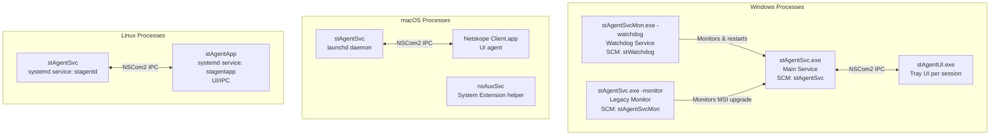

### Key Source Files

| File | Purpose |
|---|---|
| `stAgent/stAgentSvc/main.cpp` | Entry point — dispatches based on platform and CLI args |
| `stAgent/stAgentSvc/stAgentSvcEx.cpp` | Platform-independent service logic (onLogon, onStop, onConfigReady, preInitService, watchdog threads) |
| `stAgent/stAgentSvc/win/stAgentSvc.cpp` | Windows-specific: constructor, OnInit, Run (event loop), SCM callbacks (OnSessionChange, AOAC, power events) |
| `stAgent/stAgentSvc/osx/stAgentSvc.cpp` | macOS-specific: constructor, OnInit, Run (CFRunLoop), sleep/wake handlers |
| `stAgent/stAgentSvc/linux/stAgentSvc.cpp` | Linux-specific: constructor, OnInit, Run (signal wait), cert handling |
| `stAgent/stAgentSvc/android/stAgentSvc.cpp` | Android-specific: simplified lifecycle, JNI integration |
| `lib/nsWinSvc/nsWinSvc.cpp` | Windows SCM integration: ServiceMain, Handler, Initialize |
| `lib/nsWinSvc/nsWinSvcCtrl.h` | Service name definitions: `stAgentSvc`, `stAgentSvcMon`, `stWatchdog` |
| `stAgent/stAgentSvc/stAgentSvc.h` | `stAgentService` class definition with all member managers |
| `stAgent/stAgentSvc/FailCloseMgr.cpp` | FailClose manager init and state machine |
| `stAgent/stAgentSvc/tunnelMgr.cpp` | Tunnel manager start/stop/worker thread |

### Member Objects in stAgentService

The `stAgentService` class owns or manages these key objects:

| Member | Type | Purpose |
|---|---|---|
| `m_tunnelMgr` | `CTunnelMgr` | Manages tunnel connections, owns FilterDevice and ProxyMgr |
| `m_failCloseMgr` | `CFailCloseMgr` | FailClose state machine (Win/Mac/Linux/Android) |
| `m_npaTunnelMgr` | `CNpaTunnelMgr` | NPA (Private Access) tunnel management |
| `m_demMgr` | `CDemMgr` | Digital Experience Monitoring |
| `m_pnsCom2Server` | `CNSCom2*` | IPC server for UI communication |
| `m_pnetworkMonitor` | `CNetworkMonitor*` | Network change detection |
| `m_pscheduler` | `CNSScheduler*` | Periodic task scheduler |
| `m_puiMonitor` | `CUIMonitor*` | UI process monitor (Windows only) |
| `m_epdlpSvc` | `EpdlpSvcStub*` | Endpoint DLP stub (Win/Mac) |
| `m_bwanSvcConfig` | `BwanConfig*` | Borderless WAN config (Win/Mac/Linux) |
| `m_tlsKeyMgr` | `CTlsKeyMgr*` | TLS key management (Windows only) |
| `m_powerMonitor` | `CPowerMonitor` | Sleep/wake monitoring (macOS only) |

---

## Startup Sequence

### Overview

The startup sequence follows a consistent pattern across platforms, with platform-specific entry points converging on shared initialization logic:

```
OS starts service → main() → platform-specific OnInit() → Run() → config.init() → preInitService() → onLogon() → module initialization → config.startUpdateThread() → onConfigReady() → startTunnel()
```

The critical insight is that the **tunnel is not started in Run()** — it is started much later, inside `onConfigReady()`, which is a callback from the config download thread after config has been successfully loaded from MP.

### Startup Flow

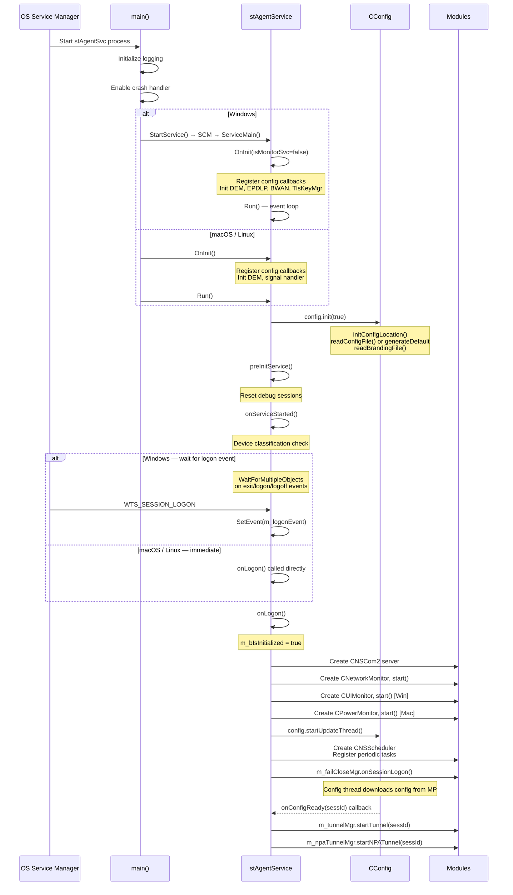

### Constructor Wiring (Before OnInit)

The `stAgentService` constructor performs critical cross-module wiring that must happen before any initialization. The following diagram shows how components are wired together through constructor initialization and callback registration:

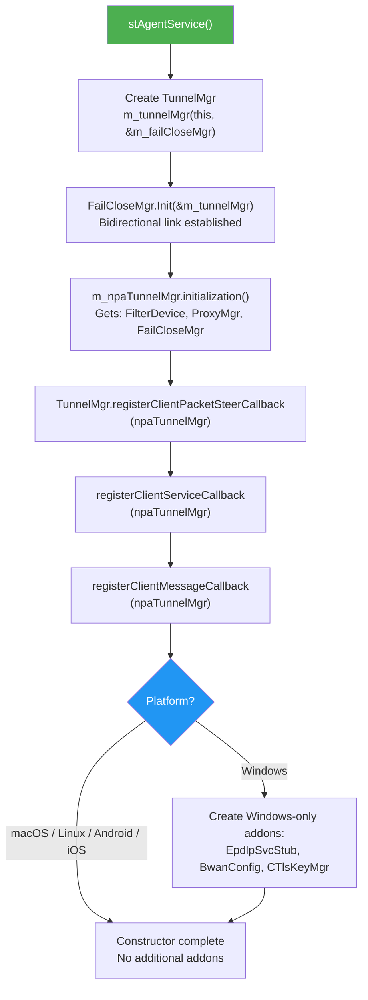

Key dependency chain: TunnelMgr and FailCloseMgr hold **bidirectional pointers** to each other. If either is constructed in the wrong order, null pointer crashes can occur at runtime.

### OnInit — Platform-Specific Initialization

`OnInit()` runs after the constructor but before `Run()`. Its primary job is to register config callbacks so that modules receive config change notifications. The flow diverges significantly by platform:

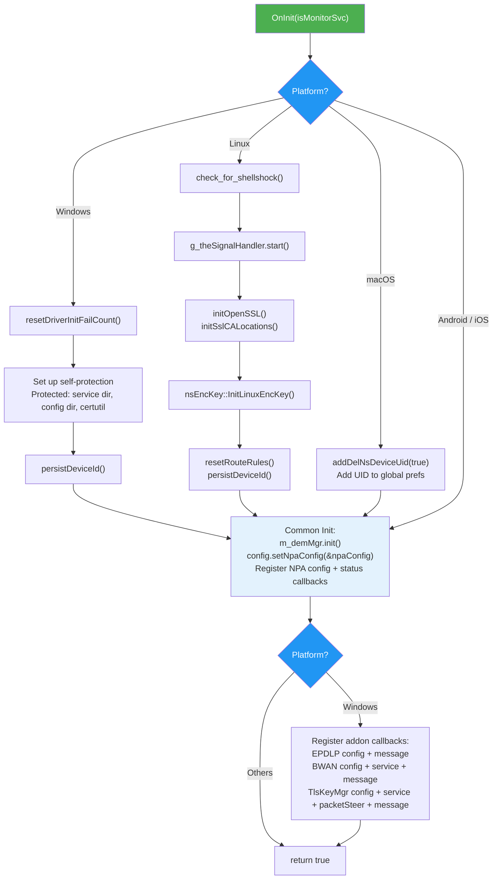

### Run — Main Loop Entry

After `OnInit()` succeeds, `Run()` is called. This is where config is loaded and the main event loop begins. The key difference: Windows uses an event-driven loop handling logon/logoff/exit, while macOS and Linux call `onLogon()` immediately and block on a run loop or signal. Service dependency failures can prevent the service from reaching this stage.

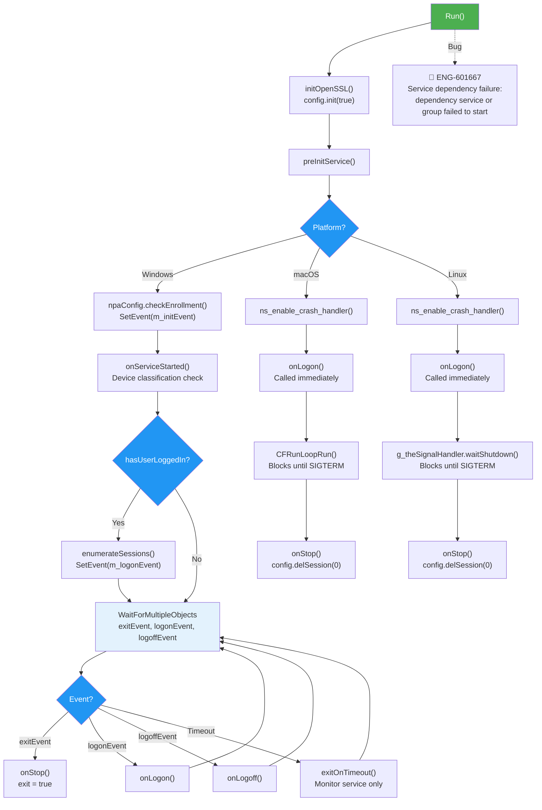

#### Node Risk Assessment: Run — Main Loop Entry

| Node | Risk | Impact | Detection |
|------|------|--------|-----------|
| `RUN` (🔴 ENG-601667) | Service dependency missing or failed causes service startup failure | S1 — Complete outage, service does not start | Event log: "dependency service or group failed to start" |
| `WIN_LOOP` | Event loop timeout not handled correctly in main service (only monitor service should timeout) | S3 — Service exits unexpectedly | Log: "exitOnTimeout called in non-monitor service" |
| `WIN_LOGON` | Repeated logon events without logoff may leak session resources | S4 — Memory leak over time | Monitor session count growth in multi-session VDI |

### onLogon — Module Initialization

`onLogon()` is where the bulk of runtime module initialization occurs. It is called once when the first user session is detected (Windows) or immediately during `Run()` (macOS/Linux).

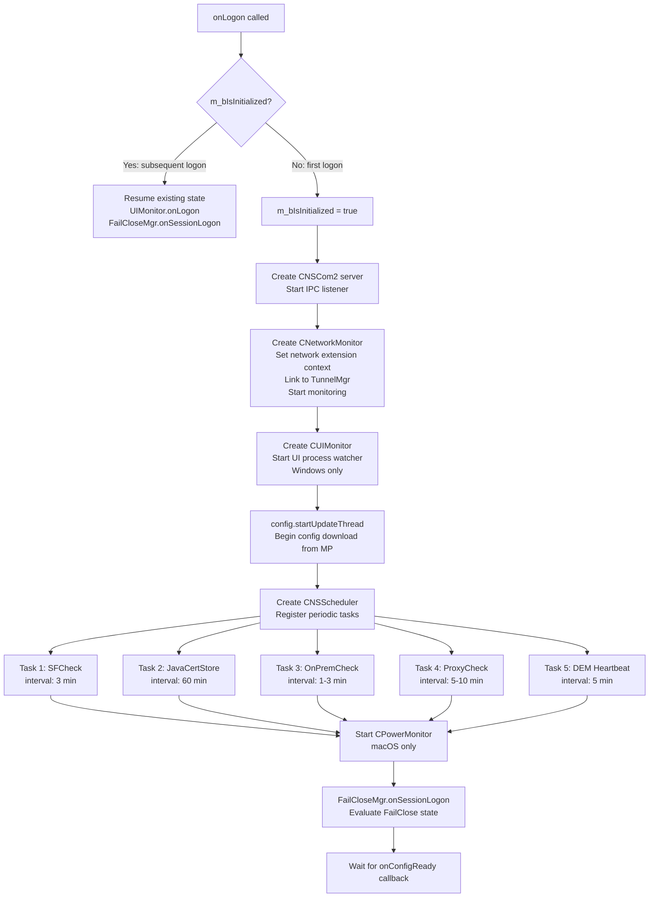

### onConfigReady — Tunnel Startup

The config update thread downloads configuration from MP. When config is ready, it calls back `onConfigReady()`, which is the trigger for tunnel establishment:

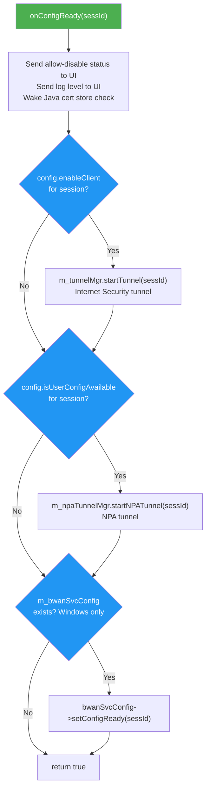

### Module Initialization Dependency Graph

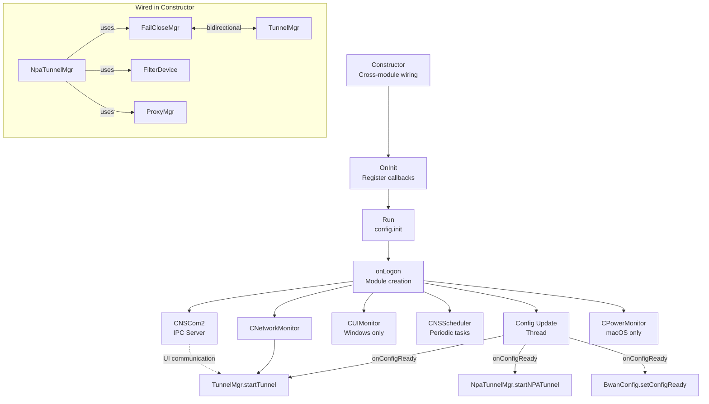

---

## Shutdown Sequence

### Graceful Shutdown

The shutdown sequence reverses the startup order, with careful attention to stopping threads that might restart the tunnel (network monitor, NSCom2) before stopping the tunnel itself. Shutdown bugs often involve race conditions where background threads trigger reconnection attempts during teardown, or service crashes occur during disconnect operations.

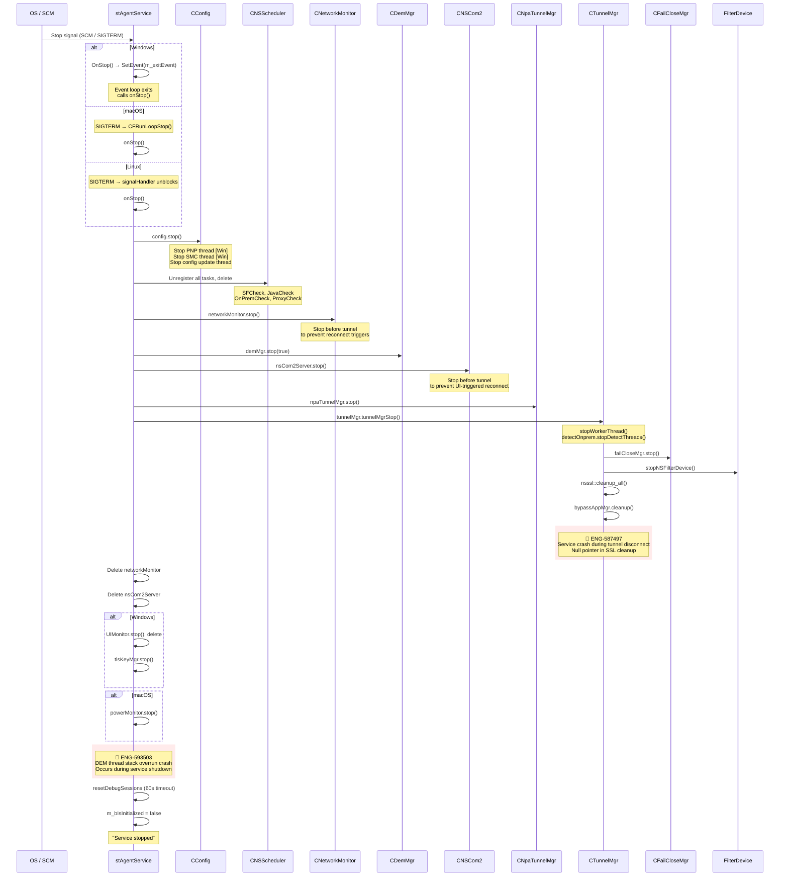

#### Node Risk Assessment: Shutdown Sequence

| Node | Risk | Impact | Detection |
|------|------|--------|-----------|
| `TUN → SSL cleanup` (🔴 ENG-587497) | Null pointer dereference during `nsssl::cleanup_all()` | S2 — Service crash on stop, incomplete cleanup | Crash dumps with stack trace in SSL module |
| `DEM stop` (🔴 ENG-593503) | DEM thread stack overrun during shutdown | S2 — Service crash, potential memory corruption | Crash dumps showing DEM thread stack overflow |
| `NET stop` | NetworkMonitor fires change event after stop() begins | S3 — Reconnect race during shutdown | Log "reconnect" entries after "Service is stopping" |
| `COM stop` | NSCom2 client command arrives during shutdown | S3 — Blocked shutdown, timeout | `nsCom2Server.stop()` hangs for 30+ seconds |

### Shutdown Order Rationale

The shutdown order is deliberately sequenced to prevent race conditions:

1. **Config first** — stops the config update thread that could trigger `onConfigReady` and restart tunnels
2. **Scheduler** — stops periodic tasks that could trigger network checks
3. **NetworkMonitor** — stops network change events that could trigger tunnel reconnection
4. **DEM** — stops monitoring before tunnel teardown
5. **NSCom2** — stops IPC so UI cannot send commands during shutdown
6. **NPA TunnelMgr** — stops NPA tunnels
7. **TunnelMgr** — stops main tunnels, FailClose, FilterDevice, SSL
8. **Cleanup** — delete heap objects, reset debug sessions

### Windows OnPreShutdown

Windows has a special `SERVICE_CONTROL_PRESHUTDOWN` handler that gives the service extra time to clean up before the OS forces termination:

```cpp
void stAgentService::OnPreShutdown()
{
    config.setShutdown(true);  // Signal to other modules
    OnStop();                   // Trigger normal shutdown
}
```

The monitor service has additional logic to wait up to 90 seconds if an upgrade is in progress during shutdown.

---

## Service Monitor and Watchdog

### Architecture (Windows Only)

Windows runs up to three service instances from the same binary family:

| Service Name | Binary | CLI Arg | Purpose |
|---|---|---|---|
| `stAgentSvc` | `stAgentSvc.exe` | (none) | Main service |
| `stAgentSvcMon` | `stAgentSvc.exe` | `-monitor` | Legacy upgrade monitor |
| `stWatchdog` | `stAgentSvcMon.exe` | `-watchdog` | New watchdog |

The watchdog feature flag `GetWatchdogMonitorEnabledFlag()` controls whether the new watchdog is used. When enabled, the legacy `stAgentSvcMon` behavior is bypassed.

### Watchdog Thread (ThreadWatchdog)

The watchdog monitors the main `stAgentSvc` service and restarts it if it crashes:

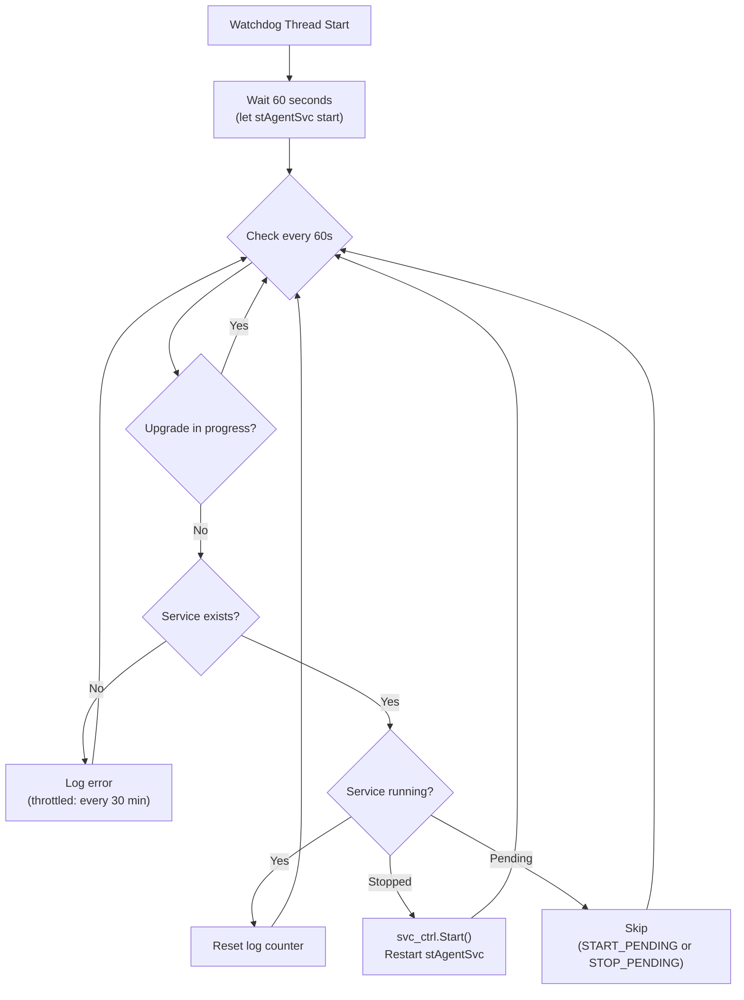

The watchdog logic is captured in the diagram above (`stAgentSvcEx.cpp::ThreadWatchdog`). It checks service health every 60 seconds after an initial 60-second startup delay, skipping checks during active upgrades.

### Upgrade Monitor Thread (ThreadUpgradeMonitor)

The upgrade monitor checks hourly whether an upgrade that was started has failed and needs to be relaunched. It allows up to 3 retry attempts before giving up. This flow is particularly vulnerable to MSI process pile-up if retries occur while the previous MSI is still hung.

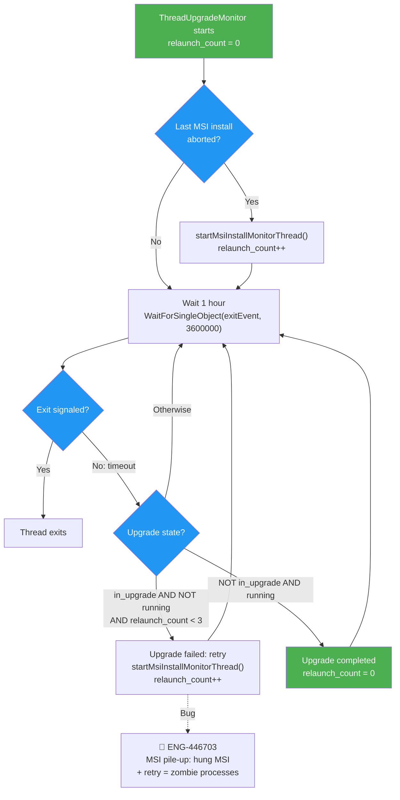

#### Node Risk Assessment: Upgrade Monitor Thread

| Node | Risk | Impact | Detection |
|------|------|--------|-----------|
| `RETRY` (🔴 ENG-446703) | MSI pile-up: multiple hung MSI processes if retry occurs without cleanup | S2 — Upgrade blocked, zombie processes, high CPU | Monitor msiexec.exe process count; check relaunch_count in logs |
| `CHECK_STATE` | Incorrect upgrade state detection could trigger premature retry | S3 — Failed upgrade, unnecessary retry | Verify UpgradeInProgress registry flag sync |
| `WAIT` | 1-hour interval too long for urgent upgrade recovery | S4 — Delayed upgrade | Consider shorter check interval for first retry |

### Legacy Monitor (stAgentSvcMon)

The legacy monitor runs the same `stAgentSvc.exe` binary with `-monitor` and enters `Run()` with `m_bIsMonitorSvc = true`. It uses a 1-hour timeout on the event loop. When the main service is not running and an upgrade was in progress, it relaunches the MSI installer (up to 2 retries).

The legacy monitor is being replaced by the new watchdog (`stWatchdog`) controlled by the `GetWatchdogMonitorEnabledFlag()` feature flag.

---

## Runtime Event Handling

### Windows Session Management

Windows `stAgentSvc` receives session change events from SCM via `OnSessionChange()`. The state machine below shows how session events trigger lifecycle transitions.

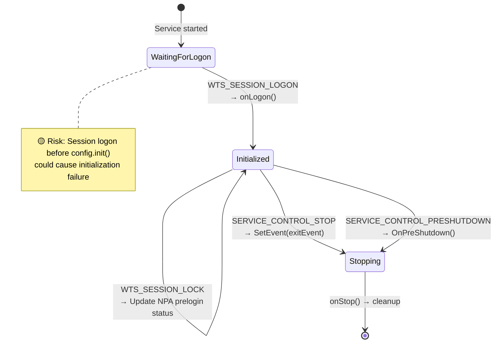

#### Node Risk Assessment: Windows Session Management

| Node | Risk | Impact | Detection |
|------|------|--------|-----------|
| `WaitingForLogon → Initialized` | Session logon fires before `config.init()` completes | S2 — Config read failure, client initialization incomplete | Log: "session change event blocked waiting for init" |
| `WTS_SESSION_LOGOFF` | Tunnel stop during logoff may race with new logon | S3 — Tunnel stuck in connecting state | Multi-session VDI log "stopTunnel" followed immediately by "startTunnel" |
| `Stopping` | Service stop during active operations may not clean up gracefully | S3 — Incomplete cleanup, stuck threads | Log: "resetDebugSessions timeout" or "Service stop timeout" |

Key design point: `WaitForSingleObject(m_initEvent, INFINITE)` in `OnSessionChange()` blocks session events until `config.init()` completes. This prevents race conditions where a session logon before config initialization would fail to set up the correct user-specific paths.

### Windows Power Events

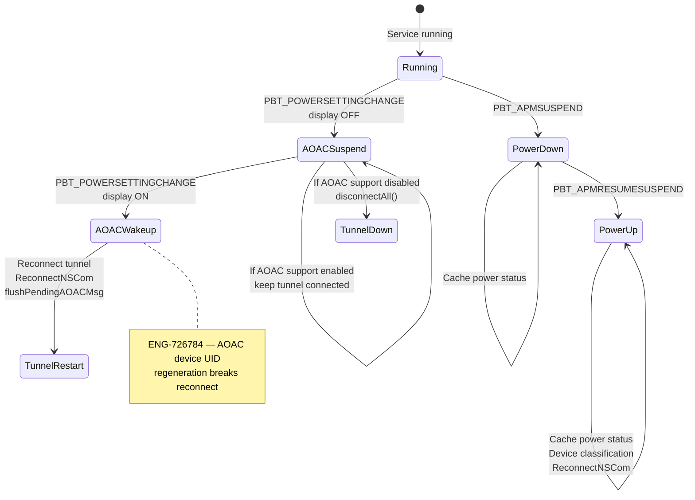

### macOS Sleep/Wake

macOS uses `CPowerMonitor` to detect sleep/wake events:

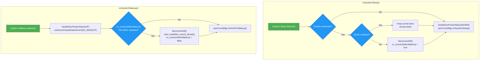

### Scheduled Tasks

The `CNSScheduler` runs periodic tasks at fixed intervals:

| Task ID | Name | Interval | Purpose |
|---|---|---|---|
| 1 | SFCheck | 3 min | Security feature check |
| 2 | JavaCertStore | 60 min | Java certificate store check |
| 3 | OnPremCheck | 1-3 min | On-premises detection |
| 4 | ProxyCheck | 5-10 min | Proxy configuration check |
| 5 | DEM Heartbeat | 5 min | Digital Experience Monitoring heartbeat |
| 7 | POP Pinning Timeout | varies | Handle POP pinning timeout |

---

## Platform Details

### Windows

**Service Registration**:
- Service name: `stAgentSvc`
- Display name: configured in `nsWinSvc.cpp`
- Service type: `SERVICE_WIN32_OWN_PROCESS`
- Start type: automatic
- Dependencies: updated via `UpdateService()` after first start
- Control accepted: Stop, SessionChange, PowerEvent, PreShutdown
- PreShutdown timeout for monitor: 180 seconds (3 min)

**Self-Protection Integration**:
When self-protection is enabled, the service accepts `SERVICE_CONTROL_PROTECTED_STOP` (code 136) instead of the standard `SERVICE_CONTROL_STOP`. The `AllowStopProtectedService()` method checks:
1. Is the `disableWinStopServiceProtection` feature flag set?
2. Is there a valid encrypted time token in the registry (within 10 seconds)?
3. Is the global stop-service event signaled by the MSI installer?

This mechanism ensures only the MSI upgrade installer (which sets the event and token) can stop the service during an upgrade.

**macOS Compatibility Check**:
On startup, `main.cpp` calls `unloadClientSvcIfIncompatible()` which detects macOS 11.0+ (Big Sur) and migrates from the old `com.netskope.stagentsvc` launchd daemon to the new `com.netskope.client.auxsvc` daemon. The old daemon is unloaded and its plist deleted.

### macOS

**launchd Configuration** (`com.netskope.stagentsvc.plist`):
```xml
<key>Label</key>
<string>com.netskope.client.stAgentSvc</string>
<key>RunAtLoad</key>
<true/>
<key>KeepAlive</key>
<true/>
<key>ProgramArguments</key>
<array>
    <string>/Library/Application Support/Netskope/STAgent/stAgentSvc</string>
</array>
```

Key properties:
- `RunAtLoad: true` — starts automatically at boot
- `KeepAlive: true` — launchd restarts the service if it crashes (equivalent of Windows watchdog)
- Standard out/err logged to `/Library/Logs/Netskope/stAgentSvc.{out,err}.log`

**Big Sur+ Transition**:
On macOS 11.0+, the service transitions from a direct launchd daemon to a System Extension model via `nsAuxSvc`. The `main.cpp` compatibility check handles this migration automatically.

**Signal Handling**:
SIGTERM triggers `CFRunLoopStop()` which unblocks the main thread, allowing `onStop()` to run.

### Linux

**systemd Unit Files**:

`stagentd.service` (main daemon):
```ini
[Unit]
Description=Netskope client daemon

[Service]
Type=simple
ExecStart=/opt/netskope/stagent/stAgentSvc
WorkingDirectory=/opt/netskope/stagent
KillMode=process
Restart=always
RestartSec=10
TimeoutStopSec=10

[Install]
WantedBy=multi-user.target
```

`stagentapp.service` (UI/IPC agent):
```ini
[Unit]
Description=Netskope client Agent

[Service]
Type=simple
ExecStart=/opt/netskope/stagent/stAgentApp
WorkingDirectory=/opt/netskope/stagent
KillMode=process
Restart=on-failure
RestartSec=5
TimeoutStopSec=10

[Install]
WantedBy=default.target
```

Key differences from other platforms:
- `Restart=always` provides crash recovery (like macOS `KeepAlive` and Windows watchdog)
- `KillMode=process` ensures only the main process is killed, not child processes
- `TimeoutStopSec=10` gives 10 seconds for graceful shutdown before SIGKILL
- Linux-specific OnInit: shellshock check, encryption key init, route rules reset, SSL CA locations init

### Android

Android uses a simplified lifecycle driven by the app layer via JNI:

```cpp
bool stAgentService::OnInit(const bool isMonitorSvc)
{
    m_demMgr.init();
    config.setNpaConfig(&npaConfig);
    config.registerConfigCallback(&npaConfig);
    config.registerClientStatusCallback(&npaConfig);
    return true;
}

void stAgentService::Run()
{
    initOpenSSL();
    config.init(true);
    config.addSession(0);
    onLogon();
    config.detectProxy();
    config.downloadAdminSettings(0);
    config.dumpClientConfig();
    m_isServiceRunning = true;

    if (!config.isConfigReady()) {
        config.startUpdateThread();
    }
}
```

Key differences:
- No event loop — `Run()` returns immediately after setup
- Session 0 is always used (single user)
- Proxy detection and admin settings download are called directly in `Run()`
- `OnStartStopUser()` is called from the Java layer via JNI
- DNS health check with failure recovery (max 3 consecutive failures trigger reconnect)
- Save battery mode support via `setSaveBatteryMode()`

### iOS

iOS uses the `NEPacketTunnelProvider` framework. The service lifecycle is managed entirely by the iOS Network Extension framework:

- **Entry point**: `PacketTunnelProvider.mm` (implements `NEPacketTunnelProvider`)
- **No separate daemon process** — the tunnel provider runs as a Network Extension
- **No watchdog needed** — iOS manages the extension lifecycle
- **NSCom2 not used** — communication with the main app uses `UserDefaults` and extension APIs
- **Limited background execution** — iOS suspends the extension when not actively tunneling

### ChromeOS

ChromeOS uses a Chrome Extension with a service worker. The lifecycle is managed by Chrome's extension framework rather than OS-level service management. The client-side complexity is significantly lower than desktop platforms.

---

## Platform Comparison

| Feature | Windows | macOS | Linux | Android | iOS |
|---|---|---|---|---|---|
| **Service manager** | SCM | launchd | systemd | Android Service | NEPacketTunnelProvider |
| **Binary** | stAgentSvc.exe | stAgentSvc | stAgentSvc | JNI in app | PacketTunnelProvider |
| **Crash recovery** | stWatchdog service | launchd KeepAlive | systemd Restart=always | App-managed | iOS-managed |
| **Main loop** | WaitForMultipleObjects | CFRunLoopRun | signal wait | Returns immediately | iOS framework |
| **Session handling** | Multi-session (VDI) | Single/multi user | Single user | Single user | Single user |
| **Power events** | AOAC + PBT_* | CPowerMonitor | N/A | Doze mode | iOS background |
| **IPC mechanism** | NSCom2 (named pipe) | NSCom2 (Unix socket) | NSCom2 (Unix socket) | JNI | UserDefaults |
| **Self-protection** | SCM + driver | SIP + launchd | N/A | N/A | N/A |
| **Upgrade monitor** | stWatchdog/stAgentSvcMon | launchd | systemd | App store | App store |

---

## Troubleshooting

### Service Fails to Start

**Symptoms**: Service is installed but not running. `sc query stAgentSvc` shows STOPPED.

**Diagnostic Steps**:
```bash
# Windows: check service status and dependencies
sc query stAgentSvc
sc qc stAgentSvc
# Check event log for service failures
wevtutil qe System /q:"*[System[Provider[@Name='Service Control Manager']]]" /c:10 /rd:true /f:text

# macOS: check launchd
launchctl list | grep netskope
# Check logs
cat /Library/Logs/Netskope/stAgentSvc.out.log
cat /Library/Logs/Netskope/stAgentSvc.err.log

# Linux: check systemd
systemctl status stagentd
journalctl -u stagentd --since "10 minutes ago"
```

**Log Keywords**:
```
grep -i "stAgentSvc.*starting\|OnInit\|config init\|readConfigFile\|branding" nsdebuglog.log
```

**Common Causes**:
- Config file not found or corrupted → `readConfigFile failed`
- Branding file missing → `valid branding file not found` (not enrolled)
- Driver init failure on Windows → check `STADRV_STATUS_REG_FAILURE_COUNT`
- macOS Big Sur migration not completed → check for stale `com.netskope.stagentsvc.plist`

### Service Starts But Tunnel Never Connects

**Symptoms**: Service is running, logs show `onLogon`, but tunnel status stays disconnected.

**Diagnostic Steps**:
```bash
grep -i "onLogon\|onConfigReady\|startTunnel\|enableClient\|startUpdateThread" nsdebuglog.log
```

**Common Causes**:
- Config update thread fails to download config → check `config thread` and `downloadAdminSettings` logs
- `enableClient()` returns false (client disabled by admin) → check `userStatus` and `clientStatus` in logs
- No user session detected (Windows) → `hasUserLoggedIn` returns false before any logon event
- Config init race condition → check if session change fired before `m_initEvent`

### Watchdog Not Restarting Service

**Symptoms**: `stAgentSvc` crashed but was not restarted.

**Diagnostic Steps**:
```bash
# Check if watchdog service is running
sc query stWatchdog
# Check watchdog log (separate log file)
grep -i "ThreadWatchdog\|restart\|service.*stopped" nswatchdog.log

# Check if upgrade was in progress
grep -i "UpgradeInProgress" nsdebuglog.log
```

**Common Causes**:
- Watchdog feature flag not enabled → `GetWatchdogMonitorEnabledFlag()` returns false
- Upgrade in progress → watchdog skips restart during upgrades
- Service deleted (not just stopped) → `IsServiceExist()` returns false, watchdog only logs
- Legacy monitor running instead → check which service is registered as `stAgentSvcMon`

### Shutdown Hangs

**Symptoms**: Service takes too long to stop, or `stopservice` command hangs.

**Diagnostic Steps**:
```bash
grep -i "Service is stopping\|module stopped\|resetDebugSessions" nsdebuglog.log
```

**Common Causes**:
- `resetDebugSessions` waiting on 60-second timeout
- Tunnel disconnect waiting for SSL cleanup
- NSCom2 stop blocking on client connection
- Windows self-protection rejecting stop request → check `AllowStopProtectedService` and `disableWinStopServiceProtection`

---

## Windows

**Bug Count**: 3 | **Key Gaps**: Service dependency failures, shutdown crash handling

The Windows platform has the most complex service lifecycle due to multi-session support (VDI), watchdog service integration, self-protection mechanisms, and AOAC power management. The majority of service lifecycle bugs occur on Windows.

### Windows Confirmed Bug Mapping

| Bug ID | Summary | Root Cause | Severity | Gap Type |
|--------|---------|------------|----------|----------|
| ENG-601667 | Service dependency failure | Dependency service or group failed to start, blocking stAgentSvc startup | S1 | Regression |
| ENG-587497 | Service crash during tunnel disconnect | Null pointer dereference in `nsssl::cleanup_all()` during shutdown | S2 | Test Gap |
| ENG-593503 | DEM thread stack overrun crash | Stack overflow in DEM module during service shutdown | S2 | Day-1 |

### Windows Test Cases

| ID | Test Case | Severity | Auto Priority | Gap Type |
|----|-----------|----------|---------------|----------|
| TC-03-W01 | **Service Dependency Failure**: Disable a required service dependency, attempt to start stAgentSvc, verify startup fails with "dependency service or group failed to start" (ENG-601667) | S1 | P1 | Regression |
| TC-03-W02 | **Shutdown SSL Crash**: Stop service with tunnel connected, verify no crash in `nsssl::cleanup_all()`, check crash dumps (ENG-587497) | S2 | P1 | Test Gap |
| TC-03-W03 | **DEM Shutdown Crash**: Stop service with DEM active, verify no stack overrun in DEM thread, check crash dumps (ENG-593503) | S2 | P1 | Day-1 |
| TC-03-W04 | **Watchdog Crash Recovery**: Kill `stAgentSvc` process forcefully, verify `stWatchdog` service restarts it within 60 seconds, check nswatchdog.log for restart entry | S2 | P1 | Test Gap |
| TC-03-W05 | **Shutdown Order Verification**: Stop service with tunnel connected and FailClose enabled, verify log order: Config → Scheduler → NetworkMonitor → DEM → NSCom2 → Tunnel → FailClose | S3 | P2 | Test Gap |
| TC-03-W06 | **AOAC Power Event Handling**: On AOAC device, trigger display-off/display-on, verify tunnel behavior matches `AOACSupportEnabled` config (keep-alive vs disconnect/reconnect) | S3 | P2 | Corner Case |
| TC-03-W07 | **Upgrade Monitor Retry Limit**: Set `UpgradeInProgress` flag, stop service, verify `ThreadUpgradeMonitor` retries MSI launch up to 3 times then stops (related to MSI pile-up bug) | S3 | P2 | Corner Case |

---

## macOS

**Bug Count**: 0 | **Key Gaps**: Sleep/wake tunnel recovery, launchd crash handling

macOS uses a simpler service lifecycle managed by launchd. The `KeepAlive` property provides automatic crash recovery. No confirmed escalation bugs have been mapped to macOS service lifecycle.

### macOS Test Cases

| ID | Test Case | Severity | Auto Priority | Gap Type |
|----|-----------|----------|---------------|----------|
| TC-03-M01 | **Sleep/Wake Tunnel Recovery**: With tunnel connected and AOAC disabled, sleep Mac, wake, verify tunnel reconnects; repeat with AOAC enabled, verify tunnel stays connected | S3 | P2 | Test Gap |
| TC-03-M02 | **launchd Crash Recovery**: Kill `stAgentSvc` process, verify launchd restarts it automatically, check system.log for restart entry | S3 | P2 | Test Gap |
| TC-03-M03 | **SIGTERM Graceful Shutdown**: Send SIGTERM to service, verify `CFRunLoopStop()` triggers `onStop()`, verify all modules clean up without crash | S3 | P2 | Test Gap |

---

## Linux

**Bug Count**: 1 | **Key Gaps**: systemd restart recovery, SIGTERM handling

Linux uses systemd for service lifecycle. The `Restart=always` policy provides automatic crash recovery. One confirmed bug relates to SIGTERM signal handling.

### Linux Confirmed Bug Mapping

| Bug ID | Summary | Root Cause | Severity | Gap Type |
|--------|---------|------------|----------|----------|
| ENG-453051 | SIGTERM multiple issues | Signal handler not properly cleaning up resources before exit | S3 | Regression |

### Linux Test Cases

| ID | Test Case | Severity | Auto Priority | Gap Type |
|----|-----------|----------|---------------|----------|
| TC-03-L01 | **SIGTERM Graceful Shutdown**: Send SIGTERM to service, verify signal handler triggers `onStop()`, verify all resources cleaned up (ENG-453051 regression check) | S3 | P1 | Regression |
| TC-03-L02 | **systemd Restart Recovery**: Kill `stAgentSvc` process with `kill -9`, verify systemd restarts service within 15 seconds (RestartSec=10 + buffer), verify tunnel reconnects | S3 | P2 | Test Gap |
| TC-03-L03 | **Shutdown Order Verification**: Stop service with tunnel connected, verify log order matches expected sequence, verify no reconnect attempts during shutdown | S3 | P2 | Test Gap |

---

## Android

**Bug Count**: 0 | **Key Gaps**: JNI lifecycle transitions, save battery mode

Android has a simplified lifecycle driven by the app layer via JNI. No confirmed escalation bugs have been mapped to Android service lifecycle.

### Android Test Cases

| ID | Test Case | Severity | Auto Priority | Gap Type |
|----|-----------|----------|---------------|----------|
| TC-03-A01 | **JNI Lifecycle Transitions**: Start/stop service via `OnStartStopUser()` JNI call multiple times, verify clean init and cleanup without leaks | S4 | P3 | Test Gap |
| TC-03-A02 | **Save Battery Mode**: Enable save battery mode, verify service reduces background activity, disable and verify normal operation resumes | S4 | P3 | Test Gap |
| TC-03-A03 | **DNS Health Check Failure Recovery**: Trigger 3 consecutive DNS health check failures, verify service triggers reconnect, verify max 3 failures honored | S4 | P3 | Corner Case |

---

## iOS / ChromeOS

**Bug Count**: 0 | **Key Gaps**: Network Extension lifecycle, Chrome Extension service worker

iOS and ChromeOS have framework-managed lifecycles with minimal service-layer complexity. No confirmed escalation bugs.

### iOS / ChromeOS Test Cases

| ID | Test Case | Severity | Auto Priority | Gap Type |
|----|-----------|----------|---------------|----------|
| TC-03-I01 | **NEPacketTunnelProvider Lifecycle**: Start/stop tunnel provider, verify iOS manages lifecycle correctly, verify tunnel state transitions | S4 | P3 | Test Gap |
| TC-03-C01 | **Chrome Extension Service Worker**: Start/stop Chrome extension, verify service worker lifecycle, verify communication with background page | S4 | P3 | Test Gap |

---

## Cross-Platform Test Cases

| ID | Test Case | Platforms | Severity | Auto Priority | Gap Type |
|----|-----------|-----------|----------|---------------|----------|
| TC-03-X01 | **Startup Module Initialization Order**: Start service with debug logs, verify sequence: config.init → onLogon → NSCom2 → NetworkMonitor → Scheduler → FailClose → onConfigReady → startTunnel | Win/Mac/Linux | S2 | P1 | Test Gap |
| TC-03-X02 | **Shutdown No Reconnect Race**: Stop service with tunnel connected, verify no "startTunnel" log entries after "Service is stopping", verify NetworkMonitor/NSCom2 stopped before tunnel | Win/Mac/Linux | S3 | P2 | Test Gap |
| TC-03-X03 | **Service Restart Tunnel Recovery**: Stop and restart service, verify tunnel reconnects automatically after config reload completes | Win/Mac/Linux | S3 | P2 | Test Gap |

---

## Automation Coverage Summary

### Coverage by Test Framework

| Test Area | Framework | Tests | Coverage | Comments |
|-----------|-----------|-------|----------|----------|
| Watchdog restart | `nplan_watchdog/` | 7 | ⚠️ Partial | Covers basic restart, missing timing edge cases and upgrade-in-progress bypass |
| Service dependency failure | None | 0 | ❌ None | ENG-601667 not covered |
| SIGTERM cleanup | None | 0 | ❌ None | ENG-453051 not covered |
| Shutdown SSL crash | None | 0 | ❌ None | ENG-587497 not covered |
| DEM shutdown crash | None | 0 | ❌ None | ENG-593503 not covered |
| Shutdown order | None | 0 | ❌ None | TC-03-X02 not covered |
| Sleep/wake recovery | None | 0 | ❌ None | TC-03-M01 not covered |

### Coverage Gaps

| Gap | Impact | Priority | Recommendation |
|-----|--------|----------|----------------|
| **Service dependency failure (ENG-601667)** | Regression risk for service startup | P1 | Add `nplan_service_lifecycle/test_dependency_failure.py` to disable dependencies and verify startup failure |
| **Shutdown crash (ENG-587497, ENG-593503)** | Test gap for SSL cleanup, Day-1 risk for DEM | P1 | Add crash dump monitoring to existing stop tests |
| **Linux SIGTERM handling (ENG-453051)** | Regression risk for resource cleanup | P1 | Add Linux-specific signal test with resource leak detection |
| **Shutdown order verification** | Cross-flow reconnect race risk | P2 | Add log sequence validation to existing stop tests |
| **Sleep/wake tunnel recovery** | macOS-specific gap | P2 | Add macOS-specific test with pmset sleep/wake triggers |

---

## Cross-Flow Interactions

### Service Lifecycle ↔ Tunnel Management

**Scenario**: Service shutdown during tunnel connect/disconnect transition

The most common cross-flow failure occurs when the service shutdown sequence begins while the tunnel is in a transitional state (connecting, disconnecting, reconnecting). If the shutdown order is not strictly enforced, background threads (NetworkMonitor, NSCom2, Scheduler) can trigger new tunnel operations during teardown, leading to:
- Crash in SSL cleanup (ENG-587497)
- Stuck shutdown waiting for tunnel worker thread
- FailClose false positive (tunnel marked as failed during shutdown)

**Risk Matrix**:

| Service State | Tunnel State | Risk | Mitigation |
|---------------|--------------|------|------------|
| Stopping | Connecting | High | Config.stop() must occur before tunnel.stop() to prevent config thread from triggering onConfigReady during shutdown |
| Stopping | Connected | Medium | NetworkMonitor.stop() before tunnel.stop() prevents reconnect race |
| Stopping | Disconnecting | High | SSL cleanup null pointer (ENG-587497) if disconnect completes after service cleanup begins |
| Restarting | Disconnected | Low | Clean state, tunnel will reconnect after config reload |

### Service Lifecycle ↔ Config Management

**Scenario**: Config update callback during service shutdown

If the config update thread downloads a new config and calls `onConfigReady()` while the service is in `onStop()`, it can trigger `startTunnel()` after the tunnel manager has been partially torn down. This is prevented by calling `config.stop()` first in the shutdown sequence.

**Sequence Diagram**:

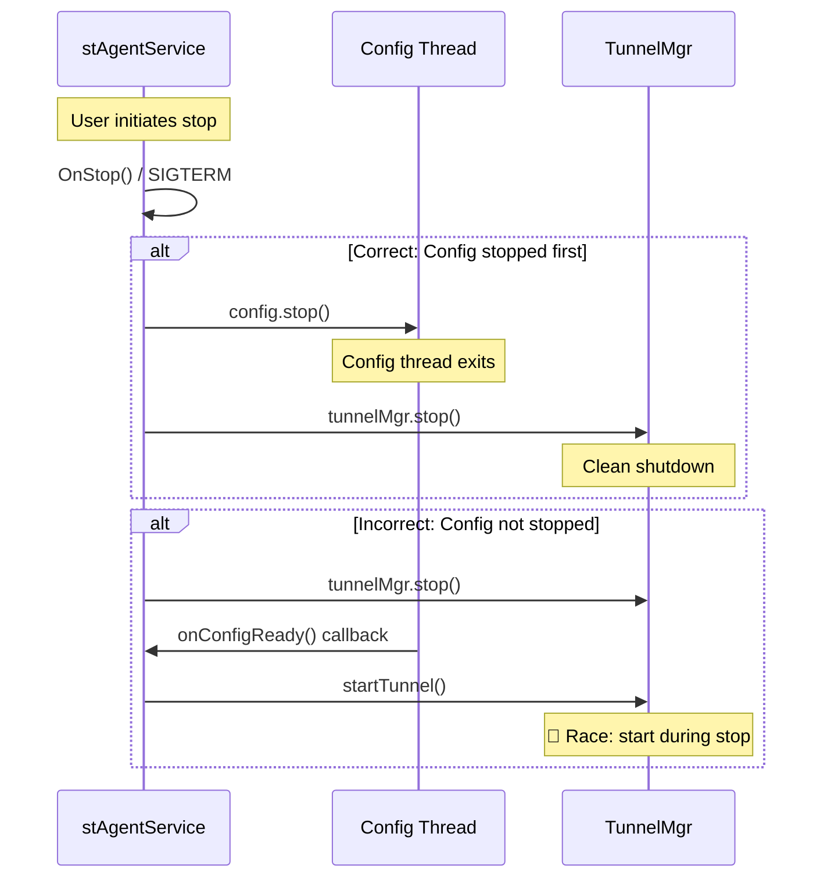

### Service Lifecycle ↔ FailClose

**Scenario**: FailClose activation during service restart

When the service stops, FailClose should transition to "service down" state rather than "tunnel failed". If the shutdown sequence does not explicitly call `failCloseMgr.stop()`, FailClose may interpret the tunnel disconnect as a failure and activate blocking, causing the user to lose all network connectivity even though the service is intentionally stopping.

**Risk**: False positive FailClose activation during:
- Service upgrade (service stops for MSI, restarts with new version)
- Service manual restart (`sc stop` + `sc start`)
- System shutdown

**Mitigation**: `failCloseMgr.stop()` is called from `tunnelMgr.stop()` to set a "graceful stop" flag before the tunnel is torn down.

### Cross-Flow Test Cases

| ID | Test Case | Components | Severity | Auto Priority |
|----|-----------|------------|----------|---------------|
| TC-03-CF01 | **Config callback during shutdown**: Trigger service stop while config thread is downloading new config, verify `onConfigReady` does not call `startTunnel` after stop begins | Service + Config | S2 | P1 |
| TC-03-CF02 | **FailClose false positive on restart**: Enable FailClose, stop service, verify FailClose does not activate blocking, restart service, verify tunnel reconnects | Service + FailClose | S2 | P1 |
| TC-03-CF03 | **NetworkMonitor reconnect race**: Stop service while NetworkMonitor is processing network change event, verify no reconnect attempt after service stop begins | Service + Tunnel | S3 | P2 |

---

## Appendix A: Bug Quick Reference

| Bug ID | Summary | Platform | Root Cause | Severity | Gap Type |
|--------|---------|----------|------------|----------|----------|
| ENG-601667 | Service dependency failure | Windows | Dependency service or group failed to start, blocking stAgentSvc startup | S1 | Regression |
| ENG-453051 | SIGTERM multiple issues | Linux | Signal handler not properly cleaning up resources before exit | S3 | Regression |
| ENG-587497 | Service crash during tunnel disconnect | Windows | Null pointer dereference in `nsssl::cleanup_all()` during shutdown | S2 | Test Gap |
| ENG-593503 | DEM thread stack overrun crash | Windows | Stack overflow in DEM module during service shutdown | S2 | Day-1 |

**Bug Distribution**:
- Windows: 3 bugs (75%)
- Linux: 1 bug (25%)
- macOS/Android/iOS/ChromeOS: 0 bugs

**Severity Distribution**:
- S1: 1 bug (25%) — Critical, service fails to start
- S2: 2 bugs (50%) — High severity, service crash or functional failure
- S3: 1 bug (25%) — Medium severity, cleanup issue

**Gap Type Distribution**:
- Regression: 2 bugs (50%) — Previously fixed, reintroduced
- Test Gap: 1 bug (25%) — Never tested
- Day-1: 1 bug (25%) — New feature, first release

---

## Appendix B: Methodology

### Severity Rating

| Severity | Criteria | Example |
|----------|----------|---------|
| S1 | Service fails to start, complete outage | Service crashes immediately on boot |
| S2 | Service crash, major functional failure, security issue | Crash during shutdown, upgrade blocked by self-protection |
| S3 | Degraded functionality, workaround available | Delayed restart by watchdog, incomplete cleanup |
| S4 | Minor issue, cosmetic, logging | Missing log entry, delayed status update |
| S5 | Enhancement, optimization | Improve shutdown speed, reduce memory usage |

### Test Case Format

Each test case includes:
- **ID**: Chapter prefix (TC-03) + platform suffix (W/M/L/A/I/C/X) + sequential number
- **Test Case**: Description with preconditions, steps, expected result
- **Severity**: S1-S5 based on impact if this case fails
- **Auto Priority**: P1 (must automate), P2 (should automate), P3 (manual ok)
- **Gap Type**: Regression (previously fixed bug), Day-1 (new feature), Test Gap (never tested), Corner Case (rare scenario)

### Gap Type Taxonomy

| Gap Type | Definition | Test Priority | Automation Priority |
|----------|------------|---------------|---------------------|
| **Regression** | Previously fixed bug, reintroduced in later release | P1 | P1 |
| **Day-1** | New feature, never released before, first test cycle | P1 | P1 |
| **Test Gap** | Existing feature, never had test coverage | P2 | P2 |
| **Corner Case** | Rare scenario, low probability, high impact if it occurs | P2-P3 | P2-P3 |

### Node Risk Assessment Criteria

For mermaid diagram nodes annotated with bugs or risks:
- **Risk**: What can go wrong at this node
- **Impact**: Severity + user-visible effect
- **Detection**: Log keywords, diagnostic commands, or monitoring metrics to identify the failure

---

## Related Chapters

- [00_overview.md](00_overview.md) — High-level architecture showing where stAgentSvc fits
- [01_installation.md](01_installation.md) — Service is first created and started during installation; upgrade monitor flow
- [02_enrollment.md](02_enrollment.md) — Enrollment occurs after service starts but before config download
- [04_config_download.md](04_config_download.md) — Config update thread started in onLogon; onConfigReady triggers tunnel
- [07_tunnel_management.md](07_tunnel_management.md) — TunnelMgr.startTunnel called from onConfigReady
- [11_failclose.md](11_failclose.md) — FailCloseMgr initialized in constructor, evaluated on session logon
- [17_ipc_nscom2.md](17_ipc_nscom2.md) — NSCom2 server created in onLogon for UI communication
- [19_integration_architecture.md](19_integration_architecture.md) — Multi-component interaction during lifecycle

---

**Chapter Summary**: The `stAgentSvc` service lifecycle follows a staged initialization pattern: constructor wiring → platform OnInit → config.init → onLogon (module creation) → config download → onConfigReady (tunnel start). Shutdown reverses this order, carefully stopping network-event-producing modules before tearing down tunnels. Windows uses an event-driven main loop with SCM integration and a separate watchdog service for crash recovery. macOS relies on launchd `KeepAlive` and `CFRunLoopRun`. Linux uses systemd `Restart=always` and signal-based blocking. The most common lifecycle bugs involve race conditions during startup (session vs config init), shutdown ordering (reconnect during teardown), and state management during power transitions (AOAC sleep/wake).
