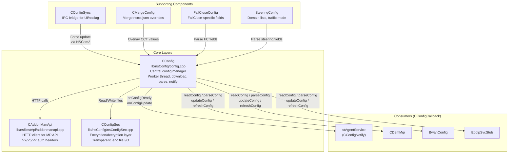
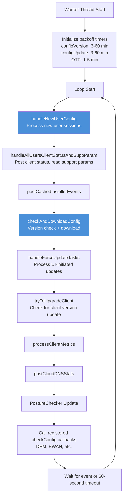
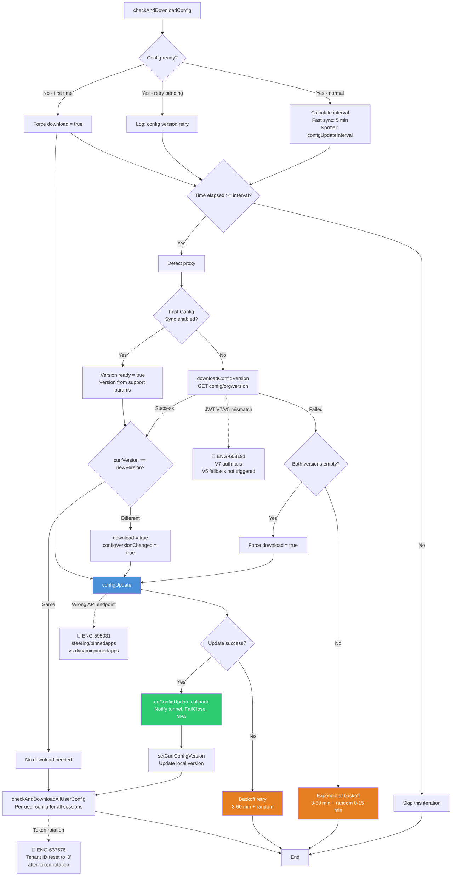
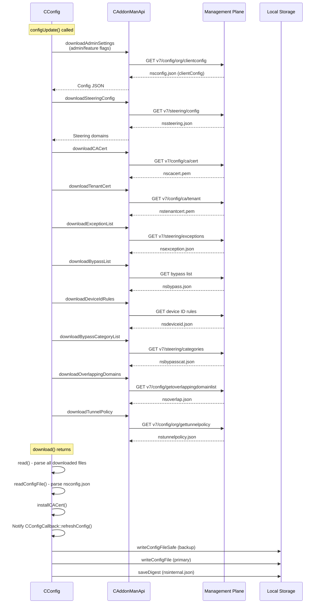
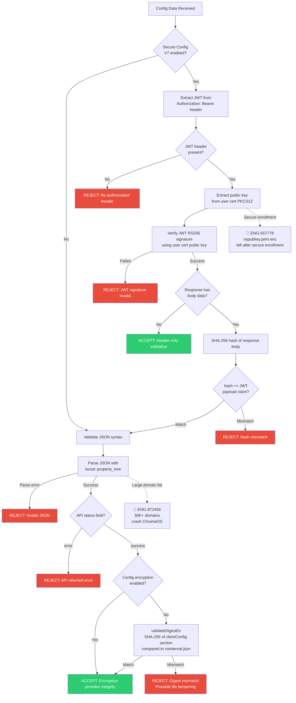
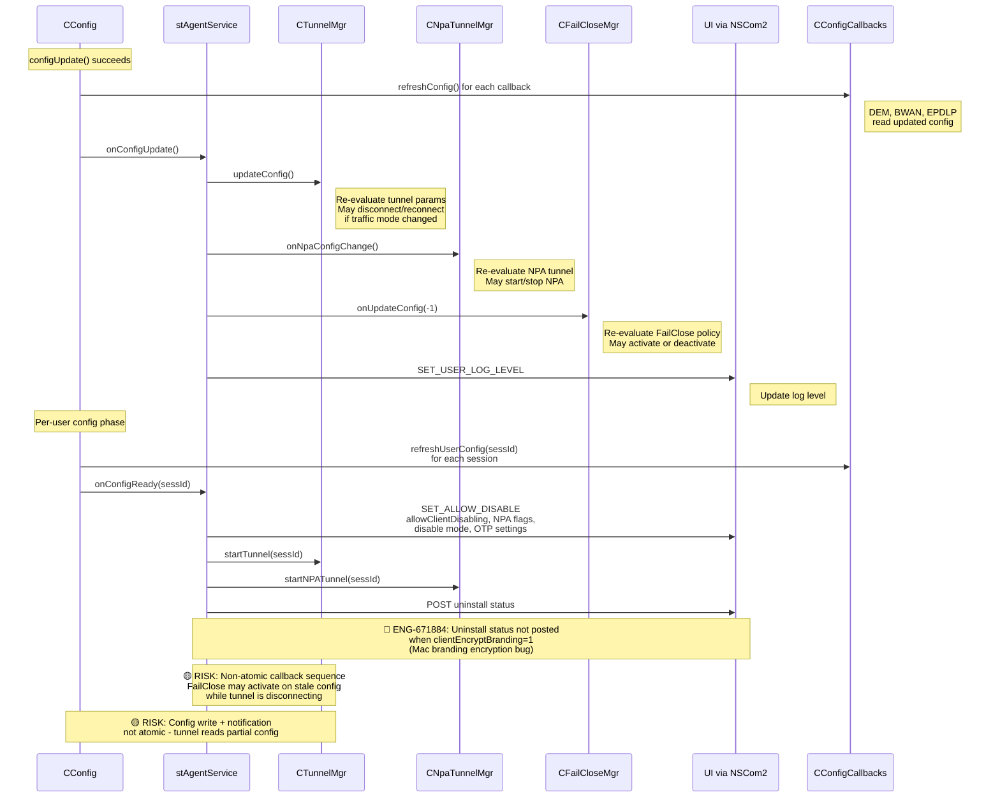
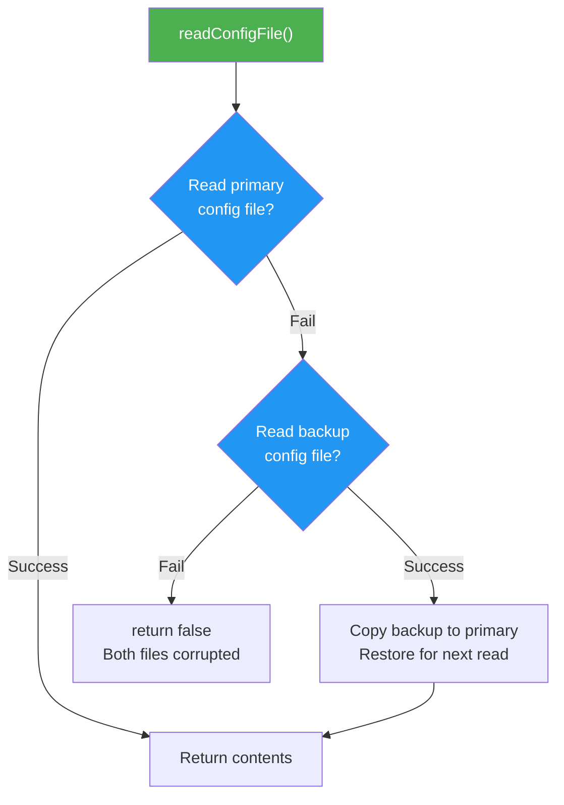
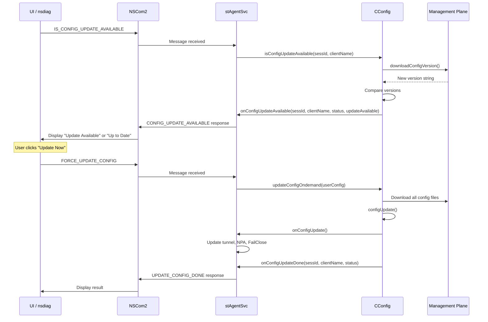

# 04. Config Download & Management

**Escalation Bug Count**: 7 | **Regression**: 3 (43%) | **Corner Case**: 2 (29%) | **Test Gap**: 1 (14%) | **Day-1**: 1 (14%)

📋 **[Test Cases — Google Sheet](https://docs.google.com/spreadsheets/d/1ackCZ-EcepXw1BkSGoi5Go9Ex1I72-fXqcqLGMGiuio/edit?gid=658761267#gid=658761267)**

> This chapter covers how NSClient downloads, validates, persists, and applies configuration from the Management Plane (MP). Configuration is the foundation of all client behavior -- steering mode, tunnel parameters, FailClose policy, certificate pinning, and feature flags all originate from config. Understanding the config lifecycle is critical for grey box testing because most functional bugs ultimately trace back to a config mismatch, a missed notification, or a validation failure. Each flow is illustrated with mermaid diagrams annotated with known escalation bug failure points (🔴 red) and predicted risk points (🟡 yellow).

---

## Executive Summary

**Why This Feature Exists**

NSClient is a policy-enforced agent. Without configuration from the Management Plane, the client cannot steer traffic, establish tunnels, or enforce security policies. The config subsystem must continuously synchronize the client's local state with the admin's intent expressed through the Netskope Admin Console.

**Design Decision: Polling Model with Version-Based Change Detection**

Rather than using a push model (WebSocket, long polling), NSClient uses a pull model: a background worker thread wakes up every 60 seconds and checks whether it is time to poll MP for config changes. The poll interval is configurable (default varies by mode) and uses version comparison to avoid downloading unchanged config. This design trades latency for simplicity and resilience -- the client works offline using cached config and recovers automatically when connectivity returns.

**Design Decision: Digest and JWT Validation**

Config integrity is protected by two complementary mechanisms: (1) SHA-256 digest stored in `nsinternal.json` and verified on every read, and (2) JWT signature validation using the user certificate's public key when Secure Config (V7 API) is enabled. This prevents both tampering on disk and man-in-the-middle modification during download.

**Design Decision: Config Encryption**

When the `encryptClientConfig` feature flag is enabled, all config files on disk are stored encrypted (`.enc` suffix). The `CConfigSec` module transparently handles encryption/decryption, so the rest of the codebase reads and writes config through a uniform API. Digest validation is skipped when encryption is active because the encryption itself provides integrity.

---

## Architecture

### Component Overview



The config subsystem spans three layers:

1. **CConfig** (`lib/nsConfig/config.h`, `config.cpp`) -- The central config manager. It owns the worker thread, orchestrates downloads, parses JSON, and notifies listeners.
2. **CAddonManApi** (`lib/nsRestApi/addonmanapi.h`, `addonmanapi.cpp`) -- HTTP client for MP API calls. Handles URL construction, authentication headers (V2/V5/V7), and response parsing.
3. **CConfigSec** (`lib/nsConfig/nsConfigSec.h`, `nsConfigSec.cpp`) -- Config file encryption/decryption layer. Transparently reads/writes `.enc` files when encryption is enabled.

Supporting components:
- **CConfigSync** (`lib/nsConfig/ConfigSync.h`) -- IPC bridge. UI and nsdiag use this to request config checks or force updates through NSCom2 messages.
- **CMergeConfig** (`lib/nsConfig/mergeConfig.h`) -- Merges `nscct.json` (CCT-generated overrides) into the main config tree. Uses property-tree traversal to overlay values.
- **FailCloseConfig** (`lib/nsConfig/failCloseConfig.h`) -- Parses and manages FailClose-specific config fields.
- **SteeringConfig** (`lib/nsConfig/SteeringConfig.h`) -- Parses and manages steering domain lists and traffic mode configuration.

### Notification Interfaces

Config changes propagate through two callback mechanisms:

**CConfigNotify** (implemented by `stAgentService`):

| Callback | When Called | What It Does |
|---|---|---|
| `onConfigReady(sessId)` | First time all config for a session is downloaded | Sends `SET_ALLOW_DISABLE` to UI, starts tunnel, starts NPA tunnel |
| `onConfigUpdate()` | After any successful config download | Calls `tunnelMgr.updateConfig()`, `npaTunnelMgr.onNpaConfigChange()`, `failCloseMgr.onUpdateConfig()` |
| `onConfigUpdateAvailable(sessId, clientName, status, updateAvailable)` | After version check (UI-initiated) | Informs UI whether a newer config version exists |
| `onConfigUpdateDone(sessId, clientName, status)` | After force-update completes (UI-initiated) | Informs UI that the forced config sync is done |

**CConfigCallback** (implemented by DEM, BWAN, EPDLP, etc.):

| Callback | When Called |
|---|---|
| `readConfig(pt)` | At the end of reading `nsconfig.json` from disk |
| `parseConfig(pt)` | At the end of parsing downloaded `nsconfig.json` |
| `updateConfig(pt)` | At the end of writing updated `nsconfig.json` to disk |
| `refreshConfig()` | At the end of `configUpdate()` after all common configs are downloaded |
| `refreshUserConfig(sessId)` | After all user-specific configs for a session are downloaded |
| `checkConfig()` | Every worker thread iteration (approximately every 60 seconds) |

---

## Config Worker Thread

The config worker thread is the heartbeat of the config subsystem. It runs in an infinite loop, sleeping for 60 seconds between iterations, and orchestrates all config-related activities.



The worker thread loop logic is captured in the diagram above (`lib/nsConfig/config.cpp::workerThread()`). It runs every 60 seconds, executing config check/download, upgrade checks, metrics posting, and callback notifications in sequence.

---

## Config Download Flow

### Version Check and Download Decision

The `checkAndDownloadConfig()` function decides whether to download new config based on version comparison. Two modes exist:

1. **Standard mode**: Calls `downloadConfigVersion()` to query `config/org/version` API. Compares `m_newConfigVersion` against `m_currConfigVersion`.
2. **Fast Config Sync mode**: Skips the separate version check API call. Instead, the config version is obtained from the support parameter response (piggybacked on the client status heartbeat). Reduces the polling interval from `m_configUpdateInterval` (admin-configurable) to 5 minutes.



The full version check and download decision logic is visualized in the diagram above (`lib/nsConfig/config.cpp::checkAndDownloadConfig()`).

**Node Risk Assessment**:

| Risk Node | Bug/Risk ID | Severity | Impact | Test Coverage |
|---|---|---|---|---|
| downloadConfigVersion (JWT V7/V5 mismatch) | ENG-608191 | S2 | Config download fails when MP expects V7 but client falls back to V5 | ❌ Not covered |
| configUpdate (Wrong API endpoint) | ENG-595031 | S2 | Cert-pinned apps use wrong endpoint (steering/pinnedapps vs dynamicpinnedapps) | ❌ Not covered |
| checkAndDownloadAllUserConfig (Token rotation) | ENG-637576 | S1 | Enrollment token rotation resets tenant ID to '0', breaking all config downloads | ❌ Not covered |

### Full Config Download

When a download is needed, `configUpdate()` calls `download()`, which fetches all config artifacts from MP:



**Download Categorization**:

| Category | Files | Failure Impact |
|---|---|---|
| **Mandatory** | nssteering.json, nscacert.pem, nstenantcert.pem | Download fails entirely; retries with backoff |
| **Mandatory (Web mode)** | nsexception.json | Mandatory in Web/Dynamic steering mode; optional in CASB mode |
| **Optional** | nsbypass.json, nsbypasscat.json, nsoverlap.json, nstunnelpolicy.json, nsdeviceid.json | Failure logged but does not block config readiness |

---

## Config Validation

Config validation is a multi-layer defense against tampered or corrupted configuration.

### Validation Flow



The validation pipeline is visualized in the diagram above (`lib/nsConfig/config.cpp::validateConfigData()`). Each step (JWT extraction, public key retrieval, RS256 signature verification, SHA-256 hash comparison) can independently reject the config.

**Node Risk Assessment**:

| Risk Node | Bug/Risk ID | Severity | Impact | Test Coverage |
|---|---|---|---|---|
| GET_PUBKEY (Secure enrollment) | ENG-557778 | S2 | nspubkey.pem.enc left on disk after secure enrollment, blocking JWT validation | ❌ Not covered |
| JSON_PARSE (Large domain list) | ENG-872456 | S1 | 30K+ domain steering config crashes ChromeOS during JSON parsing | ❌ Not covered |

### Digest Validation (On-Disk Integrity)

When `nsconfig.json` is read from disk, the `clientConfig` subtree is serialized and its SHA-256 hash is compared against the stored digest in `nsinternal.json`. This protects against local file tampering.

```cpp
// lib/nsConfig/config.cpp::readConfigFile() - digest validation section
if (!m_useDevConfig && !configMerged) {
    ptree ptClientConfig = pt.get_child("clientConfig");
    string clientConfig = write_json(ptClientConfig);
    
    if (!validateDigestEx(m_dataPath, clientConfig, DIGEST_NSCONFIG_TAG)) {
        ns_error("Client config validation failed");
        return false;  // Reject tampered config
    }
}

// Digest validation is SKIPPED when:
// 1. Config encryption is enabled (encryptClientConfig = true)
// 2. devConfig.json is present (development mode)
// 3. Config was merged with CCT overrides (nscct.json)
```

### Version Comparison

Config version comparison uses simple string comparison. The client does not implement version rollback protection as a hard block -- if the server returns an older version string, the client will download it. Version tracking is used primarily for change detection.

```cpp
// lib/nsConfig/config.cpp::setCurrConfigVersion()
void CConfig::setCurrConfigVersion(string& configVersion) {
    boost::mutex::scoped_lock lock(m_configVersionLock);
    if (!configVersion.empty()) {
        m_currConfigVersion.assign(configVersion);
    }
}
```

---

## Config Update Cascade

When config is successfully downloaded and validated, the `onConfigUpdate()` callback triggers a cascade of module updates. This is one of the highest-risk points in the system because multiple modules react to config changes concurrently.



**Node Risk Assessment**:

| Risk Node | Bug/Risk ID | Severity | Impact | Test Coverage |
|---|---|---|---|---|
| POST uninstall status | ENG-671884 | S2 | macOS uninstall status not posted when clientEncryptBranding=1 (branding encryption blocks status POST) | ❌ Not covered |
| onConfigUpdate callback (Non-atomic) | Predicted Risk | S2 | FailClose may activate on stale config while tunnel is disconnecting during config update | ❌ Not covered |
| Config write + notification (Race condition) | Predicted Risk | S3 | Tunnel may read partially updated config during write/notify sequence | ❌ Not covered |

**Risk: Non-Atomic Callback Sequence**

The callbacks in `onConfigUpdate()` (`stAgent/stAgentSvc/stAgentSvcEx.cpp`) are executed sequentially and synchronously: Tunnel → NPA → FailClose → UI notification. If the tunnel manager's `updateConfig()` triggers a disconnect (e.g., traffic mode change), the FailClose manager has not yet been notified of the config change. This creates a window where FailClose may activate based on stale config.

---

## Config Persistence

### Config File Inventory

| File | Content | Mandatory | Digest Tag |
|---|---|---|---|
| `nsconfig.json` | Main config (clientConfig, cache, log settings) | Yes | `DIGEST_NSCONFIG_TAG` |
| `nsconfig.json.bak` | Backup of nsconfig.json (written before primary) | Yes | -- |
| `nsbranding.json` | Tenant branding, orgKey, userKey, addonHost | Yes | -- |
| `nssteering.json` | Steering domain lists, traffic mode | Yes | -- |
| `nsexception.json` | Domain/IP bypass exceptions | Conditional | `DIGEST_NSEXCEPTION_TAG` |
| `nsbypass.json` | Bypass domain list | Optional | `DIGEST_NSBYPASS_TAG` |
| `nsbypasscat.json` | Bypass category list | Optional | `DIGEST_BYPASSCAT_TAG` |
| `nsoverlap.json` | Overlapping domain list | Optional | `DIGEST_NSDOMAIN_TAG` |
| `nstunnelpolicy.json` | Tunnel policy rules | Optional | -- |
| `nsdeviceid.json` | Device ID rules | Optional | -- |
| `nsdeviceidstatus.json` | Device ID status (per-user) | Optional | `DIGEST_DEVICEID_STATUS_TAG` |
| `nsinternal.json` | Digest hashes for all protected files | Yes | -- |
| `nscacert.pem` | Root CA certificate | Yes | -- |
| `nstenantcert.pem` | Tenant CA certificate | Yes | -- |
| `nsusercert.p12` | User certificate (PKCS12, per-user) | Yes | -- |
| `nsenforceEnrollExceptions.json` | Enforce enrollment exception domains | Conditional | -- |
| `dps.json` | Data path storage info (per-user config mode) | Optional | -- |
| `nsdebugmode.json` | Debug mode settings | Optional | -- |
| `devconfig.json` | Developer config overrides | Optional | -- |

### Config File Write Safety

Config writes use a backup-first strategy:

```cpp
// lib/nsConfig/config.cpp::updateConfigFile()
// Step 1: Write backup first (using writeConfigFileSafe - fsync)
m_configSec.writeConfigFileSafe(m_tenantConfigBackupFilePath, str);

// Step 2: Write primary
m_configSec.writeConfigFile(m_tenantConfigFilePath, str);

// Step 3: Save digest
saveDigest(m_dataPath, clientConfig, DIGEST_NSCONFIG_TAG);
```

On read, if the primary file is corrupted, the backup is used as fallback:



### Config Encryption

When `encryptClientConfig` is enabled in the admin console:

1. All config files are written with `.enc` suffix (e.g., `nsconfig.json.enc`)
2. `CConfigSec` transparently encrypts on write and decrypts on read
3. Old plaintext files are deleted from the config directories
4. Digest validation is skipped (encryption provides integrity)
5. Certain files are excluded from encryption: `nsinternal.json`, `nspubkey.pem`, `certutil.json`, `nsbranding.json`, `nsenforceEnrollExceptions.json`

```cpp
// lib/nsConfig/nsConfigSec.h
class CConfigSec {
    // Files excluded from encryption
    const vector<string> m_ignoredFiles = {
        "nsinternal.json", "nspubkey.pem", "certutil.json",
        "nsbranding.json", "nsenforceEnrollExceptions.json"
    };
    
    // macOS restriction
    // Config Encryption is supported only on Big Sur and above
    bool configEncryptionEnabled() {
#ifdef __APPLE__
        if (!bigSurOrAbove()) return false;
#endif
        return m_encryptConfig;
    }
};
```

### Config Merge (CCT Overrides)

The Client Configuration Tool (CCT) can generate a `nscct.json` file with local overrides. When present, `CMergeConfig` overlays these values on top of the downloaded `nsconfig.json`:

```cpp
// lib/nsConfig/config.cpp::readConfigFile()
configMerged = CMergeConfig::mergeNSConfigFile(pt, m_tenantConfigPath);

// When config is merged, digest validation is skipped
// because the merged content no longer matches the original digest
if (!m_useDevConfig && !configMerged) {
    validateDigestEx(...);
}
```

---

## Platform Differences

### Config File Locations

| Platform | Config Base Path | Data Path | Download Path |
|---|---|---|---|
| **Windows** | `%PROGRAMDATA%\Netskope\STAgent` | `<base>\data` | `<base>\download` |
| **macOS** | `/Library/Application Support/Netskope/STAgent` | `<base>/data` | `<base>/download` |
| **Linux** | `/opt/netskope/stagent` | `<base>/data` | `<base>/download` |
| **iOS** | App private data directory | `<base>/data` | `<base>/download` |
| **Android** | App private data directory | `<base>/data` | `<base>/download` |

### Platform-Specific Behaviors

| Feature | Windows | macOS | Linux | iOS | Android |
|---|---|---|---|---|---|
| **Config encryption** | Supported | Big Sur+ only | Supported | Not supported | Not supported |
| **Per-user config** | Yes (multi-session) | Yes (via uid) | Yes (via uid) | Single user | Single user |
| **Config merge (CCT)** | Yes | Yes | Yes | No | No |
| **Enforce enrollment exceptions** | Yes | Yes | No | No | No |
| **Session ID source** | `ProcessIdToSessionId()` | `getuid()` | `getuid()` | N/A | N/A |
| **Cached config on launch** | Read from disk | Read from disk | Read from disk | Read from disk (iOS ext relaunches on each tunnel enable) | Read from disk |
| **Digest validation** | Yes | Yes (desktop) | Yes | Skipped | Yes |

### Windows-Specific Details

- Config path retrieved via `getDefaultConfigPath()` which reads from `%PROGRAMDATA%`
- Write access to the config folder is restricted for non-SYSTEM users via `removeFolderUserWriteAccess()`
- `readUserConfigFile()` reads MSI installation parameters from `nsuserconfig.json`
- Smart card support checked during init (`checkSMC()`)

### macOS-Specific Details

- Config path set via `getDefaultConfigPath()` pointing to `/Library/Application Support/Netskope/STAgent`
- After config download, CA cert is installed immediately if running in Network Extension context
- Log level is propagated to the auxiliary service (`setLogLevelNE()`)
- Config encryption requires macOS Big Sur (11.0) or above

### Linux-Specific Details

- Config path is hardcoded to `/opt/netskope/stagent`
- nsdiag tool path: `/opt/netskope/stagent/nsdiag`
- DeviceId rules download failure is not treated as optional (different from other platforms)

### iOS-Specific Details

- The Network Extension process is terminated when the tunnel is disabled, so on each enable a new process launches and reads cached config
- `configIsReadyNotification()` is called after config is ready to notify the iOS UI layer
- NPA interface and user log level are set via Objective-C bridge functions

### Android-Specific Details

- Config path uses `g_androidPrivateDataDir` (app's private data directory)
- Overlapping domains and tunnel policy downloads are skipped
- DNS health check is configured during `onConfigUpdate()`
- Config download state transitions (`CONFIG_DOWNLOAD_START`, `CONFIG_DOWNLOAD_FINISHT`) are communicated to the Java layer

---

## Config JSON Structure

### nsconfig.json Top-Level Structure

```json
{
    "clientConfig": {
        "configName": "Default Policy",
        "userkey": "abc123...",
        "allowClientDisabling": true,
        "allowNpaDisabling": true,
        "npa_client_allow_disable": false,
        "steering_config_2": true,
        "userNotification": true,
        "hideClientIcon": false,
        "encryptClientConfig": false,
        "dynamicSteering": false,
        "reportClientStatus": true,
        "sendDeviceInfo": true,
        
        "configUpdate": {
            "updateIntervalInMin": 60
        },
        "clientUpdate": {
            "updateIntervalInMin": 240,
            "allowAutoUpdate": true,
            "showUpdateNotification": true,
            "goldenReleaseVersion": "",
            "allowAutoGoldenUpdate": false
        },
        "clientStatusUpdate": {
            "heartbeatIntervalInMin": 60
        },
        "clientUninstall": {
            "allowUninstall": true,
            "hash": "...",
            "salt": "..."
        },
        
        "failClose": {
            "fail_close": false,
            "exclude_npa": false,
            "notification": true,
            "captive_portal_timeout": 3
        },
        
        "protocol": "TLS",
        "mtu": 1500,
        
        "npa": { ... },
        "externalProxyConfig": { ... },
        "metrics": { ... },
        "onpremcheck": { ... },
        "postureValidation": { ... }
    },
    "log": {
        "logLevel": "info",
        "enablePktDump": false
    },
    "cache": {
        "device": {
            "hostname": "WORKSTATION-01",
            "updateTimestamp": 1713200000,
            "serial": "ABC123",
            "os": "Windows",
            "osVersion": "10.0.19045",
            "model": "OptiPlex 7090",
            "make": "Dell Inc.",
            "nsVersion": "132.0.0.1234"
        },
        "appInstallTimestamp": 0
    }
}
```

### Key Config Fields and Their Effects

| JSON Path | Type | Default | Effect on Client |
|---|---|---|---|
| `clientConfig.configUpdate.updateIntervalInMin` | int | 60 | Config polling interval in minutes |
| `clientConfig.clientUpdate.updateIntervalInMin` | int | 240 | Client version check interval in minutes |
| `clientConfig.clientUpdate.allowAutoUpdate` | bool | true | Whether auto-upgrade is enabled |
| `clientConfig.clientStatusUpdate.heartbeatIntervalInMin` | int | 60 | Client status reporting interval |
| `clientConfig.failClose.fail_close` | bool | false | FailClose policy enabled |
| `clientConfig.failClose.captive_portal_timeout` | int | 3 | Captive portal detection timeout in minutes |
| `clientConfig.allowClientDisabling` | bool | true | User can disable Internet Security |
| `clientConfig.allowNpaDisabling` | bool | true | User can disable Private Access |
| `clientConfig.encryptClientConfig` | bool | false | Encrypt config files on disk |
| `clientConfig.enableClientSelfProtection` | bool | false | Prevent service tampering |
| `clientConfig.steering_config_2` | bool | false | Use Steering Config V2 format |
| `clientConfig.dynamicSteering` | bool | false | Enable dynamic steering |
| `clientConfig.protocol` | string | "TLS" | Tunnel protocol |
| `clientConfig.mtu` | int | (system) | Tunnel MTU |
| `clientConfig.secure_config_validation` | bool | false | Enable JWT-based config validation (V7) |

---

## API Endpoints

### Config Version Check

| API Version | Endpoint | Authentication |
|---|---|---|
| V1 (legacy) | `config/org/version?orgkey=X&userkey=Y` | Query params |
| V5 | `v5/config/org/version` | HMAC auth header |
| V7 (Secure Config) | `v7/config/org/version` | JWT auth header (RS256, user cert) |

### Client Config Download

| API Version | Endpoint | Authentication |
|---|---|---|
| V2 | `v2/config/org/clientconfig?orgkey=X&hashkey=Y&userconfig=1` | Query params |
| V5 | `v5/config/org/clientconfig?userconfig=1` | HMAC auth header |
| V7 (Secure Config) | `v7/config/org/clientconfig?userconfig=1` | JWT auth header |

### Other Config-Related APIs

| Purpose | V7 Endpoint |
|---|---|
| CA Certificate | `v7/config/ca/cert` |
| User Certificate | `v7/config/user/cert` |
| Steering Exceptions | `v7/steering/exceptions` |
| Bypass Categories | `v7/steering/categories` |
| Tunnel Policy | `v7/config/org/gettunnelpolicy` |
| Overlapping Domains | `v7/config/getoverlappingdomainlist` |
| Managed Checks | `v7/config/org/getmanagedchecks` |
| Device Classification | `v7/client/deviceclassification` (POST) |
| Client Status | `v7/update/clientstatus` (POST) |

---

## Backoff and Retry Strategy

### Exponential Backoff Timers

| Timer | Min (min) | Max (min) | Random Jitter | Used For |
|---|---|---|---|---|
| `m_configVersionBackoff` | 3 | 60 | 0-15 min | Config version check retry |
| `m_configUpdateBackoff` | 3 | 60 | 0-15 min | Config download retry |
| `m_OTPBackoff` | 1 | 5 | -- | OTP request retry |
| `m_enforceEnrollCfgBackoff` | 3 | 60 | -- | Enforce enrollment config retry |
| `m_brandingBackoff` (per user) | -- | -- | 1-60 sec | Branding file download retry |

### Retry Behavior

1. **Version check failure**: Enters retry mode with exponential backoff (3-60 min). If both `m_currConfigVersion` and `m_newConfigVersion` are empty, forces a full download instead.
2. **Config download failure**: Uses `m_configUpdateBackoff` with similar 3-60 min range. The `m_configReady` flag stays false, causing the next iteration to try again.
3. **Branding download failure**: Per-user backoff. The user's config loop continues to the next iteration without processing further config for that user.
4. **Individual file download failure**: Mandatory files cause overall download failure. Optional files are logged but do not block config readiness.

---

## Force Config Update (UI-Initiated)

Users or nsdiag can trigger an immediate config update through IPC:



**Pseudo Code**:
```cpp
// lib/nsConfig/config.cpp::updateConfigOndemand()
bool CConfig::updateConfigOndemand(CUserConfig& userConfig) {
    downloadAdminSettings(sessionID);
    
    if (IsDeviceTagNeedToReload()) {
        UpdateDeviceTagsToUserConfig(userConfig);
    }
    
    downloadUserConfig(userConfig);
    
    m_configReady = configUpdate();
    if (!m_allConfigDownloaded || !m_allConfigReady) {
        return false;
    }
    
    handleDeviceClassification(userConfig, false);
    
    if (checkIfdownloadUserCert(userConfig)) {
        downloadUserCert(userConfig);
    }
    
    for (auto cb : m_configCallbacks) {
        cb->refreshUserConfig(sessionID);
    }
    
    m_lastConfigChecked = time(NULL);
    
    if (!m_configNotify->onConfigUpdate()) {
        return false;
    }
    setCurrConfigVersion(m_newConfigVersion);
    return true;
}
```

---

## Troubleshooting

### Log Keywords

| Keyword Pattern | Meaning |
|---|---|
| `config thread started` | Worker thread initialized |
| `starting config/data download` | Config check cycle beginning |
| `downloading config version` | Version check API call |
| `New config version X, Current config version Y` | Version comparison result |
| `full config update` | Full download triggered |
| `download steering config failed` | Steering config download failed (mandatory) |
| `config update failed, retry in X minutes` | Download failed, entering backoff |
| `Notify for config updates` | Successful download, notifying modules |
| `Notify for config ready for sessId X` | Per-user config ready |
| `ValidateConfig: response no Authorization header` | JWT validation failed (V7) |
| `ValidateConfig: hash mismatch` | Data integrity check failed |
| `Client config validation failed` | Digest mismatch on disk |
| `failed to read file nsconfig.json` | Primary config file corrupted |
| `Restoring config file from .bak` | Fallback to backup file |
| `Saved the client config, len X` | Config successfully written to disk |
| `Synchronize Configuration started` | UI-initiated force update |
| `config version retry` | Retry after failed version check |

### Common Issue 1: Config Download Stuck in Retry Loop

**Symptoms**: Client shows "Disabled" or "Connecting" indefinitely. Logs show repeated "config update failed, retry in X minutes" with increasing intervals.

**Diagnosis**:
```bash
grep -i "config update failed\|download.*failed\|retry in" nsdebuglog.log
grep -i "proxy.*detect\|proxy.*credential" nsdebuglog.log
```

**Common Causes**:
- Proxy not detected before config download (PAC-based proxy)
- MP hostname unreachable (DNS or firewall)
- Certificate expired (user cert for V7 validation)

**Resolution**: Check proxy settings, verify MP connectivity, check cert expiry.

### Common Issue 2: Config Digest Validation Failure

**Symptoms**: Client disables after reboot. Logs show "Client config validation failed".

**Diagnosis**:
```bash
grep -i "config validation failed\|digest.*mismatch\|validateDigest" nsdebuglog.log
```

**Common Causes**:
- Third-party security software modified config files
- Disk corruption during power loss
- Config file permissions changed

**Resolution**: Force config re-download via nsdiag or UI. If encryption is enabled, digest validation is automatically skipped.

### Common Issue 3: Config Update Does Not Take Effect

**Symptoms**: Admin changes policy in console, but client behavior does not change after expected polling interval.

**Diagnosis**:
```bash
grep -i "New config version\|config version.*same\|onConfigUpdate\|updateConfig" nsdebuglog.log
```

**Common Causes**:
- Config version not incremented on MP side
- Fast Config Sync not enabled (longer polling interval)
- `onConfigUpdate()` callback failed (tunnel manager error)
- Config merge (CCT override) overwriting the admin change

**Resolution**: Use nsdiag to force config sync. Check if CCT override file (`nscct.json`) exists.

---

## Windows

**Bug Count**: 3 | **Key Gaps**: JWT auth version mismatch, API endpoint selection, secure enrollment cleanup

### Windows Confirmed Bug Mapping

| Bug ID | Summary | Root Cause | Severity | Gap Type |
|--------|---------|------------|----------|----------|
| ENG-557778 | nspubkey.pem.enc after secure enrollment | `nspubkey.pem.enc` not deleted after secure enrollment completes | S2 | Regression |
| ENG-595031 | Wrong API endpoint for cert-pinned apps | Hardcoded `steering/pinnedapps` instead of `dynamicpinnedapps` | S2 | Regression |
| ENG-637576 | Enrollment token rotation resets tenant ID to '0' | Token rotation logic doesn't preserve tenant ID | S1 | Regression |

---

## macOS

**Bug Count**: 1 | **Key Gaps**: Branding encryption blocks status POST

### macOS Confirmed Bug Mapping

| Bug ID | Summary | Root Cause | Severity | Gap Type |
|--------|---------|------------|----------|----------|
| ENG-671884 | Uninstall status not posted when clientEncryptBranding=1 | Branding encryption prevents uninstall status POST | S2 | Corner Case |

---

## ChromeOS

**Bug Count**: 1 | **Key Gaps**: Large config parsing crash

### ChromeOS Confirmed Bug Mapping

| Bug ID | Summary | Root Cause | Severity | Gap Type |
|--------|---------|------------|----------|----------|
| ENG-872456 | 30K+ domain steering config crash | JSON parser memory limit exceeded with 30K+ domains | S1 | Corner Case |

---

## Backend

**Bug Count**: 2 | **Key Gaps**: JWT version mismatch, case-sensitive ID matching

### Backend Confirmed Bug Mapping

| Bug ID | Summary | Root Cause | Severity | Gap Type |
|--------|---------|------------|----------|----------|
| ENG-608191 | Config download fails (JWT V7 vs V5 mismatch) | MP sends V7 JWT, client expects V5 auth, no fallback | S1 | Day-1 |
| ENG-693785 | Case-sensitive user/usergroup ID mismatch in steering configs | Backend uses case-sensitive ID matching, client normalizes to lowercase | S2 | Test Gap |

---

## Automation Coverage Summary

| Test Suite | Coverage | Gaps |
|-------------|----------|------|
| `custom_client_configuration/` | ⚠️ Partial | Version change detection covered in enrollment flow; no explicit version comparison test, no backoff/recovery test |
| Config integrity validation | ❌ None | No JWT validation, digest validation, or tampering tests |
| Config update cascade | ❌ None | No tunnel/FailClose callback sequence tests |
| Config encryption | ❌ None | No encryption toggle or file migration tests |
| Per-user config (VDI) | ❌ None | No multi-session config isolation tests |

---

## Coverage Gaps

| Gap Category | Missing Coverage | Priority |
|--------------|------------------|----------|
| **Security** | JWT V7 validation, cert-pinned app API endpoint selection | P1 |
| **Resilience** | Exponential backoff, recovery from MP downtime | P1 |
| **Scale** | 30K+ domain config parsing (ChromeOS crash risk) | P1 |
| **Atomicity** | Config update callback sequence, tunnel/FailClose race conditions | P2 |
| **Encryption** | Branding encryption toggle, excluded file handling | P2 |

---

## Cross-Flow Interactions

### Interaction 1: Config Update Triggers Tunnel Reconnect with Stale FailClose Policy

**Scenario**: Admin changes traffic mode from Web to All and disables FailClose simultaneously.

**Flow**: `configUpdate()` → `onConfigUpdate()` → `tunnelMgr.updateConfig()` (disconnects) → `failCloseMgr.onUpdateConfig()` (reads new config)

**Risk**: If the tunnel disconnects before FailClose reads the new config, FailClose may activate based on stale policy.

**Test Case**: Change traffic mode and FailClose policy simultaneously, monitor for transient FailClose activation.

### Interaction 2: Enrollment Token Rotation During Config Download

**Scenario**: Enrollment token rotates while config download is in progress.

**Flow**: `checkAndDownloadConfig()` → `downloadConfigVersion()` → Token rotation event → `downloadAdminSettings()` (uses new token) → Tenant ID reset to '0'

**Risk**: **ENG-637576** -- Token rotation resets tenant ID to '0', breaking all subsequent config downloads.

**Test Case**: Trigger token rotation during config download, verify tenant ID preserved.

### Interaction 3: Secure Enrollment Leaves nspubkey.pem.enc

**Scenario**: Client completes secure enrollment but doesn't clean up temporary public key file.

**Flow**: Secure enrollment → `downloadUserCert()` → Cert installed → `nspubkey.pem.enc` not deleted → Next JWT validation uses wrong pubkey

**Risk**: **ENG-557778** -- Leftover `nspubkey.pem.enc` blocks JWT validation after secure enrollment.

**Test Case**: Complete secure enrollment, verify `nspubkey.pem.enc` deleted from config directory.

### Cross-Flow Risk Matrix

| Interaction | Feature 1 | Feature 2 | Failure Mode | Severity | Bug ID |
|-------------|-----------|-----------|--------------|----------|--------|
| Config Update + Tunnel Disconnect | Config Download | Tunnel Management | FailClose activates on stale config | S2 | Predicted |
| Config Update + FailClose Policy | Config Download | FailClose | FailClose not notified before tunnel disconnects | S2 | Predicted |
| Token Rotation + Config Download | Enrollment | Config Download | Tenant ID reset to '0' | S1 | ENG-637576 |
| Secure Enrollment + JWT Validation | Enrollment | Config Download | nspubkey.pem.enc blocks validation | S2 | ENG-557778 |
| Branding Encryption + Status POST | Config Download | Client Status | Uninstall status not posted | S2 | ENG-671884 |
| Large Domain List + ChromeOS | Config Download | Steering | JSON parser crash | S1 | ENG-872456 |

---

## Appendix A: Bug Quick Reference

| Bug ID | Summary | Platform | Root Cause | Severity | Gap Type |
|--------|---------|----------|------------|----------|----------|
| ENG-608191 | Config download fails (JWT V7 vs V5 mismatch) | Backend | MP sends V7 JWT, client expects V5 auth, no fallback mechanism | S1 | Day-1 |
| ENG-557778 | nspubkey.pem.enc after secure enrollment | Windows | Temporary public key file not deleted after secure enrollment | S2 | Regression |
| ENG-595031 | Wrong API endpoint for cert-pinned apps | Windows | Hardcoded `steering/pinnedapps` instead of `dynamicpinnedapps` | S2 | Regression |
| ENG-637576 | Enrollment token rotation resets tenant ID to '0' | Windows | Token rotation logic doesn't preserve tenant ID during config download | S1 | Regression |
| ENG-671884 | Uninstall status not posted when clientEncryptBranding=1 | macOS | Branding encryption blocks uninstall status POST to MP | S2 | Corner Case |
| ENG-872456 | 30K+ domain steering config crash | ChromeOS | JSON parser memory limit exceeded with 30K+ domain list | S1 | Corner Case |
| ENG-693785 | Case-sensitive user/usergroup ID mismatch in steering configs | Backend | Backend uses case-sensitive ID matching, client normalizes to lowercase | S2 | Test Gap |

---

## Appendix B: Methodology

### Severity Ratings

| Severity | Definition | Example |
|----------|------------|---------|
| **S1** | Critical -- Service fails to start, no tunnel, data loss | Tenant ID reset to '0', 30K+ domain crash |
| **S2** | High -- Core feature broken, workaround exists | JWT validation fails, API endpoint wrong |
| **S3** | Medium -- Minor feature broken, no user impact | UI cosmetic issues, non-critical log errors |
| **S4** | Low -- Edge case, rare scenario | Unusual config combinations |
| **S5** | Trivial -- Typos, log messages | Documentation errors |

### Gap Types

| Gap Type | Definition | Example |
|----------|------------|---------|
| **Regression** | Previously working feature breaks after code change | nspubkey.pem.enc cleanup after secure enrollment |
| **Day-1** | Never worked since feature launch | JWT V7/V5 version mismatch |
| **Test Gap** | Feature works but has no test coverage | Case-sensitive user/usergroup ID matching |
| **Corner Case** | Rare combination of conditions | Branding encryption + uninstall status, 30K+ domains |

### Automation Priority

| Priority | Definition | Target |
|----------|------------|--------|
| **P1** | Must automate -- high risk, high frequency | Config download, JWT validation, version detection |
| **P2** | Should automate -- medium risk, medium frequency | Backoff/recovery, encryption toggle |
| **P3** | Nice to have -- low risk, low frequency | Config file backup, multi-session VDI |

### Test Case Format

Each test case includes:
- **ID**: Unique test case identifier (TC-XX-YY)
- **Test Case**: Brief description
- **Severity**: S1-S5 (impact if bug escapes)
- **Related Bugs**: Known bugs this test would catch
- **Flow Point**: Code location being tested
- **Gap Type**: Regression/Day-1/Test Gap/Corner Case
- **Automation Priority**: P1-P3
- **Preconditions**: System state before test
- **Steps**: Numbered test steps
- **Expected Result**: What should happen
- **Failure Indicators**: Log patterns or UI states indicating failure
- **Risk if Untested**: Business impact if this test is skipped

---

## Related Chapters

- [00_overview.md](00_overview.md) -- Architecture overview and component relationships
- [02_enrollment.md](02_enrollment.md) -- Initial config received during enrollment (branding file)
- [05_steering_config.md](05_steering_config.md) -- Steering config is downloaded as part of the config update cycle
- [06_client_status.md](06_client_status.md) -- Client status reporting uses the same polling infrastructure
- [07_tunnel_management.md](07_tunnel_management.md) -- Config changes trigger tunnel reconnect via `onConfigUpdate()`
- [11_failclose.md](11_failclose.md) -- FailClose policy is a config field; changes propagate via `onUpdateConfig()`
- [13_certificate_management.md](13_certificate_management.md) -- User certs and CA certs are downloaded as part of the config cycle
- [17_ipc_nscom2.md](17_ipc_nscom2.md) -- CConfigSync uses NSCom2 for UI-initiated config operations
- [18_security.md](18_security.md) -- JWT validation and config encryption details

---

**Chapter Summary**: NSClient's config subsystem is a polling-based system where a background worker thread periodically checks for config version changes on the Management Plane, downloads updated config artifacts when changes are detected, validates them through JWT signature verification and SHA-256 digest checks, persists them to disk with backup-first safety, and cascades changes to tunnel, steering, FailClose, and NPA modules through a callback chain. The highest-risk patterns are the non-atomic callback sequence during config updates (which can cause transient FailClose activation) and the digest validation bypass during encryption toggle transitions.
