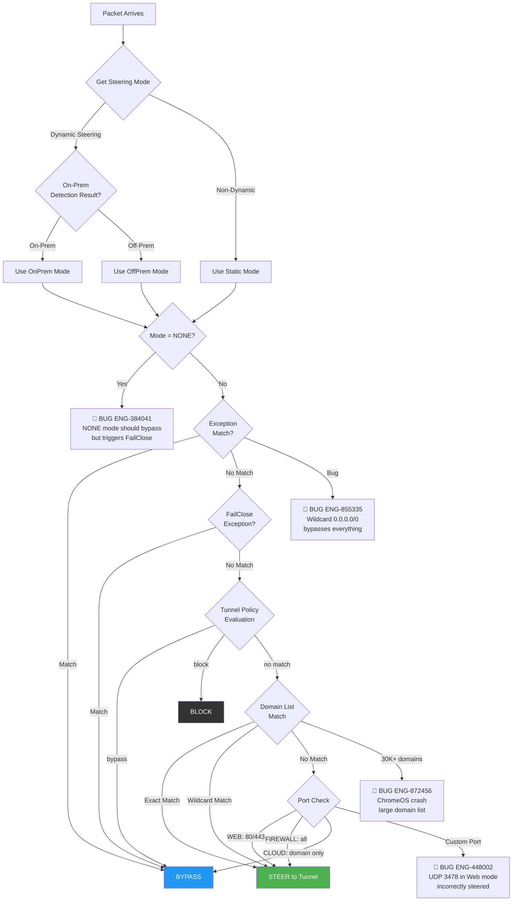
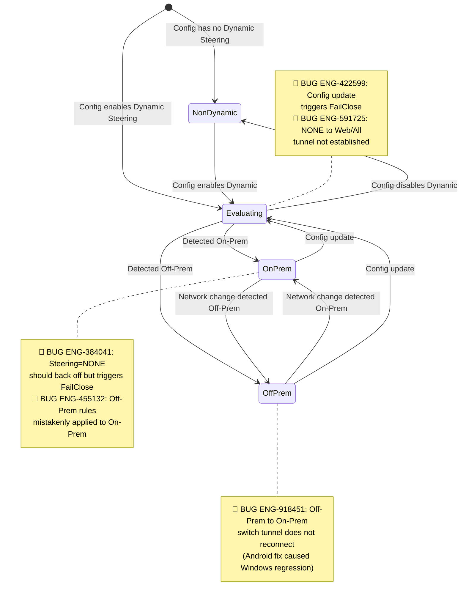
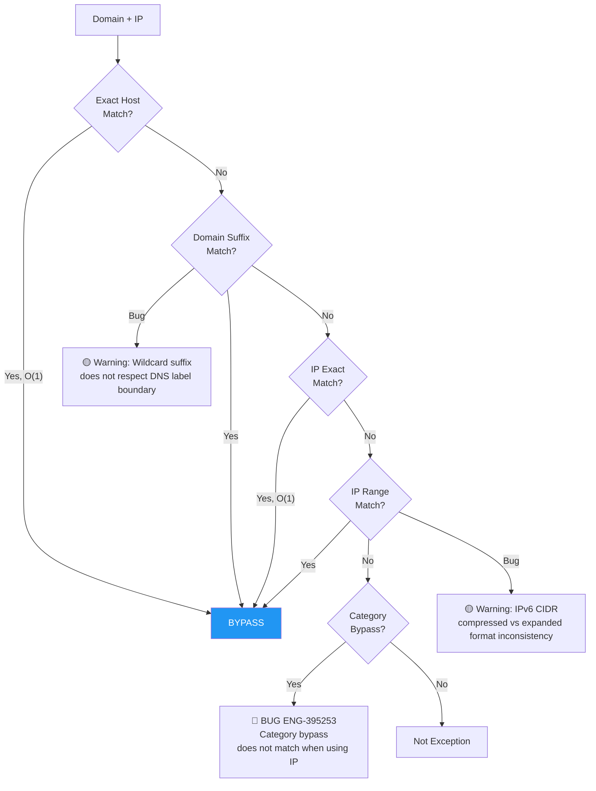
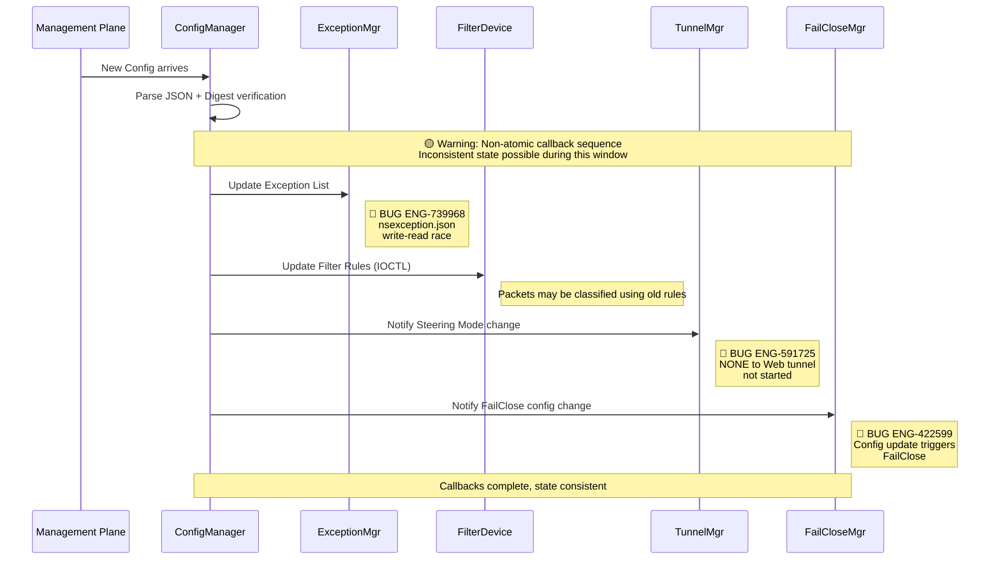
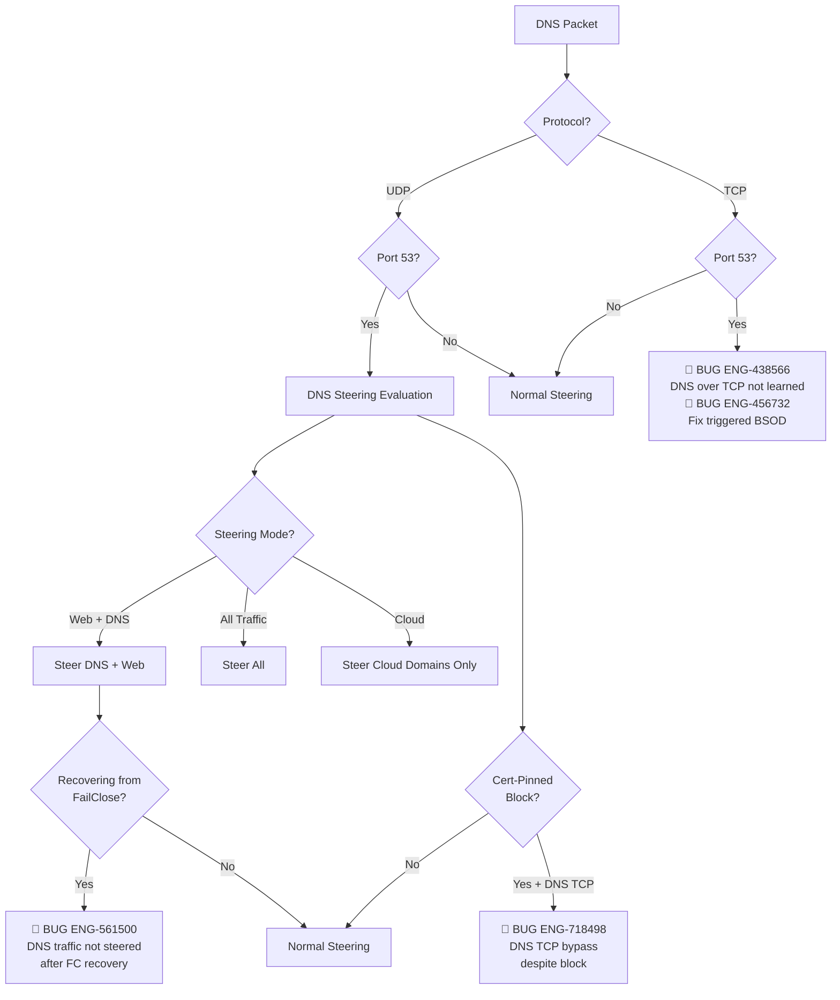

# 05. Steering Config

**Escalation Bug Count**: 103 | **Regression**: 21 (20%) | **Day-1**: 32 (31%) | **Test Gap**: 13 (13%) | **Corner Case**: 27 (26%)

📋 **[Test Cases — Google Sheet](https://docs.google.com/spreadsheets/d/1ackCZ-EcepXw1BkSGoi5Go9Ex1I72-fXqcqLGMGiuio/edit?gid=1060361683#gid=1060361683)**

> This chapter covers how NSClient decides what to do with every network packet: steer it through the Netskope tunnel, bypass it directly, or block it. The steering decision engine is the **highest bug-density area** in the entire product (103 of 174 escalation bugs). Each flow is illustrated with mermaid diagrams annotated with known escalation bug failure points (red) and predicted risk points (yellow). Platform-specific sections follow the shared flows.

---

## Overview

NSClient's traffic steering configuration determines the fate of every packet leaving the device. The decision involves five interconnected processes:

1. **Steering Decision Flow** — The core packet classification logic: for each packet, determine the current steering mode, evaluate exceptions, match against domain lists, and decide whether to STEER, BYPASS, or BLOCK.
2. **Dynamic Steering State Machine** — When Dynamic Steering is enabled, the client continuously evaluates whether the device is On-Prem or Off-Prem and applies the corresponding steering mode. State transitions triggered by network changes or config updates are the single highest source of escalation bugs.
3. **Exception Matching Priority** — A multi-layered exception evaluation: exact host match, domain suffix match, IP exact match, IP range match, and category bypass. Each layer has subtly different matching semantics and known failure modes.
4. **Config Update Race Condition** — When Management Plane pushes a new config, multiple subsystems (ExceptionMgr, FilterDevice, TunnelMgr, FailCloseMgr) are updated via a non-atomic callback sequence. Packets processed during this window can be classified using partially-updated rules.
5. **DNS Security Sub-Flow** — DNS traffic receives special treatment depending on protocol (UDP vs TCP) and steering mode. DNS over TCP handling has a confirmed fix-regression chain (ENG-438566 fix caused ENG-456732 BSOD).

The highest-risk area is the **Dynamic Steering + FailClose interaction**: when steering mode changes (especially NONE to WEB/ALL transitions), the tunnel may not be established and FailClose may be falsely triggered, causing complete network outage (S1). The **config update race condition** is the second highest risk, where non-atomic callbacks create a window for inconsistent packet classification.

---

## Steering Decision Flow (Core Flow)

When a packet arrives at the NSClient filter device, it passes through a multi-stage decision tree. The steering mode is determined first (Dynamic Steering evaluates On-Prem/Off-Prem status; non-dynamic uses the static config value). Then the packet is checked against exception lists, tunnel policies, domain lists, and finally port-based rules.

Four confirmed escalation bugs cluster at critical decision points in this flow: NONE mode incorrectly triggering FailClose (ENG-384041), wildcard exception 0.0.0.0/0 bypassing all traffic (ENG-855335), UDP port 3478 incorrectly steered in Web mode (ENG-448002), and 30K+ domain lists crashing ChromeOS/Linux (ENG-872456, ENG-948106).

**Node Risk Assessment**:

| Node | Risk Level | Assessment |
|---|---|---|
| Packet Arrives | Low | Entry point; packet already passed kernel filter |
| Get Steering Mode | Medium | Mode lookup from config — stale config or mid-update read could return wrong mode (see Config Update Race Condition) |
| On-Prem Detection Result? | Medium | HTTP probe-based detection — false positive/negative affects all subsequent steering (see TC-ST-08) |
| Use OnPrem Mode | Low | Config value lookup |
| Use OffPrem Mode | Low | Config value lookup |
| Use Static Mode | Low | Config value lookup; simplest path |
| Mode = NONE? | High | **Bug**: ENG-384041 — NONE mode triggers FailClose instead of bypassing |
| Exception Match? | High | **Bug**: ENG-855335 — Wildcard 0.0.0.0/0 bypasses everything |
| BYPASS | Low | Terminal action; packet bypasses tunnel |
| FailClose Exception? | Medium | FailClose exception list is separate from steering exceptions — mismatch between lists can cause inconsistent behavior during FailClose |
| Tunnel Policy Evaluation | Medium | Policy order matters (ENG-543228 shows tunnel policy collision risk); incorrect order can cause bypass instead of steer |
| BLOCK | Low | Terminal action; packet dropped |
| Domain List Match | High | **Bug**: ENG-872456 — 30K+ domain list causes crash |
| Port Check | High | **Bug**: ENG-448002 — UDP 3478 incorrectly steered in Web mode |
| STEER to Tunnel | Low | Terminal action; packet sent to tunnel |

**Critical Bug Concentration Points**:

| Decision Point | Known Bugs | Impact Level | Automation |
|---|---|---|---|
| Mode = NONE bypass | ENG-384041, ENG-422599 | S1 — Triggers FailClose causing complete network outage | Partial — `fail_close/test_p0.py::test_01_configure_failclose_with_dse` validates NONE mode disabled state but not FailClose trigger |
| Exception wildcard | ENG-855335 (0.0.0.0/0) | S1 — All traffic bypassed | Partial — `nplan_5628_onpremises_profiles/test_nplan_5628.py` tests wildcard domains but not 0.0.0.0/0 bypass |
| Domain list overflow | ENG-872456, ENG-948106 | S1 — Client crash | Not covered — no 30K+ domain load test |
| UDP port steering | ENG-448002 (port 3478) | S3 — QUIC/WebRTC anomaly | Not covered — no UDP port-specific steering test |
| Custom port domain | ENG-729176 (SMB in Web mode) | S2 — High CPU | Partial — `custom_steering_configuration/test_p0.py::test_06_new_configuration_add_multiple_ou_ug_os_type` tests custom config |
| IPv6 steering | ENG-543661, ENG-793442 | S3 — Performance degradation | Not covered — no IPv6 performance/steering test |

---

## Dynamic Steering State Machine

Dynamic Steering enables NSClient to automatically switch between different steering modes based on whether the device is On-Prem (connected to the corporate network) or Off-Prem. The state machine has four states: NonDynamic, Evaluating, OnPrem, and OffPrem. Transitions are triggered by network change events and config updates.

This state machine is the source of the most severe steering bugs. Five confirmed escalation bugs map directly to state transitions: NONE mode triggering FailClose (ENG-384041), Off-Prem rules applied On-Prem (ENG-455132), config update triggering FailClose (ENG-422599), NONE-to-Web tunnel not established (ENG-591725), and Off-Prem-to-On-Prem switch not reconnecting the tunnel (ENG-918451, a cross-platform regression from an Android fix).

**Bug Mapping — Confirmed Escalation Bugs**:

| State Transition | Known Bugs | Root Cause | Automation |
|---|---|---|---|
| Steering=NONE + Off-Prem | ENG-384041 | NONE mode should bypass but triggers FailClose | Partial — `fail_close/test_p0.py` validates NONE disabled but not FailClose trigger path |
| Off-Prem rule on On-Prem | ENG-455132 | Legacy pre-R107 rule application logic | Covered — `exception_domains/test_p0.py::test_20_exception_domains_on_prem` + `test_21_exception_domains_off_prem` |
| Off-Prem to On-Prem switch | ENG-918451 | Android fix (ENG-707767) caused Windows regression — tunnel not reconnecting | Partial — `nplan_5628_onpremises_profiles/test_nplan_5628.py` tests transitions but not tunnel reconnect |
| Config update to re-evaluate | ENG-422599 | Config change falsely triggers FailClose during transition | Partial — `nplan_4571_failclose/test_nplan_4571_failclose.py` validates config persistence but not race condition |
| NONE to Web/All mode change | ENG-591725 | Tunnel not established after steering mode change | Partial — `fail_close/test_p0.py` steps 9-13 validate mode transition |

---

## Exception Matching Priority Flow

When a packet does not match NONE mode, it enters the exception matching pipeline. Exceptions are evaluated in a strict priority order: exact host match (O(1) hash lookup), domain suffix match, IP exact match (O(1) hash lookup), IP range match, and finally category bypass. The first match wins and routes the packet to BYPASS.

This flow has one confirmed escalation bug (ENG-395253, category bypass fails when using IP instead of domain) and two predicted risk points: wildcard suffix not respecting DNS label boundaries (e.g., `*.example.com` matching `notexample.com`), and IPv6 CIDR compressed vs expanded format inconsistency causing exceptions to fail silently.

**Node Risk Assessment**:

| Node | Risk Level | Assessment |
|---|---|---|
| Domain + IP | Low | Input; packet destination already resolved |
| Exact Host Match? | Low | O(1) hash lookup; well-tested hot path |
| BYPASS | Low | Terminal action |
| Domain Suffix Match? | Medium | **Predicted Risk**: Wildcard suffix does not respect DNS label boundary (e.g., `*.example.com` matching `notexample.com`) |
| IP Exact Match? | Low | O(1) hash lookup |
| IP Range Match? | Medium | **Predicted Risk**: IPv6 CIDR compressed vs expanded format inconsistency |
| Category Bypass? | High | **Bug**: ENG-395253 — Category bypass uses IP instead of domain, causing mismatch |
| Not Exception | Low | Terminal; packet proceeds to normal steering |

**Bug Mapping — Confirmed Escalation Bugs**:

| Match Step | Known Bugs | Root Cause | Automation |
|---|---|---|---|
| Category bypass | ENG-395253 | Category bypass queries by IP address, causing mismatch (Marriott case) | Not covered — no IP-based category bypass test |

**Predicted Risk Points (No Known Escalation)**:

| Match Step | Predicted Risk | Potential Impact | Automation |
|---|---|---|---|
| Domain suffix match | Wildcard suffix does not respect DNS label boundary | Over-matching or under-matching of exception domains | Partial — `nplan_5628_onpremises_profiles/test_nplan_5628.py` tests *.domain wildcards but not label boundary |
| IP range match | IPv6 CIDR compressed vs expanded format inconsistency | IPv6 exceptions fail to match | Not covered |

---

## Config Update Race Condition

When Management Plane pushes a new steering config, ConfigManager parses the JSON, verifies the digest, and then notifies four subsystems in sequence: ExceptionMgr, FilterDevice, TunnelMgr, and FailCloseMgr. This callback sequence is **not atomic** — between the first callback and the last, packets may be classified using a mix of old and new rules.

Three confirmed escalation bugs map directly to this race window: nsexception.json write-read race causing private IPs to be steered to SWG (ENG-739968), NONE-to-Web mode change not triggering tunnel establishment during the callback sequence (ENG-591725), and config update falsely triggering FailClose during the transition window (ENG-422599).

**Bug Mapping — Confirmed Escalation Bugs**:

| Race Point | Known Bugs | Root Cause | Automation |
|---|---|---|---|
| Exception list write-read | ENG-739968 | nsexception.json write-read race — private IP steered to SWG | Not covered — race condition hard to reproduce in automation |
| Steering mode notification | ENG-591725 | NONE to Web tunnel not started during non-atomic callback | Partial — `fail_close/test_p0.py` tests mode transition but not mid-callback state |
| FailClose config notification | ENG-422599 | Config update triggers FailClose during transition window | Partial — `nplan_4571_failclose/` validates config persistence but not transition race |

**Predicted Risk Points (No Known Escalation)**:

| Race Point | Predicted Risk | Potential Impact | Automation |
|---|---|---|---|
| Non-atomic callback sequence | Inconsistent state between callbacks | Packets classified using partially-updated rules | Not covered |

---

## DNS Security Sub-Flow

DNS traffic receives special handling within the steering engine. UDP port 53 traffic enters a dedicated DNS steering evaluation path, while TCP port 53 traffic has historically been problematic — DNS over TCP was not learned by the steering engine (ENG-438566), and the fix for that bug caused a BSOD (ENG-456732), making it one of the most severe fix-regression chains in the product.

After FailClose recovery, DNS steering may not be restored (ENG-561500), and cert-pinned apps marked as "block" can still have their DNS TCP traffic bypass the block rule (ENG-718498). Both bugs represent security policy failures where DNS traffic leaks past the intended controls.

**Node Risk Assessment**:

| Node | Risk Level | Assessment |
|---|---|---|
| DNS Packet | Low | Entry point; packet identified as DNS by port |
| Protocol? | Low | Binary UDP/TCP check |
| UDP Port 53? | Low | Standard DNS port match |
| TCP Port 53? | High | **Bug chain**: ENG-438566 (TCP not learned) then ENG-456732 (fix caused BSOD) |
| DNS Steering Evaluation | Medium | Multiple downstream paths; evaluation depends on config state which may be mid-update |
| Normal Steering | Low | Falls back to standard steering path |
| Steering Mode? | Medium | Mode lookup during DNS evaluation — same stale-config risk as main steering flow |
| Steer DNS + Web | Low | Standard combined mode |
| Steer All | Low | All traffic including DNS |
| Steer Cloud Domains Only | Medium | Domain matching required — interacts with 30K domain list issue |
| Recovering from FailClose? | High | **Bug**: ENG-561500 — DNS not steered after FailClose recovery |
| Cert-Pinned Block? | High | **Bug**: ENG-718498 — DNS TCP bypasses cert-pinned block |
| Normal Steering (done) | Low | Terminal state |

**Bug Mapping — Confirmed Escalation Bugs**:

| DNS Path | Known Bugs | Root Cause | Automation |
|---|---|---|---|
| DNS over TCP learning | ENG-438566 | DNS over TCP not learned by steering engine | Not covered — no DNS TCP protocol test |
| DNS TCP fix side-effect | ENG-456732 | Fix for ENG-438566 triggered BSOD | Not covered |
| DNS after FailClose recovery | ENG-561500 | DNS traffic not steered after FailClose recovery | Partial — `nplan_4571_failclose/` step 6 validates post-recovery but not DNS-specific steering |
| DNS TCP + cert-pinned block | ENG-718498 | DNS TCP bypasses cert-pinned block rule | Partial — `ssl_pinned_app/test_p0.py::test_12_ssl_pinned_bypass` + `test_13_ssl_pinned_drop` test cert-pinned but not DNS TCP path |

---

## Steering Mode x Platform Coverage Matrix

| Mode | Windows | macOS | Linux | Android | iOS |
|---|---|---|---|---|---|
| **CLOUD** | OK | OK | Partial | Partial | Partial |
| **WEB** | OK | OK | Partial | Partial | Partial |
| **FIREWALL** | OK | Partial | N/A | Partial | N/A |
| **NONE** | BUG ENG-384041 | Partial | N/A | BUG ENG-384041 | N/A |

**Legend**: OK = Well covered / Partial = Partially covered / BUG = Known bug / N/A = Not supported or untested

---

## Windows

**Bug Count**: 16 direct + shared cross-platform | **Key Gaps**: DNS over TCP, IPv6 steering, config race condition, VPN interop

Windows accounts for the largest share of steering bugs. The WFP (Windows Filtering Platform) driver handles packet interception at the kernel level, and steering decisions are made in the user-mode service (`stAgentSvc`). Windows-specific issues include DNS over TCP handling causing BSOD (ENG-456732), IPv6 performance degradation with AV interop (ENG-543661), and VPN interop conflicts where Citrix and Cisco require contradictory DNS injection settings (ENG-805334).

The most dangerous Windows-specific pattern is the **cert-pinned app regression chain**: fixing packet handling for Outlook/MS365 (ENG-649593) broke cert-pinned bypass logic (ENG-742949), demonstrating that changes to the packet handling path have a high regression blast radius.

### Windows-Specific Bugs

| Bug ID | Problem Summary | Root Cause | Fix | Severity |
|--------|----------------|-----------|-----|----------|
| **ENG-384041** | Steering=NONE enters FailClose instead of Backed-off | Flexible Dynamic Steering enhancement did not handle this flow correctly | Fix NONE mode FailClose judgment logic | S1 |
| **ENG-422599** | Config update triggers FailClose | Regression from Flexible Dynamic Steering change (ENG-182503) | Fix FailClose evaluation logic during config update | S1 |
| **ENG-434019** | Japanese characters garbled in Client Configuration window | Day-1: i18N does not handle CJK characters | Fix character encoding handling | S4 |
| **ENG-438566** | DNS over TCP does not learn domain/IP mapping | Enhancement: DNS over TCP domain learning feature missing | Add blockDNSTcp feature | S3 |
| **ENG-448002** | UDP 3478 (QUIC) incorrectly steered in Web mode | Custom port + Web mode combination not handled correctly | Add TCP/UDP custom port testing | S3 |
| **ENG-455132** | Off-Prem exception rules applied in On-Prem environment | Legacy bug before R107, leftover from pre-dynamic steering enhancement | Fix on-prem/off-prem rule application logic | S2 |
| **ENG-456732** | DNS over TCP fix (ENG-438566) causes BSOD | Side effect from ENG-438566 DNS/TCP handling fix | Revert ENG-438566 code change | S1 |
| **ENG-543661** | IPv6 extreme download speed degradation | IPv6 performance issue related to AV (Trendmicro) interop | Improve IPv6 performance | S3 |
| **ENG-561500** | DNS traffic not steered after FailClose recovery | Day-1: DNS steering not restored after recovery under Web Mode + DNS steering + FailClose | Fix DNS steering restoration after FailClose recovery | S1 |
| **ENG-591725** | Tunnel not established when switching NONE to Web/All | Steering mode change via auto-config update does not trigger tunnel establishment | Fix tunnel startup logic after mode change | S1 |
| **ENG-595031** | Cert-pinned app definition error: exception app gets tunneled | Client calls wrong API endpoint (steering/pinnedapps instead of steering/dynamicpinnedapps) | Fix API endpoint selection logic | S2 |
| **ENG-649593** | Outlook to MS365 connection ACK number tampered | Day-1: packet handling anomaly under local proxy + cert-pinned app + bypass by tunnelling | Fix packet handling logic | S2 |
| **ENG-718498** | DNS TCP traffic bypassed despite cert-pinned block | Enhancement: DNS TCP still bypassed when cert-pinned app marked as block | Add `enableExceptionCheckForTcpDns` flag | S2 |
| **ENG-739968** | Private IP steered to SWG | nsexception.json write-read race condition | Automation exists but hard to capture | S2 |
| **ENG-742949** | Cert-pinned bypass not effective | Regression from ENG-649593 fix: bypass by tunnel cert-pinned traffic still decrypted | Fix cert-pinned bypass logic | S2 |
| **ENG-918451** | Tunnel does not reconnect after Off-Prem to On-Prem switch | Windows regression from Android fix (ENG-707767) | Fix tunnel reconnect logic after on-prem detection | S2 |

### Additional Windows Bugs Referenced in Cross-Flow Analysis

| Bug ID | Problem Summary | Root Cause | Fix |
|--------|----------------|-----------|-----|
| **ENG-625957** | NPA not tunneling traffic (NSC + NPA + BWAN integration) | NSClient driver fails to capture outbound/egress packets when WinDivert driver present | Fix egress packet divert logic under BWAN config |
| **ENG-793442** | Blocked websites accessible after network change (IPv6) | Steering processing delay under IPv6, blocked websites temporarily accessible | Fix steering re-evaluation after IPv6 network change |
| **ENG-805334** | NS Client + Citrix/Cisco VPN interop issue | Citrix Secure Access 25.1.1.27 WFP mode conflicts with Cisco DNS injection | Need independent config options for different VPNs |

---

## macOS

**Bug Count**: 3 direct + shared cross-platform | **Key Gaps**: Wildcard exception handling, DHCP interop with macOS 15.x, category bypass

macOS uses a System Extension with a transparent proxy for traffic interception. The steering logic is shared with other platforms at the service level, but macOS has unique bugs related to Apple's Network Extension framework. The most critical macOS-specific steering bug is ENG-855335: wildcard exception rules with `0.0.0.0/0` or `::/0` cause all traffic to bypass the tunnel, a security policy failure.

macOS 15.4/15.5 introduced a platform bug (ENG-680385) where DHCP traffic is incorrectly passed to the system extension's transparent proxy, preventing the device from obtaining a DHCP address after network changes. NSClient works around this by always excluding DHCP traffic via system excludeRules.

### macOS-Specific Bugs

| Bug ID | Problem Summary | Root Cause | Fix | Severity |
|--------|----------------|-----------|-----|----------|
| **ENG-395253** | Category bypass does not match when using IP (Marriott) | Day-1 by design: NSClient queries category by IP address causing mismatch | Fix category bypass matching logic | S2 |
| **ENG-591725** | Tunnel not established when switching NONE to Web/All | Steering mode change does not trigger tunnel establishment (shared with Windows/Linux) | Fix tunnel startup logic after mode change | S1 |
| **ENG-855335** | Wildcard exception (0.0.0.0/0, ::/0) causes all traffic bypass | Client code error when adding include/exclude rules with ::/128 or 0.0.0.0/0 | Fix wildcard exception handling logic | S1 |

### Additional macOS Bugs Referenced in Cross-Flow Analysis

| Bug ID | Problem Summary | Root Cause | Fix |
|--------|----------------|-----------|-----|
| **ENG-680385** | macOS cannot get DHCP address after network change | Apple macOS 15.4/15.5 bug passes DHCP traffic to system extension transparentProxy | NSClient always excludes DHCP traffic via system excludeRules |

---

## Linux

**Bug Count**: 1 direct + shared cross-platform | **Key Gaps**: Large domain config crash, volume stress testing

Linux uses a TUN virtual interface (VIF) for traffic interception. The steering logic is shared with desktop platforms. The primary Linux-specific steering issue is a crash triggered by large domain steering configs: domain names of 230-255 characters exceeding 35K entries (ENG-948106).

### Linux-Specific Bugs

| Bug ID | Problem Summary | Root Cause | Fix | Severity |
|--------|----------------|-----------|-----|----------|
| **ENG-948106** | Linux crash with large domain steering config | Domain names 230-255 chars exceeding 35K entries triggers crash | Need volume stress test (35K+ long domains) | S1 |

---

## Android

**Bug Count**: 1 direct + shared cross-platform | **Key Gaps**: NPA disconnect after network switch, cross-platform regression

Android uses a VPN service for traffic interception. The steering logic is shared but Android has unique network change event handling. The primary Android-specific steering bug (ENG-441957) is an NPA disconnect after network switch that was internally reported. Notably, the fix for an Android on-prem detection bug (ENG-707767) caused a regression on Windows (ENG-918451), demonstrating the cross-platform regression risk of shared code paths.

### Android-Specific Bugs

| Bug ID | Problem Summary | Root Cause | Fix | Severity |
|--------|----------------|-----------|-----|----------|
| **ENG-441957** | Android NPA disconnect after network switch | Regression (internally reported ENG-410908), NPA does not recover after network switch | Fix NPA reconnect logic after network switch | S2 |

---

## iOS

**Bug Count**: 1 direct | **Key Gaps**: IPv6 link-local DNS handling

iOS uses a Network Extension for traffic interception. The primary iOS-specific steering issue is ENG-671659: DNS UDP bypass does not correctly handle IPv6 link-local address scope_id during iOS hotspot connections.

### iOS-Specific Bugs

| Bug ID | Problem Summary | Root Cause | Fix | Severity |
|--------|----------------|-----------|-----|----------|
| **ENG-671659** | iOS not honoring IPv6 local link DNS | DNS UDP bypass does not correctly handle IPv6 link-local address scope_id during iOS hotspot connection | Fix scope_id setting for IPv6 link-local in DNS UDP bypass | S3 |

---

## ChromeOS

**Bug Count**: 1 direct | **Key Gaps**: Large domain config crash

ChromeOS uses a Chrome extension-based approach. The primary known issue is ENG-872456: steering configs with 30K+ domains exceed the buffer limit, causing a crash. This bug is shared with Android.

### ChromeOS-Specific Bugs

| Bug ID | Problem Summary | Root Cause | Fix | Severity |
|--------|----------------|-----------|-----|----------|
| **ENG-872456** | 30K+ domains crash Android/ChromeOS | Large domain steering config exceeds buffer limit | Add volume test data preparation | S1 |

---

## Backend

**Bug Count**: 1 direct | **Key Gaps**: Device Classification rule special characters

Backend steering issues affect all platforms. The primary backend-specific bug is ENG-782593: Device Classification rules cannot be saved when the AV name contains a TM symbol or other special characters, because the backend regex uses a whitelist mechanism.

### Backend-Specific Bugs

| Bug ID | Problem Summary | Root Cause | Fix | Severity |
|--------|----------------|-----------|-----|----------|
| **ENG-782593** | Device Classification Rule cannot save with TM symbol | Backend AV name regex uses whitelist mechanism, does not allow special characters | Expand backend regex whitelist to support more characters | S3 |

---

## Cross-Platform Test Cases

> The following test cases are **suggested testing directions** based on bug analysis and code flow cross-referencing, not existing product test cases.

**TC-ST-01: Dynamic Steering NONE->WEB Mode Switch**

| Field | Value |
|---|---|
| **Severity** | S1 |
| **Related Bugs** | ENG-384041, ENG-591725, ENG-422599 |
| **Flow Point** | Dynamic Steering State Machine — Mode switch |
| **Gap Type** | Incomplete |
| **Automation Priority** | P1 |
| **Platforms** | Windows, macOS, Linux |

**Preconditions**: Dynamic Steering enabled, On-Prem mode = NONE, Off-Prem mode = WEB
**Steps**:
1. In On-Prem environment confirm steering = NONE, traffic bypassed
2. Switch to Off-Prem (disconnect enterprise network)
3. Confirm steering switches to WEB mode
4. Confirm tunnel is correctly established
5. Confirm FailClose is not falsely triggered

**Expected Result**: Mode switches smoothly, tunnel established, FailClose does not activate
**Failure Indicators**: `grep -i "failclose.*active\|tunnel.*not.*start\|mode.*none" nsdebuglog.log`
**Risk if Untested**: NONE->WEB switch failure may cause tunnel not to establish (S1) or false FailClose trigger (S1)

---

**TC-ST-02: Config Update During Active Traffic**

| Field | Value |
|---|---|
| **Severity** | S2 |
| **Related Bugs** | ENG-422599, ENG-739968 |
| **Flow Point** | Config Update Race Condition |
| **Gap Type** | Missing |
| **Automation Priority** | P1 |
| **Platforms** | All |

**Preconditions**: Tunnel established, active HTTP/HTTPS sessions
**Steps**:
1. Start continuous traffic (curl loop or browser streaming)
2. Push config update from MP (change steering mode or exception list)
3. Observe if traffic is interrupted
4. Check logs for packet misclassification

**Expected Result**: Traffic not interrupted during config update, new rules consistently applied after all callbacks complete
**Failure Indicators**: `grep -i "config.*update\|exception.*race\|misclassif" nsdebuglog.log`
**Risk if Untested**: Packets classified with old rules during config update causing leak or drop

---

**TC-ST-03: 30K+ Domain Config Boundary Test**

| Field | Value |
|---|---|
| **Severity** | S1 |
| **Related Bugs** | ENG-872456 (ChromeOS crash), ENG-948106 (Linux crash) |
| **Flow Point** | Domain Matching — Buffer size limit |
| **Gap Type** | Missing |
| **Automation Priority** | P1 |
| **Platforms** | All (especially ChromeOS, Linux, Android) |

**Preconditions**: Prepare steering config with 35,000 domains
**Steps**:
1. Push 35K domain config to client
2. Observe if client crashes or OOMs
3. Test domain length boundary: 230-255 characters per domain
4. Verify 2MB buffer limit behavior

**Expected Result**: Client gracefully handles oversized config, does not crash
**Risk if Untested**: Large enterprise customer domain lists may trigger crash (S1)

---

**TC-ST-04: Wildcard Exception + Steering Domain Overlap**

| Field | Value |
|---|---|
| **Severity** | S2 |
| **Related Bugs** | ENG-855335, ENG-395253 |
| **Flow Point** | Exception Matching Priority |
| **Gap Type** | Missing |
| **Automation Priority** | P2 |
| **Platforms** | All (especially macOS) |

**Preconditions**: Exception list contains `*.example.com`, Steering list also contains `*.example.com`
**Steps**:
1. Visit `app.example.com` — should bypass (exception takes priority)
2. Test `notexample.com` — should not be matched by `*.example.com` exception
3. Test exception `0.0.0.0/0` — verify behavior
4. Test exception `::/0` — verify IPv6 behavior

**Expected Result**: Exception strictly matches DNS label boundary, `0.0.0.0/0` is rejected or has explicit warning
**Risk if Untested**: Overly broad wildcard match causes security bypass

---

**TC-ST-05: IPv6-Only Network + WEB Mode**

| Field | Value |
|---|---|
| **Severity** | S3 |
| **Related Bugs** | ENG-543661, ENG-793442, ENG-671659 |
| **Flow Point** | Steering Decision — Port Check |
| **Gap Type** | Platform-specific |
| **Automation Priority** | P2 |
| **Platforms** | Windows, iOS |

**Preconditions**: IPv6-only network environment, WEB steering mode
**Steps**:
1. Visit HTTP (port 80) IPv6 website
2. Visit HTTPS (port 443) IPv6 website
3. Check if steering works normally
4. Check exception IPv6 CIDR matching

**Expected Result**: IPv6 traffic steered normally in WEB mode
**Risk if Untested**: IPv6-only environments may have complete network outage

---

**TC-ST-06: Rapid On-Prem/Off-Prem Toggle (Flapping)**

| Field | Value |
|---|---|
| **Severity** | S2 |
| **Related Bugs** | ENG-918451, ENG-851222 |
| **Flow Point** | Dynamic Steering State Machine — OnPrem<->OffPrem |
| **Gap Type** | Missing |
| **Automation Priority** | P2 |
| **Platforms** | Windows, macOS |

**Preconditions**: Dynamic Steering enabled, Egress IP detection mode
**Steps**:
1. Rapidly toggle VPN on/off (simulating on-prem/off-prem flapping)
2. Toggle every 5 seconds for 2 minutes
3. Observe steering rule change frequency
4. Observe tunnel stability

**Expected Result**: Debounce mechanism prevents switching on every detection; tunnel remains stable
**Risk if Untested**: Flapping causes repeated tunnel reconnects, very poor user experience

---

**TC-ST-07: DNS Security + FailClose Recovery**

| Field | Value |
|---|---|
| **Severity** | S1 |
| **Related Bugs** | ENG-561500 |
| **Flow Point** | DNS Security Sub-Flow — FailClose Recovery |
| **Gap Type** | Missing |
| **Automation Priority** | P1 |
| **Platforms** | Windows |

**Preconditions**: WEB mode + DNS Steering enabled + FailClose enabled
**Steps**:
1. Confirm DNS traffic is being steered normally
2. Disconnect tunnel -> FailClose activates
3. Restore tunnel connection
4. Check if DNS traffic resumes steering

**Expected Result**: DNS steering fully recovers after FailClose recovery
**Risk if Untested**: DNS traffic permanently bypassed, security policy fails (S1)

---

**TC-ST-08: On-Prem HTTP Probe False Positive**

| Field | Value |
|---|---|
| **Severity** | S2 |
| **Related Bugs** | (Predicted risk from code analysis) |
| **Flow Point** | On-Prem Detection — Method 0: HTTP Probe |
| **Gap Type** | Missing |
| **Automation Priority** | P2 |
| **Platforms** | All |

**Preconditions**: HTTP detection mode, enterprise proxy present
**Steps**:
1. Configure explicit proxy to intercept all HTTP requests
2. In Off-Prem environment trigger on-prem detection
3. Proxy returns 200 for detection URL
4. Observe if falsely detected as On-Prem

**Expected Result**: HTTP probe should validate response body, not just check status code
**Risk if Untested**: False positive in proxy environments leads to incorrect steering rules

---

**TC-ST-09: Cert-Pinned App Exception and DNS TCP Interaction**

| Field | Value |
|---|---|
| **Severity** | S2 |
| **Related Bugs** | ENG-718498, ENG-595031, ENG-742949 |
| **Flow Point** | DNS Security Sub-Flow — Cert-Pinned Block |
| **Gap Type** | Incomplete |
| **Automation Priority** | P2 |
| **Platforms** | Windows |

**Preconditions**: Cert-pinned app set to block, DNS security enabled
**Steps**:
1. Cert-pinned app sends DNS TCP query
2. Confirm DNS TCP is also blocked (not bypassed)
3. Test `enableExceptionCheckForTcpDns` flag on/off

**Expected Result**: Cert-pinned block covers DNS TCP traffic
**Risk if Untested**: DNS TCP leak bypasses security policy

---

**TC-ST-10: Custom Port Domain and Standard Port Conflict**

| Field | Value |
|---|---|
| **Severity** | S3 |
| **Related Bugs** | (Predicted risk from code analysis) |
| **Flow Point** | Steering Decision — Port Check |
| **Gap Type** | Missing |
| **Automation Priority** | P2 |
| **Platforms** | Windows, macOS |

**Preconditions**: `app.example.com` in both standard domain list and custom port domain list (port 8443)
**Steps**:
1. Visit `app.example.com:443` — expected to steer
2. Visit `app.example.com:8443` — expected to steer (custom port)
3. Visit `app.example.com:9999` — expected behavior depends on mode

**Expected Result**: Both ports correctly steered, no priority conflict
**Risk if Untested**: Custom port and standard port rule conflict causes traffic leak

---

**TC-ST-11: Japanese/Unicode Characters in Config**

| Field | Value |
|---|---|
| **Severity** | S4 |
| **Related Bugs** | ENG-434019, ENG-782593 |
| **Flow Point** | Config Download — JSON parsing |
| **Gap Type** | Incomplete |
| **Automation Priority** | P3 |
| **Platforms** | Windows (UI), Backend |

**Preconditions**: Config contains Japanese/Chinese/special symbols (TM) in group name or AV name
**Steps**:
1. Set user group name containing Japanese characters
2. Set AV name containing TM symbol
3. Confirm config is correctly parsed and displayed

**Expected Result**: Unicode characters handled correctly, no garbling
**Risk if Untested**: Asian customer environments may experience display issues

---

**TC-ST-12: Steering Config Digest Verification Bypass**

| Field | Value |
|---|---|
| **Severity** | S1 |
| **Related Bugs** | (Predicted risk) |
| **Flow Point** | Config Update — Digest Check |
| **Gap Type** | Missing |
| **Automation Priority** | P1 |
| **Platforms** | All |

**Preconditions**: Config encryption enabled
**Steps**:
1. Intercept steering config JSON
2. Modify domain list but keep original digest
3. Observe if client rejects tampered config

**Expected Result**: Digest verification fails, config rejected
**Risk if Untested**: Man-in-the-middle can modify steering rules

---

**TC-ST-13: Tunnel Policy Order Collision**

| Field | Value |
|---|---|
| **Severity** | S3 |
| **Related Bugs** | (Predicted risk from code analysis) |
| **Flow Point** | Steering Decision — Tunnel Policy Evaluation |
| **Gap Type** | Missing |
| **Automation Priority** | P3 |
| **Platforms** | All |

**Preconditions**: Multiple tunnel policy rules with the same order value
**Steps**:
1. Set 3 tunnel policies, all with order 100
2. Rule A: domain `a.com` -> bypass
3. Rule B: domain `b.com` -> block
4. Rule C: process `chrome.exe` -> bypass
5. Test if behavior is deterministic

**Expected Result**: Has secondary sort key or explicit tiebreak rule
**Risk if Untested**: Non-deterministic behavior causes intermittent traffic issues

---

**TC-ST-14: Firewall Mode Platform Fallback**

| Field | Value |
|---|---|
| **Severity** | S3 |
| **Related Bugs** | (Predicted risk) |
| **Flow Point** | Steering Decision — Mode Selection |
| **Gap Type** | Platform-specific |
| **Automation Priority** | P2 |
| **Platforms** | Windows, macOS, Linux |

**Preconditions**: Config set to Firewall mode (ALL traffic)
**Steps**:
1. Verify Firewall mode works on Windows 10+
2. Verify Firewall mode works on macOS Big Sur+
3. Verify fallback to WEB mode on Linux
4. Verify fallback behavior on older OS versions

**Expected Result**: Unsupported platforms gracefully fall back to WEB mode
**Risk if Untested**: Unsupported platforms may not steer at all

---

**TC-ST-15: Config Rollback Version Protection**

| Field | Value |
|---|---|
| **Severity** | S2 |
| **Related Bugs** | (Predicted risk from code analysis) |
| **Flow Point** | Config Update — Version Comparison |
| **Gap Type** | Missing |
| **Automation Priority** | P2 |
| **Platforms** | All |

**Preconditions**: Client has v2.0 steering config
**Steps**:
1. MP pushes v1.0 config (older version)
2. Observe if client accepts the downgrade
3. Verify version rollback protection mechanism

**Expected Result**: Client rejects older config, retains current settings
**Risk if Untested**: Config rollback may cause security policy downgrade

---

**TC-ST-16: DNS over TCP Learning and BSOD Regression**

| Field | Value |
|---|---|
| **Severity** | S1 |
| **Related Bugs** | ENG-438566, ENG-456732 |
| **Flow Point** | DNS Security Sub-Flow — TCP Protocol Handling |
| **Gap Type** | Missing |
| **Automation Priority** | P1 |
| **Platforms** | Windows |

**Preconditions**: Windows machine, steering config with DNS security enabled, DNS server that responds via TCP (large responses or zone transfers)
**Steps**:
1. Configure DNS to force TCP responses (e.g., large TXT records > 512 bytes)
2. Verify NSClient learns DNS server from TCP responses (not just UDP)
3. Trigger multiple concurrent DNS TCP queries while FailClose is active
4. Monitor for kernel-level crashes (BSOD) during DNS TCP processing
5. Verify system stability under sustained DNS TCP load with steering active

**Expected Result**: DNS over TCP responses are correctly learned; no BSOD or kernel crash under load
**Failure Indicators**: `grep -i "dns.*tcp\|dns.*learn\|BSOD\|bugcheck" nsdebuglog.log`; check Windows Event Viewer for kernel crashes
**Risk if Untested**: DNS over TCP traffic goes unsteered (ENG-438566); fix for TCP learning triggers BSOD (ENG-456732) — this is a confirmed fix-regression chain

---

**TC-ST-17: UDP Port 3478 QUIC Steering in Web Mode**

| Field | Value |
|---|---|
| **Severity** | S2 |
| **Related Bugs** | ENG-448002 |
| **Flow Point** | Steering Decision — Port Check |
| **Gap Type** | Missing |
| **Automation Priority** | P2 |
| **Platforms** | Windows |

**Preconditions**: Steering mode = WEB, traffic to known QUIC-capable services (e.g., Google, Microsoft Teams)
**Steps**:
1. Set steering mode to WEB -> verify only HTTP/HTTPS (80/443) traffic is steered
2. Generate UDP port 3478 traffic (STUN/TURN for WebRTC) -> verify it is NOT steered in WEB mode
3. Generate QUIC traffic (UDP 443) -> verify steering behavior matches config
4. Switch to ALL mode -> verify UDP 3478 IS now steered
5. Switch back to WEB mode -> confirm UDP 3478 immediately stops being steered

**Expected Result**: WEB mode steers only HTTP/HTTPS; UDP 3478 and QUIC are excluded. ALL mode steers everything.
**Failure Indicators**: `grep -i "udp.*3478\|quic\|steer.*port" nsdebuglog.log`
**Risk if Untested**: Non-web UDP traffic incorrectly steered in Web mode, causing application breakage (Teams calls, video conferencing)

---

**TC-ST-18: Wildcard Suffix DNS Label Boundary Validation**

| Field | Value |
|---|---|
| **Severity** | S2 |
| **Related Bugs** | (Predicted risk — RISK_SUFFIX) |
| **Flow Point** | Exception Matching Priority — Domain Suffix Match |
| **Gap Type** | Test Gap |
| **Automation Priority** | P2 |
| **Platforms** | All |

**Preconditions**: Exception list contains `*.example.com`
**Steps**:
1. Visit `app.example.com` — should match exception and BYPASS
2. Visit `sub.app.example.com` — should match exception and BYPASS
3. Visit `notexample.com` — should NOT match exception (different DNS label boundary)
4. Visit `fakeexample.com` — should NOT match exception
5. Visit `example.com` (exact, no subdomain) — verify behavior matches documented semantics

**Expected Result**: Wildcard exception `*.example.com` matches only subdomains of `example.com`, does NOT match `notexample.com` or other domains that happen to end with the same string
**Failure Indicators**: `grep -i "exception.*match\|suffix.*match\|bypass.*notexample" nsdebuglog.log`
**Risk if Untested**: Wildcard suffix matching without DNS label boundary check causes over-matching, bypassing traffic that should be steered (security policy bypass)

---

**TC-ST-19: IPv6 CIDR Exception — Compressed vs Expanded Format**

| Field | Value |
|---|---|
| **Severity** | S3 |
| **Related Bugs** | (Predicted risk — RISK_IPV6) |
| **Flow Point** | Exception Matching Priority — IP Range Match |
| **Gap Type** | Test Gap |
| **Automation Priority** | P3 |
| **Platforms** | All |

**Preconditions**: Exception list contains IPv6 CIDR entries in compressed format (e.g., `fd00::/8`)
**Steps**:
1. Add IPv6 CIDR exception `fd00::/8` in compressed notation
2. Generate traffic to `fd00:0000:0000:0000:0000:0000:0000:0001` (expanded format) — should BYPASS
3. Generate traffic to `fd00::1` (compressed format) — should BYPASS
4. Add exception using expanded format `0000:0000:0000:0000:0000:0000:0000:0001/128` — verify matching works
5. Verify `::1` (loopback compressed) and `0:0:0:0:0:0:0:1` (loopback expanded) are treated equivalently

**Expected Result**: IPv6 CIDR exception matching handles both compressed (::1) and expanded (0:0:0:0:0:0:0:1) formats consistently; no silent matching failures due to format inconsistency
**Failure Indicators**: `grep -i "ipv6.*exception\|cidr.*match\|ipv6.*bypass" nsdebuglog.log`
**Risk if Untested**: IPv6 exceptions fail silently when format does not match internal representation, causing IPv6 traffic to be incorrectly steered or bypassed

---

**TC-ST-20: Rapid Config Updates During Active Steering — Race Condition**

| Field | Value |
|---|---|
| **Severity** | S2 |
| **Related Bugs** | ENG-739968, ENG-591725, ENG-422599 (Predicted risk — non-atomic callback) |
| **Flow Point** | Config Update Race Condition — Non-atomic callback sequence |
| **Gap Type** | Test Gap |
| **Automation Priority** | P2 |
| **Platforms** | All |

**Preconditions**: Tunnel established, active steering with HTTP/HTTPS traffic flowing
**Steps**:
1. Push 5 rapid config updates from MP within 10 seconds (alternating exception list changes)
2. During config updates, maintain continuous traffic to both excepted and steered domains
3. Verify that no traffic is misclassified during the update window (e.g., private IPs steered to SWG)
4. After all updates complete, verify final exception list matches the last config pushed
5. Repeat with steering mode changes (WEB -> ALL -> WEB) instead of exception list changes

**Expected Result**: Rapid config updates during active steering do not cause stale or inconsistent exception lists; final state matches last config; no traffic misclassification during the update window
**Failure Indicators**: `grep -i "exception.*race\|config.*update.*conflict\|nsexception.*write" nsdebuglog.log`
**Risk if Untested**: Non-atomic callback sequence allows packets to be classified with partially-updated rules during rapid config changes, causing private IPs to be steered to SWG (ENG-739968) or FailClose to falsely trigger (ENG-422599)

---

## Cross-Flow Interactions

Steering Config interacts with Tunnel Management, FailClose, and Installation in ways that produce compound failures. Of the 174 total escalation bugs, **37 (21%) span multiple categories**, and the **Steering + FailClose combination is the highest-risk intersection** with 12 shared bugs including S1 severity.

The core problem: steering mode changes trigger tunnel state transitions, which trigger FailClose evaluations, which update FilterDevice rules. Each step depends on the previous step's completion, but the callback sequence is not atomic. When a config update arrives, it can set off a chain reaction across all four modules. See [11. FailClose — Config Update Chain Reaction](11_failclose.md#config-update-chain-reaction) for detailed diagrams and analysis.

### Steering + FailClose + Reboot Interaction

When Dynamic Steering is enabled with FailClose, a device reboot introduces additional state persistence challenges. The gateway may be unreachable after reboot, on-prem detection may give incorrect results, and FailClose state from before the reboot may or may not be correctly restored. Three confirmed bugs map to this scenario: ENG-895081 (FailClose does not block traffic after reboot), ENG-918451 (tunnel does not reconnect after on-prem/off-prem switch), and ENG-384041 (NONE mode triggers FailClose).

### Cross-Flow Risk Matrix (Steering-Relevant)

| Interaction Combination | Known Bugs | Gap Risk | Severity | Test Priority |
|---|---|---|---|---|
| Steering mode change + FailClose | ENG-384041, ENG-422599 | Config update race | **S1** | P1 |
| Tunnel reconnect + DNS steering | ENG-561500 | FilterDevice state | **S1** | P1 |
| On-prem detection + Reboot | ENG-895081, ENG-918451 | State persistence | **S1** | P1 |
| Network change + NPA + SWG | ENG-393015, ENG-441957 | Dual tunnel recovery | **S2** | P1 |
| NPA tunnel + FailClose | ENG-773191 | NPA tunnel not restored after FailClose cycle | **S2** | P1 |
| Third-party VPN + Steering + FailClose | ENG-805334, ENG-654108 | VPN route conflict with FailClose rules | **S2** | P2 |
| Large config (30K) + FailClose + Network Switch | ENG-872456, ENG-948106 | Config parsing under recovery | **S2** | P2 |
| Proxy + Steering Change + Tunnel | ENG-463329, ENG-593814 | Credential persistence | **S2** | P2 |

### Fix-Regression Chains (Steering-Related)

A recurring pattern in NSClient escalation history: fixing one bug introduces a new bug, often in a different module or platform. Four confirmed fix-regression chains involve steering:

| Chain | Original Bug | Regression Bug | Cross-Platform? | Severity Escalation? |
|---|---|---|---|---|
| DNS TCP to BSOD | ENG-438566 (DNS over TCP not learned) | ENG-456732 (fix triggered BSOD) | No (Windows) | Yes — S3 to S1 |
| Android to Windows | ENG-707767 (Android on-prem detection) | ENG-918451 (Windows tunnel not reconnecting) | **Yes** | Yes — S3 to S2 |
| Packet Handling to Cert-Pinned | ENG-649593 (packet handling fix) | ENG-742949 (cert-pinned bypass regression) | No (Win/Mac) | No — S2 to S2 |
| Flexible Dynamic Steering to FailClose | ENG-182503 (feature change) | ENG-422599 (FailClose triggered by config update) | No (cross-module) | Yes — Feature to S1 |

**Regression Testing Rules**:

| Trigger | Required Regression Suites | Rationale |
|---|---|---|
| Any Steering code change | FailClose E2E, Tunnel reconnect, DNS security | Chains show Steering fixes break FailClose and kernel |
| Any Tunnel code change | DTLS fallback, POP selection, FailClose | Tunnel fix breaks fallback path |
| Android/iOS platform fix | Run on **all** desktop platforms (Win/Mac/Linux) | Mobile fixes break desktop |
| Any shared library change | Full cross-platform regression | Shared code paths amplify regression blast radius |

---

**Related Chapters**:
- [01_installation.md](01_installation.md) — Steering mode changes during upgrade
- [07_tunnel_management.md](07_tunnel_management.md) — Tunnel state transitions triggered by steering changes
- [11_failclose.md](11_failclose.md) — FailClose activation triggered by steering mode change
- [09_traffic_steering.md](09_traffic_steering.md) — Detailed packet interception and traffic processing
- [10_bypass.md](10_bypass.md) — Bypass mechanism and exception list details

---

## Appendix A: Bug Quick Reference

> Problem summaries, root causes, and fixes for all Steering Config bugs referenced in this chapter. Sorted by Bug ID for quick lookup.

### Steering Core Bugs

| Bug ID | Problem Summary | Root Cause | Fix | Platform |
|--------|----------------|-----------|-----|----------|
| **ENG-384041** | Steering=NONE enters FailClose instead of Backed-off | Flexible Dynamic Steering enhancement did not handle this flow correctly | Fix NONE mode FailClose judgment logic; need automation and monthly regression | Windows |
| **ENG-395253** | Category bypass does not match when using IP (Marriott) | Day-1 by design: NSClient queries category by IP address causing mismatch | Fix category bypass matching logic | Mac |
| **ENG-422599** | Config update triggers FailClose | Regression introduced by Flexible Dynamic Steering change (ENG-182503) | Fix FailClose evaluation logic during config update; add to monthly regression | Windows |
| **ENG-434019** | Japanese characters garbled in Client Configuration window | Day-1 issue: i18N does not handle CJK characters | Fix character encoding handling | Windows |
| **ENG-438566** | DNS over TCP does not learn domain/IP mapping | Enhancement: DNS over TCP domain learning feature missing | Add blockDNSTcp feature and learn TCP DNS ip/domain capability | Windows |
| **ENG-441957** | Android NPA disconnect after network switch | Regression (internally reported ENG-410908), NPA does not recover after network switch | Fix NPA reconnect logic after network switch | Android |
| **ENG-448002** | UDP 3478 (QUIC) incorrectly steered in Web mode | Custom port + Web mode steering/bypass combination not handled correctly | Need to add TCP/UDP custom port testing | Windows |
| **ENG-455132** | Off-Prem exception rules applied in On-Prem environment | Legacy bug (before R107), leftover from pre-dynamic steering enhancement | Fix on-prem/off-prem rule application logic | Windows |
| **ENG-456732** | DNS over TCP fix (ENG-438566) causes BSOD | Side effect from ENG-438566 DNS/TCP handling fix | Revert ENG-438566 code change | Windows |
| **ENG-543661** | IPv6 extreme download speed degradation | IPv6 performance issue related to AV (Trendmicro) interop | Improve IPv6 performance | Windows |
| **ENG-561500** | DNS traffic not steered after FailClose recovery | Day-1 issue: DNS steering not restored after recovery under Web Mode + DNS steering + FailClose combination | Fix DNS steering restoration after FailClose recovery | Windows |
| **ENG-591725** | Tunnel not established when switching NONE to Web/All | Steering mode change via auto-config update does not trigger tunnel establishment | Fix tunnel startup logic after mode change; automated | Win/Mac/Linux |
| **ENG-595031** | Cert-pinned app definition error: exception app gets tunneled | Client calls wrong API endpoint (steering/pinnedapps instead of steering/dynamicpinnedapps) | Fix API endpoint selection logic | Windows |
| **ENG-649593** | Outlook to MS365 connection ACK number tampered | Day-1 issue: packet handling anomaly under local proxy + cert-pinned app + bypass by tunnelling combination | Fix packet handling logic | Windows |
| **ENG-718498** | DNS TCP traffic bypassed despite cert-pinned block | Enhancement: DNS TCP traffic still bypassed when cert-pinned app marked as block | Add `enableExceptionCheckForTcpDns` flag | Windows |
| **ENG-739968** | Private IP steered to SWG | nsexception.json write-read race condition | Automation exists but hard to capture this scenario | Windows |
| **ENG-742949** | Cert-pinned bypass not effective | Regression from ENG-649593 fix: bypass by tunnel cert-pinned traffic still decrypted | Fix cert-pinned bypass logic | Windows |
| **ENG-855335** | Wildcard exception (0.0.0.0/0, ::/0) causes all traffic bypass | Client code error when adding include/exclude rules with ::/128 or 0.0.0.0/0, all traffic bypassed | Fix wildcard exception handling logic | Mac |
| **ENG-918451** | Tunnel does not reconnect after Off-Prem to On-Prem switch | Windows regression from Android fix (ENG-707767): client does not attempt reconnect after switch | Fix tunnel reconnect logic after on-prem detection | Windows |

### Additional Steering Bugs Referenced in Cross-Flow Analysis

| Bug ID | Problem Summary | Root Cause | Fix | Platform |
|--------|----------------|-----------|-----|----------|
| **ENG-625957** | NPA not tunneling traffic (NSC + NPA + BWAN integration) | NSClient driver fails to capture outbound/egress packets when WinDivert driver present | Fix egress packet divert logic under BWAN config; Interop: Checkpoint VPN | Windows |
| **ENG-671659** | iOS not honoring IPv6 local link DNS | DNS UDP bypass does not correctly handle IPv6 link-local address scope_id during iOS hotspot connection | Fix scope_id setting for IPv6 link-local in DNS UDP bypass | iOS |
| **ENG-680385** | macOS cannot get DHCP address after network change | Apple macOS 15.4/15.5 bug passes DHCP traffic to system extension transparentProxy | NSClient always excludes DHCP traffic via system excludeRules on macOS regardless of steering type | macOS |
| **ENG-782593** | Device Classification Rule cannot save with TM symbol | Backend AV name regex uses whitelist mechanism, does not allow special characters | Expand backend regex whitelist to support more characters | Backend |
| **ENG-793442** | Blocked websites accessible after network change (IPv6) | Steering processing delay under IPv6, blocked websites temporarily accessible after network change | Fix steering re-evaluation after IPv6 network change | Windows |
| **ENG-805334** | NS Client + Citrix/Cisco VPN interop issue | Citrix Secure Access 25.1.1.27 enables WFP mode by default, DNS fails at transport layer; `injectDNSAtNetworkLayer` flag works for Citrix but conflicts with Cisco | Need independent config options for different VPNs | Windows |
| **ENG-948106** | Linux crash with large domain steering config | Domain names 230-255 chars exceeding 35K entries triggers crash | Need volume stress test (35K+ long domains) | Linux |

## Appendix B: Methodology

### Severity Rating

| Level | Label | Definition | Impact Scope |
|---|---|---|---|
| **S1** | Critical | Complete network outage or security mechanism failure | All users, immediate impact |
| **S2** | High | Core functionality anomaly affecting connectivity | Most users under specific conditions |
| **S3** | Medium | Partial functionality failure or performance issue | Specific scenarios, workaround available |
| **S4** | Low | UI/Log anomaly or edge case | Few users, does not affect core functionality |
| **S5** | Enhancement | Feature improvement request | Not a bug |

### Test Case Format

| Field | Description |
|---|---|
| **Severity** | S1-S5 |
| **Related Bugs** | Related ENG-XXXXXX |
| **Flow Point** | Corresponding step in flow diagram |
| **Preconditions** | Prerequisites |
| **Steps** | Test steps |
| **Expected Result** | Expected result |
| **Gap Type** | Missing / Incomplete / Platform-specific |
| **Automation Priority** | P1 (must) / P2 (should) / P3 (manual OK) |

### Bug Annotation Legend

| Symbol | Meaning |
|---|---|
| 🔴 in node label | Confirmed escalation bug with ENG ID |
| 🟡 in node label | Predicted risk based on code analysis, no confirmed escalation |
| Green node (fill:#4CAF50) | Terminal success action (STEER) |
| Blue node (fill:#2196F3) | Terminal bypass action (BYPASS) |
| Dark node (fill:#333) | Terminal block action (BLOCK) |
