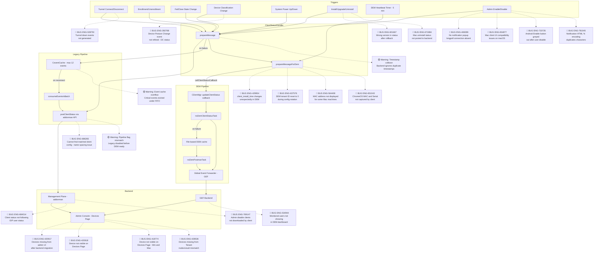
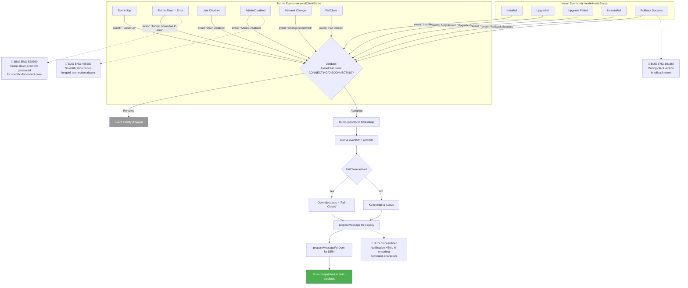
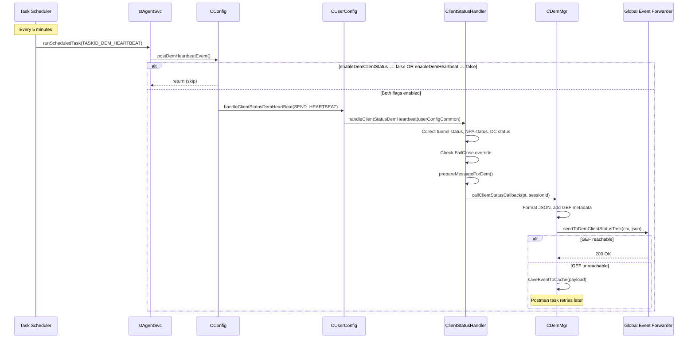
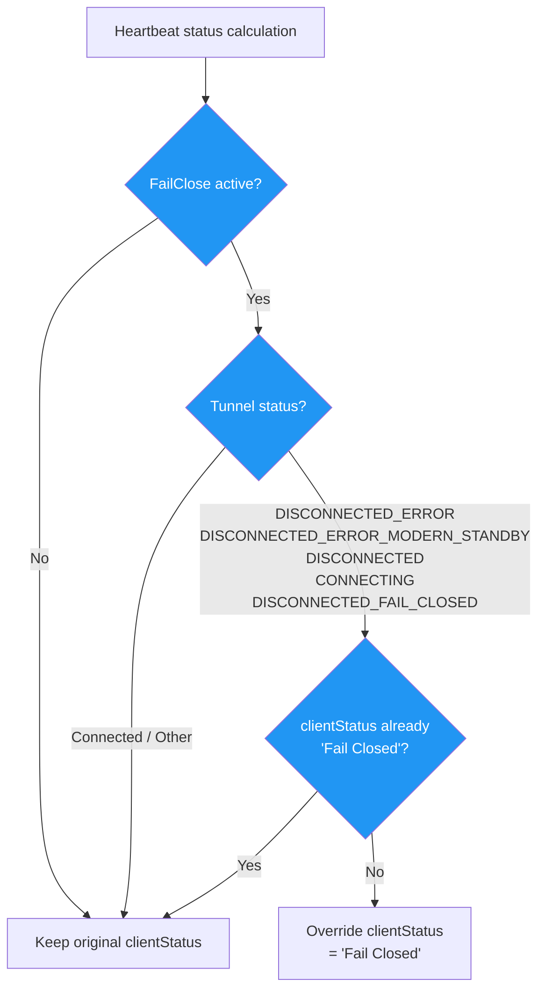
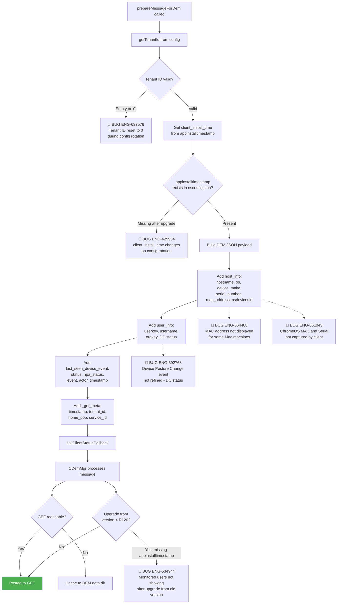
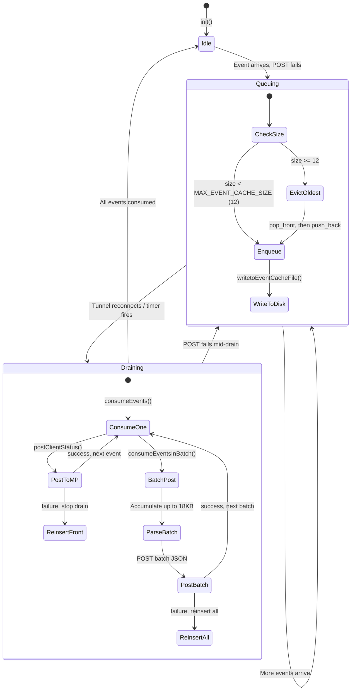
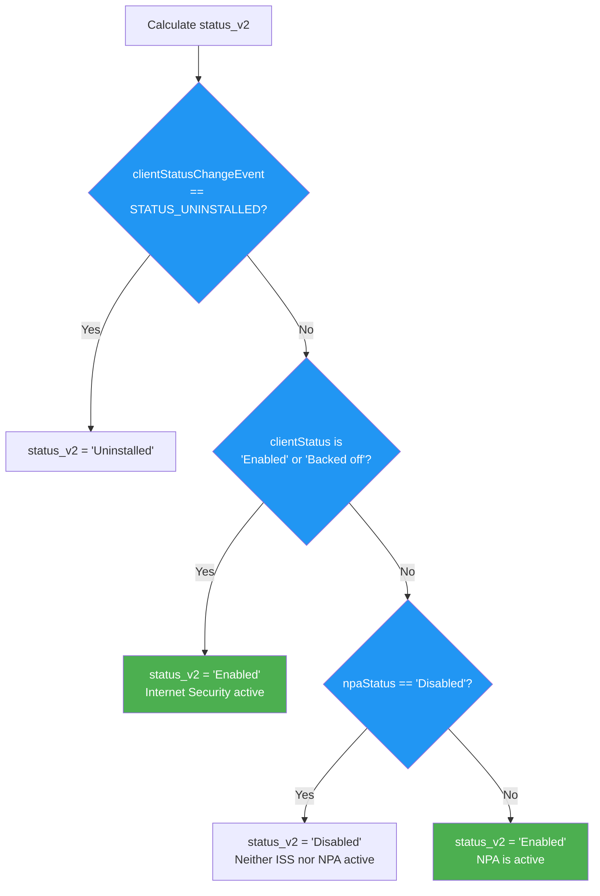
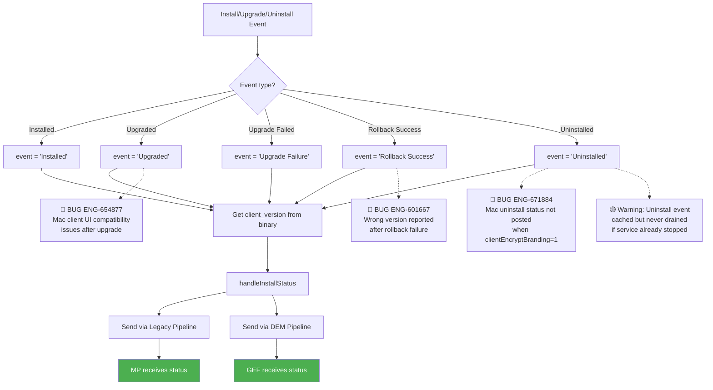
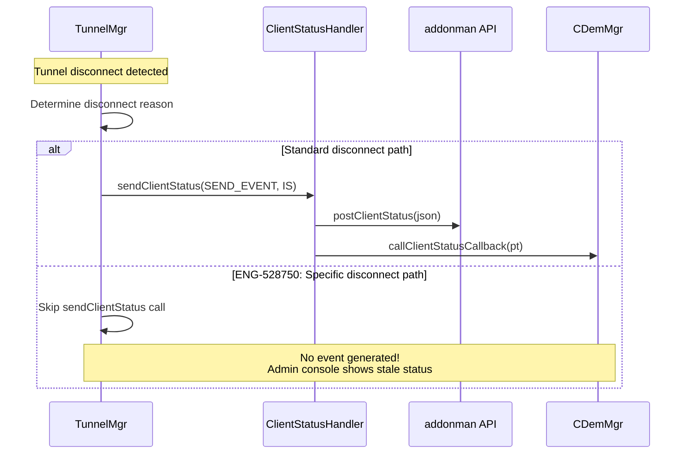

# 06. Client Status Reporting

**Escalation Bug Count**: 20 | **Regression**: 6 | **Day-1**: 3 | **Test Gap**: 6 | **Corner Case**: 5

📋 **[Test Cases — Google Sheet](https://docs.google.com/spreadsheets/d/1ackCZ-EcepXw1BkSGoi5Go9Ex1I72-fXqcqLGMGiuio/edit?gid=1851702887#gid=1851702887)**

> This chapter covers how NSClient reports device status, events, and heartbeats to the Management Plane. It traces the complete data flow from event triggers through message preparation, caching, and delivery to both the Legacy Pipeline (addonman API) and the DEM Pipeline (Global Event Forwarder). All 20 escalation bugs are mapped to specific failure points in the status reporting flow, with mermaid diagrams annotated at each known breakage.

---

## Overview

The admin console needs real-time visibility into every managed device: is the tunnel up, what version is installed, is FailClose active, what is the NPA status, and when was the device last seen? Without status reporting, the fleet becomes invisible -- admins cannot diagnose connectivity issues, verify policy compliance, or detect offline devices. Status reporting is the telemetry backbone that connects every NSClient endpoint to the Management Plane.

The highest risk area is the **dual-pipeline transition** between Legacy (addonman) and DEM (GEF): when one pipeline is disabled but the other is not fully operational, devices disappear from the admin console (ENG-420917, ENG-420918). The second major risk is **DEM data integrity**: the `client_install_time` field corruption (ENG-429954) and tenant ID reset (ENG-637576) both caused customer-visible data loss in the DEM pipeline. The third gap is **event generation completeness**: tunnel down events were silently dropped for certain disconnect scenarios (ENG-528750), and uninstall status was not posted when `clientEncryptBranding` was enabled (ENG-671884).

Beyond the original 8 bugs, 12 additional escalation bugs span device visibility (ENG-418774, ENG-428536), backend status sync (ENG-684014, ENG-769147), client notification delivery (ENG-469289, ENG-781045), host info reporting (ENG-564408, ENG-651043), client UI state (ENG-654877, ENG-733735), config name matching (ENG-686265), and Device Classification event handling (ENG-392768). Of the full 20 bugs, 6 are regressions, indicating that the status reporting module is fragile and under-tested during feature development.

### Design Decision: Dual-Pipeline Architecture

NSClient maintains two parallel status reporting pipelines:

1. **Legacy Pipeline** -- Posts status JSON to addonman REST API (`/v2/update/clientstatus`, `/v5/update/clientstatus`, or `/v7/update/clientstatus`). This was the original status mechanism. It can be disabled via `disableLegacyClientStatus` config flag.

2. **DEM Pipeline** -- Posts the same status data (enriched with GEF metadata) to the Global Event Forwarder (GEF) via `v1/clientstatus` or `v1/clientstatus/batch`. This is the modern pipeline that also carries DEM metrics (tunnel RTT, traceroute, device health, app probes).

Both pipelines are enabled by default; the transition from legacy to DEM-only is controlled by feature flags in the client config. The dual-pipeline approach ensures backward compatibility while the fleet migrates, but creates a risk window where pipeline flag misconfiguration causes device invisibility.

### Design Decision: Event Caching with Bounded Queue

When the MP or GEF is unreachable, events are cached to a local `eventscache.json` file with a bounded queue (max 12 events for legacy, file-based cache for DEM). On reconnect, cached events are drained in order. This prevents data loss during brief outages but caps disk usage. If the queue overflows, the oldest event is evicted (FIFO). The cache file is integrity-checked with a digest.

---

## Dual-Pipeline Architecture (All Platforms)

The following diagram shows the end-to-end status reporting architecture, annotated with all 20 confirmed escalation bugs at their respective failure points. The dual-pipeline design means that every status event must successfully traverse at least one pipeline for the device to remain visible in the admin console.



### Node Risk Assessment

| Node | Risk | Assessment |
|------|------|------------|
| Tunnel Connect/Disconnect trigger | 🔴 High | **ENG-528750** -- tunnel down events silently dropped for certain disconnect scenarios |
| Device Classification Change trigger | 🔴 High | **ENG-392768** -- Device Posture Change event not refined; DC status reporting regression |
| Install/Upgrade/Uninstall trigger | 🔴 High | **ENG-601667** -- wrong version reported after rollback; **ENG-671884** -- Mac uninstall status not posted |
| Admin Enable/Disable trigger | 🔴 High | **ENG-469289** -- no notification popup when longpoll absent; **ENG-733735** -- Android Enable button greyed out; **ENG-781045** -- notification HTML encoding duplicates characters; **ENG-654877** -- Mac client UI compatibility issues |
| prepareMessage | 🟡 Medium | Event string derivation depends on tunnel state machine; edge cases exist |
| prepareMessageForDem | 🔴 High | **ENG-429954** -- client_install_time corruption; **ENG-637576** -- tenant ID reset to 0; **ENG-564408** -- MAC address not sent for some Mac machines; **ENG-651043** -- ChromeOS MAC/Serial not captured |
| postClientStatus via addonman API | 🔴 High | **ENG-686265** -- config name spacing mismatch causes "Cannot find matched client configuration" error; pipeline flag mismatch risk when `disableLegacyClientStatus` is set |
| CeventCache | 🟡 Medium | FIFO eviction can drop critical FailClose events during prolonged outage |
| CDemMgr::updateClientStatus | 🟡 Medium | Depends on valid client certificate for mTLS auth |
| nsDemClientStatusTask | 🔴 High | **ENG-534944** -- users not showing in DEM dashboard after upgrade miss |
| Management Plane (addonman) | 🔴 High | **ENG-684014** -- client status not following IDP user status; **ENG-769147** -- admin disable not downloaded by client |
| Admin Console Devices Page | 🔴 High | **ENG-420917**, **ENG-420918** -- devices missing after backend migration; **ENG-418774** -- device not visible on Devices Page (Win/Mac); **ENG-428536** -- devices missing from tenant due to nsdeviceuid mismatch |
| GEF Backend | 🟡 Medium | Predicted: payload validation failures when tenant ID is corrupted |

---

## Event Reporting Flow (All Platforms)

Events are triggered by discrete state changes. Each event carries a specific `event` string and `actor` string that identifies what happened and what caused it. The event generation logic contains the failure point for ENG-528750, where certain tunnel disconnect scenarios did not trigger the expected status event.



### Actor Model

Each event identifies its cause through an `actor` field. The actor model allows the admin console to distinguish between user-initiated actions, system-triggered events, and admin commands.

| Actor String | Enum | Context |
|-------------|------|---------|
| `System` | `ACTOR_SYSTEM` | Automatic system action |
| `User` | `ACTOR_USER` | User clicked enable/disable |
| `Admin` | `ACTOR_ADMIN` | Admin changed policy |
| `Reboot` | `ACTOR_REBOOT` | System reboot detected |
| `Network joined` | `ACTOR_NETWORK_JOINED` | New network connection |
| `System wakeup` | `ACTOR_SYSTEM_WAKEUP` | Wake from sleep/standby |
| `Service started` | `ACTOR_SERVICE_STARTED` | Service (re)start |

---

## Heartbeat Flow (All Platforms)

The heartbeat flow is the periodic "I am alive" signal. Both legacy and DEM heartbeats are independent timers. The DEM heartbeat fires every 5 minutes (hardcoded) while the legacy heartbeat uses a configurable interval (default 30 minutes, minimum wait 5 minutes). The FailClose override logic within the heartbeat is critical: without it, FailClose devices would appear as "Disabled" rather than "Fail Closed" in the admin console.



### FailClose Override in Heartbeat

When FailClose is active and the tunnel is in an error state, the heartbeat logic overrides the `clientStatus` field from "Disabled" to "Fail Closed". This ensures the admin console shows the correct FailClose state.



---

## DEM Message Preparation Flow (All Platforms)

The `prepareMessageForDem()` function is the single point where three of the eight bugs occur. This function builds the JSON payload for the DEM pipeline, pulling data from config objects, user configs, and tunnel state. The `client_install_time` field and `_tenant_id` field are both populated here, and both have been the source of customer-visible bugs.



### Node Risk Assessment: DEM Preparation

| Node | Risk | Assessment |
|------|------|------------|
| getTenantId from config | 🔴 High | **ENG-637576** -- Token rotation corrupts tenant ID to "0" |
| Get client_install_time | 🔴 High | **ENG-429954** -- Timestamp changes on config rotation |
| Build DEM JSON payload | 🟡 Medium | Predicted: field type mismatch between string/numeric enums |
| Add host_info (mac_address, serial_number) | 🔴 High | **ENG-564408** -- MAC address not sent for some Mac machines; **ENG-651043** -- ChromeOS MAC and Serial not captured (Day-1) |
| Add user_info (DC status) | 🔴 High | **ENG-392768** -- Device Posture Change event not refined; DC status reported incorrectly |
| callClientStatusCallback | 🟡 Medium | Depends on valid client cert and user session |
| CDemMgr processes message | 🔴 High | **ENG-534944** -- Missing appinstalltimestamp after upgrade |
| GEF reachable check | 🟡 Medium | mTLS auth failure if client cert is expired |

---

## Event Caching and Failure Handling (All Platforms)

The event caching mechanism prevents data loss during brief outages, but introduces its own failure modes: FIFO eviction can silently drop critical FailClose events, and cache file corruption after power loss can cause all cached events to be lost.



**Key properties:**

- **Max queue size:** 12 events (`MAX_EVENT_CACHE_SIZE`)
- **Max batch payload:** 18 KB (`MAX_BATCH_PAYLOAD_SIZE`)
- **Eviction policy:** FIFO -- oldest event is dropped when queue is full
- **Persistence:** Events are written to `eventscache.json` with digest integrity check
- **Batch mode:** When `clientStatusBatchSupport` is enabled, cached events are merged into a single `client_status` array and posted in one request

---

## Status Data Model

### Legacy vs DEM Message Comparison

The legacy message is a flat JSON posted to the addonman API, while the DEM message wraps the data with GEF metadata. Key differences create a risk of inconsistency between the two pipelines:

| Field | Legacy | DEM |
|-------|--------|-----|
| Status values | String ("Enabled", "Disabled") | Numeric enum (0, 1, 2...) |
| Event values | String ("Tunnel Up") | Numeric enum (17) |
| Actor values | String ("System") | Numeric enum (0) |
| OS | String ("Windows") | Numeric ID |
| Wrapper | `client_status.` prefix | `_gef_meta` + flat fields |
| Additional | -- | `client_install_time`, `device_id`, `user_info` |
| Boolean format | Quoted `"true"` | Unquoted `true` (GEF requirement) |

### The status_v2 Combined Status

The `status_v2` field provides a combined view of both Internet Security and NPA services. The device shows as "Enabled" in the admin console if **either** Internet Security or NPA is active:



---

## Install/Uninstall Status Reporting Flow (All Platforms)

The install and uninstall status reporting flow has two confirmed bugs. ENG-601667 occurs during upgrade rollback, where the wrong client version is reported to the backend. ENG-671884 occurs on macOS when the `clientEncryptBranding` flag causes the uninstall status POST to fail because the branding file is decrypted too late in the uninstall sequence.



---

## Windows

**Bug Count**: 11 | **Key Gaps**: Tunnel down event generation, DEM data integrity, rollback version reporting, device visibility, notifications, config name matching

Windows has the most status reporting bugs due to its complex power management (AOAC/Modern Standby), multi-user VDI scenarios, and the WFP driver interaction during tunnel state changes. The `client_install_time` and `nsdeviceuid` fields have both caused device duplication and data inconsistency on Windows. Additional Windows-specific issues include Device Posture Change event handling (ENG-392768), device visibility on the admin Devices page (ENG-418774, ENG-428536), notification delivery failures due to absent longpoll connections (ENG-469289) and HTML encoding issues (ENG-781045), and config name spacing mismatches causing "Cannot find matched client configuration" errors (ENG-686265).

### Windows-Specific: Power Event Handling

On Windows, system power events have special timestamp handling that computes the actual boot time rather than using the current time:

The `STATUS_SYSTEMPOWER_UP` event uses `GetTickCount64()` to calculate when the system actually started, ensuring the "System power-up" event timestamp reflects actual boot time. Windows also forwards power events to `WinDeviceStats` for DEM device health tracking.

### Windows Bug Mapping

| Bug ID | Summary | Root Cause | Flow Point | Severity |
|--------|---------|------------|------------|----------|
| [ENG-392768](https://netskope.atlassian.net/browse/ENG-392768) | Device Posture Change event not refined | DC status event not properly generated; monthly regression missed | Device Classification Change trigger | S3 |
| [ENG-418774](https://netskope.atlassian.net/browse/ENG-418774) | Device not visible on Devices Page | Backend device status sync failure | Admin Console Devices Page | S2 |
| [ENG-420917](https://netskope.atlassian.net/browse/ENG-420917) | Devices missing from admin UI | Backend migration + device status sync failure | Admin Console Devices Page | S2 |
| [ENG-420918](https://netskope.atlassian.net/browse/ENG-420918) | Device not visible on Devices Page | Backend migration + device status sync failure | Admin Console Devices Page | S2 |
| [ENG-428536](https://netskope.atlassian.net/browse/ENG-428536) | Devices missing from Tenant | nsdeviceuid / old_nsdeviceuid mismatch causes device entry loss | Admin Console Devices Page | S2 |
| [ENG-429954](https://netskope.atlassian.net/browse/ENG-429954) | client_install_time changes unexpectedly | Config rotation overwrites appinstalltimestamp | prepareMessageForDem | S3 |
| [ENG-469289](https://netskope.atlassian.net/browse/ENG-469289) | No notification popup due to absent longpoll | Longpoll connection not triggered; user receives no alert/block notifications | Admin Enable/Disable trigger | S2 |
| [ENG-528750](https://netskope.atlassian.net/browse/ENG-528750) | Tunnel down events not generated | Day-1: certain disconnect paths skip sendClientStatus | sendClientStatus trigger | S2 |
| [ENG-601667](https://netskope.atlassian.net/browse/ENG-601667) | Wrong version after rollback | Rollback writes wrong version to status payload | handleInstallStatus | S3 |
| [ENG-637576](https://netskope.atlassian.net/browse/ENG-637576) | DEM tenant ID reset to 0 | Token rotation during config update corrupts tenant ID | prepareMessageForDem | S2 |
| [ENG-686265](https://netskope.atlassian.net/browse/ENG-686265) | "Cannot find matched client configuration" | Missing space in config name causes API mismatch post R127 | postClientStatus via addonman API | S3 |
| [ENG-781045](https://netskope.atlassian.net/browse/ENG-781045) | Notification HTML % encoding duplicates characters | HTML percent encoding issue in notification templates | Client Notification delivery | S3 |

## macOS

**Bug Count**: 7 (2 shared with Windows + 5 macOS-specific) | **Key Gaps**: Uninstall status posting, DEM user visibility, MAC address reporting, client UI compatibility

macOS shares the dual-pipeline architecture with Windows but has a unique failure point in the uninstall flow: when `clientEncryptBranding` is enabled, the uninstall status POST fails because the InstallerUtil needs to decrypt the branding file before it can post the uninstall event, but the decryption happens too late in the uninstall sequence. Additional macOS issues include MAC address not being reported for some machines (ENG-564408), client UI compatibility issues introduced by recent Mac UI changes (ENG-654877), and device visibility on the admin Devices page (ENG-418774).

### macOS Bug Mapping

| Bug ID | Summary | Root Cause | Flow Point | Severity |
|--------|---------|------------|------------|----------|
| [ENG-418774](https://netskope.atlassian.net/browse/ENG-418774) | Device not visible on Devices Page | Backend device status sync failure | Admin Console Devices Page | S2 |
| [ENG-420917](https://netskope.atlassian.net/browse/ENG-420917) | Devices missing from admin UI | Backend migration issue | Admin Console | S2 |
| [ENG-420918](https://netskope.atlassian.net/browse/ENG-420918) | Device not visible on Devices Page | Backend migration issue | Admin Console | S2 |
| [ENG-534944](https://netskope.atlassian.net/browse/ENG-534944) | Monitored users not showing in DEM | Missing appinstalltimestamp after upgrade from < R120 | prepareMessageForDem | S2 |
| [ENG-564408](https://netskope.atlassian.net/browse/ENG-564408) | MAC address not displayed for some machines | Client fails to send MAC address in status payload | prepareMessageForDem / host_info | S3 |
| [ENG-654877](https://netskope.atlassian.net/browse/ENG-654877) | Client UI compatibility issues on macOS | Recent Mac UI changes introduced compatibility issues | Client UI / Admin Enable/Disable | S3 |
| [ENG-671884](https://netskope.atlassian.net/browse/ENG-671884) | Mac uninstall status not posted | clientEncryptBranding=1 breaks uninstall POST sequence | handleInstallStatus | S3 |

## Linux

**Bug Count**: 0 direct | **Key Gaps**: DEM support is partial, no device health

Linux has partial DEM support -- client status and heartbeat work, but device health and app probes are not supported. The main risk on Linux is that status reporting code is shared with macOS but less tested, creating silent regression risk.

## Android

**Bug Count**: 2 | **Key Gaps**: ChromeOS MAC/Serial capture, Enable button state, cached event version filter

Android has a unique cached event version filter that silently discards events from client versions older than 47 during queue drain. This prevents posting incompatible status messages after an upgrade from a very old version. Two escalation bugs affect Android: ENG-651043 where ChromeOS (which shares the Android codebase) does not capture MAC address and Serial number in the status payload, and ENG-733735 where the Enable button becomes greyed out after user disable because the steering mode check does not account for NPA-only configurations.

### Android Bug Mapping

| Bug ID | Summary | Root Cause | Flow Point | Severity |
|--------|---------|------------|------------|----------|
| [ENG-651043](https://netskope.atlassian.net/browse/ENG-651043) | ChromeOS MAC and Serial not captured | Day-1: client does not collect MAC/Serial on ChromeOS platform | prepareMessageForDem / host_info | S3 |
| [ENG-733735](https://netskope.atlassian.net/browse/ENG-733735) | Enable button greyed out after user disable | Steering mode NONE check does not account for NPA-enabled config | Admin Enable/Disable / Client UI | S3 |

## iOS

**Bug Count**: 0 direct | **Key Gaps**: NE shim-only status, no DEM heartbeat

iOS has the most limited status reporting support. The Network Extension (NE) shim provides basic tunnel status but does not support DEM client status, DEM heartbeat, device health, or app probes. Status events are generated by the NE shim and forwarded to the containing app for posting.

## ChromeOS

**Bug Count**: 1 (shared with Android) | **Key Gaps**: MAC address and Serial number capture

ChromeOS shares the Android codebase for status reporting. ENG-651043 is a Day-1 issue where the ChromeOS client does not capture MAC address and Serial number details, causing these fields to appear blank on the admin Devices page. This bug has been reproducible since R112 (over one year old).

---

## Backend

**Bug Count**: 4 (ENG-420917, ENG-420918, ENG-684014, ENG-769147) | **Key Gaps**: Backend migration, device visibility, IDP user status sync, admin disable propagation

The backend bugs are the most impactful in this chapter: they caused entire fleets of devices to disappear from the admin console after a backend migration. ENG-684014 demonstrates that client status does not follow IDP user status -- when a user is disabled in the IDP, the NSClient should reflect that status, but the logic was broken after R125 changes and had to be reverted. ENG-769147 shows that admin-initiated disable commands from the tenant UI are not properly downloaded by the client because the supportability params are not fetched.

### Backend Bug Mapping

| Bug ID | Summary | Root Cause | Flow Point | Severity |
|--------|---------|------------|------------|----------|
| [ENG-420917](https://netskope.atlassian.net/browse/ENG-420917) | Devices missing from admin UI | Backend migration + device status sync failure | Admin Console Devices Page | S2 |
| [ENG-420918](https://netskope.atlassian.net/browse/ENG-420918) | Device not visible on Devices Page | Backend migration + device status sync failure | Admin Console Devices Page | S2 |
| [ENG-684014](https://netskope.atlassian.net/browse/ENG-684014) | Client status not following IDP user status | R125 change broke mongo-based user disable logic; reverted to pre-R125 with UM API | Management Plane | S2 |
| [ENG-769147](https://netskope.atlassian.net/browse/ENG-769147) | Admin disable not downloaded by client | Client does not download supportability params to process admin disable | Management Plane | S3 |

## Automation Coverage Summary

The golden regression suite at `/Users/klin/Documents/PyLark/Development/nsclient_golden_regression_suite/golden_regression/tests/features/client_status/` contains basic P0 tests:

| Test | Description | Coverage | Status |
|------|-------------|----------|--------|
| `test_02_client_status_events` (C1159874) | Verify Installed/Disabled and Tunnel Up/Enabled events posted to WebUI | Basic event posting | ✅ Covered |
| `test_08_user_specific_conf_files` (C1159873) | Verify nsuser.conf reflects enable/disable status | Local config file | ✅ Covered |

**Summary**: Only 2 of 27 test cases have automation coverage. Full test case details are in the [Google Sheet](https://docs.google.com/spreadsheets/d/1ackCZ-EcepXw1BkSGoi5Go9Ex1I72-fXqcqLGMGiuio/edit?gid=1851702887#gid=1851702887).

---

## Cross-Flow Interactions

### Status Reporting x Tunnel Management

Tunnel state changes are the primary trigger for status events. When the tunnel disconnects due to error, the tunnel manager must call `sendClientStatus()` with the correct event string. ENG-528750 demonstrates that some tunnel disconnect paths skip this call entirely, leaving the admin console showing a stale "Enabled" status while the tunnel is actually down.



### Status Reporting x FailClose

FailClose depends on status reporting to communicate the "Fail Closed" state to the admin console. When FailClose activates, the heartbeat override logic changes the `clientStatus` field. However, during the transition from "Enabled" to "Fail Closed", event suppression logic can discard intermediate Internet Security events while still allowing NPA events through. This creates a window where the admin console may show inconsistent state.

### Status Reporting x Install/Upgrade

Every install, upgrade, rollback, and uninstall generates a status event. The upgrade + rollback flow has two confirmed bugs: ENG-601667 (wrong version after rollback) and ENG-671884 (Mac uninstall status not posted). These bugs show that the install status flow is fragile, especially when error handling paths are exercised.

### Cross-Flow Risk Matrix (Chapter-Relevant)

| Interaction | Risk Level | Known Bug | Test Coverage |
|-------------|-----------|-----------|---------------|
| Tunnel disconnect -> Status event | 🔴 High | ENG-528750 | ❌ Not covered |
| Config rotation -> DEM data integrity | 🔴 High | ENG-429954, ENG-637576 | ❌ Not covered |
| Upgrade rollback -> Version in status | 🔴 High | ENG-601667 | ❌ Not covered |
| Mac uninstall -> Status POST | 🟡 Medium | ENG-671884 | ❌ Not covered |
| FailClose -> Heartbeat override | 🟡 Medium | -- | ❌ Not covered |
| Backend migration -> Device visibility | 🔴 High | ENG-420917, ENG-420918 | ❌ Not covered |
| Pipeline flag toggle -> Device visibility | 🟡 Medium | -- | ❌ Not covered |
| Cache overflow -> Critical event loss | 🟡 Medium | -- | ❌ Not covered |
| Old version upgrade -> DEM user visibility | 🔴 High | ENG-534944 | ❌ Not covered |
| DC status change -> Status event | 🔴 High | ENG-392768 | ❌ Not covered |
| Backend device sync -> Device visibility | 🔴 High | ENG-418774, ENG-428536 | ❌ Not covered |
| Longpoll connection -> Notification delivery | 🔴 High | ENG-469289 | ❌ Not covered |
| MAC/Serial collection -> DEM host_info | 🟡 Medium | ENG-564408, ENG-651043 | ❌ Not covered |
| Mac UI changes -> Client compatibility | 🟡 Medium | ENG-654877 | ❌ Not covered |
| IDP user disable -> Client status | 🔴 High | ENG-684014 | ❌ Not covered |
| Config name matching -> Status POST | 🟡 Medium | ENG-686265 | ❌ Not covered |
| NPA steering mode -> Enable button state | 🟡 Medium | ENG-733735 | ❌ Not covered |
| Admin disable -> Client download | 🔴 High | ENG-769147 | ❌ Not covered |
| Notification template -> HTML encoding | 🟡 Medium | ENG-781045 | ❌ Not covered |

## Configuration Parameters

### Client Config JSON Keys

```json
{
  "clientConfig": {
    "clientStatusUpdateIntervalInMin": 5,
    "clientStatusUpdate": {
      "heartbeatIntervalInMin": 30
    },
    "enableDemClientStatus": true,
    "disableLegacyClientStatus": false,
    "enableDemHeartbeat": true,
    "eventForwarderHost": "events-dem.example.netskope.com",
    "clientStatusBatchSupport": 1
  }
}
```

| Parameter | Type | Default | Description |
|-----------|------|---------|-------------|
| `clientStatusUpdateIntervalInMin` | int | 5 | Minimum wait between legacy status posts (minutes) |
| `heartbeatIntervalInMin` | int | 30 | Legacy heartbeat interval (minutes) |
| `enableDemClientStatus` | bool | false | Enable DEM pipeline for client status |
| `disableLegacyClientStatus` | bool | false | Disable legacy addonman pipeline |
| `enableDemHeartbeat` | bool | true | Enable DEM heartbeat (5-min timer) |
| `eventForwarderHost` | string | "" | GEF host (auto-derived from DEM domain if empty) |
| `clientStatusBatchSupport` | int | 0 | Enable batch posting of cached events |

---

## REST API Endpoints

### Legacy Pipeline (addonman)

| API Version | Endpoint | Auth | Notes |
|------------|----------|------|-------|
| V2 | `POST /v2/update/clientstatus?orgkey=...&hashkey=...` | Query params | Oldest, no header auth |
| V5 | `POST /v5/update/clientstatus` | `Authorization` header (HMAC) | Standard auth |
| V7 | `POST /v7/update/clientstatus` | `Authorization` header (HMAC + user cert) | Secure config validation |

### DEM Pipeline (GEF)

| Endpoint | Purpose |
|----------|---------|
| `POST https://<gef-host>:443/v1/clientstatus` | Single client status event |
| `POST https://<gef-host>:443/v1/clientstatus/batch` | Batched client status events |

---

## Platform Differences

### DEM Feature Availability

| Platform | DEM Client Status | DEM Heartbeat | Device Health | Tunnel RTT | App Probes |
|----------|------------------|---------------|---------------|------------|------------|
| Windows | Yes | Yes | Yes (`WinDeviceStats`) | Yes | Yes |
| macOS | Yes | Yes | Yes (`MacDeviceStats`) | Yes | Yes |
| Linux | Partial | Yes | No | Yes | Partial |
| Android | Yes | Yes | No | Yes | Yes |
| iOS | No (NE shim only) | No | No | No | No |

### Status Data Fields by Platform

| Field | Windows | macOS | Linux | Android | iOS |
|-------|---------|-------|-------|---------|-----|
| `nsdeviceuid` | From `deviceInfo.get_UniqueIdNew()` | From `configObj->getNewUniqueId()` | Same as macOS | Same as macOS | Same as macOS |
| `client_version` suffix | `"(64-bit)"` appended on x64 | None | None | None | None |
| DEM Device Health | Full (CPU, RAM, disk, battery, network) | Full | Not supported | Partial | Not supported |
| System Power events | `OnSystemPowerDown/Up`, `OnAOACSuspend/Wakeup` | `CPowerMonitorListener` | Not supported | Battery-aware | Background refresh |

---

## Troubleshooting

### Log Keywords

| Component | Log Keywords | Module |
|-----------|-------------|--------|
| Status preparation | `"prepared client status message"`, `"Failed to prepare client status"` | `clientStatusHandler` |
| Legacy POST | `"Client status posted successfully"`, `"Failed to post Client status"` | `clientStatusHandler` |
| Event caching | `"Caching client status"`, `"Event cache is empty"`, `"Queue is full"` | `eventCache` |
| Batch posting | `"sending client status in batch"`, `"batch %d sent successfully"` | `eventCache` |
| DEM heartbeat | `"sending DEM heartbeat event"`, `"DEM enable dem client status flag"` | `config` |
| DEM posting | `"PostDemClientStatus successfully"`, `"PostDemClientStatus failed"` | `DEM` |
| FailClose override | `"FailClosed:[sessId %d] discarded client status event"`, `"DEM heartbeat: OVERRIDING client status to fail close"` | `clientStatusHandler` |
| Install status | `"Received install event"` | `clientStatusHandler` |
| Legacy disabled | `"Legacy client status pipeline is disabled"` | `clientStatusHandler` |

### Common Problem 1: Device Shows "Offline" in Admin Console

**Symptoms:** Device appears offline or shows stale status in the admin console even though the tunnel is connected.

**Diagnosis:**
1. Check if heartbeat events are being sent: `grep -i "heartbeat\|client status posted" nsdebuglog.log`
2. Check if both pipelines are active: `grep -i "Legacy client status pipeline is disabled\|DEM enable dem client status" nsdebuglog.log`
3. Check for POST failures: `grep -i "Failed to post\|PostDemClientStatus failed" nsdebuglog.log`
4. Check if events are being cached but never drained: `grep -i "Caching client status" nsdebuglog.log`

**Possible Causes:**
- Legacy pipeline disabled but DEM pipeline not enabled (pipeline flag mismatch -- see ENG-420917)
- addonman host unreachable or returning errors
- User certificate expired (V7 auth fails)
- Event cache full and all events being evicted

### Common Problem 2: Wrong Status Displayed

**Symptoms:** Admin console shows "Disabled" when tunnel is actually connected, or shows "Enabled" when in FailClose.

**Diagnosis:**
1. Check the actual status being sent: `grep -i "prepared client status message" nsdebuglog.log` (look at the JSON)
2. Check for FailClose override: `grep -i "OVERRIDING client status to fail close\|discarded client status" nsdebuglog.log`
3. Check `status_v2` logic: if IS is disabled but NPA is connected, `status_v2` should be "Enabled"

**Possible Causes:**
- FailClose active but override condition not met (tunnel in unexpected state)
- Race condition: event sent during CONNECTING/DISCONNECTING transition (should be rejected)
- Timestamp collision causing backend to ignore newer event

### Common Problem 3: DEM Data Missing or Corrupted

**Symptoms:** DEM dashboard shows blank scores, wrong install time, or user not appearing.

**Diagnosis:**
1. Check DEM flags: `grep -i "DEM enable dem client status flag.*enable heart beat flag" nsdebuglog.log`
2. Check tenant ID: `grep -i "tenant_id\|_tenant_id" nsdebuglog.log` (should not be "0" or empty -- see ENG-637576)
3. Check client_install_time: `grep -i "appinstalltimestamp\|client_install_time" nsdebuglog.log` (should be stable -- see ENG-429954)
4. Check GEF posting: `grep -i "PostDemClientStatus" nsdebuglog.log`

**Possible Causes:**
- Token rotation during config update corrupted tenant ID to "0" (ENG-637576)
- Upgrade from pre-R120 missing appinstalltimestamp in nsconfig.json (ENG-534944)
- client_install_time changes on every config rotation (ENG-429954)

---

## Appendix A: Bug Quick Reference

| Bug ID | Summary | Platform | Root Cause | Severity | Regression | Bug Type |
|--------|---------|----------|------------|----------|------------|----------|
| [ENG-420917](https://netskope.atlassian.net/browse/ENG-420917) | Devices missing from admin UI after backend migration | Windows, Mac | Backend migration issue -- device status sync failure | S2 | Yes | Test Gap |
| [ENG-420918](https://netskope.atlassian.net/browse/ENG-420918) | Device not visible on Devices Page | Windows, Mac | Backend migration issue -- device status sync failure | S2 | Yes | Test Gap |
| [ENG-429954](https://netskope.atlassian.net/browse/ENG-429954) | client_install_time changes unexpectedly in client_status | Windows | Config rotation overwrites appinstalltimestamp; fix in ClientStatusHandler::prepareMessageForDem | S3 | No | Test Gap |
| [ENG-528750](https://netskope.atlassian.net/browse/ENG-528750) | Client Status Tunnel Down Events Not Generated | Windows | Day-1: certain tunnel disconnect paths skip sendClientStatus call | S2 | No (Day-1) | Test Gap |
| [ENG-534944](https://netskope.atlassian.net/browse/ENG-534944) | Monitored users not showing agents online | Mac | Regression from ENG-429954 fix -- missed upgrade case when pre-R120 client lacks appinstalltimestamp in nsconfig.json | S2 | Yes | Missing in Regression |
| [ENG-601667](https://netskope.atlassian.net/browse/ENG-601667) | Service dependency failure + wrong version in status after rollback | Windows | During upgrade rollback, installer reports wrong client version to backend via client status | S3 | No (Day-1) | Corner Case |
| [ENG-637576](https://netskope.atlassian.net/browse/ENG-637576) | DEM tenant ID reset to 0 -- user scores blank | Windows | Token rotation during config update resets tenant ID; DEM posts with tenant_id="0" causing payload validation failure | S2 | Yes | Corner Case |
| [ENG-671884](https://netskope.atlassian.net/browse/ENG-671884) | Mac uninstall status not posted to backend | Mac | With clientEncryptBranding=1, InstallerUtil post_uninstall runs after branding cleanup; fix moves post_uninstall before uninstallAuxiliarySvc | S3 | No | Corner Case |
| [ENG-392768](https://netskope.atlassian.net/browse/ENG-392768) | Device Posture Change event not refined | Windows | DC status event not properly generated; monthly regression missed | S3 | Yes | Test Gap |
| [ENG-418774](https://netskope.atlassian.net/browse/ENG-418774) | Device not visible on Devices Page | Windows, Mac | Backend device status sync failure; internal defect ENG-408293 | S2 | No | Internal Found |
| [ENG-428536](https://netskope.atlassian.net/browse/ENG-428536) | Devices missing from Tenant | Windows | nsdeviceuid / old_nsdeviceuid mismatch causes device entry loss | S2 | Yes | Test Gap |
| [ENG-469289](https://netskope.atlassian.net/browse/ENG-469289) | No notification popup due to absent longpoll | Windows | Longpoll connection not triggered; no alert/block notifications delivered | S2 | No | Corner Case |
| [ENG-564408](https://netskope.atlassian.net/browse/ENG-564408) | MAC address not displayed for some Mac machines | Mac | Client fails to send MAC address in status payload for some machines | S3 | No | Corner Case |
| [ENG-651043](https://netskope.atlassian.net/browse/ENG-651043) | ChromeOS MAC and Serial not captured | Android (ChromeOS) | Day-1: client does not collect MAC/Serial on ChromeOS; reproducible since R112 | S3 | No (Day-1) | Test Gap |
| [ENG-654877](https://netskope.atlassian.net/browse/ENG-654877) | Mac client UI compatibility issues | Mac | Recent Mac UI changes introduced compatibility issues; internally reported by QE | S3 | No | Internal Found |
| [ENG-684014](https://netskope.atlassian.net/browse/ENG-684014) | Client status not following IDP user status | Backend | R125 change broke mongo-based user disable logic; reverted to pre-R125 with UM API | S2 | Yes | Test Gap |
| [ENG-686265](https://netskope.atlassian.net/browse/ENG-686265) | "Cannot find matched client configuration" post R127 | Windows | Missing space in config name causes API mismatch between WebUI and client status | S3 | No | Corner Case |
| [ENG-733735](https://netskope.atlassian.net/browse/ENG-733735) | Android Enable button greyed out after user disable | Android | Steering mode NONE check does not account for NPA-enabled config | S3 | No (Day-1) | Enhancement |
| [ENG-769147](https://netskope.atlassian.net/browse/ENG-769147) | Admin disable not downloaded by client | Backend | Client does not download supportability params to process admin disable from UI | S3 | No | Corner Case |
| [ENG-781045](https://netskope.atlassian.net/browse/ENG-781045) | Notification HTML % encoding duplicates characters | Windows | HTML percent encoding in notification templates duplicates last 7 characters | S3 | No | Corner Case |

---

## Appendix B: Methodology

### Severity Rating

| Level | Description |
|-------|-------------|
| S1 | Service outage: device invisible in admin console, no status updates at all |
| S2 | Significant data loss: wrong status displayed, DEM data corrupted, events missing |
| S3 | Minor data issue: wrong timestamp, incorrect version string, cosmetic mismatch |
| S4 | Cosmetic: log message incorrect, non-functional field mismatch |

### Gap Type Taxonomy

| Type | Description |
|------|-------------|
| Regression | Bug introduced by change to existing working code |
| Day-1 | Bug present since feature was first implemented |
| Test Gap | Area lacks test coverage for known-risk scenarios |
| Corner Case | Environment-specific or timing-dependent issue |
| Missing in Regression | Test case exists but not included in release regression |

### Code References

| File | Description |
|------|-------------|
| `lib/nsConfig/clientStatusHandler.h/.cpp` | ClientStatusHandler: prepares and sends status messages |
| `lib/nsConfig/clientStatusCommon.h` | Enums, constants, field names for status messages |
| `lib/nsConfig/eventCache.h/.cpp` | CeventCache: bounded event queue with file persistence |
| `lib/nsConfig/config.h/.cpp` | CConfig: heartbeat interval, feature flags |
| `lib/nsConfig/userConfig.h` | CUserConfig: per-user status handling |
| `lib/nsRestApi/addonmanapi.h/.cpp` | CAddonManApi: Legacy REST API for posting to addonman |
| `lib/nsDEM/nsDemTaskMgr.h/.cpp` | nsDemTaskMgr: DEM task scheduler, GEF posting |
| `lib/nsDEM/nsDemTask.h/.cpp` | Task classes (client status, device health, app probes) |
| `stAgent/stAgentSvc/stAgentSvcEx.cpp` | Scheduler: registers DEM heartbeat timer |
| `stAgent/stAgentSvc/demMgr.h/.cpp` | CDemMgr: DEM manager, receives client status callback |

---

## Related Chapters

- [04_config_download.md](04_config_download.md) -- Config download provides `clientStatusUpdateIntervalInMin`, `heartbeatIntervalInMin`, `enableDemClientStatus`, and other feature flags
- [07_tunnel_management.md](07_tunnel_management.md) -- Tunnel state changes are the primary trigger for status events; ENG-528750 is a cross-flow bug
- [11_failclose.md](11_failclose.md) -- FailClose state overrides the status field in both heartbeat and event messages
- [12_device_classification.md](12_device_classification.md) -- Device Classification status is included in every status message
- [16_dem.md](16_dem.md) -- DEM metrics share the same GEF delivery pipeline; ENG-637576 and ENG-429954 affect DEM data
- [01_installation.md](01_installation.md) -- Install/upgrade events trigger status reporting; ENG-601667 and ENG-671884 are cross-flow bugs
- [15_npa_integration.md](15_npa_integration.md) -- NPA status is reported alongside Internet Security status in every message
