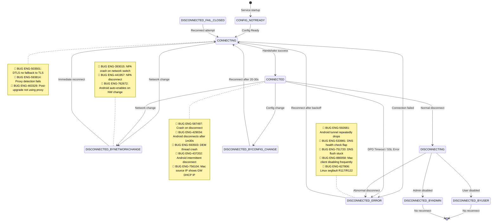
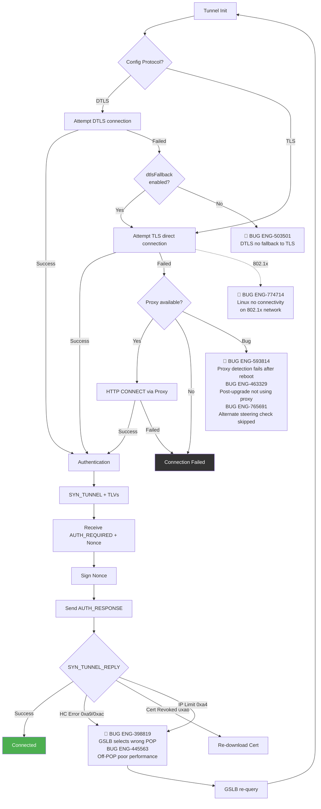
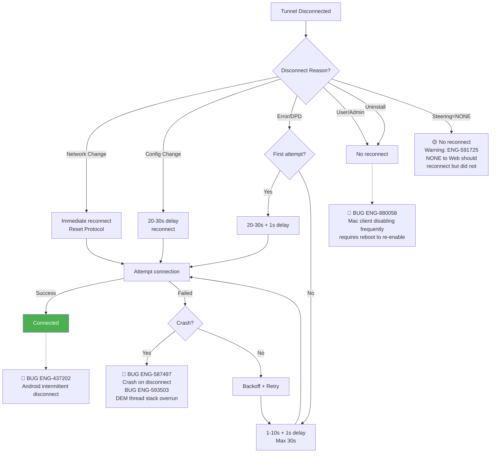
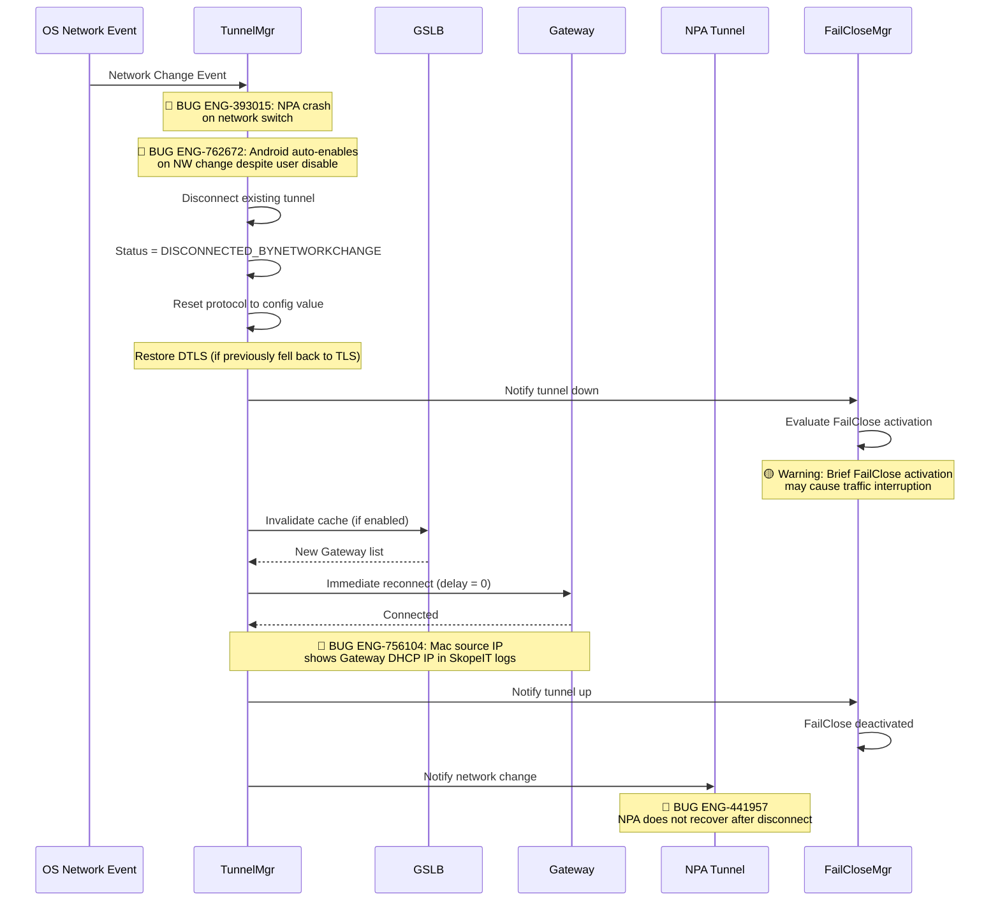
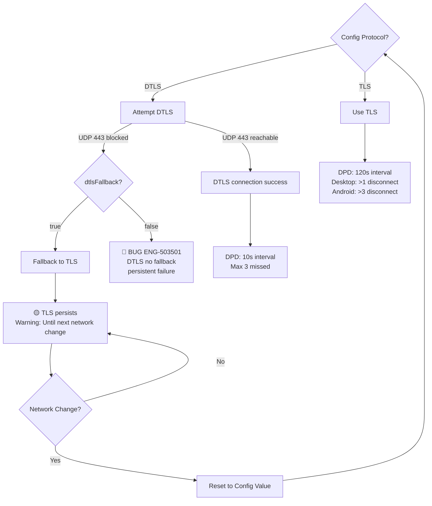

# 07. Tunnel Management

**Escalation Bug Count**: 71 | **Regression**: 23 (32%) | **Day-1**: 22 (31%) | **Test Gap**: 12 (17%)

📋 **[Test Cases — Google Sheet](https://docs.google.com/spreadsheets/d/1ackCZ-EcepXw1BkSGoi5Go9Ex1I72-fXqcqLGMGiuio/edit?gid=1437183914#gid=1437183914)**

> This chapter covers how NSClient establishes, maintains, reconnects, and tears down tunnels to Netskope Gateways. Each flow is illustrated with mermaid diagrams annotated with known escalation bug failure points (red) and predicted risk points (yellow). Platform-specific sections follow the shared flows.

---

## Overview

NSClient's tunnel subsystem is the backbone of all traffic steering. Without a healthy tunnel, no traffic reaches the Netskope cloud for inspection, and FailClose becomes the only line of defense. The tunnel lifecycle involves five core processes that interact tightly with Config, Steering, GSLB, NPA, and FailClose:

1. **State Machine** -- A 22-state machine governs all tunnel transitions, from CONFIG_NOTREADY at service startup through CONNECTED, across multiple disconnect reasons, and back to reconnect attempts
2. **Connection Establishment** -- Protocol selection (TLS vs DTLS), proxy detection, SPDY authentication handshake (SYN_TUNNEL / AUTH_REQUIRED / AUTH_RESPONSE), and POP health check validation
3. **Reconnect Strategy** -- Different disconnect reasons trigger different backoff strategies: immediate for network change, 20-30s delay for config change, exponential backoff for errors
4. **Network Change Handling** -- OS network events trigger tunnel teardown, protocol reset (DTLS state is restored), GSLB cache invalidation, and immediate reconnect with dual-tunnel (SWG + NPA) coordination
5. **TLS/DTLS Fallback** -- DTLS is preferred for performance (UDP), but falls back to TLS when UDP 443 is blocked; the fallback is sticky until the next network change event resets protocol selection

The highest-risk area is the **CONNECTING state**, where four distinct escalation bugs concentrate: DTLS fallback failure (ENG-503501), proxy detection loss after reboot (ENG-593814), proxy settings lost after upgrade (ENG-463329), and alternate steering check skipped in VDI (ENG-765691). The second highest-risk pattern is **crash during disconnect** (ENG-587497, ENG-593503), where race conditions between tunnel teardown and DEM thread cleanup cause service crashes. A third emerging pattern is **platform-specific tunnel instability**: Android intermittent disconnect on specific hardware (ENG-437202), Android auto-enable on network change despite user disable (ENG-762672), macOS client disabling frequently requiring reboot (ENG-880058), and Linux connectivity loss on 802.1x networks (ENG-774714).

Tunnel bugs have the highest regression rate (36%) and highest Day-1 rate (32%) among all four feature areas, indicating that many tunnel flow paths were insufficiently tested from initial design and that fixes frequently introduce new regressions in related paths.

---

## Tunnel 22-State State Machine

The tunnel state machine is the central coordination point for all tunnel activity. It defines 22 distinct states, but the diagram below focuses on the 10 most important states and the transitions between them. Each transition represents a specific event (config ready, handshake success, network change, DPD timeout, etc.), and each state determines what reconnect strategy the tunnel manager will use.

Bug annotations on this diagram show where confirmed escalation bugs cluster. The CONNECTING state has the densest bug concentration because it involves protocol negotiation, proxy detection, and authentication -- three independently complex subsystems that must all succeed. The DISCONNECTED_ERROR state is the second-hottest area because reconnect logic must correctly classify the disconnect reason to choose the right strategy, and misclassification leads to either no reconnect (ENG-591725) or infinite reconnect loops (ENG-533981).

---

## Connection Establishment Flow

When the tunnel manager transitions from CONFIG_NOTREADY to CONNECTING, it enters the connection establishment flow. This flow determines which protocol to use (DTLS or TLS), whether a proxy is needed, and then executes the SPDY-based authentication handshake with the Netskope Gateway. The authentication uses a challenge-response pattern: the client sends SYN_TUNNEL with TLV metadata, the gateway responds with AUTH_REQUIRED and a nonce, the client signs the nonce with its private key and sends AUTH_RESPONSE, and the gateway replies with SYN_TUNNEL_REPLY containing the connection result.

The most dangerous failure point in this flow is the DTLS fallback decision. When DTLS fails (UDP 443 blocked) and `dtlsFallback` is disabled, the client enters a persistent failure loop with no recovery (ENG-503501). The proxy detection path is equally treacherous: after a reboot, `addonhost` may not be populated, causing proxy re-detection to fail silently (ENG-593814), and after an upgrade, proxy settings may be lost entirely (ENG-463329). At the gateway response stage, health check errors (0xa9, 0xac) trigger POP switching, but incorrect GSLB logic can send the client to the wrong POP (ENG-398819, ENG-445563).

**Node Risk Assessment** -- Every node in this flow has been reviewed:

| Node | Risk Level | Assessment |
|---|---|---|
| Tunnel Init | Low | Entry point triggered by config ready or reconnect |
| Config Protocol? | Low | Binary DTLS/TLS selection from config |
| Attempt DTLS connection | Medium | DTLS handshake can fail silently in restrictive networks; timeout behavior matters |
| Attempt TLS direct | Medium | Standard TLS; well-tested path on most networks. **Bug**: ENG-774714 -- Linux loses all connectivity on 802.1x networks with NSC enabled |
| dtlsFallback enabled? | **High** | **Bug**: ENG-503501 -- DTLS failure does not fall back to TLS when flag is off |
| Proxy available? | **High** | **Bug**: ENG-593814 (proxy detection fails after reboot), ENG-463329 (post-upgrade not using proxy), ENG-765691 (alternate steering check skipped in VDI disconnected-user scenario) |
| HTTP CONNECT via Proxy | Medium | Enterprise proxy auth (NTLM/Kerberos) negotiation is complex; credential caching issues possible |
| Connection Failed | Low | Terminal failure state; triggers reconnect strategy |
| Authentication (SYN_TUNNEL) | Medium | TLV encoding correctness is critical; malformed TLV could cause silent auth failure |
| Receive AUTH_REQUIRED + Nonce | Low | Server-driven; client parses nonce |
| Sign Nonce | Medium | Certificate private key access required -- key store corruption or permissions issue could cause silent failure |
| Send AUTH_RESPONSE | Low | Signed response send |
| SYN_TUNNEL_REPLY | **High** | **Bug**: ENG-398819 (wrong POP), ENG-445563 (off-POP performance) -- HC error handling |
| Connected | Low | Success terminal state |
| GSLB re-query | Medium | GSLB re-query after POP switch -- could loop if all POPs return same error |
| Re-download Cert | Medium | Cert re-download requires MP connectivity -- could fail if MP is also unreachable |

**Confirmed Bug Mapping**:

| Flow Step | Known Bugs | Root Cause | Automation |
|---|---|---|---|
| dtlsFallback enabled? | ENG-503501 (DTLS no fallback) | Regression from ENG-445563 POP fix: TLS fallback not executed after DTLS failure | Not covered |
| Proxy available? | ENG-593814 (proxy fails after reboot), ENG-463329 (proxy lost after upgrade), ENG-765691 (alternate steering check skipped) | addonhost not populated after reboot; proxy settings not preserved during upgrade; proxy detection depends on impersonating active user, misses disconnected VDI users | Not covered |
| Attempt TLS direct | ENG-774714 (Linux 802.1x no connectivity) | Linux TUN interface conflicts with 802.1x network authentication; new feature flag added for 802.1x | Not covered |
| SYN_TUNNEL_REPLY | ENG-398819 (wrong POP), ENG-445563 (off-POP performance) | Negative scenario not handled in GSLB POP selection logic | Not covered |

**Predicted Risk Points (No Known Escalation)**:

| Flow Step | Predicted Risk | Potential Impact | Automation |
|---|---|---|---|
| Authentication (SYN_TUNNEL) | Malformed TLV encoding | Silent auth failure, tunnel never connects | Not covered |
| Sign Nonce | Key store corruption / permissions | Private key inaccessible, authentication fails silently | Not covered |
| HTTP CONNECT via Proxy | NTLM/Kerberos credential caching | Auth loop or hang behind enterprise proxy | Not covered |
| GSLB re-query | All POPs return same HC error | Infinite POP switch loop, tunnel never connects | Not covered |
| Re-download Cert | MP unreachable during cert redownload | Cert revocation cannot be resolved, permanent disconnect | Not covered |

---

## Reconnect Strategy Flow

When a tunnel disconnects, the reconnect strategy flow determines whether and how to reconnect. The strategy varies dramatically by disconnect reason: network change triggers an immediate reconnect with protocol reset, config change imposes a 20-30s delay, error/DPD triggers exponential backoff, and user/admin disable means no reconnect at all.

The most critical bug in this flow is ENG-591725: when steering mode changes from NONE to Web/All, the tunnel should reconnect but does not. This happens because the disconnect reason is classified as "Steering=NONE" which maps to "no reconnect," but the new config actually requires a tunnel. The crash bugs (ENG-587497, ENG-593503) are equally dangerous because they occur during the reconnect attempt itself, turning a recoverable disconnect into a service crash.

**Node Risk Assessment** -- Every node in this flow has been reviewed:

| Node | Risk Level | Assessment |
|---|---|---|
| Tunnel Disconnected | Low | Entry point; disconnect event received |
| Disconnect Reason? | Medium | Reason classification is critical -- misclassified reason leads to wrong reconnect strategy |
| Network Change - Immediate reconnect | **High** | Immediate reconnect with protocol reset -- could fail if network is still transitioning (e.g., WiFi handoff). **Bug**: ENG-762672 -- Android client auto-enables on network change even when user disabled it |
| Config Change - 20-30s delay | Low | Delay allows config to stabilize |
| Error/DPD - First attempt? | Low | Binary check |
| User/Admin - No reconnect | Low | Intentional disconnect; no action needed |
| Steering=NONE - No reconnect | **High** | **Bug**: ENG-591725 -- NONE to Web transition should reconnect but does not |
| First attempt - 20-30s delay | Low | Standard backoff |
| Subsequent - 1-10s + backoff | Low | Exponential backoff; max 30s |
| Attempt connection | Low | Dispatches to Connection Establishment flow |
| Connected | Medium | Success terminal state. **Bug**: ENG-437202 -- Android clients disconnect intermittently (Lenovo platform-specific) |
| Crash? | **High** | **Bug**: ENG-587497 (crash on disconnect), ENG-593503 (DEM thread overrun) |
| User/Admin - No reconnect | **High** | **Bug**: ENG-880058 -- macOS client disables frequently and only re-enables after reboot; user-disabled state should persist but NE/proxy instability forces repeated disable |
| Backoff + Retry | Medium | Persistent retry without limit could mask underlying issue; should alert after N failures |

---

## Network Change Reconnect Sequence

Network change events (WiFi to cellular, VPN connect/disconnect, DHCP renewal) are the most common trigger for tunnel reconnection. This sequence diagram traces the full chain from the OS network event through tunnel teardown, FailClose evaluation, GSLB refresh, reconnection, and NPA notification. The sequence is time-sensitive: FailClose may briefly activate during the gap between tunnel teardown and reconnection, causing a transient traffic interruption that users notice as a brief connectivity blip.

The two most dangerous bugs in this flow involve NPA. ENG-393015 causes an outright crash when NPA and SWG tunnels are both active during a network switch, and ENG-441957 causes NPA to silently fail to recover after disconnect. Both bugs mean that private application access is lost after a network change, but the user may not realize it immediately because SWG traffic (web browsing) recovers normally.

---

## TLS/DTLS Fallback Decision Tree

The protocol fallback logic determines whether the client uses DTLS (UDP-based, lower latency) or TLS (TCP-based, more reliable). DTLS is preferred when the config specifies it and UDP 443 is reachable, but many enterprise networks block UDP 443, forcing a fallback to TLS. The fallback is sticky: once the client falls back to TLS, it stays on TLS until the next network change event, which resets protocol selection back to the config value.

The Dead Peer Detection (DPD) mechanism differs significantly between DTLS and TLS. DTLS uses aggressive 10-second intervals with a threshold of 3 missed pings, while TLS uses 120-second intervals. Furthermore, Android requires more than 3 consecutive DPD disconnects before triggering a full disconnect, while desktop platforms trigger on more than 1. This platform-specific DPD difference is a frequent source of cross-platform testing confusion and may contribute to the high Android tunnel flapping rate (ENG-533981, ENG-429034).

**Node Risk Assessment** -- Every node in this flow has been reviewed:

| Node | Risk Level | Assessment |
|---|---|---|
| Config Protocol? | Low | Binary TLS/DTLS selection from config |
| Use TLS | Low | Standard TLS path; well-tested |
| Attempt DTLS | Medium | UDP 443 can be blocked by enterprise firewalls -- failure detection timeout matters |
| DTLS connection success | Low | Success path |
| dtlsFallback? | **High** | **Bug**: ENG-503501 -- When flag is false, DTLS failure causes persistent connection failure |
| Fallback to TLS | Low | Fallback mechanism |
| TLS persists (until network change) | Medium | TLS persistence is sticky -- user stays on TLS even after DTLS becomes available, causing suboptimal performance |
| Network Change? | Low | OS network event trigger |
| Reset to Config Value | Low | Re-evaluates protocol selection |
| DPD DTLS (10s interval) | Medium | Aggressive DPD -- 3 missed pings = disconnect; transient network jitter could cause unnecessary disconnects |
| DPD TLS (120s interval) | Medium | Android threshold (>3 disconnect) vs Desktop (>1) -- platform-specific behavior difference could confuse cross-platform testing |

---

## Windows

**Bug Count**: 14 direct + cross-platform shared | **Key Gaps**: VDI multi-user, DNS flush deadlock, proxy persistence, AOAC, VDI steering check

Windows uses the WFP (Windows Filtering Platform) driver for packet interception and the `stAgentSvc` service for tunnel management. The tunnel manager thread is responsible for connection establishment, DPD monitoring, and reconnect logic. Windows accounts for the majority of tunnel escalation bugs, with three dominant failure patterns:

1. **DNS flush deadlock** (ENG-751720): The tunnel manager thread calls `ipconfig.exe /flushdns` using `CreateProcess` with `INFINITE` timeout. If the system has "DNS client event 8020," the flush hangs permanently, causing FailClose to remain active indefinitely.
2. **VDI multi-user contention** (ENG-918131, ENG-624953): Multiple user sessions sharing the same kernel driver create race conditions during concurrent tunnel establishment, causing 20+ second delays or disruption of existing connections.
3. **Proxy detection loss** (ENG-593814, ENG-463329, ENG-406879): Proxy settings are not correctly preserved across reboots or upgrades, and stale proxy credentials are not cleared when proxy settings change.

### Windows-Specific Bugs

| Bug ID | Problem Summary | Root Cause | Fix |
|--------|----------------|-----------|-----|
| **ENG-393015** | NPA + SWG network switch crash | NPA tunnel crash during network switch; found internally but existed in previous versions | Need NPA integration + network switch stress testing |
| **ENG-398819** | GSLB selects wrong POP (FloridaBlue) | Negative scenario not handled in GSLB POP selection logic | Fix GSLB fallback logic |
| **ENG-445563** | Connected to non-optimal POP (BUE1) | GSLB POP selection problem, different from ENG-398819 | Fix POP selection logic |
| **ENG-463329** | Local proxy not used after R115 upgrade | R113/R114 normal but R115 regression; proxy settings lost after upgrade | Fix proxy settings preservation during upgrade |
| **ENG-503501** | DTLS does not fallback to TLS | Regression from ENG-445563 fix: TLS fallback not executed after DTLS failure | Revert problematic code change |
| **ENG-587497** | Client service crash during tunnel disconnect | Crash during tunnel disconnect (multiple instances) | Code refactor to avoid crash |
| **ENG-593503** | DEM thread stack overrun - crash on disconnect | DEM thread crash during tunnel disconnect, hard to reproduce | Fix DEM thread stack usage |
| **ENG-624953** | VDI tunnel establishment disrupts existing connections | Client disrupts existing connections in bypass list, breaking VDI multi-user communication | Add `avoidDisruptingBypass` / `bypassAllExistingConnections` flags |
| **ENG-659009** | GSLB not refreshed after reboot | Tunnel manager does not trigger GSLB POP list re-download after tunnel disconnect | Force GSLB refresh on tunnel disconnect |
| **ENG-751720** | DNS flush deadlock causes permanent FailClose | CreateProcess + INFINITE timeout to call ipconfig.exe /flushdns; thread hangs if system has DNS client event 8020 | Fix CreateProcess timeout to finite value |
| **ENG-752117** | VDI master image vs tenant config FailClose mismatch | VDI master image has FC enabled, tenant config has FC disabled; config sync race condition | Corner case, not recommended deployment method |
| **ENG-918131** | VDI multi-user tunnel establishment delayed 20s | ~20s delay when multiple users login simultaneously | Need VDI environment stability test automation |
| **ENG-406879** | NSClient retains proxy details after proxy removal | Proxy settings not synced to tunnel connection after clearing | Monitor logs during proxy changes to verify proxy setting synchronization |
| **ENG-765691** | Alternate Steering Check not performed occasionally (Morgan Stanley) | Proxy detection depends on impersonating active user; in VDI, disconnected-state users are missed despite active tunnels | Fix proxy detection to consider disconnected VDI users |

---

## macOS

**Bug Count**: 4 direct + cross-platform shared | **Key Gaps**: AOAC/Dark Wake, System Extension recovery, DHCP interop, NE/proxy stability

macOS uses a System Extension with a transparent proxy for network filtering. The tunnel management logic is shared with Windows at the application layer, but the network event handling differs due to macOS-specific APIs (`SCNetworkReachability`, `NWPathMonitor`). The most significant macOS-specific issue is AOAC (Modern Standby / Dark Wake) tunnel recovery.

### macOS-Specific Bugs

| Bug ID | Problem Summary | Root Cause | Fix |
|--------|----------------|-----------|-----|
| **ENG-548975** | Captive portal grace period not working as expected | Original code resets captive portal status after tunnel worker thread starts, but GSLB checking may have 20s delay | Fix reset timing: after GSLB checking, before tunnel worker thread |
| **ENG-746099** | AOAC tunnel frequent disconnect (MakeMyTrip) | Tunnel not maintained during macOS system wakeup | Add `enableMacOsAOACSupport` flag to maintain tunnel during onSystemWakeup callback |
| **ENG-756104** | SkopeIT logs show source IP as Gateway DHCP IP | Client code updated machine IP only in info log print statement; warn/error/critical log levels skip the IP update | Split IP update and log print into separate statements |
| **ENG-880058** | MAC Client disabling frequently, enables only after reboot (IndMoney) | macOS NE/proxy instability causes client to repeatedly enter disabled state | Under investigation; reboot required to restore |

macOS also shares ENG-548975 with Windows (captive portal grace period timing) and is affected by NPA-related tunnel bugs ENG-441957 and ENG-393015 through the shared NPA core library.

---

## Linux

**Bug Count**: 1 direct + cross-platform shared | **Key Gaps**: Large domain crash, VIF device handling, 802.1x network interop

Linux uses a TUN virtual interface (VIF) for packet interception. The tunnel management logic is shared with desktop platforms, but Linux-specific kernel networking differences (netfilter vs WFP, systemd service management) create unique recovery paths. Linux shares all cross-platform tunnel bugs (ENG-591725 NONE-to-Web transition, ENG-503501 DTLS fallback) and is affected by the large domain crash (ENG-948106) that can occur during tunnel establishment when loading a 35K+ entry steering config.

### Linux-Specific Bugs

| Bug ID | Problem Summary | Root Cause | Fix |
|--------|----------------|-----------|-----|
| **ENG-774714** | No connectivity on 802.1x network with NSC enabled | Linux TUN interface conflicts with 802.1x (WPA Enterprise) network authentication; Day-1 issue | New feature flag added for 802.1x network support; automation pending setup (tracked by ENG-795961) |
| **ENG-627806** | Intermittent segmentation fault in Linux NS Client R117/R122 | Crash in tunnel handling code on Linux; intermittent segfault during active tunnel operation | Crash fix in subsequent release |

---

## Android

**Bug Count**: 7 direct | **Key Gaps**: Network state machine, NPA recovery, cellular transitions, network change auto-enable

Android tunnel management faces unique challenges due to the mobile network environment: frequent WiFi-to-cellular transitions, unreliable network events from vendor-specific OS customizations (Samsung, Xiaomi), and the need to coordinate both SWG and NPA tunnels during network changes. Android has the highest Day-1 bug ratio among all platforms for tunnel management, indicating that mobile network state complexity was underestimated during initial design.

The DPD threshold difference (Android requires >3 consecutive DPD failures vs Desktop >1) was introduced specifically to reduce false disconnects on unstable mobile networks, but this creates a testing gap where Android tunnels may silently lose connectivity for longer periods before detecting a dead peer.

### Android-Specific Bugs

| Bug ID | Problem Summary | Root Cause | Fix |
|--------|----------------|-----------|-----|
| **ENG-429034** | Android tunnel disconnects after 1m30s | TLS SSL_read failure on specific Samsung A53/A51 models | Need to add Data to 4G/5G test case |
| **ENG-533981** | Android tunnel flaps (DNS health check) | DNS tunnel health check triggers repeated tunnel disconnect/reconnect after network switch | Need 1-hour DNS health check duration test |
| **ENG-592681** | Android tunnel repeatedly drops (NPA recovery bug) | NPA + SWG recovery mechanism bug: both tunnels enter disconnected state under specific conditions | Re-implement recovery mechanism to cover all cases |
| **ENG-917549** | Android stuck in Connecting state (Sabistech) | WiFi to Mobile Data switch receives no network event; tunnel manager stops; UI does not update | Fix tunnel state update to UI logic |
| **ENG-652754** | Android stuck in connecting state (Banco de Sabadell) | Abnormal tunnel connect/disconnect cycle during unreliable network | Hard to reproduce; need Android tunnel disconnect/connect negative testing |
| **ENG-437202** | Android clients getting disconnected intermittently | Platform-specific (Lenovo) intermittent tunnel disconnect on data path | Improve platform coverage testing for Android; test gap in device diversity |
| **ENG-762672** | Android client auto-enables during network change despite user disable (BHEL) | Custom OS devices allow tunnel disconnect from notification bar; network change triggers auto re-enable ignoring user disable state | Need additional custom OS devices to cover notification-bar disconnect scenario |

---

## iOS

**Bug Count**: 0 direct tunnel bugs | **Key Gaps**: NPA tunnel recovery, IPv6 link-local DNS

iOS uses a Network Extension (NEPacketTunnelProvider) for tunnel management. No iOS-specific tunnel escalation bugs have been filed, but iOS shares cross-platform NPA tunnel recovery bugs and is affected by ENG-671659 (IPv6 link-local DNS scope_id not handled during hotspot connection) which can disrupt DNS resolution and indirectly prevent tunnel establishment.

---

## ChromeOS

**Bug Count**: 0 direct tunnel bugs | **Key Gaps**: Large domain steering config crash

ChromeOS uses a Chrome extension-based architecture. No ChromeOS-specific tunnel bugs have been filed, but ChromeOS shares the large domain crash bug (ENG-872456: 30K+ domains exceeding buffer limit) which can crash the extension during tunnel establishment when the steering config is loaded.

---

## Backend

**Bug Count**: 0 direct tunnel bugs | **Key Gaps**: POP health check response codes, GSLB accuracy

Backend (Data Plane / Gateway) issues affect tunnel management through health check responses (0xa9, 0xac, 0xab, 0xa4) and GSLB POP selection accuracy. The two confirmed POP selection bugs (ENG-398819, ENG-445563) originated from backend GSLB logic issues that the client-side tunnel code then had to handle. No backend-specific tunnel bugs exist in the current bug database, but the fix-regression chain (ENG-445563 fix causing ENG-503501) demonstrates that backend changes to POP selection can cascade into client-side tunnel failures.

---

## Cross-Platform Test Cases

> The following test cases are **suggested testing directions** based on bug analysis and code flow cross-referencing, not existing product test cases.

**TC-TN-01: Concurrent Tunnel Disconnect + Config Update**

| Field | Value |
|---|---|
| **Severity** | S2 |
| **Related Bugs** | ENG-591725, ENG-422599 |
| **Flow Point** | Reconnect Strategy -- Config Change path |
| **Gap Type** | Missing |
| **Automation Priority** | P1 |
| **Platforms** | All |

**Preconditions**: Tunnel established, active traffic
**Steps**:
1. Simultaneously trigger: (a) network change causing disconnect (b) config update arrives
2. Observe reconnect behavior
3. Confirm whether new config or old config is used

**Expected Result**: Reconnect succeeds using new config, no crash or deadlock
**Failure Indicators**: `grep -i "config.*update\|reconnect\|disconnect.*config" nsdebuglog.log`
**Risk if Untested**: Race condition causes config inconsistency or crash

---

**TC-TN-02: DTLS Fallback Under FailClose Active**

| Field | Value |
|---|---|
| **Severity** | S1 |
| **Related Bugs** | ENG-503501 |
| **Flow Point** | TLS/DTLS Fallback -- FailClose active |
| **Gap Type** | Missing |
| **Automation Priority** | P1 |
| **Platforms** | All |

**Preconditions**: DTLS configured, FailClose enabled, UDP 443 blocked by firewall
**Steps**:
1. Start client -> DTLS connection fails
2. Confirm fallback to TLS
3. FailClose should activate during fallback
4. After TLS connection succeeds, FailClose should deactivate
5. Confirm captive portal detection works throughout

**Expected Result**: FailClose correctly managed during DTLS->TLS fallback, does not permanently block
**Failure Indicators**: `grep -i "dtls.*fail\|fallback.*tls\|failclose.*active" nsdebuglog.log`
**Risk if Untested**: DTLS failure + FailClose = permanent network outage (S1)

---

**TC-TN-03: POP Health Check Failover During Active Transfer**

| Field | Value |
|---|---|
| **Severity** | S2 |
| **Related Bugs** | ENG-398819, ENG-445563 |
| **Flow Point** | Connection Establishment -- HC Error -> POP Switch |
| **Gap Type** | Missing |
| **Automation Priority** | P2 |
| **Platforms** | All |

**Preconditions**: Tunnel established, downloading a large file
**Steps**:
1. Start 1GB file download
2. Simulate POP A returning HC_PROXY_ERR (0xa9)
3. Observe POP switch behavior
4. Confirm download recovers (or at least does not crash)

**Expected Result**: Smooth switch to POP B, download may interrupt but client does not crash
**Risk if Untested**: Pending packet queue overflow during POP switch

---

**TC-TN-04: 150-Tunnel Limit Exhaustion**

| Field | Value |
|---|---|
| **Severity** | S2 |
| **Related Bugs** | (Chapter 07 Bug Hint -- session ID wrap-around) |
| **Flow Point** | Tunnel State Machine -- Session ID allocation |
| **Gap Type** | Missing |
| **Automation Priority** | P3 |
| **Platforms** | All |

**Preconditions**: Firewall mode enabled, high connection rate
**Steps**:
1. Establish large number of concurrent connections (over 150 sessions)
2. Observe session ID allocation
3. Check uint32 wrap-around behavior

**Expected Result**: Session IDs correctly managed, no collision
**Risk if Untested**: Session ID collision causes tunnel misrouting

---

**TC-TN-05: AOAC Resume + DTLS Tunnel State**

| Field | Value |
|---|---|
| **Severity** | S2 |
| **Related Bugs** | ENG-746099 |
| **Flow Point** | Network Change -- Modern Standby |
| **Gap Type** | Missing |
| **Automation Priority** | P2 |
| **Platforms** | Windows, macOS |

**Preconditions**: DTLS tunnel, AOAC enabled
**Steps**:
1. Tunnel connected via DTLS
2. Device enters Modern Standby
3. Wait 30 seconds
4. Wake device
5. Observe DTLS tunnel recovery

**Expected Result**: DTLS tunnel quickly reconnects (UDP state loss is expected)
**Risk if Untested**: DTLS does not recover after AOAC resume, downgrades to TLS

---

**TC-TN-06: DPD False Positive Under Network Jitter**

| Field | Value |
|---|---|
| **Severity** | S3 |
| **Related Bugs** | ENG-429034, ENG-533981 |
| **Flow Point** | DPD -- DTLS 10s x 3 threshold |
| **Gap Type** | Incomplete |
| **Automation Priority** | P2 |
| **Platforms** | All (especially Android) |

**Preconditions**: DTLS tunnel, simulated packet loss environment
**Steps**:
1. Use traffic shaper to set 20% packet loss
2. Observe DPD ping/reply behavior
3. Count false disconnects over 1 hour
4. Compare DTLS (10sx3) vs TLS (120sx1) false positive rate

**Expected Result**: 20% loss should not frequently trigger disconnects
**Risk if Untested**: Unstable network environments cause repeated tunnel disconnects

---

**TC-TN-07: Multi-User VDI Concurrent Tunnel Establishment**

| Field | Value |
|---|---|
| **Severity** | S2 |
| **Related Bugs** | ENG-918131, ENG-624953 |
| **Flow Point** | Connection Establishment -- Multi-session |
| **Gap Type** | Missing |
| **Automation Priority** | P3 (manual) |
| **Platforms** | Windows (VDI) |

**Preconditions**: Citrix VDI, multiple users logged in simultaneously
**Steps**:
1. 3 users log in to VDI simultaneously
2. Observe each user's tunnel establishment time
3. Confirm delay does not exceed 20 seconds
4. Confirm existing connections are not disrupted (avoidDisruptingBypass)

**Expected Result**: All users' tunnels established successfully, acceptable delay
**Risk if Untested**: Multi-user login tunnel delay 20+ seconds (ENG-918131)

---

**TC-TN-08: NPA + SWG Dual Tunnel Network Switch**

| Field | Value |
|---|---|
| **Severity** | S2 |
| **Related Bugs** | ENG-393015, ENG-441957, ENG-592681 |
| **Flow Point** | Network Change -> Reconnect -- NPA interaction |
| **Gap Type** | Incomplete |
| **Automation Priority** | P1 |
| **Platforms** | All |

**Preconditions**: SWG tunnel + NPA tunnel both established
**Steps**:
1. Switch WiFi -> 4G (network change)
2. Observe both tunnels' reconnect
3. Confirm NPA traffic recovers
4. Confirm SWG traffic recovers
5. Repeat 5 times

**Expected Result**: Both tunnels recover within 30s, no crash
**Failure Indicators**: `grep -i "npa.*crash\|npa.*disconnect\|dual.*tunnel" nsdebuglog.log`
**Risk if Untested**: Network switch causes NPA crash (ENG-393015)

---

**TC-TN-09: Proxy Stale Credential After Upgrade**

| Field | Value |
|---|---|
| **Severity** | S2 |
| **Related Bugs** | ENG-463329, ENG-593814, ENG-406879 |
| **Flow Point** | Connection Establishment -- Proxy path |
| **Gap Type** | Incomplete |
| **Automation Priority** | P2 |
| **Platforms** | Windows, macOS |

**Preconditions**: Explicit proxy environment
**Steps**:
1. Confirm tunnel established via proxy
2. Upgrade to new version
3. After reboot confirm tunnel still establishes via proxy
4. Remove proxy -> confirm client detects and connects directly
5. Re-add proxy -> confirm client detects and uses proxy

**Expected Result**: Client correctly detects and adjusts after proxy configuration changes
**Failure Indicators**: `grep -i "proxy.*detect\|proxy.*fail\|addonhost" nsdebuglog.log`
**Risk if Untested**: Proxy detection failure after upgrade/reboot causes disconnection

---

**TC-TN-10: Pending Packet Queue Overflow**

| Field | Value |
|---|---|
| **Severity** | S2 |
| **Related Bugs** | (Chapter 07 Bug Hint -- queue OOM) |
| **Flow Point** | Tunnel Write -- Queue Management |
| **Gap Type** | Missing |
| **Automation Priority** | P2 |
| **Platforms** | All |

**Preconditions**: `maxPktQueueSize = 0` (unlimited)
**Steps**:
1. Tunnel established, start heavy traffic
2. Simulate tunnel write blocked (TCP send buffer full)
3. Continue generating new traffic for 5 minutes
4. Monitor memory usage

**Expected Result**: Has upper bound or graceful drop, no OOM
**Risk if Untested**: Unbounded queue causes OOM crash

---

**TC-TN-11: GSLB Refresh on Tunnel Disconnect After Reboot**

| Field | Value |
|---|---|
| **Severity** | S2 |
| **Related Bugs** | ENG-659009 |
| **Flow Point** | Connection Establishment -- GSLB |
| **Gap Type** | Incomplete |
| **Automation Priority** | P2 |
| **Platforms** | All |

**Preconditions**: Tunnel established
**Steps**:
1. Reboot device
2. After service starts, observe GSLB behavior
3. Confirm GSLB cache is invalidated
4. Confirm best POP is selected

**Expected Result**: GSLB correctly refreshes after reboot, does not use stale data
**Failure Indicators**: `grep -i "gslb.*refresh\|gslb.*stale\|pop.*select" nsdebuglog.log`
**Risk if Untested**: Connects to distant POP causing high latency

---

**TC-TN-12: Android Stuck in Connecting State**

| Field | Value |
|---|---|
| **Severity** | S2 |
| **Related Bugs** | ENG-917549, ENG-652754 |
| **Flow Point** | Tunnel State Machine -- CONNECTING state |
| **Gap Type** | Incomplete |
| **Automation Priority** | P2 |
| **Platforms** | Android |

**Preconditions**: Android device, unstable network
**Steps**:
1. Enable NSClient
2. Repeatedly toggle WiFi on/off (5-second intervals, 10 times)
3. Finally turn off WiFi
4. Observe if UI status correctly reflects "No Network"

**Expected Result**: UI shows correct status, does not get stuck on "Connecting"
**Risk if Untested**: User sees permanent "Connecting" but actually has no connection

---

**TC-TN-13: Network Interface Change — Brief FailClose Traffic Interruption**

| Field | Value |
|---|---|
| **Severity** | S2 |
| **Related Bugs** | (Predicted risk — brief FailClose activation during network change) |
| **Flow Point** | Network Change Reconnect Sequence -- FailClose activation window between tunnel teardown and reconnect |
| **Gap Type** | Test Gap |
| **Automation Priority** | P2 |
| **Platforms** | Windows, macOS, Linux |

**Preconditions**: FailClose enabled, tunnel connected via WiFi, Ethernet adapter available
**Steps**:
1. Confirm tunnel connected on WiFi, active HTTP traffic flowing
2. Switch network from WiFi to Ethernet (plug in cable, disable WiFi)
3. Measure any traffic interruption duration during the switch
4. Observe FailClose state: does it briefly activate during the tunnel teardown/reconnect gap?
5. Confirm tunnel reconnects on new interface and traffic resumes
6. Repeat in reverse (Ethernet to WiFi) and measure interruption
7. Repeat with WiFi to cellular (mobile hotspot) on supported devices

**Expected Result**: Network interface change does not cause user-visible traffic interruption from brief FailClose activation; if FailClose briefly activates, the window is less than 2 seconds and does not result in dropped connections or DNS failures
**Failure Indicators**: `grep -i "failclose.*active\|network.*change\|tunnel.*disconnect.*reconnect" nsdebuglog.log`
**Risk if Untested**: Brief FailClose activation during network interface transitions causes user-visible connectivity blip, dropped HTTP sessions, or DNS resolution failures

---

## Cross-Flow Interactions

Tunnel Management interacts with Steering, FailClose, NPA, and Installation in ways that produce compound failures. Of the 174 total escalation bugs, **37 (21%) span multiple categories**, and the Tunnel + FailClose combination is one of the highest-risk intersections. See [11. FailClose](11_failclose.md#config-update-chain-reaction) for detailed diagrams and analysis of the Config Update and Upgrade chain reaction scenarios.

### Cross-Flow Risk Matrix (Tunnel-Relevant)

| Interaction | Known Bugs | Severity | Test Priority |
|---|---|---|---|
| Tunnel reconnect + DNS steering | ENG-561500 | **S1** | P1 |
| DTLS fallback + FailClose | ENG-503501 | **S2** | P2 |
| Network change + NPA + SWG | ENG-393015, ENG-441957 | **S2** | P1 |
| Upgrade + FailClose + Tunnel | ENG-733657, ENG-751720 | **S1** | P1 |
| On-prem detection + Reboot + Tunnel | ENG-895081, ENG-918451 | **S1** | P1 |
| Proxy + Upgrade + Tunnel | ENG-463329, ENG-593814 | **S2** | P2 |
| DEM + Tunnel disconnect | ENG-593503 | **S2** | P2 |
| NPA tunnel + FailClose | ENG-773191 | **S2** | P1 |
| VDI + enrollment + FailClose + Tunnel | ENG-570306, ENG-752117 | **S2** | P2 |

### Cross-Flow Test Cases

**TC-CF-01: Config Update -> Steering Change -> FailClose -> Recovery**

| Field | Value |
|---|---|
| **Severity** | S1 |
| **Related Bugs** | ENG-384041, ENG-422599, ENG-561500, ENG-591725 |
| **Gap Type** | Missing (end-to-end) |
| **Automation Priority** | P1 |

**Preconditions**: Dynamic Steering On-Prem=NONE, Off-Prem=WEB, FailClose enabled, DNS steering enabled
**Steps**:
1. On-Prem: confirm steering=NONE, tunnel not connected, FailClose inactive
2. Push config from MP changing to Off-Prem=ALL
3. Simultaneously switch to Off-Prem environment
4. Observe: steering switch -> tunnel establishment -> FailClose state
5. If FailClose activates before tunnel establishment, confirm captive portal detection
6. After tunnel establishes, confirm DNS steering recovers

**Expected Result**: Complete recovery chain succeeds, DNS steering recovers
**Risk if Untested**: Any step failing in the chain reaction can cause permanent network outage

---

**TC-CF-02: Upgrade -> Service Restart -> FailClose Init**

| Field | Value |
|---|---|
| **Severity** | S1 |
| **Related Bugs** | ENG-733657, ENG-895081, ENG-751720 |
| **Gap Type** | Missing |
| **Automation Priority** | P1 |

**Preconditions**: FailClose enabled, Self-Protection enabled
**Steps**:
1. Confirm tunnel connected, traffic flowing
2. Trigger auto-upgrade
3. Observe service stop -> driver update -> service start
4. Confirm FailClose does not cause permanent block during service restart
5. Confirm tunnel reconnects successfully after upgrade

**Expected Result**: FailClose temporarily activates during upgrade but not permanently, normal operation resumes
**Risk if Untested**: FailClose + DNS flush deadlock during upgrade = permanent network outage

---

**TC-CF-03: Network Change + Dual Tunnel (SWG + NPA)**

| Field | Value |
|---|---|
| **Severity** | S2 |
| **Related Bugs** | ENG-393015, ENG-441957, ENG-592681 |
| **Gap Type** | Incomplete |
| **Automation Priority** | P1 |

**Preconditions**: SWG tunnel + NPA tunnel both connected
**Steps**:
1. WiFi -> 4G network switch
2. Observe both tunnels' disconnect + reconnect
3. FailClose should activate before SWG tunnel reconnects
4. NPA traffic should be protected by exclude_npa
5. Repeat network switch 5 times

**Expected Result**: Both tunnels recover after every network switch, NPA traffic not interrupted
**Risk if Untested**: Network switch triggers NPA crash (ENG-393015)

---

**TC-CF-05: AOAC Resume + On-Prem Change + DTLS Switch**

| Field | Value |
|---|---|
| **Severity** | S2 |
| **Related Bugs** | ENG-746099, ENG-918451, ENG-503501 |
| **Gap Type** | Missing |
| **Automation Priority** | P2 |

**Preconditions**: DTLS tunnel, Dynamic Steering, AOAC enabled
**Steps**:
1. Off-Prem, DTLS tunnel connected
2. Move laptop to On-Prem (VPN or enterprise network)
3. Device enters AOAC standby (lid close)
4. Wake while already On-Prem
5. Observe: on-prem detection -> steering change -> DTLS reconnect

**Expected Result**: Correctly detects on-prem, steering switches, DTLS recovers
**Risk if Untested**: AOAC + location change + protocol switch triple combination may fail

---

**TC-CF-09: NPA Tunnel + FailClose Cycle Recovery**

| Field | Value |
|---|---|
| **Severity** | S2 |
| **Related Bugs** | ENG-773191 |
| **Gap Type** | Missing (cross-flow) |
| **Automation Priority** | P1 |

**Preconditions**: NPA enabled with private app access, SWG tunnel active, FailClose enabled
**Steps**:
1. Access private app via NPA tunnel - confirm working
2. Disconnect network - FailClose activates - both SWG and NPA tunnels drop
3. Reconnect network - SWG tunnel reconnects - FailClose deactivates
4. Attempt private app access again via NPA tunnel
5. Verify NPA tunnel re-establishes correctly after FailClose recovery cycle

**Expected Result**: NPA tunnel fully recovers after FailClose cycle; private apps accessible
**Failure Indicators**: `grep -i "npa.*tunnel\|private.*access\|npa.*reconnect" nsdebuglog.log`
**Risk if Untested**: NPA tunnel silently fails to reconnect after FailClose recovery, user loses private app access without notification

---

**TC-CF-11: DEM Thread Crash + Tunnel Cascade Failure**

| Field | Value |
|---|---|
| **Severity** | S2 |
| **Related Bugs** | ENG-593503 |
| **Gap Type** | Missing (cross-flow) |
| **Automation Priority** | P2 |

**Preconditions**: DEM enabled, SWG tunnel active, active traffic flow
**Steps**:
1. Enable DEM probes - confirm DEM data collection working
2. Simulate DEM thread crash (kill DEM sub-process or trigger exception condition)
3. Observe if tunnel remains stable or cascades to tunnel disconnect
4. If tunnel drops, verify auto-reconnect and DEM recovery
5. Verify no orphaned DEM threads consuming resources after crash

**Expected Result**: DEM thread crash is isolated; tunnel remains stable. DEM auto-recovers independently.
**Failure Indicators**: `grep -i "dem.*crash\|dem.*thread\|tunnel.*disconnect.*dem" nsdebuglog.log`
**Risk if Untested**: DEM crash cascades to tunnel disconnect (ENG-593503), causing traffic interruption for all users

---

**Related Chapters**:
- [05_steering_config.md](05_steering_config.md) -- Steering mode changes triggering tunnel reconnect
- [08_gateway_selection.md](08_gateway_selection.md) -- GSLB POP selection and health check
- [11_failclose.md](11_failclose.md) -- FailClose activation during tunnel disconnect
- [14_proxy_management.md](14_proxy_management.md) -- Proxy detection and credential persistence
- [15_npa_integration.md](15_npa_integration.md) -- NPA dual tunnel coordination

---

## Appendix A: Bug Quick Reference

> Problem summaries, root causes, and fixes for all Tunnel Management bugs referenced in this chapter. The table below lists all bugs that have been individually analyzed and mapped to specific flow steps. Bugs are sorted by Bug ID for quick lookup.

| Bug ID | Problem Summary | Root Cause | Fix | Platform |
|--------|----------------|-----------|-----|----------|
| **ENG-384041** | Steering=NONE enters FailClose instead of Backed-off | Flexible Dynamic Steering enhancement did not handle NONE mode FailClose judgment | Fix NONE mode FailClose judgment logic | Windows |
| **ENG-393015** | NPA + SWG network switch crash | NPA tunnel crash during network switch; found internally but existed in previous versions | Need NPA integration + network switch stress testing | Windows |
| **ENG-398819** | GSLB selects wrong POP (FloridaBlue -- DEI wrongly used for ATL2) | Negative scenario not handled in GSLB POP selection logic | Fix GSLB fallback logic | Windows |
| **ENG-406879** | NSClient retains proxy details after proxy settings removed | Day-1 design: proxy settings not synced to tunnel connection after clearing | Monitor logs during proxy changes to verify synchronization | Windows |
| **ENG-422599** | Config update triggers FailClose | Regression from Flexible Dynamic Steering change (ENG-182503) | Fix FailClose evaluation logic during config update | Windows |
| **ENG-429034** | Android tunnel disconnects after 1m30s | Corner case: TLS SSL_read failure on specific Samsung A53/A51 models | Need to add Data to 4G/5G test case | Android |
| **ENG-441957** | Android NPA disconnect after network switch | Regression (internally reported ENG-410908); NPA does not recover after network switch | Fix NPA reconnect logic after network switch | Android |
| **ENG-445563** | Connected to non-optimal POP (BUE1) causing poor performance | GSLB POP selection problem, different from ENG-398819 | Fix POP selection logic | Windows |
| **ENG-455132** | Off-Prem exception rules applied in On-Prem environment | Legacy bug (before R107); leftover from pre-dynamic steering enhancement | Fix on-prem/off-prem rule application logic | Windows |
| **ENG-463329** | Local proxy not used after R115 upgrade | R113/R114 normal but R115 regression; proxy settings lost after upgrade | Fix proxy settings preservation during upgrade | Windows |
| **ENG-482990** | Captive portal not detected (RSM) | Day-1: NSClient never supported meta refresh element HTTP redirection | Add support for simple meta refresh element | Win/Mac |
| **ENG-503501** | DTLS does not fallback to TLS | Regression from ENG-445563 fix: TLS fallback not executed after DTLS failure | Revert problematic code change | Windows |
| **ENG-533981** | Android tunnel flaps (DNS health check) | DNS tunnel health check triggers repeated disconnect/reconnect after network switch | Need 1-hour DNS health check duration test | Android |
| **ENG-548975** | Captive portal grace period not working as expected | Day-1: code resets captive portal status after tunnel worker thread starts, but GSLB checking may have 20s delay | Fix reset timing: after GSLB checking, before tunnel worker thread | Win/Mac |
| **ENG-561500** | DNS traffic not steered after FailClose recovery | Day-1: DNS steering not restored after recovery under Web Mode + DNS steering + FailClose | Fix DNS steering restoration after FailClose recovery | Windows |
| **ENG-570306** | VDI multi-user FailClose (SENTRY) | Abnormal FailClose behavior during multi-user logout/login + GW unreachable | Need fail-close + multi-user + tunnel disconnect/resume test case | Windows |
| **ENG-587497** | Client service crash during tunnel disconnect | Crash during tunnel disconnect (multiple instances) | Code refactor to avoid crash | Windows |
| **ENG-591725** | Tunnel not established when switching NONE to Web/All | Steering mode change via auto-config update does not trigger tunnel establishment | Fix tunnel startup logic after mode change | Win/Mac/Linux |
| **ENG-592681** | Android tunnel repeatedly drops (NPA recovery bug) | NPA + SWG recovery mechanism bug: both tunnels enter disconnected state | Re-implement recovery mechanism to cover all cases | Android |
| **ENG-593503** | DEM thread stack overrun -- crash on disconnect | DEM thread crash during tunnel disconnect, hard to reproduce | Fix DEM thread stack usage | Windows |
| **ENG-593814** | Proxy detection fails after reboot, tunnel start delayed | `addonhost` not populated after device reboot; proxy re-detection not triggered | Ensure proxy re-detection when addonhost is not populated | Windows |
| **ENG-624953** | VDI tunnel establishment disrupts existing connections | Day-1: Client disrupts existing connections in bypass list, breaking VDI multi-user communication | Add `avoidDisruptingBypass` / `bypassAllExistingConnections` flags | Windows |
| **ENG-652754** | Android stuck in connecting state (Banco de Sabadell) | Abnormal tunnel connect/disconnect cycle during unreliable network | Hard to reproduce; need Android tunnel disconnect/connect negative testing | Android |
| **ENG-659009** | GSLB not refreshed after reboot | Day-1: tunnel manager does not trigger GSLB POP list re-download after tunnel disconnect | Force GSLB refresh on tunnel disconnect | Windows |
| **ENG-733657** | R126 to R129 auto-upgrade failure | Post R125 must enable `disableWinStopServiceProtection: true` flag | Mandatory requirement to enable the flag | Windows |
| **ENG-746099** | AOAC tunnel frequent disconnect (MakeMyTrip) | Day-1: tunnel not maintained during macOS system wakeup | Add `enableMacOsAOACSupport` flag for onSystemWakeup callback | macOS |
| **ENG-751720** | DNS flush deadlock causes permanent FailClose | Day-1: tunnel manager thread uses CreateProcess + INFINITE timeout for ipconfig.exe /flushdns; hangs on DNS client event 8020 | Fix CreateProcess timeout to finite value | Windows |
| **ENG-752117** | VDI master image vs tenant config FailClose mismatch | VDI master image FC enabled, tenant FC disabled; driver enables FC during clone sync; config sync race condition | Corner case, not recommended deployment method | Windows |
| **ENG-773191** | NPA traffic not tunneled (R131 macOS) | macOS 15.x regression: transparent proxy stops when NPA in DISABLED state | Fix transparent proxy behavior after NPA state change | macOS |
| **ENG-793442** | Blocked websites accessible after network change (IPv6) | Steering processing delay under IPv6; blocked websites temporarily accessible after network change | Fix steering re-evaluation after IPv6 network change | Windows |
| **ENG-801565** | Stress test crash (JLL) | Crash after hours of stress testing; Day-1 code | Plan to add regular stability test | Windows |
| **ENG-805334** | NS Client + Citrix/Cisco VPN interop issue | Citrix Secure Access 25.1.1.27 enables WFP mode by default; DNS fails at transport layer | Need independent config options for different VPNs | Windows |
| **ENG-851222** | Egress IP on-prem detection incorrect | On-prem detection logic incorrect under None steering mode | Fix None mode on-prem detection | Windows |
| **ENG-872456** | 30K+ domains crash Android/ChromeOS | Large domain steering config exceeds buffer limit | Add volume test data preparation | Android/ChromeOS |
| **ENG-895081** | FailClose does not block traffic after reboot | FailClose not properly activated after NSGW unreachable + system reboot | Need reboot/startup flow under FailClose + on-prem detection negative test case | Windows |
| **ENG-917549** | Android stuck in Connecting state (Sabistech) | WiFi to Mobile Data switch receives no network event; tunnel disconnect + tunnel manager stop; UI not updated | Fix tunnel state update to UI logic | Android |
| **ENG-918131** | VDI multi-user tunnel establishment delayed 20s | ~20s delay when multiple users login simultaneously, hard to reproduce | Need VDI environment stability test automation | Windows |
| **ENG-918451** | Tunnel does not reconnect after Off-Prem to On-Prem switch | Windows regression from Android fix (ENG-707767): client does not attempt reconnect after switch | Fix tunnel reconnect logic after on-prem detection | Windows |
| **ENG-925957** | NPA not tunneling traffic (NSC + NPA + BWAN) | NSClient driver fails to capture outbound/egress packets when WinDivert driver present | Fix egress packet divert logic under BWAN config | Windows |
| **ENG-928461** | Multi-user FC disconnect (SK Finance) | FailClose affects all sessions in multi-user environment | Under investigation | Windows |
| **ENG-948106** | Linux crash with large domain steering config | Domain names 230-255 chars exceeding 35K entries triggers crash | Need volume stress test (35K+ long domains) | Linux |
| **ENG-654108** | Citrix VPN traffic shows as SYSTEM, blocked by Defender | R122 design change: CFW mode IPv4/IPv6 exception handling moved to service level | Use `handleExceptionsAtDriver` FF for IPv6 exceptions | Windows |
| **ENG-625957** | NPA not tunneling traffic (NSC + NPA + BWAN integration) | NSClient driver fails to capture outbound/egress packets when WinDivert driver present | Fix egress packet divert logic under BWAN config; Interop: Checkpoint VPN | Windows |
| **ENG-680385** | macOS cannot get DHCP address after network change | Apple macOS 15.4/15.5 bug passes DHCP traffic to system extension transparentProxy | NSClient always excludes DHCP traffic via system excludeRules on macOS | macOS |
| **ENG-671659** | iOS not honoring IPv6 local link DNS | DNS UDP bypass does not correctly handle IPv6 link-local address scope_id during iOS hotspot | Fix scope_id setting for IPv6 link-local in DNS UDP bypass | iOS |
| **ENG-595031** | Cert-pinned app definition error: exception app gets tunneled | Client calls wrong API endpoint (steering/pinnedapps instead of steering/dynamicpinnedapps) | Fix API endpoint selection logic | Windows |
| **ENG-649593** | Outlook to MS365 connection ACK number tampered | Day-1: packet handling anomaly under local proxy + cert-pinned app + bypass by tunnelling | Fix packet handling logic | Windows |
| **ENG-742949** | Cert-pinned bypass not effective | Regression from ENG-649593 fix: bypass by tunnel cert-pinned traffic still decrypted | Fix cert-pinned bypass logic | Windows |
| **ENG-543661** | IPv6 extreme download speed degradation | IPv6 performance issue related to AV (Trendmicro) interop | Improve IPv6 performance | Windows |
| **ENG-438566** | DNS over TCP does not learn domain/IP mapping | Enhancement: DNS over TCP domain learning feature missing | Add blockDNSTcp feature and learn TCP DNS ip/domain capability | Windows |
| **ENG-456732** | DNS over TCP fix (ENG-438566) causes BSOD | Side effect from ENG-438566 DNS/TCP handling fix | Revert ENG-438566 code change | Windows |
| **ENG-448002** | UDP 3478 (QUIC) incorrectly steered in Web mode | Custom port + Web mode steering/bypass combination not handled correctly | Need to add TCP/UDP custom port testing | Windows |
| **ENG-739968** | Private IP steered to SWG | nsexception.json write-read race condition | Automation exists but hard to capture this scenario | Windows |
| **ENG-718498** | DNS TCP traffic bypassed despite cert-pinned block | Enhancement: DNS TCP traffic still bypassed when cert-pinned app marked as block | Add `enableExceptionCheckForTcpDns` flag | Windows |
| **ENG-855335** | Wildcard exception (0.0.0.0/0, ::/0) causes all traffic bypass | Client code error when adding include/exclude rules with ::/128 or 0.0.0.0/0 | Fix wildcard exception handling logic | macOS |
| **ENG-450735** | iOS internal apps inaccessible after R114 upgrade | Regression introduced by ENG-441957 fix | Add monthly regression coverage | iOS |
| **ENG-782593** | Device Classification Rule cannot save with TM symbol | Backend AV name regex uses whitelist mechanism; does not allow special characters | Expand backend regex whitelist | Backend |
| **ENG-487939** | Upgrade fails when Self-Protection enabled | Regression from Log Improvement change; Self-Protection blocks service stop | Add Self-Protection scenarios to auto-upgrade flow | Windows |
| **ENG-533221** | Client disabled after scheduled upgrade, no error | Day-1: client disabled after scheduled upgrade with no error message | Add scheduled upgrade test cases | Windows |
| **ENG-437202** | Android clients getting disconnected intermittently | Platform-specific (Lenovo) intermittent tunnel disconnect on data path | Improve platform coverage testing | Android |
| **ENG-756104** | SkopeIT logs show source IP as Gateway DHCP IP | Client code updated machine IP only in info log print; warn/error/critical levels skip IP update | Split IP update and log print into separate statements | macOS |
| **ENG-762672** | Android client auto-enables during NW change despite user disable (BHEL) | Custom OS devices allow tunnel disconnect from notification bar; NW change triggers auto re-enable | Need additional custom OS devices for testing | Android |
| **ENG-765691** | Alternate Steering Check not performed occasionally (Morgan Stanley) | Proxy detection depends on impersonating active user; VDI disconnected-state users missed | Fix proxy detection to consider disconnected users | Windows |
| **ENG-774714** | No connectivity on 802.1x network with NSC enabled (Linux) | Linux TUN interface conflicts with 802.1x network authentication; Day-1 | New feature flag for 802.1x; automation pending setup (ENG-795961) | Linux |
| **ENG-880058** | MAC Client disabling frequently, enables only after reboot (IndMoney) | macOS NE/proxy instability causes repeated disable state | Under investigation; reboot required to restore | macOS |

> **Note**: The 65-bug count reflects all bugs classified under the Tunneling category in the escalation database. Some bugs span multiple categories (37 cross-category bugs total). Bugs that primarily belong to Steering or FailClose but have tunnel-related impact are included here for completeness and cross-referenced in their primary chapters.

---

## Appendix B: Methodology

### Severity Rating

| Level | Label | Definition | Impact Scope |
|---|---|---|---|
| **S1** | Critical | Complete network outage or security mechanism failure | All users, immediate impact |
| **S2** | High | Core functionality anomaly affecting connectivity | Most users under specific conditions |
| **S3** | Medium | Partial functionality failure or performance issue | Specific scenarios, workaround available |
| **S4** | Low | UI/Log anomaly or edge case | Few users, does not affect core functionality |
| **S5** | Enhancement | Feature improvement request | Not a bug |

### Test Case Format

| Field | Description |
|---|---|
| **Severity** | S1-S5 |
| **Related Bugs** | Related ENG-XXXXXX |
| **Flow Point** | Corresponding step in flow diagram |
| **Preconditions** | Prerequisites |
| **Steps** | Test steps |
| **Expected Result** | Expected result |
| **Gap Type** | Missing / Incomplete / Platform-specific |
| **Automation Priority** | P1 (must) / P2 (should) / P3 (manual OK) |

### Bug Annotation Legend

| Symbol | Meaning |
|---|---|
| 🔴 in node label | Confirmed escalation bug at this flow step (with ENG-XXXXXX ID) |
| 🟡 in node label | Predicted risk -- no confirmed escalation bug yet, but code analysis indicates potential failure |
| Green node (`fill:#4CAF50`) | Success terminal state |
| Dark node (`fill:#333`) | Failure terminal state |

### Analysis Method

1. Extracted 59 tunnel-related bugs from the 174-bug escalation database
2. Mapped each bug to specific flow steps in the 5 mermaid diagrams
3. Reviewed every decision/process node (40 total across 3 flowcharts) for risk level
4. Identified decision points that are **covered by bugs** vs. **not covered by bugs**
5. Designed 18 test cases (12 cross-platform + 6 cross-flow) targeting uncovered areas
6. Cross-referenced with platform-specific bug databases (Windows, macOS, Android)
