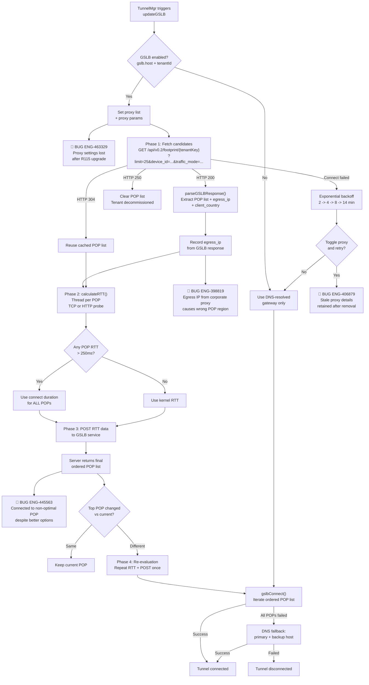
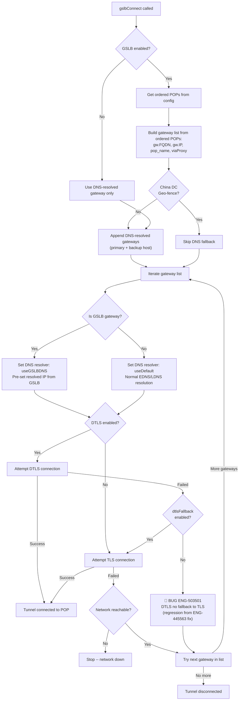
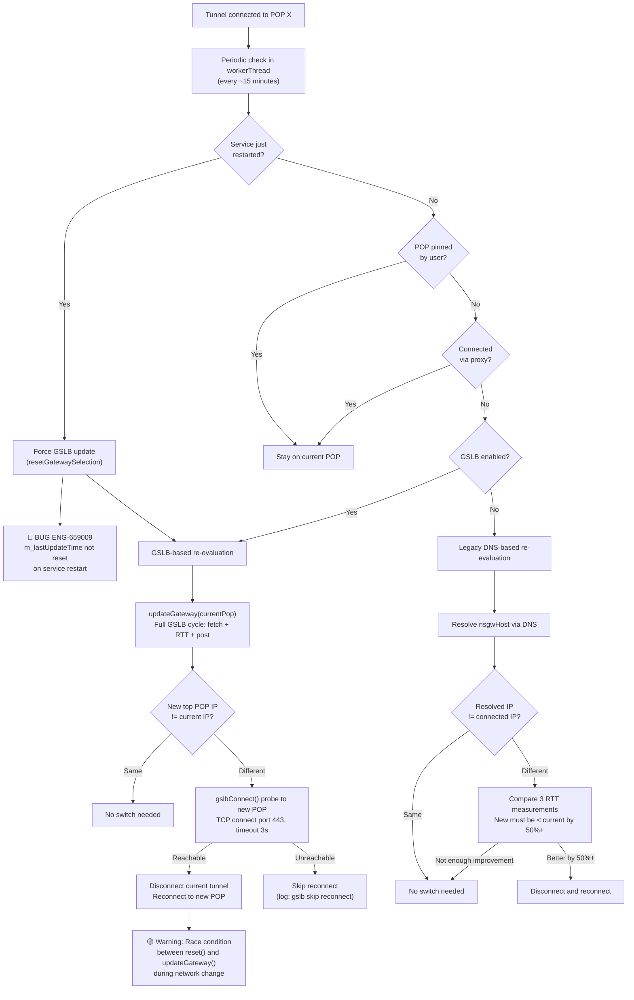
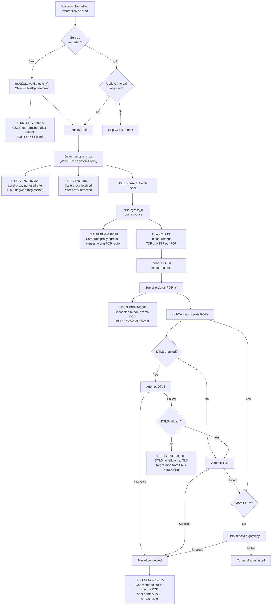
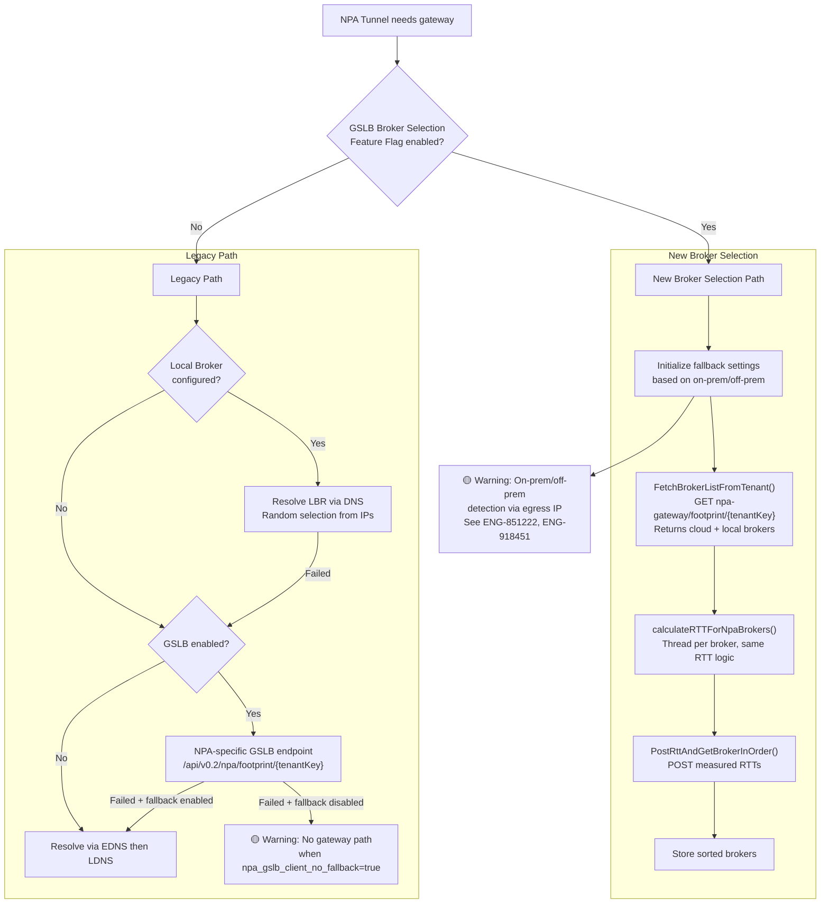
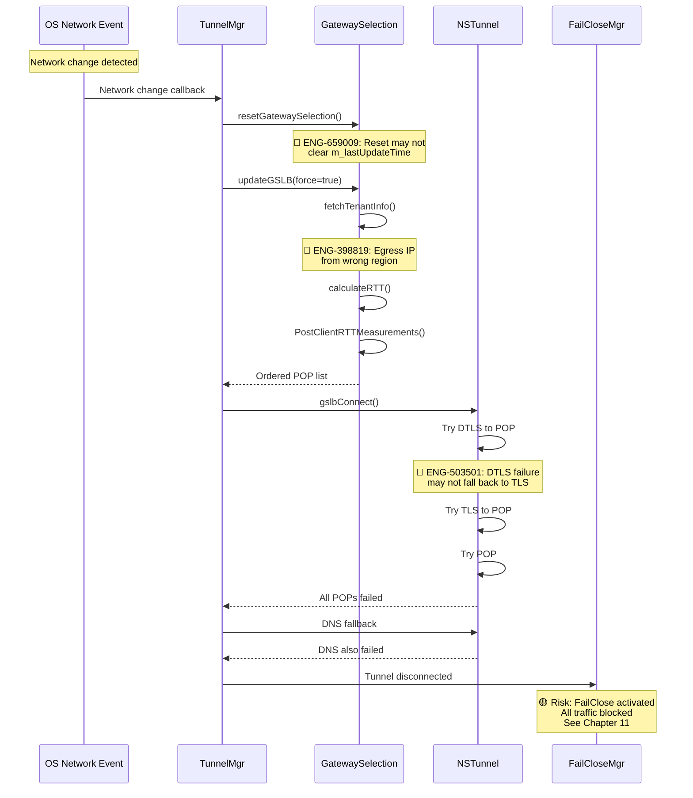
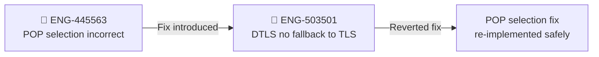

# 08. Gateway Selection (GSLB)

**Escalation Bug Count**: 9 | **Regression**: 4 (44%) | **Day-1**: 4 (44%) | **Test Gap**: 5 (56%)

📋 **[Test Cases — Google Sheet](https://docs.google.com/spreadsheets/d/1ackCZ-EcepXw1BkSGoi5Go9Ex1I72-fXqcqLGMGiuio/edit?gid=1966867652#gid=1966867652)**

> This chapter covers how NSClient selects the optimal Netskope gateway (POP) using Global Server Load Balancing. The GSLB subsystem is the critical path between config download and tunnel establishment -- a wrong POP selection directly impacts user-perceived latency, while a stale POP list can cause connection failures. Nine escalation bugs span POP selection, proxy integration, DTLS fallback, GSLB refresh, and on-prem detection via egress IP.

---

## Overview

NSClient must connect to a Netskope Point of Presence (POP) to steer traffic. With 70+ POPs worldwide, selecting the *right* one matters: a user in Tokyo connecting to a US-East POP adds 150+ ms of unnecessary latency to every request. GSLB solves this by combining server-side geo-intelligence with client-side RTT measurements to produce an ordered POP list ranked by actual network proximity.

The highest-risk area in gateway selection is the **POP selection logic under adverse conditions** (S2): when egress IP mismatches, proxy settings are lost during upgrades, or GSLB state is not refreshed after reboot, users connect to suboptimal or wrong POPs. Four of nine bugs are regressions (44%), and the regression chain from ENG-445563 (wrong POP fix) to ENG-503501 (DTLS fallback broken) demonstrates how GSLB changes can cascade into tunnel protocol failures.

**Design Decision: Two-Phase Selection with Server Authority**

The client does NOT autonomously pick a POP. Instead, it follows a two-phase protocol:
1. **Phase 1 (Fetch)**: Client asks the GSLB service for candidate POPs. The server uses the client's egress IP to pre-sort by geographic distance.
2. **Phase 2 (Measure + Post)**: Client measures RTT to each candidate, posts measurements back, and the server returns the *final* ordered list factoring in both RTT and server-side load/health data.

This design gives the server ultimate control over POP assignment (for capacity planning, maintenance windows, geo-fencing) while still optimizing for client-perceived latency.

**Design Decision: Separate GSLB Paths for SWG and NPA**

SWG (Secure Web Gateway) tunnels and NPA (Private Access) tunnels use different GSLB endpoints and selection logic. NPA adds a broker selection layer with cloud brokers, local brokers (LBR), and on-prem/off-prem awareness. This separation exists because NPA has fundamentally different topology requirements -- a private app may only be reachable through a specific local broker.

---

## SWG Gateway Selection Flow (All Platforms)

The SWG GSLB flow is the primary gateway selection path used by all platforms. It runs on tunnel manager initialization and refreshes every 14 minutes. This flow contains the majority of confirmed escalation bugs: wrong POP selection due to egress IP mismatch (ENG-398819), stale GSLB state after reboot (ENG-659009), and proxy settings lost during upgrade (ENG-463329). The flow below shows where each bug strikes.

### Node Risk Assessment

| Node | Risk | Assessment |
|---|---|---|
| TunnelMgr triggers updateGSLB | 🟡 Medium | **ENG-659009**: After reboot, `m_lastUpdateTime` not reset -- GSLB update skipped |
| GSLB enabled check | 🟢 Low | Simple config key check |
| Set proxy list + params | 🔴 High | **ENG-463329**: Proxy settings lost after R115 upgrade; **ENG-406879**: Stale proxy retained after removal |
| Phase 1: Fetch candidates | 🟡 Medium | Network-dependent; backoff logic handles transient failures |
| parseGSLBResponse + egress_ip | 🔴 High | **ENG-398819**: Corporate proxy egress IP causes wrong geo-region POP list |
| Phase 2: calculateRTT() | 🟡 Medium | Anomaly threshold at 250ms can force less accurate measurements for all POPs |
| Phase 3: POST RTT data | 🟢 Low | Server-side processing; client just posts data |
| Server-ordered POP list | 🔴 High | **ENG-445563**: Server returns non-optimal ordering; stickiness evaluation may prevent switch |
| Phase 4: Re-evaluation | 🟡 Medium | Single re-evaluation iteration; could be insufficient if conditions change rapidly |
| gslbConnect() iteration | 🟡 Medium | POP list exhaustion falls back to DNS -- China geo-fence blocks DNS fallback |
| DNS fallback | 🟡 Medium | Predicted risk: geo-fence + DNS failure = no connectivity path |

---

## Tunnel Connection with GSLB POPs (All Platforms)

When the tunnel is ready to connect, `NSTunnel::gslbConnect()` builds a gateway list from the GSLB-ordered POPs and falls back to DNS-resolved gateways. The DTLS-to-TLS fallback path is where ENG-503501 struck -- a fix for ENG-445563 inadvertently broke the fallback logic.

### Node Risk Assessment

| Node | Risk | Assessment |
|---|---|---|
| Get ordered POPs from config | 🟡 Medium | Returns empty list if GSLB fetch failed |
| Build gateway list | 🟢 Low | Deterministic list construction |
| China DC Geo-fence check | 🟡 Medium | Blocks DNS fallback entirely for China tenants |
| Iterate gateway list | 🟢 Low | Simple loop |
| GSLB resolver (useGSLBDNS) | 🟢 Low | Bypasses DNS resolution entirely -- uses IP from GSLB |
| Attempt DTLS connection | 🟡 Medium | DTLS handshake can fail silently in restrictive networks |
| DTLS fallback to TLS | 🔴 High | **ENG-503501**: Regression from POP selection fix broke TLS fallback path |
| Network reachable check | 🟡 Medium | `isNetworkReachable()` probes nearest successful endpoint; false negative possible |
| DNS fallback | 🟡 Medium | Last resort; blocked by China geo-fence |

---

## Periodic RTT Re-evaluation and POP Switching (All Platforms)

Once a tunnel is connected, the tunnel manager periodically checks whether the client should switch to a better POP. The GSLB refresh after reboot is where ENG-659009 manifested -- the `m_lastUpdateTime` was not reset on service restart, causing the interval check to skip the update even when the network environment had changed.

---

## Windows

**Bug Count**: 7 direct | **Key Gaps**: GSLB refresh after reboot, proxy integration, POP selection accuracy, DTLS fallback

Windows accounts for the majority of GSLB escalation bugs. The most dangerous failure pattern is the regression chain where fixing POP selection (ENG-445563) broke DTLS-to-TLS fallback (ENG-503501). Windows is also the only platform where proxy integration issues have been reported (ENG-463329, ENG-406879).

### Windows GSLB + Tunnel Connection Flow

This flow shows the complete Windows-specific path from GSLB initialization through tunnel establishment, annotated with all confirmed bugs on Windows.

## macOS

**Bug Count**: 0 direct (shared code path with Windows for GSLB core) | **Key Gaps**: Same GSLB logic as Windows but no macOS-specific escalation bugs yet

macOS shares the same `GatewaySelection` C++ code as Windows for GSLB core logic. The captive portal grace period issue (ENG-548975, categorized under FailClose) has a GSLB timing dependency on macOS -- the original code reset captive portal status after tunnel worker thread start, but GSLB checking introduces a 20-second delay.

## Linux

*No GSLB-specific escalation bugs on Linux.* Linux uses the same `GatewaySelection` code path. The egress IP on-prem detection issue (ENG-851222) noted that Linux also had an Egress IP feature issue tracked by a separate ticket.

## Android

**Bug Count**: 1 direct (ENG-846458) | **Key Gaps**: UI gateway display, socket protection for GSLB

Android has a unique requirement: `setsockprotect()` must be called on GSLB sockets to prevent routing loops through the VPN tunnel. Additionally, Android monitors `isEgressIPUpdated()` in the tunnel worker thread and triggers `handleOnPremStatusChange()` on egress IP change. The on-prem detection regression (ENG-918451) was an Android fix that broke Windows behavior.

### Android-Specific Behavior

- **Socket protection**: `setsockprotect()` required on GSLB sockets
- **Egress IP monitoring**: Explicit `isEgressIPUpdated()` check triggers on-prem re-evaluation
- **API version fallback**: May use v0.1 API with orgKey when tenant ID is unavailable
- **UI gateway display**: ENG-846458 -- shows tenant hostname instead of POP name

## iOS

*No GSLB-specific escalation bugs on iOS.* iOS may use API v0.1 with orgKey fallback for older clients.

## ChromeOS

*No GSLB-specific escalation bugs on ChromeOS.* ChromeOS uses the Android GSLB code path.

---

## Backend

*No backend-specific GSLB escalation bugs.* However, the GSLB service is the authoritative component for POP ordering, and server-side issues (load balancing overrides, geo-database mismatches) can cause wrong POP selection even when the client logic is correct.

---

## NPA Gateway Selection (All Platforms)

NPA uses a more complex selection system with three types of brokers: cloud, local public, and local private. The NPA broker selection path adds on-prem/off-prem awareness that interacts with the egress IP detection bugs (ENG-851222, ENG-918451).

### NPA Broker Types

| Type | Key | Description |
|------|-----|-------------|
| Cloud Broker | `"cloud"` | Standard Netskope POP acting as NPA gateway |
| Local Broker (Public) | `"local_public"` | On-premises broker reachable via public network |
| Local Broker (Private) | `"local_private"` | On-premises broker reachable only via private network |

## Automation Coverage Summary

| Test Area | Coverage | Notes |
|-----------|----------|-------|
| Basic GSLB POP selection | ❌ Not covered | No automated verification that nearest POP is selected |
| GSLB refresh after reboot | ❌ Not covered | ENG-659009: Deepthi added cases to TestRail but automation status unclear |
| GSLB with proxy | ⚠️ Partial | Existing GSLB+proxy test case exists per Deepthi; ENG-463329 gap unclear |
| DTLS-to-TLS fallback | ❌ Not covered | ENG-503501 regression chain not automated |
| POP pinning lifecycle | ✅ Covered | GRS `nplan-5878-pop_pinning/test_pop_pinning.py` covers pin/unpin lifecycle |
| Wrong POP (egress IP) | ❌ Not covered | ENG-398819: Deepthi notes negative cases exist in TestRail |
| Out-of-country POP fallback | ❌ Not covered | ENG-614375: Block POP + verify next closest |
| GSLB backoff timer | ❌ Not covered | |
| China DC geo-fence | ❌ Not covered | |
| NPA broker selection | ❌ Not covered | |
| On-prem egress IP detection | ⚠️ Partial | `nplan_5628_onpremises_profiles` tests transitions but not tunnel reconnect |

---

## Cross-Flow Interactions

### GSLB + Tunnel Establishment + FailClose

The most dangerous cross-flow interaction in gateway selection is the cascade from GSLB failure through tunnel establishment to FailClose activation. When GSLB fails and the client cannot connect to any POP or DNS gateway, FailClose may activate and block all traffic. The GSLB timing also affects captive portal detection (ENG-548975).

### Regression Chain: POP Selection Fix Breaks DTLS Fallback

This is a documented regression chain from the escalation bug analysis. The fix for ENG-445563 (wrong POP) introduced ENG-503501 (DTLS no fallback to TLS). This chain demonstrates why GSLB changes must include DTLS fallback regression tests.

### Cross-Flow Risk Matrix (Chapter-Relevant)

| Cross-Flow | Risk Level | Confirmed Bugs | Chapters |
|---|---|---|---|
| GSLB failure + FailClose | High | ENG-659009 (GSLB stale) + FailClose activation | [07](07_tunnel_management.md), [11](11_failclose.md) |
| POP selection fix + DTLS fallback | High | ENG-445563 -> ENG-503501 regression chain | [07](07_tunnel_management.md) |
| GSLB + Proxy detection | Medium | ENG-463329, ENG-406879 | [14](14_proxy_management.md) |
| Egress IP + On-prem detection | Medium | ENG-851222, ENG-918451 | [12](12_device_classification.md) |
| GSLB timing + Captive portal | Medium | ENG-548975 (GSLB 20s delay) | [11](11_failclose.md) |
| NPA broker + On-prem status | Low | No confirmed bugs yet | [15](15_npa_integration.md) |

## Appendix A: Bug Quick Reference

| Bug ID | Summary | Platform | Root Cause | Severity |
|--------|---------|----------|------------|----------|
| ENG-398819 | GSLB selects wrong POP (DEI wrongly used for ATL2) | Windows | Corporate proxy egress IP causes wrong geo-region | S2 |
| ENG-406879 | NSClient retains proxy details after proxy removed | Windows | Day-1: proxy settings not synced after clearing | S3 |
| ENG-445563 | Connected to non-optimal POP (BUE1) causing poor performance | Windows | GSLB POP selection logic does not handle all cases | S2 |
| ENG-463329 | Client not using local proxy after R115 upgrade | Windows | Regression: proxy settings lost during upgrade | S2 |
| ENG-503501 | DTLS tunnel not failing over to TLS | Windows | Regression from ENG-445563 fix broke TLS fallback | S1 |
| ENG-614375 | Client connecting to out-of-country POP | Windows | When primary POP unreachable, fallback selects random POP instead of next closest | S2 |
| ENG-659009 | GSLB not refreshed after reboot | Windows | Day-1: m_lastUpdateTime not reset on service restart | S2 |
| ENG-846458 | Android Client UI Gateway field not matching other OSes | Android | Day-1: displays tenant hostname instead of POP name | S3 |
| ENG-548975 | Captive portal grace period not working (GSLB timing) | Win/Mac | Day-1: captive portal status reset before GSLB completes (20s delay) | S2 |

**Related bugs from other categories that affect GSLB flows:**

| Bug ID | Summary | Platform | Primary Category | GSLB Impact |
|--------|---------|----------|-----------------|-------------|
| ENG-851222 | On-prem detection using Egress IP does not work | Windows | On-prem Detection | Egress IP from GSLB used for on-prem detection |
| ENG-918451 | Internet Steering not honoring on-prem detection (egressIP) | Windows | On-prem Detection | Android fix caused Windows regression in tunnel reconnect after on-prem switch |

---

## Appendix B: Methodology

### Severity Ratings

| Rating | Definition |
|--------|------------|
| S1 | Complete connectivity loss or security bypass affecting all users |
| S2 | Significant degradation (wrong POP = high latency) or partial functionality loss |
| S3 | Minor inconvenience or cosmetic issue; workaround available |

### Automation Priority

| Priority | Definition |
|----------|------------|
| P1 | Must automate immediately -- regression risk is high and bug has recurred |
| P2 | Should automate in next sprint -- important coverage gap |
| P3 | Nice to have -- low regression probability or hard to automate |

### Gap Type Taxonomy

| Type | Definition |
|------|------------|
| Regression | Bug introduced by a code change that broke previously working functionality |
| Day-1 | Bug present since feature was first implemented |
| Test Gap | Scenario that was never tested (no test case existed) |
| Corner Case | Unusual environment or configuration that is hard to reproduce |

### Code References

| Component | File |
|-----------|------|
| GatewaySelection core | `lib/nsConfig/GatewaySelection.h/.cpp` |
| NPA cloud POP selection | `lib/npa_core/npaGslbGatewaySelection.h/.cpp` |
| NPA broker selection | `lib/npa_core/npaGslbGatewaySelection.h/.cpp` |
| NPA gateway resolution | `lib/npa_core/npaGWSelection.h/.cpp` |
| Config GSLB wrapper | `lib/nsConfig/config.cpp::updateGSLB()` |
| Tunnel GSLB connect | `lib/nsTunnel/tunnel.cpp::gslbConnect()` |
| Tunnel manager GSLB trigger | `stAgent/stAgentSvc/tunnelMgr.cpp::workerThread()` |
| DNS resolver | `lib/nsUtils/nsDnsResolver.h` |

---

**Related Chapters**: [07. Tunnel Management](07_tunnel_management.md) | [04. Config Download](04_config_download.md) | [05. Steering Config](05_steering_config.md) | [11. FailClose](11_failclose.md) | [14. Proxy Management](14_proxy_management.md) | [15. NPA Integration](15_npa_integration.md) | [12. Device Classification](12_device_classification.md)
