# 09. Traffic Interception & Packet Processing

**Escalation Bug Count**: 91 | **Day-1**: 23 (25%) | **Corner Case**: 18 (20%) | **Regression**: 9 (10%) | **Test Gap**: 9 (10%) | **Enhancement**: 8 (9%)

📋 **[Test Cases — Google Sheet](https://docs.google.com/spreadsheets/d/1ackCZ-EcepXw1BkSGoi5Go9Ex1I72-fXqcqLGMGiuio/edit?gid=741472198#gid=741472198)**

> This chapter covers how NSClient intercepts network traffic at the OS level and processes packets through the steering pipeline. It documents the platform-specific driver/extension architectures (WFP on Windows, Network Extension on macOS/iOS, TUN/VIF on Linux/Android), the unified FilterDevice abstraction layer, DNS interception, packet classification, and the data path from application to tunnel. Each flow is illustrated with mermaid diagrams annotated with known escalation bug failure points (🔴 red) and predicted risk points (🟡 yellow).

---

## Overview

NSClient must intercept outbound network packets **before they leave the device** and route matching traffic through the Netskope tunnel. This requires operating at a privileged OS layer — kernel drivers on Windows, system extensions on macOS, and virtual network interfaces on Linux — because ordinary user-space applications cannot transparently redirect another application's traffic.

The core challenge is threefold:

1. **Intercept**: Capture packets from all applications without requiring per-app configuration
2. **Classify**: Decide in real time whether each packet should be steered (sent through the Netskope tunnel), bypassed (sent directly to the internet), or blocked
3. **Redirect**: Rewrite packet routing so steered traffic enters the tunnel transparently

Each platform solves this differently, but the user-space service (`stAgentSvc`) sees a unified interface through the `nsFilterDevice` abstraction layer. This layer communicates with the platform-specific "shim" (`C_KernelUserShim`) which translates generic IOCTL-style commands into platform-native operations.

**Design Decision: Kernel vs User Space**

The driver/extension operates at a privileged OS layer rather than relying solely on proxy settings because:
- Proxy-based interception only works for HTTP/HTTPS and requires per-application proxy awareness
- DNS-level redirection cannot handle IP-based steering rules
- Firewall (CFW) mode requires intercepting all TCP/UDP traffic, not just web protocols
- NPA (Private Access) needs to intercept traffic to specific private IP ranges transparently

---

## Architecture

### Layered Architecture

The traffic interception system is organized in three layers. The top layer is the service logic (`stAgentSvc`) that decides **what** to intercept based on steering configuration. The middle layer is the `nsFilterDevice` abstraction that provides a platform-neutral API. The bottom layer is the platform-specific shim and driver/extension that performs the actual packet capture.

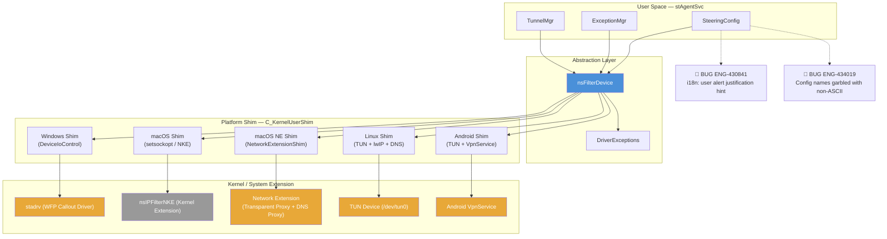

**Note**: The macOS NKE (Kernel Extension) path is legacy and deprecated by Apple. Modern macOS (10.15+) uses the Network Extension framework. Both paths coexist in the codebase.

### The nsFilterDevice Class

`nsFilterDevice` is the central abstraction. It is instantiated by the service and exposes methods for:

- **Lifecycle**: `initializeFilterDevice()`, `deInitFilterDevice()`, `startTunnelDevice()`, `stopTunnelDevice()`
- **NPA**: `startNPADevice()`, `stopNPADevice()`, `enableNPAFilter()`, `disableNPAFilter()`
- **Configuration**: `setDomainList()`, `setPortList()`, `setFwRules()`, `setNSExceptions()`, `setFeatureFlags()`
- **Tunnel info**: `setTunnelSrcAddr()`, `setTunnelDstAddr()`, `updateTunnelInfo()`
- **Mode control**: `setWebAndFirewallMode()`, `setSteerDNS()`, `setNpaMode()`
- **Packet I/O**: `injectPacket()`, `setListener()` (registers `IPacketSink` callback)
- **Diagnostics**: `dumpDeviceConfig()`, `dumpPacketStats()`, `dumpDomainIPList()`

A reference count (`m_usageRefCount`) allows the NSGW tunnel and NPA tunnel to share the same FilterDevice instance. The maximum concurrent users is 2 (`MAX_FILTER_DEV_USERS`).

### Steering Modes

The FilterDevice operates in three mutually exclusive steering modes that determine **which traffic** gets intercepted:

| Mode | Flag | Traffic Intercepted | Ports |
|------|------|---------------------|-------|
| **CASB (Domain)** | Neither `webMode` nor `firewallMode` | Only traffic to configured domains | 80, 443 (default) |
| **Web (SWG)** | `webMode = true` | All HTTP/HTTPS traffic | 80, 443 + custom |
| **Firewall (CFW)** | `firewallMode = true` | All TCP and UDP traffic | All ports |

When `firewallMode` is enabled, `webMode` is implicitly set to `true` as well — firewall mode is a superset of web mode. In CASB mode, the driver maintains a domain list and only intercepts traffic destined to those domains. In web/firewall mode, the domain list is not pushed to the driver (all traffic is intercepted by port or protocol).

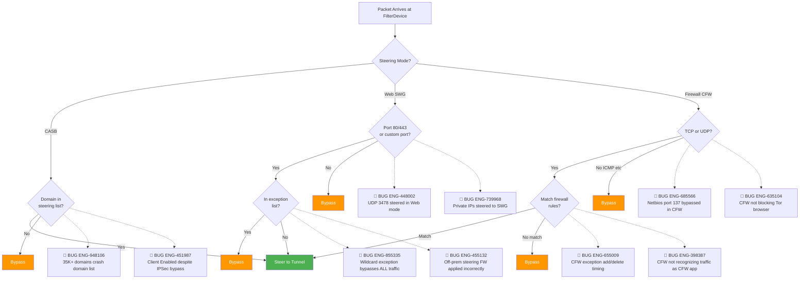

### Steering Mode Node Risk Assessment

| Node | Risk | Assessment |
|---|---|---|
| Steering Mode Decision | 🔴 High | **ENG-448002** — UDP 3478 incorrectly steered in Web mode (port list logic); **ENG-451987** — Client status shows Enabled despite IPSec bypass mode |
| CASB Domain Check | 🔴 High | **ENG-948106** — 35K+ domains with long names causes crash; **ENG-872456** — 30K+ domains crash on ChromeOS |
| CFW Protocol Check | 🔴 High | **ENG-685566** — Netbios (port 137) bypassed in CFW mode; **ENG-635104** — CFW not blocking Tor browser traffic |
| Exception Check | 🔴 High | **ENG-855335** — Wildcard exception (::/0 or 0.0.0.0/0) bypasses all SWG traffic; **ENG-455132** — Off-prem steering FW exception applied incorrectly on-prem |
| CFW Firewall Rules | 🔴 High | **ENG-655009** — FW exception add/delete timing issue; **ENG-398387** — CFW no longer recognizing traffic as belonging to CFW app |
| Port Check (Web) | 🔴 High | **ENG-739968** — Private IPs steered to SWG due to nsexception.json race condition |
| Port Check (Web) | 🟡 Medium | Predicted: mode transition race between disableFilter/enableFilter |

---

## Startup Sequence

When the tunnel is established, the service starts the FilterDevice with a specific sequence of configuration pushes. Every configuration item is sent to the driver/extension via `SetDeviceOption()` IOCTL calls. The order matters — `setConfigDone()` must be the last call to signal that the driver can begin processing packets.

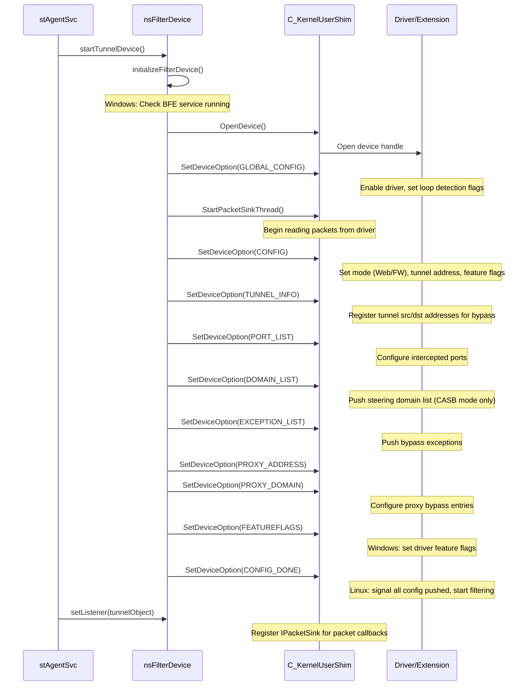

The `startTunnelDevice()` pipeline is a sequential chain where failure at any step aborts the entire startup:

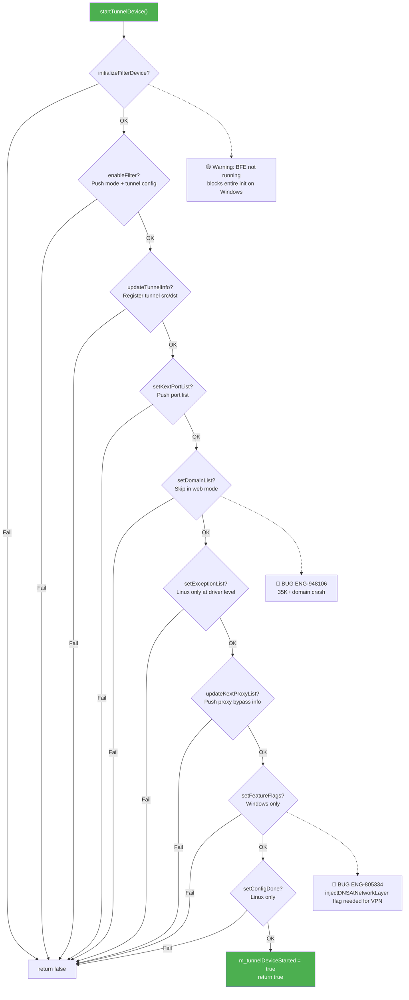

---

## IOCTL Interface

All communication between user space and the driver/extension uses a numbered IOCTL function code. The shim translates these into platform-specific calls (DeviceIoControl on Windows, setsockopt on macOS NKE, direct API calls on Linux/Android).

### IOCTL Function Codes

| Code | Name | Direction | Description |
|------|------|-----------|-------------|
| `0x800` | `FUNC_STADRV_CONFIG` | Set/Get | Enable/disable filter, set mode (Web/FW), tunnel address |
| `0x801` | `FUNC_STADRV_DOMAIN_LIST` | Set/Get | Push steering domain list |
| `0x802` | `FUNC_STADRV_IPADDR_LIST` | Set | Push steering IP address list |
| `0x803` | `FUNC_STADRV_INJECT_PKT` | Set | Inject packet back to network stack |
| `0x804` | `FUNC_STADRV_STATS` | Get | Retrieve packet statistics |
| `0x807` | `FUNC_STADRV_PORT_LIST` | Set/Get | Push intercepted port list |
| `0x808` | `FUNC_STADRV_TUNNEL_INFO` | Set/Get | Register tunnel endpoints for bypass |
| `0x809` | `FUNC_STADRV_PROXY_ADDRESS` | Set | Push proxy IP:port bypass list |
| `0x80A` | `FUNC_STADRV_PROXY_DOMAIN` | Set | Push proxy domain bypass list |
| `0x80B` | `FUNC_STADRV_DOMAINIP_LIST` | Get | Dump domain-to-IP mapping table |
| `0x80C` | `FUNC_STADRV_NPA_APP` | Set | Push NPA subnet list |
| `0x80D` | `FUNC_STADRV_NPA_DOMAIN_LIST` | Set | Push NPA domain list |
| `0x80F` | `FUNC_STADRV_NPA_CONFIG` | Set | Enable/disable NPA filter |
| `0x810` | `FUNC_STADRV_GLOBAL_CONFIG` | Set | Enable/disable driver globally, loop detection |
| `0x812` | `FUNC_STADRV_FEATUREFLAGS` | Set | Push feature flags bitmap (Windows only) |
| `0x813` | `FUNC_STADRV_FIREWALL_LIST` | Set | Push CFW firewall rules |
| `0x814` | `FUNC_STADRV_IPDOMAINEXCEPTION_LIST` | Set | Push IP/domain exception rules |
| `0x815` | `FUNC_STADRV_NPA_IPRULE` | Set | Push NPA IP rules with port ranges |
| `0x817` | `FUNC_STADRV_CONFIG_DONE` | Set | Signal all config pushed (Linux) |
| `0x819` | `FUNC_STADRV_DNSPORTS_LIST` | Set | Push custom DNS port rules |
| `0x81A` | `FUNC_STADRV_PURGEUDPMAP` | Set | Purge UDP flow cache |
| `0x81C` | `FUNC_STADRV_DNS_SUFFIX` | Set | Push NPA DNS suffix list (Windows) |

### Feature Flags Bitmap (Windows)

The `FUNC_STADRV_FEATUREFLAGS` IOCTL pushes a bitmask to the Windows driver:

| Bit | Name | Description |
|-----|------|-------------|
| `0x001` | `HANDLEEXCEPTION_AT_DRIVER` | Handle IP/domain exceptions at driver level |
| `0x002` | `SELFPROTECTION_AT_DRIVER` | Enable driver self-protection |
| `0x004` | `DNS_SECURITY_FLAG` | Enable DNS security (steer DNS traffic) |
| `0x008` | `BYPASS_INFINITE_LOOPCHECK_FLAG` | Bypass infinite loop detection |
| `0x010` | `BLOCK_DNS_TCP_FLAG` | Block DNS-over-TCP |
| `0x020` | `BYPASS_AT_CLOUD` | Bypass decision made at cloud, not driver |
| `0x040` | `BLOCK_IPv6_FLAG` | Block all IPv6 traffic |
| `0x080` | `INJECT_DNS_AT_NETWORKLAYER_FLAG` | Inject DNS at L3 instead of L4 |
| `0x100` | `HANDLEEXCEPTION_AT_DRIVERV2` | V2 exception handling at driver |
| `0x200` | `ALLOW_PROCESS_RD_PERMISSION` | Allow process read permission info |
| `0x400` | `INJECT_DNS_AT_L3_TO_RX_FLAG` | Inject DNS at L3 to RX path |

---

## Windows: WFP Callout Driver (stadrv)

### Overview

On Windows, traffic interception is performed by `stadrv`, a WFP (Windows Filtering Platform) callout driver. WFP is Microsoft's framework for network packet filtering. The driver registers callout functions at specific WFP layers that are invoked by the Windows networking stack for every matching packet.

The driver requires the **Base Filtering Engine (BFE)** service to be running. Before initializing, the user-space service checks this (`m_bfeStatusCheck`). If BFE is not running, the FilterDevice initialization fails.

### WFP Callout Registration

The driver registers callouts at multiple WFP layers to inspect traffic in both directions:

```mermaid
graph TB
    subgraph "WFP Layers (Windows Networking Stack)"
        ALE_CONNECT["ALE Connect Redirect<br/>(FWPM_LAYER_ALE_CONNECT_REDIRECT)"]
        ALE_AUTH["ALE Auth Connect<br/>(FWPM_LAYER_ALE_AUTH_CONNECT)"]
        ALE_RECV["ALE Recv Auth<br/>(FWPM_LAYER_ALE_AUTH_RECV_ACCEPT)"]
        TX_TCP["Outbound Transport<br/>(FWPM_LAYER_OUTBOUND_TRANSPORT)"]
        RX_TCP["Inbound Transport<br/>(FWPM_LAYER_INBOUND_TRANSPORT)"]
        TX_DNS["Outbound DNS<br/>(FWPM_LAYER_OUTBOUND_TRANSPORT)"]
        RX_DNS["Inbound DNS<br/>(FWPM_LAYER_INBOUND_TRANSPORT)"]
    end

    subgraph "stadrv Callouts"
        REDIR["InspectConnectRedirectCallout"]
        ALE_CLS["InspectAleConnectClassify"]
        ALE_RECV_CLS["InspectAleRecvAuthClassify"]
        TX_CLS["InspectTxTcpClassify"]
        RX_CLS["InspectRxTcpClassify"]
        TX_DNS_CLS["InspectTxDnsClassify"]
        RX_DNS_CLS["InspectRxDnsClassify"]
    end

    ALE_CONNECT --> REDIR
    ALE_AUTH --> ALE_CLS
    ALE_RECV --> ALE_RECV_CLS
    TX_TCP --> TX_CLS
    RX_TCP --> RX_CLS
    TX_DNS --> TX_DNS_CLS
    RX_DNS --> RX_DNS_CLS

    style ALE_CONNECT fill:#4A90D9,color:#fff
    style TX_TCP fill:#4A90D9,color:#fff
    style RX_DNS fill:#4A90D9,color:#fff
```

**Key WFP structures maintained by the driver** (from `STADRV_WFP_INFO`):
- **Injection handles**: `InjectionHandleTransport`, `InjectionHandleIPv4`, `InjectionHandleIPv6` — used to re-inject packets after processing
- **Callout IDs**: Separate IDs for IPv4 and IPv6 at each layer (registered + added)
- **DNS filter IDs**: Separate filters for TCP and UDP DNS (port 53)

### Packet Flow Through WFP

When an application sends a TCP connection or UDP packet, the Windows networking stack invokes the registered callouts. The driver classifies each packet and decides the action.

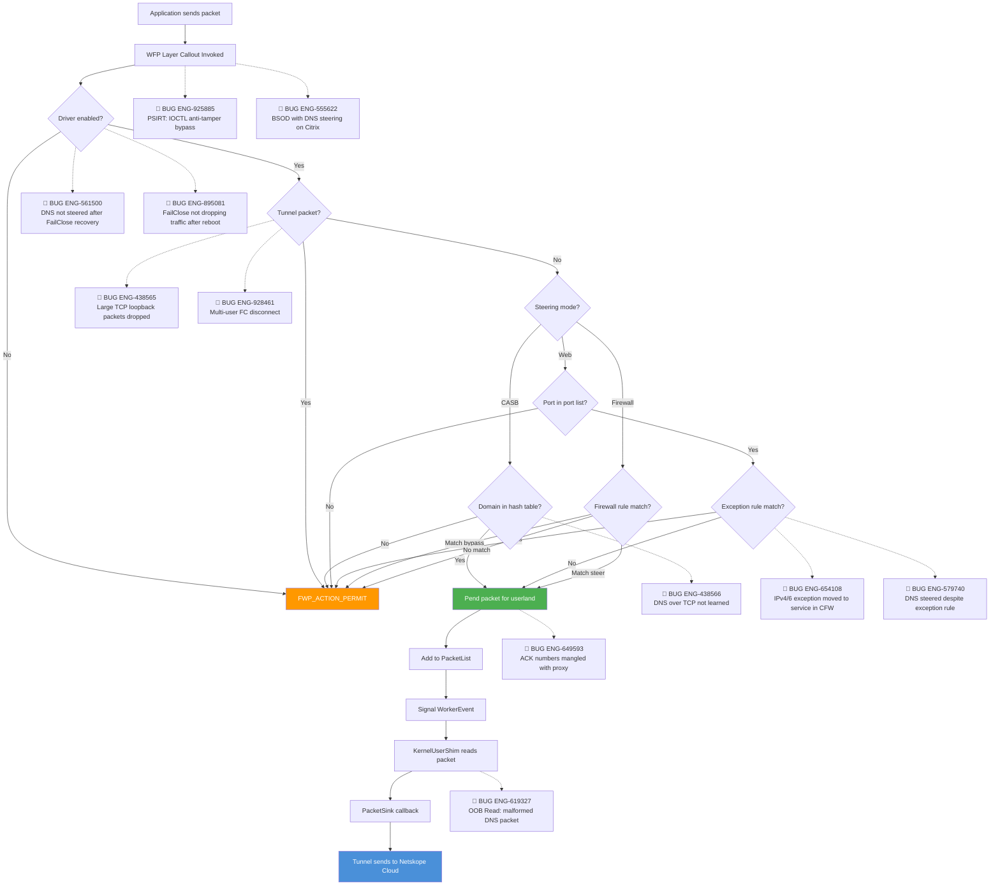

### WFP Packet Flow Node Risk Assessment

| Node | Risk | Assessment |
|---|---|---|
| WFP Layer Callout | 🔴 Critical | **ENG-925885**, **ENG-925887** — PSIRT: IOCTL anti-tamper bypass in stadrv; **ENG-555622** — BSOD with DNS steering on Citrix servers |
| Tunnel Check | 🔴 High | **ENG-438565** — Large TCP segmented packets from loopback dropped; **ENG-928461** — Multi-user FailClose disconnect |
| Domain Lookup (CASB) | 🔴 High | **ENG-438566** — DNS over TCP not learned into domain-to-IP table |
| Pend Packet | 🔴 High | **ENG-649593** — ACK numbers mangled with local proxy + cert-pin bypass |
| Exception Check | 🔴 High | **ENG-654108** — IPv4/IPv6 exception handling moved from driver to service in CFW; **ENG-579740** — DNS traffic steered despite exception rule |
| Driver Enabled Check | 🔴 High | **ENG-561500** — DNS not steered after FailClose recovery; **ENG-895081** — FailClose not dropping traffic after reboot |
| Shim Read | 🔴 High | **ENG-619327** — Out-of-Bounds Read from malformed DNS packet |
| Packet Sink | 🟡 Medium | Predicted: queue overflow under high traffic burst |

### Pended Packet Structure

When the driver decides to steer a packet, it creates a `STADRV_PENDED_PACKET` structure that captures all metadata needed for later processing:

```cpp
typedef struct _STADRV_PENDED_PACKET {
    LIST_ENTRY          ListEntry;
    UINT32              Timestamp;
    ADDRESS_FAMILY      AddressFamily;      // AF_INET or AF_INET6
    STADRV_PACKET_TYPE  PacketType;         // CONNECT, REAUTH, TCP, DNS, PQDN
    FWP_DIRECTION       Direction;          // Inbound or Outbound
    PNET_BUFFER_LIST    pNetBufferList;     // Original NBL from WFP
    PNET_BUFFER_LIST    pClonedNetBufferList; // Cloned NBL for injection
    // ... address info, flow handle, endpoint handle, etc.
    BOOLEAN             NpaPacket;          // NPA traffic flag
    BOOLEAN             Block;              // Block flag (FailClose)
    // ... PQDN data for DNS suffix matching
} STADRV_PENDED_PACKET;
```

### DNS Processing in the WFP Driver

The Windows driver intercepts DNS at the WFP layer to build a domain-to-IP mapping table (`DomainIP_List`). This table is critical for CASB mode — when a subsequent TCP SYN arrives, the driver looks up the destination IP in this table to find the matching domain name. If the domain is in the steering list, the packet is pended for the tunnel.

DNS interception is handled by dedicated callouts:
- **RxDnsClassify**: Captures inbound DNS responses (UDP/TCP port 53), parses the DNS answer section, and populates the domain-to-IP hash table
- **TxDnsClassify**: Optionally captures outbound DNS queries for DNS Security mode

The driver can also **block DNS-over-TCP** (`BLOCK_DNS_TCP_FLAG`) to force applications to use UDP DNS, which is easier to intercept.

### Flow Context Management

The WFP driver associates a `STADRV_FLOW_CONTEXT` with each TCP flow. This allows the driver to track per-connection state (steered vs bypassed) across multiple packets without re-evaluating classification rules for every packet.

```cpp
typedef struct _STADRV_FLOW_CONTEXT {
    LIST_ENTRY ListEntry;
    UINT64 flowHandle;     // WFP flow handle
    UINT16 layerId;        // WFP layer ID
    UINT32 calloutId;      // Which callout
    UINT8 state;           // Flow state (steer/bypass)
    LONG refCount;         // Reference count for safe cleanup
} STADRV_FLOW_CONTEXT;
```

### Packet Loop Detection

A unique Windows challenge is **infinite packet loops** caused by other network drivers (e.g., WinDivert used by BWAN/SD-WAN). When both NSClient's WFP driver and another driver intercept the same packet, a loop can form. The driver detects this via the `InfiniteLoopDriverFound` flag in the global config:

```cpp
// During global config setup
staGlobalDrvConfig.InfiniteLoopDriverFound =
    isWindivertCapturingTheTraffic() || isApxNetInstalled;

// Separate DNS loop flag for BWAN coexistence
staGlobalDrvConfig.InfiniteDNSLoopDriverFound =
    dnsPacketLoopbackWinDivertDriver();
```

When loop detection is active, the driver uses additional checks to avoid re-processing packets it has already injected.

### Self-Protection

The Windows driver supports self-protection (`SELFPROTECTION_AT_DRIVER` flag) which prevents unauthorized processes from stopping or tampering with the driver. This interacts with the upgrade flow — if self-protection is enabled without the `disableWinStopServiceProtection` flag, the service cannot be stopped for upgrades (see ENG-733657 in Chapter 01).

### Driver Start/Stop

The user-space service can programmatically start and stop the WFP driver:

```cpp
bool nsFilterDevice::startSTAgentDriver() {
    nsWinServiceControl stadrvCtrl("stadrv");
    if (stadrvCtrl.IsServiceExist()) {
        if (stadrvCtrl.IsServiceRunning()) return true;
        return stadrvCtrl.Start();
    }
    return false;
}

bool nsFilterDevice::stopSTAgentDriver() {
    // Step 1: Remove stadrv dependency from stAgentSvc
    stAgentSvcCtrl.ChangeDependencies("");
    // Step 2: Stop the driver
    stadrvCtrl.Stop();
    // Step 3: Restore dependency (always, even on failure)
    stAgentSvcCtrl.ChangeDependencies("Stadrv");
}
```

The dependency management is critical — `stAgentSvc` normally depends on `stadrv`, so the dependency must be temporarily removed before the driver can be stopped independently.

---

## macOS: Network Extension

### Overview

On macOS, NSClient uses the Network Extension framework (System Extension) to intercept traffic. This replaced the legacy Kernel Extension (NKE) approach starting with macOS 10.15 Catalina. The implementation uses two extension types:

1. **Transparent Proxy** (`NETransparentProxyProvider`): Intercepts TCP/UDP flows at the application layer, providing process name and destination hostname information
2. **DNS Proxy** (`NEDNSProxyProvider`): Intercepts DNS queries before they reach the system resolver

The macOS Network Extension shim (`NetworkExtensionShim`) operates differently from Windows — instead of a kernel driver that processes raw IP packets, it works with application-layer flows. The Network Extension framework calls back into the shim with flow metadata, and the shim decides whether to steer, bypass, or block each flow.

### VIF (Virtual Interface) Mode

Modern macOS NSClient also supports a **VIF mode** where a TUN-like virtual interface (`utun`) is created, similar to the Linux approach. This is controlled by the `m_macUseVifV2` config flag. In VIF mode:

- A utun device is opened and assigned IP address `100.127.127.1`
- The Network Extension's transparent proxy redirects steered flows to this virtual interface
- Packets on the VIF are read by `nsVifReadThreadFunc()` and sent to the tunnel
- Response packets from the tunnel are written back to the VIF via `nsVifWrite()`

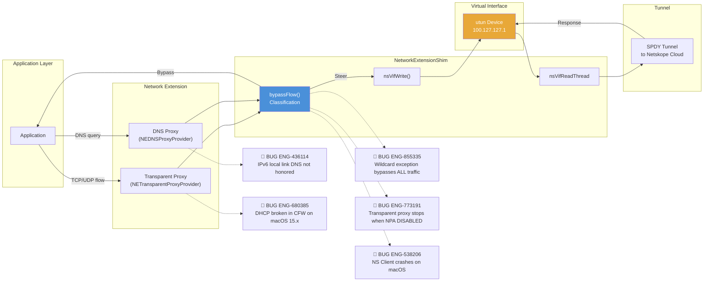

### macOS Network Extension Node Risk Assessment

| Node | Risk | Assessment |
|---|---|---|
| bypassFlow() Classification | 🔴 Critical | **ENG-855335** — Wildcard ::/0 exception bypasses all SWG traffic; **ENG-773191** — Transparent proxy stops when NPA in DISABLED state; **ENG-538206** — NS Client crashes on macOS |
| DNS Proxy | 🔴 High | **ENG-436114** — IPv6 local link DNS not honored; **ENG-918295** — NPA DNS queries go to BWAN instead |
| Transparent Proxy | 🔴 High | **ENG-680385** — DHCP broken in CFW mode on macOS 15.4+; **ENG-645301** — DHCP excluded from CFW |
| AirDrop Exception | 🔴 Medium | **ENG-538734** — Airplay mirroring broken with Crestron Airmedia (port 5353) |
| VIF utun Device | 🟡 Medium | Predicted: VIF mode toggle may leave stale routes |

### Flow Classification

When the Network Extension intercepts a new flow, it calls `NetworkExtensionShim::bypassFlow()` with an `nsFlowInfo` structure containing:

```cpp
struct nsFlowInfo {
    std::string processName;       // Source application name
    std::string destHostName;      // Destination hostname (from SNI or DNS)
    std::string destPort;          // Destination port
    sockaddr_storage destSocketAddr; // Destination IP
    sockaddr_storage srcSocketAddr;  // Source IP (dummy)
    bool tcp;                      // Protocol
    ns_uint8_t *segment;           // First TCP segment (for SNI extraction)
    ns_int32_t pid;                // Process ID
    // ... more fields
};
```

The classification logic checks:

1. **Exception list**: If the domain or IP matches an exception, bypass
2. **NPA check**: If the destination matches NPA rules, route to NPA tunnel
3. **Proxy check**: If a proxy is configured, handle proxy routing
4. **Domain match**: In CASB mode, check if domain is in the steering domain set
5. **Port match**: In Web/FW mode, check if port is in the configured port list

The return value is `PKT_ACTION_TYPE`: `CONTINUE` (steer), `BYPASS`, or `BLOCK`.

### Steering Rules

The macOS Network Extension translates the generic steering configuration into `SteeringRule` structures:

```cpp
enum class SteeringRulesEnum : unsigned int {
    STEERING_RULE_UNKNOWN,
    STEERING_RULE_HOSTNAME,       // Match by domain name
    STEERING_RULE_IPADDRESS,      // Match by IP address
    STEERING_RULE_ALL_TRAFFIC,    // Match all traffic (FW mode)
    STEERING_RULE_ALL_TCP_TRAFFIC, // Match all TCP
    STEERING_RULE_TLD,            // Match by TLD
    STEERING_RULE_NPAGATEWAY,     // NPA gateway
    STEERING_RULE_GATEWAY,        // Netskope gateway
    EXCEPTION_RULE_HOSTNAME,      // Exception domain
    EXCEPTION_RULE_IPADDRESS,     // Exception IP
    STEERING_RULE_PAC_URL         // PAC URL
};
```

These rules are pushed to the Network Extension provider via `setNetworkExtensionFilterRules()`.

### DNS Handling on macOS

DNS interception on macOS is handled by the DNS Proxy component of the Network Extension:

- DNS queries are intercepted before reaching the system resolver
- The `CDNSProcessorClient` checks if the query should be steered, bypassed, or handled locally
- For NPA domains, the DNS Proxy can return synthetic (virtual) IP addresses that map to private applications
- The `isBypassDNSFlow()` callback determines if a DNS query should bypass the extension

### IPv6 Handling

macOS supports blocking IPv6 traffic at the Network Extension level:

```cpp
#if defined(__APPLE_NETEXT__) && !defined(__IOS__)
static bool m_blockIpv6;  // Set via setBlockIpv6()
#endif
```

When `m_blockIpv6` is true, IPv6 UDP traffic is dropped by the extension. This is useful when the tunnel only supports IPv4 and IPv6 leakage must be prevented.

### AirDrop Exception

macOS has a specific exception for AirDrop traffic (`m_airdropExceptionFlag`). When enabled, AirDrop's local network discovery and file transfer traffic is bypassed from interception, as it uses Bonjour/mDNS and peer-to-peer WiFi that should not be steered to the cloud.

---

## Linux: TUN Virtual Interface

### Overview

On Linux, NSClient creates a **TUN device** (e.g., `/dev/tun0`) — a virtual network interface that operates at Layer 3 (IP packets). Instead of hooking into the kernel's packet filter framework, the Linux approach uses routing rules (`ip rule` and `ip route`) to redirect matching traffic through the TUN device.

The Linux implementation is the most complex user-space approach because it must handle:
- **TUN device creation and management** (`nsTunHandler`)
- **Routing table manipulation** via netlink (`nsRtNetLink`)
- **DNS interception and response synthesis** (`nsDnsMgr`)
- **TCP and UDP protocol handling** via lwIP stack (`nsLwipConverter`)
- **NAT (Network Address Translation)** for CASB mode virtual IPs (`nsPktFlow`)
- **Network monitoring** for interface/route changes (`nsNetMonitor`)

### Architecture

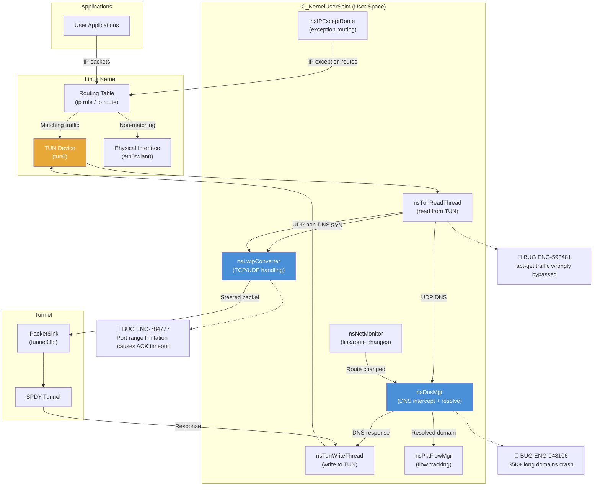

### Linux TUN Node Risk Assessment

| Node | Risk | Assessment |
|---|---|---|
| nsLwipConverter | 🔴 High | **ENG-784777** — Port range limitation causes first-visit ACK timeout |
| nsDnsMgr | 🔴 High | **ENG-948106** — 35K+ domains with 230-255 char names causes crash |
| nsTunReadThread | 🔴 Medium | **ENG-593481** — apt-get traffic wrongly bypassed instead of steered |
| nsNetMonitor | 🟡 Medium | Predicted: stale routes after WiFi-to-ethernet switch |
| nsIPExceptRoute | 🟡 Low | Predicted: exception route conflict with VPN routing tables |

### TUN Device Setup

The TUN device is created by `nsTunHandler::openTunDevice()`:

```cpp
int nsTunHandler::openTunDevice() {
    int fd = open("/dev/net/tun", O_RDWR);
    struct ifreq ifr;
    memset(&ifr, 0, sizeof(ifr));
    ifr.ifr_flags = IFF_TUN | IFF_NO_PI;  // TUN mode, no packet info header
    strncpy(ifr.ifr_name, tunName, IFNAMSIZ);
    ioctl(fd, TUNSETIFF, &ifr);
    return fd;
}
```

After creation:
1. The interface is brought up (`ip link set tun0 up`)
2. An IPv4 address is assigned (e.g., `100.64.x.x`)
3. IPv6 address is optionally assigned
4. `rp_filter` is configured for the TUN interface
5. Optional NAT rules are added (`iptables -t nat -A POSTROUTING`)
6. Routing rules direct matching traffic to the TUN device

### Routing Rules

In **Web mode**, iptables rules redirect traffic by destination port:

```bash
# Redirect ports 80, 443 to TUN device (table 1)
ip rule add fwmark 0x1/0x1 table 1
ip route add default dev tun0 table 1
iptables -t mangle -A OUTPUT -p tcp --dport 80 -j MARK --set-mark 0x1
iptables -t mangle -A OUTPUT -p tcp --dport 443 -j MARK --set-mark 0x1
```

In **CASB mode**, DNS responses are synthesized with virtual IPs in a private subnet (e.g., `100.64.0.0/10`), and routing for this subnet goes through the TUN device. The `nsDnsMgr` maintains the virtual IP-to-domain mapping.

### DNS Manager (nsDnsMgr)

The DNS Manager is critical on Linux because there is no kernel-level DNS inspection. It:

1. **Intercepts DNS queries**: UDP packets to port 53 arriving on the TUN device
2. **Forwards to upstream**: Opens a socket to the real DNS server (bypassing the TUN via a protected socket) and sends the query
3. **Processes responses**: Parses DNS answers and builds domain-to-IP mapping
4. **Synthesizes responses** (CASB mode): Returns virtual IPs from the `100.64.0.0/10` subnet
5. **Handles DNS server changes**: Monitors `/etc/resolv.conf` and `systemd-resolved` for DNS server changes

The DNS Manager uses an `epoll` event loop to handle multiple concurrent DNS queries and upstream socket responses.

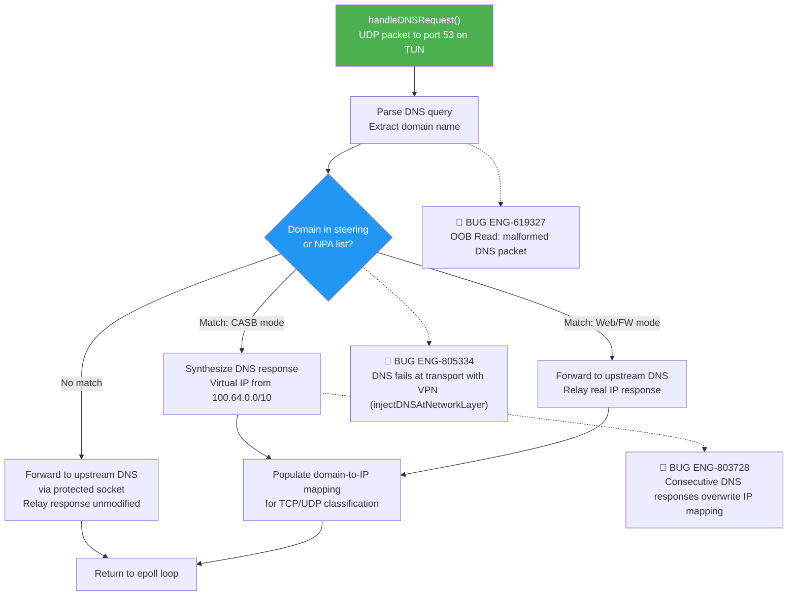

### Packet Flow Tracking (nsPktFlowMgr)

The Linux shim tracks per-connection state using `nsPktFlowMgr`, keyed by source port. The following diagram shows how a new TCP connection is classified and registered:

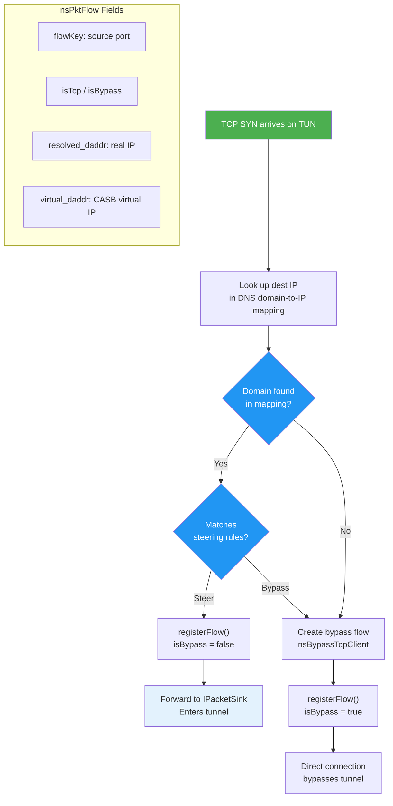

### lwIP Integration

The Linux implementation uses an embedded **lwIP** (lightweight IP) stack (`nsLwipConverter`) to handle TCP state machine operations. Since the TUN device delivers raw IP packets, the shim needs a TCP stack to:
- Complete TCP handshakes with local applications
- Buffer and reassemble TCP segments
- Provide a stream interface to the tunnel layer

lwIP runs in user space and handles the TCP connection on the TUN-facing side, while the tunnel (SPDY) handles the cloud-facing side.

### Network Monitoring

`nsNetMonitor` watches for network interface and routing table changes via Linux netlink sockets. When changes are detected:
- DNS server routes are updated
- The DNS manager re-reads upstream DNS servers
- Exception routes are recalculated
- The `onNetworkStatusChangedEvent()` callback propagates changes through the stack

### Config Done Signal

Unlike Windows and macOS, Linux requires an explicit "config done" signal:

```cpp
bool nsFilterDevice::setConfigDone() {
    bool needConfigDoneFlag = false;
#ifdef __LINUX__
    needConfigDoneFlag = true;
#endif
    // Signal the driver that all configuration has been pushed
    // The Linux shim waits for this before starting packet processing
}
```

This prevents the TUN handler from processing packets before all routing rules and domain lists are in place.

---

## Android: VPN Service

### Overview

On Android, NSClient uses the **VpnService API** to intercept traffic. The Android system creates a TUN device when the VPN service is activated, and the application receives a file descriptor for reading/writing packets.

The Android implementation shares the VIF codebase with Linux (both use `nsTunHandler`, `nsDnsMgr`, `nsLwipConverter`, `nsPktFlowMgr`) but has Android-specific additions:

- **VpnService.Builder**: Configures the VPN interface (address, routes, DNS, allowed/disallowed apps)
- **Per-App VPN**: `setBypassAllTrafficApps()` allows specific apps to bypass the VPN entirely
- **Exclude Routes**: `setExcludeRoutes()` configures routes that bypass the VPN
- **Socket protection**: `protectSocket()` prevents the tunnel's own sockets from being intercepted

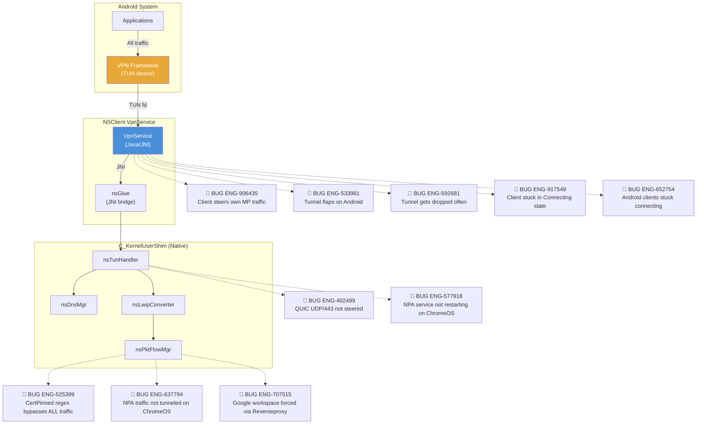

### Android VpnService Node Risk Assessment

| Node | Risk | Assessment |
|---|---|---|
| nsPktFlowMgr | 🔴 Critical | **ENG-525399** — CertPinned regex causes ALL traffic bypass; **ENG-637794** — NPA traffic not tunneled on ChromeOS; **ENG-707515** — Google workspace forced via Reverseproxy on Android |
| VpnService (Java/JNI) | 🔴 Critical | **ENG-906435** — Client steers own management plane traffic; **ENG-441957** — NPA disconnections after network switch; **ENG-533981** — Tunnel flaps on Android; **ENG-592681** — Tunnel gets dropped often; **ENG-917549** — Client stuck in Connecting state; **ENG-652754** — Android clients stuck in connecting state |
| nsTunHandler | 🔴 High | **ENG-402499** — QUIC (UDP/443) not supported, packets dropped; **ENG-577918** — NPA service not restarting automatically on ChromeOS |
| nsDnsMgr | 🔴 Medium | **ENG-671659** (iOS) — IPv6 link-local DNS scope_id not set |
| nsLwipConverter | 🟡 Medium | Predicted: TCP state leak with rapid VPN reconnects |

### Key Differences from Linux

| Aspect | Linux | Android |
|--------|-------|---------|
| TUN device creation | `open("/dev/net/tun")` + ioctl | `VpnService.Builder.establish()` |
| Routing rules | `ip rule` + `ip route` + iptables | `VpnService.Builder.addRoute()` |
| Per-app bypass | Not supported | `setBypassAllTrafficApps()` via `addDisallowedApplication()` |
| DNS interception | nsDnsMgr + routing rules | `VpnService.Builder.addDnsServer()` + nsDnsMgr |
| Socket protection | Not needed (routing table separation) | `VpnService.protect(socket)` required |
| DNS over TLS | Not disabled by default | `m_disableDoT = true` (force plain DNS for interception) |
| MTU | 1500 (default) | 1350 (default, matching nsssl) |

### Error Handling

Android has a unique error callback: `IPacketSink::OnFilterDeviceError()`. This is invoked when the TUN device encounters an unrecoverable error, allowing the service to tear down and re-establish the VPN connection.

---

## iOS: Network Extension (Packet Tunnel)

### Overview

On iOS, NSClient uses `NEPacketTunnelProvider` from the NetworkExtension framework. The iOS implementation shares the `NetworkExtensionShim` code with macOS but has iOS-specific handling:

- **Packet Tunnel mode**: Uses `NEPacketTunnelProvider` instead of transparent proxy
- **PAC URL**: Supports setting a PAC (Proxy Auto-Config) URL for proxy-based steering
- **None mode**: A special mode (`m_noneMode`) where the extension is loaded but not actively steering
- **Gateway configuration**: `setTunnelDstHostname()`, `setTunnelPopName()` for PoP selection
- **NPA remote gateway**: `setNpaRemoteGateway()` for private access
- **CIDR exceptions**: `setNEIPExceptionCIDR()` supports CIDR-based IP exception lists

The iOS packet tunnel provider intercepts traffic at the network extension level, routes it through the tunnel, and handles NPA private IP bypass via exclude routes. Issues arise when NPA is enabled alongside IP-based exceptions, or when third-party apps rely on protocols not fully supported by the tunnel provider.

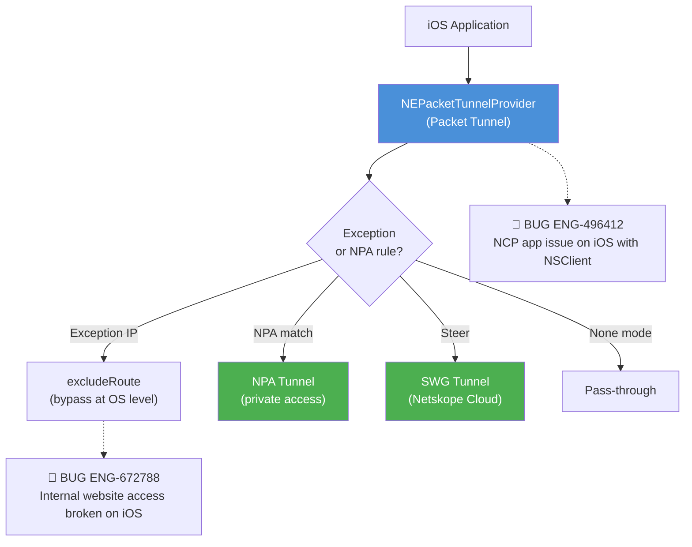

### iOS Node Risk Assessment

| Node | Risk | Assessment |
|---|---|---|
| NEPacketTunnelProvider | 🔴 High | **ENG-496412** — NCP app issue on iOS when NSClient enabled; TCP over DNS not supported on iOS |
| excludeRoute (Exception) | 🔴 High | **ENG-672788** — Internal website access broken; NPA-enabled exception IPs not added to excludeRoute |
| DNS IP Mapping | 🔴 High | **ENG-803728** — Consecutive DNS responses overwrite IP mapping, breaking connections |
| DNS IPv6 Scope | 🔴 Medium | **ENG-671659** — IPv6 link-local DNS scope_id not set on iOS |
| Network Switch | 🟡 Medium | **ENG-450735** — iOS users cannot access internal apps after upgrade (regression) |

### Disconnect Handling

iOS has a unique `disconnectAll()` method on the `IPacketSink` interface:

```cpp
virtual void disconnectAll(int context, bool bStopThread = true, const int reason = 0) = 0;
```

This allows the extension to signal a complete tunnel teardown, which is needed when iOS suspends the app or when the network conditions change (e.g., WiFi to cellular handoff).

---

## ChromeOS

ChromeOS uses a Chrome extension-based approach with proxy API and PAC script generation. This platform does not use a kernel-level driver. Steering is achieved by configuring Chrome's proxy settings to route matching traffic through the Netskope cloud proxy.

**Known limitation**: Large steering configs (30K+ domains) can exceed buffer limits and cause crashes (ENG-872456).

---

## Platform Comparison

| Feature | Windows (WFP) | macOS (NE) | Linux (TUN) | Android (VPN) | iOS (NE) |
|---------|--------------|------------|-------------|---------------|----------|
| **Interception layer** | Kernel (WFP callout) | System Extension | User space (TUN) | User space (VPN) | System Extension |
| **Packet level** | L3/L4 (IP + TCP/UDP) | L4/L7 (flow-based) | L3 (raw IP) | L3 (raw IP) | L4/L7 (flow-based) |
| **Domain resolution** | DNS in driver hash table | NE provides hostname | nsDnsMgr user space | nsDnsMgr user space | NE provides hostname |
| **Process info** | Via WFP metadata | NE provides process name | Not available | Not available | NE provides process name |
| **Per-app bypass** | No (driver-level) | No | No | Yes (VPN framework) | No |
| **IPv6 support** | Block flag | Block flag | Optional | Limited | Limited |
| **NPA support** | IP rules in driver | NE filter rules | Route rules | Route rules | NE filter rules |
| **Self-protection** | Driver flag | System Extension | Not available | Not available | System Extension |
| **MTU default** | 1350 | 1400 (VIF) | 1500 | 1350 | 1350 |

---

## Exception Handling at the Driver Level

Exception handling can occur at two levels: user-space (service) or driver-level. Driver-level exception handling is more efficient because packets are bypassed before being sent to user space, reducing overhead.

### Exception Data Structures

On Windows, the `DriverExceptions` class serializes exception rules into binary blobs that the driver understands:

**Firewall Rules** (for CFW mode):
```
IOCTL_STADRV_FIREWALL_RULES:
  - portMap[65536]       // One entry per port
  - FirewallRule[]       // Per port-range rules
    - numDomainEntries   // Domain exceptions
    - numIPRangeEntries  // IP range exceptions
    - numPortRangeEntries
  - DFWPortRange[]       // Port ranges
  - DIPIntRange[]        // IP ranges (start, end)
  - STADRV_DOMAIN_NAME[] // Domain name entries
```

**IP/Domain Exceptions**:
```
IOCTL_STADRV_EXCEPTION_RULES:
  - numIPs               // IPv4 range count
  - numIP6               // IPv6 range count
  - numDomains           // Domain exception count
  - DIPIntRange[]        // IPv4 ranges
  - DIPv6Range[]         // IPv6 ranges
  - STADRV_DOMAIN_NAME[] // Domain names
```

### Exception Handling Versions

Two versions of driver-level exception handling exist:
- **V1** (`handleExceptionAtDriver`): Original implementation
- **V2** (`handleExceptionAtDriverV2`): Enhanced implementation with additional matching capabilities

These are controlled by feature flags pushed via `FUNC_STADRV_FEATUREFLAGS`.

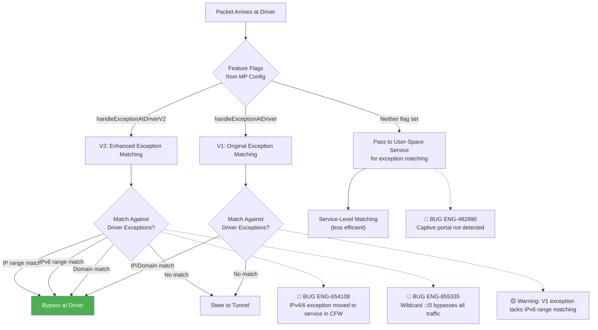

### Exception Handling Node Risk Assessment

| Node | Risk | Assessment |
|---|---|---|
| V2 Exception Matching | 🔴 High | **ENG-654108** — IPv4/IPv6 exception handling moved from driver to service in CFW; **ENG-855335** — Wildcard rules bypass all traffic |
| V1 Exception Matching | 🟡 Medium | V1 lacks full IPv6 range matching capability |
| Feature Flags | 🔴 Medium | **ENG-805334** — injectDNSAtNetworkLayer flag needed for Citrix VPN interop |
| Service-Level Matching | 🔴 Medium | **ENG-482990** — Captive portal not detected; meta refresh HTTP redirection not supported since Day-1 |

---

## Packet Statistics

The FilterDevice tracks packet statistics that are used for diagnostics and troubleshooting:

**Driver-level stats** (`STADRV_STATS`):
- `TotalTxPktsInspected` / `TotalRxPktsInspected`: Total packets seen
- `TotalTxPktsForwarded`: Packets steered to tunnel
- `TotalTxPktsDiscarded` / `TotalRxResourceErrors`: Dropped packets
- `TotalTxBigPacketDrops` / `TotalRxBigPacketDrops`: Oversized packets dropped
- `TotalActiveFlows`: Currently tracked flows

**Shim-level stats** (Windows `ShimPktStats`):
- `TotalDroppedPktRd` / `TotalDroppedPktWr`: Packets dropped due to queue full
- `TotalMaxPendingPktRd` / `TotalMaxPendingPktWr`: Peak queue depth
- Current (per-tunnel-session) versions of the above

These statistics are dumped via `dumpPacketStats()` and appear in `nsdebuglog.log`.

---

## Troubleshooting

### Log Keywords

| Component | Log Keywords | Description |
|-----------|-------------|-------------|
| FilterDevice init | `"Global config in the driver"`, `"failed to enable global config"` | Driver initialization |
| Filter enable | `"enabled filter mode"`, `"failed to enable filter mode"` | Tunnel filter activation |
| Domain list | `"Total domains added"`, `"domain entry.*length"` | Domain list push to driver |
| Port list | `"Tunnel Port List"`, `"failed to set port list"` | Port configuration |
| Feature flags | `"set feature flags 0x"`, `"failed to set feature flags"` | Feature flag push |
| NPA | `"enabled NPA filter mode"`, `"NPA IP rules are reset"` | NPA activation |
| Packet inject | `"pkt dropped len"`, `"failed to inject packet"` | Packet injection issues |
| Driver start/stop | `"Starting.*driver service"`, `"Driver.*stopped"` | Windows driver lifecycle |
| BFE check | `"BFE"`, `"Base Filtering"` | Windows BFE service status |
| Packet loop | `"Windivert is found"`, `"Packet loop flag"` | Loop detection |
| Exception | `"NS Exceptions set"`, `"failed to set NS exceptions"` | Exception rules |
| Config done | `"failed to set config done"` | Linux config completion signal |
| TUN device | `"init ..."`, `"device ="`, `"interface id"` | Linux TUN setup |
| DNS manager | `"DnsMgr"`, `"DNS Suffix"`, `"uplink DNS server"` | DNS handling |
| Network Extension | `"nsNetExtShim"`, `"bypassFlow"`, `"setSteerDNS"` | macOS NE operations |
| VIF | `"nsVif"`, `"100.127.127.1"` | macOS VIF operations |

### Common Issues

**Issue 1: FilterDevice initialization fails on Windows**

**Symptoms**: Tunnel cannot start, logs show "failed to enable global config in the driver"

**Diagnosis**:
```bash
# Check if BFE service is running
sc query BFE
# Check if stadrv driver is loaded
sc query stadrv
# Search logs
grep -i "global config\|BFE\|failed to enable" nsdebuglog.log
```

**Possible causes**:
- BFE service not running (restart BFE)
- stadrv driver not loaded (reinstall driver)
- Another security product blocking the driver

---

**Issue 2: Domain list too large, buffer overflow**

**Symptoms**: Steering does not work for some domains, logs show "Buffer overflow detected"

**Diagnosis**:
```bash
grep -i "buffer overflow\|domain.*length\|Total domains added" nsdebuglog.log
```

**Root cause**: The domain list exceeds the 2 MB buffer (`NS_MAX_CONFIG_BUFFER_SIZE`). This was addressed by dynamic buffer sizing (`calculateDomainListBufferSize()`), but very large configs (30K+ domains) may still hit limits on some platforms.

---

**Issue 3: Packet loop with third-party drivers (Windows)**

**Symptoms**: High CPU, network slowdown, logs show "Packet loop flag is to be set"

**Diagnosis**:
```bash
grep -i "infinite.*loop\|windivert\|APXNET\|packet loop" nsdebuglog.log
```

**Root cause**: WinDivert (BWAN) or APXNET driver installed. NSClient detects this and enables loop avoidance, but edge cases can still cause issues.

---

**Issue 4: Linux DNS resolution fails after TUN starts**

**Symptoms**: DNS queries timeout, applications cannot resolve hostnames

**Diagnosis**:
```bash
grep -i "DnsMgr\|uplink DNS server\|resolv.conf" nsdebuglog.log
# Check if TUN device is up
ip link show tun0
# Check routing table
ip rule show
ip route show table 1
```

**Root cause**: The DNS manager could not open a socket to the upstream DNS server, or routing for the DNS server was not properly set up.

---

**Issue 5: macOS Network Extension stops steering after upgrade**

**Symptoms**: Traffic not intercepted after R130-R131 upgrade on macOS 15.x

**Related bug**: ENG-773191 — Transparent proxy stops when NPA is in DISABLED state

**Diagnosis**:
```bash
grep -i "nsNetExtShim\|transparent proxy\|NPA.*DISABLED" nsdebuglog.log
```

---

## Windows Platform Bugs

**Bug Count**: 30 | **Key Gaps**: DNS over TCP, PSIRT IOCTL, VDI multi-session, packet loop, CFW exceptions, DNS steering exceptions, i18n

### Windows Confirmed Bug Mapping

| Flow Step | Known Bugs | Root Cause | Automation |
|---|---|---|---|
| WFP Packet Classification | ENG-438565 (loopback drop) | Large TCP segmented packets from loopback dropped | ❌ Not covered |
| DNS Domain-to-IP Table | ENG-438566 (DNS/TCP) | DNS over TCP responses not learned into hash table | ❌ Not covered |
| DNS Packet Parsing | ENG-456732 (BSOD) | DNS/TCP handling memory corruption causes BSOD | ❌ Not covered |
| DNS Packet Validation | ENG-619327 (OOB Read) | Malformed DNS packet corrupts stack (PSIRT) | ❌ Not covered |
| Steering Mode (Web) | ENG-448002 (UDP 3478) | UDP 3478 steered in Web-only mode | ⚠️ Partial (dynamic_steering/) |
| ACK Processing | ENG-649593 (ACK mangle) | ACK numbers mangled with local proxy + cert-pin bypass | ❌ Not covered |
| CFW Exception Handling | ENG-654108 (IPv4/6 exception) | Exception handling moved from driver to service in CFW | ⚠️ Partial (exception_domains/) |
| CFW Rule Timing | ENG-655009 (FW add/delete) | FW exception add/delete timing issue | ⚠️ Partial (cfw/) |
| CFW Port Handling | ENG-685566 (Netbios) | Port 137 Netbios bypassed in CFW mode | ❌ Not covered |
| DNS TCP + CertPin | ENG-718498 (DNS TCP bypass) | Large DNS over TCP bypassed with cert-pin block | ❌ Not covered |
| Web Mode Performance | ENG-729176 (DC CPU) | Massive SMB connections in Web mode on Domain Controller | ❌ Not covered |
| CertPinned Bypass | ENG-742949 (cert-pin fail) | Cert-pinned bypass intermittent decryption | ✅ ssl_pinned_app/ |
| Connection Stability | ENG-747635 (crash) | Massive rapid connections cause client crash | ❌ Not covered |
| VDI Session ID | ENG-753965 (session ID) | Incorrect session ID in multi-session VDI | ❌ Not covered |
| DNS Injection Layer | ENG-805334 (VPN interop) | DNS fails with Citrix VPN; injectDNSAtNetworkLayer needed | ❌ Not covered |
| VDI Tunnel Delay | ENG-918131 (multi-session) | Multi-user logon: tunnel build delay ~20 seconds | ❌ Not covered |
| IOCTL Security | ENG-925885 (PSIRT) | Anti-tamper IOCTL bypass in stadrv driver | ❌ Not covered |
| IOCTL Security | ENG-925887 (PSIRT) | Client disable via anti-tamper IOCTL bypass | ❌ Not covered |
| VDI Connection | ENG-624953 (VDI DaaS) | Existing bypass connections terminated on tunnel start | ❌ Not covered |
| BWAN Packet Capture | ENG-625957 (NPA+BWAN) | Driver doesn't capture egress packets injected by WinDivert | ❌ Not covered |
| CFW App Recognition | ENG-398387 (CFW app) | CFW no longer recognizing traffic as belonging to CFW app | ❌ Not covered |
| CFW Tor Blocking | ENG-635104 (Tor browser) | CFW not blocking Tor anonymity browser | ✅ dse_automation/ |
| Off-Prem FW Exception | ENG-455132 (on-prem/off-prem) | Off-prem steering firewall applied incorrectly on-prem | ✅ dse_automation/ |
| DNS Steering BSOD | ENG-555622 (Citrix BSOD) | Citrix servers BSOD with DNS steering enabled | ❌ Not covered |
| DNS Exception Rule | ENG-579740 (DNS exception) | DNS traffic steered despite exception rule (PTR records) | ❌ Not covered |
| DNS FailClose Recovery | ENG-561500 (DNS post-FC) | DNS not steered after recovering from FailClose | ❌ Not covered |
| Steering Mode Status | ENG-451987 (Enabled status) | Client status Enabled despite IPSec bypass detected | ❌ Not covered |
| IP Classification | ENG-739968 (private IPs) | Private IPs steered to SWG due to nsexception.json race | ❌ Not covered |
| FailClose Reboot | ENG-895081 (FC reboot) | FailClose not dropping traffic after reboot | ❌ Not covered |
| Multi-User FC | ENG-928461 (multi-user FC) | Multi-user FailClose disconnect | ❌ Not covered |
| i18n Alert | ENG-430841 (justification hint) | i18n issue with user alert justification hint text | ❌ Not covered |
| i18n Config Names | ENG-434019 (non-ASCII garbled) | Steering/Client config names garbled with Japanese chars | ❌ Not covered |
| Captive Portal | ENG-482990 (captive portal) | Captive portal not detected; meta refresh not supported | ❌ Not covered |

## macOS Platform Bugs

**Bug Count**: 9 | **Key Gaps**: DHCP in CFW, IPv6 DNS, NPA proxy stop, wildcard exception, BWAN DNS interop, client crash

### macOS Confirmed Bug Mapping

| Flow Step | Known Bugs | Root Cause | Automation |
|---|---|---|---|
| bypassFlow() Classification | ENG-855335 (wildcard bypass) | Wildcard ::/128 or ::/0 or 0.0.0.0/0 exception bypasses ALL traffic | ⚠️ Partial (exception_domains/) |
| Transparent Proxy | ENG-773191 (NPA DISABLED) | Transparent proxy stops when NPA in DISABLED state on macOS 15.x | ❌ Not covered |
| DNS Proxy (IPv6) | ENG-436114 (IPv6 local DNS) | IPv6 local link DNS not honored | ❌ Not covered |
| NE DHCP Handling | ENG-680385 (DHCP CFW) | macOS 15.4/15.5 passes DHCP to system extension in CFW | ❌ Not covered |
| NE DHCP Handling | ENG-645301 (DHCP exclude) | DHCP not excluded in CFW mode on macOS | ❌ Not covered |
| IPv6 Bypass | ENG-729025 (Google search) | IPv4-only network with bypassPreferredIPv4macOS breaks Google | ❌ Not covered |
| AirDrop/mDNS | ENG-538734 (Airplay) | Port 5353 mDNS not handled for Airplay mirroring | ❌ Not covered |
| DNS Interception | ENG-918295 (NPA+BWAN DNS) | DNS queries go to BWAN instead of NPA; service-level DNS missed | ❌ Not covered |
| Client Stability | ENG-538206 (crash) | NS Client crashes on macOS | ❌ Not covered |

## Linux Platform Bugs

**Bug Count**: 4 | **Key Gaps**: Large domain crash, port range timeout, apt-get steering

### Linux Confirmed Bug Mapping

| Flow Step | Known Bugs | Root Cause | Automation |
|---|---|---|---|
| nsLwipConverter TCP | ENG-784777 (port range) | Port range limitation causes first-visit ACK timeout | ❌ Not covered |
| nsDnsMgr Domain List | ENG-948106 (35K crash) | Domains 230-255 chars with 35K+ entries causes crash | ❌ Not covered |
| Traffic Classification | ENG-593481 (apt-get) | apt-get traffic wrongly bypassed instead of steered | ❌ Not covered |
| Service Management | ENG-453051 (SIGTERM) | Multiple SIGTERM issues on service restart | ❌ Not covered |

## Android Platform Bugs

**Bug Count**: 15 | **Key Gaps**: CertPinned regex, QUIC, WFC audio, NPA on ChromeOS, self-traffic steering, tunnel stability, NPA auto-restart

### Android Confirmed Bug Mapping

| Flow Step | Known Bugs | Root Cause | Automation |
|---|---|---|---|
| Protocol Detection | ENG-402499 (QUIC) | QUIC (UDP/443) not supported by proxy, packets dropped | ❌ Not covered |
| Network Switch | ENG-441957 (NPA disconnect) | NPA disconnects after network switch on Android | ❌ Not covered |
| Bypass Logic | ENG-454765 (bypass handling) | Bypassed traffic not handled properly | ❌ Not covered |
| App Bypass (WFC) | ENG-490822 (WFC audio) | One-way audio — bypass by tunnel vs bypass by client logic | ❌ Not covered |
| CertPinned Processing | ENG-499052 (Teams) | Cert-pinned exceptions not enforced at OS level from R112.1 | ✅ ssl_pinned_app/ |
| CertPinned Regex | ENG-525399 (ALL bypass) | Regex on cert-pinned apps bypasses ALL traffic | ✅ ssl_pinned_app/ |
| NPA Traffic (ChromeOS) | ENG-637794 (NPA not tunneled) | bypassIPExceptionAtAndroidOs causes NPA IP overlap | ❌ Not covered |
| CertPinned Regression | ENG-744457 (WFC audio) | Cert-pinned bypass regression from ENG-673392 fix | ✅ ssl_pinned_app/ |
| Self-Traffic | ENG-906435 (MP traffic) | Client steers own management plane traffic | ❌ Not covered |
| Tunnel Stability | ENG-533981 (tunnel flaps) | Tunnel flaps on Android NS client; DNS health check gap | ❌ Not covered |
| Tunnel Stability | ENG-592681 (tunnel drops) | Tunnel gets dropped often; recovery mechanism bug | ❌ Not covered |
| VPN Connection State | ENG-917549 (stuck connecting) | Client stuck in Connecting state after WiFi-to-mobile switch | ❌ Not covered |
| VPN Connection State | ENG-652754 (stuck connecting) | Android clients stuck in connecting state on unreliable network | ❌ Not covered |
| NPA Auto-Restart | ENG-577918 (NPA on ChromeOS) | Client not restarting NPA service automatically after TUN reset | ❌ Not covered |
| Reverse Proxy Steering | ENG-707515 (Google workspace) | Google workspace forced via Reverseproxy; com.google.android.gms bypass regression | ❌ Not covered |

## iOS Platform Bugs

**Bug Count**: 5 | **Key Gaps**: IPv6 link-local DNS, DNS IP mapping overwrite, network switch regression, NCP app, internal website access

### iOS Confirmed Bug Mapping

| Flow Step | Known Bugs | Root Cause | Automation |
|---|---|---|---|
| Network Switch | ENG-450735 (post-upgrade) | iOS users cannot access internal apps after upgrade (regression from ENG-441957 fix) | ❌ Not covered |
| DNS IPv6 Scope | ENG-671659 (IPv6 link-local) | DNS UDP bypass doesn't set interface scope_id for IPv6 link-local | ❌ Not covered |
| DNS IP Mapping | ENG-803728 (blank page) | Consecutive DNS responses overwrite IP mapping, breaks existing connections | ❌ Not covered |
| Packet Tunnel Provider | ENG-496412 (NCP app) | NCP app issue on iOS when NSClient enabled; TCP over DNS not supported | ❌ Not covered |
| Exception IP Routing | ENG-672788 (internal website) | Internal website access broken; NPA-enabled exception IPs not added to excludeRoute | ❌ Not covered |

## ChromeOS Platform Bugs

**Bug Count**: 1 | **Key Gaps**: Large domain list crash

### ChromeOS Confirmed Bug Mapping

| Flow Step | Known Bugs | Root Cause | Automation |
|---|---|---|---|
| Domain List Push | ENG-872456 (30K+ crash) | 30K+ domains in steering config causes Chrome extension crash | ❌ Not covered |

---

## Automation Coverage Summary

### Golden Regression Suite Mapping

| Test Directory | Test Count | Ch09 Concept | Coverage |
|---|---|---|---|
| `dynamic_steering/` | 3 | Steering Mode Decision (CASB/Web/FW switching) | ⚠️ Partial |
| `custom_steering_configuration/` | 3 | Steering Config Processing (OU/UG criteria) | ⚠️ Partial |
| `cfw/` | 3 | CFW Packet Flow (FTP tunneling/bypass) | ⚠️ Partial |
| `exception_domains/` | 3 | Exception Handling (domain/IP exceptions) | ⚠️ Partial |
| `ssl_pinned_app/` | 3 | CertPinned App Bypass | ✅ Good |
| `explicit_proxy/` | 3 | Proxy Integration | ⚠️ Partial |
| `manage_unmanage/` | 3 | App Classification | ⚠️ Partial |
| `fail_close/` | 2 | FailClose Packet Blocking at FilterDevice | ⚠️ Partial |
| `nplan_4571_failclose/` | 2 | FailClose driver-level blocking | ⚠️ Partial |
| `nplan_5628_onpremises_profiles/` | 2 | On-prem traffic steering profiles | ⚠️ Partial |
| `scenarios/` | 11 | Multi-flow integration tests | ⚠️ Partial |

**Total**: ~38 tests | **Coverage**: ⚠️ Partial — good breadth but shallow depth per feature

### Coverage Gaps

| Gap Area | Impact | Priority |
|---|---|---|
| DNS over TCP in WFP driver | CASB mode fails for TCP-resolved domains | P1 |
| PSIRT IOCTL driver security | Attacker can disable NSClient | P1 |
| VDI multi-session isolation | Enterprise VDI deployment broken | P1 |
| Large domain list (35K+) | Client crash on large tenants | P1 |
| macOS DHCP in CFW | Network loss on macOS 15.x | P1 |
| NPA + transparent proxy state | Silent security bypass | P1 |
| Wildcard exception validation | All SWG traffic bypassed | P1 |
| IPv6 handling (cross-platform) | DNS failures, speed degradation | P1 |
| Android self-traffic exception | Config refresh fails | P2 |
| iOS DNS IP mapping consistency | Blank pages on CDN sites | P2 |
| Packet loop with BWAN/WinDivert | CPU spike, NPA failure | P2 |
| TUN network switch recovery | Traffic blackholed on Linux | P2 |

---

## Cross-Flow Interactions

Traffic interception touches nearly every other NSClient module. Bugs that span multiple feature areas represent the largest testing gap.

### Cross-Flow Risk Matrix

| Ch09 Area | Interacting Chapter | Risk | Known Bugs |
|---|---|---|---|
| FilterDevice ↔ FailClose | [11_failclose.md](11_failclose.md) | 🔴 High | FailClose uses FilterDevice to block; driver state conflicts during mode transition |
| WFP Driver ↔ Installation | [01_installation.md](01_installation.md) | 🔴 High | Driver upgrade with self-protection (ENG-733657); BFE dependency |
| DNS Interception ↔ Steering Config | [05_steering_config.md](05_steering_config.md) | 🔴 High | Domain list size limits; DNS/TCP learning gap |
| Exception Handling ↔ Bypass | [10_bypass.md](10_bypass.md) | 🔴 High | Wildcard exceptions; cert-pin regex overmatch |
| FilterDevice ↔ NPA | [15_npa_integration.md](15_npa_integration.md) | 🔴 High | Shared FilterDevice ref counting; NPA DISABLED stops proxy (ENG-773191) |
| FilterDevice ↔ Tunnel | [07_tunnel_management.md](07_tunnel_management.md) | 🔴 Medium | Tunnel src/dst bypass check; packet injection ordering |
| Packet Loop ↔ BWAN | External (SD-WAN) | 🔴 Medium | WinDivert packet capture conflict (ENG-625957) |
| VDI ↔ Service Lifecycle | [03_service_lifecycle.md](03_service_lifecycle.md) | 🟡 Medium | Multi-session service instances; tunnel build delay |

### Cross-Flow Interaction: FilterDevice ↔ FailClose ↔ Bypass

When FailClose is active and the tunnel disconnects, the FilterDevice switches from "steer to tunnel" mode to "block all" mode. If bypass exceptions are configured, the driver must still allow exception traffic through while blocking everything else. This three-way interaction is where most compound failures occur.

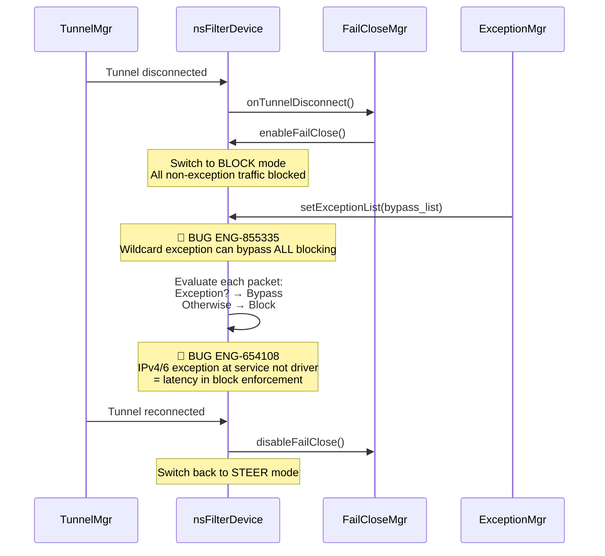

## Related Chapters

- [05_steering_config.md](05_steering_config.md) — Steering rules determine what gets intercepted (domain lists, port lists, firewall rules)
- [07_tunnel_management.md](07_tunnel_management.md) — Intercepted traffic is sent through the SPDY tunnel
- [10_bypass.md](10_bypass.md) — Bypass rules exclude traffic from interception
- [11_failclose.md](11_failclose.md) — FailClose blocks traffic when the tunnel is down, implemented via FilterDevice rules
- [15_npa_integration.md](15_npa_integration.md) — NPA uses the shared FilterDevice for private access steering

---

## Appendix A: Bug Quick Reference

| Bug ID | Problem Summary | Root Cause | Platform | Type |
|---|---|---|---|---|
| **ENG-402499** | QUIC UDP/443 not steered | QUIC not supported by proxy | Android | Day-1 |
| **ENG-436114** | IPv6 local link DNS not honored | IPv6 link-local DNS bypass missing | macOS | Test Gap |
| **ENG-438565** | Large TCP loopback packets dropped | Segmented packet drop in loopback path | Windows | Test Gap |
| **ENG-438566** | DNS over TCP not learned | DNS TCP responses not added to domain-IP table | Windows | Enhancement |
| **ENG-441957** | NPA disconnects after network switch | Network switch handling regression | Android | Regression |
| **ENG-448002** | UDP 3478 steered in Web mode | Custom port UDP steering logic error | Windows | Test Gap |
| **ENG-450735** | iOS users can't access internal apps after upgrade | Regression from ENG-441957 Android fix | iOS | Regression |
| **ENG-453051** | Multiple SIGTERM issues on Linux | Client service restart handling | Linux | Test Gap |
| **ENG-454765** | Android bypass traffic not handled | Bypass scenario not tested | Android | Test Gap |
| **ENG-456732** | BSOD from DNS/TCP handling | DNS/TCP memory corruption | Windows | Test Gap |
| **ENG-490822** | WFC one-way audio on Zebra | Bypass-by-tunnel vs bypass-by-client logic | Android | Test Gap |
| **ENG-499052** | Teams messages fail on Android | Cert-pinned exceptions not enforced at OS level | Android | Regression |
| **ENG-525399** | CertPinned regex bypasses ALL traffic | Regex on native cert-pinned apps overmatch | Android | Test Gap |
| **ENG-538734** | Airplay mirroring broken | Port 5353 mDNS not handled for Airplay | macOS | Regression |
| **ENG-543661** | Extreme download speed degradation | IPv6 performance issue | Cross-platform | Enhancement |
| **ENG-593481** | apt-get fails on Linux with client | apt-get traffic wrongly bypassed | Linux | Day-1 |
| **ENG-619327** | OOB Read vulnerability (PSIRT) | Malformed DNS packet corrupts stack | Windows | Corner Case |
| **ENG-624953** | VDI DaaS connections terminated | Existing bypass connections broken on tunnel start | Windows | Day-1 |
| **ENG-625957** | NPA not tunneling with BWAN | WinDivert captures egress before stadrv | Windows | Corner Case |
| **ENG-637794** | NPA not tunneled on ChromeOS | bypassIPExceptionAtAndroidOs affects NPA overlap | ChromeOS | Regression |
| **ENG-645301** | DHCP excluded in CFW on macOS | macOS 15.4 passes DHCP to system extension | macOS | Corner Case |
| **ENG-649593** | ACK numbers mangled | Local proxy + cert-pin bypass ACK handling | Windows | Day-1 |
| **ENG-654108** | Citrix VPN traffic as SYSTEM | IPv4/6 exception moved to service in CFW | Windows | Enhancement |
| **ENG-655009** | CFW tunneling issue | FW exception add/delete timing | Windows | Test Gap |
| **ENG-671659** | iOS IPv6 link-local DNS broken | DNS UDP bypass missing scope_id for IPv6 | iOS | Day-1 |
| **ENG-680385** | DHCP fails on macOS network change | macOS 15.4/15.5 DHCP through system extension | macOS | Corner Case |
| **ENG-685566** | Netbios bypassed in CFW | Port 137 not handled in CFW mode | Windows | Day-1 |
| **ENG-710784** | VDI DaaS terminates connections | Citrix VDI existing connection disruption (R127.2) | Windows | Regression |
| **ENG-718498** | Large DNS/TCP bypassed with cert-pin | DNS TCP from cert-pinned apps bypassed | Windows | Enhancement |
| **ENG-729025** | Google search broken on macOS | IPv4-only network with bypassPreferredIPv4macOS | macOS | Day-1 |
| **ENG-729176** | High CPU on Domain Controller | Massive SMB connections in Web mode | Windows | Regression |
| **ENG-742949** | Cert-pinned bypass not working | Intermittent decryption in bypass | Windows | Regression |
| **ENG-744457** | WFC audio regression on Android | Cert-pinned bypass regression from fix | Android | Regression |
| **ENG-747635** | Client crash on Windows 10 | Massive rapid connection changes | Windows | Corner Case |
| **ENG-753965** | Wrong session ID in VDI | Session ID caching in multi-session | Windows | Day-1 |
| **ENG-773191** | NPA not tunneled on macOS R131 | Transparent proxy stops when NPA DISABLED | macOS | Regression |
| **ENG-784777** | First-visit timeout on Linux | Port range limitation causes ACK timeout | Linux | Corner Case |
| **ENG-793442** | Blocked sites accessible on network change | IPv6 processing delay on network change | Cross-platform | Day-1 |
| **ENG-803728** | Blank page on iOS (MS login) | Consecutive DNS responses overwrite IP mapping | iOS | Day-1 |
| **ENG-805334** | Citrix/Cisco VPN interop issue | DNS fails at transport; injectDNSAtNetworkLayer needed | Windows | Corner Case |
| **ENG-855335** | All SWG traffic bypassed on macOS | Wildcard ::/0 exception bypasses all traffic | macOS | Regression |
| **ENG-872456** | ChromeOS crash with 30K+ domains | Large domain list exceeds buffer | ChromeOS | Corner Case |
| **ENG-897416** | FedRAMP outbound to commercial domain | Legacy Secure Forwarder DNS resolution | Cross-platform | Day-1 |
| **ENG-906435** | Android steers own client traffic | MP traffic tunneled instead of bypassed | Android | Day-1 |
| **ENG-918131** | VDI SWG broken intermittently | Multi-user logon tunnel delay ~20s | Windows | Day-1 |
| **ENG-918295** | NPA DNS goes to BWAN on macOS | Service-level DNS missed; only global DNS read | macOS | Day-1 |
| **ENG-925885** | PSIRT: Anti-tamper IOCTL bypass | Unauthorized IOCTL to stadrv driver | Windows | Day-1 |
| **ENG-925887** | PSIRT: Client disable via IOCTL | stadrv IOCTL vulnerability | Windows | Day-1 |
| **ENG-948106** | Linux crash with 35K+ long domains | Domains 230-255 chars with 35K+ entries | Linux | Day-1 |
| **ENG-398387** | CFW not recognizing traffic as CFW app | CFW app classification failure on VDI | Windows/macOS | Day-1 |
| **ENG-430841** | i18n: user alert justification hint | Localization issue with justification hint text | Windows | Day-1 |
| **ENG-434019** | Config names garbled with non-ASCII | Japanese chars in steering/client config garbled in UI | Windows | Day-1 |
| **ENG-451987** | Client Enabled despite IPSec bypass | Client status shows Enabled even though IPSec steering detected | Windows | Corner Case |
| **ENG-455132** | Off-prem FW applied incorrectly on-prem | Off-prem steering firewall ICMP exception applied on-prem | Windows | Day-1 |
| **ENG-482990** | Captive portal not detected | Meta refresh HTTP redirection not supported since Day-1 | Windows/macOS | Enhancement |
| **ENG-496412** | NCP app issue on iOS with NSClient | TCP over DNS not supported on iOS; enhancement fix | iOS | Enhancement |
| **ENG-533981** | Tunnel flaps on Android | DNS tunnel health check gap causes tunnel instability | Android | Test Gap |
| **ENG-538206** | NS Client crashes on macOS | Client crash on macOS | macOS | Corner Case |
| **ENG-555622** | BSOD with DNS steering on Citrix | DNS IP in steering + bypass list causes BSOD on Citrix VDI | Windows | Corner Case |
| **ENG-561500** | DNS not steered after FailClose recovery | Web mode + DNS steering + FailClose combination fails | Windows | Day-1 |
| **ENG-577918** | NPA not restarting on ChromeOS | Client fails to re-enable NPA after TUN device reset | Android/ChromeOS | Test Gap |
| **ENG-579740** | DNS steered despite exception rule | PTR record type exception not working; enhancement | Windows | Enhancement |
| **ENG-592681** | Tunnel gets dropped often on Android | Recovery mechanism bug leaves both tunnels disconnected | Android | Enhancement |
| **ENG-635104** | CFW not blocking Tor browser | Block action with CFW steering was broken | Windows | Test Gap |
| **ENG-652754** | Android clients stuck connecting | Network unreliability causes stuck connecting state | Android | Corner Case |
| **ENG-672788** | Internal website access broken on iOS | NPA-enabled exception IPs not added to excludeRoute | iOS | Corner Case |
| **ENG-707515** | Google workspace forced via Reverseproxy | com.google.android.gms default bypass regression | Android | Regression |
| **ENG-739968** | Private IPs steered to SWG | Race condition in nsexception.json read/write | Windows | Day-1 |
| **ENG-895081** | FailClose not dropping traffic after reboot | FailClose not enforced when NSGW unreachable post-reboot | Windows | Day-1 |
| **ENG-917549** | Android client stuck in Connecting | WiFi-to-mobile switch loses tunnel state update to UI | Android | Day-1 |
| **ENG-928461** | Multi-user FailClose disconnect | Multiple users disconnect and enter FailClose state | Windows | Corner Case |

---

## Appendix B: Methodology

### Severity Ratings

| Level | Description |
|---|---|
| **S1** | Security bypass, data leak, crash, or complete feature failure |
| **S2** | Significant functional issue affecting a common workflow |
| **S3** | Minor issue with workaround available |
| **S4** | Cosmetic or edge case with minimal impact |
| **S5** | Enhancement or optimization request |

### Gap Types

| Type | Description |
|---|---|
| **Regression** | Previously working feature broken by code change |
| **Day-1** | Feature never worked correctly since introduction |
| **Test Gap** | Insufficient test coverage for known risk area |
| **Corner Case** | Unusual configuration or environment not anticipated |

### Automation Priority

| Priority | Description |
|---|---|
| **P1** | Must automate — high-severity gap with customer impact |
| **P2** | Should automate — moderate risk, currently manual-only |
| **P3** | Nice to automate — low risk but improves coverage |

### Test Case Format

Each test case uses TC-XX-NN format where XX is the chapter number and NN is the sequential test ID. Fields include: Severity, Related Bugs (verified ENG-XXXXXX IDs from `bugs/*.md`), Flow Point (diagram node reference), Gap Type, Automation Priority, Preconditions, Steps, Expected Result, Failure Indicators (log grep patterns), and Risk if Untested.
