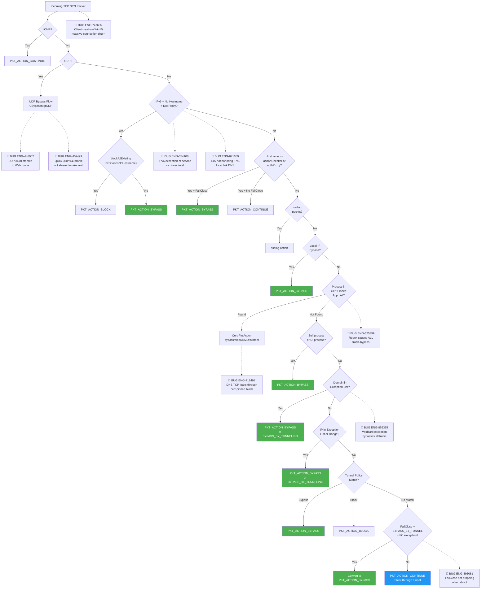
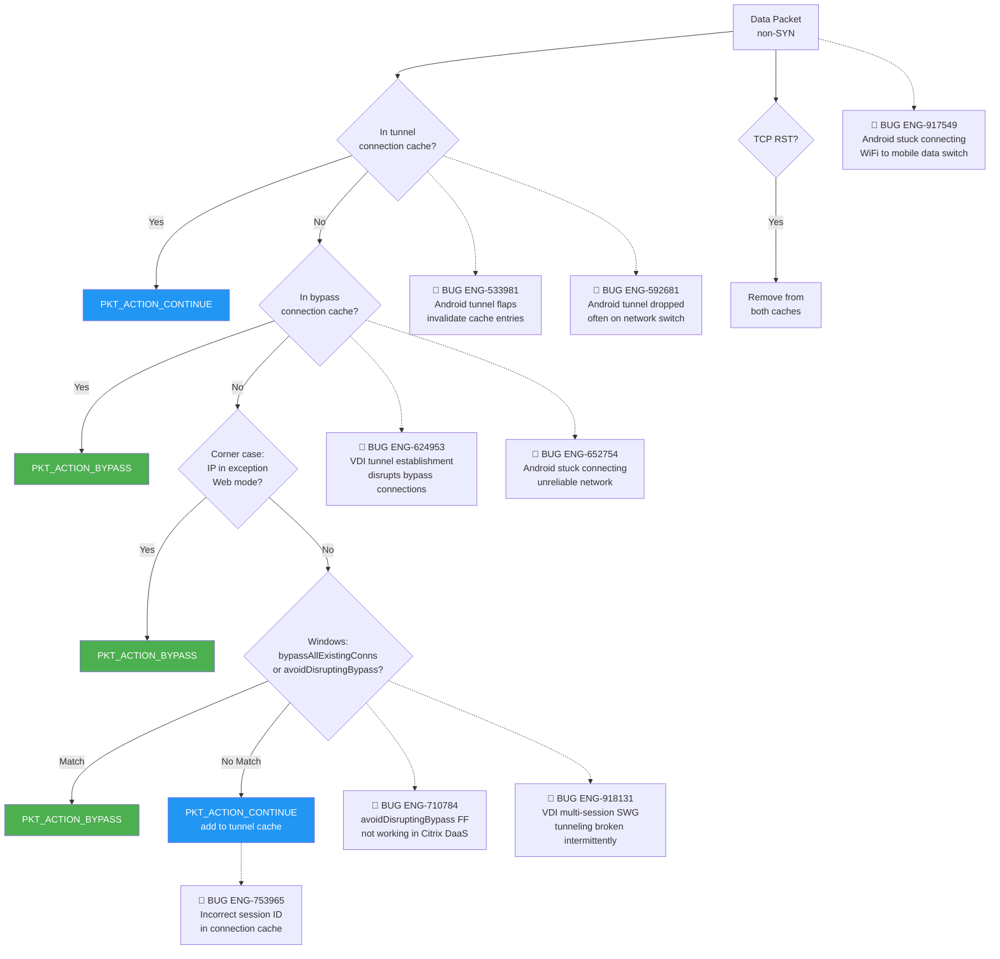
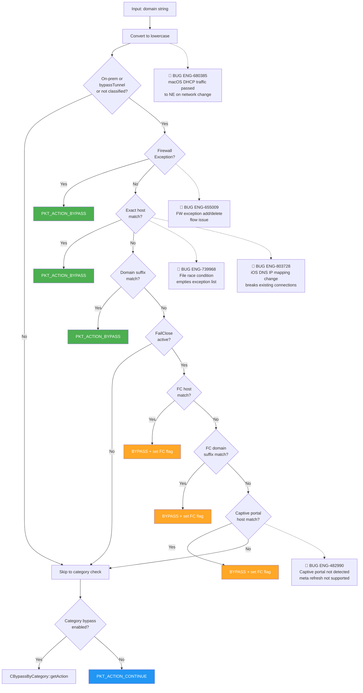
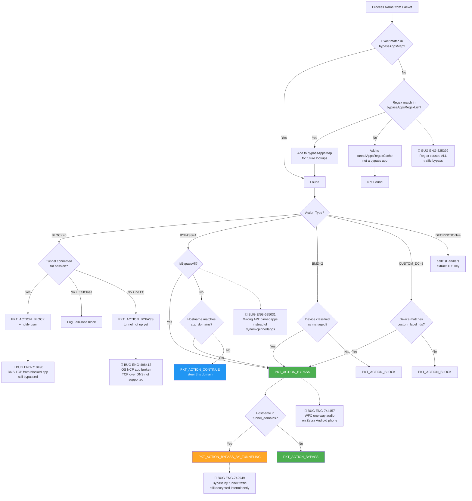
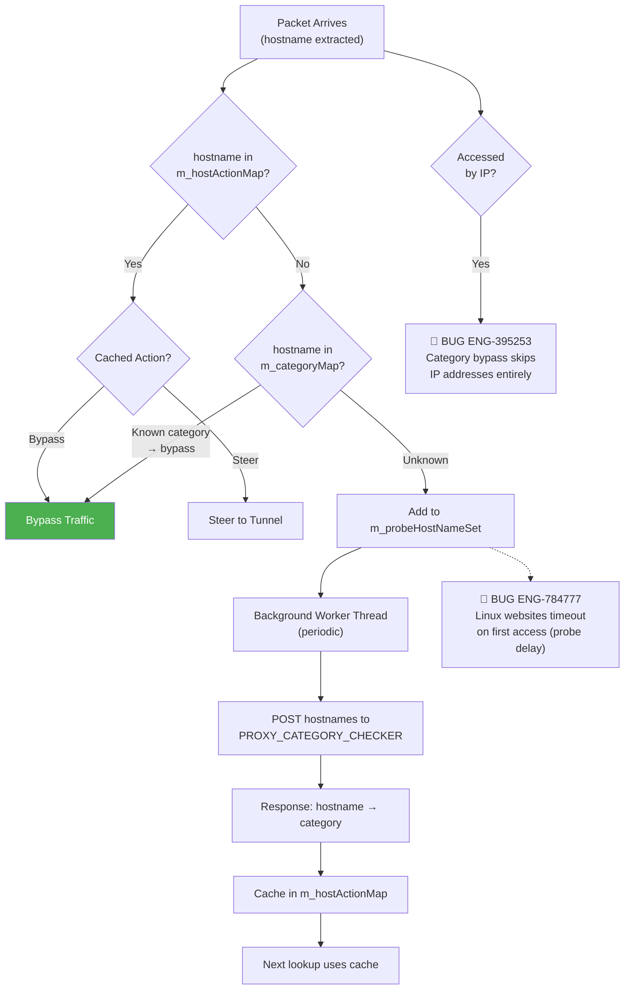
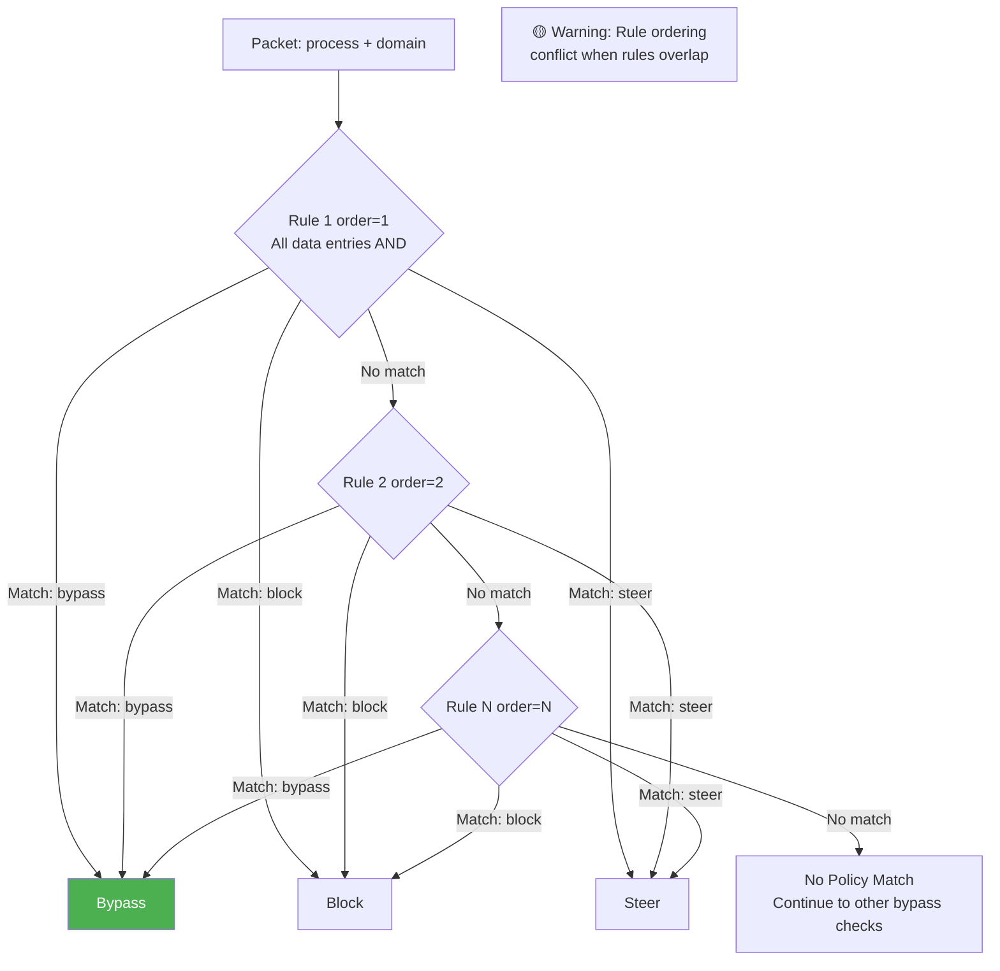
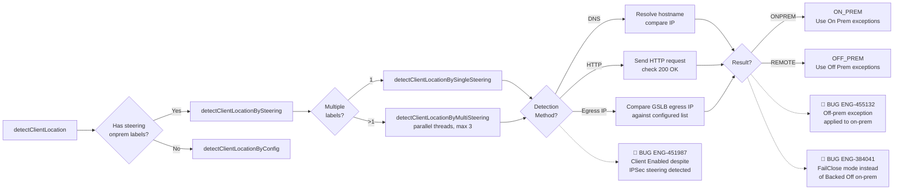
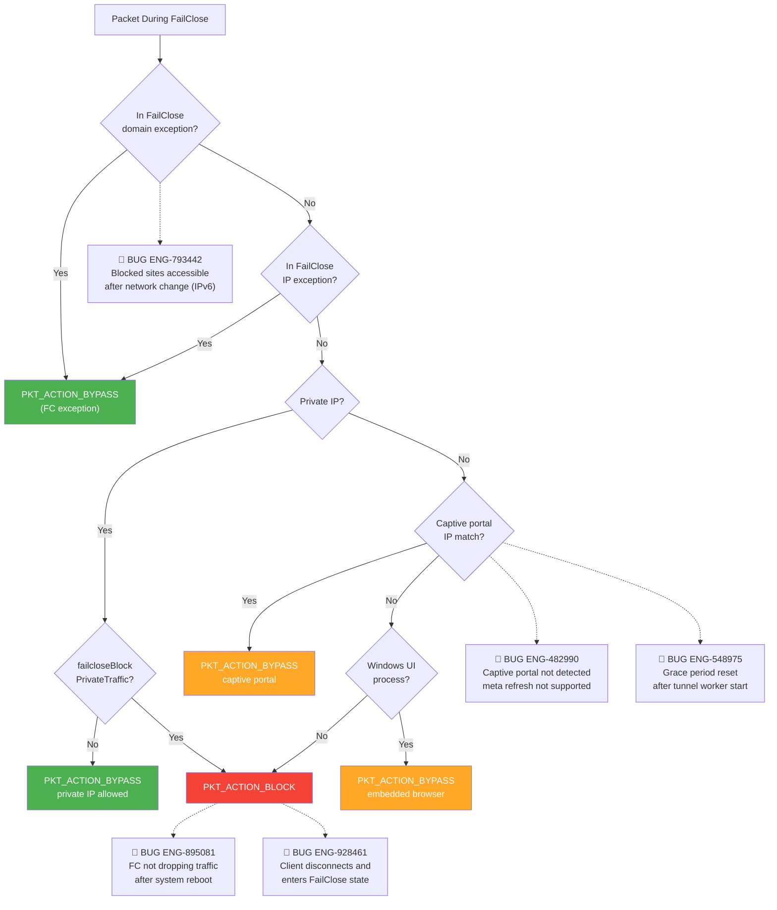
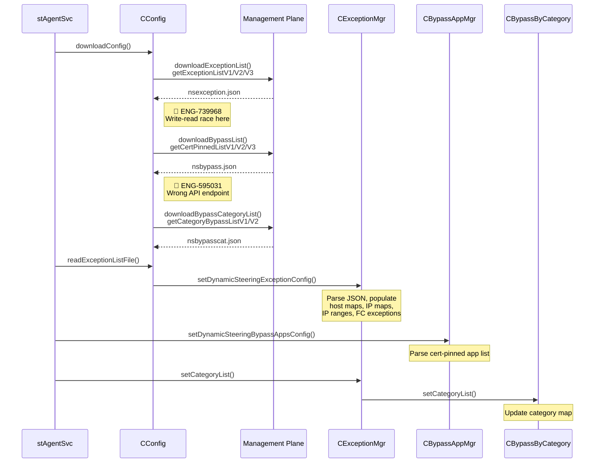

# 10. Bypass Mechanisms

**Escalation Bug Count**: 73 | **Regression**: 13 (25%) | **Day-1**: 19 (36%) | **Test Gap**: 10 (19%)

📋 **[Test Cases — Google Sheet](https://docs.google.com/spreadsheets/d/1ackCZ-EcepXw1BkSGoi5Go9Ex1I72-fXqcqLGMGiuio/edit?gid=384303965#gid=384303965)**

> This chapter covers how NSClient decides which traffic should bypass the Netskope tunnel and flow directly to its destination. The bypass subsystem is one of the most complex decision trees in the client, involving multiple exception types, config sources, platform-specific drivers, and interactions with FailClose. Each flow is illustrated with mermaid diagrams annotated with known escalation bug failure points (🔴 red) and predicted risk points (🟡 yellow). Understanding the evaluation order is critical for grey box testing because misordering or missing a check can cause either a security gap (traffic bypasses when it should be steered) or a usability failure (traffic is blocked or steered when it should be bypassed).

---

## Overview

### Why Bypass Exists

NSClient's default behavior is to steer all matching traffic through the Netskope tunnel for inspection. However, several categories of traffic must not be steered:

- **Certificate-pinned applications** --- Applications like Microsoft Teams, Zoom, and Slack perform certificate pinning. When Netskope intercepts their TLS connections and presents its own certificate, these apps reject the connection. The admin must configure these apps for bypass so they can reach their servers directly.
- **Internal/private network traffic** --- Traffic destined for RFC 1918 addresses (10.x, 172.16-31.x, 192.168.x) or admin-defined internal subnets should not leave the enterprise network.
- **Performance-sensitive traffic** --- Some categories of traffic (e.g., financial services, streaming) may be bypassed for performance or compliance reasons.
- **On-premises bypass** --- When the device is detected as being on the corporate network (on-prem), the admin may choose to bypass all or most traffic.
- **Netskope infrastructure traffic** --- The client's own traffic (config download, tunnel establishment, enrollment API calls, NPA publisher hosts) must be bypassed to avoid circular dependency.
- **FailClose exception traffic** --- Even when FailClose is blocking all traffic, certain domains, IPs, and captive portal endpoints must still be reachable.

### Design Decision: Multi-Layer Evaluation

The bypass decision is not a single check. It is a cascading evaluation performed primarily in `CBypassAppMgr::isBypassPacket()`, which delegates to `CExceptionMgr` for domain/IP exception lookups and to `CBypassByCategory` for category-based bypass. The design places **process-level checks before domain-level checks before IP-level checks**, which reflects the principle that more specific context (which application generated the packet) should take precedence over less specific context (what IP the packet is going to).

A key architectural choice is the **bypass-by-client vs. bypass-by-tunnel** option. When `bypassTunnel` is true, bypassed traffic is still sent through the tunnel but marked for pass-through on the cloud side (`PKT_ACTION_BYPASS_BY_TUNNELING`). When false, bypassed traffic goes directly to the internet without touching the tunnel at all (`PKT_ACTION_BYPASS`). This distinction matters for visibility --- bypass-by-tunnel gives the admin visibility into what was bypassed, while direct bypass is invisible to the cloud.

The highest-risk areas are: **wildcard exceptions** causing total traffic bypass (ENG-855335), **cert-pinned app regex** misconfiguration causing all traffic bypass (ENG-525399), **nsexception.json race conditions** during config update (ENG-739968), and **VDI session isolation** failures in connection caches (ENG-624953, ENG-710784).

---

## Architecture and Components

### Component Overview

```mermaid
graph TB
    subgraph "Packet Decision Engine"
        BAM[CBypassAppMgr<br/>bypassAppMgr.h/.cpp]
        BAMU[CBypassMgrUDP<br/>bypassAppMgrUDP.h/.cpp]
        EM[CExceptionMgr<br/>ExceptionMgr.h/.cpp]
        BBC[CBypassByCategory<br/>ExceptionMgr.h/.cpp]
        TPM[CTunnelPolicyMgr<br/>tunnelPolicyMgr.h/.cpp]
    end

    subgraph "Config Sources"
        EXC[nsexception.json<br/>Domain + IP Exceptions]
        BYP[nsbypass.json<br/>Cert-Pinned App List]
        CAT[nsbypasscat.json<br/>Category Bypass List]
        TP[tunnelPolicy.json<br/>Tunnel Policy Rules]
    end

    subgraph "Supporting Components"
        DOP[CDetectOnprem<br/>detectOnprem.h/.cpp]
        FD[FilterDevice / WFP / NE<br/>Platform Driver]
        FC[FailCloseMgr<br/>FailClose State]
    end

    EXC --> EM
    BYP --> BAM
    CAT --> BBC
    TP --> TPM
    DOP -->|on-prem status| EM
    DOP -->|on-prem status| BAM
    FC -->|failCloseActivated| BAM
    BAM --> BAMU
    BAM --> EM
    BAM --> BBC
    BAM --> TPM
    FD -->|packet| BAM

    BUG_RACE["🔴 BUG ENG-739968<br/>nsexception.json write-read<br/>race condition"]
    EXC -.-> BUG_RACE

    BUG_API["🔴 BUG ENG-595031<br/>Wrong API endpoint for<br/>dynamic cert-pinned list"]
    BYP -.-> BUG_API

    BUG_NPA_SVC["🔴 BUG ENG-577918<br/>NPA service not restarted<br/>after tun device reset"]
    DOP -.-> BUG_NPA_SVC

    BUG_CPU["🔴 BUG ENG-729176<br/>High CPU from massive<br/>SMB connections in Web mode"]
    FD -.-> BUG_CPU

    BUG_VPN_INTEROP["🔴 BUG ENG-805334<br/>Citrix/Cisco VPN interop<br/>DNS failure at WFP layer"]
    FD -.-> BUG_VPN_INTEROP

```

### Config File Summary

| File | Contents | Download API | Mandatory |
|------|----------|-------------|-----------|
| `nsexception.json` | Domain exceptions, IP exceptions (exact/range/subnet), local exceptions, FailClose exceptions | `getExceptionListV1/V2/V3` | Yes (Web mode); Optional (CASB/Cloud) |
| `nsbypass.json` | Cert-pinned app list with process names, actions, modes, tunnel_domains, app_domains | `getCertPinnedListV1/V2/V3` | Optional |
| `nsbypasscat.json` | Web category IDs for category-based bypass | `getCategoryBypassListV1/V2` | Optional |
| `tunnelPolicy.json` | Process + domain rules with bypass/block actions and ordering | Internal config | Optional |

### Packet Action Types

| Action | Constant | Meaning |
|--------|----------|---------|
| **Continue** | `PKT_ACTION_CONTINUE` | Steer through tunnel (default) |
| **Bypass** | `PKT_ACTION_BYPASS` | Send directly, skip tunnel |
| **Bypass by Tunneling** | `PKT_ACTION_BYPASS_BY_TUNNELING` | Send through tunnel but mark for cloud-side pass-through |
| **Block** | `PKT_ACTION_BLOCK` | Drop the packet |
| **Continue App Probing** | `PKT_ACTION_CONTINUE_APP_PROBING` | Steer through tunnel for app probing |

---

## Bypass Decision Flow

The main entry point is `CBypassAppMgr::isBypassPacket()`. This function is called from the PacketSink method of the tunnel class for every intercepted packet. The flow differs between SYN packets (first packet of a TCP connection, where the full decision is made) and subsequent data packets (which use a cached decision).

### TCP SYN Packet Decision Flow

For TCP SYN packets (or when `ignoreTCPSYN` is true), the full evaluation cascade runs. This is where the majority of bypass bugs manifest --- incorrect ordering, missing checks, or race conditions in the config data can cause traffic to take the wrong path.

**Node Risk Assessment**:

| Node | Risk | Assessment |
|---|---|---|
| Incoming TCP SYN Packet | 🔴 High | **ENG-747635** — Client crash on Windows 10 during massive connection creation/deletion churn |
| ICMP pass-through | 🟢 Low | ICMP always continues to tunnel |
| UDP Bypass Flow | 🔴 High | **ENG-448002** — UDP 3478 steered in Web mode when custom port configured; **ENG-402499** — QUIC UDP/443 traffic not steered on Android |
| IPv6 + No Hostname | 🔴 High | **ENG-654108** — IPv6 exception handling at service vs driver level causes Citrix VPN traffic issues; **ENG-671659** — iOS not honoring IPv6 local link DNS via hotspot |
| Local IP Bypass | 🟡 Medium | Depends on nsexception.json integrity (**ENG-739968** race condition) |
| Cert-Pinned App List | 🔴 High | **ENG-525399** — Regex pattern causes ALL traffic bypass; **ENG-595031** — Wrong API endpoint |
| Cert-Pin Action | 🔴 High | **ENG-718498** — DNS TCP bypassed even with cert-pinned block |
| Self-Process Bypass | 🟡 Medium | **ENG-906435** — Android client steers own traffic (Day-1) |
| Domain Exception | 🔴 High | **ENG-855335** — Wildcard 0.0.0.0/0 or ::/0 bypasses all traffic |
| IP Exception | 🟡 Medium | Range/subnet boundary handling; shares wildcard risk with domain |
| Tunnel Policy | 🟢 Low | Ordered rule evaluation, straightforward |
| FailClose Check | 🔴 High | **ENG-895081** — FailClose not enforced after reboot; **ENG-384041** — Wrong mode on-prem |
| PKT_ACTION_CONTINUE | 🟢 Low | Default path, traffic steered to tunnel |

**Confirmed Bug Mapping**:

| Flow Step | Known Bugs | Root Cause | Automation |
|---|---|---|---|
| Incoming Packet | ENG-747635 (client crash) | Crash on Windows 10 during massive concurrent connection creation/deletion | ❌ Not covered |
| UDP Bypass | ENG-448002 (UDP 3478 steered) | Custom ports with All traffic/Web mode steering and bypass combination | ❌ Not covered |
| UDP Bypass | ENG-402499 (QUIC not steered) | QUIC protocol (UDP/443) cannot be supported by proxy; Android traffic not steered | ❌ Not covered |
| IPv6 Handling | ENG-654108 (service vs driver) | R122 CFW mode change moved exception handling to service level | ❌ Not covered |
| IPv6 Handling | ENG-671659 (IPv6 local link DNS) | iOS not honoring IPv6 local link DNS when connected via hotspot | ❌ Not covered |
| Cert-Pinned Match | ENG-525399 (ALL traffic bypass) | Native apps regex on cert-pinned apps bypasses everything | ❌ Not covered |
| Cert-Pinned Match | ENG-595031 (wrong API) | Client calls `steering/pinnedapps` instead of `steering/dynamicpinnedapps` | ❌ Not covered |
| Cert-Pinned Block | ENG-718498 (DNS TCP leak) | DNS TCP traffic from blocked cert-pinned app is bypassed | ❌ Not covered |
| Domain Exception | ENG-855335 (wildcard bypass) | `::/0` or `0.0.0.0/0` exception converts to range covering all IPs | ❌ Not covered |
| FailClose Check | ENG-895081 (FC not enforced) | FailClose not dropping traffic after reboot when NSGW unreachable | ⚠️ Partial — `fail_close/test_p0.py` |

**Predicted Risk Points (No Known Escalation)**:

| Flow Step | Predicted Risk | Potential Impact | Automation |
|---|---|---|---|
| nsdiag Action | nsdiag special action bypass could be abused | Diagnostic traffic bypass during FailClose | ❌ Not covered |
| Self-Process Detection | Process ID spoofing | Malicious process mimicking stAgentSvc PID | ❌ Not covered |
| Tunnel Policy Ordering | Rule ordering conflict when rules overlap | Ambiguous bypass/block decision | ❌ Not covered |

### Data Packet (Non-SYN) Flow

For subsequent data packets in an established connection, the bypass decision is cached. VDI environments are particularly vulnerable because the connection caches are not session-isolated.

**Confirmed Bug Mapping**:

| Flow Step | Known Bugs | Root Cause | Automation |
|---|---|---|---|
| Tunnel Connection Cache | ENG-533981 (tunnel flaps) | Android tunnel flaps during DNS health check cause bypass cache invalidation | ❌ Not covered |
| Tunnel Connection Cache | ENG-592681 (tunnel dropped) | Android tunnel dropped often on WiFi/5G network switch; recovery mechanism bug leaves both tunnels disconnected | ❌ Not covered |
| Bypass Connection Cache | ENG-624953 (VDI disruption) | Connection caches not session-isolated; tunnel establishment clears bypass entries | ❌ Not covered |
| Bypass Connection Cache | ENG-652754 (stuck connecting) | Android client stuck in connecting state on unreliable network; bypass decisions stalled | ❌ Not covered |
| Data Packet Entry | ENG-917549 (stuck connecting) | WiFi-to-mobile-data switch triggers tunnel disconnect; UI not updated with latest tunnel state | ❌ Not covered |
| bypassAllExistingConns | ENG-710784 (FF not working) | `avoidDisruptingBypass` FF insufficient for Citrix DaaS, needs `bypassAllExistingConnections` | ❌ Not covered |
| bypassAllExistingConns | ENG-918131 (VDI SWG broken) | Multi-session VDI concurrent logon causes tunnel build delay (~20s); SWG traffic bypassed intermittently | ❌ Not covered |
| Session ID Caching | ENG-753965 (wrong session ID) | User re-login generates new session ID, old cache entries point to stale session | ❌ Not covered |

---

## Bypass Types in Detail

### 1. Domain and IP Exceptions (nsexception.json)

Domain and IP exceptions are the most common bypass mechanism. They are configured by the admin in the Netskope UI and downloaded as `nsexception.json`. The file contains two top-level sections: regular exceptions and FailClose exceptions.

When dynamic steering is enabled and the client is on-prem, the exception list has an `"On Prem"` / `"Off Prem"` structure at the top level. `CExceptionMgr::setDynamicSteeringExceptionConfig()` selects the appropriate sub-tree based on the client's current location. FailClose exceptions are always at the top level (they apply regardless of on-prem/off-prem status).

The highest risk in this area is the wildcard exception (ENG-855335): if an admin configures `0.0.0.0/0` or `::/0`, the range conversion covers all IP addresses, causing total bypass.

**Exception Type Details**:

| Type Tag | Data Structure | Matching Logic |
|----------|---------------|----------------|
| `ip` | `ExceptionIPMap` (exact string map) | Exact IP string match via `map::find()` |
| `range` | `ExceptionIPRangeList` (start/end pairs) | Numeric comparison: `start <= ip <= end` |
| `subnet` | `ExceptionIPRangeList` (converted from CIDR) | Same as range after CIDR-to-range conversion |
| `local-ip` | `m_localExceptionIPsMap` | Exact match, only checked for private IPs |
| `local-range` | `m_localExceptionIPRangesList` | Range match, only checked for private IPs |
| `local-subnet` | `m_localExceptionIPRangesList` | Range match after CIDR conversion |

**Domain Matching Logic**: Wildcard entries like `*.example.com` are stored as `.example.com` in `m_exceptionDomainsList` (the asterisk is stripped). Matching is done by suffix comparison. Exact hostnames are stored in `m_exceptionHostsMap` and matched via exact `map::find()`.

### 2. Cert-Pinned App Bypass (nsbypass.json)

Cert-pinned app bypass is the most feature-rich bypass type. It matches traffic based on the **process name** that generated the packet, combined with optional **domain matching** and **device classification** conditions. This area has the densest concentration of escalation bugs — 6 confirmed bugs span process matching, domain filtering, and action handling.

**Action Values**:

| Value | Constant | Behavior |
|-------|----------|----------|
| 0 | `CERTPINNED_ACTION_BLOCK` | Block traffic regardless of device status |
| 1 | `CERTPINNED_ACTION_BYPASS` | Bypass traffic regardless of device status |
| 2 | `CERTPINNED_ACTION_BMD` | Bypass only if device is classified as **managed** |
| 3 | `CERTPINNED_ACTION_CUSTOM_DC_BYPASS` | Bypass only if device matches a **custom label ID** |
| 4 | `CERTPINNED_ACTION_DECRYPTION` | Decrypt cert-pinned traffic (TLS key extraction) |

**Confirmed Bug Mapping**:

| Flow Step | Known Bugs | Root Cause | Automation |
|---|---|---|---|
| Regex Match | ENG-525399 (ALL traffic bypass) | Native apps + regex on cert-pinned apps causes broad match | ❌ Not covered |
| API Endpoint | ENG-595031 (wrong API) | Client calls `steering/pinnedapps` instead of `steering/dynamicpinnedapps` with Secure Config + Dynamic Steering | ❌ Not covered |
| Block Action | ENG-718498 (DNS TCP leak) | DNS TCP traffic from blocked cert-pinned app bypasses block | ❌ Not covered |
| Block Action (iOS) | ENG-496412 (NCP app broken) | TCP over DNS not supported on iOS; app broken when NSClient enabled | ❌ Not covered |
| Bypass Action (Android) | ENG-744457 (WFC one-way audio) | Regression from ENG-673392 fix causes one-way audio for WFC app on Zebra phone | ❌ Not covered |
| Bypass by Tunnel | ENG-742949 (intermittent decrypt) | Traffic marked for bypass-by-tunnel still decrypted intermittently via proxy | ⚠️ Partial — `ssl_pinned_app/test_p0.py` (C1257901, C1257902) |
| Process Match (Android) | ENG-499052 (Teams not enforced) | Cert-pinned exceptions not enforced at OS level from R112.1 | ❌ Not covered |
| Process Match (Android) | ENG-707515 (Google workspace) | `com.google.android.gms` in default bypass list causes reverse proxy issue | ❌ Not covered |

### 3. Category Bypass (nsbypasscat.json)

Category bypass allows admin to bypass traffic based on the URL category (e.g., Financial Services, Health). This is only active in **Web mode** (`m_webMode = true`). The fundamental limitation is that category bypass only probes hostnames, not IP addresses (ENG-395253).

### 4. Tunnel Policy (tunnelPolicy.json)

Tunnel policy provides ordered rules that match on process name and/or domain to produce bypass or block actions. Unlike the other bypass types, tunnel policy rules have an **explicit ordering** --- rules are evaluated in order, and the first match wins.

### 5. On-Prem Bypass

On-prem bypass is not a separate exception mechanism; rather, it modifies **which set of exceptions** are active. This area has caused multiple FailClose-related bugs because the on-prem detection result affects both exception selection and FailClose behavior simultaneously.

**Confirmed Bug Mapping**:

| Flow Step | Known Bugs | Root Cause | Automation |
|---|---|---|---|
| Detection Method | ENG-451987 (Enabled despite IPSec) | Client status changed to Enabled even though IPSec steering method was detected; GRE/IPSec bypass not honored | ❌ Not covered |
| Exception Set Selection | ENG-455132 (wrong set applied) | Off-prem ICMP exception applied while on-prem (before R107) | ⚠️ Partial — `dynamic_steering/test_p0.py` (C1257897, C1257898) |
| FailClose + On-Prem | ENG-384041 (wrong mode) | Flexible Dynamic Steering not handling on-prem + steering=None | ⚠️ Partial — `nplan_4571/test_nplan_4571_failclose.py` |
| FailClose + Config Update | ENG-422599 (FC after update) | Dynamic steering change triggers config reload race with FailClose | ⚠️ Partial — `nplan_4571/test_nplan_4571_failclose.py` |

### 6. Self-Process and Infrastructure Bypass

The client automatically bypasses its own traffic to prevent circular dependency. On Android, a Day-1 bug (ENG-906435) causes the client to steer its own management plane traffic through the tunnel. On Linux, a separate issue (ENG-453051) causes the client service to receive SIGTERM, terminating the bypass evaluation entirely and leaving traffic unsteered.

- **Self process ID**: `m_selfProcessId` is set during initialization. All packets from `stAgentSvc` are bypassed.
- **UI process**: `isUIProcess()` checks if the packet originated from the NSClient UI. On Windows during FailClose, UI process traffic is always bypassed (for captive portal embedded browser).
- **NPA hosts**: When NPA is enabled, `npaHost`, `npaLBHost`, and `npaTenant` are added to the host exception map.
- **Registered client apps**: Other Netskope components (e.g., nsauxiliarysvc) can register via `registerBypassClientApp()`.
- **Linux SIGTERM risk**: **ENG-453051** — Multiple SIGTERM issues on Linux cause the client service to restart, disrupting all bypass decisions during the restart window.

---

## FailClose Bypass

When FailClose is active (tunnel is down and FailClose policy is enforced), the client blocks most traffic. However, certain traffic must still be allowed. The FailClose bypass evaluation has its own dedicated exception lists and interacts with the main bypass cascade in critical ways.

### FailClose Exception Evaluation

**What Is Allowed During FailClose**:

| Traffic Type | Mechanism | Source |
|-------------|-----------|--------|
| FailClose exception domains | `m_exceptionFailCloseHostsMap` / `m_exceptionFailCloseDomainsList` | `fail_close.domains` in nsexception.json |
| FailClose exception IPs | `m_exceptionFailCloseIPsMap` | `fail_close.ips` in nsexception.json |
| Private IPs | `nstcpiputil::isPrivateIp()` | Hardcoded unless `failcloseBlockPrivateTraffic` config is set |
| Captive portal hosts | `m_exceptionCaptivePortalHostMap` / `m_exceptionCaptivePortalIPsMap` | Dynamically detected captive portal URLs |
| Addon checker / auth proxy | Hostname comparison in `isBypassPacket()` | Config-provided hostnames |
| UI process traffic (Windows) | `isUIProcess()` check | Runtime PID matching |
| Event forwarder host | Added to FC host map | Config-provided hostname |

**Critical Interaction**: When FailClose is active and the packet action is `PKT_ACTION_BYPASS_BY_TUNNELING`, but the traffic matches a FailClose exception, the action is downgraded to `PKT_ACTION_BYPASS` (direct bypass). This is because bypass-by-tunneling requires a working tunnel, which is unavailable during FailClose.

---

## Exception Matching Priority

The complete priority ordering across the entire `isBypassPacket()` call:

| Priority | Check | Component | Config Source |
|----------|-------|-----------|--------------|
| 1 | ICMP pass-through | `isBypassPacket()` | Hardcoded |
| 2 | UDP bypass | `CBypassMgrUDP` | Multiple |
| 3 | IPv6 no-hostname bypass | `isBypassPacket()` | `blockAllExistingIpv6ConnsNoHostname` |
| 4 | Addon/auth proxy host | `isBypassPacket()` | Config hostnames |
| 5 | nsdiag special action | `isNSDiagPacketAction()` | Runtime flag |
| 6 | Local IP bypass | `localIPBypass()` | `nsexception.json` (local-* types) |
| 7 | Cert-pinned app (process match) | `isProcessInBypassAppListAndForwardInfoToUI()` | `nsbypass.json` |
| 8 | Self-process / UI process | PID comparison | Runtime |
| 9 | Registered client apps | `m_bypassClientApps` | Runtime registration |
| 10 | Domain exception (exact host) | `isHostNameinExceptionList()` | `nsexception.json` |
| 11 | Domain exception (suffix) | `isDomainNameinExceptionList()` | `nsexception.json` |
| 12 | FailClose domain exception | FC host/domain maps | `nsexception.json` fail_close section |
| 13 | Captive portal exception | Captive portal maps | Runtime detection |
| 14 | Category bypass | `CBypassByCategory::getAction()` | `nsbypasscat.json` |
| 15 | IP exception (exact) | `isIPinExceptionList()` | `nsexception.json` |
| 16 | IP exception (range/subnet) | `isIPinExceptionRange()` | `nsexception.json` |
| 17 | FailClose IP exception | `isFailcloseException()` | `nsexception.json` fail_close section |
| 18 | Tunnel policy | `applyTunnelPolicy()` | `tunnelPolicy.json` |
| 19 | FailClose BBT-to-bypass conversion | `isBypassPacket()` | Runtime |

---

## Config Download and Update

The three bypass config files are downloaded during the main config download cycle in `CConfig`. The race condition between writing and reading `nsexception.json` (ENG-739968) is protected by `m_exceptionFileReadWriteLock`.

**API Versions**: The download API version depends on `useSteeringConfigV2` and `dynamicSteeringState`:
- **V1**: Legacy, uses `orgKey` only
- **V2**: Steering V2, uses `orgKey` + `userKey` + `userCert`
- **V3**: Dynamic steering, supports on-prem/off-prem subtrees

---

## Windows

**Bug Count**: 24 | **Key Gaps**: VDI bypass isolation, CFW exception handling, session ID caching, VPN interop, client crash, high CPU

Windows bypass implementation uses the WFP (Windows Filtering Platform) callout driver for packet interception and `nstcpiputil::getAppName()` for process name retrieval via TCP table lookup. Windows has the largest share of bypass bugs due to VDI environments, CFW mode interactions, and complex driver-level vs service-level exception handling.

| Aspect | Details |
|--------|---------|
| **Driver** | WFP callout driver |
| **Exception Delivery** | `NSExceptions::serialize()` pushes firewall rules to driver via IOCTL; domain/IP exceptions also evaluated in service layer |
| **Cert-Pin Detection** | Process name via `nstcpiputil::getAppName()` using TCP table lookup |
| **UI Process Bypass** | During FailClose, `isUIProcess()` walks parent chain (up to 2 levels) for captive portal browser |
| **Existing Connections** | `bypassAllExistingConns` and `avoidDisruptingBypass` flags for connections established before client start |
| **Self-Protection** | `handleExceptionsAtDriver` feature flag controls IPv4/IPv6 exception handling level (ENG-654108) |
| **VPN Interop** | ENG-805334 — Citrix Secure Access WFP mode + `injectDNSAtNetworkLayer` flag conflicts with Cisco AnyConnect |
| **High CPU** | ENG-729176 — Massive SMB connections in Web mode cause high CPU on Domain Controller; non-web traffic should not be handled by driver |
| **Client Stability** | ENG-747635 — Client crash on Windows 10 during rapid connection churn (massive create/delete) |
| **VDI Multi-Session** | ENG-918131 — Multi-session VDI concurrent logon causes ~20s tunnel build delay; SWG traffic broken intermittently |
| **FailClose Disconnect** | ENG-928461 — Client disconnects and enters FailClose state for multiple users |
| **Steering Method** | ENG-451987 — Client status changed to Enabled despite IPSec steering method detection |
| **Network Change** | ENG-793442 — Blocked websites accessible after network change due to IPv6 processing delay |

## macOS

**Bug Count**: 5 | **Key Gaps**: Wildcard exception, IPv4-mapped IPv6 handling, DHCP on network change

macOS bypass uses the Network Extension (NE) with Transparent Proxy and DNS Proxy. Key macOS-specific behaviors include IPv4-mapped IPv6 address conversion, NE flow packet handling, and a special Google Drive SNI workaround.

| Aspect | Details |
|--------|---------|
| **Driver** | Network Extension (NE) with Transparent Proxy and DNS Proxy |
| **Exception Delivery** | NE receives domain exceptions via `getNEExceptionList()` and IP exceptions via `getNEIPExceptionList()` / `getNEIpExceptionCIDR()` |
| **IPv4-Mapped IPv6** | `convertIpv4MappedIpv6toIpv4ForMacForException()` handles `::ffff:10.0.0.1` → `10.0.0.1` conversion |
| **DNS Proxy** | Exception domains pushed to DNS Proxy via `m_neExceptionDomainList` |
| **Google Drive Hack** | Special SNI replacement for `.googleusercontent.com` domains |
| **DHCP Bypass** | ENG-680385 — Apple macOS 15.4/15.5 bug passes DHCP traffic to NE transparentProxy on network change; fix excludes DHCP via excludeRules |

## Linux

**Bug Count**: 2 | **Key Gaps**: Exception route conversion edge cases, SIGTERM client restart, first-access timeout

Linux bypass uses a TUN/TAP virtual interface (VIF) with iptables rules. IP range exceptions are converted to exclude routes via `getExcludeRoutes()`.

| Aspect | Details |
|--------|---------|
| **Driver** | TUN/TAP virtual interface (VIF) with iptables rules |
| **Exception Delivery** | IP range exceptions converted to exclude routes via `getExcludeRoutes()` |
| **Process Detection** | Uses `program_invocation_short_name` for self-process identification |

### Linux-Specific Bugs

| Bug ID | Problem Summary | Root Cause | Fix |
|--------|----------------|-----------|-----|
| **ENG-453051** | Multiple SIGTERM issues crash client service | Client service restart on SIGTERM disrupts all bypass decisions | Fix SIGTERM signal handling |
| **ENG-784777** | Websites timeout on first access | Category probe delay causes first-time access timeout on Linux; ACK handling with limited port range | Limit port range and verify ACK flow |

---

## Android

**Bug Count**: 12 | **Key Gaps**: Cert-pinned enforcement at OS level, default bypass list, self-traffic steering, QUIC protocol, tunnel stability, NPA restart

Android bypass has unique challenges: per-app VPN exclusion at the OS level, cert-pinned app enforcement differences from R112.1 onward, and a default bypass list that can cause unexpected reverse proxy behavior.

| Aspect | Details |
|--------|---------|
| **Driver** | VpnService-based packet interception |
| **Per-App VPN** | `bypassIpExceptionAtAndroidOs` FF controls OS-level bypass |
| **Cert-Pin Mode** | `mode` field defaults to `"direct"` if missing from config |
| **User Notification** | Blocked app notifications via `notifyBlockAppToUser()` JNI callback |

### Android-Specific Bugs

| Bug ID | Problem Summary | Root Cause | Fix |
|--------|----------------|-----------|-----|
| **ENG-499052** | Teams cert-pinned not enforced | Cert-pinned exceptions not enforced at OS level from R112.1 | Fix OS-level enforcement |
| **ENG-525399** | CertPinned regex causes ALL traffic bypass | Native apps + regex match too broadly | Restrict regex scope |
| **ENG-490822** | WFC one-way audio on Zebra phone | Bypass by tunnel vs bypass by client interaction | Review bypass mode cases |
| **ENG-454765** | Bypassed traffic not handled properly | No test setup for Android bypass | Add Android bypass test infra |
| **ENG-707515** | Google workspace forced via reverse proxy | `com.google.android.gms` in default bypass list | Review default bypass list |
| **ENG-906435** | Client steers own MP traffic | Self-process bypass not working on Android | Fix self-traffic detection |
| **ENG-402499** | QUIC traffic not steered | QUIC protocol (UDP/443) not supported by proxy; traffic not steered on Android | Drop QUIC packets or add QUIC handling |
| **ENG-533981** | Tunnel flaps on Android | DNS tunnel health check failures cause tunnel instability and bypass cache invalidation | Add DNS health check test coverage |
| **ENG-592681** | Tunnel dropped often | Network switch (WiFi/5G) causes tunnel disconnect; recovery mechanism leaves both tunnels down | Re-implement recovery mechanism |
| **ENG-652754** | Stuck in connecting state | Unreliable network causes client stuck connecting; bypass decisions stalled | Fix tunnel state management |
| **ENG-744457** | WFC one-way audio on Zebra phone | Regression from ENG-673392 fix breaks cert-pinned bypass for WFC | Improve cert-pinned validation steps |
| **ENG-917549** | Stuck connecting on network switch | WiFi-to-mobile-data switch triggers tunnel disconnect; UI shows stale CONNECTING state | Update UI with latest tunnel state |

## iOS

**Bug Count**: 5 | **Key Gaps**: Domain-only cert-pin matching, NPA + private IP conflict, IPv6 local link DNS, DNS IP mapping race, TCP over DNS

iOS cannot get process information from packets. Cert-pinned app matching is **domain-based only** using `m_bypassAppsDomainsMap`. This fundamentally changes the bypass behavior compared to other platforms.

| Aspect | Details |
|--------|---------|
| **Driver** | NEPacketTunnelProvider |
| **Process Detection** | Not available; cert-pinned matching is domain-based only |
| **Domain Map** | `m_bypassAppsDomainsMap` maps domain -> pair(appName, action) |

### iOS-Specific Bugs

| Bug ID | Problem Summary | Root Cause | Fix |
|--------|----------------|-----------|-----|
| **ENG-672788** | Internal website access broken | NPA prevents system-level private IP bypass on iOS | Corner case: NPA + private IP conflict |
| **ENG-450735** | Internal apps inaccessible after R114 | Regression from ENG-441957 fix affecting steering exceptions | Monthly regression coverage |
| **ENG-496412** | NCP app broken when client enabled | TCP over DNS not supported on iOS; taken as enhancement | Add TCP over DNS support |
| **ENG-671659** | IPv6 local link DNS not honored | iOS hotspot DNS with IPv6 local link address not setting scope_id on destination socket | Fix IPv6 link-local scope_id handling |
| **ENG-803728** | Blank page for microsoftonline.com | Two consecutive DNS queries return different IPs; iOS app updates IP mapping breaking existing connections | Retain existing connection mapping on IP change |

---

## ChromeOS

**Bug Count**: 3 | **Key Gaps**: NPA bypass at OS level, large config crash, NPA service restart

ChromeOS uses a Chrome extension and shares Android's `bypassIpExceptionAtAndroidOs` feature flag, which can cause all exception IPs to be bypassed at OS level instead of by the NSClient app.

| Aspect | Details |
|--------|---------|
| **Driver** | Chrome extension via Chrome APIs |
| **OS-Level Bypass** | `bypassIpExceptionAtAndroidOs` FF affects ChromeOS too |

### ChromeOS-Specific Bugs

| Bug ID | Problem Summary | Root Cause | Fix |
|--------|----------------|-----------|-----|
| **ENG-637794** | NPA traffic not tunneling | `bypassIpExceptionAtAndroidOs` FF bypasses all exception IPs at OS level | Fix FF scope for NPA traffic |
| **ENG-872456** | 30K+ domains crash | Large steering config exceeds buffer limit | Add buffer size handling |
| **ENG-577918** | NPA service not restarted automatically | Client disable/enable to reset tun device disables NPA but fails to re-enable it | Fix NPA service lifecycle on tun reset |

---

## Cross-Flow Interactions

Bypass mechanisms interact with nearly every other NSClient subsystem. The bypass decision is called on every intercepted packet, and its correctness depends on config download (Ch04), steering config (Ch05), tunnel state (Ch07), on-prem detection (Ch05), FailClose state (Ch11), and device classification (Ch12).

### Cross-Flow Risk Matrix (Bypass-Relevant)

| Interaction | Known Bugs | Severity | Test Priority |
|---|---|---|---|
| Bypass + FailClose | ENG-895081, ENG-384041, ENG-422599, ENG-482990, ENG-548975, ENG-752117, ENG-928461, ENG-793442 | **S1** | P1 |
| Bypass + VDI/DaaS | ENG-624953, ENG-710784, ENG-753965, ENG-918131 | **S1** | P1 |
| Bypass + CFW Mode | ENG-654108, ENG-655009, ENG-685566, ENG-398387 | **S2** | P1 |
| Bypass + Dynamic Steering | ENG-455132, ENG-595031, ENG-637794, ENG-451987 | **S2** | P2 |
| Bypass + NPA | ENG-672788, ENG-637794, ENG-577918 | **S2** | P2 |
| Bypass + Cert-Pinned + Tunnel | ENG-742949, ENG-649593, ENG-496412, ENG-744457 | **S2** | P2 |
| Bypass + Config Download | ENG-739968 | **S2** | P2 |
| Bypass + Large Config | ENG-872456 | **S2** | P2 |
| Bypass + Tunnel Stability (Android) | ENG-533981, ENG-592681, ENG-652754, ENG-917549 | **S2** | P1 |
| Bypass + QUIC Protocol | ENG-402499 | **S2** | P2 |
| Bypass + VPN Interop | ENG-805334 | **S2** | P2 |
| Bypass + Client Stability | ENG-747635, ENG-453051, ENG-729176 | **S2** | P2 |
| Bypass + IPv6 | ENG-671659, ENG-793442 | **S2** | P2 |
| Bypass + DNS IP Mapping | ENG-803728 | **S2** | P2 |
| Bypass + DHCP (macOS) | ENG-680385 | **S3** | P2 |

## Troubleshooting

### Log Keywords

| Keyword / Pattern | Meaning |
|-------------------|---------|
| `"Adding Domain %s to Exception List"` | Domain added to exception list during parsing |
| `"Host %s is found in ExceptionList"` | Domain matched an exception, will be bypassed |
| `"IP %s is found in IP address range Exception List"` | IP matched a range/subnet exception |
| `"Bypassing connection from process: %s"` | Cert-pinned app bypass triggered |
| `"Bypassing connection by tunneling"` | Bypass-by-tunnel action |
| `"Dropping connection from process: %s"` | Cert-pinned app block action |
| `"Bypass category json to proxy"` | Category check sent to proxy |
| `"FailClosed:Bypassing Fail Close exception"` | FailClose exception bypass conversion |
| `"firewall domain exception matched bypassing"` | Firewall mode exception matched |
| `"Bypassing ipv6 connection (no hostname)"` | IPv6 no-hostname bypass |
| `"Process %s not found bypass list"` | Process not in cert-pin list, will be steered |

---

## Automation Coverage Summary

| Test Suite | Tests | Coverage Area | Key Test IDs |
|---|---|---|---|
| `exception_domains/test_p0.py` | 5 | Domain exceptions (basic, on-prem, off-prem, cert-pinned on/off-prem) | C1159886, C1257899, C1257900 |
| `ssl_pinned_app/test_p0.py` | 6 | SSL pinned bypass, drop, web mode, on-prem, off-prem | C1159883-C1159885, C1257896, C1257901, C1257902 |
| `dynamic_steering/test_p0.py` | 2 | On-prem/off-prem dynamic steering + tunneling | C1257897, C1257898 |
| `custom_steering_configuration/test_p0.py` | 1 | Custom steering with OU/UG/OS | — |
| `cfw/test_p0.py` | 2 | FTP traffic tunneling/bypassing with CFW | C1312021 |
| `fail_close/test_p0.py` | 1 | FailClose with DSE + exception bypass | — |
| `nplan_5628/test_nplan_5628.py` | 15 | Combinational on-prem profiles (DNS/HTTP/IPRANGE) | C2457049 (6), C2411441 (8), C2456980 |
| `nplan_4571/test_nplan_4571_failclose.py` | 3 | FailClose + steering + exception bypass | C2642120, C2642121, C2642122 |
| **Total** | **35** | | **22 unique test IDs** |

### Coverage Gaps

| Gap Area | Bug References | Priority |
|---|---|---|
| IP range/subnet boundary testing | ENG-855335 | P1 |
| Cert-pinned regex scope validation | ENG-525399 | P1 |
| DNS TCP leak through cert-pinned block | ENG-718498 | P1 |
| Category bypass with IP access | ENG-395253 | P2 |
| VDI session isolation for bypass cache | ENG-624953, ENG-710784, ENG-918131 | P1 |
| nsexception.json race condition | ENG-739968 | P2 |
| Large domain list (30K+) | ENG-872456 | P2 |
| Android self-traffic steering | ENG-906435 | P2 |
| Session ID caching after re-login | ENG-753965 | P2 |
| BMD / Custom DC bypass actions | — | P2 |
| QUIC protocol handling (Android) | ENG-402499 | P2 |
| Android tunnel stability / flaps | ENG-533981, ENG-592681, ENG-652754, ENG-917549 | P1 |
| WFC cert-pinned bypass on Zebra | ENG-744457 | P2 |
| Client crash under connection churn | ENG-747635 | P2 |
| High CPU on Domain Controller | ENG-729176 | P2 |
| Citrix/Cisco VPN interop at WFP | ENG-805334 | P2 |
| iOS IPv6 local link DNS | ENG-671659 | P2 |
| iOS DNS IP mapping race | ENG-803728 | P2 |
| macOS DHCP on network change | ENG-680385 | P2 |
| Linux first-access timeout | ENG-784777 | P2 |
| Linux SIGTERM service restart | ENG-453051 | P2 |
| Network change bypass enforcement | ENG-793442 | P1 |
| NPA service restart (Android/ChromeOS) | ENG-577918 | P2 |
| IPSec steering method bypass | ENG-451987 | P2 |
| FailClose disconnect state | ENG-928461 | P1 |
| iOS NCP app TCP over DNS | ENG-496412 | P2 |

---

## Related Chapters

- [05_steering_config.md](05_steering_config.md) --- Steering config defines the source of bypass rules including dynamic steering on-prem/off-prem structure
- [09_traffic_steering.md](09_traffic_steering.md) --- Bypass is the exception to normal traffic steering; steering is the default action
- [11_failclose.md](11_failclose.md) --- FailClose interacts with bypass rules; only FailClose-specific exceptions are allowed through
- [04_config_download.md](04_config_download.md) --- Config download cycle delivers nsexception.json, nsbypass.json, nsbypasscat.json
- [12_device_classification.md](12_device_classification.md) --- Device classification status determines BMD and custom DC bypass actions
- [14_proxy_management.md](14_proxy_management.md) --- Proxy detection affects exception evaluation (proxy packets have special handling)

---

## Appendix A: Bug Quick Reference

> Problem summaries, root causes, and fixes for all bypass-related bugs referenced in this chapter. Sorted by Bug ID for quick lookup.

| Bug ID | Problem Summary | Root Cause | Fix | Platform |
|--------|----------------|-----------|-----|----------|
| **ENG-384041** | FailClose mode instead of Backed Off on-prem | Flexible Dynamic Steering enhancement not handling on-prem + steering=None | Fix on-prem FailClose behavior | Windows |
| **ENG-395253** | Category bypass doesn't match IP access | `getAction()` only probes hostnames, skips IP addresses | Configure IP exception instead of category bypass (workaround) | Mac |
| **ENG-398387** | CFW not recognizing traffic as belonging to CFW app | Day-1 issue with Cloud Firewall app recognition | Fix CFW traffic classification | Win/Mac |
| **ENG-422599** | FailClose after config update with dynamic steering | Regression from Flexible Dynamic Steering change (ENG-182503) | Fix config reload race with FailClose | Windows |
| **ENG-438565** | Large TCP segmented packets from loopback dropped | Loopback communication issue with NSClient enabled | Fix loopback packet handling | Windows |
| **ENG-448002** | UDP 3478 steered in Web mode with custom ports | Steering and bypass combination issue for custom UDP ports | Fix UDP bypass for custom port configurations | Windows |
| **ENG-450735** | Internal apps inaccessible after R114 upgrade | Regression from ENG-441957 fix affecting steering exceptions | Add monthly regression coverage | iOS |
| **ENG-454765** | Android bypassed traffic not handled properly | No test setup to validate Android bypass | Add Android bypass test infrastructure | Android |
| **ENG-455132** | Off-prem exception applied while on-prem | Legacy bug: off-prem ICMP exception applied regardless of location | Fix exception set selection by location | Windows |
| **ENG-482990** | Captive portal not detected | NSClient doesn't support meta refresh HTTP redirection for captive portal | Add meta refresh detection | Win/Mac |
| **ENG-490822** | WFC one-way audio on Zebra phone | Bypass by tunnel vs bypass by client interaction issue | Review bypass mode selection | Android |
| **ENG-499052** | Teams cert-pinned not enforced on Android | Cert-pinned exceptions not enforced at OS level from R112.1 | Fix OS-level enforcement | Android |
| **ENG-525399** | CertPinned regex causes ALL traffic bypass | Native apps + regex match too broadly on cert-pinned list | Restrict regex scope for cert-pinned apps | Android |
| **ENG-548975** | Captive portal grace period not working | Code resets FC captive portal status after tunnel worker thread start | Fix grace period reset logic | Win/Mac |
| **ENG-595031** | Wrong cert-pinned API endpoint | Client calls `steering/pinnedapps` instead of `steering/dynamicpinnedapps` | Fix API endpoint selection with Secure Config + Dynamic Steering | Windows |
| **ENG-624953** | VDI tunnel disrupts existing bypass connections | Connection caches not session-isolated in DaaS environment | Add session-aware connection cache | Windows |
| **ENG-637794** | NPA traffic not tunneling on ChromeOS | `bypassIpExceptionAtAndroidOs` FF bypasses all exception IPs at OS level | Scope FF to exclude NPA traffic | ChromeOS |
| **ENG-649593** | ACK numbers mangled for cert-pin bypass by tunnel | Local proxy issue with cert-pin applications using bypass by tunneling | Fix local proxy ACK handling for bypass-by-tunnel | Windows |
| **ENG-654108** | Citrix VPN traffic tagged as SYSTEM after R122 | R122 CFW moved IPv4/IPv6 exception handling to service level | `handleExceptionsAtDriver` FF for IPv6 exceptions | Windows |
| **ENG-655009** | CFW FW exception add/delete flow issue | Firewall exception addition and deletion flow has timing issues | Fix FW exception lifecycle management | Windows |
| **ENG-672788** | Internal website access broken on iOS | NPA prevents system-level private IP bypass on iOS | Handle NPA + private IP conflict | iOS |
| **ENG-685566** | Netbios traffic bypassed with CFW | Netbios traffic incorrectly bypassing CFW inspection | Fix CFW traffic classification for Netbios | Windows |
| **ENG-707515** | Google workspace forced via reverse proxy | `com.google.android.gms` in default bypass list conflicts with tunnel | Review default bypass list entries | Android |
| **ENG-710784** | avoidDisruptingBypass FF not working in Citrix DaaS | FF insufficient for DaaS, needs `bypassAllExistingConnections` | Use correct FF for Citrix DaaS | Windows |
| **ENG-718498** | DNS TCP bypassed with cert-pinned block | DNS TCP traffic from blocked app gets bypassed | Fix DNS TCP handling for blocked cert-pinned apps | Windows |
| **ENG-739968** | nsexception.json write-read race condition | Concurrent write during config download and read during packet evaluation | `m_exceptionFileReadWriteLock` mutex protection | Windows |
| **ENG-742949** | Cert-pinned bypass by tunnel still decrypted | Traffic marked for bypass-by-tunnel intermittently decrypted by proxy | Fix proxy inspection for bypass-by-tunnel traffic | Windows |
| **ENG-752117** | VDI master image stale FailClose state | FailClose enabled on master image, disabled in tenant, race condition | Fix FailClose state priority (tenant > image) | Windows |
| **ENG-753965** | Incorrect session ID causing bypass | User re-login generates new session ID, stale cache entries | Fix session ID cache invalidation | Windows |
| **ENG-855335** | Wildcard exception causes total traffic bypass | `::/0` or `0.0.0.0/0` converts to range covering all IPs | Add client-side guardrail for wildcard exceptions | Mac |
| **ENG-872456** | 30K+ domains crash Android/ChromeOS | Large steering config exceeds buffer limit during JSON parsing | Add buffer size handling for large configs | Android/ChromeOS |
| **ENG-895081** | FailClose not dropping traffic after reboot | FailClose not enforced when NSGW unreachable after system reboot | Fix FailClose initialization after reboot | Windows |
| **ENG-906435** | Android client steers own MP traffic | Self-process bypass not working on Android | Fix self-traffic detection for Android | Android |
| **ENG-402499** | QUIC traffic not steered on Android | QUIC protocol (UDP/443) not supported by proxy; packets not steered | Drop QUIC packets or add QUIC handling | Android |
| **ENG-451987** | Client Enabled despite IPSec steering detected | Client status changed to Enabled even though IPSec steering method was detected | Fix GRE/IPSec steering method detection | Windows |
| **ENG-453051** | Multiple SIGTERM issues crash client service | Client service receives SIGTERM, causing restart and bypass disruption | Fix SIGTERM signal handling and service recovery | Linux |
| **ENG-496412** | NCP app broken when NSClient enabled | TCP over DNS not supported on iOS; NCP app fails with client enabled | Add TCP over DNS support (enhancement) | iOS |
| **ENG-533981** | Tunnel flaps on Android | DNS tunnel health check failures cause tunnel instability and bypass cache invalidation | Add DNS health check test for 1hr duration | Android |
| **ENG-577918** | NPA service not restarted automatically | Client disable/enable to reset tun device disables NPA but fails to re-enable | Fix NPA service lifecycle management on tun reset | Android/ChromeOS |
| **ENG-592681** | Tunnel dropped often on Android | Network switch (WiFi/5G) causes tunnel disconnect; recovery mechanism bug leaves both tunnels down | Re-implement tunnel recovery mechanism | Android |
| **ENG-652754** | Android client stuck in connecting state | Unreliable network causes stuck connecting; unable to reproduce consistently | Fix tunnel state management on unreliable networks | Android |
| **ENG-671659** | iOS not honoring IPv6 local link DNS | DNS UDP bypass not setting IPv6 link-local scope_id on destination socket for hotspot | Fix scope_id handling for IPv6 link-local addresses | iOS |
| **ENG-680385** | macOS DHCP address not received on network change | Apple macOS 15.4/15.5 bug passes DHCP traffic to NE transparentProxy | Exclude DHCP traffic via excludeRules regardless of steering type | Mac |
| **ENG-729176** | High CPU on Domain Controller | Massive SMB connections in Web mode handled by driver; non-web traffic should not be processed | Filter non-web traffic from driver processing | Windows |
| **ENG-744457** | WFC one-way audio on Zebra Android phone | Regression from ENG-673392 fix breaks cert-pinned bypass for WFC app | Improve cert-pinned validation steps in automation | Android |
| **ENG-747635** | Client crash on Windows 10 | Crash during massive concurrent connection creation/deletion churn | Add stability test for rapid connection churn | Windows |
| **ENG-784777** | Websites timeout on first access on Linux | Category probe delay and limited port range cause first-time access timeout | Limit port range and verify ACK handling in packet captures | Linux |
| **ENG-793442** | Blocked websites accessible after network change | Blocked sites accessible when network changed; IPv6 processing delay bypasses enforcement | Fix IPv6 processing delay on network change | Windows |
| **ENG-803728** | Blank page for microsoftonline.com on iOS | Two consecutive DNS queries return different IPs; IP mapping update breaks existing connections | Retain existing connection mapping when private-to-public IP mapping changes | iOS |
| **ENG-805334** | Citrix/Cisco VPN interop DNS failure | Citrix Secure Access WFP mode causes DNS transport failure; `injectDNSAtNetworkLayer` flag conflicts with Cisco | Resolve WFP DNS injection conflict between VPN clients | Windows |
| **ENG-917549** | Android client stuck connecting on network switch | WiFi-to-mobile-data switch triggers tunnel disconnect; tunnel state not updated to UI | Update UI with latest tunnel state after tunnel manager stop | Android |
| **ENG-918131** | Multi-session VDI SWG tunneling broken | Multiple concurrent VDI logons cause ~20s tunnel build delay; SWG traffic bypassed intermittently | Add VDI multi-session concurrent logon stability test | Windows |
| **ENG-928461** | Client disconnects and enters FailClose state | Netskope client disconnects and goes to FailClose for multiple users | Fix FailClose state transition on client disconnect | Windows |

---

## Appendix B: Methodology

### Severity Rating

| Level | Label | Definition | Impact Scope |
|---|---|---|---|
| **S1** | Critical | Complete network outage or security mechanism failure | All users, immediate impact |
| **S2** | High | Core functionality anomaly affecting connectivity | Most users under specific conditions |
| **S3** | Medium | Partial functionality failure or performance issue | Specific scenarios, workaround available |
| **S4** | Low | UI/Log anomaly or edge case | Few users, does not affect core functionality |
| **S5** | Enhancement | Feature improvement request | Not a bug |

### Test Case Format

| Field | Description |
|---|---|
| **Severity** | S1-S5 |
| **Related Bugs** | Related ENG-XXXXXX |
| **Flow Point** | Corresponding step in flow diagram |
| **Preconditions** | Prerequisites |
| **Steps** | Test steps |
| **Expected Result** | Expected result |
| **Gap Type** | Missing / Incomplete / Platform-specific / Regression / Day-1 |
| **Automation Priority** | P1 (must) / P2 (should) / P3 (manual OK) |
| **Automation Coverage** | ✅ Covered / ⚠️ Partial / ❌ Not covered |
