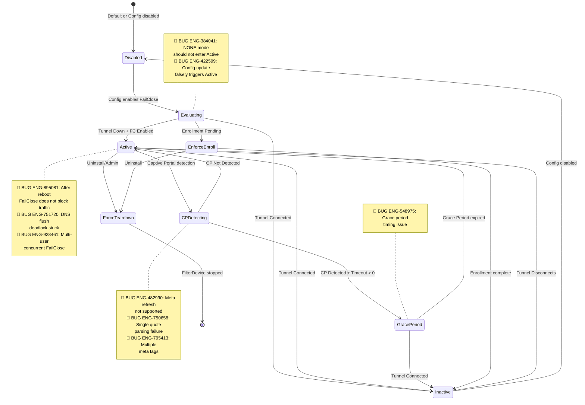
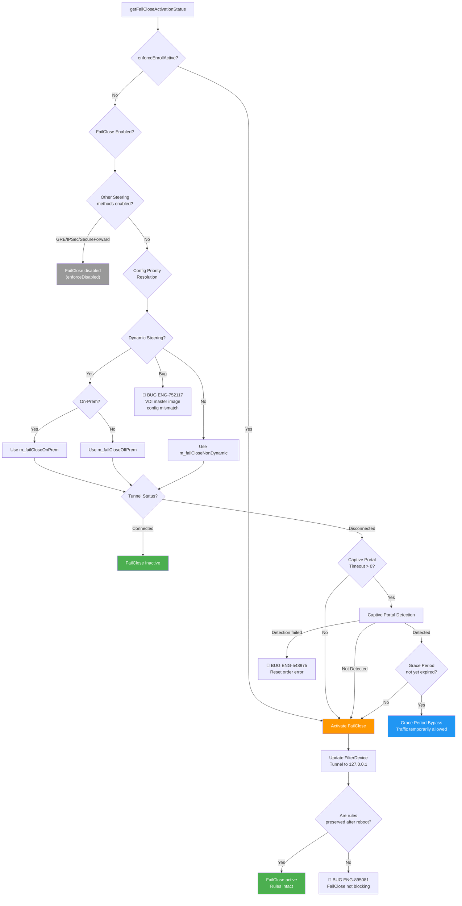
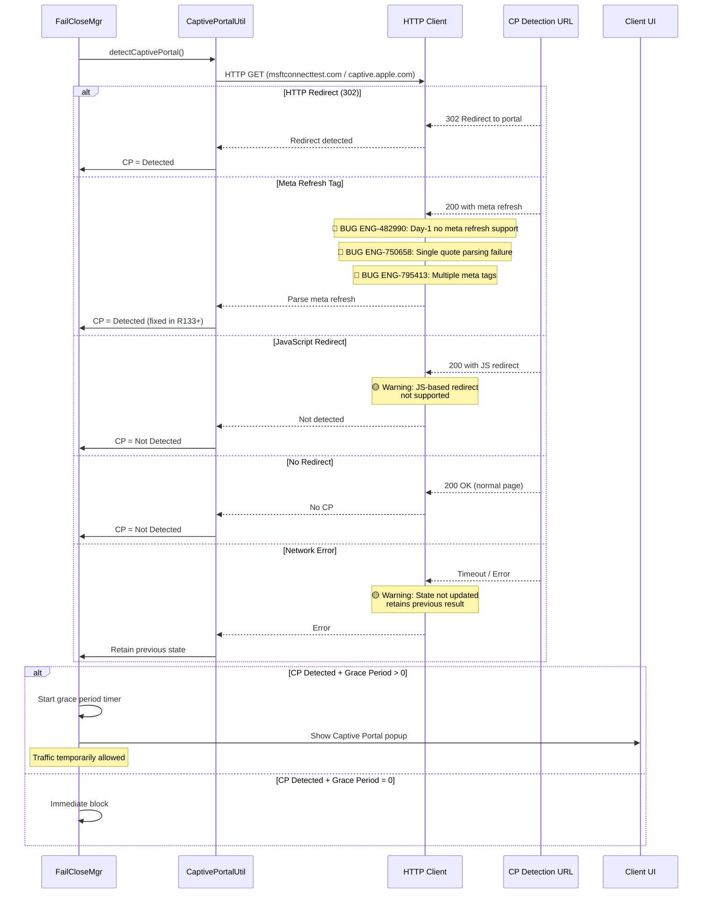
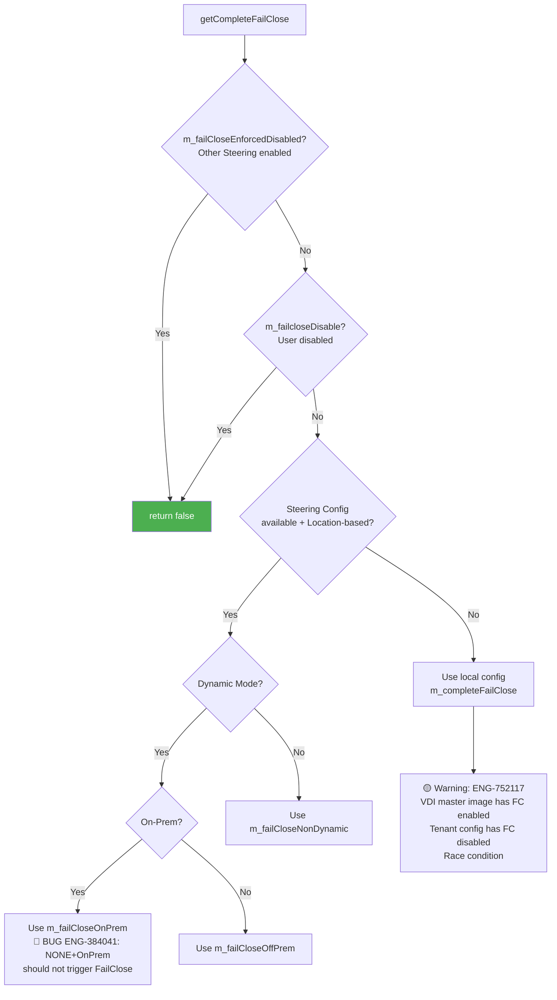
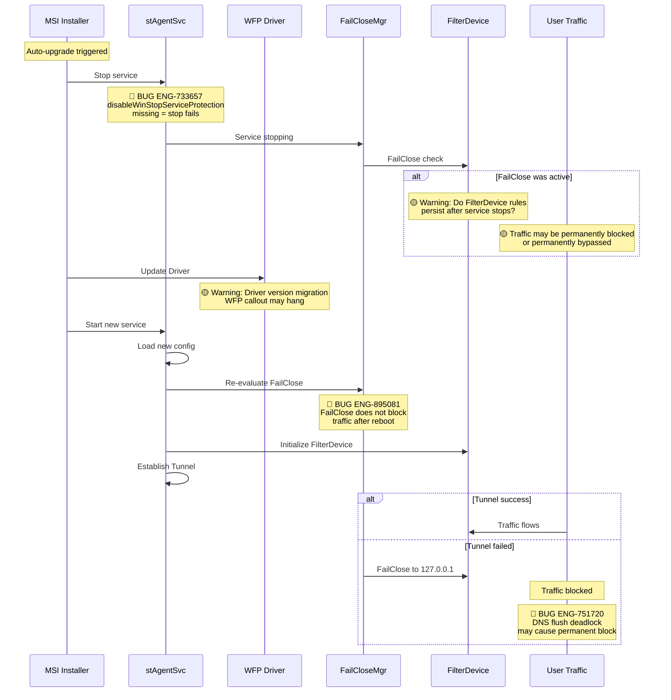
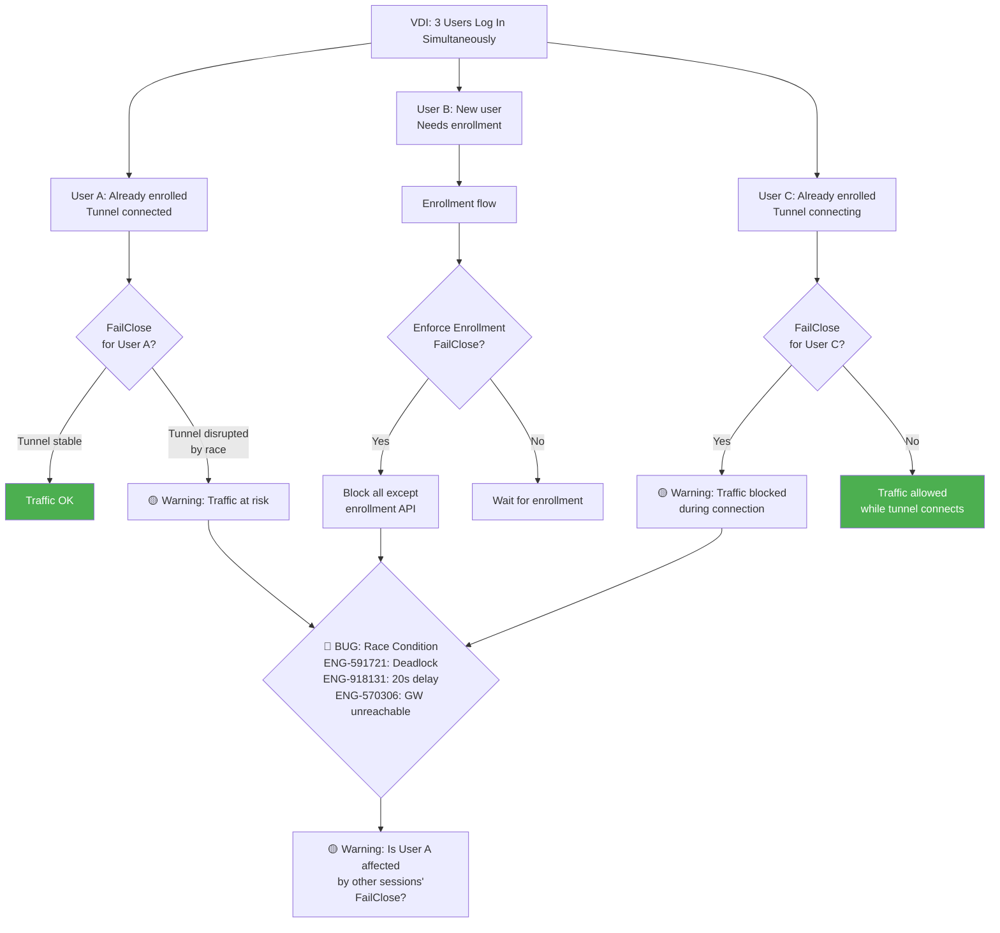
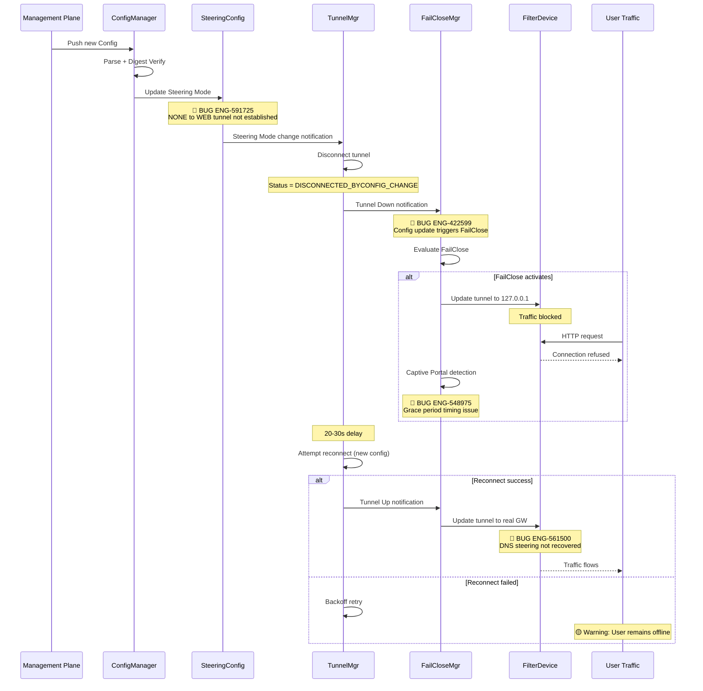

# 11. FailClose

**Escalation Bug Count**: 28 | **S1 Critical**: 5 (18%) | **Day-1 Design Debt**: 8 (29%) | **Test Gap**: 10 (36%)

📋 **[Test Cases — Google Sheet](https://docs.google.com/spreadsheets/d/1ackCZ-EcepXw1BkSGoi5Go9Ex1I72-fXqcqLGMGiuio/edit?gid=2109299317#gid=2109299317)**

> This chapter covers how NSClient enforces FailClose — the security mechanism that blocks user traffic when the tunnel to the Netskope gateway is unavailable. Each flow is illustrated with mermaid diagrams annotated with known escalation bug failure points (red) and predicted risk points (yellow). Platform-specific sections follow the shared flows.

---

## Overview

FailClose is NSClient's last line of security defense. When the tunnel to the Netskope gateway drops — whether due to network failure, gateway unavailability, or service restart — FailClose decides whether to block all user traffic or allow it to flow unprotected. The decision involves evaluating multiple configuration layers (on-prem vs. off-prem, dynamic vs. non-dynamic steering), detecting captive portals to avoid locking users out of hotel/airport WiFi, and managing grace periods that temporarily allow traffic during portal authentication.

The feature exists because without FailClose, any tunnel interruption would silently bypass the entire Netskope security stack. A user on an untrusted network whose tunnel drops would have all their traffic flow unprotected — a security policy violation that enterprise administrators cannot tolerate. FailClose converts a connectivity failure into a deliberate security enforcement decision.

Three areas account for the majority of FailClose escalation bugs:

1. **Captive Portal Detection** — Parsing HTTP redirect responses to identify captive portals. Meta refresh tags, single quotes, and JavaScript-based redirects have each caused separate escalation bugs because the detection logic was originally built for a narrow set of portal formats.
2. **Config Priority Resolution** — Layering on-prem, off-prem, dynamic, and non-dynamic FailClose settings. VDI environments where master images carry one configuration but tenant configs specify another create race conditions at this decision point.
3. **State Persistence Across Service Lifecycle** — FailClose must survive reboots, upgrades, and service crashes. FilterDevice rules (WFP on Windows, Network Extension on macOS) operate at the kernel level, and any mismatch between the service's in-memory state and the driver's rule set produces either a security gap (traffic leaks) or a user outage (permanent block).

Day-1 issues account for 29% of FailClose bugs (8 out of 28), the highest ratio among all feature areas. This indicates that the original design did not anticipate real-world edge cases like meta refresh captive portals, DNS flush deadlocks, or multi-user VDI environments. Test gaps account for 36%, suggesting that the existing test suite does not adequately cover FailClose's interaction surface.

---

## FailClose State Machine

The FailClose mechanism operates as a state machine with seven states. Under normal operation, FailClose sits in the **Inactive** state while the tunnel is connected. When the tunnel drops, it transitions through **Evaluating** to determine whether blocking is appropriate, then either enters **Active** (blocking traffic) or triggers captive portal detection. The **EnforceEnroll** state is a special variant that blocks all traffic except enrollment API calls during initial device setup.

The state machine's most dangerous transitions are into and out of the **Active** state. Five confirmed S1 bugs cluster around this state: FailClose failing to activate after reboot (ENG-895081), DNS flush deadlock causing permanent blocking (ENG-751720), multi-user concurrent FailClose affecting all sessions (ENG-928461), NONE steering mode incorrectly entering Active (ENG-384041), and config updates falsely triggering Active (ENG-422599).

---

## FailClose Activation Judgment Flow

When FailClose needs to make an activation decision, it walks through a multi-layered evaluation. The flow starts with an enrollment enforcement check (highest priority), then tests whether FailClose is enabled at all, then checks whether other steering methods (GRE, IPSec, SecureForward) would make FailClose inappropriate. If FailClose remains a candidate, the flow resolves which configuration to use based on dynamic steering and on-prem/off-prem detection, then checks tunnel status and captive portal conditions.

Every node in this flow has been individually reviewed for risk. Three nodes are rated High risk (confirmed bugs), seven are Medium risk (no confirmed bug but code analysis reveals edge case potential), and ten are Low risk (standard operations with clear failure modes). The Medium-risk nodes — particularly the "Other Steering methods enabled?" check and the "Grace Period not yet expired?" timer — represent predicted testing targets where future bugs are most likely to emerge.

**Node Risk Assessment** — Every node in this flow has been reviewed:

| Node | Risk Level | Assessment |
|---|---|---|
| getFailCloseActivationStatus | Low | Entry function; called on tunnel state change |
| enforceEnrollActive? | Low | Binary check; enrollment state is well-defined |
| Activate FailClose | High | Critical action — incorrect activation causes network outage for user |
| FailClose Enabled? | Low | Config boolean check |
| Other Steering methods enabled? | Medium | GRE/IPSec/SecureForward check — if new steering methods are added but not listed here, FailClose may incorrectly activate |
| FailClose disabled (enforceDisabled) | Low | Safe terminal state |
| Config Priority Resolution | Medium | Priority logic is non-trivial — on-prem vs off-prem vs non-dynamic FC config layering |
| Dynamic Steering? | Medium | **Bug**: ENG-752117 — VDI master image config mismatch at this decision point |
| On-Prem? | Medium | Depends on on-prem detection accuracy — false positive/negative propagates to wrong FC config |
| Use m_failCloseOnPrem | Low | Config value lookup |
| Use m_failCloseOffPrem | Low | Config value lookup |
| Use m_failCloseNonDynamic | Low | Config value lookup |
| Tunnel Status? | Low | Connection state check |
| FailClose Inactive | Low | Safe terminal state; tunnel is connected |
| Captive Portal Timeout > 0? | Low | Config check; enables/disables CP detection |
| Captive Portal Detection | High | **Bug**: ENG-548975 (reset order error), plus CP parsing bugs |
| Grace Period not yet expired? | Medium | Timer-based — race condition possible between timer expiry and tunnel reconnect |
| Grace Period Bypass | Medium | Traffic temporarily allowed — user may assume connectivity is restored when it's temporary |
| Update FilterDevice | Medium | Kernel filter rule update — incomplete update could leak traffic or block too aggressively |
| Rules preserved after reboot? | High | **Bug**: ENG-895081 — FailClose rules not preserved after reboot |

---

## Captive Portal Detection Sequence

Captive portal detection is the most parsing-intensive component of FailClose. When a user connects to a hotel or airport WiFi that requires web authentication, the network intercepts HTTP requests and redirects them to a login page. FailClose must detect this redirect to avoid permanently blocking the user — instead, it enters a grace period that allows the user to authenticate on the portal.

The detection works by issuing HTTP GET requests to known probe URLs (msftconnecttest.com on Windows, captive.apple.com on macOS). If the response is a 302 redirect, a captive portal is definitively detected. If the response is a 200 with a meta refresh tag, the client attempts to parse the redirect URL from the HTML. This parsing path has been the source of three separate escalation bugs: Day-1 lack of meta refresh support (ENG-482990), single quote handling failure (ENG-750658), and multiple meta tag confusion (ENG-795413). JavaScript-based redirects remain unsupported — a known limitation that produces false negatives in JS-heavy portal environments.

---

## Config Priority Resolution

FailClose configuration is not a single boolean. It is resolved through a priority chain that considers multiple sources: enforced disable (when other steering methods like GRE/IPSec are active), user disable, steering config availability, dynamic vs. non-dynamic mode, and on-prem vs. off-prem location. This layered resolution is necessary because enterprises may want FailClose enabled when users are off-premises (coffee shop, home network) but disabled when they are on the corporate network where a direct connection to the gateway is available.

The priority chain has one confirmed bug (ENG-384041: NONE steering mode + on-prem should not trigger FailClose but does) and one predicted risk (ENG-752117: VDI master image carries FailClose enabled, but tenant config has it disabled — a race condition during VM clone startup can apply the wrong configuration). The flow below traces the exact resolution path that `getCompleteFailClose()` follows.

---

## Windows

**Bug Count**: 15 direct + 2 shared with macOS | **Key Gaps**: Reboot persistence, VDI multi-user isolation, DNS flush deadlock, captive portal parsing

Windows is the primary FailClose platform, accounting for the majority of FailClose escalation bugs. FailClose enforcement on Windows uses the **WFP (Windows Filtering Platform)** driver to redirect traffic to 127.0.0.1 when active. The WFP FilterDevice operates at the kernel level, meaning FailClose rules persist independently of the user-mode service — a design that is both the strength and the vulnerability of the mechanism.

The most critical Windows-specific failure pattern is the **DNS flush deadlock** (ENG-751720). When FailClose activates and the tunnel manager attempts to flush DNS cache, it calls `CreateProcess` with an `INFINITE` timeout to execute `ipconfig.exe /flushdns`. If the system has "DNS client event 8020" conditions, this thread hangs permanently, leaving FailClose in a deadlocked state that blocks all traffic with no recovery path except reboot.

### Windows-Specific Bugs

| Bug ID | Problem Summary | Severity | Root Cause |
|--------|----------------|----------|-----------|
| **ENG-384041** | NONE mode triggers FailClose | S1 | Flexible Dynamic Steering enhancement did not handle NONE mode; enters FailClose instead of Backed-off |
| **ENG-422599** | Config update triggers FailClose | S1 | Regression from Flexible Dynamic Steering change (ENG-182503); config update falsely triggers Active |
| **ENG-455132** | Off-Prem rules applied On-Prem | S2 | Legacy bug (pre-R107); off-prem exception rules leak into on-prem context |
| **ENG-561500** | DNS not steered after FC recovery | S1 | Day-1: DNS steering not restored after FailClose recovery under Web Mode + DNS steering combo |
| **ENG-570306** | VDI multi-user FailClose | S2 | Abnormal FailClose during multi-user logout/login + gateway unreachable |
| **ENG-733657** | Upgrade + FC flag missing | S2 | Post-R125: `disableWinStopServiceProtection: true` must be set or upgrade fails with FC active |
| **ENG-750658** | Single quote CP detection failure | S3 | Client rejects single quotes and refresh time format in MS captive portal detection response |
| **ENG-751720** | DNS flush deadlock | S1 | CreateProcess + INFINITE timeout calling ipconfig.exe /flushdns; hangs on DNS event 8020 |
| **ENG-752117** | VDI config mismatch race | S2 | Master image FC enabled + tenant FC disabled produces race condition during VM clone |
| **ENG-795413** | Multiple meta refresh tags | S3 | Cannot parse captive portal response with multiple meta refresh tags |
| **ENG-801565** | Stress test crash | S2 | Crash after hours of stress testing; Day-1 code path |
| **ENG-851222** | Egress IP on-prem detection incorrect | S3 | On-prem detection logic incorrect under NONE steering mode |
| **ENG-895081** | FC does not block after reboot | S1 | FailClose not re-activated after gateway unreachable + system reboot |
| **ENG-918451** | On-prem detection regression | S2 | Android fix (ENG-707767) caused Windows regression — tunnel not reconnecting after location switch |
| **ENG-928461** | Multi-user FC disconnect | S2 | FailClose affects all sessions in multi-user environment; under investigation |

### Windows Test Cases

> The following test cases are **suggested testing directions** based on bug analysis and code flow cross-referencing, not existing product test cases.

**TC-FC-01: FailClose + NPA Tunnel Flapping**

| Field | Value |
|---|---|
| **Severity** | S2 |
| **Related Bugs** | (NPA + FailClose interaction) |
| **Flow Point** | FailClose State Machine — exclude_npa flag |
| **Gap Type** | Missing |
| **Automation Priority** | P2 |

**Preconditions**: FailClose enabled, `exclude_npa: true`, NPA tunnel established
**Steps**:
1. SWG tunnel down -> FailClose activates
2. NPA tunnel flapping (repeatedly disconnect/connect)
3. Confirm NPA traffic continues to be excluded
4. Confirm web traffic is blocked

**Expected Result**: NPA traffic unaffected by FailClose, web traffic blocked
**Risk if Untested**: NPA + FailClose interaction may cause FilterDevice state inconsistency

---

**TC-FC-02: FailClose Persistence After Reboot**

| Field | Value |
|---|---|
| **Severity** | S1 |
| **Related Bugs** | ENG-895081 |
| **Flow Point** | FailClose Activation — Reboot path |
| **Gap Type** | Missing |
| **Automation Priority** | P1 |

**Preconditions**: FailClose enabled, Gateway unreachable
**Steps**:
1. Confirm FailClose active (traffic blocked)
2. Reboot device
3. After service starts, confirm FailClose status
4. Gateway still unreachable -> FailClose should still be active

**Expected Result**: FailClose correctly re-activates after reboot, traffic blocked
**Failure Indicators**: `grep -i "failclose.*active\|failclose.*not.*drop" nsdebuglog.log`
**Risk if Untested**: Security policy fails after reboot, traffic not blocked (S1)

---

**TC-FC-03: Location-Based FailClose + Rapid On/Off-Prem**

| Field | Value |
|---|---|
| **Severity** | S2 |
| **Related Bugs** | ENG-455132, ENG-918451, ENG-851222 |
| **Flow Point** | Config Priority Resolution — On-Prem/Off-Prem switch |
| **Gap Type** | Missing |
| **Automation Priority** | P2 |

**Preconditions**: Location-based FailClose: On-Prem=disabled, Off-Prem=enabled
**Steps**:
1. On-Prem: disconnect tunnel -> confirm FailClose does not activate
2. Switch to Off-Prem: disconnect tunnel -> confirm FailClose activates
3. Rapidly switch On-Prem <-> Off-Prem 5 times
4. Confirm final state is correct

**Expected Result**: FailClose state correctly follows On-Prem/Off-Prem switches
**Risk if Untested**: Rapid switching causes FailClose state confusion

---

**TC-FC-04: JavaScript-Based Captive Portal**

| Field | Value |
|---|---|
| **Severity** | S3 |
| **Related Bugs** | ENG-482990, ENG-750658, ENG-795413 |
| **Flow Point** | Captive Portal Detection — Detection method |
| **Gap Type** | Missing |
| **Automation Priority** | P3 |

**Preconditions**: FailClose enabled, captive portal uses JavaScript redirect
**Steps**:
1. Connect to captive portal WiFi using JS redirect
2. Observe CP detection result
3. Confirm grace period behavior

**Expected Result**: At minimum, detection failure is logged, or JS redirect is supported
**Risk if Untested**: Users cannot complete authentication in JS-based captive portal environments

---

**TC-FC-05: FailClose 24-Hour Stress Test**

| Field | Value |
|---|---|
| **Severity** | S2 |
| **Related Bugs** | ENG-801565 (crash under stress), ENG-751720 |
| **Flow Point** | FailClose State Machine — Long-running |
| **Gap Type** | Missing |
| **Automation Priority** | P2 |

**Preconditions**: FailClose enabled
**Steps**:
1. Disconnect/reconnect tunnel every 5 minutes
2. Continue for 24 hours
3. Monitor memory, CPU, crash dumps
4. Confirm FailClose operates correctly in every cycle

**Expected Result**: No memory leak, no crash, consistent FailClose behavior after 24 hours
**Risk if Untested**: Long-running operation may trigger ENG-801565-type crashes

---

**TC-FC-06: Captive Portal Multiple Meta Refresh Tags**

| Field | Value |
|---|---|
| **Severity** | S3 |
| **Related Bugs** | ENG-795413 |
| **Flow Point** | Captive Portal Detection — Meta Refresh parsing |
| **Gap Type** | Incomplete |
| **Automation Priority** | P2 |

**Preconditions**: FailClose enabled
**Steps**:
1. Set captive portal response containing 2+ meta refresh tags
2. First tag points to auth page, second points to another page
3. Observe if embedded browser launches correctly
4. Test single quote in meta tag

**Expected Result**: Correctly parses first meta refresh tag, embedded browser launches
**Risk if Untested**: Some portal vendors use multiple tags causing detection failure

---

**TC-FC-07: FailClose Config Disable During Active Block**

| Field | Value |
|---|---|
| **Severity** | S2 |
| **Related Bugs** | ENG-422599 |
| **Flow Point** | FailClose State Machine — Config update |
| **Gap Type** | Incomplete |
| **Automation Priority** | P1 |

**Preconditions**: FailClose active (traffic blocked)
**Steps**:
1. Admin disables FailClose on MP
2. Config update reaches client
3. Confirm FailClose immediately deactivates
4. Confirm traffic resumes
5. Confirm FilterDevice rules correctly updated

**Expected Result**: FailClose deactivates, traffic immediately resumes, no service restart needed
**Risk if Untested**: Config update race condition prevents FailClose from deactivating

---

**TC-FC-08: Enforce Enrollment + Network Loss**

| Field | Value |
|---|---|
| **Severity** | S2 |
| **Related Bugs** | (EnforceEnroll state edge case) |
| **Flow Point** | FailClose State Machine — EnforceEnroll state |
| **Gap Type** | Missing |
| **Automation Priority** | P2 |

**Preconditions**: Fresh install, enforce enrollment enabled
**Steps**:
1. Installation complete, enrollment pending
2. Confirm only enrollment API is allowed
3. Disconnect network
4. Restore network
5. Confirm enrollment can continue

**Expected Result**: Enrollment flow recoverable after network loss
**Risk if Untested**: Stuck in enforce enrollment after network loss, permanent block

---

**TC-FC-09: Service Crash Recovery During FailClose**

| Field | Value |
|---|---|
| **Severity** | S1 |
| **Related Bugs** | (Service crash + FilterDevice state mismatch) |
| **Flow Point** | FailClose State Machine — ForceTeardown |
| **Gap Type** | Missing |
| **Automation Priority** | P1 |

**Preconditions**: FailClose active
**Steps**:
1. Confirm FailClose is blocking traffic
2. Kill stAgentSvc process
3. Service auto-restarts
4. Observe FailClose state recovery
5. Confirm FilterDevice rules are correct

**Expected Result**: FailClose correctly evaluates and recovers after service restart
**Risk if Untested**: FilterDevice rules remain after service crash, permanent block (S1)

---

**TC-FC-10: Multi-Session FailClose Isolation**

| Field | Value |
|---|---|
| **Severity** | S2 |
| **Related Bugs** | ENG-928461, ENG-570306 |
| **Flow Point** | FailClose — Per-Session State |
| **Gap Type** | Missing |
| **Automation Priority** | P3 (manual) |

**Preconditions**: Multi-user VDI, FailClose enabled
**Steps**:
1. User A: tunnel connected -> FailClose inactive
2. User B: tunnel connecting -> FailClose active
3. Confirm User A's traffic is not blocked
4. Confirm User B's traffic is blocked
5. User B tunnel connected -> confirm User B traffic resumes

**Expected Result**: Per-session FailClose isolation, no mutual interference
**Risk if Untested**: Session A affected by Session B's FailClose

---

**TC-FC-11: WFP FilterDevice Rule Cleanup on Service Stop**

| Field | Value |
|---|---|
| **Severity** | S1 |
| **Related Bugs** | (Predicted risk — FilterDevice rules persist after service stops) |
| **Flow Point** | Upgrade + FailClose Chain Reaction — FilterDevice rules persist after service stops |
| **Gap Type** | Test Gap |
| **Automation Priority** | P1 |

**Preconditions**: FailClose active, WFP FilterDevice rules in place, traffic blocked
**Steps**:
1. Confirm FailClose is active and traffic is blocked via WFP rules
2. Stop stAgentSvc service (simulate upgrade or manual stop)
3. Check WFP filter rules using `netsh wfp show filters`
4. Confirm FilterDevice rules are fully removed
5. Restart service, confirm rules are re-applied correctly

**Expected Result**: WFP FilterDevice rules are cleaned up when stAgentSvc service stops; no stale rules remain blocking traffic
**Risk if Untested**: Stale WFP rules permanently block all user traffic after service stop, requiring reboot to recover (S1)

---

**TC-FC-12: Driver Upgrade WFP Callout Migration**

| Field | Value |
|---|---|
| **Severity** | S1 |
| **Related Bugs** | (Predicted risk — WFP callout version migration may hang) |
| **Flow Point** | Upgrade + FailClose Chain Reaction — Driver version migration |
| **Gap Type** | Test Gap |
| **Automation Priority** | P1 |

**Preconditions**: FailClose enabled, old WFP driver version installed, auto-upgrade pending
**Steps**:
1. Confirm FailClose is active with current WFP driver
2. Trigger auto-upgrade to version with new WFP callout driver
3. Monitor driver upgrade phase for hangs or timeouts (observe for 5 minutes)
4. Confirm old WFP callout is removed and new callout is registered
5. Confirm FailClose state is correct after driver migration
6. Confirm no stale filter rules from old driver version

**Expected Result**: Driver upgrade from old to new WFP callout version completes without hang or stale rules
**Risk if Untested**: WFP callout migration hangs during upgrade, leaving system in indeterminate state — permanent block or bypass (S1)

---

**TC-FC-13: VDI User A Tunnel Not Disrupted by User B FailClose**

| Field | Value |
|---|---|
| **Severity** | S1 |
| **Related Bugs** | ENG-928461, ENG-570306 |
| **Flow Point** | VDI Multi-User — User A tunnel disrupted by race when User B triggers FailClose |
| **Gap Type** | Test Gap |
| **Automation Priority** | P1 |

**Preconditions**: Multi-user VDI, FailClose enabled, User A has active stable tunnel
**Steps**:
1. User A: tunnel connected, traffic flowing normally
2. User B: log in to same VDI host, tunnel fails to connect
3. User B's session triggers FailClose activation
4. Immediately verify User A's tunnel status and traffic flow
5. Repeat 5 times to expose race condition

**Expected Result**: User A's active tunnel is not disrupted when User B's session triggers FailClose in VDI
**Risk if Untested**: Race condition causes User A's established tunnel to drop when unrelated User B triggers FailClose (S1)

---

**TC-FC-14: VDI New User Tunnel Establishment During Another Session's FailClose**

| Field | Value |
|---|---|
| **Severity** | S2 |
| **Related Bugs** | ENG-928461, ENG-570306 |
| **Flow Point** | VDI Multi-User — User C traffic blocked during tunnel connection by another user's FailClose |
| **Gap Type** | Test Gap |
| **Automation Priority** | P1 |

**Preconditions**: Multi-user VDI, FailClose enabled, User A has FailClose active (gateway unreachable for User A)
**Steps**:
1. User A: FailClose active, traffic blocked
2. User C: log in to same VDI host
3. User C attempts tunnel establishment (gateway reachable for User C)
4. Confirm User C's tunnel connects successfully
5. Confirm User C's traffic flows normally despite User A's FailClose state

**Expected Result**: New user session can establish tunnel while another session has FailClose active in VDI
**Risk if Untested**: User A's FailClose state bleeds into User C's session, blocking User C's traffic during tunnel connection phase (S2)

---

**TC-FC-15: VDI FailClose Session Isolation**

| Field | Value |
|---|---|
| **Severity** | S1 |
| **Related Bugs** | ENG-928461, ENG-570306, ENG-752117 |
| **Flow Point** | VDI Multi-User — Cross-session FailClose impact |
| **Gap Type** | Test Gap |
| **Automation Priority** | P1 |

**Preconditions**: Multi-user VDI, FailClose enabled, 3 concurrent user sessions
**Steps**:
1. User A: tunnel connected, FailClose inactive
2. User B: tunnel disconnected, FailClose active
3. User C: tunnel connecting
4. Confirm User A's traffic is not affected by User B's FailClose state
5. Trigger User B's FailClose deactivation (tunnel reconnects)
6. Confirm User A and User C states are unchanged by User B's state transition
7. Repeat with different combinations of FC state changes across sessions

**Expected Result**: FailClose isolation between user sessions in VDI — one session's FC state does not leak to others
**Risk if Untested**: Shared kernel-level WFP driver allows one session's FailClose to affect all sessions (S1)

---

**TC-FC-16: VDI Master Image vs Tenant Config FailClose Priority**

| Field | Value |
|---|---|
| **Severity** | S1 |
| **Related Bugs** | ENG-752117 |
| **Flow Point** | Config Priority Resolution — VDI master image conflict |
| **Gap Type** | Test Gap |
| **Automation Priority** | P1 |

**Preconditions**: VDI master image with FailClose enabled, tenant config with FailClose disabled
**Steps**:
1. Prepare master image: install NSClient with FailClose enabled
2. Set tenant config on MP: FailClose disabled
3. Clone VM from master image
4. Immediately after VM boot, check FailClose state (within first 30 seconds)
5. After config sync completes, confirm FailClose state matches tenant config (disabled)
6. Repeat 10 times to expose race condition timing

**Expected Result**: FailClose config priority resolves correctly — tenant config overrides master image; no window where FC is incorrectly active
**Risk if Untested**: Race condition during VM clone startup applies master image FC config before tenant config arrives, blocking traffic (S1)

---

## macOS

**Bug Count**: 2 shared with Windows | **Key Gaps**: Captive Portal detection on macOS-specific portals, System Extension restart + FC state

macOS FailClose enforcement uses the **Network Extension** (System Extension) framework instead of WFP. The captive portal detection on macOS probes `captive.apple.com` rather than `msftconnecttest.com`. Two escalation bugs are shared with Windows: captive portal meta refresh Day-1 support (ENG-482990) and grace period timing issue (ENG-548975).

macOS-specific risk areas include System Extension restart behavior during upgrades (the System Extension must be explicitly approved by the user or pre-approved via MDM), and AOAC/Dark Wake behavior where the tunnel may disconnect during sleep but FailClose state is not correctly evaluated on wake.

### macOS-Specific Bugs

| Bug ID | Problem Summary | Severity | Root Cause |
|--------|----------------|----------|-----------|
| **ENG-482990** | Captive portal meta refresh not detected | S3 | Day-1: NSClient never supported meta refresh HTTP redirection (shared with Windows) |
| **ENG-548975** | Grace period timing issue | S2 | Day-1: captive portal status reset timing conflict with GSLB 20s delay (shared with Windows) |

### macOS Test Cases

> macOS-specific FailClose test cases focus on System Extension lifecycle and macOS-specific captive portal behavior.

**TC-FC-MAC-01: System Extension Restart + FailClose State**

| Field | Value |
|---|---|
| **Severity** | S2 |
| **Related Bugs** | (Predicted risk — System Extension lifecycle) |
| **Flow Point** | FailClose State Machine — macOS System Extension |
| **Gap Type** | Missing |
| **Automation Priority** | P2 |

**Preconditions**: FailClose enabled, macOS with System Extension active
**Steps**:
1. Confirm FailClose inactive, tunnel connected
2. Disconnect tunnel -> FailClose activates
3. Trigger System Extension restart (upgrade scenario)
4. Confirm FailClose state after extension restart

**Expected Result**: FailClose correctly re-evaluates after System Extension restart
**Risk if Untested**: System Extension restart may clear Network Extension rules, creating security gap

---

## Linux

**Bug Count**: 1 related | **Key Gaps**: Egress IP on-prem detection under NONE mode

Linux FailClose enforcement uses a **TUN virtual interface** (VIF). The FailClose implementation on Linux is less mature than Windows/macOS, with fewer escalation bugs but also less test coverage. The primary known issue is ENG-851222 (Egress IP on-prem detection incorrect), which also affects Linux in addition to Windows.

### Linux-Specific Notes

| Bug ID | Problem Summary | Severity | Root Cause |
|--------|----------------|----------|-----------|
| **ENG-851222** | Egress IP on-prem detection incorrect | S3 | On-prem detection logic incorrect under NONE steering mode; Linux also has this Egress IP issue |

---

## Android

No Android-specific FailClose escalation bugs have been filed. Android uses VPN service-based tunnel enforcement, and FailClose behavior is managed through the Android VPN framework. However, the cross-platform on-prem detection fix (ENG-707767 for Android) caused a Windows regression (ENG-918451), demonstrating that Android FailClose-adjacent changes can impact other platforms.

---

## iOS

No iOS-specific FailClose escalation bugs have been filed. iOS uses the Network Extension framework for tunnel enforcement. FailClose behavior on iOS follows the same state machine as other platforms but with iOS-specific captive portal detection through `captive.apple.com`.

---

## Backend

No backend-specific FailClose bugs have been filed. FailClose is entirely a client-side enforcement mechanism. However, backend config delivery timing affects FailClose behavior — if a config update changing FailClose settings is delayed or partially delivered, the client may operate with stale FailClose configuration.

---

## Cross-Platform Test Cases

> These test cases apply across multiple platforms and test FailClose behavior in combination with other features.

**TC-FC-CP-01: Config Update -> Steering Change -> FailClose -> Recovery**

| Field | Value |
|---|---|
| **Severity** | S1 |
| **Related Bugs** | ENG-384041, ENG-422599, ENG-561500, ENG-591725 |
| **Gap Type** | Missing (end-to-end) |
| **Automation Priority** | P1 |
| **Platforms** | Windows, macOS, Linux |

**Preconditions**: Dynamic Steering On-Prem=NONE, Off-Prem=WEB, FailClose enabled, DNS steering enabled
**Steps**:
1. On-Prem: confirm steering=NONE, tunnel not connected, FailClose inactive
2. Push config from MP changing to Off-Prem=ALL
3. Simultaneously switch to Off-Prem environment
4. Observe: steering switch -> tunnel establishment -> FailClose state
5. If FailClose activates before tunnel establishment, confirm captive portal detection
6. After tunnel establishes, confirm DNS steering recovers

**Expected Result**: Complete recovery chain succeeds, DNS steering recovers
**Risk if Untested**: Any step failing in the chain reaction can cause permanent network outage

---

**TC-FC-CP-02: Steering + FailClose + Reboot (Golden Path)**

| Field | Value |
|---|---|
| **Severity** | S1 |
| **Related Bugs** | ENG-895081, ENG-918451, ENG-384041 |
| **Gap Type** | Missing |
| **Automation Priority** | P1 |
| **Platforms** | Windows, macOS, Linux |

**Preconditions**: Dynamic Steering enabled, FailClose enabled, Gateway unreachable
**Steps**:
1. Confirm FailClose active, traffic blocked
2. Reboot device
3. After startup confirm on-prem detection is correct
4. Confirm FailClose correctly activates/deactivates based on location
5. After Gateway becomes reachable, confirm tunnel establishes

**Expected Result**: All states correctly recovered after reboot
**Risk if Untested**: FailClose + steering state inconsistency after reboot = security policy failure

---

**TC-FC-CP-03: NPA Tunnel + FailClose Cycle Recovery**

| Field | Value |
|---|---|
| **Severity** | S2 |
| **Related Bugs** | ENG-773191 |
| **Gap Type** | Missing (cross-flow) |
| **Automation Priority** | P1 |
| **Platforms** | Windows, macOS |

**Preconditions**: NPA enabled with private app access, SWG tunnel active, FailClose enabled
**Steps**:
1. Access private app via NPA tunnel -> confirm working
2. Disconnect network -> FailClose activates -> both SWG and NPA tunnels drop
3. Reconnect network -> SWG tunnel reconnects -> FailClose deactivates
4. Attempt private app access again via NPA tunnel
5. Verify NPA tunnel re-establishes correctly after FailClose recovery cycle

**Expected Result**: NPA tunnel fully recovers after FailClose cycle; private apps accessible
**Failure Indicators**: `grep -i "npa.*tunnel\|private.*access\|npa.*reconnect" nsdebuglog.log`
**Risk if Untested**: NPA tunnel silently fails to reconnect after FailClose recovery, user loses private app access without notification

---

**TC-FC-CP-04: Large Config (30K Domains) + FailClose + Network Switch**

| Field | Value |
|---|---|
| **Severity** | S2 |
| **Related Bugs** | ENG-872456, ENG-948106, ENG-561500 |
| **Gap Type** | Missing |
| **Automation Priority** | P2 |
| **Platforms** | Windows, macOS, Linux |

**Preconditions**: 30K+ domain steering config, FailClose enabled
**Steps**:
1. Load 30K domain config -> confirm no crash
2. Network switch -> tunnel disconnect
3. FailClose activates
4. Tunnel reconnects
5. Confirm 30K domain steering rules fully recovered

**Expected Result**: All flows work normally with large config
**Risk if Untested**: Large config + FailClose recovery may trigger OOM or incomplete rules

---

**TC-FC-CP-05: Third-Party VPN + Steering + FailClose Conflict**

| Field | Value |
|---|---|
| **Severity** | S2 |
| **Related Bugs** | ENG-805334, ENG-654108 |
| **Gap Type** | Missing (cross-flow) |
| **Automation Priority** | P2 |
| **Platforms** | Windows, macOS |

**Preconditions**: Third-party VPN installed (e.g., Cisco AnyConnect, Palo Alto GlobalProtect), FailClose enabled
**Steps**:
1. Connect third-party VPN -> verify NSClient steering coexists
2. Disconnect NSClient tunnel -> FailClose activates
3. Verify FailClose rules do not conflict with third-party VPN routing
4. Reconnect NSClient tunnel -> FailClose deactivates
5. Disconnect third-party VPN -> verify NSClient steering resumes correctly
6. Test reverse order: NSClient connected first, then third-party VPN connects

**Expected Result**: Both VPN clients coexist; FailClose rules do not block third-party VPN traffic; no routing conflicts
**Failure Indicators**: `grep -i "route.*conflict\|vpn.*filter\|failclose.*vpn" nsdebuglog.log`
**Risk if Untested**: FailClose rules block third-party VPN traffic or VPN routing overrides NSClient steering

---

**TC-FC-CP-06: Captive Portal Detection with JS-Based Redirect**

| Field | Value |
|---|---|
| **Severity** | S2 |
| **Related Bugs** | ENG-482990, ENG-750658, ENG-795413 |
| **Flow Point** | Captive Portal Detection Sequence — JavaScript redirect not supported |
| **Gap Type** | Test Gap |
| **Automation Priority** | P2 |
| **Platforms** | Windows, macOS, Linux |

**Preconditions**: FailClose enabled, captive portal timeout > 0, captive portal uses JavaScript redirect (not HTTP 302 or meta refresh)
**Steps**:
1. Configure test captive portal that returns HTTP 200 with JavaScript-based redirect (e.g., `window.location.href` or `document.location`)
2. Connect to captive portal WiFi network
3. FailClose activates due to tunnel disconnect
4. Observe captive portal detection result
5. Check if grace period is triggered or if traffic is permanently blocked
6. Verify detection failure is logged with sufficient diagnostic detail

**Expected Result**: At minimum, JS-based redirect failure is clearly logged; ideally, JS redirect is detected or user is prompted to authenticate manually
**Failure Indicators**: `grep -i "captive.*portal\|cp.*detect\|redirect" nsdebuglog.log`
**Risk if Untested**: Users on JS-redirect portals (hotel/airport WiFi) are permanently blocked with no grace period and no way to authenticate (S2)

---

**TC-FC-CP-07: Captive Portal State Reset on Network Change**

| Field | Value |
|---|---|
| **Severity** | S2 |
| **Related Bugs** | ENG-548975 |
| **Flow Point** | Captive Portal Detection Sequence — State not updated retains previous result |
| **Gap Type** | Test Gap |
| **Automation Priority** | P2 |
| **Platforms** | Windows, macOS, Linux |

**Preconditions**: FailClose enabled, captive portal detection enabled
**Steps**:
1. Connect to captive portal WiFi -> CP detected, grace period active
2. Complete portal authentication, tunnel reconnects
3. Switch to a different network (e.g., Ethernet or different WiFi)
4. Disconnect tunnel -> FailClose activates
5. Observe captive portal detection: should detect new network's CP status, not retain previous result
6. Repeat with network error scenario: disconnect network during CP detection, then reconnect to different network

**Expected Result**: Captive portal state resets correctly on network interface change; previous detection result does not carry over to new network
**Failure Indicators**: `grep -i "captive.*state\|cp.*retain\|cp.*previous\|network.*change" nsdebuglog.log`
**Risk if Untested**: Stale CP state from previous network causes incorrect grace period (false positive) or missed CP detection (false negative) on new network (S2)

---

**TC-FC-CP-08: Config Update Chain Reaction Recovery**

| Field | Value |
|---|---|
| **Severity** | S1 |
| **Related Bugs** | ENG-422599, ENG-561500, ENG-591725, ENG-548975 |
| **Flow Point** | Config Update Chain Reaction — User remains offline after cascading failure |
| **Gap Type** | Test Gap |
| **Automation Priority** | P1 |
| **Platforms** | Windows, macOS, Linux |

**Preconditions**: FailClose enabled, tunnel connected, config update pending on MP that changes steering mode
**Steps**:
1. Push config update from MP that changes steering mode (e.g., NONE -> WEB)
2. Observe chain reaction: config update -> steering change -> tunnel disconnect -> FailClose activates
3. Monitor tunnel reconnection attempt with new config
4. If tunnel reconnection fails on first attempt, observe backoff retry behavior
5. Wait up to 5 minutes for automatic recovery
6. Confirm client recovers fully: tunnel reconnects, FailClose deactivates, DNS steering restored, traffic flows
7. If client does not recover within 5 minutes, check if manual intervention is required

**Expected Result**: Client recovers from config update chain reaction (FC activation -> tunnel restart -> config re-download) without requiring manual intervention
**Failure Indicators**: `grep -i "tunnel.*reconnect\|failclose.*active\|dns.*steer\|config.*update" nsdebuglog.log`
**Risk if Untested**: Cascading failure (config update -> tunnel drop -> FC activation -> reconnect failure) leaves user permanently offline with no automatic recovery path (S1)

---

## Cross-Flow Interactions

FailClose interacts with Installation/Upgrade, Steering, and Tunnel management in ways that produce compound failures. Of the 174 total escalation bugs analyzed, the FailClose + Steering combination is the highest-risk intersection, and the FailClose + Upgrade combination produces the most dangerous user-facing failures (permanent network outage).

The core problem with cross-flow interactions is timing: FailClose evaluates state at a point in time, but the underlying conditions (tunnel status, steering mode, config version) are changing asynchronously. A config update that changes steering mode triggers a tunnel disconnect, which triggers FailClose evaluation — but the evaluation may read the old steering config if the update has not fully propagated.

### Upgrade + FailClose Chain Reaction

The following sequence traces what happens when an auto-upgrade fires while FailClose is enabled. During an upgrade, the service must stop (tearing down the tunnel) and restart (re-establishing the tunnel). If FailClose is active during this window, FilterDevice rules may persist in an inconsistent state — either permanently blocking or permanently bypassing traffic. Each red annotation marks a confirmed escalation bug; yellow annotations mark predicted risks with no known escalation yet.

### Upgrade + FailClose Cross-Flow Test Case

**TC-CF-02: Upgrade -> Service Restart -> FailClose Init**

| Field | Value |
|---|---|
| **Severity** | S1 |
| **Related Bugs** | ENG-733657, ENG-895081, ENG-751720 |
| **Gap Type** | Missing |
| **Automation Priority** | P1 |

**Preconditions**: FailClose enabled, Self-Protection enabled
**Steps**:
1. Confirm tunnel connected, traffic flowing
2. Trigger auto-upgrade
3. Observe service stop -> driver update -> service start
4. Confirm FailClose does not cause permanent block during service restart
5. Confirm tunnel reconnects successfully after upgrade

**Expected Result**: FailClose temporarily activates during upgrade but not permanently, normal operation resumes after upgrade
**Risk if Untested**: FailClose + DNS flush deadlock during upgrade = permanent network outage

---

### VDI Multi-User Concurrent Scenario

VDI environments introduce unique challenges because multiple user sessions share the same kernel-level driver and service. When users log in simultaneously, enrollment and tunnel establishment race against each other. Three bugs have been filed for this pattern, all involving different failure modes of the same concurrent access problem.

### VDI + FailClose Cross-Flow Test Case

**TC-CF-04: VDI Clone + Stale FailClose State**

| Field | Value |
|---|---|
| **Severity** | S2 |
| **Related Bugs** | ENG-752117 |
| **Gap Type** | Missing |
| **Automation Priority** | P3 (manual) |

**Preconditions**: Citrix VDI master image with FailClose enabled in driver
**Steps**:
1. Enable FailClose on master image
2. Disable FailClose in tenant config
3. Clone VM from master image
4. After cloned VM starts, observe FailClose status
5. Confirm tenant config overrides master image state

**Expected Result**: Tenant config takes priority over master image, FailClose correctly disabled
**Risk if Untested**: VDI clone uses stale driver rules causing traffic block

---

### Config Update Chain Reaction

A config update from the Management Plane can trigger a chain reaction across Steering, Tunnel, and FailClose modules. The following sequence shows how a steering mode change causes a tunnel disconnect, which triggers FailClose evaluation, which may activate traffic blocking, which then must be reversed when the tunnel reconnects — but DNS steering may fail to recover at the end of this chain.

### Cross-Flow Risk Matrix (FailClose-Relevant)

| Interaction | Known Bugs | Severity | Test Priority |
|---|---|---|---|
| Steering mode change + FailClose | ENG-384041, ENG-422599 | **S1** | P1 |
| Upgrade + FailClose | ENG-733657, ENG-751720 | **S1** | P1 |
| Tunnel reconnect + DNS steering | ENG-561500 | **S1** | P1 |
| On-prem detection + Reboot | ENG-895081, ENG-918451 | **S1** | P1 |
| VDI + enrollment + FailClose | ENG-570306, ENG-752117 | **S2** | P2 |
| DTLS fallback + FailClose | ENG-503501 | **S2** | P2 |
| NPA tunnel + FailClose | ENG-773191 | **S2** | P1 |
| Third-party VPN + Steering + FailClose | ENG-805334, ENG-654108 | **S2** | P2 |
| Large config (30K) + FailClose recovery | (Predicted risk) | **S2** | P2 |

---

**Related Chapters**:
- [01_installation.md](01_installation.md) — Upgrade + FailClose chain reaction
- [05_steering_config.md](05_steering_config.md) — Steering mode changes affecting FailClose evaluation
- [07_tunnel_management.md](07_tunnel_management.md) — Tunnel state changes triggering FailClose
- [09_traffic_steering.md](09_traffic_steering.md) — DNS steering recovery after FailClose
- [15_npa_integration.md](15_npa_integration.md) — NPA + FailClose exclude_npa interaction

---

## Appendix A: Bug Quick Reference

> Problem summaries, root causes, and fixes for all 28 FailClose-related bugs referenced in this chapter. This includes 8 direct FailClose bugs, plus 20 bugs from Steering, Tunnel, and Installation that directly impact FailClose behavior. Sorted by Bug ID for quick lookup.

| Bug ID | Problem Summary | Root Cause | Fix | Platform | Severity |
|--------|----------------|-----------|-----|----------|----------|
| **ENG-384041** | Steering=NONE enters FailClose instead of Backed-off | Flexible Dynamic Steering enhancement did not handle NONE mode correctly | Fix NONE mode FailClose judgment logic; add automation and monthly regression | Windows | S1 |
| **ENG-393015** | NPA + SWG network switch crash | NPA tunnel crash during network switch; affects dual-tunnel FailClose recovery | Need NPA integration + network switch stress testing | Windows | S2 |
| **ENG-422599** | Config update triggers FailClose | Regression from Flexible Dynamic Steering change (ENG-182503); config update falsely triggers Active | Fix FailClose evaluation logic during config update; add to monthly regression | Windows | S1 |
| **ENG-455132** | Off-Prem exception rules applied in On-Prem environment | Legacy bug (before R107); leftover from pre-dynamic steering enhancement | Fix on-prem/off-prem rule application logic | Windows | S2 |
| **ENG-482990** | Captive portal not detected (meta refresh) | Day-1 issue: NSClient never supported meta refresh element HTTP redirection | Add support for simple meta refresh element | Win/Mac | S3 |
| **ENG-503501** | DTLS does not fallback to TLS | Regression from ENG-445563 fix: TLS fallback not executed after DTLS failure | Revert problematic code change | Windows | S2 |
| **ENG-548975** | Captive portal grace period timing issue | Day-1: original code resets CP status after tunnel worker thread starts, but GSLB checking may have 20s delay | Fix reset timing: after GSLB checking, before tunnel worker thread | Win/Mac | S2 |
| **ENG-561500** | DNS traffic not steered after FailClose recovery | Day-1 issue: DNS steering not restored after recovery under Web Mode + DNS steering + FailClose combination | Fix DNS steering restoration after FailClose recovery | Windows | S1 |
| **ENG-570306** | VDI multi-user FailClose (SENTRY) | Abnormal FailClose behavior during multi-user logout/login + GW unreachable | Need fail-close + multi-user + tunnel disconnect/resume test case | Windows | S2 |
| **ENG-591721** | NSComs multi-user deadlock | NSComs module cannot handle socket connections between stAgentSvc and UI | Fix NSComs communication module connection handling | Windows | S2 |
| **ENG-591725** | Tunnel not established NONE->Web/All | Steering mode change via auto-config update does not trigger tunnel establishment | Fix tunnel startup logic after mode change | Win/Mac/Linux | S2 |
| **ENG-654108** | Citrix VPN traffic blocked by Defender | R122 design change: CFW mode IPv4/IPv6 exception handling moved to service level | Use `handleExceptionsAtDriver` FF for IPv6 exceptions | Windows | S2 |
| **ENG-659009** | GSLB not refreshed after reboot | Tunnel manager does not trigger GSLB re-download after disconnect; affects FC->tunnel recovery path | Force GSLB refresh on tunnel disconnect | Windows | S2 |
| **ENG-733657** | R126->R129 auto-upgrade failure with FC | Post-R125 must enable `disableWinStopServiceProtection: true` flag | Mandatory requirement to enable the flag | Windows | S2 |
| **ENG-750658** | Single quote causes CP detection failure | Client rejects single quotes and refresh time format in MS captive portal detection file | R133 fixed single quote and refresh time handling | Windows | S3 |
| **ENG-751720** | DNS flush deadlock causes permanent FailClose | CreateProcess + INFINITE timeout calling ipconfig.exe /flushdns; thread hangs on DNS event 8020 | Fix CreateProcess timeout to finite value | Windows | S1 |
| **ENG-752117** | VDI master image vs tenant config FC mismatch | Master image FC enabled + tenant FC disabled; driver enables FC during clone VM sync; config sync race condition | Corner case; not recommended deployment method | Windows | S2 |
| **ENG-773191** | NPA traffic not tunneled after FC cycle | macOS 15.x regression: transparent proxy stops when NPA in DISABLED state after FailClose recovery | Fix transparent proxy behavior after NPA state change | macOS | S1 |
| **ENG-795413** | Multiple meta refresh tags prevent Embedded Browser | Cannot parse captive portal response with multiple meta refresh tags | Fix meta refresh tag parsing logic | Windows | S3 |
| **ENG-801565** | Stress test crash (JLL) | Crash after hours of stress testing; Day-1 code path | Plan to add regular stability test | Windows | S2 |
| **ENG-805334** | NS Client + Citrix/Cisco VPN interop | Citrix Secure Access WFP mode conflicts with FailClose FilterDevice rules | Need independent config options for different VPNs | Windows | S2 |
| **ENG-851222** | Egress IP on-prem detection incorrect | On-prem detection logic incorrect under NONE steering mode; Linux also has Egress IP issue | Fix NONE mode on-prem detection | Win/Linux | S3 |
| **ENG-872456** | 30K+ domains crash Android/ChromeOS | Large domain steering config exceeds buffer limit; affects FailClose recovery with large configs | Add volume test data preparation | ChromeOS | S2 |
| **ENG-895081** | FailClose does not block traffic after reboot | FailClose not properly activated after NSGW unreachable + system reboot | Need reboot/startup flow under FC + on-prem detection negative test case | Windows | S1 |
| **ENG-918131** | VDI multi-user tunnel delayed 20s | ~20s delay when multiple users login simultaneously; affects FailClose timing | Need VDI environment stability test automation | Windows | S2 |
| **ENG-918451** | On-prem detection regression | Android fix (ENG-707767) caused Windows regression; tunnel not reconnecting after location switch | Fix tunnel reconnect logic after on-prem detection | Windows | S2 |
| **ENG-928461** | Multi-user FC disconnect (SK Finance) | FailClose affects all sessions in multi-user environment | Under investigation | Windows | S2 |
| **ENG-948106** | Linux crash with large domain config | Domain names 230-255 chars exceeding 35K entries triggers crash; affects FC recovery scenario | Need volume stress test (35K+ long domains) | Linux | S2 |

---

## Appendix B: Methodology

### Severity Rating

| Level | Label | Definition | Impact Scope |
|---|---|---|---|
| **S1** | Critical | Complete network outage or security mechanism failure | All users, immediate impact |
| **S2** | High | Core functionality anomaly affecting connectivity | Most users under specific conditions |
| **S3** | Medium | Partial functionality failure or performance issue | Specific scenarios, workaround available |
| **S4** | Low | UI/Log anomaly or edge case | Few users, does not affect core functionality |
| **S5** | Enhancement | Feature improvement request | Not a bug |

### Test Case Format

| Field | Description |
|---|---|
| **Severity** | S1-S5 |
| **Related Bugs** | Related ENG-XXXXXX |
| **Flow Point** | Corresponding step in flow diagram |
| **Preconditions** | Prerequisites |
| **Steps** | Test steps |
| **Expected Result** | Expected result |
| **Gap Type** | Missing / Incomplete / Platform-specific |
| **Automation Priority** | P1 (must) / P2 (should) / P3 (manual OK) |

### Bug Classification

The 28 bugs in this chapter include:
- **8 direct FailClose bugs** — Filed under the FailClose category (captive portal detection, state machine, VDI multi-user)
- **20 cross-category bugs** — Filed under Steering, Tunnel, or Installation but directly impact FailClose behavior (config update triggering FC, DNS recovery after FC, upgrade + FC interaction, VPN interop with FC rules)

Bug annotations in mermaid diagrams use two emoji markers:
- **🔴 Red nodes**: Confirmed escalation bugs with ENG-XXXXXX identifiers (emoji in node label, no style fill)
- **🟡 Yellow nodes**: Predicted risk points based on code analysis with no known escalation bug yet (emoji in node label, no style fill)
