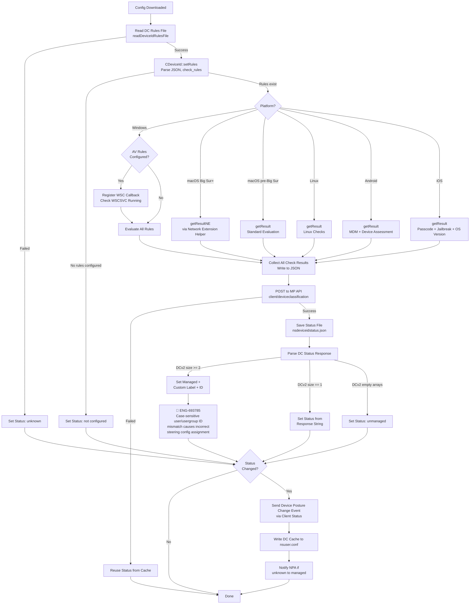
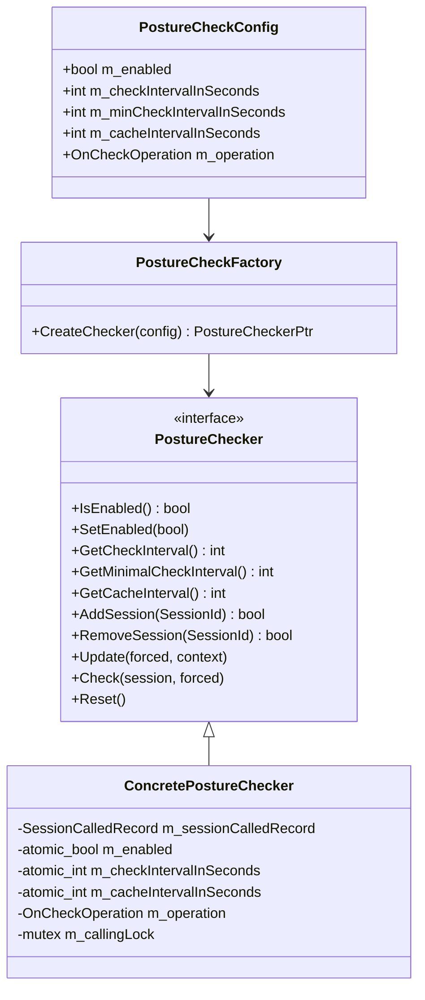
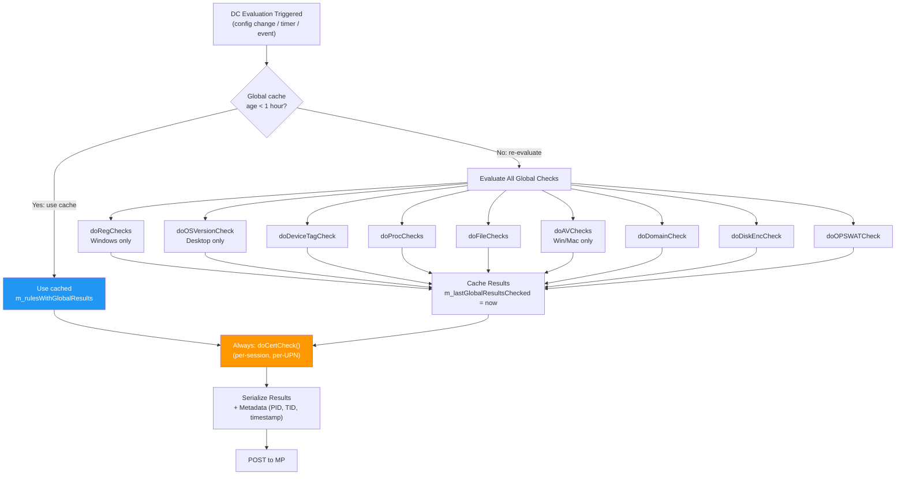
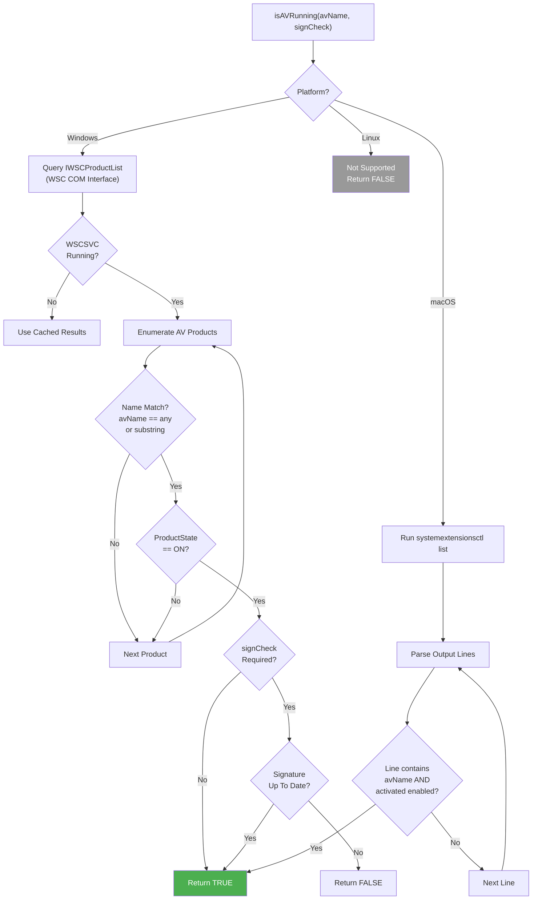
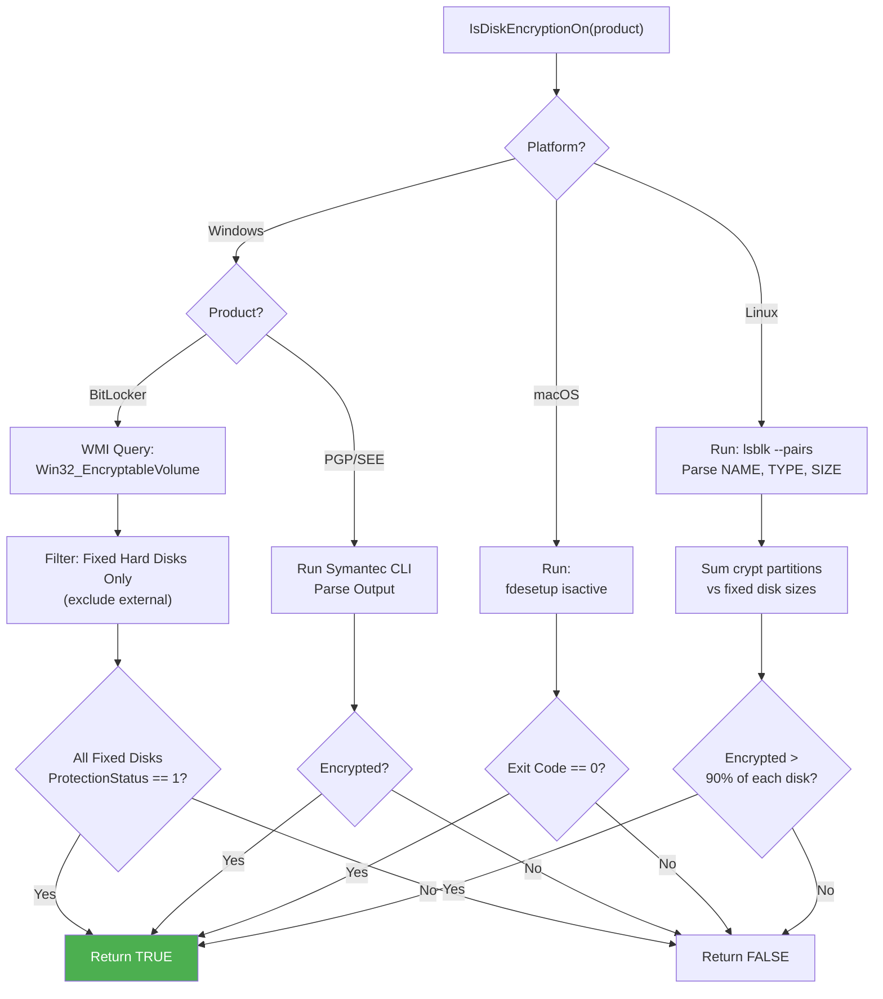
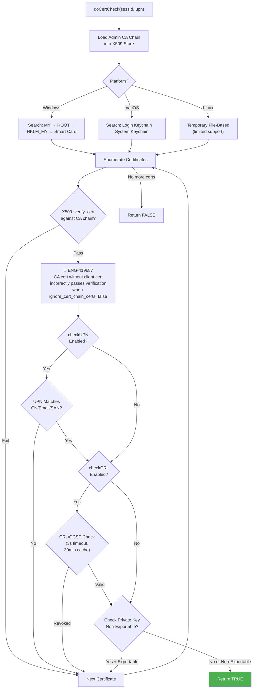
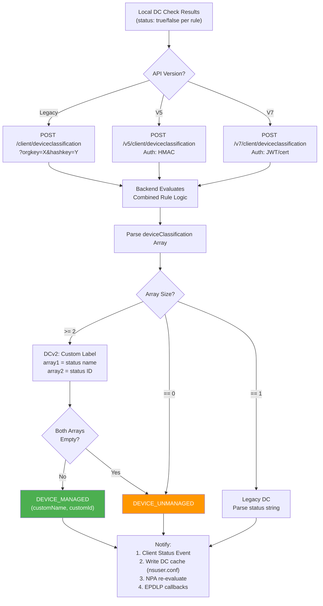
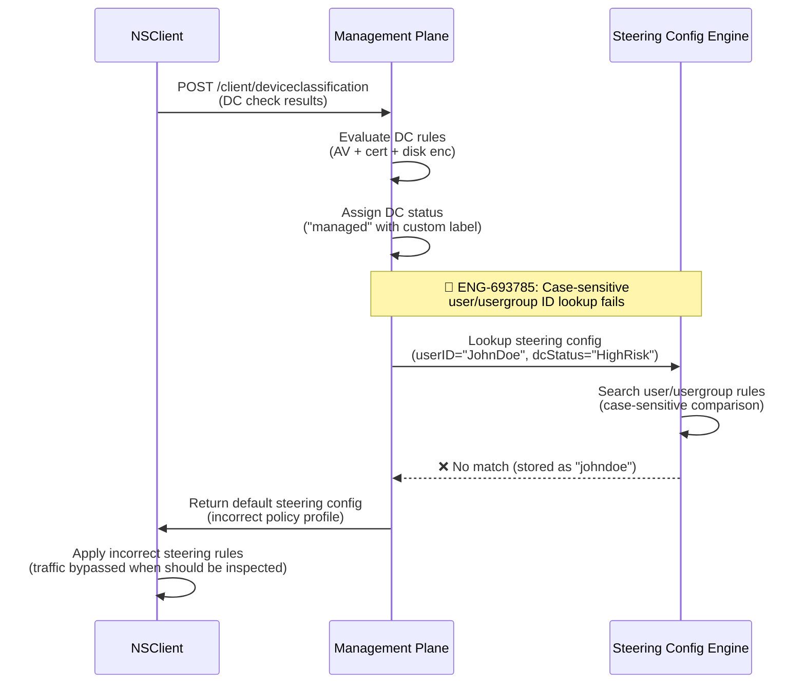
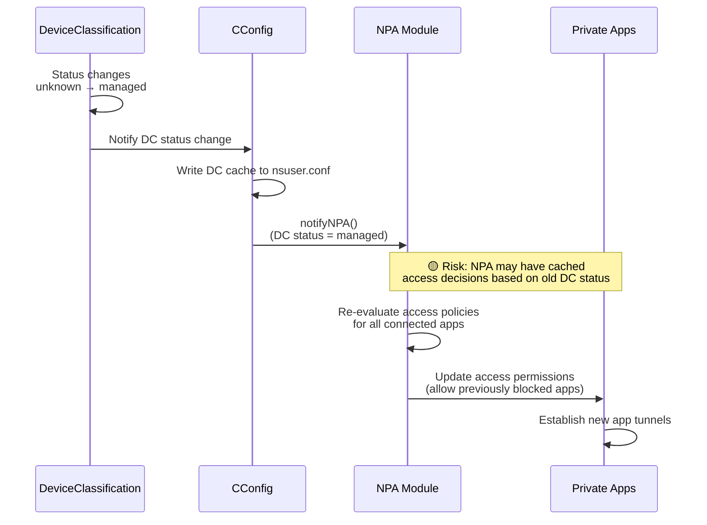
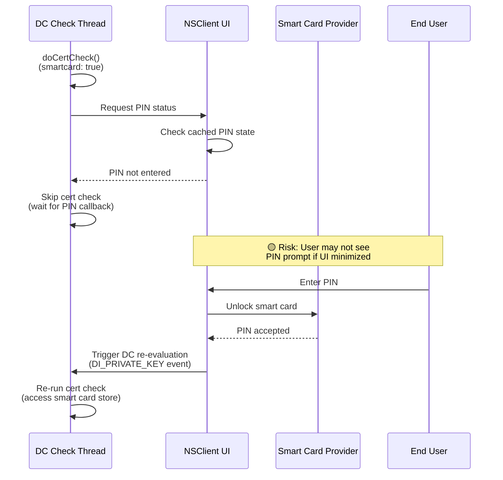

# 12. Device Classification

**Escalation Bug Count**: 3 | **Test Gap**: 1 (33%) | **Corner Case**: 1 (33%) | **Day-1**: 1 (33%)

📋 **[Test Cases — Google Sheet](https://docs.google.com/spreadsheets/d/1ackCZ-EcepXw1BkSGoi5Go9Ex1I72-fXqcqLGMGiuio/edit?gid=1828506662#gid=1828506662)**

> This chapter covers how NSClient evaluates device posture rules for policy enforcement, including the rule evaluation pipeline, platform-specific check implementations, result reporting to the Management Plane, and the periodic posture check scheduling system. Each flow is illustrated with mermaid diagrams annotated with known escalation bug failure points (🔴 red) and predicted risk points (🟡 yellow).

---

## Overview

Device Classification (DC) is NSClient's mechanism for evaluating endpoint security posture against admin-defined rules. An administrator configures rules in the Management Plane (MP) — such as "antivirus must be running" or "disk encryption must be enabled" — and the client periodically evaluates these rules, reporting results back to MP. The DC result directly affects policy enforcement: a device that fails classification may be assigned a more restrictive policy profile (e.g., restricted access, blocked applications).

The DC system operates as a client-side evaluation engine that collects local device state and sends it to MP, where the backend makes the final classification decision. The client does not decide "managed" vs "unmanaged" itself — it gathers evidence (AV status, disk encryption state, certificate presence, etc.), posts the collected data to the `/client/deviceclassification` API, and receives a classification verdict from the backend.

**Key design decisions**:

1. **Client collects, backend decides**: The client evaluates individual rule checks locally (e.g., "is BitLocker on?") and sends raw results to MP. The backend applies the rule logic (AND/OR combinations) and returns the final DC status. This means the backend can update rule logic without requiring a client upgrade.

2. **Periodic posture checks with caching**: The `PostureChecker` scheduler controls how often DC re-evaluation happens. A configurable check interval (with a minimum floor) prevents excessive resource usage, and a cache interval allows the client to reuse recent results for intermediate checks.

3. **Event-driven re-evaluation**: Beyond periodic checks, certain system events trigger immediate DC re-evaluation — network changes, system wake, reboot, Wi-Fi switching. This ensures DC status reflects current device state after environment changes.

4. **DCv2 with custom labels**: The DC system supports custom classification labels (not just "managed"/"unmanaged") via the `dc_custom_label_enabled` feature flag. When enabled, the backend returns a custom status name and numeric ID alongside the standard classification.

### DC Status Values

The client tracks four predefined DC states, plus custom labels:

| Status | String Value | Hardcoded ID | Meaning |
|---|---|---|---|
| **Unknown** | `"unknown"` | -1 | DC rules not yet evaluated or rules file unreadable |
| **Not Configured** | `"not configured"` | 0 | No DC rules defined for this tenant |
| **Unmanaged** | `"unmanaged"` | -2 | Device fails DC rules |
| **Managed** | `"managed"` | (custom) | Device passes DC rules; custom label carries the specific profile name |

When DCv2 custom labels are enabled, a "managed" device also carries a custom status string (e.g., "High Risk", "Low Risk", "Compliant") and an integer ID that maps to the specific DC profile.

---

## DC Evaluation Flow

The following diagram shows the complete Device Classification evaluation pipeline, from config download to status reporting. Known escalation bugs are annotated with 🔴 markers. ENG-419687 identifies a logic error where having only a CA certificate without a corresponding client certificate incorrectly sets the device status to "managed" instead of failing the certificate check. ENG-693785 shows a case-sensitive ID matching issue in backend steering config lookup that can cause incorrect policy assignment after DC evaluation.



### Node Risk Assessment: DC Evaluation Flow

| Node | Risk Level | Bug Reference | Description |
|------|-----------|---------------|-------------|
| `Parse DC Status Response` | 🔴 High | ENG-693785 | Case-sensitive user/usergroup ID mismatch in backend causes incorrect steering config assignment after DC status change |
| `MANAGED_CUSTOM` | 🟡 Medium | - | DCv2 custom label parsing failure may silently fall back to legacy status, hiding policy assignment errors |
| `CACHE_FALLBACK` | 🟡 Medium | - | Network failure during DC POST causes client to reuse stale cached status, masking actual posture changes |
| `Parse DC Rules File` | 🟡 Low | - | Malformed JSON or encoding issues cause DC to remain "unknown" indefinitely |

---

## Posture Check Scheduler

DC evaluation is not triggered ad hoc — it is managed by the `PostureChecker` scheduling system (`lib/nsConfig/PostureCheck.h/.cpp`). This scheduler ensures that posture checks happen at controlled intervals, prevents redundant evaluations, and supports per-session tracking for multi-user environments.

### PostureChecker Architecture



### Scheduling Logic

The `PostureChecker` maintains a per-session record of the last check time. On each `Update()` or `Check()` call, it decides whether to actually invoke the DC evaluation or skip it:

```cpp
// Pseudo code: PostureChecker::Check()
void Check(SessionId session, CalledRecord &record, bool forced, nsDeviceIdContext context) {
    lock(record.m_updatingLock);
    
    auto elapsed = now() - record.m_timelastCalled;
    bool shouldCall = forced || elapsed >= seconds(m_checkIntervalInSeconds);
    
    if (!shouldCall) {
        // Skip: check interval not expired yet
        return;
    }
    
    // Determine if cached results can be used
    bool tryUseCache = (m_cacheIntervalInSeconds > 0) && 
                       (elapsed <= seconds(m_cacheIntervalInSeconds));
    
    // Invoke the actual DC evaluation
    m_operation(session, tryUseCache, context);
    record.m_timelastCalled = now();
}
```

**Key parameters**:

| Parameter | Purpose | Typical Value |
|---|---|---|
| `checkIntervalInSeconds` | Minimum time between posture evaluations | Configurable from MP |
| `minCheckIntervalInSeconds` | Hard floor — `checkInterval` is clamped to this minimum | Prevents too-frequent checks |
| `cacheIntervalInSeconds` | If within this window, evaluation can reuse cached results | 1 hour (3600s) for global checks |

### DC Event Triggers

The `nsDeviceIdContext` enum defines what events trigger DC re-evaluation:

| Context | Value | Trigger | Behavior |
|---|---|---|---|
| `DI_REBOOT` | 0 | System reboot | Deferred — stored as `m_dcContextAtStart`, executed after user sessions are ready |
| `DI_NETWORK_JOINED` | 1 | Network interface connected | Immediate forced re-evaluation |
| `DI_WAKEUP` | 2 | System wake from sleep | Immediate forced re-evaluation |
| `DI_DOMAIN_JOINED` | 3 | Domain join detected | Immediate forced re-evaluation |
| `DI_WIFI_TO_ETHERNET` | 4 | Switched from Wi-Fi to Ethernet | Immediate forced re-evaluation |
| `DI_WIFI_CHANGED` | 5 | Connected to different Wi-Fi network | Immediate forced re-evaluation |
| `DI_PRIVATE_KEY` | 6 | Smart card private key event | Immediate forced re-evaluation |
| `DI_SERVICE_STARTED` | 7 | Service process started | Deferred — same as reboot |
| `DI_OTHER` | 8 | Periodic / manual trigger | Standard interval-based evaluation |

```cpp
// Pseudo code: CConfig::onDeviceClassificationEvent()
void CConfig::onDeviceClassificationEvent(nsDeviceIdContext context) {
    if (m_postureChecker) {
        if (context == DI_REBOOT || context == DI_SERVICE_STARTED) {
            // Cannot do DC check here — user sessions not ready yet
            // Store context for later execution after config is loaded
            m_dcContextAtStart = context;
        } else {
            // Immediate forced re-evaluation for all sessions
            m_postureChecker->Update(true, context);
        }
    }
}
```

---

## Posture Rule Types

The DC rules are downloaded as part of the config and stored in a JSON structure keyed by `device_classification_rules.<os>`. Each OS section contains zero or more check types. The following table summarizes all supported rule types across platforms:

| Rule Type | JSON Key | Windows | macOS | Linux | Android | iOS | Description |
|---|---|---|---|---|---|---|---|
| **Registry Check** | `reg_check` | Yes | -- | -- | -- | -- | Read Windows registry key/value and report data |
| **Process Check** | `process_check` | Yes | Yes | Yes | -- | -- | Check if a named process is running; optional signer verification |
| **File Check** | `file_check` | Yes | Yes | Yes | -- | -- | Check if a file exists at a given path |
| **Domain Join Check** | `domain_check` | Yes | Yes | Yes | -- | -- | Check if device is joined to an AD domain and report domain name |
| **Disk Encryption Check** | `disk_enc_check` | Yes | Yes | Yes | -- | -- | Check if disk encryption (BitLocker/FileVault/LUKS) is enabled |
| **AV Check** | `av_check` | Yes | Yes | -- | -- | -- | Check if an antivirus product is running and signatures are up-to-date |
| **Certificate Check** | `cert_check` | Yes | Yes | Yes | -- | -- | Verify a client certificate against a CA chain, with optional UPN/CRL/private-key checks |
| **OS Version Check** | `min_os_version_check` | Yes | Yes | Yes | Yes | Yes | Check if OS version meets a minimum threshold |
| **OPSWAT Check** | `opswat_check` | Yes | Yes | -- | -- | -- | Nested process/registry/file checks for OPSWAT agent |
| **Device Tag Check** | `device_tag_check` | Yes | Yes | Yes | Yes | Yes | Check if device has a specific tag assigned |
| **MDM Check** | `mdm_check` | -- | -- | -- | Yes | -- | Query MDM-managed configuration key/value pairs |
| **Passcode Check** | `passcode_required_check` | -- | -- | -- | Yes | Yes | Verify device has a passcode/PIN configured |
| **Device Not Compromised** | `device_not_compromised_check` | -- | -- | -- | Yes | Yes | Check if device is rooted (Android) or jailbroken (iOS) |
| **Storage Encryption** | `primary_storage_encrypted_check` | -- | -- | -- | Yes | -- | Check if primary storage is encrypted on Android |

### DC Rules JSON Structure

```json
{
  "device_classification_rules": {
    "win": {
      "reg_check": [
        {
          "rootKey": "HKEY_LOCAL_MACHINE",
          "key": "SOFTWARE\\CrowdStrike\\Sensor",
          "value": "Version",
          "type": "REG_SZ"
        }
      ],
      "process_check": [
        {
          "process": "CSFalconService.exe",
          "signerName": "CrowdStrike, Inc."
        }
      ],
      "av_check": [
        {
          "product_name": "Windows Defender",
          "signature_up_to_date": true
        }
      ],
      "disk_enc_check": [
        { "product": "bitlocker" }
      ],
      "domain_check": {},
      "cert_check": {
        "certificate": "-----BEGIN CERTIFICATE-----\n...\n-----END CERTIFICATE-----",
        "checkUPN": "true",
        "smartcard": "false",
        "checkCRL": "true",
        "checkPrivateKeyNonExport": "false"
      },
      "min_os_version_check": [
        {
          "edition": "Windows 10 Enterprise",
          "min_os_version": "10.0.19044"
        }
      ],
      "device_tag_check": [
        { "tag_id": 182 }
      ]
    },
    "mac": { },
    "linux": { },
    "android": { },
    "ios": { }
  }
}
```

---

## Rule Evaluation Details

### Global vs Per-Session Checks

The DC system divides checks into two categories:

- **Global checks** (cached for 1 hour): Registry, process, file, domain, disk encryption, AV, OS version, OPSWAT, device tag. These are properties of the machine, not the user session.
- **Per-session checks** (always re-evaluated): Certificate checks. These depend on the logged-in user's certificate store and UPN.



### AV Detection

AV detection uses fundamentally different mechanisms on each platform:



**Windows — Windows Security Center (WSC)**:

The client queries the `IWSCProductList` COM interface with `WSC_SECURITY_PROVIDER_ANTIVIRUS` to enumerate all registered AV products. For each product, it checks:
1. Whether the product name matches the rule (case-insensitive substring match, or "any" to match all)
2. Whether the product state is `WSC_SECURITY_PRODUCT_STATE_ON`
3. If `signature_up_to_date` is required, whether the signature status is `WSC_SECURITY_PRODUCT_UP_TO_DATE`

The client also registers for WSC callbacks to be notified of AV state changes, and checks whether the `WSCSVC` service is running — if not, it falls back to cached results.

**macOS — System Extension List**:

macOS does not have a unified AV registration API like Windows Security Center. Instead, the client runs `/usr/bin/systemextensionsctl list` and parses the output for matching AV product names. A product is considered active if its line contains `[activated enabled]`.

```cpp
// Pseudo code: isAVRunning() on macOS
bool isAVRunning(string avName, bool signCheck, uint32_t &retCode) {
    string output = runCommand("/usr/bin/systemextensionsctl list");
    avName = toLower(avName);
    
    for (auto line : split(output, "\n")) {
        line = toLower(line);
        if (line.contains(avName) && line.contains("[activated enabled]")) {
            return true;
        }
    }
    return false;
}
```

### Disk Encryption Detection



**Windows — BitLocker via WMI**:

Queries `ROOT\CIMV2\Security\MicrosoftVolumeEncryption` for `Win32_EncryptableVolume` objects. Checks `ProtectionStatus == 1` for each fixed hard disk volume. Also supports Symantec Endpoint Encryption (PGP 10.x/11.x) by running the CLI tool and parsing its output.

**macOS — FileVault**:

Runs `/usr/bin/fdesetup isactive` and checks the exit code (0 = active).

**Linux — LUKS**:

Runs `/bin/lsblk --pairs -o NAME,TYPE,RM,SIZE,MOUNTPOINT`, parses fixed disk sizes and encrypted (`TYPE="crypt"`) partition sizes. If encrypted partitions cover more than 90% of each fixed disk, the device is considered encrypted.

### Certificate Check

The certificate check flow verifies client certificates against an admin-provided CA chain. ENG-419687 identifies a critical logic error: when a device has the CA certificate installed but no corresponding client certificate, the check incorrectly passes and sets the device status to "managed". This happens because X509_verify_cert successfully validates the CA cert against itself, bypassing the private key check.



### Node Risk Assessment: Certificate Check

| Node | Risk Level | Bug Reference | Description |
|------|-----------|---------------|-------------|
| `X509_verify_cert` | 🔴 High | ENG-419687 | CA certificate without client certificate incorrectly passes verification when `ignore_cert_chain_certs=false`, causing false "managed" status on Windows/macOS |
| `UPN Matches CN/Email/SAN?` | 🟡 Medium | - | Case-sensitivity handling differs between platforms; macOS `useEmailForUPNCheck` fallback may not match corporate email format |
| `CRL/OCSP Check` | 🟡 Medium | - | 3-second timeout may cause false positive when revocation server is slow; 30-minute cache may miss recent revocations |
| `Check Private Key Non-Exportable` | 🟡 Low | - | Platform API differences: Windows CNG/CSP vs macOS Security framework may have inconsistent exportability detection |

Certificate checking is the most complex rule type, supporting:

- **CA chain verification**: The admin-provided CA certificate chain is loaded into an OpenSSL X509 store, and certificates from the user's certificate store are verified against it.
- **UPN matching**: Optionally match the user's UPN against the certificate's Subject CN, Subject Email, SAN UPN, or SAN Email fields (case-insensitive).
- **Smart card support**: On Windows, certificates can be checked from the smart card provider store. The client communicates with the UI for PIN status.
- **CRL/OCSP revocation**: On both Windows and macOS, certificate revocation is checked via CRL distribution points and OCSP responders, with a 3-second timeout. Results are cached (TTL 30 minutes) to avoid repeated network lookups.
- **Private key non-exportability**: Verifies that the matching certificate's private key is not marked as exportable.

**Certificate store search order**:

| Platform | Search Order |
|---|---|
| Windows | Current User "MY" -> "ROOT" -> Local Machine "MY" -> Smart Card |
| macOS | User login keychain -> System keychain |
| Linux | Temporary file-based (limited support) |

### Domain Join Check

| Platform | Method |
|---|---|
| Windows | `LsaOpenPolicy` + `LsaQueryInformationPolicy(PolicyPrimaryDomainInformation)` |
| macOS | `SCDynamicStoreCopyComputerName` / `dsconfigad -show` |
| Linux | `/etc/sssd/sssd.conf` or `realm list` parsing |

### OS Version Check

The OS version check compares the current OS version against a minimum required version:

| Platform | Additional Parameter | Example |
|---|---|---|
| Windows | `edition` (e.g., "Windows 10 Enterprise") | `min_os_version: "10.0.19044"` |
| macOS | (none) | `min_os_version: "13.0"` |
| Linux | `distribution` (e.g., "Ubuntu") | `min_os_version: "22.04"` |
| Android | (none) | `min_os_version: "13.0"` |
| iOS | (none) | `min_os_version: "16.0"` |

---

## DC Result Reporting

After local checks are complete, the client POSTs the collected results to the MP backend for classification:



### API Endpoints

| Version | Endpoint | Authentication |
|---|---|---|
| Legacy | `POST /client/deviceclassification?orgkey=X&hashkey=Y` | Query parameters |
| V5 | `POST /v5/client/deviceclassification` | `Authorization` header (HMAC) |
| V7 | `POST /v7/client/deviceclassification` | `Authorization` header (JWT/cert) |

The request body is the complete DC rules JSON with `status: true/false` fields added to each check. The backend evaluates the combined rule logic and returns a classification response.

### Response Parsing (DCv2)

The backend returns a JSON response with a `deviceClassification` array. The client parses it as follows:

### Status Change Notification

When the DC status changes, the client:

1. **Sends a "Device Posture Change" event** via the client status pipeline to MP
2. **Writes DC cache** to `nsuser.conf` (for persistence across restarts)
3. **Notifies NPA** if status changed from "unknown" to "managed" (NPA may need to re-evaluate access)
4. **Updates device detail** in the config file (for UI display)
5. **Calls registered callbacks** (e.g., EPDLP may re-evaluate its policies)

---

## Platform Sections

### Windows

Windows has the most comprehensive DC check support, covering all rule types. Key platform-specific behaviors:

**Windows Security Center (WSC) Integration**:
- The client registers for WSC change callbacks (`registerForWSCCallback()`) when AV rules are configured
- If the `WSCSVC` service is not running, the client cannot query AV status and falls back to cached results
- WSC returns COM errors (`REGDB_E_CLASSNOTREG` = `0x80040154` or `ERROR_SERVICE_NOT_ACTIVE` = `0x80070426`) on Server SKUs where Security Center is not available; the client short-circuits remaining AV checks when these errors occur

**Registry Checks**: Uses the `getRegValue()` utility to read arbitrary registry keys. The rule specifies `rootKey` (HKLM/HKCU), `key` (path), `value` (name), and `type` (REG_SZ/REG_DWORD). The actual data is sent to the backend for evaluation.

**Smart Card Certificate Check**: When `smartcard: true`, the client first tries `CryptAcquireContextA` with `MS_SCARD_PROV_A` to access the smart card provider's certificate store. If that fails (e.g., `SCARD_E_NO_KEY_CONTAINER`), it falls back to enumerating the current user "MY" store and filtering by `pwszProvName` matching `MS_SCARD_PROV_W` or `MS_SMART_CARD_KEY_STORAGE_PROVIDER`.

**BitLocker Detection**: Uses WMI queries to `ROOT\CIMV2\Security\MicrosoftVolumeEncryption`. The `Win32_EncryptableVolume` class provides `ProtectionStatus` per volume. The client also uses `Win32_DiskDrive` and `Win32_LogicalDiskToPartition` associations to determine media type and exclude external/removable disks.

**Private Key Non-Export Check**: Uses `CryptAcquireCertificatePrivateKey` to get the key handle, then checks `NCRYPT_EXPORT_POLICY_PROPERTY` (CNG) or `KP_PERMISSIONS` (CSP) for the `CRYPT_EXPORT` / `NCRYPT_ALLOW_EXPORT_FLAG`.

### macOS

macOS DC checks run in two modes depending on OS version:

**Big Sur and above**: The `getResultNE()` path delegates global checks (process, file, domain, disk encryption, OS version) to the Network Extension helper process via `getDeviceClassificationNE()`. This is necessary because the main service process runs in a sandbox on modern macOS and cannot directly access certain system state. Certificate checks and device tag checks are still performed in the main process.

**Pre-Big Sur**: The `getResult()` path runs all checks directly.

**FileVault Detection**: Simply runs `/usr/bin/fdesetup isactive` and checks the return code.

**AV Detection**: Runs `/usr/bin/systemextensionsctl list` and searches for the AV product name with `[activated enabled]` status. This approach is less precise than Windows Security Center — it checks for system extensions rather than registered AV products.

**Certificate Check**: Searches the user's login keychain (`~/Library/Keychains/login.keychain`) and the system keychain. Uses the macOS Security framework (`SecItemCopyMatching`) for private key verification. CRL/OCSP checks use OpenSSL with a 3-second timeout and background thread for OCSP.

**macOS-specific feature flags**:
- `enable_dc_macos_revocation_check`: Controls whether certificate CRL/OCSP checks are performed on macOS (default: true)
- `ignore_cert_chain_certs`: When true, certificates that are themselves part of the uploaded CA chain are excluded from matching (prevents false positives where the CA cert is also in the user store)
- `useEmailForUPNCheck`: On macOS, UPN may not be available; this flag allows using the user's email address for UPN matching instead

### Linux

Linux DC support covers a subset of desktop rules:

**Disk Encryption (LUKS)**: Runs `lsblk --pairs -o NAME,TYPE,RM,SIZE,MOUNTPOINT` to enumerate block devices. Identifies fixed disks (`TYPE="disk"`, `RM="0"`) and encrypted partitions (`TYPE="crypt"`). Checks that encrypted partition size covers at least 90% of each fixed disk's size. Handles RedHat/CentOS boot partition exclusion.

**OS Version Check**: Uses the `distribution` field (e.g., "Ubuntu", "RHEL") instead of Windows' `edition` field.

**Domain Join**: Checks via `sssd.conf` or `realm list` output.

**Not supported on Linux**: AV check (no unified API), registry check, MDM check, smart card certificate check.

### Android

Android uses a different check architecture — instead of individual system calls, it delegates to Java/JNI:

**MDM Check**: Calls `nativeGetMDMConfigValue(key, value)` to read MDM-managed configuration values (via Android Managed Configurations API).

**Device Assessment Checks**: Calls `nativeGetDeviceAssessment()` which invokes Java methods to check:
- Passcode set (`DevicePolicyManager.isActivePasswordSufficient()`)
- Device encrypted (`DevicePolicyManager.getStorageEncryptionStatus()`)
- Device rooted (various heuristics)

**OS Version Check**: Compares `Build.VERSION.RELEASE` against the minimum version.

**ChromeOS**: Android code includes `isChromebook()` checks — on ChromeOS, MDM and passcode checks are skipped (these are managed by Chrome Enterprise).

### iOS

iOS DC support is limited due to platform restrictions:

**Supported checks**: OS version, device tag, passcode, device not compromised (jailbreak detection).

**Passcode Check**: Calls `isPasscodeEnabled()` which uses the `LocalAuthentication` framework to determine if the device has a passcode set.

**Jailbreak Detection**: Uses `TunnelProviderUtilsBridge::isDeviceJailbroken()` to check for known jailbreak indicators. The DC rule `device_not_compromised` passes when the device is NOT jailbroken.

**Not supported on iOS**: Registry, process, file, domain, disk encryption, AV, certificate, MDM checks. iOS provides very limited APIs for inspecting system state.

---

## Configuration Parameters

| Parameter | JSON Key | Default | Description |
|---|---|---|---|
| DC Rules | `device_classification_rules` | (from MP) | Complete rule set per OS platform |
| Custom Label Enabled | `dc_custom_label_enabled` | false | Enable DCv2 custom classification labels |
| Check Interval | (via PostureCheckConfig) | MP-defined | How often to re-evaluate DC |
| Min Check Interval | (via PostureCheckConfig) | MP-defined | Hard floor for check frequency |
| Cache Interval | (via PostureCheckConfig) | 3600s | How long global results are cached |
| Ignore Cert Chain | `ignore_cert_chain_certs` | false | Exclude CA chain certs from matching |
| macOS Revocation Check | `enable_dc_macos_revocation_check` | true | Enable CRL/OCSP on macOS |
| Secure Device ID Info | `secureDeviceIdInfo` | false | Suppress DC check details from logs |
| DCv2 Rule Version | `lastDCv2RuleVersion` | "" | Track rule modification time |
| DCv2 Result Version | `lastDCv2ResultVersion` | "" | Track result modification time |

---

## Troubleshooting

### Log Keywords

```bash
# DC rule evaluation
grep -i "device classification\|deviceId\|PostureCheck" nsdebuglog.log

# DC status changes
grep -i "device classification status\|DeviceClassificationStatus\|posture.*change" nsdebuglog.log

# AV detection issues
grep -i "isAVRunning\|WSC\|SecurityCenter\|systemextensionsctl" nsdebuglog.log

# Certificate check issues
grep -i "cert check\|X509_verify_cert\|verifyCertificateCRL\|verifyPrivateKey\|OCSP" nsdebuglog.log

# Disk encryption
grep -i "DiskEnc\|BitLocker\|FileVault\|fdesetup\|LUKS\|crypt" nsdebuglog.log

# DC API calls
grep -i "deviceclassification\|downloading device classification" nsdebuglog.log
```

### Common Problem 1: DC Status Stuck on "Unknown"

**Symptoms**: Device always shows "unknown" classification despite rules being configured.

**Diagnosis**:
```bash
grep -i "Failed to get device classification rules\|read_json failed" nsdebuglog.log
```

**Root Cause**: The DC rules file failed to download or parse. Check config download status and verify the rules JSON is valid.

**Resolution**: Trigger a config redownload (disable/re-enable client, or wait for next config check cycle). Verify the MP has DC rules configured for this tenant.

### Common Problem 2: AV Check Fails on Windows Server

**Symptoms**: AV rule always evaluates to false on Windows Server editions.

**Diagnosis**:
```bash
grep -i "WSCSVC.*not running\|CoCreateInstance.*error\|0x80040154\|0x80070426" nsdebuglog.log
```

**Root Cause**: Windows Security Center service (`WSCSVC`) is not available on Windows Server SKUs. The COM interface returns `REGDB_E_CLASSNOTREG` or `ERROR_SERVICE_NOT_ACTIVE`.

**Resolution**: Do not configure AV rules for Windows Server devices. Use process check rules instead (e.g., check if the AV process is running).

### Common Problem 3: Certificate Check Fails Despite Valid Certificate

**Symptoms**: cert_check returns false even though the user has a valid certificate in their store.

**Diagnosis**:
```bash
grep -i "cert check.*status 0\|skip cert check bc no UPN\|skip cert check bc no PIN" nsdebuglog.log
```

**Root Causes**:
- UPN check enabled but UPN not available (user not logged in interactively, or UPN not provisioned)
- Smart card PIN not entered (client waiting for UI PIN callback)
- Certificate is part of the CA chain itself (enable `ignore_cert_chain_certs`)
- Certificate is revoked (CRL/OCSP check failed)
- Certificate is in the wrong store (check search order: MY -> ROOT -> HKLM_MY)

### Common Problem 4: macOS DC Checks Return Stale Results

**Symptoms**: DC status does not update on macOS Big Sur+ after installing AV or enabling FileVault.

**Diagnosis**:
```bash
grep -i "getResultNE\|getDeviceClassificationNE\|skip.*cache" nsdebuglog.log
```

**Root Cause**: On Big Sur+, global checks are delegated to the Network Extension helper. If the helper process is not running or communication fails, the client may use cached results.

**Resolution**: Restart the Network Extension or trigger a network change event to force re-evaluation.

---

## Windows

**Bug Count**: 1 | **Key Gaps**: Certificate validation logic error, Server SKU AV detection

Windows has the most comprehensive DC check support, covering all rule types. The certificate check implementation has a critical logic flaw (ENG-419687) where CA certificates without corresponding client certificates can incorrectly pass validation.

### Windows-Specific Bugs

| Bug ID | Summary | Severity | Root Cause | Gap Type |
|--------|---------|----------|------------|----------|
| ENG-419687 | CA cert without client cert incorrectly sets status to Managed | S2 | Certificate validation logic does not exclude CA chain certs when `ignore_cert_chain_certs=false`; X509_verify_cert succeeds on CA cert against itself | Test Gap |

## macOS

**Bug Count**: 1 | **Key Gaps**: System extension AV detection limitations, Big Sur+ NE delegation

macOS DC checks use different execution paths based on OS version. Big Sur and above delegate global checks to the Network Extension helper process due to main service sandbox restrictions.

### macOS-Specific Bugs

| Bug ID | Summary | Severity | Root Cause | Gap Type |
|--------|---------|----------|------------|----------|
| ENG-419687 | CA cert without client cert incorrectly sets status to Managed | S2 | Same certificate validation logic issue as Windows; affects macOS keychain search | Test Gap |

## Linux

**Bug Count**: 0 | **Key Gaps**: Limited DC rule support, LUKS encryption detection edge cases

Linux DC support covers a subset of desktop rules. No escalation bugs have been reported for Linux DC checks, but test coverage is minimal.

## Android

**Bug Count**: 0 | **Key Gaps**: JNI bridge failure handling, MDM configuration validation

Android uses Java/JNI delegation for device assessment checks. ChromeOS-specific logic skips certain checks.

## iOS

**Bug Count**: 0 | **Key Gaps**: Platform API restrictions limit check coverage

iOS DC support is limited due to platform restrictions. Only basic checks (OS version, passcode, jailbreak) are supported.

## Backend

**Bug Count**: 1 | **Key Gaps**: Case-sensitive ID matching, special character handling in rule definitions

The Management Plane backend performs final DC classification decisions and steering config assignment. Two critical bugs affect backend processing.

### Backend-Specific Bugs

| Bug ID | Summary | Severity | Root Cause | Gap Type |
|--------|---------|----------|------------|----------|
| ENG-693785 | Case-sensitive user/usergroup ID mismatch causes incorrect steering config | S2 | Backend steering config lookup uses case-sensitive comparison; DC status includes mixed-case user IDs | Corner Case |
| ENG-782593 | DC rule cannot save when AV product name has ™ symbol | S3 | Backend admin UI or API does not properly escape unicode/special characters in rule definitions | Day-1 |

## Automation Coverage Summary

**Existing Automation**:
- `nplan_6021_devicetags/` — 9 test cases covering device tag check logic
- `device_classification/` — 1 basic test covering DC status reporting

**Coverage**: 10 total tests | **Status**: ⚠️ Partial

| Area | Coverage | Gap |
|------|----------|-----|
| Certificate check validation | ❌ None | Critical logic error (ENG-419687) not covered |
| AV detection | ❌ None | WSC service failures, special character handling not tested |
| Event-driven re-evaluation | ❌ None | Network change triggers not covered |
| DCv2 custom labels | ❌ None | Custom label parsing and ID mapping not tested |
| Platform-specific checks | ⚠️ Minimal | Only device tag logic covered; no AV/disk/domain checks |
| Backend steering config | ❌ None | Case-sensitive ID mismatch (ENG-693785) not covered |

---

## Coverage Gaps

| Gap Area | Risk Level | Current Coverage | Recommended Action |
|----------|-----------|------------------|---------------------|
| Certificate validation logic | 🔴 High | None | Add negative test for CA-cert-only scenario |
| Backend steering config assignment | 🔴 High | None | Add case-sensitive ID mismatch test |
| AV detection with special characters | 🟡 Medium | None | Add unicode/trademark symbol test |
| Event-driven DC triggers | 🟡 Medium | None | Add network change event test suite |
| Multi-user session handling | 🟡 Medium | None | Add VDI/RDS concurrent evaluation test |
| Platform-specific API failures | 🟡 Medium | None | Add WSC unavailable, NE helper failure, JNI bridge failure tests |

---

## Cross-Flow Interactions

### DC Status Change → Steering Config Assignment



### DC Status Change → NPA Access Re-evaluation



### Certificate Check → Smart Card PIN Timeout



### Cross-Flow Risk Matrix

| Source Module | Target Module | Risk Scenario | Severity | Bug Reference |
|--------------|---------------|---------------|----------|---------------|
| DC Status Change | Steering Config | Case-sensitive user/usergroup ID mismatch causes default policy assignment | S2 | ENG-693785 |
| Certificate Check | DC Evaluation | CA cert without client cert incorrectly passes validation | S2 | ENG-419687 |
| AV Rule Definition | Backend Admin UI | Special characters in AV product name rejected by admin UI | S3 | ENG-782593 |
| DC Status Change | NPA Access | Delayed NPA notification may keep stale access decisions | S3 | - |
| WSC Service | AV Check | Server SKU without WSCSVC falls back to stale cached results | S3 | - |
| PostureChecker Cache | DC Re-evaluation | 1-hour global cache masks rapid AV uninstall/reinstall | S4 | - |

## Appendix A: Bug Quick Reference

| Bug ID | Summary | Platform | Severity | Root Cause | Gap Type |
|--------|---------|----------|----------|------------|----------|
| ENG-419687 | CA cert without client cert incorrectly sets status to Managed | Windows/macOS | S2 | Certificate validation logic does not exclude CA chain certs when `ignore_cert_chain_certs=false`; X509_verify_cert succeeds on CA cert against itself | Test Gap |
| ENG-693785 | Case-sensitive user/usergroup ID mismatch causes incorrect steering config | Backend | S2 | Backend steering config lookup uses case-sensitive comparison; DC status includes mixed-case user IDs | Corner Case |
| ENG-782593 | DC rule cannot save when AV product name has ™ symbol | Backend | S3 | Backend admin UI or API does not properly escape unicode/special characters in rule definitions | Day-1 |

---

## Appendix B: Methodology

### Severity Ratings

| Severity | Definition | Example |
|----------|------------|---------|
| S1 | Critical: Blocks core functionality | DC evaluation crashes service |
| S2 | High: Incorrect behavior with security impact | False "managed" status allows unauthorized access |
| S3 | Medium: Incorrect behavior, workaround exists | AV check fails, use process check instead |
| S4 | Low: Edge case or cosmetic issue | Log message formatting error |

### Gap Type Taxonomy

| Gap Type | Definition |
|----------|------------|
| **Regression** | Bug reintroduced after previous fix |
| **Day-1** | Bug present since feature launch |
| **Test Gap** | Scenario not covered by existing automation |
| **Corner Case** | Rare condition requiring specific setup |

---

## Related Chapters

- [04_config_download.md](04_config_download.md) — DC rules downloaded as part of config
- [06_client_status.md](06_client_status.md) — DC results reported via client status events
- [13_certificate_management.md](13_certificate_management.md) — Certificate management shared with DC cert checks
- [15_npa_integration.md](15_npa_integration.md) — NPA notified when DC status changes from unknown to managed
- [10_bypass.md](10_bypass.md) — DC status used in bypass app rules (BypassAppMgr checks DC custom status)

---

**Chapter Summary**: Device Classification is NSClient's posture evaluation engine that checks endpoint security state (AV, encryption, certificates, OS version, domain membership, etc.) against admin-defined rules. The client performs local checks, posts results to the Management Plane backend which makes the final managed/unmanaged decision, and reports status changes as events. The evaluation is managed by a `PostureChecker` scheduler with configurable intervals and caching, supplemented by event-driven triggers on network changes, sleep/wake, and reboot. Each platform implements a different subset of checks using platform-native APIs (WSC on Windows, system extensions list on macOS, lsblk on Linux, JNI/MDM on Android, Security framework on iOS). The DCv2 protocol extends the basic binary classification with custom labels and numeric IDs for granular policy differentiation.
