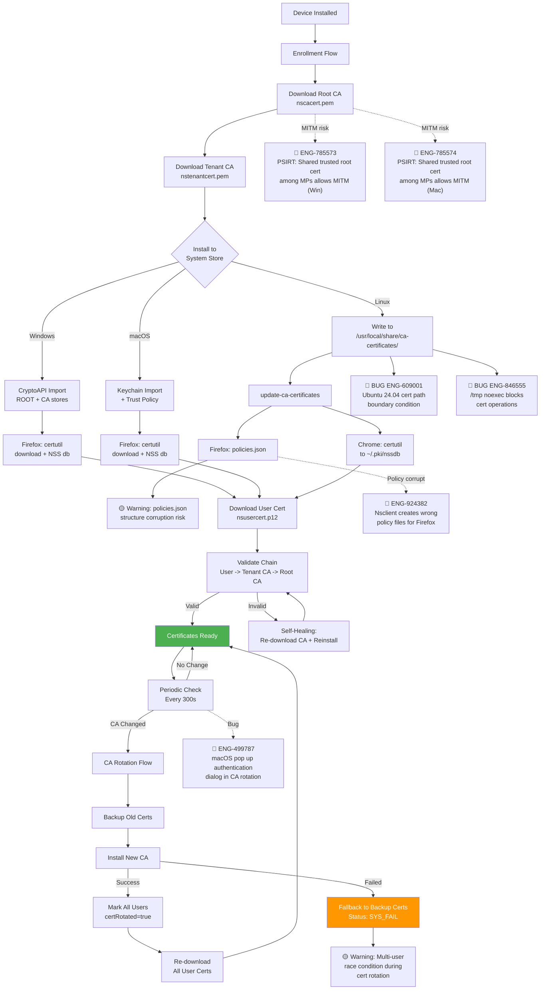
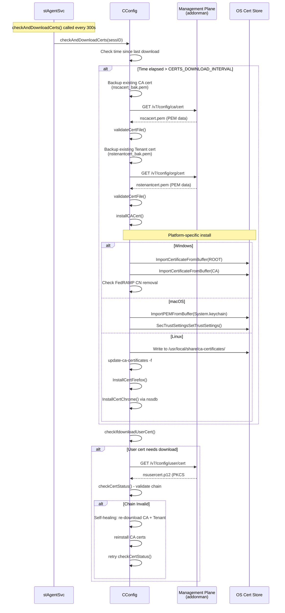
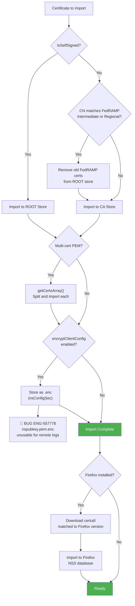
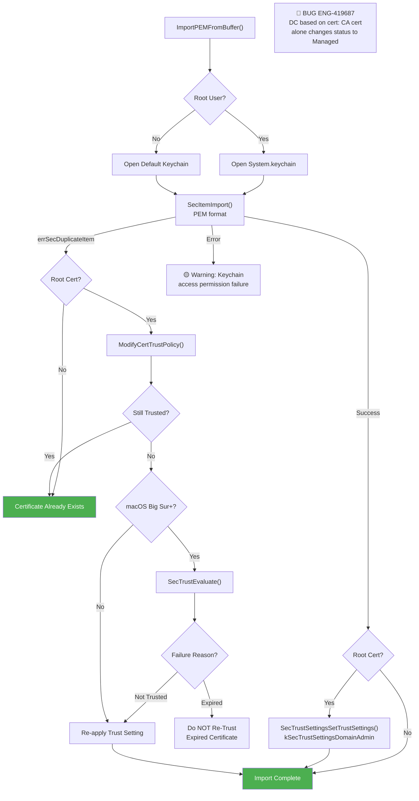
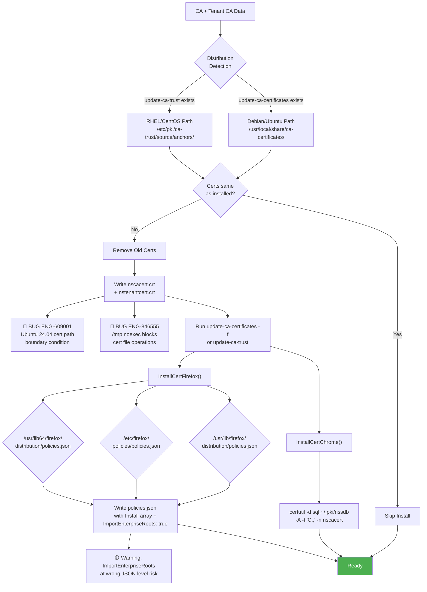
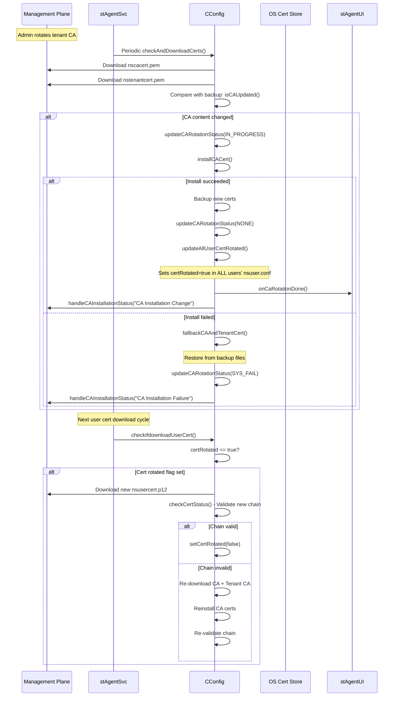
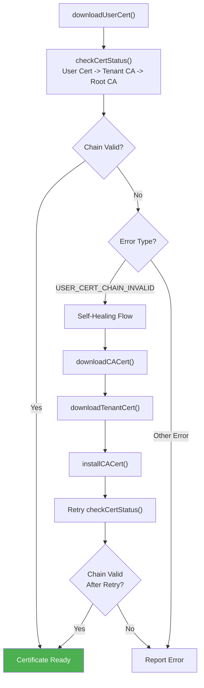

# 13. Certificate Management

**Escalation Bug Count**: 16 (cross-referenced) | **Regression**: 4 (33%) | **Day-1**: 3 (25%) | **Test Gap**: 3 (25%)

📋 **[Test Cases — Google Sheet](https://docs.google.com/spreadsheets/d/1ackCZ-EcepXw1BkSGoi5Go9Ex1I72-fXqcqLGMGiuio/edit?gid=2121756775#gid=2121756775)**

> This chapter covers how NSClient manages SSL/TLS certificates across the full lifecycle: downloading from Management Plane, installing into platform-specific trust stores, validating certificate chains, rotating CA certificates, and handling cert-pinned applications. Certificate management is foundational to NSClient's SSL interception capability and tunnel authentication. While no bugs are filed directly under "Certificate Management" as a feature category, **12 escalation bugs from other feature areas** directly involve certificate-related failures -- making this a critical cross-cutting concern.

---

## Overview

NSClient sits between the endpoint and the internet, intercepting HTTPS traffic for inspection by the Netskope Cloud. For this to work, three certificate-dependent operations must all succeed:

1. **Root CA + Tenant CA installation** -- The endpoint must trust a Netskope-issued root CA certificate so that the cloud can re-sign inspected traffic without triggering browser certificate errors. Each platform has its own trust store mechanism (Windows CryptoAPI, macOS Keychain, Linux system CA directory).
2. **User certificate authentication** -- Each device needs a unique PKCS#12 user certificate to authenticate when establishing the SPDY tunnel to the Netskope gateway.
3. **Cert-pinned application handling** -- Applications that reject non-default CAs must be identified and either bypassed, blocked, or allowed through with special handling.

Without proper certificate management, HTTPS interception fails (users see certificate errors on every site), tunnel establishment fails (gateway rejects unauthenticated devices), and certificate rotation becomes a fleet-wide outage event.

The highest-risk areas identified from cross-referenced escalation bugs are:

- **Linux certificate installation failures** (ENG-609001, ENG-846555) -- Ubuntu 24.04 boundary conditions, /tmp noexec blocking cert operations, Firefox policies.json corruption risk
- **Config encryption + certificate interaction** (ENG-557778) -- nspubkey.pem.enc rendered unusable after Secure Enrollment
- **Cert-pinned application logic errors** (ENG-595031, ENG-742949, ENG-525399, ENG-499052) -- Wrong API endpoints, bypass failures, Android-specific exceptions
- **TLS/DTLS tunnel authentication** (ENG-503501, ENG-429034) -- DTLS-to-TLS fallback failures, SSL_read errors

---

## Certificate Types and Hierarchy

NSClient uses a three-tier certificate chain: Root CA -> Tenant CA (intermediate) -> User Cert. This design allows per-tenant isolation (each tenant gets a unique intermediate CA), independent rotation (root and tenant CA can be rotated independently), and user-level authentication (each user/device gets a unique PKCS#12 certificate for tunnel auth).

| Certificate | File Name | Format | Purpose | Scope | Rotation |
|---|---|---|---|---|---|
| **Root CA** | `nscacert.pem` | PEM | Trust anchor for SSL interception; installed into OS trust store | Per-organization | Rare; triggers CA rotation flow |
| **Tenant CA** | `nstenantcert.pem` | PEM | Intermediate CA; signs user certs; installed into intermediate store | Per-tenant | Can rotate independently of root CA |
| **User Cert** | `nsusercert.p12` | PKCS#12 | Device/user authentication for tunnel establishment | Per-user per-device | On CA rotation or re-enrollment |
| **Root CA Backup** | `nscacert_bak.pem` | PEM | Fallback if new root CA installation fails | Per-organization | Updated after successful install |
| **Tenant CA Backup** | `nstenantcert_bak.pem` | PEM | Fallback if new tenant CA installation fails | Per-tenant | Updated after successful install |
| **Log Encryption Key** | `nspubkey.pem` | PEM | Public key for encrypting log files before upload | Per-organization | Downloaded during config sync |

**Key source files**:
- `lib/nsConfig/config.h` -- Certificate file name definitions, API endpoint definitions, CA_ROTATION_STATUS enum
- `lib/nsConfig/config.cpp` -- Download, install, rotation, and validation logic
- `lib/nsConfig/win/cert.h` / `cert.cpp` -- Windows certificate store operations
- `lib/nsConfig/osx/cert.h` / `cert.cpp` -- macOS Keychain operations
- `lib/nsConfig/linux/cert.h` / `cert.cpp` -- Linux system CA and browser-specific installation
- `lib/nsConfig/ios/cert.cpp` -- iOS certificate operations (stub/no-op, handled by MDM)
- `lib/nsCert/peer.cpp` -- Peer certificate verification for tunnel TLS
- `lib/nsConfig/nsConfigSec.h` -- Config encryption module (handles `.enc` suffix for encrypted cert files)

---

## Certificate Lifecycle Flow (All Platforms)

The following diagram shows the complete certificate lifecycle from first enrollment through ongoing rotation, annotated with known failure points from escalation bugs. Certificate download happens every 300 seconds (`CERTS_DOWNLOAD_INTERVAL`). The most dangerous operation is CA rotation, where a failed installation triggers a fallback mechanism that restores backup certificates -- but race conditions during multi-user scenarios can leave individual users with stale certificates.



### Node Risk Assessment: Certificate Lifecycle

| Node | Risk | Assessment |
|---|---|---|
| Download Root CA | Low | Standard HTTPS download from MP; retries built in |
| Download Tenant CA | Low | Same download mechanism as Root CA |
| Install to System Store | **High** | Platform-specific; multiple failure modes (permissions, locked keychain, noexec) |
| Firefox: policies.json | 🟡 **Medium** | Predicted risk: structure corruption breaks Firefox trust |
| Ubuntu 24.04 cert path | **High** | ENG-609001 -- .deb package boundary condition on Ubuntu 24.04 |
| /tmp noexec | **High** | ENG-846555 -- Security hardening blocks cert file operations |
| Download User Cert | Medium | Requires successful CA installation first |
| Validate Chain | Medium | Chain validation can trigger self-healing re-download loop |
| CA Rotation Flow | **High** | Fleet-wide operation; failure can break SSL interception for all users |
| Fallback to Backup | Medium | Restores old certs but multi-user race condition exists |
| Mark All Users certRotated | Medium | No atomic lock between flag write and cert download |

---

## Certificate Download and Installation Flow (All Platforms)

NSClient downloads certificates from the Management Plane (addonman API) during initial enrollment and periodically during operation. The API endpoints have evolved across three security generations (V1 legacy, V5 API Security with HMAC, V7 Secure Config with JWT). The client selects the API version based on feature flags: `validateConfig == true` uses V7, `enableAPISecurity == true` uses V5, otherwise V1/V2 legacy.

The download sequence is sequential: Root CA first, then Tenant CA, then install both, then User Cert. If any step fails, later steps are skipped. This sequential dependency means a transient MP outage during Root CA download silently prevents User Cert refresh as well.



---

## Windows

**Bug Count**: 5 cross-referenced | **Key Gaps**: Config encryption, FedRAMP cert cleanup, cert-pinned bypass logic

Windows certificate installation uses the Windows CryptoAPI to import certificates into the machine-level certificate store (`CERT_SYSTEM_STORE_LOCAL_MACHINE`). The root CA goes to the `ROOT` store and the tenant CA goes to the `CA` (intermediate) store. A key design detail is that `ImportCertificateFromBuffer()` performs an automatic self-signed check -- if a certificate targeted for the ROOT store is not self-signed, it is redirected to the CA store instead.

FedRAMP environments have special certificate handling. When FedRAMP intermediate certificates are detected (by matching CN against "Netskope Tenant Authority (FedRAMP Intermediate)" or "Netskope Tenant Authority (FedRAMP Regional)"), the code removes old FedRAMP certificates from the ROOT store that may have been incorrectly placed there during upgrade scenarios. The ENG-897416 bug (FedRAMP client connecting to commercial domains) highlights the importance of testing FedRAMP-specific certificate and configuration isolation.



### Windows Node Risk Assessment

| Node | Risk | Assessment |
|---|---|---|
| IsSelfSigned? | Low | Prevents intermediate certs in ROOT store |
| FedRAMP CN match | Medium | FedRAMP-specific cleanup; ENG-897416 shows FedRAMP isolation gaps |
| encryptClientConfig | **High** | ENG-557778 -- nspubkey.pem gets encrypted despite being on ignore list |
| Firefox certutil download | Medium | Version mismatch or download failure causes Firefox cert errors |
| getCertsArray() | Low | Multi-cert PEM splitting; well-tested path |

### Windows Bug Mapping

| Bug ID | Summary | Root Cause | Severity |
|---|---|---|---|
| ENG-557778 | nspubkey.pem.enc unusable for remote log collection | Secure Enrollment creates .enc before ignore list applied | S2 |
| ENG-595031 | Incorrect cert-pinned app definition applied | Client calls wrong API (steering/pinnedapps vs steering/dynamicpinnedapps) | S2 |
| ENG-649593 | ACK numbers mangled with local proxy + cert pin bypass | Day-1 packet handling bug in proxy + cert-pinned combination | S3 |
| ENG-718498 | DNS TCP bypassed with cert pinned block | DNS TCP traffic escapes cert-pinned block rule | S3 |
| ENG-742949 | Cert pinned bypass not working | Regression from ENG-649593 fix; bypass by tunnel still decrypted | S2 |

## macOS

**Bug Count**: 2 cross-referenced + known internal issues | **Key Gaps**: Trust policy recovery, Keychain permissions, Network Extension cert access

macOS uses the Security framework (`SecItemImport`, `SecTrustSettingsSetTrustSettings`) to import certificates into the System Keychain at `/Library/Keychains/System.keychain`. The root CA requires an explicit trust policy setting at the admin domain level. A known issue causes macOS to sometimes silently remove the trust policy for the Netskope root CA. The `ModifyCertTrustPolicy()` function checks whether the certificate is still trusted and re-applies the trust setting when a duplicate certificate import is detected.

On macOS Big Sur and above, an additional check using `SecTrustEvaluate()` distinguishes between "not trusted" and "expired" certificates -- expired certificates are intentionally not re-trusted.



### macOS Node Risk Assessment

| Node | Risk | Assessment |
|---|---|---|
| Open System.keychain | Medium | Requires root; Network Extension sandbox may block |
| SecItemImport | Low | Standard Security framework import |
| ModifyCertTrustPolicy | 🟡 **High** | Predicted risk: macOS trust policy silently removed |
| SecTrustEvaluate | Medium | Big Sur+ only; distinguishes not-trusted from expired |
| Re-apply Trust Setting | Medium | Workaround for silent trust removal |
| Keychain access permission | Medium | App Sandbox restrictions in System Extension mode |

### macOS Bug Mapping

| Bug ID | Summary | Root Cause | Severity |
|---|---|---|---|
| ENG-419687 | Device Classification by cert: CA cert alone changes to Managed | CA cert in Personal store without client cert triggers Managed status | S3 |
| ENG-557778 | nspubkey.pem.enc unusable (shared with Windows) | Config encryption on Big Sur+ creates unusable encrypted key | S2 |

## Linux

**Bug Count**: 4 cross-referenced | **Key Gaps**: Ubuntu 24.04 support, /tmp noexec environments, Firefox policies.json, multi-distro coverage

Linux certificate installation is the most complex platform due to distribution diversity. The code writes PEM files to the system CA directory and runs the platform's certificate update command. It auto-detects the distribution: Debian/Ubuntu uses `/usr/local/share/ca-certificates/` with `update-ca-certificates`, while RHEL/CentOS uses `/etc/pki/ca-trust/source/anchors/` with `update-ca-trust`.

Firefox on Linux uses `policies.json` for enterprise certificate management, with paths varying by distribution and install method. Chrome uses the NSS database at `~/.pki/nssdb`. Four escalation bugs directly affect Linux certificate operations, making it the highest-risk platform for certificate installation failures.



### Linux Node Risk Assessment

| Node | Risk | Assessment |
|---|---|---|
| Distribution Detection | Low | Simple file existence check |
| Write nscacert.crt | **High** | ENG-609001 (Ubuntu 24.04) + ENG-846555 (/tmp noexec) |
| update-ca-certificates | Medium | Can fail silently; must run with -f flag |
| InstallCertFirefox | 🟡 **High** | Predicted risk: policies.json corruption |
| Firefox Snap path | Medium | Different path than standard Firefox; Ubuntu 22+ only |
| InstallCertChrome (nssdb) | Medium | Existing cert with same nickname causes failure; code retries once |

### Linux Bug Mapping

| Bug ID | Summary | Root Cause | Severity |
|---|---|---|---|
| ENG-609001 | Ubuntu 24.04 cert errors from .deb install | .deb package not supported on Ubuntu 24.04; cert path boundary | S2 |
| ENG-846555 | Linux auto-upgrade fails with /tmp noexec security hardening | Installer uses /tmp; noexec blocks cert operations | S2 |
| *(predicted)* | Firefox policies.json: ImportEnterpriseRoots at wrong JSON level | Code analysis reveals incorrect JSON structure risk | S3 |

## Android

**Bug Count**: 2 cross-referenced | **Key Gaps**: Cert-pinned app exceptions, OS-level bypass behavior

Android certificate handling is primarily delegated to the Java/Kotlin layer via JNI callbacks. The native C++ service calls `downloadCACert()` which triggers the Java layer to install certificates using the Android KeyStore API. On Android 7+ (SDK 24+), user-installed CA certificates are not trusted by default for apps, requiring the VPN service's network security config or MDM push as system-level trust anchor.

The main certificate-related bugs on Android involve cert-pinned application exception handling rather than certificate installation itself. ENG-499052 shows that cert-pinned exceptions were not enforced at the OS level from R112.1 onwards, and ENG-525399 shows that a cert-pinned app regex bypass error can cause ALL traffic to be bypassed.

### Android Bug Mapping

| Bug ID | Summary | Root Cause | Severity |
|---|---|---|---|
| ENG-499052 | Teams cert-pinned exceptions not enforced at OS level | Cert-pinned OS-level bypass removed in R112.1; regression | S2 |
| ENG-525399 | CertPinned app exception bypass causing ALL traffic bypassed | Native apps with regex on cert-pinned list cause over-broad bypass | S2 |

## iOS

iOS certificate installation is handled entirely via MDM profile distribution. The `lib/nsConfig/ios/cert.cpp` file contains stub implementations that return success without performing actual operations. All certificate functions are no-ops because iOS does not allow apps to install certificates into the system trust store programmatically. The MDM administrator must push a configuration profile containing the Netskope root CA, and the user must manually trust the profile in Settings > General > About > Certificate Trust Settings.

*No escalation bugs specific to iOS certificate management. iOS cert-related bugs (ENG-450735) are steering/exception issues rather than certificate installation failures.*

## ChromeOS

ChromeOS uses the Android certificate handling path. Certificate installation goes through the Android KeyStore API via the VPN service. No escalation bugs directly reference ChromeOS certificate installation.

*TODO: Validate ChromeOS cert-pinned app behavior matches Android expectations.*

---

## Backend

Backend certificate management involves the Management Plane (addonman) serving certificate files through versioned API endpoints, CA rotation coordination, and cert-pinned app list distribution.

The ENG-897416 bug highlights a backend-related certificate concern: FedRAMP/PBMM NSClient initiates outbound connections to the commercial domain `sfchecker.goskope.com` despite being configured for a govskope tenant. While this is primarily a configuration/steering issue, it demonstrates that certificate trust domain boundaries can be violated by legacy code paths.

## CA Certificate Rotation Flow (All Platforms)

CA rotation is a critical fleet-wide operation that replaces the root CA and/or tenant CA. The state machine tracks rotation progress using `CA_ROTATION_STATUS` (NONE, IN_PROGRESS, FRESH_SYS_FAIL, SYS_FAIL). A separate `CA_ROTATION_3RD_STATUS` tracks third-party store installation (Firefox, Java/Android). The highest risk during rotation is the multi-user race condition: `updateAllUserCertRotated()` iterates all user configs and sets `certRotated=true`, but if a user's tunnel is simultaneously downloading a user cert, the old cert may be written after the flag is set.



---

## Certificate Chain Validation (All Platforms)

After downloading the user certificate, NSClient validates the complete certificate chain: User Cert -> Tenant CA -> Root CA. If the chain is invalid (`USER_CERT_CHAIN_INVALID`), the code attempts a self-healing flow: re-download the CA and Tenant CA, reinstall them, and retry validation. This self-healing mechanism handles the case where the CA was rotated but the new CA was not yet installed when the user cert was downloaded.



---

## Certificate-Pinned Application Handling (All Platforms)

Some applications use certificate pinning to reject any CA not in their built-in trust list. NSClient maintains a `certPinnedAppList` configuration specifying how to handle these applications. The list is downloaded via the addonman API (`getCertPinnedListV3()` or `getCertPinnedListV2()`). ENG-595031 exposed a critical bug where the client called the wrong API endpoint (`steering/pinnedapps` instead of `steering/dynamicpinnedapps`) when Secure Config Validation and Dynamic Steering were both enabled.

Cert-pinned app handling involves three key bugs that form a regression chain: ENG-649593 (original ACK mangling bug with proxy + cert pin) was fixed, but the fix caused ENG-742949 (cert-pinned bypass stopped working), which required a subsequent fix.

```mermaid
flowchart TD
    TRAFFIC["Outbound HTTPS Traffic"] --> MATCH{Matches<br/>certPinnedAppList?}

    MATCH -->|No| NORMAL["Normal SSL Interception"]
    MATCH -->|Yes| ACTION{Action?}

    ACTION -->|BYPASS (1)| BYPASS["Bypass SSL Interception"]
    ACTION -->|BLOCK (0)| BLOCK["Block Traffic"]
    ACTION -->|BMD (2)| DC_CHECK{Device<br/>Managed?}
    ACTION -->|CUSTOM_DC (3)| LABEL_CHECK{Custom DC<br/>Label Match?}
    ACTION -->|DECRYPTION (4)| DECRYPT["Attempt Decryption"]

    DC_CHECK -->|Yes| BYPASS
    DC_CHECK -->|No| BLOCK

    LABEL_CHECK -->|Yes| BYPASS
    LABEL_CHECK -->|No| BLOCK

    BYPASS --> MODE{Mode?}
    MODE -->|direct| DIRECT["Traffic bypasses tunnel entirely"]
    MODE -->|tunnel| TUNNEL["Traffic through tunnel,<br/>no SSL interception"]

    TUNNEL --> BUG_BYPASS["🔴 BUG ENG-742949<br/>Cert pinned bypass<br/>still decrypted intermittently"]

    BLOCK --> DNS_CHECK{DNS TCP<br/>from same app?}
    DNS_CHECK -->|Yes| BUG_DNS["🔴 BUG ENG-718498<br/>DNS TCP bypassed<br/>despite block"]
    DNS_CHECK -->|No| DROP[Traffic Dropped]

    DIRECT --> BUG_API["🔴 BUG ENG-595031<br/>Wrong API endpoint:<br/>pinnedapps vs dynamicpinnedapps"]

    NORMAL --> DONE[Continue to Cloud]
    DROP --> DONE
    DIRECT --> DONE
    TUNNEL --> DONE

    style DONE fill:#2196F3,color:#fff
```

### Cert-Pinned App Node Risk Assessment

| Node | Risk | Assessment |
|---|---|---|
| certPinnedAppList match | Medium | Regex matching can cause over-broad matches (ENG-525399 on Android) |
| Action selection | Low | Simple enum lookup |
| Bypass (direct mode) | **High** | ENG-595031 -- Wrong API endpoint for dynamic steering + secure config |
| Bypass (tunnel mode) | **High** | ENG-742949 -- Traffic still decrypted intermittently after bypass |
| Block + DNS TCP | **High** | ENG-718498 -- DNS TCP escapes cert-pinned block |
| Device Managed check | Medium | ENG-419687 -- CA cert alone triggers Managed status |

---

## Config Encryption and Certificates (All Platforms)

When `encryptClientConfig` is enabled, certificate files are stored with a `.enc` suffix (e.g., `nscacert.pem.enc`). The `CConfigSec` class handles transparent encryption/decryption. The `nspubkey.pem` file is explicitly listed in `m_ignoredFiles` in `nsConfigSec.h`, meaning it should NOT be encrypted -- it is a public key used for log encryption and must be readable without decryption.

However, ENG-557778 demonstrated that the Secure Enrollment flow can create `nspubkey.pem.enc` before the ignore list is applied, rendering remote log collection non-functional. This bug was classified as "missing test case -- neither dev nor QE test it" and highlights the need for config encryption + certificate interaction testing.

Config encryption is supported on: Windows (always), macOS (Big Sur+ only), Linux (available), Android/iOS (not supported).

---

## Automation Coverage Summary

The following table maps test cases to existing automation in the golden regression suite at `golden_regression/tests/features/`.

| Test Area | Golden Regression Suite Coverage | Status |
|---|---|---|
| **SSL Pinned App Bypass** | `ssl_pinned_app/test_p0.py::test_12_ssl_pinned_bypass` | ✅ Covered |
| **SSL Pinned App Block/Drop** | `ssl_pinned_app/test_p0.py::test_13_ssl_pinned_drop` | ✅ Covered |
| **SSL Pinned App Drop Events** | `ssl_pinned_app/test_p0.py::test_14_ssl_pinned_drop_events_log` | ✅ Covered |
| **SSL Pinned App Web Mode** | `ssl_pinned_app/test_p0.py::test_15_ssl_pinned_web_mode` | ✅ Covered |
| **SSL Pinned App On-Prem** | `ssl_pinned_app/test_p0.py::test_18_ssl_pinned_bypass_on_prem` | ✅ Covered |
| **SSL Pinned App Off-Prem** | `ssl_pinned_app/test_p0.py::test_19_ssl_pinned_bypass_off_prem` | ✅ Covered |
| **Root CA Installation** | -- | ❌ Not covered |
| **CA Rotation Flow** | -- | ❌ Not covered |
| **CA Rotation Fallback** | -- | ❌ Not covered |
| **Config Encryption + Certs** | -- | ❌ Not covered |
| **Firefox policies.json (Linux)** | -- | ❌ Not covered |
| **Chrome NSS db (Linux)** | -- | ❌ Not covered |
| **FedRAMP Cert Cleanup** | -- | ❌ Not covered |
| **macOS Trust Policy Recovery** | -- | ❌ Not covered |
| **Cert Chain Validation + Self-Healing** | -- | ❌ Not covered |
| **DTLS-to-TLS Fallback** | -- | ❌ Not covered |
| **DNS TCP + Cert Pinned Block** | -- | ❌ Not covered |
| **Cert Pinned + Dynamic Steering + Secure Config** | -- | ❌ Not covered |
| **Remote Log Collection + encryptClientConfig** | -- | ❌ Not covered |
| **Ubuntu 24.04 Cert Installation** | -- | ❌ Not covered |
| **/tmp noexec Cert Installation** | -- | ❌ Not covered |

**Coverage Summary**: 6 of 21 test areas covered (29%). The ssl_pinned_app suite provides good coverage for basic cert-pinned bypass/block scenarios, but CA lifecycle operations (installation, rotation, fallback, chain validation) and platform-specific cert installation (Linux, macOS trust policy) have zero automation coverage.

---

## Cross-Flow Interactions

Certificate management interacts with nearly every other NSClient subsystem. The following interactions have been validated through escalation bug analysis.

### Interaction 1: Certificate + Tunnel Authentication

When the user certificate is invalid or expired, tunnel establishment fails. The tunnel authentication flow (`lib/nsCert/peer.cpp`) uses the Windows CertGetCertificateChain API (on Windows) or equivalent platform APIs to validate against the machine's certificate store. If the tunnel reply contains a "Cert Revoked" (0xab) status, the client triggers a certificate re-download.

ENG-503501 (DTLS-to-TLS fallback failure) and ENG-429034 (Android TLS SSL_read failure) both affect the TLS layer that depends on valid certificates for authentication.

### Interaction 2: Certificate + Config Encryption

ENG-557778 demonstrates that config encryption (`encryptClientConfig`) can create encrypted versions of certificate-adjacent files (nspubkey.pem.enc) that break downstream functionality. The intersection of Secure Enrollment + Config Encryption + Certificate Management is undertested.

### Interaction 3: Certificate + Steering (Cert-Pinned Apps)

Cert-pinned app handling depends on correct API endpoint selection (V2 vs V3 format, static vs dynamic steering lists), correct bypass mode enforcement (direct vs tunnel), and correct DNS TCP handling. The regression chain ENG-649593 -> ENG-742949 shows that fixes in this area have high regression risk.

### Interaction 4: Certificate + FailClose

During CA rotation, if FailClose is active and the CA installation fails, the fallback mechanism restores old certificates -- but the FailClose rules remain based on the old tunnel session. If the tunnel needs to reconnect with new certificates during this window, users can experience network outage.

### Cross-Flow Risk Matrix (Chapter-Relevant)

| Interaction | Chapters Involved | Risk Level | Test Coverage |
|---|---|---|---|
| CA Rotation + Tunnel Reconnect | Ch.13 + Ch.07 | **Critical** | ❌ Not covered |
| Config Encryption + Cert Files | Ch.13 + Ch.18 | **High** | ❌ Not covered |
| Cert-Pinned + Dynamic Steering + Secure Config | Ch.13 + Ch.05 | **High** | ❌ Not covered |
| CA Rotation + FailClose | Ch.13 + Ch.11 | **High** | ❌ Not covered |
| Cert-Pinned Bypass + Proxy | Ch.13 + Ch.14 | **Medium** | ⚠️ Partial |
| Linux Cert Install + Browser Trust | Ch.13 + Ch.01 | **High** | ❌ Not covered |
| CA Rotation + Multi-User VDI | Ch.13 + Ch.07 | **High** | ❌ Not covered |
| DTLS/TLS Fallback + Cert Auth | Ch.13 + Ch.07 | **Medium** | ❌ Not covered |

## Troubleshooting

### Log Keywords

| Keyword | Context | Meaning |
|---|---|---|
| `downloading ca cert` | `config.cpp` | Root CA download started |
| `downloading tenant cert` | `config.cpp` | Tenant CA download started |
| `downloading user cert` | `config.cpp` | User cert download started |
| `ca cert downloaded successfully` | `config.cpp` | Root CA download succeeded |
| `downloaded ca cert is invalid` | `config.cpp` | Root CA validation failed |
| `cacert imported successfully` | `cert.cpp` | Certificate installed to OS store |
| `failed to import cacert` | `cert.cpp` | Certificate install failed |
| `Failed to set trust setting error` | `osx/cert.cpp` | macOS trust policy setting failed |
| `CA is installed to system` | `linux/cert.cpp` | Linux system CA updated |
| `installed nssdb` | `linux/cert.cpp` | Linux Chrome/NSS db updated |
| `write firefox policy file` | `linux/cert.cpp` | Linux Firefox policies.json updated |
| `cert rotating, update all users tag` | `config.cpp` | CA rotation marking all users for re-download |
| `Set ca cert update status to` | `config.cpp` | CA rotation status changed |
| `Install CA failed, ca rotation status` | `config.cpp` | CA install failed, fallback initiated |
| `checkCertStatus return` | `config.cpp` | Certificate chain validation result |
| `USER_CERT_CHAIN_INVALID` | `config.cpp` | User cert chain does not validate against CA |
| `need to download user cert again` | `config.cpp` | User cert will be re-downloaded (certRotated=true) |
| `Certificate is already in store` | `osx/cert.cpp` | Duplicate cert detected (not an error) |
| `Certificate deleted successfully` | `win/cert.cpp` | FedRAMP cert cleanup on Windows |

### Certificate File Locations

| Platform | Data Path | Download Path |
|---|---|---|
| **Windows** | `%ProgramData%\Netskope\STAgent\data\` | `%ProgramData%\Netskope\STAgent\download\` |
| **macOS** | `/Library/Application Support/Netskope/STAgent/data/` | `/Library/Application Support/Netskope/STAgent/download/` |
| **Linux** | `/opt/netskope/stagent/data/` | `/opt/netskope/stagent/download/` |

### Constants

| Constant | Value | Description |
|---|---|---|
| `CERTS_DOWNLOAD_INTERVAL` | 300 seconds | Minimum interval between certificate download attempts |
| Issuer Email | `certadmin@netskope.com` | Email address used to identify Netskope-issued certificates |

---

## Appendix A: Bug Quick Reference

All certificate-related bugs cross-referenced from escalation bug data across all 4 feature categories (install/upgrade, steering, tunneling, failclose).

| Bug ID | Summary | Platform | Primary Feature | Root Cause | Severity | Bug Type |
|---|---|---|---|---|---|---|
| ENG-419687 | DC based on cert: CA cert alone changes status to Managed | Windows/Mac | Device Classification | CA cert in Personal store without client cert triggers Managed | S3 | Test Gap |
| ENG-429034 | Android tunnel disconnects with TLS SSL_read failed | Android | Tunneling | SSL_read error on specific Samsung devices with data switch | S3 | Corner Case |
| ENG-499052 | Teams cert-pinned exceptions not enforced at OS level | Android | Steering | OS-level bypass removed in R112.1 | S2 | Regression |
| ENG-503501 | DTLS doesn't fallback to TLS | Windows | Tunneling | Regression from ENG-445563: TLS fallback not executed | S2 | Regression |
| ENG-525399 | CertPinned app exception bypass causing ALL traffic bypassed | Android | Steering | Native apps with regex cause over-broad bypass | S2 | Test Gap |
| ENG-557778 | nspubkey.pem.enc unusable for remote log collection | Windows | Install/Config | Secure Enrollment creates .enc before ignore list applied | S2 | Test Gap |
| ENG-595031 | Incorrect cert-pinned app definition applied | Windows | Steering/Config | Wrong API endpoint with Secure Config + Dynamic Steering | S2 | Regression |
| ENG-609001 | Ubuntu 24.04 cert errors from .deb install | Linux | Install | .deb package not supported on Ubuntu 24.04 | S2 | Day-1 |
| ENG-649593 | ACK numbers mangled with proxy + cert pin bypass | Windows | Steering | Day-1 packet handling bug in specific combination | S3 | Day-1 |
| ENG-718498 | DNS TCP bypassed with cert pinned block | Windows | Steering/FailClose | DNS TCP escapes cert-pinned block rule | S3 | Enhancement |
| ENG-742949 | Cert pinned bypass not working | Windows | Steering | Regression from ENG-649593 fix | S2 | Regression |
| ENG-846555 | Linux auto-upgrade fails with /tmp noexec | Linux | Install | Installer uses /tmp; noexec blocks operations | S2 | Day-1 |
| ENG-897416 | FedRAMP NSClient connects to commercial domain | All | Steering/PKI | Deprecated sfchecker still sends DNS to commercial domain | S2 | Day-1 |
| [ENG-499787](https://netskope.atlassian.net/browse/ENG-499787) | macOS nsclient pop up authentication dialog in CA rotation |
| [ENG-785573](https://netskope.atlassian.net/browse/ENG-785573) | PSIRT: Shared trusted root cert among MPs allows MITM on Netskope tenant user (w |
| [ENG-785574](https://netskope.atlassian.net/browse/ENG-785574) | PSIRT: Shared trusted root cert among MPs allows MITM on Netskope tenant user (M |
| [ENG-924382](https://netskope.atlassian.net/browse/ENG-924382) | CLONE - [MAIF] Nsclient create a wrong policy files for Firefox breaking the pol |

---

## Appendix B: Methodology

### Severity Rating Definitions

| Rating | Definition |
|---|---|
| **S1** | Complete loss of certificate functionality; HTTPS interception broken for all users; tunnel cannot establish |
| **S2** | Certificate functionality degraded for specific platform, configuration, or user scenario; workaround available |
| **S3** | Minor certificate issue; edge case or cosmetic; does not block core functionality |

### Test Case Format

| Field | Description |
|---|---|
| **ID** | TC-13-NN format (chapter 13, sequential number) |
| **Test Case** | Description of what to test |
| **Severity** | S1-S3 impact if test fails |
| **Related Bugs** | ENG-XXXXXX references from escalation data |
| **Flow Point** | Which diagram node this test validates |
| **Gap Type** | Regression / Day-1 / Test Gap / Corner Case |
| **Auto Priority** | P1 (must automate) / P2 (should automate) / P3 (manual OK) |

### Gap Type Taxonomy

| Gap Type | Definition |
|---|---|
| **Regression** | Previously working feature broken by a code change |
| **Day-1** | Bug existed since feature was first implemented |
| **Test Gap** | No test case exists for this scenario |
| **Corner Case** | Scenario difficult to reproduce; environment-specific |

### Bug Cross-Reference Methodology

This chapter has 0 bugs filed directly under "Certificate Management" as a feature category. All 15 bugs were identified by searching across `bugs/install_upgrade.md` (54 bugs), `bugs/steering.md` (103 bugs), `bugs/tunneling.md` (59 bugs), and `bugs/failclose.md` (28 bugs) for any mention of: certificate, cert, SSL, TLS, HTTPS, pinned, CA, root cert, trust store, MITM, decrypt, nspubkey, nscacert, nstenantcert, nsusercert, policies.json, certutil, Firefox trust, Chrome trust, FedRAMP cert, DTLS.

---

**Related Chapters**:
- [01_installation.md](01_installation.md) -- Certificate installation during initial enrollment
- [02_enrollment.md](02_enrollment.md) -- Certificates provisioned during initial enrollment flow
- [04_config_download.md](04_config_download.md) -- Config download infrastructure shared by cert downloads
- [05_steering_config.md](05_steering_config.md) -- Cert-pinned app list as part of steering config
- [07_tunnel_management.md](07_tunnel_management.md) -- User certificate used for tunnel authentication; DTLS/TLS
- [10_bypass.md](10_bypass.md) -- Cert-pinned applications bypass SSL interception
- [11_failclose.md](11_failclose.md) -- FailClose interaction during CA rotation
- [12_device_classification.md](12_device_classification.md) -- Certificate-based device classification
- [14_proxy_management.md](14_proxy_management.md) -- Proxy + cert-pinned app interaction
- [18_security.md](18_security.md) -- Config encryption (encryptClientConfig) affecting cert file storage
