# 14. Proxy Detection & Management

**Escalation Bug Count**: 5 | **Day-1**: 2 (40%) | **Regression**: 2 (40%) | **Test Gap**: 1 (20%)

📋 **[Test Cases — Google Sheet](https://docs.google.com/spreadsheets/d/1ackCZ-EcepXw1BkSGoi5Go9Ex1I72-fXqcqLGMGiuio/edit?gid=1950109951#gid=1950109951)**

> This chapter covers how NSClient detects, configures, and routes traffic through enterprise proxy servers. Proxy handling is one of the most complex subsystems due to the variety of proxy types, authentication methods, and platform-specific detection APIs. Each flow is illustrated with mermaid diagrams annotated with known escalation bug failure points (🔴 red) and predicted risk points (🟡 yellow).

---

## Overview

Many enterprise networks require all outbound traffic to pass through a proxy server. NSClient must detect these proxy settings and correctly route its own management traffic (config download, status reporting, gateway selection) and its tunnel traffic through the proxy. This creates a layered challenge:

1. **Detection** -- NSClient must discover proxy settings from multiple sources (system settings, PAC files, WPAD, admin-configured proxies in nsconfig.json).
2. **Authentication** -- Enterprise proxies commonly require authentication (NTLM, Basic, Digest), and NSClient must handle the 407 challenge/response flow for its TLS tunnel connection.
3. **Interop Proxy** -- When the endpoint already runs another proxy product (e.g., Cisco AnyConnect Web Security), NSClient acts as a local proxy and must coordinate with that product.
4. **Packet-Level Proxy Management** -- The `CProxyMgr` component intercepts traffic destined for the enterprise proxy, determines whether it should be steered to the Netskope cloud, and performs TCP connection splicing to redirect packets through the tunnel.

The highest-risk patterns in proxy handling are:

- **ENG-593814**: Proxy detection fails after reboot because `addonhost` is not populated, preventing re-detection
- **ENG-463329**: Local proxy not used after upgrade because proxy settings are lost during service restart
- **ENG-649593**: Packet handling anomaly under local proxy + cert-pinned + bypass combination

---

## Architecture & Components

NSClient's proxy subsystem spans multiple modules that cooperate across the detection, authentication, and traffic steering layers.

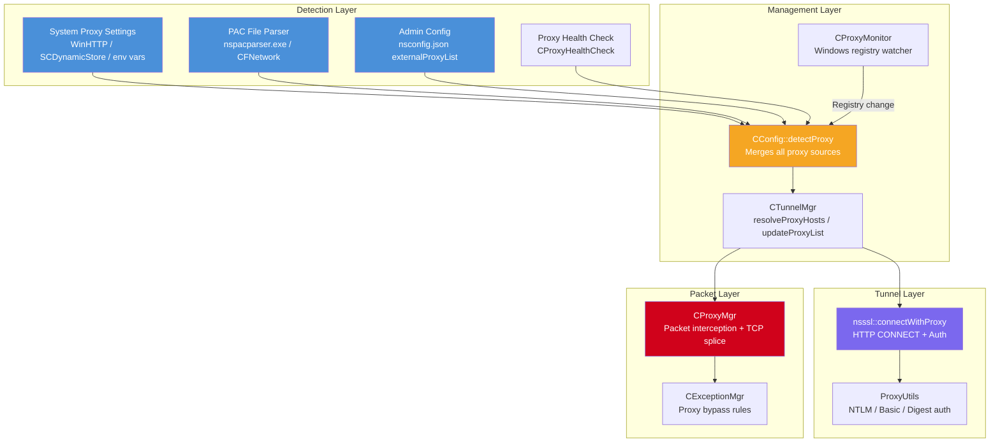

### Component Reference

| Component | Source File | Responsibility |
|---|---|---|
| `CConfig::detectProxy()` | `lib/nsConfig/config.cpp` | Orchestrates proxy detection from all sources, merges active + configured proxy lists |
| `GetProxyForUrl()` | `lib/nsUtils/proxy.cpp` (Win), `lib/nsUtils/osx/proxy.cpp` (macOS) | Platform-specific system proxy detection |
| `CProxyHealthCheck` | `lib/nsUtils/proxyUtils.h` | Validates that admin-configured external proxies are reachable |
| `ProxyUtils` | `lib/nsUtils/proxyUtils.cpp` | NTLM/Basic/Digest authentication header generation |
| `CProxyMgr` | `stAgent/stAgentSvc/proxyMgr.cpp` | Packet-level proxy interception and TCP connection splicing |
| `CProxyMonitor` | `stAgent/stAgentUI/win/ProxyMonitor.cpp` | Windows-only: monitors registry for proxy setting changes |
| `nsssl::connectWithProxy()` | `lib/nsssl/nsssl.cpp` | Sends HTTP CONNECT through proxy for tunnel TLS handshake |
| `CTunnelMgr` | `stAgent/stAgentSvc/tunnelMgr.cpp` | Resolves proxy hosts, manages proxy list for tunnels |
| `CNsproxyApi` | `lib/nsRestApi/nsproxyapi.cpp` | REST API calls to NSProxy (longpoll, device info, speed test) |

---

## Key Data Structures

### INTEROP_PROXY_TYPE

Defines the type of proxy product interoperating with NSClient.

```cpp
typedef enum INTEROP_PROXY_TYPE {
    PROXY_TYPE_NONE       = 0,
    PROXY_TYPE_CISCO_CWS  = 1, // Cisco AnyConnect Web Security
    PROXY_TYPE_EXTERNAL   = 2  // Static proxy configured in admin WebUI
} INTEROP_PROXY_TYPE;
```

### External_Proxy

Represents a proxy entry from the admin configuration (nsconfig.json `externalProxyList` array).

```cpp
struct External_Proxy {
    int proxyProduct;         // PROXY_TYPE_CISCO_CWS or PROXY_TYPE_EXTERNAL
    string proxyHost;         // Proxy hostname or IP
    unsigned short proxyPort; // Proxy port
    string proxyDescription;  // Human-readable description
};
```

### nsProxyListParams

Carries the active proxy list and credentials for HTTP operations (downloads, REST calls).

```cpp
struct nsProxyListParams {
    vector<string> proxyList;     // e.g., ["proxy.corp.com:8080", "10.0.0.1:3128"]
    string proxyCredentials;      // username:password (encrypted at rest)
};
```

### ProxiedConn

Tracks the state of a TCP connection that traverses an enterprise proxy and is being spliced by `CProxyMgr`.

```cpp
typedef enum _ProxiedConnState {
    PCStateSynSent = 0,         // SYN seen going to proxy, bypassed to proxy
    PCStateSynAckRcvd = 1,      // SYN-ACK received from proxy
    PCStateTcpEstablished = 2,  // TCP handshake complete with proxy
    PCStateSynTunneled = 3,     // First data analyzed, SYN replayed to tunnel
    PCStateTunneling            // Full duplex tunneling in progress
} ProxiedConnState;
```

### NS_PROXY_AUTH_METHOD

Authentication methods supported by `ProxyUtils`.

```cpp
enum NS_PROXY_AUTH_METHOD {
    NS_AUTH_NTLM,    // Windows SSPI or manual NTLMv2
    NS_AUTH_BASIC,   // Base64(username:password)
    NS_AUTH_DIGEST   // MD5-based challenge/response
};
```

---

## Proxy Detection Flow

Proxy detection is triggered at several points in the NSClient lifecycle: service startup, user logon, network change, config download, and periodic tunnel reconnect. The `CConfig::detectProxy()` function orchestrates the process. This flow is critical for establishing tunnel connectivity, and failures here can prevent the tunnel from connecting entirely or cause it to fail after system reboot (ENG-593814). The diagram below shows the detection priority chain with known bug failure points marked.

### Detection Trigger Points

| Trigger | Code Location | Description |
|---|---|---|
| Service start | `stAgent/stAgentSvc/main.cpp` | `config.detectProxy()` called during initialization |
| User logon | `lib/nsConfig/config.cpp::detectProxy(sessId)` | Impersonates user session to read per-user proxy settings |
| Network change | `stAgent/stAgentSvc/tunnelMgr.cpp` | `detectProxy()` called when network state changes |
| Config update | `lib/nsConfig/config.cpp` | Re-detect after admin config changes external proxy list |
| Proxy registry change | `stAgent/stAgentUI/win/ProxyMonitor.cpp` | Windows registry watcher triggers re-detection |
| Tunnel reconnect | `stAgent/stAgentSvc/tunnelMgr.cpp::updateProxyList()` | Re-detect before attempting proxy connection |

### Detection Priority Chain

The detection follows a specific priority order, merging results from multiple sources.

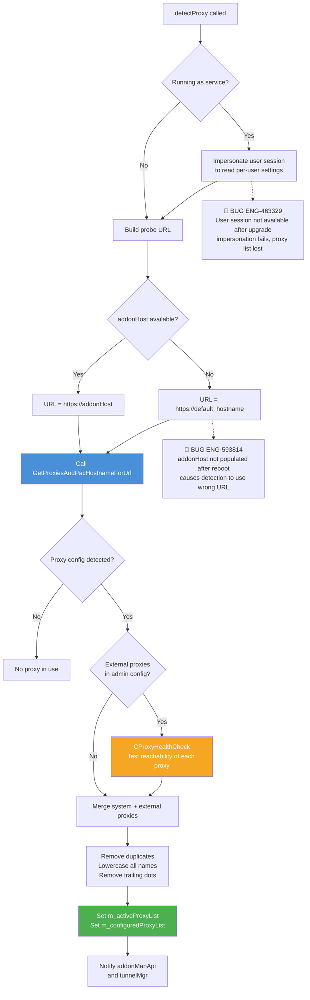

### Node Risk Assessment

| Node | Risk Type | Escalation Impact | Mitigation |
|------|-----------|-------------------|------------|
| USE_DEFAULT (fallback URL) | 🔴 Confirmed Bug ENG-593814 | After reboot, `addonHost` is empty; PAC file returns wrong proxy for generic hostname; tunnel fails | Re-run `detectProxy()` after config download populates `addonHost` |
| IMP (Impersonate user) | 🔴 Confirmed Bug ENG-463329 | After upgrade, user session not available; impersonation fails; proxy settings not read; tunnel connects direct when network blocks direct | Persist last known proxy list to disk as bootstrap |
| HEALTH (Proxy health check) | 🟡 Predicted Risk | If all admin proxies unreachable, tunnel may fail even if system proxy is valid | Ensure system proxies are added to list before health check filters external proxies |

**Pseudo Code** -- `CConfig::detectProxy()`:

```cpp
void CConfig::detectProxy(const string& hostName) {
    // Only supported on Windows and macOS (not Linux/mobile)
    #if defined(__APPLE__) || defined(WIN32)

    // Build probe URL: prefer addonHost, fallback to hostName
    string url = "https://" + (m_addonHost.empty() ? hostName : m_addonHost);

    // Platform-specific system proxy detection
    vector<string> proxies;
    string pacServHost;
    bool detected = GetProxiesAndPacHostnameForUrl(url, proxies, pacServHost);
    set_pacServerHost(pacServHost);

    // Windows: if IgnoreInactiveSystemProxy and system reports proxy config
    // but returns zero proxies, clear the configured list
    #ifdef WIN32
    if (GetIgnoreInactiveSystemProxy() && detected && proxies.empty()) {
        if (m_externalProxyList.empty() && !m_configuredProxyList.empty()) {
            m_configuredProxyList.clear();
        }
    }
    #endif

    if (detected) {
        // macOS Big Sur+: resolve proxy hostnames to IP addresses
        #if defined(__APPLE__)
        if (bigSurOrAbove()) {
            GetResolvedProxyAddressList(m_configuredProxyList);
            GetResolvedProxyAddressList(proxies);
        }
        #endif

        // If network changed or proxy changed, re-check external proxy health
        if (m_networkStateChanged || m_proxyChangedDetected) {
            setConfiguredProxyList();  // rebuild from admin config
            vector<string> activeExternal = 
                m_proxyhealthCheckInstance->getActiveExternalProxies(
                    getAddonURL(), true /* invalidate cache */);
            proxies.insert(proxies.end(), activeExternal.begin(), activeExternal.end());
        }

        // Lowercase, deduplicate, remove trailing dots
        normalizeProxyList(proxies);
        m_activeProxyList = proxies;
        m_proxyListParams.proxyList = m_activeProxyList;
    }
    #endif
}
```

### Proxy Health Check

When the admin configures external proxies in the Netskope WebUI, those are stored in `nsconfig.json` under `externalProxyList`. Before adding them to the active list, `CProxyHealthCheck::getActiveExternalProxies()` verifies each proxy is reachable by attempting an HTTP connection through it. Health checks run in parallel threads (one per proxy) and report reachable proxies.

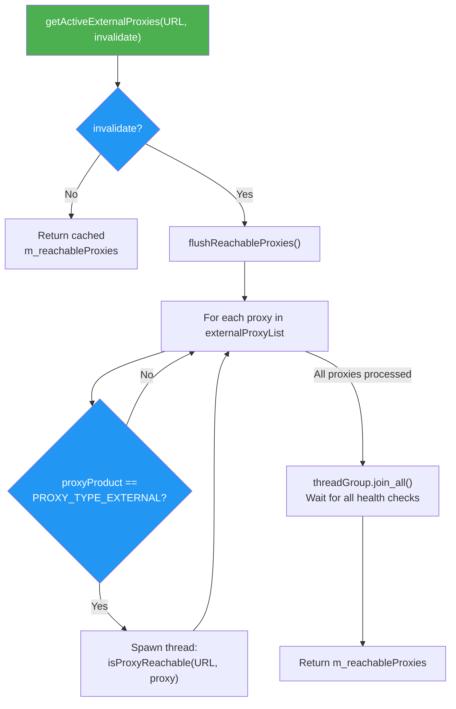

---

## Proxy Authentication Flow

When the tunnel connection is established through a proxy, the proxy may respond with HTTP 407 (Proxy Authentication Required). NSClient supports three authentication methods: NTLM, Basic, and Digest.

The authentication is handled inside `nsssl::connectWithProxy()`, which sends the HTTP CONNECT request and processes the proxy's response.

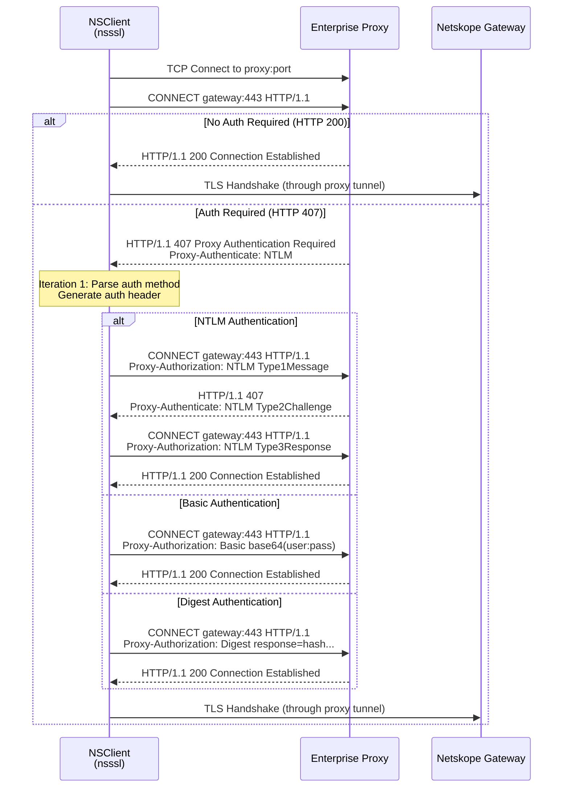

### Authentication Method Details

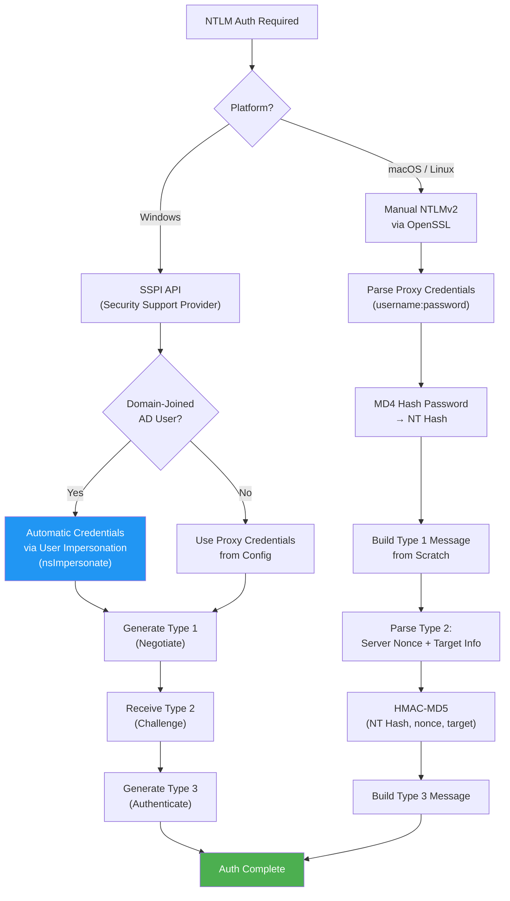

**NTLM (Windows)**:
On Windows, NTLM authentication uses the SSPI (Security Support Provider Interface) API. If the user is a domain-joined AD user, SSPI automatically uses the logged-in user's credentials, so no explicit username/password is needed. For non-AD users, the proxy credentials from config are used.

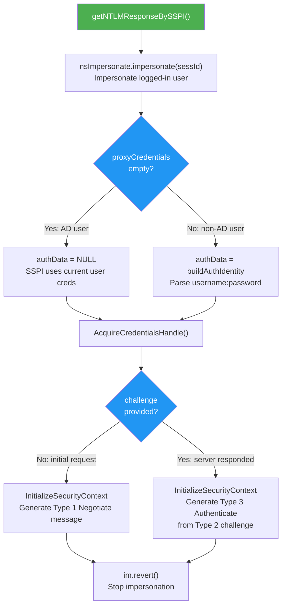

**NTLM (macOS/Linux)**:
On non-Windows platforms, NSClient implements NTLMv2 manually using OpenSSL's MD4 and HMAC-MD5 functions. The implementation generates Type 1 and Type 3 messages from scratch, parsing the Type 2 challenge to extract the server nonce and target information.

**Basic**: Simple base64 encoding of `username:password`.

**Digest**: MD5-based challenge/response using realm, nonce, cnonce, qop parameters.

### Proxy Credential Storage

Proxy credentials are encrypted at rest using AES with a key derived from the system's hardware product ID and a static salt. The encryption/decryption is done by `ProxyUtils::getProxyCredentialInPlainText()` and `getProxyCredentialInCipherText()`.

```cpp
// Credential encryption: AES(productID, salt, plaintext) -> base64
bool getProxyCredentialInCipherText(string& plain, string& cipher) {
    string productId;
    getSystemProductID(productId);       // Hardware-bound key
    string salt = "netskopeclient19";    // Static salt
    encryptWithAES(productId, salt, plain, cipher);
    cipher = base64_encode(cipher);
}
```

---

## Tunnel Through Proxy

When a direct connection to the Netskope gateway fails, NSClient attempts to connect through each proxy in its active proxy list. The tunnel connection flow in `NSTunnel::setupNSSSLTunnel()` implements a fallback strategy.

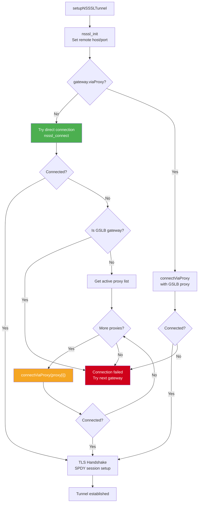

**Pseudo Code** -- `NSTunnel::connectViaProxy()`:

```cpp
int NSTunnel::connectViaProxy(const string& host, const string& hostIP,
                               const string& proxy) {
    nsSSLClient->nsssl_setRemoteHost(host);
    nsSSLClient->nsssl_setRemoteHostIP(hostIP);

    // Parse proxy "host:port"
    nsSSLClient->nsssl_setProxyHost(proxy.substr(0, pos));
    nsSSLClient->nsssl_setProxyPort(atoi(proxy.substr(pos + 1)));
    nsSSLClient->nsssl_setProxyCredentials(proxyListParam.proxyCredentials);

    // When using explicit proxy, EDNS IP cannot be used because the connection
    // terminates at the proxy itself. Force local DNS resolution.
    m_dnsResolver->setResolverType(CNsDNSResolver::useLDNS);

    return nsSSLClient->nsssl_connect();
    // nsssl_connect() internally calls connectWithProxy() which sends
    // HTTP CONNECT and handles 407 authentication
}
```

### HTTP CONNECT Implementation

The `nsssl::connectWithProxy()` function handles the HTTP CONNECT method through the proxy. It iterates up to 3 times to handle NTLM's multi-step authentication (Type 1 -> Type 2 challenge -> Type 3 response).

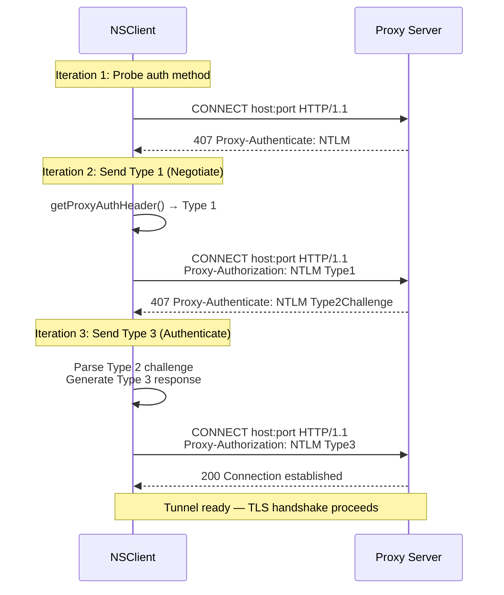

```cpp
int nsssl::connectWithProxy() {
    ProxyUtils proxyutil;
    string authHeader;

    // 3 iterations: identify auth method, send Type 1, send Type 3
    for (int itr = 0; itr < 3; itr++) {
        string msg;
        msg += "CONNECT " + host + ":" + port + " HTTP/1.1\r\n";
        msg += "Host: " + host + ":" + port + "\r\n";
        msg += "User-agent: Mozilla/5.0\r\n";
        if (!authHeader.empty()) msg += authHeader;
        msg += "\r\n";

        send(m_sock, msg);
        recv(m_sock, msg);  // Read proxy response

        int resp;
        sscanf(msg, "HTTP/%s %d", httpVer, &resp);

        if (m_proxyAuthEnabled && (resp == 407 || resp == 401)) {
            proxyutil.getProxyAuthHeader(msg, proxyCredentials,
                                         m_sessId, authHeader);
            continue;  // Retry with auth header
        }

        if (resp != 200) return NSE_ERROR;
        break;  // Success
    }
    return NSE_SUCCESS;
}
```

---

## Packet-Level Proxy Management (CProxyMgr)

`CProxyMgr` is the most complex component. When NSClient runs behind an explicit proxy, applications on the endpoint send their traffic to the proxy server (not directly to the destination). CProxyMgr intercepts this proxy-bound traffic at the packet filter layer, determines whether it should be steered to the Netskope cloud, and performs TCP connection splicing.

### Connection Splicing State Machine

When a packet arrives at the driver destined for an enterprise proxy, CProxyMgr manages a state machine for each TCP connection.

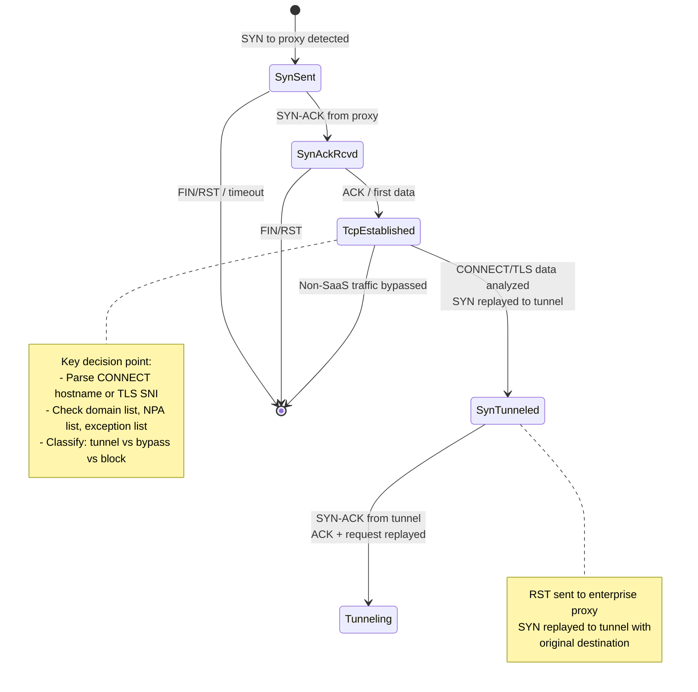

### Packet Processing Flow

The packet processing flow is where `CProxyMgr` intercepts proxy-bound traffic and decides whether to splice it into the tunnel. This is the most complex part of proxy handling and involves careful TCP state management, payload analysis, and SEQ/ACK number translation. The following diagram shows the decision tree with known bug annotations.

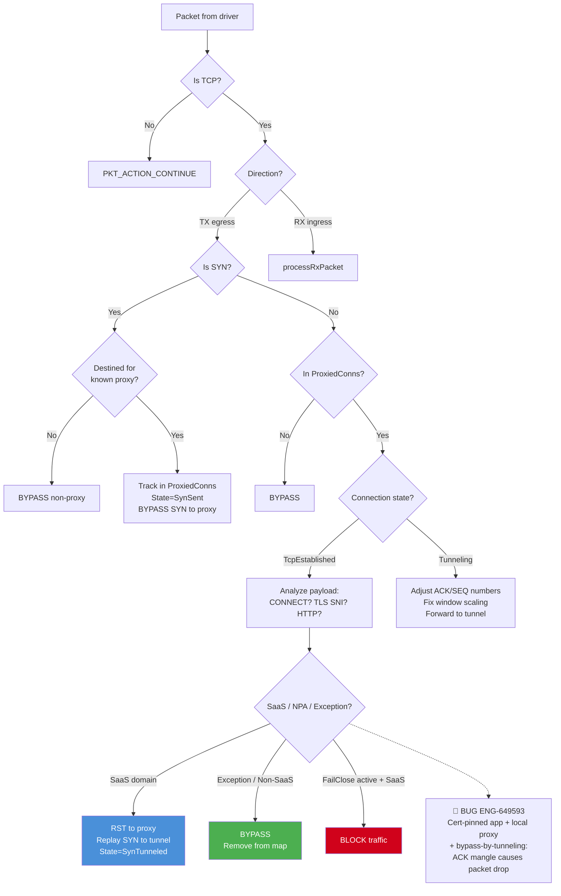

### Node Risk Assessment

| Node | Risk Type | Escalation Impact | Mitigation |
|------|-----------|-------------------|------------|
| CLASSIFY (Bypass decision) | 🔴 Confirmed Bug ENG-649593 | Cert-pinned app + local proxy + bypass-by-tunneling: packet action logic incorrect; ACK mangled; connection fails | Fix bypass-by-tunneling logic for HTTP flows through proxy |
| ANALYZE (Payload parsing) | 🟡 Predicted Risk | Segmented ClientHello not reassembled; SNI extraction fails; steered traffic bypassed | Enable `m_handleSNIFromSegmentPacket` |
| MODIFY (SEQ/ACK adjust) | 🟡 Predicted Risk | SEQ/ACK offset calculation error in multi-segment flows; connection hangs or RST | Audit offset tracking for edge cases (window scaling, SACK) |

### How Connection Splicing Works

When CProxyMgr determines that a proxied connection should be steered:

1. **SYN to proxy**: Bypassed to the enterprise proxy to complete the TCP handshake normally.
2. **TCP Established**: The first data packet (HTTP CONNECT or TLS ClientHello) is analyzed.
3. **Domain check**: The hostname from CONNECT or SNI is checked against the SaaS domain list, NPA domain list, and exception lists.
4. **If steered**: CProxyMgr sends a RST to the enterprise proxy to tear down that connection, then replays the original SYN packet to the Netskope tunnel. The tunnel sees a fresh connection.
5. **Tunneling**: After the tunnel responds with SYN-ACK, CProxyMgr replays the ACK and original request. It then adjusts SEQ/ACK numbers and window scaling factors for all subsequent packets, translating between the proxy's sequence space and the tunnel's sequence space.

### SNI Segmentation Handling

Some applications split the TLS ClientHello across multiple TCP segments. CProxyMgr handles this with `getClientHelloSegmentState()`, which reassembles segments until the complete ClientHello is available for SNI extraction. The `m_handleSNIFromSegmentPacket` flag controls whether this feature is active.

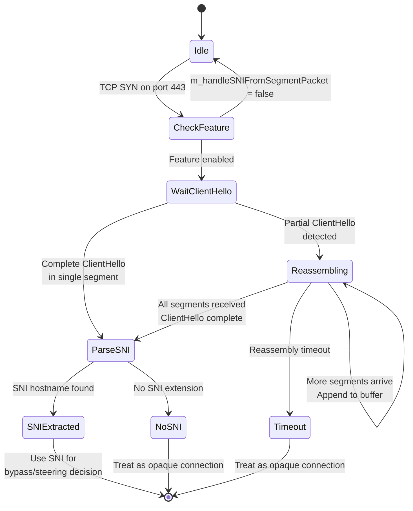

### Interop Proxy Support

When another proxy product like Cisco AnyConnect Web Security (CWS) is present, NSClient handles the extra CWS header (32 or 800 bytes) prepended to each connection. The `m_interopProxyType` and `conn.CWSHdrLen` fields track this, and SEQ number adjustments account for the header.

### VDI Multi-User Proxy Impersonation

In VDI environments with multiple concurrent user sessions, proxy detection must impersonate each user to read per-user proxy settings. A critical bug (ENG-765691) occurs when NSClient attempts to perform alternate steering checks for a disconnected user session.

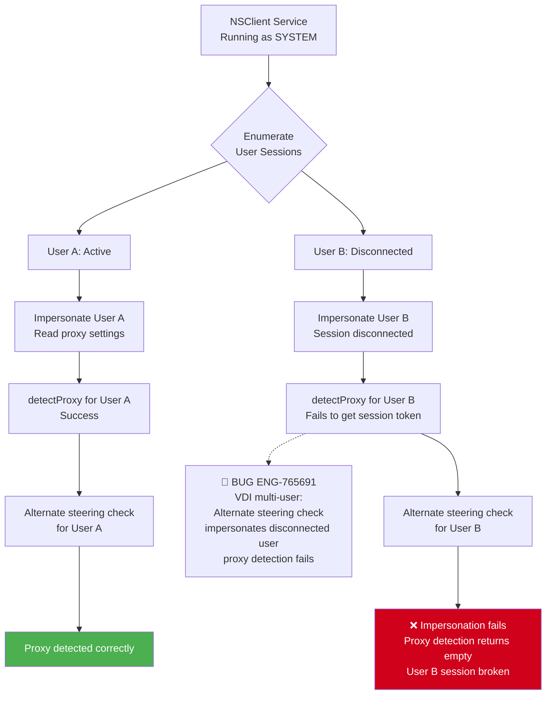

### Node Risk Assessment

| Node | Risk Type | Escalation Impact | Mitigation |
|------|-----------|-------------------|------------|
| IMP2 (Impersonate disconnected user) | 🔴 Confirmed Bug ENG-765691 | VDI multi-user: alternate steering check impersonates disconnected user; session token unavailable; proxy detection fails; user's tunnel broken | Skip proxy re-detection for disconnected sessions or use cached proxy |

---

## Proxy Change Monitoring

### Windows: Registry Watcher

On Windows, `CProxyMonitor` runs a dedicated thread that watches the registry key `HKCU\SOFTWARE\Microsoft\Windows\CurrentVersion\Internet Settings\Connections\` using `RegNotifyChangeKeyValue()`. When a change is detected:

1. `g_config.setConfiguredProxyList()` rebuilds the admin-configured proxy list
2. `g_config.setProxyChangeDetected(true)` flags the change
3. `g_config.detectProxy()` re-runs full detection
4. If the active proxy list changed, `m_listener.onProxyChange()` notifies `CTunnelMgr`
5. `CTunnelMgr` updates the proxy list in the driver and flushes DNS cache

### macOS: Network Change Notification

On macOS, proxy change detection is tied to the network change notification system. When the active network interface changes, `detectProxy()` is called as part of the network state change handler.

---

## Platform Differences

### Windows

**Detection Method**: Uses WinHTTP API (`WinHttpGetIEProxyConfigForCurrentUser`, `WinHttpGetProxyForUrl`) to detect proxy settings from the current user's IE/Edge proxy configuration.

**Detection Priority**:
1. **WPAD Auto-Detect** (`ieProxyConfig.fAutoDetect`): Uses DHCP and DNS-A record lookup to find a PAC file
2. **PAC File URL** (`ieProxyConfig.lpszAutoConfigUrl`): Downloads and evaluates a PAC file via `WinHttpGetProxyForUrl`
3. **Local PAC File**: If the PAC URL uses `file://`, falls back to `nspacparser.exe` (a separate process for PAC evaluation)
4. **Static Proxy** (`ieProxyConfig.lpszProxy`): Parses the `https=` entry from the static proxy string

**Implementation Details**:
- Runs under impersonated user context (`nsImpersonate`) to read per-user proxy settings
- `WinHttpGetProxyForUrl` retries up to 3 times with 2-second delays on download failures
- Does NOT use `WINHTTP_AUTOPROXY_RUN_INPROCESS` flag due to failures on Windows 7/2008 R2 user re-logon (ENG-6594)
- The `CProxyMonitor` watches `HKCU\...\Internet Settings\Connections\` registry key for real-time proxy change detection
- `ignoreLoopbackProxy` config flag: if the system proxy resolves to 127.0.0.1, treat it as no proxy
- `IgnoreInactiveSystemProxy` config flag: if system reports proxy configured but returns empty proxy list, clear all configured proxies

**NTLM on Windows**:
Uses SSPI (`AcquireCredentialsHandle`, `InitializeSecurityContext`) which automatically uses the domain-joined user's Kerberos ticket or NTLM credentials. Falls back to explicit credentials if provided.

### macOS

**Detection Method**: Uses `SCDynamicStoreCopyProxies()` from the SystemConfiguration framework, then checks in order:

1. **WPAD** (`kSCPropNetProxiesProxyAutoDiscoveryEnable`): Auto-discovery enabled
2. **PAC** (`kSCPropNetProxiesProxyAutoConfigEnable`): PAC file configured
3. **HTTPS Proxy** (`kSCPropNetProxiesHTTPSEnable`): Static HTTPS proxy

**PAC File Handling**: On macOS, PAC file download and evaluation is done by `ExecuteProxyAutoConfigurationURL()`, which manually downloads the PAC script via `nsDownloadInBuffer()` and evaluates it using `CFNetworkCopyProxiesForAutoConfigurationScript()`. The standard `CFNetworkExecuteProxyAutoConfigurationURL()` was abandoned because it stopped working under daemon context on High Sierra (ENG-48462).

**Proxy Resolution on Big Sur+**: Starting with macOS 11 (Big Sur), proxy hostnames are resolved to IP addresses using `GetResolvedProxyAddressList()` and added to the configured list. This handles cases where the proxy is identified by hostname but the driver matches on IP.

**NTLM on macOS**: Implemented manually using NTLMv2 with OpenSSL MD4 and HMAC-MD5 (no SSPI equivalent).

### Linux

**Detection Method**: Linux proxy detection is minimal. The `CConfig::detectProxy()` function is guarded by `#if defined(__APPLE__) || defined(WIN32)`, meaning Linux does not perform automatic system proxy detection.

Linux users must configure proxies via:
- Admin WebUI external proxy list (pushed via nsconfig.json)
- Environment variables (`http_proxy`, `https_proxy`) -- used by libcurl for management API calls but NOT for tunnel establishment

**NTLM on Linux**: Same manual NTLMv2 implementation as macOS.

### Android

**Detection Method**: Android proxy detection is called via `config.detectProxy()` at service start but relies on the admin-configured proxy list rather than system settings. The `lib/nsUtils/android/proxyUtils.cpp` is a stub implementation -- `getProxyCredentialInPlainText()` and `getProxyCredentialInCipherText()` both return immediately without actual encryption.

### iOS

**Detection Method**: iOS does not have its own proxy detection implementation. Proxy configuration flows through the VPN configuration profile.

### Platform Comparison Table

| Feature | Windows | macOS | Linux | Android | iOS |
|---|---|---|---|---|---|
| System proxy auto-detect | WinHTTP API | SCDynamicStore | No | No | No |
| WPAD support | DHCP + DNS-A | Auto-discovery flag | No | No | No |
| PAC file support | WinHTTP + nspacparser.exe | CFNetwork + manual download | No | No | No |
| Static proxy detection | IE/Edge settings | System Preferences | No | No | No |
| Admin-configured proxy | Yes | Yes | Yes | Yes | No |
| Proxy change monitoring | Registry watcher | Network change callback | No | No | No |
| NTLM authentication | SSPI (automatic) | Manual NTLMv2 | Manual NTLMv2 | No | No |
| Basic/Digest auth | Yes | Yes | Yes | No | No |
| Proxy credential encryption | AES + ProductID | AES + ProductID | AES + ProductID | Stub | N/A |

---

## Configuration & Parameters

### Admin Config (nsconfig.json)

Proxy-related settings are pushed from the Management Plane:

```json
{
    "clientConfig": {
        "proxyAuthEnabled": true,
        "ignoreLoopbackProxy": false,
        "IgnoreInactiveSystemProxy": false,
        "proxyCredentials": "base64_encrypted_string"
    },
    "externalProxyList": [
        {
            "product": 2,
            "host": "proxy.corp.com",
            "port": 8080,
            "description": "Corporate proxy"
        },
        {
            "product": 1,
            "host": "cws.cisco.com",
            "port": 9090,
            "description": "Cisco AnyConnect Web Security"
        }
    ]
}
```

| Parameter | Type | Default | Description |
|---|---|---|---|
| `proxyAuthEnabled` | bool | false | Enable proxy authentication for tunnel connections |
| `ignoreLoopbackProxy` | bool | false | If system proxy is 127.0.0.1, ignore it (Windows only) |
| `IgnoreInactiveSystemProxy` | bool | false | If system reports proxy but returns empty list, clear proxy config (Windows only) |
| `proxyCredentials` | string | "" | AES-encrypted proxy credentials (username:password) |
| `externalProxyList` | array | [] | Admin-configured proxies from WebUI |

### Proxy Credential Validation (Installation)

During Windows MSI installation, `CA_ProxyCredentialsValidation` tests whether proxy credentials are needed. The `ProxyUtils::proxyCredentialsValidation()` function:

1. Attempts to download a test URL through each proxy
2. If HTTP 407 is returned, invokes a callback to prompt the user for credentials
3. Returns `STATUS_AUTH_SUCCESS`, `STATUS_CALLBACK_SUCCESS`, `STATUS_CALLBACK_FAIL`, or `STATUS_CURL_ERROR`

---

## Troubleshooting

### Log Keywords

| Area | Log Keywords | Module |
|---|---|---|
| Proxy detection | `detecting proxy`, `System proxy configuration`, `proxy Count` | `nsConfig` |
| Proxy list | `Proxy Address count`, `proxy address list`, `Active Proxy List`, `Full Proxy List` | `CProxyMgr`, `nsConfig` |
| Proxy health | `Proxy.*reachable`, `reachable proxy count` | `ProxyHealthCheck` |
| PAC file | `Pac file url`, `pac download failed`, `DIRECT set for target` | `ProxyInfoReader` |
| NTLM auth | `NTLM Auth header`, `Failed to get NTLM response`, `SSPI` | `proxyUtils` |
| Tunnel via proxy | `Using proxy.*for tunnel`, `Proxy returned HTTP response`, `Failed to send CONNECT` | `nsssl` |
| Proxy monitor | `Got proxy registry change notification`, `Monitor thread started` | `ProxyMonitor` |
| Packet proxy | `Proxied conn from`, `Added connection.*to proxied map`, `Bypassing flow from` | `CProxyMgr` |
| Connection splice | `Sending RST packet to EP`, `Got SYN-ACK from tunnel, replaying` | `CProxyMgr` |

### Common Issues

**Issue 1: Proxy detection fails after reboot (ENG-593814)**

**Symptoms**: Tunnel does not establish after reboot. Log shows "No proxy to update" despite proxy being configured.

**Root Cause**: `addonhost` is not populated at the time `detectProxy()` runs because config download has not completed yet.

**Diagnosis**:
```bash
grep -i "detecting proxy\|addonHost\|proxy Count" nsdebuglog.log
```

**Resolution**: Ensure `detectProxy()` is called again after config download completes. The fix ensures re-detection when `addonhost` becomes available.

---

**Issue 2: Proxy settings lost after upgrade (ENG-463329)**

**Symptoms**: After upgrading NSClient, the tunnel connects directly instead of through the proxy. Traffic may fail if direct connections are blocked by the network.

**Root Cause**: During service restart for upgrade, the proxy list in memory is cleared. If `detectProxy()` runs before the user session is available for impersonation, it cannot read per-user proxy settings.

**Diagnosis**:
```bash
grep -i "proxy.*upgrade\|proxy Count\|impersonate.*failed" nsdebuglog.log
```

---

**Issue 3: Proxy authentication loop**

**Symptoms**: Tunnel connection repeatedly fails with proxy 407 errors. Log shows repeated CONNECT attempts.

**Root Cause**: 
- NTLM on non-domain machines without credentials configured
- Proxy credentials stored in config are corrupted or cannot be decrypted (product ID changed)
- `proxyAuthEnabled` not set to true in admin config

**Diagnosis**:
```bash
grep -i "407\|proxy auth\|Failed to get.*auth\|credentials.*empty" nsdebuglog.log
```

---

**Issue 4: PAC file evaluation fails on Windows**

**Symptoms**: Proxy detection returns no proxies despite PAC file being configured.

**Root Cause**: 
- The WinHTTP auto-proxy service (`WinHttpAutoProxySvc`) may not be running
- PAC file URL uses `file://` scheme and `nspacparser.exe` is not present or fails
- `WINHTTP_AUTOPROXY_RUN_INPROCESS` is not used (by design for compatibility) and the auto-proxy service returns stale results

**Diagnosis**:
```bash
grep -i "WinHttpGetProxyForUrl\|pac.*fail\|auto detect.*fail\|nspacparser" nsdebuglog.log
```

---

**Issue 5: Connection splice issues with segmented ClientHello**

**Symptoms**: Some HTTPS connections through a proxy are bypassed instead of steered, or the connection hangs.

**Root Cause**: The TLS ClientHello is split across multiple TCP segments. If `m_handleSNIFromSegmentPacket` is not enabled, CProxyMgr cannot extract the SNI and defaults to bypassing the connection.

**Diagnosis**:
```bash
grep -i "sslhandshake segment\|segment packet\|reassemble" nsdebuglog.log
```

---

## Windows

**Bug Count**: 5 | **Key Gaps**: Proxy detection after reboot (addonHost timing), VDI multi-user impersonation, cert-pinned app + local proxy packet handling

### Windows Confirmed Bug Mapping

| Bug ID | Summary | Root Cause | Severity | Gap Type |
|--------|---------|------------|----------|----------|
| ENG-463329 | GSLB proxy detection issue after upgrade | User session not available during service restart after upgrade; impersonation fails; proxy settings not detected | S2 | Regression |
| ENG-593814 | Proxy detection delays tunnel after reboot; addonhost not populated | `addonHost` not populated when `detectProxy()` first runs; PAC file queried with wrong URL; returns empty proxy list | S2 | Test Gap |
| ENG-406879 | Proxy details cached after proxy removal | Proxy list not cleared when system proxy removed; stale proxy causes tunnel connection attempts to fail | S3 | Day-1 |
| ENG-765691 | Alternate steering check fails in VDI multi-user (disconnected user impersonation) | Alternate steering check impersonates disconnected user session; impersonation fails; proxy detection returns empty; user tunnel broken | S2 | Day-1 |
| ENG-649593 | ACK mangle with local proxy + cert-pinned bypass | Cert-pinned app bypasses tunnel but goes through local proxy; bypass-by-tunneling logic incorrect for HTTP through proxy; ACK mangled; connection drops | S3 | Regression |

## macOS

**Bug Count**: 0 | **Key Gaps**: PAC file download under daemon context, proxy hostname resolution on Big Sur+

## Linux

**Bug Count**: 0 | **Key Gaps**: No automatic system proxy detection

## Android

**Bug Count**: 0 | **Key Gaps**: Stub credential encryption implementation

---

## iOS

**Bug Count**: 0 | **Key Gaps**: No proxy detection (VPN profile controls proxy)

---

## ChromeOS

**Bug Count**: 0 | **Key Gaps**: Not documented

---

## Backend

**Bug Count**: 0

---

## Automation Coverage Summary

**Existing Automation**:
- `stAgent/tests/python-tests/explicit_proxy/`: 1 test for basic proxy detection
- **Coverage**: ⚠️ Partial (only basic detection; no PAC, WPAD, authentication, VDI, or packet splicing tests)

**Automation Gaps**:
- No tests for proxy detection after reboot (addonHost timing)
- No tests for proxy detection after upgrade (user session unavailable)
- No tests for VDI multi-user impersonation
- No tests for PAC file evaluation
- No tests for proxy authentication (NTLM/Basic/Digest)
- No tests for packet-level connection splicing
- No tests for proxy health check
- No tests for Cisco CWS interop

---

## Coverage Gaps

| Gap Category | Description | Priority | Recommended Approach |
|---|---|---|---|
| **Timing-dependent detection** | Proxy detection after reboot/upgrade when user session or addonHost not yet available | P1 | Manual test: controlled reboot with proxy configured; verify bootstrap list used |
| **VDI multi-user** | Alternate steering check impersonation failure for disconnected user sessions | P1 | Manual test: VDI with 2 users (1 active, 1 disconnected); verify no impersonation errors |
| **PAC file evaluation** | PAC file with complex logic, `file://` URL, or authenticated HTTPS | P2 | Manual test: deploy PAC file server; verify correct proxy returned |
| **Packet splicing** | Connection splicing state machine, SEQ/ACK adjustment, segmented ClientHello | P2 | Automated unit test: mock driver packets; verify state transitions |
| **Proxy authentication** | NTLM Type 1/2/3 message generation, Basic, Digest, credential encryption | P2 | Automated integration test: test proxy server with auth; verify tunnel connects |

---

## Cross-Flow Interactions

### Interaction 1: Proxy Detection + Config Download (Ch04)

Config download requires proxy list to be available before the first download attempt. If proxy detection fails or is delayed, config download fails, which delays `addonHost` population, creating a circular dependency.

**Sequence**:

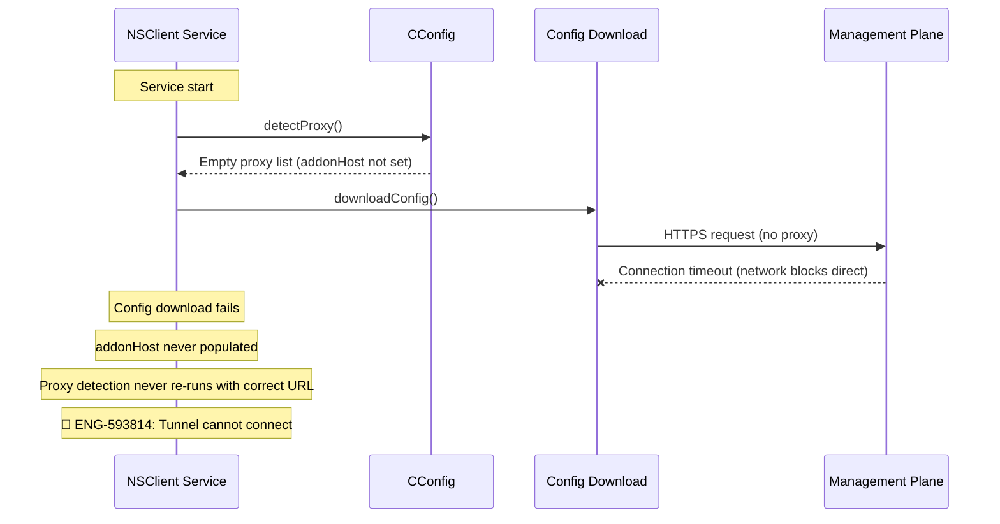

**Risk**: If the network blocks direct connections and requires a proxy, but the proxy cannot be detected because `addonHost` is not yet populated, the system enters a deadlock where config download fails, which prevents `addonHost` from being populated, which prevents proxy re-detection.

**Mitigation**: Re-run `detectProxy()` after config download completes. Fallback to cached proxy list from previous session.

### Interaction 2: Proxy Packet Splicing + Bypass (Ch10) + FailClose (Ch11)

When FailClose is active and a cert-pinned application is configured to bypass the tunnel but must go through the enterprise proxy, the packet classification logic in `CProxyMgr` must correctly handle the bypass-by-tunneling action. ENG-649593 shows this interaction fails when the combination of local proxy + cert-pinned bypass + bypass-by-tunneling is present.

**Sequence**:

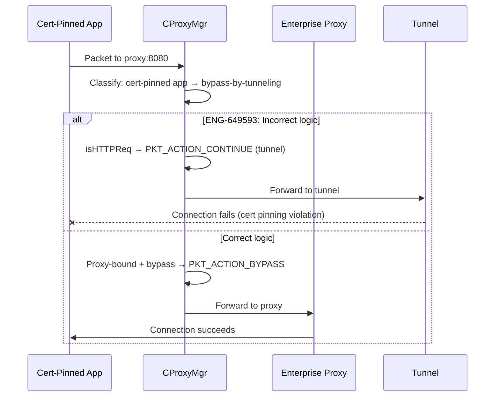

**Risk**: Incorrect packet action causes cert-pinned traffic to be tunneled instead of bypassed, violating the bypass policy and breaking the application.

**Mitigation**: Fix packet classification logic to correctly handle proxy-bound traffic with bypass-by-tunneling action.

### Interaction 3: Proxy Detection + Upgrade (Ch01)

During upgrade, the NSClient service restarts. The new service instance runs before the user logs in, so user session impersonation fails. Proxy detection cannot read per-user proxy settings, so the proxy list is empty. If the network blocks direct connections, the tunnel cannot connect.

**Root Cause**: No persistence of proxy list across service restarts.

**Mitigation**: Persist last known proxy list to disk. Use it as bootstrap until fresh detection completes.

### Cross-Flow Risk Matrix (Chapter-Relevant)

| Interaction | Affected Chapters | Risk | Mitigation | Test Coverage |
|---|---|---|---|---|
| Proxy detection + config download circular dependency | Ch04, Ch14 | S2 | Re-detect after config download; use cached proxy | ❌ None |
| Proxy packet splicing + bypass + FailClose | Ch10, Ch11, Ch14 | S3 | Fix bypass-by-tunneling logic for proxy-bound traffic | ❌ None |
| Proxy detection + upgrade timing | Ch01, Ch14 | S2 | Persist proxy list; use bootstrap until fresh detection | ❌ None |
| VDI multi-user impersonation + alternate steering | Ch09, Ch14 | S2 | Skip disconnected sessions in alternate steering check | ❌ None |

## Appendix A: Bug Quick Reference

| Bug ID | Summary | Platform | Root Cause | Severity | Gap Type |
|--------|---------|----------|------------|----------|----------|
| ENG-463329 | GSLB proxy detection issue after upgrade | Windows | User session not available during service restart after upgrade; impersonation fails; proxy settings not detected | S2 | Regression |
| ENG-593814 | Proxy detection delays tunnel after reboot; addonhost not populated | Windows | `addonHost` not populated when `detectProxy()` first runs; PAC file queried with wrong URL; returns empty proxy list | S2 | Test Gap |
| ENG-406879 | Proxy details cached after proxy removal | Windows | Proxy list not cleared when system proxy removed; stale proxy causes tunnel connection attempts to fail | S3 | Day-1 |
| ENG-765691 | Alternate steering check fails in VDI multi-user (disconnected user impersonation) | Windows | Alternate steering check impersonates disconnected user session; impersonation fails; proxy detection returns empty; user tunnel broken | S2 | Day-1 |
| ENG-649593 | ACK mangle with local proxy + cert-pinned bypass | Windows | Cert-pinned app bypasses tunnel but goes through local proxy; bypass-by-tunneling logic incorrect for HTTP through proxy; ACK mangled; connection drops | S3 | Regression |

---

## Appendix B: Methodology

### Severity Rating

| Severity | Description |
|----------|-------------|
| **S1** | Critical: Service crash, data loss, security vulnerability |
| **S2** | High: Core functionality broken (tunnel down, steering broken) |
| **S3** | Medium: Feature degraded (intermittent failure, specific scenario) |
| **S4** | Low: Cosmetic, logging, minor edge case |
| **S5** | Enhancement: New feature request, optimization |

### Test Case Format

| Field | Description |
|-------|-------------|
| **ID** | TC-14-XX (sequential within chapter) |
| **Test Case** | Brief description of test scenario |
| **Severity** | S1-S5 based on impact if bug not caught |
| **Auto Priority** | P1 (must automate), P2 (should automate), P3 (manual acceptable) |
| **Gap Type** | Regression (caught before), Day-1 (new feature), Test Gap (never tested), Corner Case (rare scenario) |

### Gap Type Taxonomy

| Gap Type | Description | Automation Priority |
|----------|-------------|---------------------|
| **Regression** | Previously caught by manual test or customer escalation; should have been in regression suite | P1 |
| **Day-1** | New feature or newly discovered code path; no prior test coverage | P1-P2 |
| **Test Gap** | Existing feature never properly tested; revealed by escalation bug | P2 |
| **Corner Case** | Rare scenario, complex preconditions, low probability but high impact | P2-P3 |

---

## Related Chapters

- [01_installation.md](01_installation.md) -- `CA_ProxyCredentialsValidation` during Windows MSI installation
- [04_config_download.md](04_config_download.md) -- Config download uses proxy list for HTTP calls
- [07_tunnel_management.md](07_tunnel_management.md) -- Tunnel establishment via proxy (direct-to-proxy failover)
- [08_gateway_selection.md](08_gateway_selection.md) -- GSLB gateway selection includes proxy routing info
- [09_traffic_steering.md](09_traffic_steering.md) -- CProxyMgr's role in traffic interception at the packet layer
- [10_bypass.md](10_bypass.md) -- Exception and bypass rules interact with proxy packet classification
- [11_failclose.md](11_failclose.md) -- FailClose + proxy interaction: blocked traffic through proxy
- [13_certificate_management.md](13_certificate_management.md) -- TLS through proxy requires proper cert validation

---

**Chapter Summary**: NSClient's proxy handling is a multi-layered system that detects proxy settings from platform-specific APIs (WinHTTP on Windows, SCDynamicStore on macOS), merges them with admin-configured proxies, validates proxy health, and authenticates using NTLM/Basic/Digest methods. At the packet level, `CProxyMgr` performs TCP connection splicing to redirect proxy-bound traffic through the Netskope tunnel. The system must handle proxy changes in real time, credential encryption at rest, interop with other proxy products (Cisco CWS), and graceful failover between direct and proxied connections. The highest risk areas are proxy detection at service startup (when user context may not be available) and the complex state machine in `CProxyMgr` that manages connection splicing for steered traffic.
