# 15. NPA (Private Access) Integration

**Escalation Bug Count**: 11 | **Regression**: 5 (45%) | **Corner Case**: 4 (36%) | **Day-1**: 3 (27%) | **Test Gap**: 2 (18%)

📋 **[Test Cases — Google Sheet](https://docs.google.com/spreadsheets/d/1ackCZ-EcepXw1BkSGoi5Go9Ex1I72-fXqcqLGMGiuio/edit?gid=213768846#gid=213768846)**

> This chapter covers how NSClient integrates with Netskope Private Access (NPA) for Zero Trust Network Access. NPA integration is one of the most complex cross-component areas in the client, involving a separate enrollment flow, independent tunnel lifecycle, dual-tunnel coexistence with SWG, partner tenant switching, prelogon tunneling, and dynamic steering based on on-prem/off-prem location detection. Each flow is illustrated with mermaid diagrams annotated with known escalation bug failure points (🔴 red) and predicted risk points (🟡 yellow).

---

## Overview

Netskope Private Access (NPA) provides Zero Trust Network Access (ZTNA) to private applications hosted behind corporate networks — without requiring a traditional VPN. While the SWG (Secure Web Gateway) tunnel handles inspection of internet-bound web traffic, the NPA tunnel provides encrypted connectivity to private apps through Netskope's NewEdge infrastructure or on-premises local brokers.

NSClient manages the NPA tunnel **alongside** the SWG tunnel, creating a **dual-tunnel architecture**. The two tunnels are independent: they have separate enrollment processes, separate gateway selection mechanisms, separate state machines, and connect to different backend infrastructure. However, they share the same FilterDevice (packet interception layer) and are coordinated by the same service process (`stAgentSvc`).

This dual-tunnel design is a significant source of complexity. The interaction between NPA tunnel state, SWG tunnel state, FailClose, network changes, and dynamic steering produces compound failure modes that are difficult to test in isolation. Several escalation bugs demonstrate this:

- **ENG-393015**: NPA + SWG network switch crash
- **ENG-441957**: Android NPA disconnect after network switch
- **ENG-773191**: NPA traffic not tunneled after macOS upgrade (transparent proxy stops when NPA in DISABLED state)
- **ENG-592681**: Android tunnel repeatedly drops (NPA recovery bug)
- **ENG-625957**: NPA not tunneling when WinDivert driver present (BWAN interop)
- **ENG-608191**: NPA addon config JWT signature issue (wrong authorize version V7 instead of V5)

### Key Design Decisions

**Why a separate tunnel?** NPA traffic goes to different gateway infrastructure (NPA brokers) than SWG traffic (Netskope data plane POPs). The security model is also different: NPA uses device certificates for mTLS authentication, while SWG uses the SPDY tunnel with session tokens. Keeping them separate allows independent lifecycle management — NPA can be enabled/disabled per-tenant, per-user, and per-location without affecting SWG.

**Why not a VPN?** Traditional VPNs route all traffic through a single tunnel. NPA uses split tunneling — only traffic destined for configured private apps is routed through the NPA tunnel. This is more efficient and follows zero-trust principles (least-privilege access).

**Why partner tenant support?** Large enterprises may need to access private apps in partner organizations. NPA supports switching between a primary tenant and partner tenants, each with their own enrollment, certificates, and broker configuration.

---

## NPA Architecture

The following diagram shows how the NPA subsystem sits alongside the SWG subsystem within `stAgentSvc`. Both subsystems share the FilterDevice for packet interception but maintain independent tunnel connections, enrollment state, and configuration.

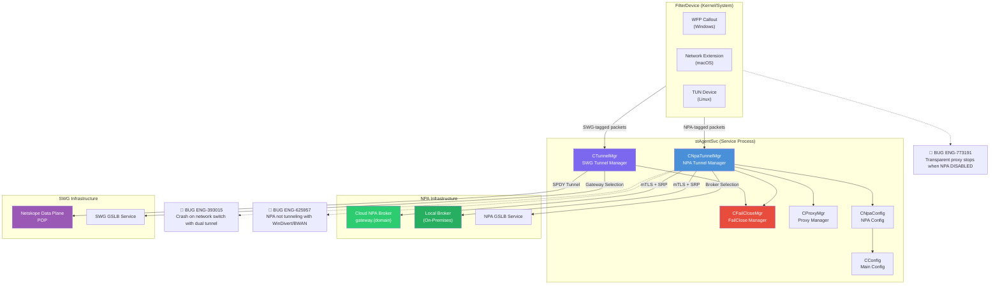

### NPA Architecture Node Risk Assessment

| Node | Risk | Assessment |
|---|---|---|
| CNpaTunnelMgr | 🔴 Critical | **ENG-393015** — Crash on network switch with dual tunnel; **ENG-592681** — Android tunnel repeatedly drops |
| FilterDevice (shared) | 🔴 Critical | **ENG-773191** — Transparent proxy stops when NPA DISABLED on macOS 15.x; **ENG-625957** — WinDivert captures NPA egress |
| CNpaEnroll | 🔴 High | **ENG-608191** — JWT authorize version mismatch (V7 vs V5) |
| CPartnerNPAConfig | 🟡 Medium | Predicted: Partner switch during FailClose may hang |
| NPA GSLB Service | 🟡 Medium | Predicted: GSLB fallback disabled + cloud broker down = no connection |

### Core Components

| Component | Source Path | Responsibility |
|-----------|-----------|----------------|
| `CNpaTunnelMgr` | `lib/npa_core/npaTunnelMgr.h/.cpp` | NPA tunnel lifecycle, packet steering, worker thread |
| `CNpaConfig` | `lib/npa_core/npaConfig.h/.cpp` | NPA configuration management, session tracking |
| `CNpaConfigBase` | `lib/npa_core/npaConfigBase.h` | Base config: feature flags, GSLB, steering, partner access |
| `CNpaEnroll` | `lib/npa_core/NpaEnroll.h/.cpp` | NPA device enrollment via addon API + JWT |
| `npaClientHandler` | `lib/npa_core/npaClientHandler.h/.cpp` | Transport handler: TLS/DTLS connection to broker, packet send/recv |
| `CnpaGWSelection` | `lib/npa_core/npaGWSelection.h/.cpp` | Gateway resolution: LDNS, EDNS, GSLB, Local Broker |
| `CNpaFlowCache` | `lib/npa_core/npaFlowCache.h/.cpp` | Per-flow action cache: NPA_TUNNEL or NPA_BYPASS |
| `CPrelogonConfig` | `lib/npa_core/PrelogonConfig.h/.cpp` | Windows pre-login tunnel config and enrollment |
| `CPartnerNPAConfig` | `lib/npa_core/PartnerConfig.h/.cpp` | Partner tenant NPA configuration |
| `L4ListenerImpl` | `lib/npa_core/l4listenerImplWin.cpp` | Windows L4 TCP listener for NPA traffic redirect |
| `NPA_TUNNEL_CTX` | `lib/npa_core/npaTunnelCtx.h` | Per-tunnel context (userId, tunnelId, dispatcher) |
| `npaDemMonitoring` | `lib/npa_core/npaDemMonitoring.h/.cpp` | DEM integration for NPA private app monitoring |
| `NpaGslbBrokerSelection` | `lib/npa_core/npaGslbGatewaySelection.h` | GSLB v2/v3 broker selection with RTT measurement |
| `DestinationProfileBypass` | `lib/destinationProfileLib/` | NPA exception/bypass rule engine (Win/Mac) |

---

## NPA Enrollment Flow

NPA enrollment is **completely separate** from SWG enrollment. While SWG enrollment happens during installation (via MSI Custom Actions or PKG scripts), NPA enrollment occurs at runtime after the service starts and NPA is enabled in the tenant configuration.

The enrollment process obtains **device certificates** (key + cert + tenant CA) that are used for mTLS authentication when connecting to the NPA broker. These certificates are stored per-user in the user config directory.

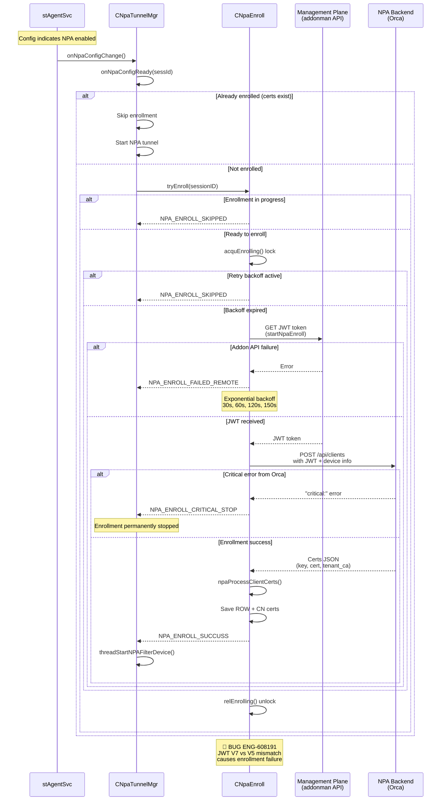

### Enrollment States

| Return Code | Constant | Meaning |
|-------------|----------|---------|
| 0 | `NPA_ENROLL_SUCCUSS` | Enrollment completed, certs saved |
| 1 | `NPA_ENROLL_FAILED_LOCAL` | Local error (no branding, no userEmail, no userKey) |
| 2 | `NPA_ENROLL_FAILED_REMOTE` | Backend API error, triggers exponential backoff |
| 3 | `NPA_ENROLL_SKIPPED` | Another enrollment in progress |
| 4 | `NPA_ENROLL_CRITICAL_STOP` | Critical error from Orca, enrollment permanently stopped |

### Enrollment Retry Logic

When enrollment fails remotely (`NPA_ENROLL_FAILED_REMOTE`), the client uses a fixed retry schedule:

```
Retry 1: 30 seconds
Retry 2: 60 seconds
Retry 3: 120 seconds
Retry 4+: 150 seconds (capped)
```

For partner tenant enrollment, there is **no retry** — the user must re-initiate the partner tenant switch from the UI.

### NPA Certificate Files

NPA uses separate certificates for ROW (Rest of World) and CN (China) data centers:

| File | Purpose |
|------|---------|
| `npaccesskey.pem` / `npaccesskey_cn.pem` | Device private key |
| `npaccesscert.pem` / `npaccesscert_cn.pem` | Device certificate |
| `npatenantcert.pem` / `npatenantcert_cn.pem` | Tenant CA certificate |
| `npaccesskey_ref.pem` | Refreshed key (during cert rotation) |
| `npaccesscert_ref.pem` | Refreshed cert (during cert rotation) |
| `authtoken.pem` | IDP authentication token |
| `npaenrollbynsid` | Enrollment indicator (enrolled by NS UniqueID) |
| `npaodi` / `npaodi_cn` | Old device ID file (for device ID migration) |
| `npatenantconfig.json` | Active/partner tenant tracking |
| `npaexceptions.json` | NPA exception rules |
| `l4config.json` | L4 listener configuration |

---

## NPA Tunnel State Machine

Each NPA tunnel (per-user session) has two status dimensions: a **desired status** (what the system wants) and a **current status** (what the tunnel is actually doing). The `CNpaTunnelMgr` worker thread continuously reconciles these two by calling `npaClientHandlerStartStopOfTunnel()`.

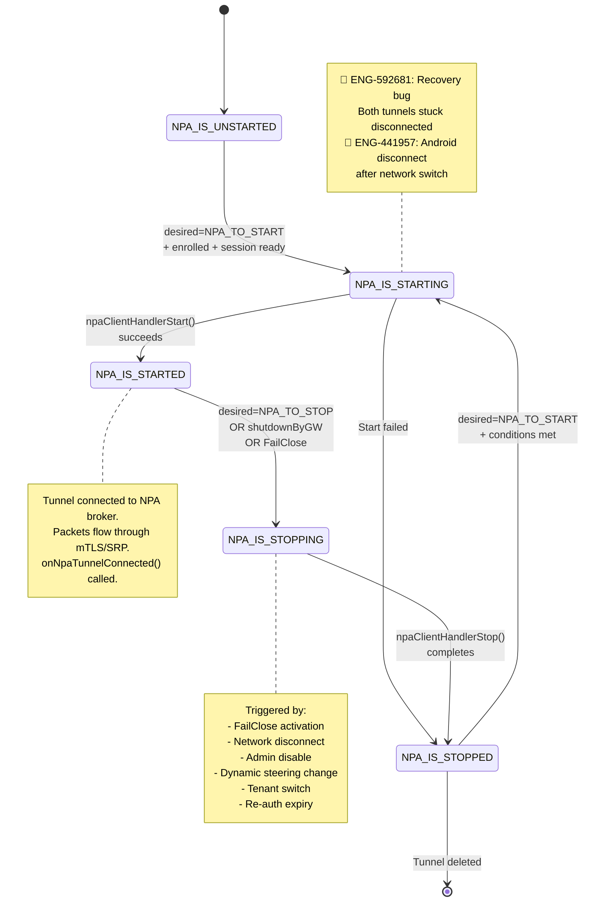

### Tunnel Status (UI-facing)

The `npaTunnel_Status` enum tracks the higher-level tunnel state reported to the UI:

| Status | Value | Description |
|--------|-------|-------------|
| `NPA_TUNNEL_DISABLED` | 0 | NPA feature disabled at tenant level |
| `NPA_TUNNEL_NOT_ENROLLED` | 1 | NPA enabled but device not enrolled |
| `NPA_TUNNEL_ENROLLED` | 2 | Enrolled but tunnel not started |
| `NPA_TUNNEL_CONNECTING` | 3 | Tunnel establishing connection |
| `NPA_TUNNEL_CONNECTED` | 4 | Tunnel connected, traffic flowing |
| `NPA_TUNNEL_DISCONNECTING` | 5 | Tunnel shutting down |
| `NPA_TUNNEL_DISCONNECTED` | 6 | Tunnel disconnected |
| `NPA_TUNNEL_ERRORED` | 7 | Enrollment or connection error |
| `NPA_TUNNEL_NOT_ENABLED` | 8 | NPA not enabled in steering config |
| `NPA_TUNNEL_CONNECTED_WARNING` | 9 | Connected but with re-auth warning |
| `NPA_TUNNEL_DISCONNECTED_ERROR` | 10 | Disconnected with error condition |
| `NPA_TUNNEL_CONNECTED_PRELOGON` | 11 | Prelogon tunnel connected (Windows) |

### Tunnel Status Messages

The `npaTunnel_StatusMsg` enum provides additional context for the UI:

| Message | Meaning |
|---------|---------|
| `NPA_NONE` | No special condition |
| `NPA_REAUTH_WARNING` | Re-authentication pending |
| `NPA_REAUTH_DISCONNECT_ERROR` | Disconnected due to re-auth expiry |
| `NPA_TRAFFIC_STEERING_DISCONNECTED_BY_PRIMARY` | Dynamic steering disabled NPA on primary tenant |
| `NPA_TRAFFIC_STEERING_DISCONNECTED_BY_PARTNER` | Dynamic steering disabled NPA on partner tenant |
| `NPA_FAIL_CLOSE_DISCONNECTED` | Disconnected due to FailClose |
| `NPA_DISCONNECT_FROM_CLOUD` | Gateway sent shutdown packet |

---

## NPA Worker Thread

The `CNpaTunnelMgr` runs a dedicated worker thread that is the central control loop for all NPA operations. It wakes up every 10 seconds (or 5 seconds when internet is unavailable on Windows) and performs a series of checks.

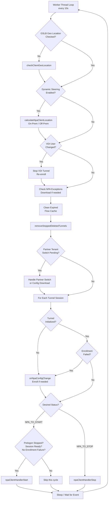

---

## NPA Gateway Selection

NPA broker selection is more complex than SWG gateway selection because NPA supports multiple broker types: **cloud brokers**, **local brokers** (on-premises), and **GSLB-based selection** with RTT measurement.

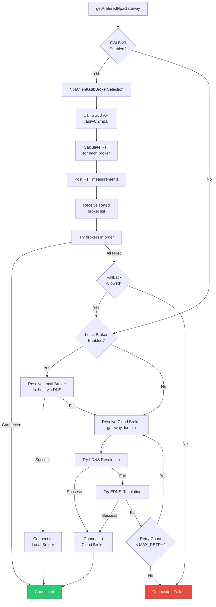

### Gateway Selection with Dynamic Steering

When dynamic steering is enabled, the NPA broker selection also depends on whether the client is on-prem or off-prem. The `NpaGwSelectionSettings` struct defines per-location preferences:

```cpp
struct NpaGwSelectionSettings {
    struct OnPrem {
        bool isEnabled;
        NpaGW OnPremPrimaryGw;    // CLOUD or LOCAL
        NpaGW OnPremFallBackGw;   // CLOUD or LOCAL
    } ONPREM;
    struct OffPrem {
        bool isEnabled;
        NpaGW OffPremPrimaryGw;
        NpaGW OffPremFallBackGw;
    } OFFPREM;
};
```

This allows administrators to configure, for example: "When on-prem, prefer local broker with cloud fallback; when off-prem, use cloud broker only."

---

## Dual Tunnel Interaction

The SWG tunnel (`CTunnelMgr`) and NPA tunnel (`CNpaTunnelMgr`) coexist within the same service process. The FilterDevice marks intercepted packets as either SWG-bound or NPA-bound based on steering rules, and routes them to the appropriate tunnel manager.

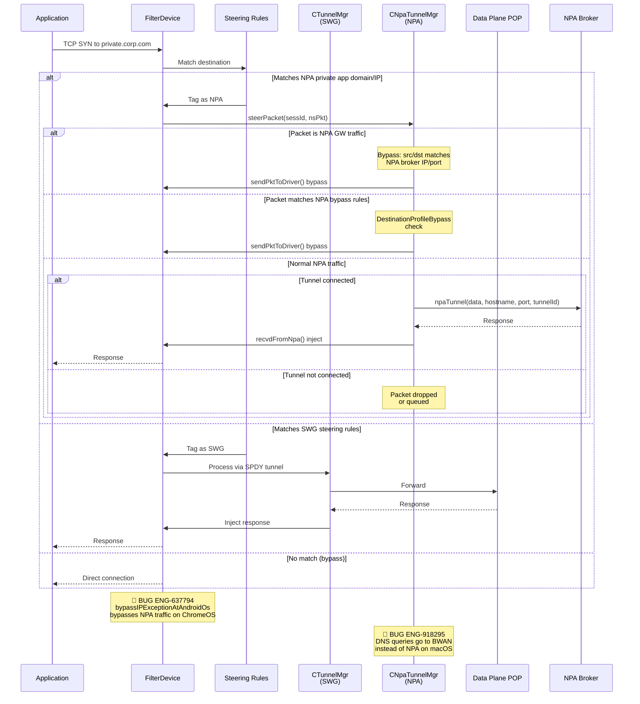

### NPA Packet Steering Logic

The `CNpaTunnelMgr::steerPacket()` function handles all NPA-tagged packets with the following priority:

1. **NPA Gateway bypass**: If the packet's src/dst IP+port matches a known NPA broker address, bypass it (the tunnel's own traffic must not be re-intercepted).
2. **DNS response bypass**: DNS responses (src port 53, UDP) from NPA are passed through.
3. **NPA exception bypass**: `DestinationProfileBypass` checks if the packet matches configured NPA bypass rules (exception domains/IPs).
4. **Tunnel routing**: For multi-tunnel mode, route to the correct tunnel by session ID. For single-tunnel mode, use the default tunnel session.
5. **Forward to broker**: Call `npaTunnel()` to send the packet through the NPA transport handler.

### Flow Cache

The `CNpaFlowCache` caches per-flow decisions (NPA_TUNNEL vs NPA_BYPASS) keyed by `(DestIP, DestPort, Protocol)` with a 300-second retention timeout. This avoids repeated rule evaluation for established flows.

---

## NPA and FailClose Interaction

FailClose and NPA have a complex bidirectional relationship. When FailClose is activated (SWG tunnel down), it can optionally include NPA traffic in the blocking scope or exclude it.

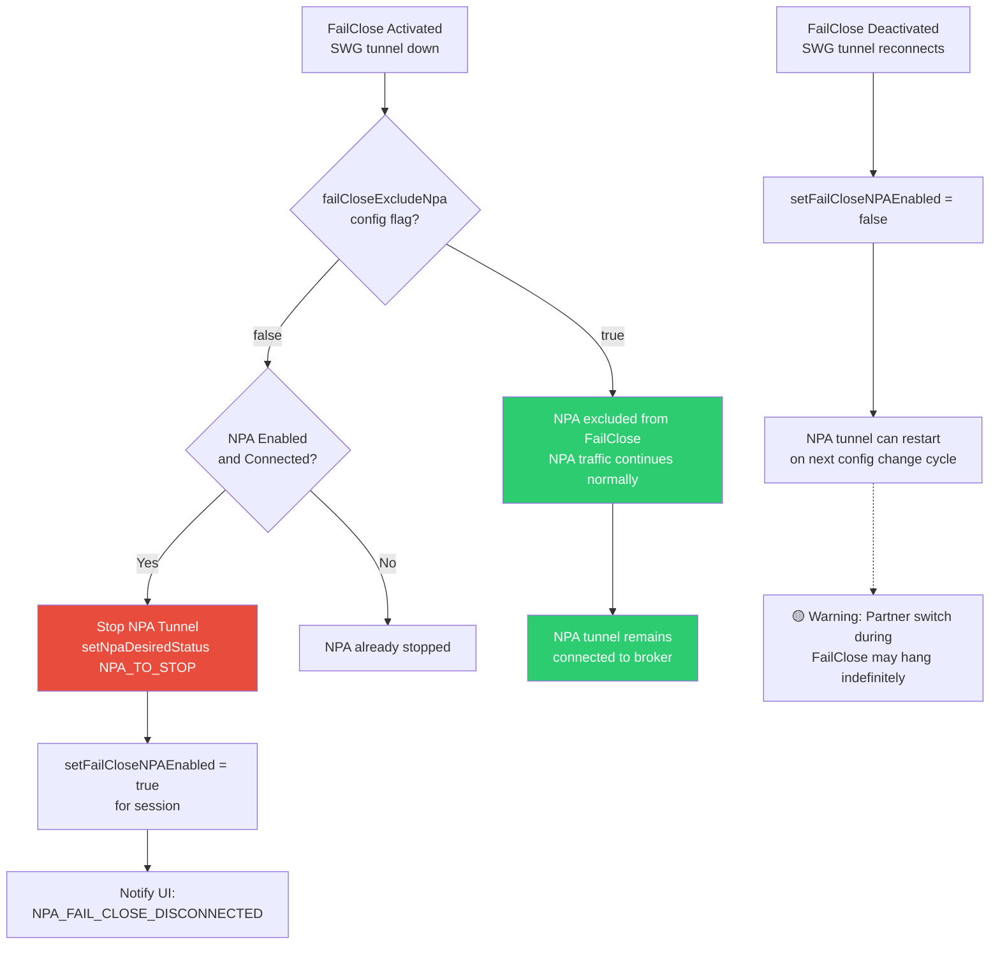

**Key configuration**:
- `failClose.exclude_npa` (bool): When true, NPA traffic is not affected by FailClose.
- FailClose mode `noNPA` (installer parameter): A special FailClose mode that excludes NPA at install time.

**Pseudo Code** (`CNpaTunnelMgr::updateFailCloseState`):
```cpp
void CNpaTunnelMgr::updateFailCloseState(int sessId, bool failCloseEnabled) {
    if (!failCloseEnabled) {
        m_failCloseNPAEnabled = false;
        setFailCloseNPAEnabled(sessId, false);
        return;
    }
    
    bool failCloseActivated = m_failCloseMgr->getFailCloseActivationStatus(sessId, true);
    FailCloseConfig &fcConfig = m_nsConfig->get_FailCloseConfig();
    
    // NPA is affected by FailClose only if:
    // 1. FailClose is activated
    // 2. exclude_npa is NOT set
    // 3. NPA is enabled
    bool failCloseEnabledNpa = failCloseActivated 
                               && !fcConfig.getFailCloseExcludeNpa() 
                               && m_npaConfig->isNPAEnabled();
    
    setFailCloseNPAEnabled(sessId, failCloseEnabledNpa);
    
    if (failCloseEnabledNpa) {
        // Stop NPA tunnel due to FailClose
        setNpaDesiredStatus(NPA_TO_STOP, sessId);
        wakeupWorkerThread();
    }
}
```

---

## Dynamic Steering and On-Prem Detection

NPA supports **dynamic steering** — the ability to enable/disable NPA traffic based on whether the client is on-premises or off-premises. This is critical for enterprises where private apps are directly accessible from the corporate network (no need for NPA tunnel when on-prem).

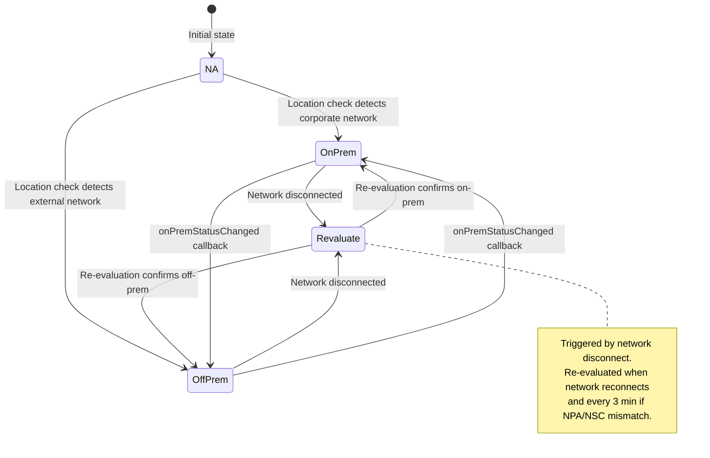

### Steering Decision Logic

The `steerTrafficBasedOnDynamicSteeringAndLocation()` function determines whether NPA traffic should be tunneled, considering:

1. **Dynamic steering flag**: Is the tenant using location-based steering?
2. **On-prem status**: Is the client currently on-prem or off-prem?
3. **Per-location flags**: `steerNPAWhenOnPrem` and `steerNPAWhenOffPrem` from steering config.
4. **Alternative steering**: Is another steering method (e.g., third-party VPN) active?
5. **Per-method flag**: `steerNPAForOtherSteeringMethod` — should NPA steer when other steering is detected?
6. **Partner tenant**: When partner tenant is active, steering decisions use the partner's config.

If the combined decision is to not steer, the tunnel is disconnected with a specific status message (`NPA_TRAFFIC_STEERING_DISCONNECTED_BY_PRIMARY` or `_BY_PARTNER`).

---

## Prelogon Tunnel (Windows Only)

Windows supports an NPA **prelogon tunnel** that establishes connectivity before any user logs in. This is used for scenarios like domain join, login scripts, and credential provider integration.

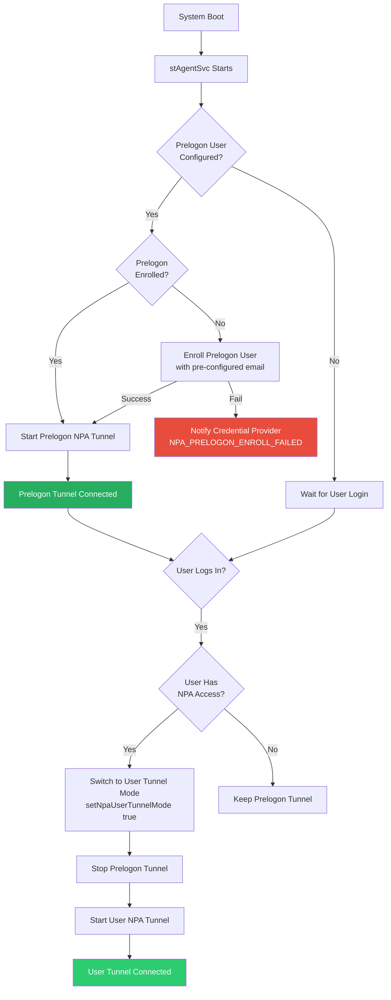

### Prelogon Tunnel Key Points

- The prelogon user email is configured via `npa.prelogin_username` in the NPA admin settings.
- The tunnel uses session ID `PRELOGON_SESSID` (`0xFFFFFFFF`).
- A Windows Credential Provider (`nsV2CP.dll`) integrates with the Windows login screen to show prelogon NPA status.
- Auto-start is controlled by `auto_start_prelogin_tunnel` (default: true).
- AOAC (Always On/Always Connected) support for prelogon is controlled by `enable_aoac_by_prelogon`.
- On-prem detection runs periodically in prelogon mode until the user tunnel mode is identified, controlled by `m_bNpaStopOnpremDetection`.

---

## Partner Tenant Access

NPA supports connecting to private apps in partner organizations. This requires a separate enrollment and configuration for each partner tenant, while maintaining the ability to switch between primary and partner tunnels.

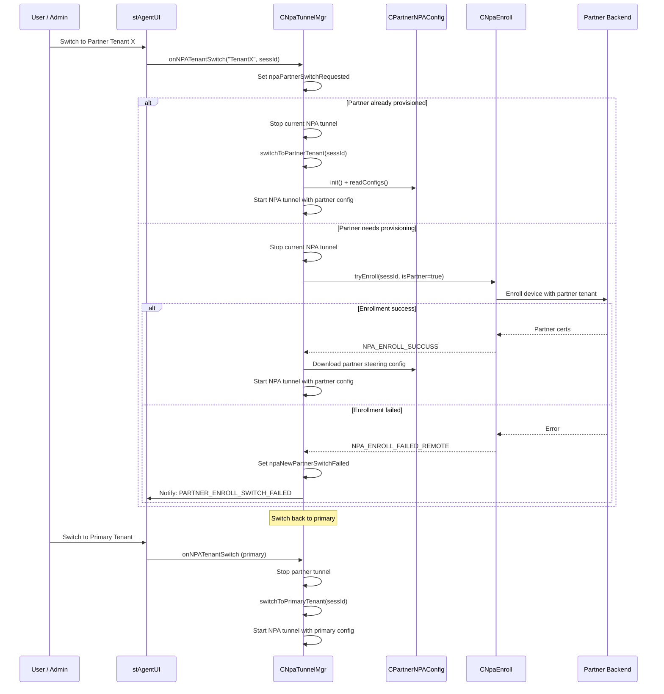

### Partner Tenant State Machine

The `NpaPartnerTenantInfo` class tracks the complex state of partner switching operations:

| Flag | Purpose |
|------|---------|
| `m_npaPartnerSwitchRequested` | Switch to an existing partner tenant |
| `m_npaNewPartnerSwitchRequested` | Switch to a new partner (needs enrollment) |
| `m_npaNewPartnerUserProvisioningRequested` | Partner user provisioning in progress |
| `m_npaPartnerUserConfDownloadRequested` | Partner config download needed |
| `m_npaPrimarySwitchRequested` | Switch back to primary tenant |
| `m_npaActivePartnerDeletedByAdmin` | Admin deleted the active partner tenant |
| `m_npaNewPartnerSwitchFailed` | Partner enrollment/switch failed |
| `m_npaTunnelDisconnectedForTenantSwitch` | Current tunnel has been disconnected, ready to switch |

### Partner Tenant Switch Status

| Status | Meaning |
|--------|---------|
| `PARTNER_ENROLL_SWITCH_SUCCESS` | New partner enrolled and switched |
| `PARTNER_SWITCH_SUCCESS` | Switched to existing partner |
| `PRIMARY_SWITCH_SCCESS` | Switched back to primary |
| `PARTNER_SWITCH_FAILED` | Failed to switch to partner |
| `PARTNER_ENROLL_SWITCH_FAILED_USER_NOT_EXIST` | User not found in partner tenant |
| `PARTNER_ENROLL_SWITCH_FAILED_CONFIG_DOWNLOAD_FAILED` | Partner config download failed |
| `PARTNER_ENROLL_SWITCH_FAILED_ENCRYPTION_TOKEN_NEEDED` | Missing encryption token for partner |
| `PARTNER_DELETED_BY_ADMIN` | Partner removed by admin from primary tenant config |

---

## Multi-Tunnel Mode (VDI)

In Windows VDI (Virtual Desktop Infrastructure) environments with per-user mode enabled, NPA supports **multiple simultaneous tunnels** — one per logged-in user session. This is controlled by the `npa_vdi_support` feature flag.

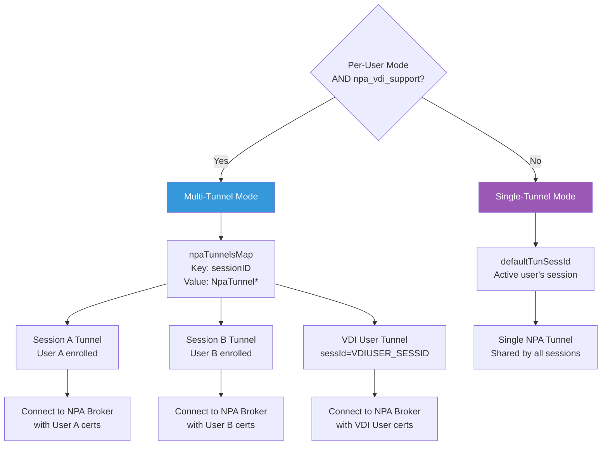

### VDI-Specific Behavior

- **VDI User Session**: Uses a special session ID `VDIUSER_SESSID` (`0xFFFFFFFE`).
- **VDI User Change Detection**: The worker thread calls `checkVDIUserChange()` to detect when a VDI user logs off and a new user logs in.
- **Concurrent Enrollment**: In multi-tunnel mode, if one session's enrollment fails, other sessions' enrollments are skipped (not retried aggressively) to avoid overwhelming the backend.
- **Session 0 Routing**: In multi-tunnel mode, packets from session 0 (SYSTEM) are routed to the VDI tunnel.

---

## Re-Authentication

NPA supports periodic re-authentication, where the NPA broker can request the client to re-authenticate the user. This is used for compliance and continuous verification.

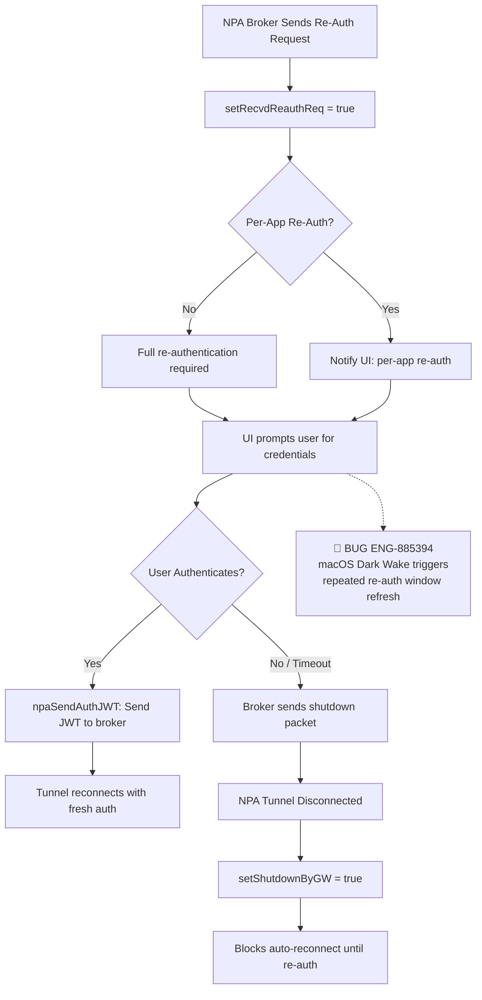

### Re-Auth Configuration

| Config Key | Purpose |
|-----------|---------|
| `reauth_enabled` | Enable/disable re-authentication |
| `reauthentication_on_logon` | Require re-auth on user logon |
| `prompt_reauthentication_credentials` | Prompt user for credentials |
| `reAuthPromptTime` | Per-session re-auth prompt timer |
| `reAuthGracePeriodTime` | Grace period before disconnect |

---

## NPA Configuration

NPA configuration comes from the main `nsconfig.json` under the `secureAccess` section and from the steering config. Key feature flags and settings:

### Core Settings

| Config Key | Type | Default | Description |
|-----------|------|---------|-------------|
| `secureAccess` | bool | false | Master NPA enable flag |
| `npa.host` | string | "" | NPA cloud broker hostname |
| `npa.lb_host` | string | "" | NPA local broker hostname |
| `npa.port` | int | 443 | NPA broker port |
| `npa.tenant` | string | "" | Tenant identifier |
| `npa.domain` | string | "" | NPA domain |
| `npa.keepalive_timeout` | int | 5 | Keepalive interval (seconds) |
| `npa.npa_stats_interval` | int | 60 | Stats reporting interval (seconds) |

### Feature Flags

| Config Key | Default | Description |
|-----------|---------|-------------|
| `npa_client_l4` | false | Enable L4 (non-HTTP) NPA traffic |
| `rfc1918_enabled` | false | Enable RFC1918 private IP steering |
| `dtls_enabled` | false | Enable DTLS transport |
| `npa_srpv2` | false | Use SRP v2 protocol |
| `npa_client_use_cgnat` | false | Use CGNAT addressing |
| `publisher_selection` | false | Enable publisher selection |
| `npa_local_broker_v1` | false | Enable local broker |
| `npa_gslb_client_v3` | false | Enable GSLB v3 broker selection |
| `npa_gslb_lbr_cloud_selection` | false | Enable GSLB LBR/cloud broker selection |
| `npa_gslb_client_no_fallback` | false | Disable GSLB fallback |
| `npa_gslb_client_pop_count` | 10 | Max gateway POP count for GSLB |
| `seamless_policy_update` | false | Seamless policy update (no tunnel restart) |
| `npa_client_compose_device_user_id` | false | New device ID format |
| `port_bypass_enabled` | false | Enable port-based bypass |
| `npa_docker_support` | false | Docker container support |
| `npa_win_aoac_support_enabled` | true | Windows AOAC support |
| `npa_mac_os_aoac_support_enabled` | true | macOS AOAC support |
| `enable_nplan6268_feature` | false | New auth service support |
| `npa_enable_wildcard_app_validation` | false | DNS validation for wildcard apps |
| `npa_enable_tls_cipher_aes128_only` | true | Restrict TLS to AES128 ciphers |
| `drop_svcb_dns_resolver_query` | false | Drop SVCB DNS queries |
| `npa_handle_dns_https_query` | false | Handle DNS-over-HTTPS queries |
| `npa_steering_exception_bypass` | false | Enable steering exception bypass |
| `npa_max_dns_search_domains` | 0 | Max DNS search domains |
| `enable_dem_npa_private_apps` | false | DEM monitoring for NPA apps |

### Dynamic Steering Settings

| Config Key | Description |
|-----------|-------------|
| `dynamicSteering` | Enable location-based steering |
| `privateAppsEnabled` | Private apps steering enabled |
| `steerNPAWhenOffPrem` | Steer NPA traffic when off-prem |
| `steerNPAWhenOnPrem` | Steer NPA traffic when on-prem |
| `steerNPAForOtherSteeringMethod` | Steer NPA when other VPN detected |

### Partner Access Settings

| Config Key | Description |
|-----------|-------------|
| `partner_access` | Enable partner tenant access |
| `primary_tenant_name` | Name of the primary tenant |
| `partner_tenant_info` | Map of partner tenant names and URLs |

---

## Platform Differences

| Feature | Windows | macOS | Linux | Android | iOS |
|---------|---------|-------|-------|---------|-----|
| NPA Tunnel Support | Full | Full | Full | Full | Full |
| Prelogon Tunnel | Yes (nsV2CP) | No | No | No | No |
| Multi-Tunnel (VDI) | Yes | No | No | No | No |
| L4 Listener | WFP redirect | Transparent proxy | TUN device | VpnService | Network Extension |
| GSLB v3 | Yes | Yes | Yes | No | No |
| Local Broker | Yes | Yes | Yes | No | No |
| DestinationProfileBypass | Yes | Yes | No | No | No |
| DEM Monitoring | Yes | Yes | No | No | No |
| TCP Connection Stats | Yes | Yes | Yes | No | No |
| Docker Support | No | No | Yes (FF) | No | No |
| AOAC Support | Yes (FF) | Yes (FF) | No | No | No |
| Partner Tenant | Yes | Yes | No | No | No |
| NPA Exception Rules | Yes | Yes | No | No | No |
| Dynamic Steering | Yes | Yes | Yes | No | No |
| Per-App Re-Auth | Yes | Yes | Yes | Yes | No |

### Windows-Specific

- **L4 Listener**: Uses WFP (Windows Filtering Platform) connection redirect via `WSAIoctl(SIO_QUERY_WFP_CONNECTION_REDIRECT_CONTEXT)` to capture the original destination of redirected NPA connections.
- **Prelogon Tunnel**: The `CPrelogonConfig` class manages a separate NPA tunnel before user login, with credential provider integration (`nsV2CP.dll`).
- **VDI Multi-Tunnel**: Supports multiple concurrent NPA tunnels for different user sessions via `npaTunnelsMap`.
- **Buffer optimization**: On Linux, NPA optimizes `net.core.rmem_max` and `net.core.wmem_max` to 2MB for better throughput at higher latencies.

### macOS-Specific

- NPA traffic is handled through the **transparent proxy** mechanism in the Network Extension.
- **ENG-773191**: After R130 to R131 upgrade on macOS 15.x, the transparent proxy stops when NPA is in `DISABLED` state, causing NPA traffic to not be tunneled even after NPA is re-enabled.

### Linux-Specific

- Uses **TUN device** for packet interception.
- Has a Linux-specific `m_npaUserLogOff` flag for handling user logoff scenarios.
- Socket buffer optimization (`net.core.rmem_max`, `net.core.wmem_max`) is applied at NPA start and reverted at stop.

### Android-Specific

- NPA is integrated with Android's **VpnService** — both SWG and NPA share the same VPN tunnel.
- Network state changes trigger NPA tunnel reconnection.
- **ENG-441957**: NPA disconnect after network switch — a recovery bug specific to Android.
- **ENG-592681**: Android tunnel repeatedly drops during NPA recovery.

### iOS-Specific

- NPA uses the **Network Extension** (PacketTunnelProvider) framework.
- UI state is communicated via `NSUserDefaults` (`PAServiceState` dictionary key).
- NPA enable/disable is communicated through the extension defaults: Available, Enabled, UserControl, UserControlEnabled.
- Network state changes (`NSDisconnected`, `NSPrefSrcIpChanged`) trigger tunnel reconnection.

---

## Troubleshooting

### Log Keywords

| Component | Log Keywords |
|-----------|-------------|
| NPA Tunnel Manager | `CNpaTunnelMgr`, `onNpaConfigChange`, `NPA Tunnel Manager Worker Thread` |
| NPA Enrollment | `NpaEnroll`, `NPA enrolled successfully`, `NPA enrollment failed`, `critical:` |
| NPA Config | `CNpaConfig`, `NpaConfig`, `NpaSessionInfo` |
| NPA State Changes | `NPA_IS_STARTING`, `NPA_IS_STARTED`, `NPA_IS_STOPPING`, `NPA_IS_STOPPED` |
| Gateway Selection | `resolveNPAGateway`, `LDNS`, `EDNS`, `GSLB`, `LocalBroker` |
| FailClose + NPA | `filaclose setting`, `Stopping npa tunnel due to fail close`, `FailClose` |
| Dynamic Steering | `steerNPAForOtherSteeringMethod`, `steerNPABasedOnLocation`, `OnPrem` |
| Partner Tenant | `Partner tenant`, `switchToPartnerTenant`, `switchToPrimaryTenant` |
| Prelogon | `PrelogonConfig`, `prelogon`, `NPA_PRELOGON` |
| Packet Steering | `npa_bypass`, `Bypassing packet`, `Allow NPA GW packet` |
| Re-Authentication | `ReAuth`, `reauth`, `gwDisconnectedTunnelForReauth` |

### Common Diagnostic Commands

```bash
# Check NPA tunnel status in logs
grep -i "NPA_IS_\|NPA_TUNNEL_\|NPA enrolled\|NPA enrollment" nsdebuglog.log

# Check NPA enrollment state
grep -i "tryEnroll\|NPA_ENROLL\|enrollment.*fail\|enrollment.*success" nsdebuglog.log

# Check NPA gateway selection
grep -i "resolveNPAGateway\|getPreferedNpaGateway\|GSLB\|LocalBroker\|LDNS\|EDNS" nsdebuglog.log

# Check FailClose + NPA interaction
grep -i "failclose.*npa\|npa.*failclose\|filaclose setting\|Stopping npa tunnel due to fail close" nsdebuglog.log

# Check dynamic steering decisions
grep -i "steerNPATraffic\|steerNPAForOtherSteeringMethod\|steerNPABasedOnLocation\|OnPrem.*status\|client location" nsdebuglog.log

# Check partner tenant operations
grep -i "partner.*tenant\|switchTo\|PartnerConfig\|PARTNER_ENROLL" nsdebuglog.log

# Check prelogon tunnel (Windows)
grep -i "prelogon\|prelogin\|NPA_PRELOGON\|credential provider" nsdebuglog.log

# Check NPA re-authentication
grep -i "ReAuth\|reauth\|sendAuthJWT\|shutdownByGW" nsdebuglog.log

# Check NPA packet steering decisions
grep -i "npa_bypass\|Bypassing packet\|Allow NPA GW packet\|DestinationProfileBypass" nsdebuglog.log
```

### Common Issue: NPA Tunnel Not Connecting

**Symptoms**: NPA shows "Connecting" or "Disconnected" in UI.

**Diagnostic Steps**:
1. Check if NPA is enabled at tenant level: `grep "secureAccess" nsconfig.json`
2. Check enrollment status: `grep "NPA enrolled\|NPA_ENROLL" nsdebuglog.log`
3. Check if NPA certs exist: look for `npaccesskey.pem`, `npaccesscert.pem`, `npatenantcert.pem`
4. Check gateway resolution: `grep "resolveNPAGateway\|getPreferedNpaGateway" nsdebuglog.log`
5. Check if FailClose is blocking NPA: `grep "failclose.*npa\|Stopping npa tunnel" nsdebuglog.log`
6. Check dynamic steering: `grep "steerNPATraffic" nsdebuglog.log`

### Common Issue: NPA Traffic Not Tunneled After Upgrade

**Symptoms**: NPA shows "Connected" but private apps are inaccessible (ENG-773191 pattern).

**Diagnostic Steps**:
1. Check NPA tunnel status: `grep "NPA_TUNNEL_CONNECTED\|NPA_IS_STARTED" nsdebuglog.log`
2. On macOS, check transparent proxy state: `grep "transparent.*proxy\|NPA.*DISABLED" nsdebuglog.log`
3. Verify steering rules are applied: `grep "npa_bypass\|steerPacket" nsdebuglog.log`
4. Check if FilterDevice is intercepting NPA-tagged packets

### Common Issue: Partner Tenant Switch Fails

**Symptoms**: Switching to partner tenant shows error or hangs.

**Diagnostic Steps**:
1. Check switch request: `grep "onNPATenantSwitch\|npaPartnerSwitchRequested" nsdebuglog.log`
2. Check if current tunnel stopped: `grep "npaTunnelDisconnectedForTenantSwitch" nsdebuglog.log`
3. Check partner enrollment: `grep "Partner.*enroll\|PARTNER_ENROLL" nsdebuglog.log`
4. Check partner config download: `grep "PartnerConfig\|downloadPartnerConfig" nsdebuglog.log`

---

## Windows Platform Bugs

**Bug Count**: 3 | **Key Gaps**: Network switch crash, BWAN interop, PCAP corruption

### Windows Confirmed Bug Mapping

| Flow Step | Known Bugs | Root Cause | Automation |
|---|---|---|---|
| Dual Tunnel Network Switch | ENG-393015 (crash) | Race between SWG and NPA managers on network change callback | ❌ Not covered |
| WFP + WinDivert NPA Capture | ENG-625957 (BWAN interop) | WinDivert intercepts egress before WFP; NPA packets lost | ❌ Not covered |
| NPA PCAP Rotation | ENG-766017 (PCAP corrupt) | PCAP header written to wrong file during rotation | ❌ Not covered |

## macOS Platform Bugs

**Bug Count**: 3 | **Key Gaps**: Transparent proxy stops, re-auth Dark Wake, BWAN DNS

### macOS Confirmed Bug Mapping

| Flow Step | Known Bugs | Root Cause | Automation |
|---|---|---|---|
| Transparent Proxy + NPA State | ENG-773191 (proxy stops) | Transparent proxy stops when NPA in DISABLED state on macOS 15.x | ❌ Not covered |
| Re-Auth Window | ENG-885394 (Dark Wake) | macOS Dark Wake triggers repeated re-auth refresh/cancel | ❌ Not covered |
| DNS Interception + BWAN | ENG-918295 (DNS to BWAN) | DNS queries go to BWAN service DNS instead of NPA | ❌ Not covered |

## Android/ChromeOS Platform Bugs

**Bug Count**: 4 | **Key Gaps**: Network switch recovery, NPA service restart, ChromeOS bypass, UI enable button

### Android/ChromeOS Confirmed Bug Mapping

| Flow Step | Known Bugs | Root Cause | Automation |
|---|---|---|---|
| Network Switch Recovery | ENG-441957 (disconnect) | NPA disconnects after network switch on Android | ❌ Not covered |
| Tunnel Recovery | ENG-592681 (repeated drops) | Recovery bug leaves both tunnels disconnected | ❌ Not covered |
| NPA Service Restart (ChromeOS) | ENG-577918 (service stop) | Disable/Enable simulation fails to re-enable NPA | ❌ Not covered |
| NPA Traffic on ChromeOS | ENG-637794 (bypass) | bypassIPExceptionAtAndroidOs bypasses NPA overlap IPs | ❌ Not covered |
| UI Enable Button | ENG-733735 (greyed out) | Enable button greyed when steering=NONE but NPA enabled | ❌ Not covered |

## Backend Platform Bugs

**Bug Count**: 1 | **Key Gap**: JWT authorize version mismatch

### Backend Confirmed Bug Mapping

| Flow Step | Known Bugs | Root Cause | Automation |
|---|---|---|---|
| NPA Addon Config API | ENG-608191 (JWT V7 vs V5) | `/v6/addon/publisher/config` uses authorizeV7 instead of V5 | ❌ Not covered |

---

## Automation Coverage Summary

### Golden Regression Suite Mapping

| Test Directory | Test Count | Ch15 Concept | Coverage |
|---|---|---|---|
| `fail_close/` | 2 | FailClose + NPA interaction (indirect) | ⚠️ Peripheral |
| `nplan_4571_failclose/` | 2 | FailClose at driver level (indirect) | ⚠️ Peripheral |
| `exception_domains/` | 3 | NPA exception bypass (indirect) | ⚠️ Peripheral |

**Total**: 0 dedicated NPA tests | **Coverage**: ❌ Critical gap — no direct NPA automation exists

### Coverage Gaps

| Gap Area | Impact | Priority |
|---|---|---|
| NPA enrollment lifecycle | Enrollment fails silently on JWT mismatch | P1 |
| Dual tunnel network switch | Service crash with NPA + SWG | P1 |
| macOS transparent proxy + NPA state | Silent NPA bypass after upgrade | P1 |
| Android NPA recovery | Repeated drops on network switch | P1 |
| FailClose + NPA exclusion | Security or availability gap depending on config | P1 |
| BWAN + NPA WinDivert coexistence | NPA non-functional with BWAN | P1 |
| ChromeOS NPA IP bypass | Private apps inaccessible | P1 |
| Partner tenant switch | Switch hangs or corrupts enrollment | P2 |
| Prelogon tunnel lifecycle | Domain join fails | P2 |
| Re-auth Dark Wake | UI popup flickering | P2 |
| NPA PCAP rotation | Corrupted diagnostic files | P3 |

---

## Cross-Flow Interactions

NPA interacts with nearly every other NSClient subsystem. The dual-tunnel architecture creates compound failure modes at every interaction boundary.

### Cross-Flow Risk Matrix

| Ch15 Area | Interacting Chapter | Risk | Known Bugs |
|---|---|---|---|
| NPA Tunnel ↔ SWG Tunnel | [07_tunnel_management.md](07_tunnel_management.md) | 🔴 Critical | ENG-393015 (crash), ENG-592681 (recovery loop) |
| NPA ↔ FailClose | [11_failclose.md](11_failclose.md) | 🔴 High | exclude_npa flag logic; partner switch during FC |
| NPA ↔ FilterDevice | [09_traffic_steering.md](09_traffic_steering.md) | 🔴 High | ENG-773191 (proxy stops), ENG-625957 (WinDivert), ENG-637794 (ChromeOS bypass) |
| NPA Enrollment ↔ Config | [04_config_download.md](04_config_download.md) | 🔴 High | ENG-608191 (JWT version mismatch) |
| NPA ↔ BWAN | External (SD-WAN) | 🔴 High | ENG-918295 (DNS to BWAN), ENG-625957 (egress capture) |
| NPA ↔ Steering Config | [05_steering_config.md](05_steering_config.md) | 🟡 Medium | Dynamic steering location mismatch between NSC and NPA |
| NPA ↔ Gateway Selection | [08_gateway_selection.md](08_gateway_selection.md) | 🟡 Medium | GSLB v3 failover; Local Broker DNS resolution |
| NPA ↔ Installation | [01_installation.md](01_installation.md) | 🟡 Medium | ENG-773191 (upgrade transition through DISABLED state) |

### Cross-Flow Interaction: NPA ↔ SWG ↔ FailClose

The most dangerous compound failure mode involves all three subsystems: when the SWG tunnel disconnects triggering FailClose, the NPA tunnel state depends on the `exclude_npa` flag, and recovery requires coordinating both tunnel managers.

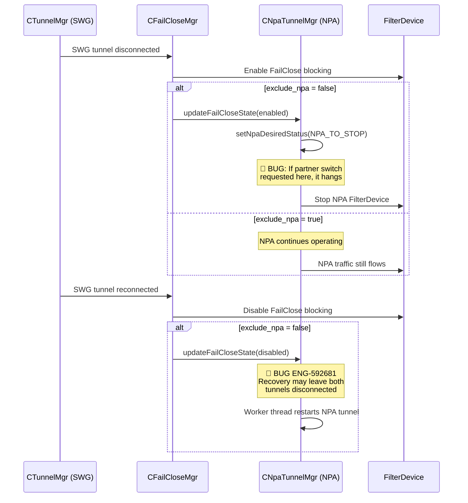

## Appendix A: Bug Quick Reference

| Bug ID | Problem Summary | Root Cause | Platform | Type |
|---|---|---|---|---|
| **ENG-393015** | NPA + SWG crash on network switch | Race condition between tunnel managers on network change | Windows | Regression |
| **ENG-441957** | NPA disconnects after network switch (Android) | Network switch handling regression | Android | Regression |
| **ENG-577918** | ChromeOS NPA service won't restart | Disable/Enable simulation fails to re-enable NPA | ChromeOS | Test Gap |
| **ENG-592681** | Android tunnel repeatedly drops | Recovery bug leaves both tunnels disconnected | Android | Regression |
| **ENG-608191** | NPA enrollment fails (JWT version) | Addon API uses authorizeV7 instead of V5 | Backend | Regression |
| **ENG-625957** | NPA not tunneling with BWAN | WinDivert captures egress before WFP driver | Windows | Corner Case |
| **ENG-637794** | NPA not tunneled on ChromeOS | bypassIPExceptionAtAndroidOs bypasses NPA overlap IPs | ChromeOS | Regression |
| **ENG-733735** | Android Enable button greyed out | UI logic checks steering=NONE but ignores NPA enabled | Android | Day-1 |
| **ENG-766017** | NPA PCAP files corrupted | PCAP header written to SWG file during NPA rotation | Windows/macOS | Regression |
| **ENG-773191** | NPA not tunneled after macOS upgrade | Transparent proxy stops when NPA in DISABLED state | macOS | Regression |
| **ENG-885394** | Re-auth window refreshes repeatedly | macOS Dark Wake XPC failure triggers rapid re-auth events | macOS | Day-1 |
| **ENG-918295** | NPA DNS goes to BWAN on macOS | NSC reads global DNS only, misses BWAN service-level DNS | macOS | Day-1 |

---

## Appendix B: Methodology

### Severity Ratings

| Level | Description |
|---|---|
| **S1** | Security bypass, data leak, crash, or complete feature failure |
| **S2** | Significant functional issue affecting a common workflow |
| **S3** | Minor issue with workaround available |
| **S4** | Cosmetic or edge case with minimal impact |
| **S5** | Enhancement or optimization request |

### Gap Types

| Type | Description |
|---|---|
| **Regression** | Previously working feature broken by code change |
| **Day-1** | Feature never worked correctly since introduction |
| **Test Gap** | Insufficient test coverage for known risk area |
| **Corner Case** | Unusual configuration or environment not anticipated |

### Automation Priority

| Priority | Description |
|---|---|
| **P1** | Must automate — high-severity gap with customer impact |
| **P2** | Should automate — moderate risk, currently manual-only |
| **P3** | Nice to automate — low risk but improves coverage |

### Test Case Format

Each test case uses TC-XX-NN format where XX is the chapter number and NN is the sequential test ID. Fields include: Severity, Related Bugs (verified ENG-XXXXXX IDs from `bugs/*.md`), Flow Point (diagram node reference), Gap Type, Automation Priority, Preconditions, Steps, Expected Result, Failure Indicators (log grep patterns), and Risk if Untested.

---

## Related Chapters

- [00_overview.md](00_overview.md) — NPA as part of overall NSClient architecture
- [02_enrollment.md](02_enrollment.md) — SWG enrollment (NPA enrollment is separate)
- [04_config_download.md](04_config_download.md) — Config containing NPA settings
- [05_steering_config.md](05_steering_config.md) — Steering rules that control NPA traffic routing
- [07_tunnel_management.md](07_tunnel_management.md) — SWG tunnel lifecycle (runs alongside NPA)
- [08_gateway_selection.md](08_gateway_selection.md) — SWG GSLB (NPA has its own GSLB)
- [09_traffic_steering.md](09_traffic_steering.md) — Packet interception shared with NPA
- [10_bypass.md](10_bypass.md) — Bypass rules including NPA exceptions
- [11_failclose.md](11_failclose.md) — FailClose interaction with NPA (exclude_npa flag)
- [12_device_classification.md](12_device_classification.md) — Device posture affects NPA access
- [13_certificate_management.md](13_certificate_management.md) — NPA uses separate device certificates
- [16_dem.md](16_dem.md) — DEM monitoring for NPA private apps
- [19_integration_architecture.md](19_integration_architecture.md) — NPA as part of multi-component architecture
- [21_grey_box_testing_guide.md](21_grey_box_testing_guide.md) — Testing guide including NPA scenarios

---

**Chapter Summary**: NPA integration is one of NSClient's most complex subsystems. It maintains a fully independent tunnel alongside SWG — with separate enrollment (JWT + device certs), separate gateway selection (LDNS/EDNS/GSLB/Local Broker), a 5-state tunnel state machine, dynamic steering based on on-prem detection, partner tenant switching, prelogon tunneling (Windows), VDI multi-tunnel mode, re-authentication, and FailClose interaction. The dual-tunnel architecture means that NPA bugs often manifest as compound failures when combined with network changes, FailClose activation, or service upgrades. The `CNpaTunnelMgr` worker thread is the central control loop that reconciles desired state with actual state every 10 seconds, handling enrollment, tunnel start/stop, VDI user changes, partner tenant operations, and NPA exception rule updates.
