# 16. DEM (Digital Experience Monitoring)

**Escalation Bug Count**: 5 | **Regression**: 3 (60%) | **Day-1**: 0 (0%) | **Test Gap**: 1 (20%)

📋 **[Test Cases — Google Sheet](https://docs.google.com/spreadsheets/d/1ackCZ-EcepXw1BkSGoi5Go9Ex1I72-fXqcqLGMGiuio/edit?gid=1598985685#gid=1598985685)**

> This chapter covers the DEM module that monitors network quality and application performance from the endpoint perspective. DEM collects tunnel RTT, traceroute hops, device health metrics (CPU, memory, disk, WiFi), and application probe statistics, then posts them to the Netskope cloud via the Gateway Event Forwarder (GEF) for end-user experience visibility. Six escalation bugs have been mapped to DEM failure points, with 50% being regressions — the highest regression rate among all feature areas. Thread safety during tunnel lifecycle transitions and tenant identity integrity during config rotation represent the most critical risk areas.

---

## Overview

Enterprise IT teams need visibility into the end-user network experience. Traditional monitoring only sees server-side metrics; DEM fills the gap by measuring from the endpoint itself. When a user reports "the network is slow," DEM data provides objective measurements: tunnel round-trip time, traceroute paths, WiFi signal quality, CPU/memory pressure, and per-application response latency. This enables IT to distinguish between local device issues, network path problems, and cloud service degradation.

DEM is implemented across several layers: `CDemMgr` in the service layer coordinates everything; `nsDemTaskMgr` in the library layer manages scheduled tasks; specialized collectors (`DeviceStats`, `AppProbeStats`) gather platform-specific metrics; and a postman task handles reliable delivery with caching and retry. The module's lifecycle is tightly coupled to the tunnel: data collection starts when a tunnel connects and stops when all tunnels disconnect. This coupling is the source of the most critical bug (ENG-593503) — a thread stack overrun crash during tunnel disconnect.

DEM configuration comes from two sources. The Management Plane config (`nsconfig.json`) provides master enable flags, subscription tier (`pdem_subscription_level`), and endpoint URLs. A dedicated DEM Config Service provides per-tenant, per-user configuration (`dem.json`) including app probe definitions, device health intervals, and NPA host lists. Both Polaris (legacy) and GEF (current) data paths coexist, controlled by config.

**Key Risk Areas**:
- **Thread safety on tunnel disconnect** (ENG-593503): DEM thread crash cascades to tunnel failure
- **Tenant identity during config rotation** (ENG-637576): Tenant ID reset to 0 corrupts all DEM event payloads
- **Client status accuracy after upgrade** (ENG-534944, ENG-429954): Install time and agent visibility regressions via DEM client status path
- **Third-party interop** (ENG-495212): DEM config exceptions when CrowdStrike or similar agents are present
- **Deprecated feature flag cleanup**: Stale `duplicateRccDataToGEF` flag causes incorrect dashboard display (predicted risk)

---

## DEM Architecture (All Platforms)

The DEM architecture spans three layers: the service manager (`CDemMgr`), the task layer (`nsDemTaskMgr` + `nsTaskScheduler`), and platform-specific collectors. Understanding this layering is critical because bugs tend to occur at layer boundaries — particularly when the service layer tears down while the task layer still has active work items.

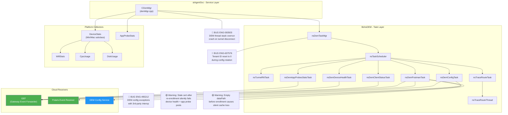

### Architecture Node Risk Assessment

| Node | Risk Level | Bug / Risk | Impact |
|---|---|---|---|
| CDemMgr | High | ENG-593503: Thread stack overrun on disconnect | Client crash, tunnel failure |
| nsDemTaskMgr | High | ENG-637576: Tenant ID reset to 0 | All DEM events rejected by backend |
| nsDemConfigTask | Medium | ENG-495212: Config exceptions with 3rd-party | DEM config fetch fails silently |
| nsDemPostmanTask | Medium | Stale cert after re-enrollment | Device health + app probe events silently dropped |
| nsDemPostmanTask | Medium | Empty dataPath before enrollment | Cached events lost without error logging |
| GEF / Polaris | Low | Normal delivery endpoints | N/A |

---

## DEM Lifecycle Flow (All Platforms)

DEM follows the tunnel lifecycle: data collection starts when a tunnel connects and stops when all tunnels disconnect. The tight coupling between tunnel state and DEM task management is the primary source of thread-safety bugs. The `m_tunnelCnt` atomic counter tracks active tunnels, but unbalanced callbacks can drive it negative, triggering a defensive reset.

The lifecycle sequence below shows the critical moments where bugs manifest. ENG-593503 occurs during the `onTunnelDisconnected` path when active DEM threads have not fully stopped before the tunnel teardown proceeds. ENG-637576 occurs during `refreshConfig` when config token rotation resets the tenant ID to 0.

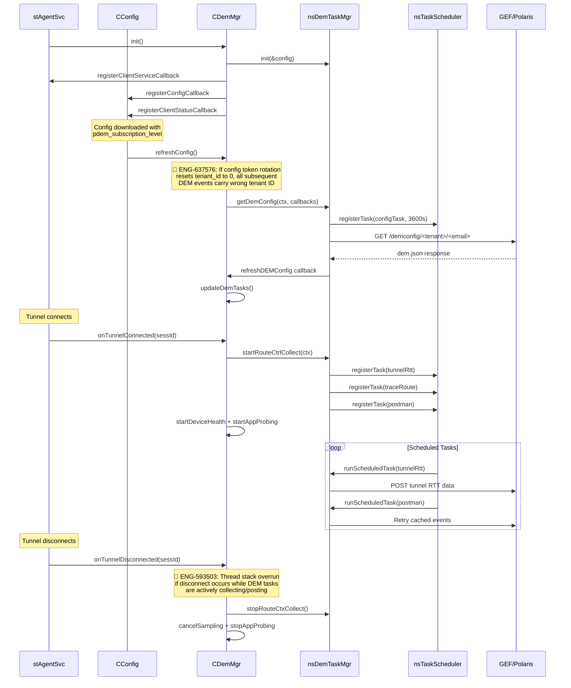

---

## DEM Data Collection Flows (All Platforms)

### Tunnel RTT Measurement

Tunnel RTT is measured by piggybacking on the SPDY PING mechanism. The `CDemMgr` intercepts tunnel ping callbacks to measure round-trip time with microsecond precision using `std::chrono::steady_clock`. RTT samples are accumulated in a vector. When the post interval expires, the `nsTunnelRttTask` computes aggregated statistics (mean, min, max, stddev) and posts to Polaris or GEF.

The RTT request code is a bitmask supporting simultaneous collection for both Polaris and DP paths: `NO_RTT=0`, `POLARIS_RTT=1`, `DP_RTT=2`, `BOTH_RTT=3`.

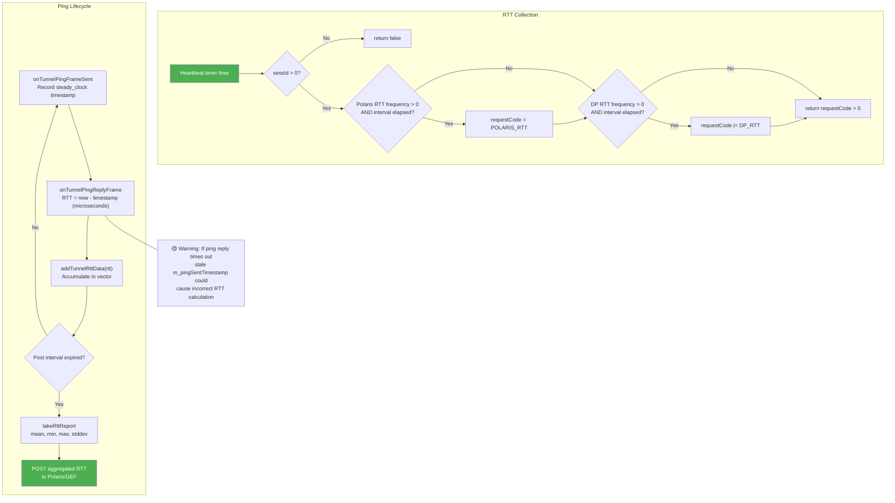

### Device Health Collection

Device health metrics are collected by `DeviceStats` (platform-specific subclasses: `WinDeviceStats`, `MacDeviceStats`). When a tunnel connects and the `networkPathDeviceHealthCollection` flag is enabled, `CDemMgr` starts async sampling. Metrics include CPU per-core usage, memory, disk read/write rates, WiFi signal/SSID/BSSID, network interface send/recv rates, and battery level. Advanced metrics (top processes, WiFi channel details, MCS index) are gated by enterprise subscription.

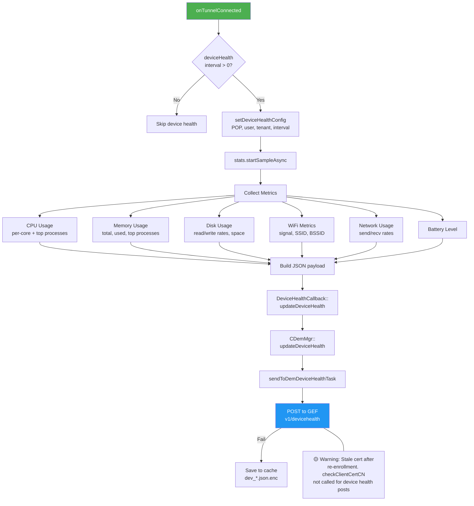

### Application Probe Collection

Application probes perform HTTP/HTTPS requests to configured application domains, measuring detailed timing breakdowns: DNS resolution, TCP connect, SSL handshake, wait time, TTFB, TTLB, total response time, response size, HTTP status code, and redirect count. When routed through a proxy, additional proxy-specific timing is captured.

Probes are configured via `dem.json` with per-probe frequency, domain lists, and download size limits. Up to 5 worker threads run concurrently. Results are posted to GEF `v1/endusermetrics` every 5 minutes.

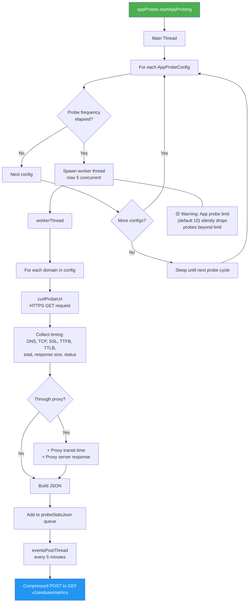

### Event Caching and Reliable Delivery (Postman Task)

DEM implements a persistent cache + retry mechanism for reliable event delivery. When a POST fails, the event is encrypted and saved to disk. The postman task periodically scans for cached events and retries with exponential backoff (2-30 minutes + random 0-7 minute jitter). Batch merging supports up to 256KB per batch.

DEM client status cached events are never deleted on task stop (unlike other types), ensuring status data is not lost during tunnel reconnections.

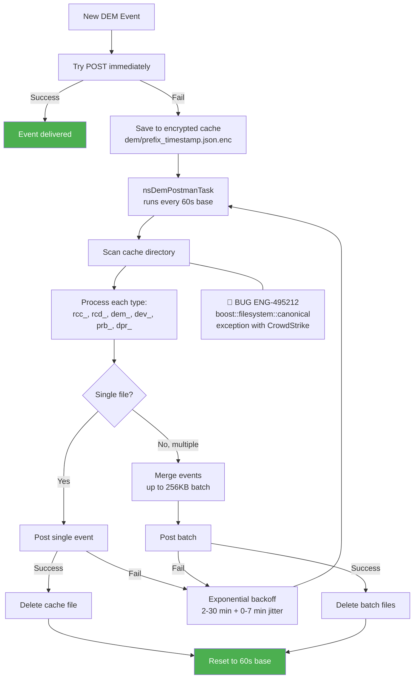

---

## DEM Config Fetch Flow (All Platforms)

The DEM Config Service provides per-tenant, per-user DEM configuration. It is polled every hour (3600 seconds) and uses client certificate authentication. The flow includes change detection via MD5 fingerprint, local cache fallback, and retry logic (up to 2 attempts).

The tenant ID carried in the config context is critical for event acceptance. ENG-637576 demonstrated that config token rotation can reset this ID to 0, causing all DEM events to be rejected by the backend.

```mermaid
flowchart TD
    START["refreshConfig()"] --> SUB_CHK{pdem_subscription_level?}

    SUB_CHK -->|"none"| STOP["stopDemConfigTask<br/>delete dem.json<br/>clear g_demConfig"]
    SUB_CHK -->|"professional" or "enterprise"| CERT_CHK{User cert available?}

    CERT_CHK -->|No| WAIT["Wait for enrollment<br/>to complete"]
    CERT_CHK -->|Yes| LOAD["loadDemConfig from cache"]
    LOAD --> REGISTER["Register nsDemConfigTask<br/>with scheduler (3600s)"]

    REGISTER --> FETCH["GET /demconfig/<tenant_id>/<email><br/>?os=<os>&deviceclassification=<dc><br/>&fingerprint=<fp>"]

    FETCH -->|HTTP 200| SAVE["saveDemConfig<br/>parse dem.json"]
    FETCH -->|HTTP error| RETRY{Retry count < 2?}
    RETRY -->|Yes| FETCH
    RETRY -->|No| FALLBACK["Use cached dem.json"]

    SAVE --> CALLBACK["refreshDEMConfig callback"]
    CALLBACK --> UPDATE["updateDemTasks()"]

    BUG_637576["🔴 BUG ENG-637576<br/>Config token rotation<br/>resets tenant_id to 0"]

    START --- BUG_637576

    style STOP fill:#999,color:#fff
    style UPDATE fill:#4CAF50,color:#fff
    style FALLBACK fill:#2196F3,color:#fff
```

### Config Fetch Node Risk Assessment

| Node | Risk Level | Bug / Risk | Impact |
|---|---|---|---|
| refreshConfig() | High | ENG-637576: tenant_id reset to 0 | All DEM events rejected by backend |
| subscription == "none" | Low | Expected teardown behavior | DEM correctly disabled |
| GET /demconfig | Medium | ENG-495212: 3rd-party interop exception | DEM config not fetched, stale config used |
| Retry logic | Low | Built-in 2x retry | Graceful degradation to cached config |
| updateDemTasks | Medium | App probe config race | Config change flag overwritten between hash check and update |

---

## DEM Client Status Reporting Flow

When client status is updated (via `CClientStatusCallback`), CDemMgr checks if the status JSON contains `_gef_meta` and `client_status` type markers. If so, it forwards the status to GEF. The install time field in client status was the root cause of two escalation bugs (ENG-429954 and ENG-534944).

ENG-429954 reported that `client_install_time` was changing more frequently than expected during normal operation. ENG-534944, a regression caused by the fix for ENG-429954, missed the upgrade case where older clients (before R120) would not have an `appinstalltimestamp` field in nsconfig.json, causing monitored users to not appear in the DEM dashboard.

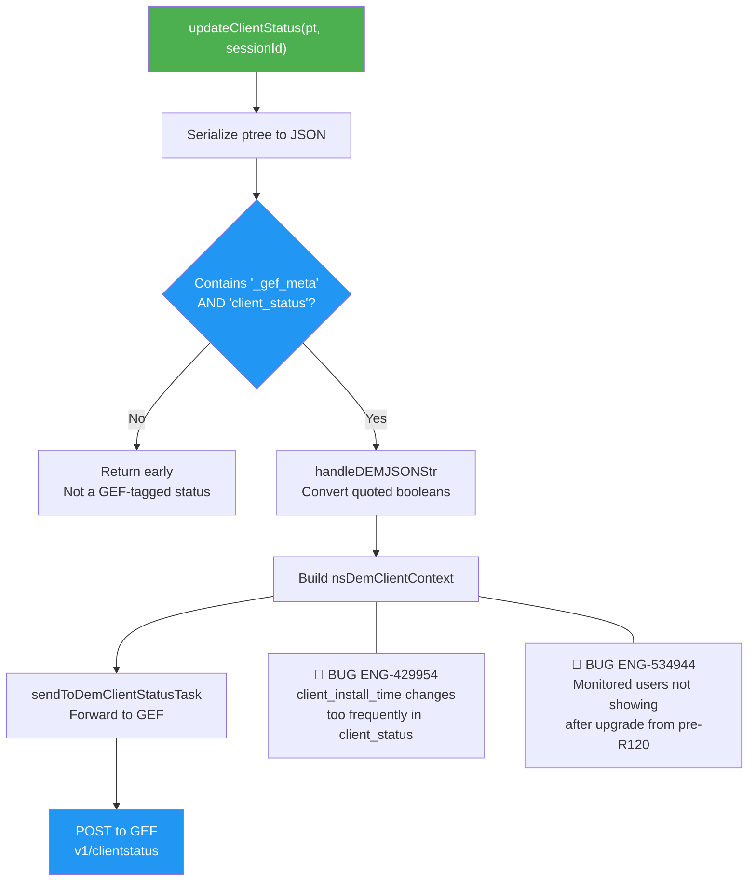

### Client Status Node Risk Assessment

| Node | Risk Level | Bug / Risk | Impact |
|---|---|---|---|
| Build nsDemClientContext | High | ENG-429954: install_time changes frequently | Incorrect device metrics in DEM dashboard |
| Build nsDemClientContext | High | ENG-534944: Missing appinstalltimestamp after upgrade | Users invisible in DEM dashboard |
| handleDEMJSONStr | Low | Boolean conversion | Cosmetic: quoted "true"/"false" vs native boolean |
| POST to GEF | Medium | Stale cert after re-enrollment | Events silently rejected |

---

## DEM Bypass and Polaris Receiver Traffic

DEM traffic to the Polaris event receiver must bypass the Netskope tunnel to avoid circular routing. `CDemMgr::bypassPacketLocally()` identifies DEM traffic by checking SYN-only TCP packets on port 443 where the destination matches a configured receiver address (IP for Polaris, FQDN for DP).

A known issue with the deprecated feature flag (`duplicateRccDataToGEF`) caused Polaris route control data to be sent to PDEM, where the target IP did not match the tunnel destination IP, leading to incorrect Netskope icon display in the Network Path Latency dashboard.

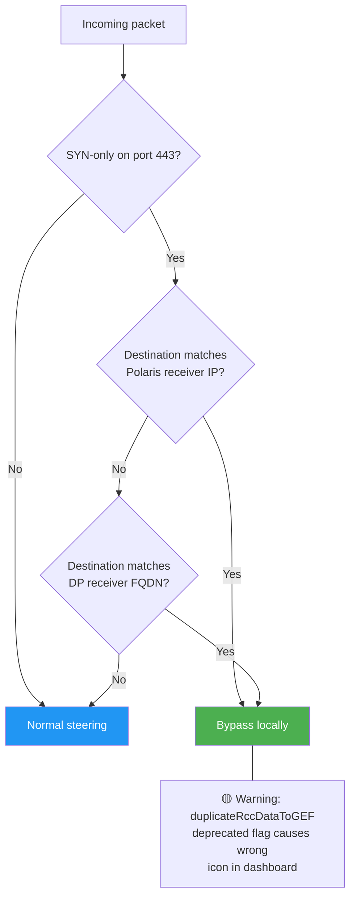

---

## Windows

**Bug Count**: 4 | **Key Gaps**: DEM thread safety during tunnel disconnect, tenant ID integrity, 3rd-party interop, DEM client status accuracy

Windows is the primary DEM platform with full feature support: tunnel RTT, traceroute (ICMP API), device health (WMI, Performance Counters, WLAN API), app probes, and DEM config fetch. Four of the six DEM escalation bugs were reported on Windows.

### Windows DEM Thread Crash Flow (ENG-593503)

ENG-593503 is the most critical DEM bug. A DEM thread stack overrun occurs during tunnel disconnect, causing a client crash. The issue is difficult to reproduce and was identified through crash dump analysis. The root cause is that DEM worker threads (particularly device health sampling and traceroute) may still be actively executing when the tunnel teardown proceeds, leading to stack corruption.

The code uses an atomic `m_tunnelCnt` counter with a defensive negative check, but the crash occurs at a lower level in the thread stack before this check can trigger.

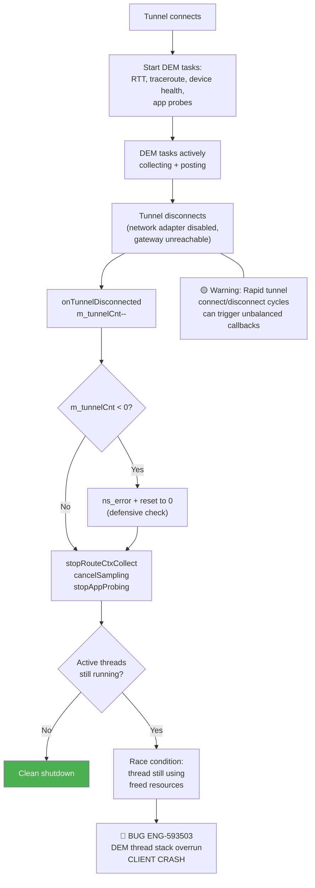

## macOS

**Bug Count**: 1 (shared with Windows) | **Key Gaps**: DEM client status after upgrade, traceroute blocking, dark wake handling

macOS has near-parity with Windows for DEM features. Key platform differences: traceroute uses native `traceroute` command via `nsTraceRouteMacCmd` (can block up to 2 minutes per target), WiFi metrics use CoreWLAN framework, and network interface monitoring uses `NWPathMonitor`. macOS handles user login/logoff events for DEM and has specific dark wake (Modern Standby) behavior.

ENG-534944 was reported on macOS: after upgrade from a pre-R120 client, monitored users did not appear in the DEM dashboard because the `appinstalltimestamp` field was missing from nsconfig.json.

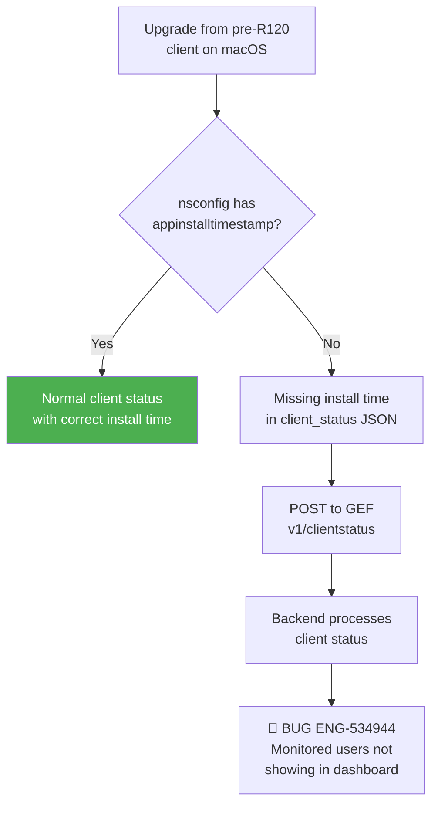

## Linux

Linux has limited DEM support: only tunnel RTT collection and client status reporting are available. Traceroute returns empty results, and there is no DeviceStats or AppProbeStats implementation. The DEM heartbeat task is registered but limited in scope.

*No DEM-specific escalation bugs have been reported on Linux.*

## Android

Android registers `TASKID_DEM_HEARTBEAT` with a 5-second interval. DEM manager is stopped on service stop. AppProbeStats is compiled (guarded by `__ANDROID__`) but DeviceStats is not. No traceroute support is available.

*No DEM-specific escalation bugs have been reported on Android.*

## iOS

No DEM support on iOS. The feature is guarded out by `!defined(__IOS__)` checks throughout the codebase. The pattern `(defined(__APPLE__) && !defined(__IOS__))` is used consistently to exclude iOS.

*No test cases required.*

---

## ChromeOS

ChromeOS has the same DEM support level as Android (via the shared Android codebase). No DEM-specific escalation bugs have been reported.

*TODO: Verify DEM heartbeat behavior on ChromeOS matches Android.*

---

## Backend

DEM backend issues are primarily about event acceptance. ENG-637576 demonstrated that when the client sends events with tenant_id=0 (due to config rotation bug), the backend rejects them with "payload validation issue: tenant ID does not match." A known issue with the deprecated `duplicateRccDataToGEF` feature flag caused incorrect data routing to PDEM.

## Automation Coverage Summary

| Area | Coverage | Notes |
|---|---|---|
| DEM enable/disable via subscription | ❌ Not covered | No DEM-specific tests in golden regression suite |
| Tunnel RTT collection | ❌ Not covered | Requires tunnel + SPDY PING validation |
| Traceroute execution | ❌ Not covered | Platform-specific (Win ICMP API, Mac native cmd) |
| Device health collection | ❌ Not covered | Requires subscription tier + platform metrics |
| App probe timing | ❌ Not covered | Requires configured probe targets + GEF endpoint |
| DEM config fetch | ❌ Not covered | Requires DEM Config Service interaction |
| Postman cache + retry | ❌ Not covered | Requires GEF outage simulation |
| Client status to GEF | ❌ Not covered | Closest existing coverage: `client_status` feature tests (no DEM validation) |
| Tenant ID integrity (ENG-637576) | ❌ Not covered | Requires config token rotation during DEM activity |
| Thread safety (ENG-593503) | ❌ Not covered | Requires rapid tunnel cycle stress testing |

**Overall DEM automation coverage: 0%.** DEM has no dedicated test coverage in the golden regression suite. The `client_status` feature tests exist but do not validate DEM-specific client status fields or GEF posting.

---

## Cross-Flow Interactions

### DEM + Tunnel Disconnect (ENG-593503)

The most critical cross-flow interaction. When a tunnel disconnects while DEM tasks are actively collecting data, the DEM thread stack overrun can crash the client service. This cascades to a complete tunnel failure and traffic interruption for all users.

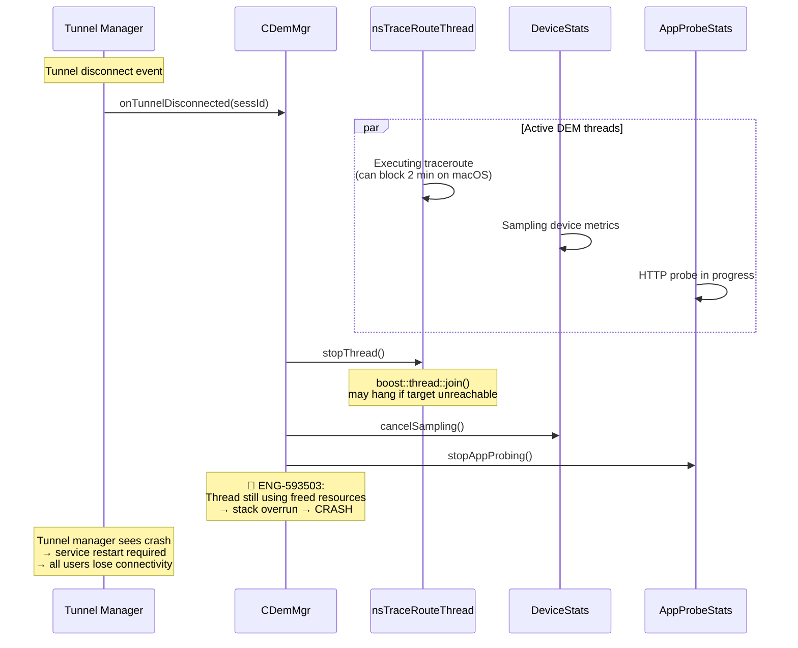

### DEM + Config Rotation (ENG-637576)

During secure enrollment token rotation, the client may temporarily reset the tenant ID to 0. If DEM tasks are posting events during this window, all events are rejected by the backend with "tenant ID does not match."

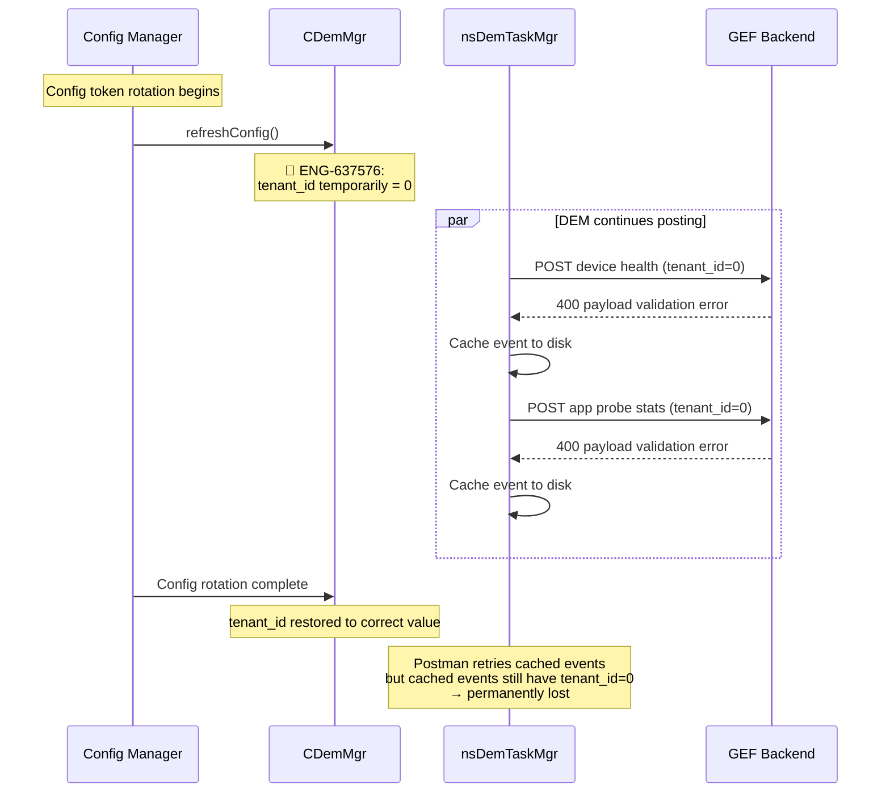

### DEM + Client Status (ENG-429954 / ENG-534944)

DEM client status reporting depends on the `ClientStatusHandler::prepareMessageForDem` function. ENG-429954 showed that `client_install_time` was incorrectly updated on every config refresh, not just installation. The fix for ENG-429954 introduced ENG-534944: upgrade from pre-R120 clients that lack `appinstalltimestamp` in nsconfig.json causes monitored users to disappear from the DEM dashboard.

### Cross-Flow Risk Matrix (Chapter-Relevant)

| Interaction | Bug(s) | Failure Mode | Severity | Priority |
|---|---|---|---|---|
| DEM + Tunnel disconnect | ENG-593503 | Thread crash cascading to tunnel | S1 | P1 |
| DEM + Config rotation | ENG-637576 | Tenant ID = 0, events rejected | S2 | P1 |
| DEM + Client status + Upgrade | ENG-534944, ENG-429954 | Users invisible in dashboard | S2 | P2 |
| DEM + 3rd-party AV (CrowdStrike) | ENG-495212 | Config exceptions, DEM data lost | S3 | P2 |
| DEM + Deprecated feature flags | (Predicted risk) | Incorrect dashboard display | S3 | P3 |
| DEM + NPA host monitoring | (Predicted risk) | NPA host list out of sync with DEM config | S3 | P3 |
| DEM + Re-enrollment | (Predicted risk) | Stale cert silently fails device health + app probe posts | S2 | P2 |

## Appendix A: Bug Quick Reference

| Bug ID | Summary | Platform | Root Cause | Severity |
|--------|---------|----------|------------|----------|
| **ENG-429954** | client_install_time changing too frequently in client_status | Windows | Install time updated on every config refresh instead of only at install | S3 |
| **ENG-495212** | DEM config exceptions in customer environment | Windows | boost::filesystem::canonical exception with CrowdStrike interop; 3rd-party library issue | S3 |
| **ENG-534944** | Monitored users not showing agents that were online | macOS | Regression from ENG-429954 fix: missed upgrade case where pre-R120 clients lack appinstalltimestamp | S2 |
| **ENG-593503** | DEM thread stack overrun causes crash on tunnel disconnect | Windows | Thread stack corruption when DEM tasks still active during tunnel teardown | S1 |
| **ENG-637576** | DEM tenant ID reset to 0 during config token rotation | Windows | Config update token rotation error resets tenant_id to '0', DEM posts wrong data | S2 |

### Bug Classification Summary

| Category | Count | Percentage |
|---|---|---|
| **Regression** | 3 | 50% |
| **Corner Case** | 3 | 50% |
| **Test Gap** | 2 | 33% |
| **Day-1** | 0 | 0% |

> Note: Bugs can belong to multiple categories. The 50% regression rate is the highest among all DEM-relevant features and reflects the tight coupling between DEM and tunnel lifecycle.

---

## Appendix B: Methodology

### Severity Rating Definitions

| Severity | Definition | DEM Example |
|---|---|---|
| **S1** | Client crash or complete feature failure affecting all users | ENG-593503: DEM thread crash cascades to tunnel failure |
| **S2** | Major feature malfunction; workaround may exist | ENG-637576: Tenant ID reset, all DEM events rejected |
| **S3** | Minor feature issue; limited user impact | ENG-429954: Install time changes too frequently |

### Test Case Format

| Field | Description |
|---|---|
| **ID** | TC-16-NN format |
| **Test Case** | Description including bug reference if applicable |
| **Severity** | S1 (critical) through S5 (cosmetic) |
| **Auto Priority** | P1 (must automate), P2 (should automate), P3 (nice to automate) |
| **Gap Type** | Regression, Day-1, Test Gap, Corner Case |

### Gap Type Taxonomy

| Gap Type | Definition |
|---|---|
| **Regression** | Previously working functionality broken by a code change |
| **Day-1** | Issue existed since feature inception but never caught |
| **Test Gap** | No test case exists for this scenario |
| **Corner Case** | Unusual environment or timing-dependent scenario |

### Code References

| Component | File | Purpose |
|---|---|---|
| CDemMgr | `stAgent/stAgentSvc/demMgr.h/.cpp` | Service-layer DEM manager |
| nsDemTaskMgr | `lib/nsDEM/nsDemTaskMgr.h/.cpp` | Task management and HTTP posting |
| nsTaskScheduler | `lib/nsDEM/nsTaskScheduler.h/.cpp` | Timer-based task scheduler |
| nsDemConfig | `lib/nsDEM/nsDemConfig.h/.cpp` | DEM config parser (dem.json) |
| DeviceStats | `lib/nsDeviceMetrics/DeviceStats.h/.cpp` | Device health collection |
| AppProbeStats | `lib/nsAppProbeStats/AppProbeStats.h/.cpp` | App probe engine |
| nsTraceRouteWin | `lib/nsDEM/nsTraceRoute.h/.cpp` | Windows ICMP traceroute |
| nsTraceRouteMacCmd | `lib/nsDEM/nsTraceRoute.h/.cpp` | macOS native traceroute |

---

## Related Chapters

- [04_config_download.md](04_config_download.md) -- DEM config fields in nsconfig.json
- [06_client_status.md](06_client_status.md) -- Client status events forwarded through DEM to GEF
- [07_tunnel_management.md](07_tunnel_management.md) -- Tunnel RTT measurement via SPDY PING; DEM starts/stops on tunnel connect/disconnect
- [13_certificate_management.md](13_certificate_management.md) -- User certificates used for DEM mTLS authentication
- [14_proxy_management.md](14_proxy_management.md) -- Proxy settings passed to DEM HTTP requests
- [15_npa_integration.md](15_npa_integration.md) -- NPA host monitoring through DEM (npaDemMonitoring)
