# 17. IPC Communication (NSCom2/NSMsg2)

**Escalation Bug Count**: 5 | **Regression**: 0 (0%) | **Day-1**: 3 (60%) | **Test Gap**: 0 (0%)

📋 **[Test Cases — Google Sheet](https://docs.google.com/spreadsheets/d/1ackCZ-EcepXw1BkSGoi5Go9Ex1I72-fXqcqLGMGiuio/edit?gid=63239927#gid=63239927)**

> This chapter covers the inter-process communication framework used between NSClient components -- stAgentSvc (the service), stAgentUI (the tray icon UI), and nsdiag (the diagnostics CLI). The framework consists of two layers: NSCom2 (transport) and NSMsg2 (message serialization). Understanding these internals is essential for diagnosing multi-user VDI failures, power-resume reconnection issues, and any scenario where the UI becomes disconnected from the service.

---

## Overview

NSClient runs as two separate processes on every desktop platform. The service process (stAgentSvc) runs as SYSTEM/root with full network control -- it owns the tunnel, the driver, and all management-plane communication. The UI process (stAgentUI) runs in the logged-in user's session and has no direct access to any of these resources. Every piece of information displayed in the tray icon, every enable/disable toggle, and every diagnostic log collection must cross this process boundary through IPC.

A third process, nsdiag, also connects as a client for on-demand diagnostics and debug commands.

IPC is the invisible backbone of NSClient. When it works, users never notice it. When it fails, the symptoms are deceptive: the UI shows "disconnected" while the service is running, enable/disable toggles silently fail, FailClose notifications never reach the user, and VDI environments experience multi-user session confusion. The 5 escalation bugs mapped to this chapter reveal that **IPC failures manifest as bugs in other modules** -- the NSCom2 deadlock (ENG-591721) appeared as an enrollment failure, incorrect session ID routing (ENG-753965) appeared as a steering bypass bug, and stale tunnel state notification (ENG-917549) appeared as a UI stuck-in-connecting issue.

The highest-risk area is **multi-user VDI session management** (S1): when the NSCom2 server deadlocks or routes messages to the wrong session, all users on the machine lose connectivity or receive incorrect status. Power-resume reconnection and IPC message delivery guarantees are also significant testing gaps.

---

## IPC Architecture (All Platforms)

NSCom2 is a classic client-server model over sockets. The service (stAgentSvc) runs as the NSCom2 **server**, and all other components connect as NSCom2 **clients**. The transport layer (NSCom2) handles socket lifecycle, framing, and connection management. The message layer (NSMsg2) handles JSON serialization, encryption, and message routing.

The following diagram shows the overall architecture with known bug failure points annotated. The multi-user session routing and connection lifecycle are where escalation bugs concentrate.

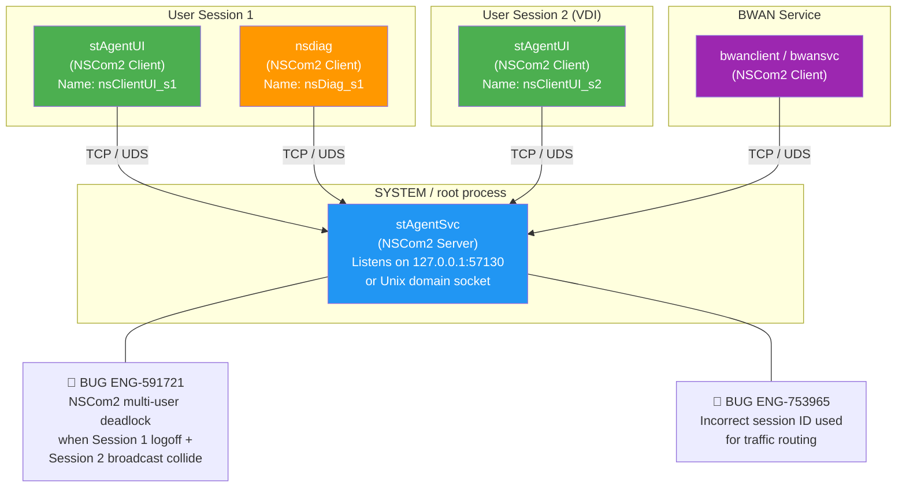

On Linux, an additional relay process (`stAgentApp`) sits between the service and UI/CLI clients. The service listens on `/opt/netskope/stagent/svc`, and stAgentApp acts as both a client (connecting to the service) and a server (accepting connections from stAgentUI and stAgentCli via per-user Unix domain sockets).

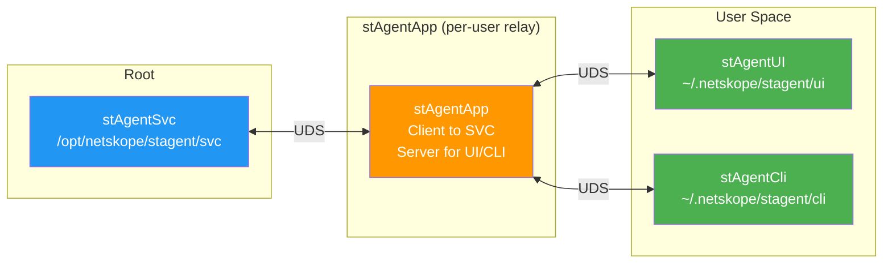

---

## NSCom2 Connection Lifecycle (All Platforms)

The NSCom2 connection lifecycle is where most IPC failures originate. The client thread runs in an infinite retry loop, the server validates connecting processes against an allowlist, and the handshake exchange establishes an encrypted channel. Each of these steps has distinct failure modes that surface as bugs in other modules.

The power-resume reconnection path is especially fragile: after system wake, both the TCP connection and the `select()` loop may be stale, requiring the server to actively probe and potentially recreate itself.

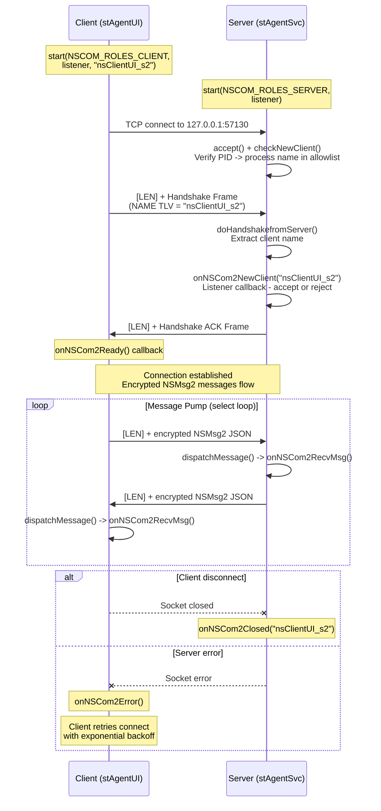

### Client Reconnection Flow

The client thread (`clientThread()`) runs in an infinite retry loop. When a connection fails or drops, it retries every 10 seconds. Key behaviors include exponential log throttling (to avoid log flooding), power-resume acceleration (breaking out of the sleep immediately), and SO_KEEPALIVE on macOS/Linux (to detect dead connections).

The power-resume path is the most common trigger for UI disconnection bugs: after system wake, the TCP connection may be stale, but `select()` on the server side does not detect the dead connection until data is sent.

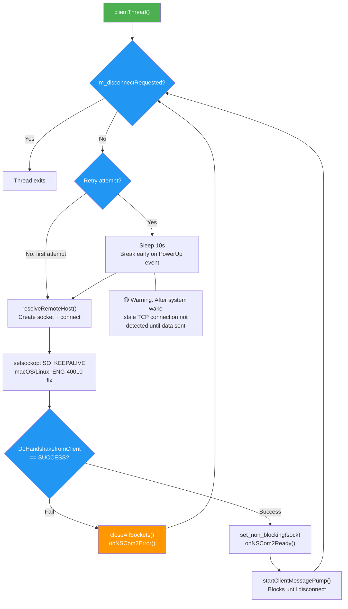

### Server Message Pump Flow

The server uses a single-threaded `select()` loop to multiplex all client connections. This is the central nervous system of NSCom2 -- all message routing, client lifecycle management, and broadcast delivery pass through this loop. The deadlock bug (ENG-591721) occurs when a client disconnect and a message broadcast race against each other in this loop.

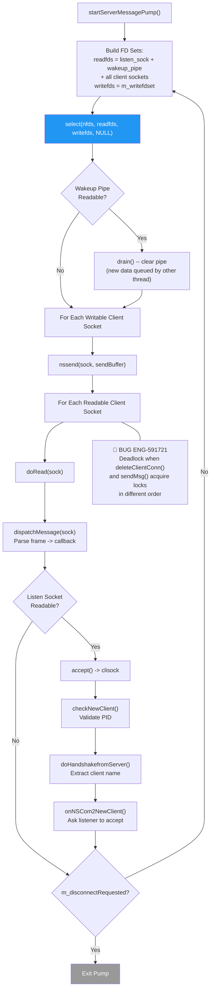

**Node Risk Assessment**:

| Node | Risk | Assessment |
|---|---|---|
| startServerMessagePump() | 🟢 Low | Entry point, simple setup |
| Build FD Sets | 🟡 Medium | Accessing m_clientmap under potential contention |
| select() | 🟢 Low | Standard system call |
| Wakeup Pipe drain | 🟢 Low | Simple pipe read |
| nssend(sock, sendBuffer) | 🟡 Medium | Send may fail on stale connection |
| doRead(sock) | 🔴 High | **ENG-591721** -- Read triggers dispatch which may call deleteClientConn(), creating lock ordering conflict with concurrent sendMsg() |
| dispatchMessage() | 🟡 Medium | Payload parsing must handle malformed data |
| checkNewClient() | 🟡 Medium | PID-to-process validation may fail on race (process exited between connect and check) |
| onNSCom2NewClient() | 🟡 Medium | Listener may reject valid client under load |

---

## NSCom2 Frame Format (All Platforms)

Every NSCom2 message on the wire is prefixed with a 4-byte network-order length field, followed by the NSCom2 frame. The frame itself has a 14-byte header with a magic signature ("NetSk0pe"), version byte, frame type, and payload size. The payload uses TLV (Type-Length-Value) encoding.

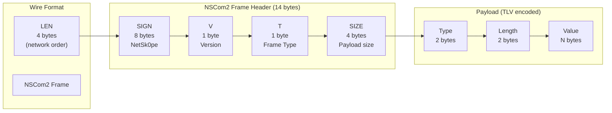

The handshake frame carries the client's name (e.g., `nsClientUI_s2`) in a NAME TLV. After the server validates and acknowledges the handshake, all subsequent messages are application-layer NSMsg2 payloads wrapped in the `[LEN][payload]` wire format -- the NSCom2 frame header is only used for the handshake exchange.

Frame Types:
- `0` = HANDSHAKE (client -> server)
- `1` = HANDSHAKE_ACK (server -> client)

The receive buffer (`NSCOM_RD_BUF_LEN`) is hardcoded to 10,000 bytes. The `isEnoughBuffer()` check rejects messages exceeding this limit during handshake, but the regular `doRead()` path reads in a loop and appends to the recv buffer without a global size check.

---

## NSMsg2 Encryption and Serialization (All Platforms)

All NSMsg2 payloads (except BWAN messages) are encrypted with AES-256-CBC. Both the service and UI derive the same key/salt independently by reading the same system identifiers. If key derivation fails (e.g., after device UID rotation), `m_regenKeySalt` triggers key regeneration on the next message.

This shared-secret design means that any change to the device UID (such as hardware replacement, VDI golden image cloning, or AOAC recovery) can silently break IPC encryption, causing all messages to be unparseable.

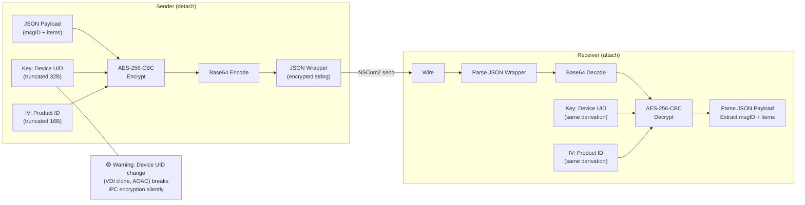

---

## Session Management and Multi-User Routing (All Platforms)

Every NSCom2 client includes its OS session ID in the client name (e.g., `nsClientUI_s1`, `nsClientUI_s2`). The service extracts the session ID using `getSessionID()` and routes messages to specific user sessions. When `clientName` is empty in `sendMsg()`, the message is broadcast to ALL connected clients.

This session-aware routing is the foundation for VDI/RDP multi-user support, and it is where the most impactful IPC bugs occur. Session ID mismatches cause status updates to go to the wrong user (ENG-753965), concurrent session disconnect + broadcast can deadlock the server (ENG-591721), and multi-user tunnel establishment can be delayed by 20+ seconds (ENG-918131).

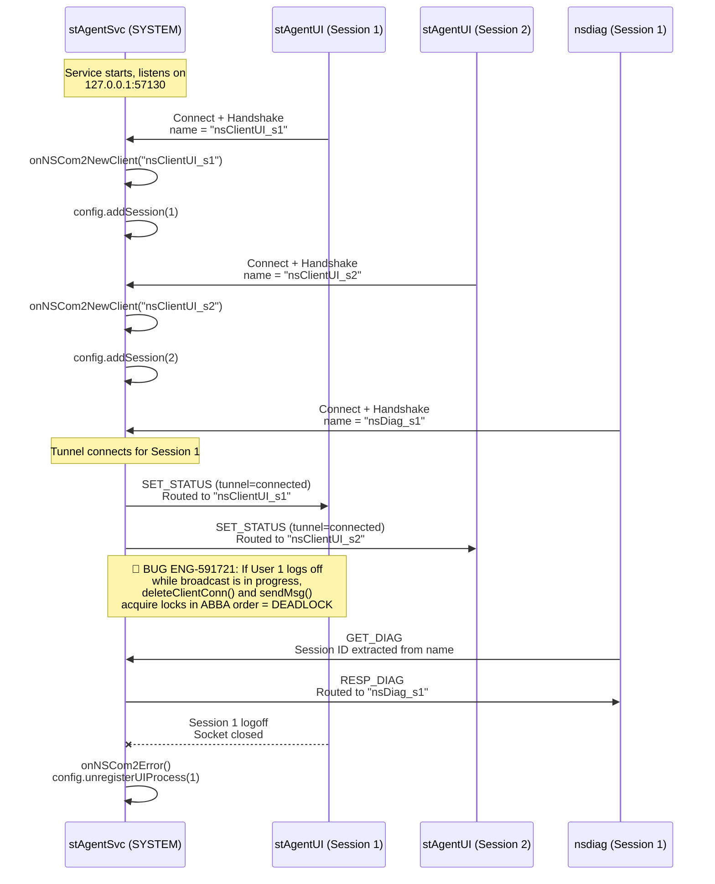

### Windows Power-Resume Reconnection

On Windows, the service receives power-resume events (WTS_SESSION_LOGON, system wake, AOAC). When the NSCom2 connection may be stale, the service runs `ReconnectNSCom()` to actively probe and potentially recreate the server. This is a critical path: if reconnection fails, the UI remains disconnected until the next service restart.

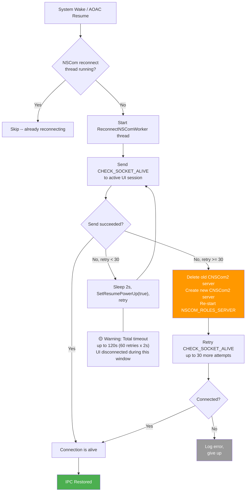

---

## IPC Message Delivery Flow (All Platforms)

The following diagram shows the end-to-end message delivery path, from a status change in the service to the UI tray icon update. This is the flow where ENG-917549 (tunnel state not updated to UI) and ENG-885394 (NPA reauth window refresh storm) manifest.

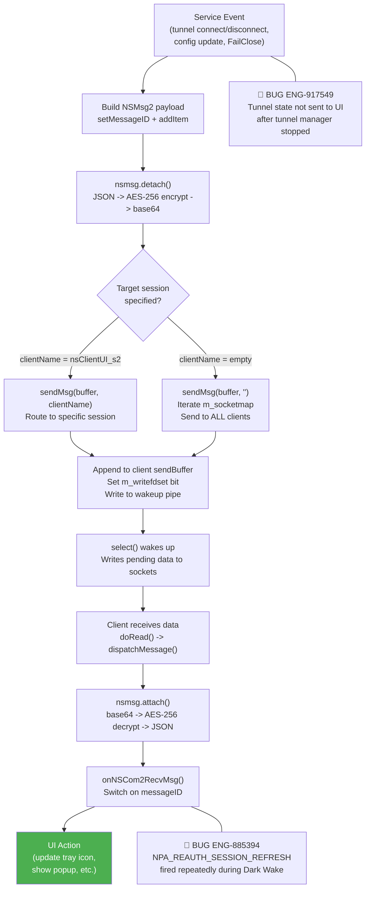

---

## Message Types Reference

NSClient defines 115 message opcodes (101--215) in `lib/nsmsg2/stmsgs.h`. Messages flow in both directions: UI-to-Service (C->S) and Service-to-UI (S->C).

### Core Status & Control Messages

| Opcode | Name | Direction | Description |
|--------|------|-----------|-------------|
| 101 | `GET_UA` | C->S | Request user agent string |
| 103 | `GET_STATUS` | C->S | Request current client status |
| 104 | `SET_STATUS` | S->C / C->S | Push status update (enable/disable, tunnel state) |
| 106 | `GET_ALLOW_DISABLE` | C->S | Query if client disabling is allowed |
| 107 | `SET_ALLOW_DISABLE` | S->C | Push allow-disable policy |
| 113 | `GET_HIDE_CLIENT_ICON` | C->S | Query tray icon visibility policy |
| 124 | `CLIENT_PING` | C->S | Keepalive ping (silently consumed, not dispatched) |
| 154 | `REGISTER_UI_PROCESS` | C->S | UI registers its PID with service |
| 155 | `UNREGISTER_UI_PROCESS` | C->S | UI deregisters |

### Config & Update Messages

| Opcode | Name | Direction | Description |
|--------|------|-----------|-------------|
| 108 | `UPDATE_DONE` | S->C | Config/software update completed |
| 118 | `UPDATE_AVAILABLE` | S->C | New software version available (macOS) |
| 125 | `FORCE_UPDATE_CONFIG` | C->S | nsdiag/UI requests immediate config sync |
| 126 | `UPDATE_CONFIG_DONE` | S->C | Config update completed |
| 127 | `IS_CONFIG_UPDATE_AVAILABLE` | C->S | Query if config update exists |
| 128 | `CONFIG_UPDATE_AVAILABLE` | S->C | Response with update availability |

### Security & Certificate Messages

| Opcode | Name | Direction | Description |
|--------|------|-----------|-------------|
| 109-110 | `DWNLD_CERT_UTIL` / `INST_CERT_IN_FF` | Both | Firefox certificate installation |
| 111-112 | `NOTIFY_BLOCKED_APP` / `USER_ACK_BLOCKED_APP` | Both | FailClose block notification |
| 145-146 | `SET_PROXY_CREDS` / `PROXY_CREDS_REQUIRED` | Both | Proxy authentication credential exchange |
| 161 | `CERT_PROMPT_REQUESTED` | S->C | Certificate approval popup (macOS) |
| 162 | `CAPTIVE_PORTAL_POPUP_REQUESTED` | S->C | Captive portal detection popup |
| 175 | `USER_FDA_POPUP` | S->C | Full Disk Access alert (macOS) |
| 181-182 | `OTP_CHECK` / `MASTERPASSWORD_CHECK` | Both | Disable password verification |
| 208 | `REFRESH_ENCRYPTION_PARAMS` | S->C | IPC key regeneration trigger |
| 209 | `ENFORCE_ENROLL_FAILCLOSE_DROP` | S->C | FailClose dropped connection notification |

### NPA (Private Access) Messages

| Opcode | Name | Direction | Description |
|--------|------|-----------|-------------|
| 142-144 | `GET/SET/ACK_NPA_STATUS` | Both | NPA tunnel status query and push |
| 147 | `NPA_USER_ALERT` | S->C | NPA alert notification to UI |
| 148-151 | `IDP_USER_PROVISIONING/DEPROVISIONING` | Both | IdP enrollment flow |
| 152 | `NPA_REQUEST_AUTHENTICATION` | S->C | NPA re-auth request |
| 178 | `UPDATE_NPA_STATUS` | S->C | NPA tunnel connect/disconnect/reconnect notification |
| 207 | `NPA_REAUTH_SESSION_REFRESH` | S->C | Reauth session extension |

### Diagnostics & Debug Messages

| Opcode | Name | Direction | Description |
|--------|------|-----------|-------------|
| 115 | `GET_DIAG` | C->S | nsdiag requests log collection |
| 120-123 | `START/STOP_PKT_CAPTURE` | C->S / S->C | Inner packet capture control |
| 129 | `SET_USER_LOG_LEVEL` | C->S | Change log verbosity |
| 156-158 | nsdiag log controls | Both | nsdiag-specific log level and size |
| 167 | `FORCE_CHECK_DEVICE_CLASSFICATION` | C->S | Trigger DC re-evaluation |
| 197 | `TLS_DEBUG` | Both | TLS key extraction and debug commands |
| 215 | `DIAG_COMPLETE` | C->S | nsdiag notifies log collection finished |

### POP Pinning Messages

| Opcode | Name | Direction | Description |
|--------|------|-----------|-------------|
| 199-200 | `GET_POPS` / `GET_POPS_RESP` | Both | Fetch available POPs |
| 201-202 | `PIN_POP` / `UNPIN_POP` | C->S | Pin/unpin to specific POP |
| 205-206 | `RESP_PIN_POP` / `RESP_UNPIN_POP` | S->C | Pin/unpin response |

### Linux-Specific Messages

| Opcode | Name | Direction | Description |
|--------|------|-----------|-------------|
| 164-165 | `GET/SET_LINUX_KEY` | Both | Exchange IPC encryption key on Linux |
| 166 | `LINUX_APP_CONN_STATUS` | Both | stAgentApp connection status |
| 170-171 | `LINUX_USER_LOG_ON/OFF` | C->S | User session lifecycle |
| 179 | `LINUX_CERT_INSTALLED_DONE` | C->S | Certificate installation confirmed |

---

## Windows

**Bug Count**: 3 direct (ENG-591721, ENG-753965, ENG-918131) | **Key Gaps**: VDI deadlock, session ID misrouting, power-resume reconnection

Windows is the most complex IPC platform because of multi-user VDI/RDP support, Windows Service session isolation, and power-resume handling. The service process runs as a Windows Service in session 0, while each user's UI runs in their interactive session (session 1, 2, etc.). Session changes (logon, logoff, remote connect/disconnect) trigger `WTS_SESSION_*` events that the service must handle.

### Windows NSCom2 Deadlock Flow (ENG-591721)

The most severe IPC bug found in escalation data is the NSCom2 multi-user deadlock. In VDI environments with multiple concurrent user sessions, two threads can acquire two mutexes in opposite order, creating a classic ABBA deadlock. Thread A (server message pump) processes a client disconnect via `deleteClientConn()`, acquiring `m_deleteClientLock` then touching `m_writefdset`. Thread B (another component sending a broadcast) calls `sendMsg()`, iterating `m_socketmap` under `m_deleteClientLock` and may call `sendMsgtoSocket()` which acquires `m_writefdsetLock`.

When deadlocked, ALL IPC communication freezes. The UI appears disconnected, nsdiag cannot connect, and the service cannot push status updates. Requires service restart.

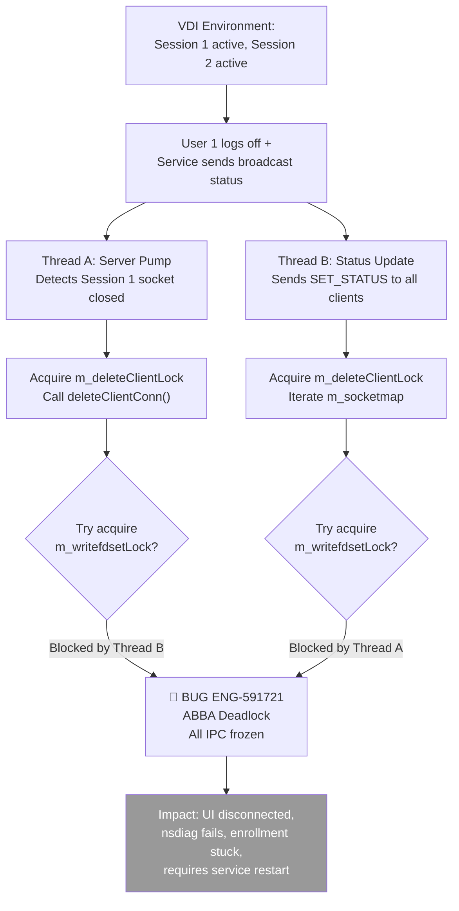

### Windows Session ID Misrouting (ENG-753965)

When a user logs off and logs back in with a different session ID (common in VDI), the NSClient session cache may not update correctly. The cached session ID is used for WFP filter rules and traffic routing, causing traffic to be bypassed or directed to the wrong session.

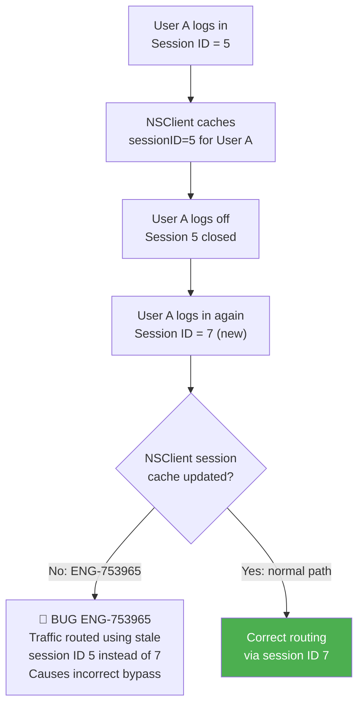

## macOS

**Bug Count**: 1 direct (ENG-885394) | **Key Gaps**: Dark Wake IPC behavior, SO_KEEPALIVE effectiveness, Fast User Switch

macOS uses TCP loopback on `127.0.0.1:57130` like Windows, but with Unix `socketpair()` for the self-pipe and `SO_KEEPALIVE` for dead connection detection. The service runs as a LaunchDaemon, and the UI runs as `Netskope Client.app` in the user's session.

### macOS Dark Wake IPC Storm (ENG-885394)

During macOS Dark Wake (short wakeups while the lid is closed), XPC calls may fail or stall. The NPA_REAUTH_SESSION_REFRESH event fires repeatedly during these wakeups, triggering frequent re-auth window refreshes and cancellations before the user can provide input. This is an IPC message delivery problem: the service generates IPC events during a system state where the UI cannot properly handle them.

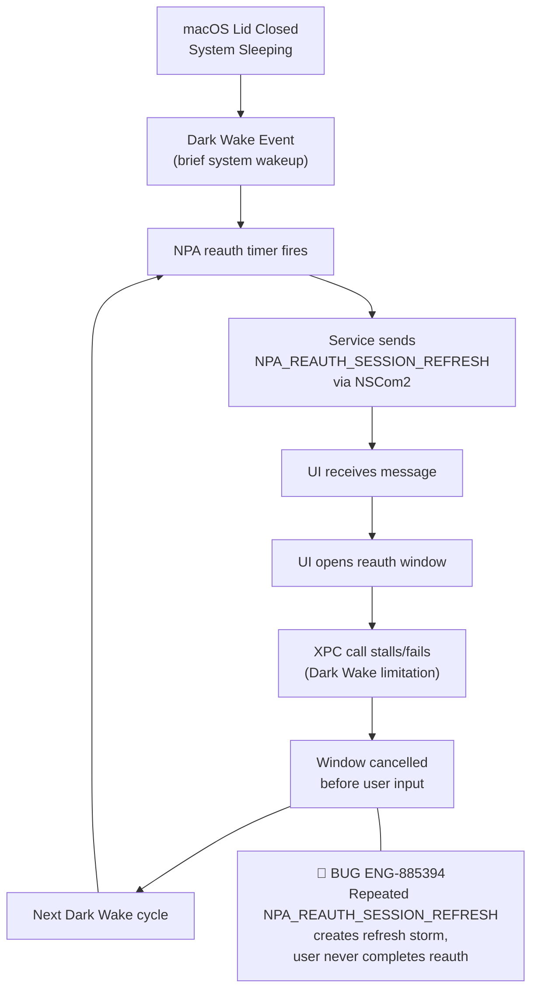

## Linux

**Bug Count**: 0 direct | **Key Gaps**: stAgentApp relay reliability, UDS permission, single-user restriction

Linux uses Unix domain sockets (UDS) instead of TCP loopback, with `stAgentApp` acting as a per-user relay between the service and UI/CLI clients. The service enforces a single-user restriction: only one `stAgentApp` connection is allowed at a time.

### Linux IPC Relay Architecture

The Linux relay architecture adds an extra hop and potential failure point. If `stAgentApp` crashes or hangs, the UI and CLI lose their connection to the service. The UDS socket permissions (`chmod 0666` for the service socket) and the home directory socket paths introduce file-system-dependent failure modes.

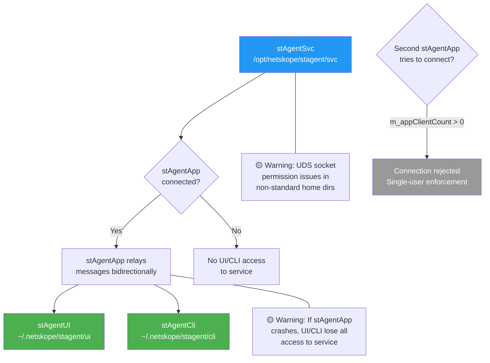

## Android

**Bug Count**: 1 direct (ENG-917549) | **Key Gaps**: Tunnel state notification after network switch

Android uses NSCom2 over TCP loopback with minimal multi-user support. The `checkNewClient()` validation is disabled (always returns true). The UI and service communicate within the same app's process space, making IPC simpler but not immune to message delivery timing issues.

### Android Tunnel State Not Updated to UI (ENG-917549)

When WiFi switches to mobile data, the NS Client receives a "no network" event that triggers tunnel disconnect and tunnel manager stop. After the tunnel manager is stopped, the latest tunnel state is NOT sent to the UI, leaving the UI stuck showing the previous CONNECTING state. This is a classic IPC message delivery gap: the tunnel manager stops before sending the final status update.

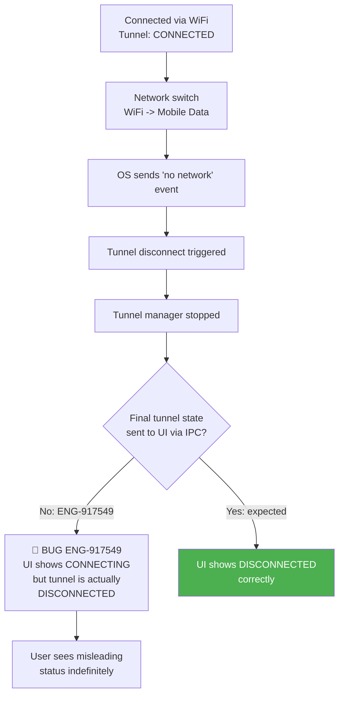

## iOS / ChromeOS

iOS does not use NSCom2 at all -- the service and UI run in the same process (Network Extension), so IPC is unnecessary. Function calls are used directly.

ChromeOS uses the Android NSCom2 implementation.

*No IPC-specific test cases needed for iOS.*

---

## Client Validation

When a new TCP connection arrives, the server resolves the connecting process to verify it is a legitimate NSClient binary. This prevents rogue processes from injecting IPC commands.

| Platform | Mechanism | Allowed Processes |
|----------|-----------|-------------------|
| **Windows** | `nstcpiputil::getAppName()` via TCP table lookup | `stagentui.exe`, `nsdiag.exe`, `bwanclient.exe`, `bwansvc.exe` |
| **macOS** | `nstcpiputil::getAppName()` via TCP table lookup | `Netskope Client.app`, `nsdiag`, `bwanclient` |
| **Linux** | `SO_PEERCRED` + `/proc/[pid]/exe` | `stAgentApp`, `stAgentCli`, `stAgentUI`, `nsdiag`, `bwanclient` |
| **Android/iOS** | Always returns `true` (no validation) | All |
| **Debug builds** | Always returns `true` | All |

On Windows, if the connecting process has a `.rbf` extension (a known ransom-block-file pattern), the server calls `onNSCom2Refused()`, which opens the process handle and terminates it (`TerminateProcess` with exit code 16124).

---

## Platform Differences Summary

| Aspect | Windows | macOS | Linux | Android | iOS |
|--------|---------|-------|-------|---------|-----|
| **Transport** | TCP loopback `127.0.0.1:57130` | TCP loopback `127.0.0.1:57130` | Unix domain sockets | TCP loopback | Not used |
| **Socket pair** | TCP loopback self-connect | `socketpair(AF_UNIX)` | `socketpair(AF_UNIX)` | TCP loopback | N/A |
| **Client validation** | TCP table + `GetModuleFileName` | TCP table + process path | `SO_PEERCRED` + `/proc/pid/exe` | None | N/A |
| **Multi-user** | Yes (VDI/RDP) | Yes (Fast User Switch) | Limited (single stAgentApp) | No | No |
| **Power resume** | `ReconnectNSCom()` + `SetResumePowerUp` | `SO_KEEPALIVE` + ping | `SO_KEEPALIVE` + ping | N/A | N/A |
| **Session ID source** | `ProcessIdToSessionId()` | `getuid()` | User session ID | Fixed (0) | Fixed (0) |
| **Encryption** | AES-256 (device UID + system product ID) | AES-256 (device UID + system product ID) | AES-256 (device UID + system product ID) | AES-256 | N/A |

---

## Automation Coverage Summary

| Test Area | Coverage | Notes |
|-----------|----------|-------|
| NSCom2 Connection Lifecycle | ❌ No automation | Basic connect/disconnect not tested directly |
| Multi-User Session Routing | ❌ No automation | VDI test infrastructure not available |
| Power Resume Reconnection | ❌ No automation | Requires AOAC device + sleep/wake control |
| Message Delivery (SET_STATUS) | ⚠️ Indirect | Covered via UI status checks in GRS scenarios |
| nsdiag IPC | ⚠️ Indirect | Covered via `collect_log` GRS feature |
| Client Validation | ❌ No automation | Security validation not tested |
| Encryption Key Derivation | ❌ No automation | Key rotation scenario not tested |
| FailClose IPC Notification | ⚠️ Indirect | Covered via `fail_close` GRS feature |
| OTP/MasterPassword IPC | ⚠️ Indirect | Covered via `otp` and `master_passcode` GRS features |

**Golden Regression Suite Coverage**: The GRS at `/Users/klin/Documents/PyLark/Development/nsclient_golden_regression_suite/golden_regression/tests/features/` has no dedicated IPC test folder. IPC functionality is tested only indirectly through features that depend on it (e.g., `collect_log`, `fail_close`, `otp`, `master_passcode`, `admin_enable_disable`).

---

## Cross-Flow Interactions

### IPC x Tunnel Management

When the tunnel connects or disconnects, the service sends `SET_STATUS` to all connected UI clients. If NSCom2 is in a degraded state (deadlocked, reconnecting, or encryption mismatch), the UI will not reflect the actual tunnel state. This creates a cascading failure: the user sees "Connected" but traffic is not flowing, or "Disconnected" but the tunnel is actually up.

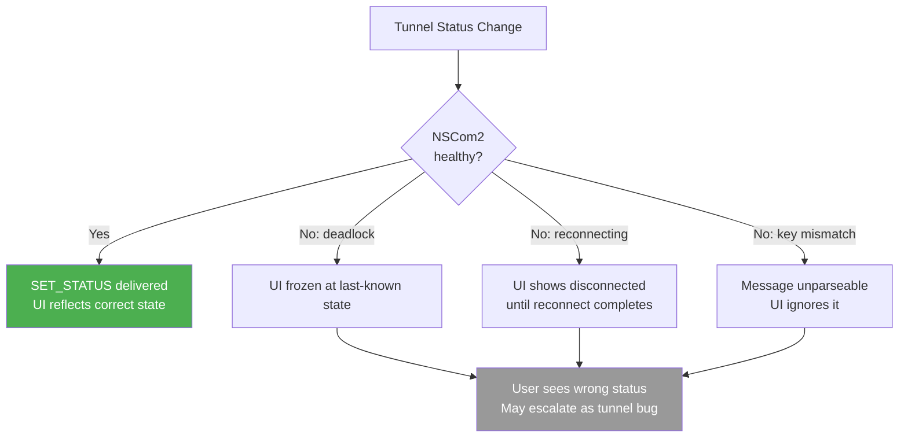

### IPC x FailClose

FailClose notifications (`NOTIFY_BLOCKED_APP`, `ENFORCE_ENROLL_FAILCLOSE_DROP`, `CAPTIVE_PORTAL_POPUP_REQUESTED`) are delivered via IPC. If IPC is down when FailClose activates, the user receives no visual indication that their traffic is being blocked. This is a critical UX gap -- the user's network stops working with no explanation.

### IPC x VDI Enrollment

The NSCom2 deadlock (ENG-591721) was originally reported as an enrollment failure in VDI environments. When new users attempt to enroll while existing sessions are active, the concurrent IPC operations (handshake for new client + broadcast to existing clients) can trigger the ABBA deadlock, preventing the new user from completing enrollment.

### Cross-Flow Risk Matrix (Chapter-Relevant)

| Interaction | Risk Level | Known Bugs | Impact |
|-------------|-----------|------------|--------|
| IPC x Tunnel Management | 🔴 High | ENG-917549 | UI shows wrong tunnel state |
| IPC x VDI Multi-User | 🔴 High | ENG-591721, ENG-918131, ENG-753965 | All users lose IPC, enrollment stuck |
| IPC x FailClose | 🟡 Medium | None confirmed | User not notified of traffic block |
| IPC x NPA Reauth | 🟡 Medium | ENG-885394 | Reauth window storm during sleep |
| IPC x Power Resume | 🟡 Medium | None confirmed | UI disconnected for up to 120s |
| IPC x Config Update | 🟢 Low | None confirmed | Config sync notification delayed |

## Appendix A: Bug Quick Reference

All bugs with IPC relevance found in the escalation bug database. Each bug is verified in `bugs/*.md`.

| Bug ID | Summary | Platform | Root Cause | Severity | Source |
|--------|---------|----------|------------|----------|--------|
| ENG-591721 | NSComs multi-user deadlock -- NSCom2 module cannot accept internal communication connection in VDI; ABBA lock ordering between deleteClientConn() and sendMsg() | Windows | Lock ordering conflict between m_deleteClientLock and m_writefdsetLock in concurrent disconnect + broadcast | S2 | bugs/install_upgrade.md #23 |
| ENG-753965 | Incorrect session ID used for steering bypass -- user re-login generates new session ID but NSClient cache not updated, causing packet misdirection | Windows | Session ID cache not refreshed on user re-login with different session ID | S2 | bugs/steering.md #72 |
| ENG-885394 | NPA re-auth window refreshes unexpectedly during macOS Dark Wake -- repeated NPA_REAUTH_SESSION_REFRESH IPC event firing | macOS | NPA reauth timer fires during Dark Wake; XPC call stalls; window cancelled before user input; cycle repeats | S3 | bugs/tunneling.md #48 |
| ENG-917549 | Android UI stuck in CONNECTING state after WiFi-to-mobile-data switch -- tunnel state not sent to UI after tunnel manager stopped | Android | Tunnel manager stops before sending final tunnel state update to UI via IPC | S2 | bugs/steering.md #86, bugs/tunneling.md #50 |
| ENG-918131 | Multi-session VDI SWG traffic broken intermittently -- tunnel building delayed ~20s when multiple users logon simultaneously | Windows | Concurrent multi-user logon causes IPC/tunnel establishment contention, 20s delay | S2 | bugs/steering.md #87, bugs/tunneling.md #51 |

---

## Appendix B: Methodology

### Severity Rating

| Level | Label | Definition | Impact Scope |
|---|---|---|---|
| **S1** | Critical | Complete network outage or security mechanism failure | All users, immediate impact |
| **S2** | High | Core functionality anomaly affecting connectivity | Most users affected under specific conditions |
| **S3** | Medium | Partial functionality failure or performance issue | Specific scenarios, workaround available |
| **S4** | Low | UI/Log anomaly or edge case | Few users, does not affect core functionality |
| **S5** | Enhancement | Feature improvement request | Not a bug, improves experience |

### Test Case Format

| Field | Description |
|---|---|
| **ID** | TC-17-NN format |
| **Severity** | S1-S5 |
| **Auto Priority** | P1 (must automate) / P2 (should automate) / P3 (manual OK) |
| **Gap Type** | Regression / Day-1 / Test Gap / Corner Case |

### Gap Type Taxonomy

| Type | Definition |
|---|---|
| **Regression** | Previously working, broken by code change |
| **Day-1** | Never worked correctly since initial implementation |
| **Test Gap** | No test case exists for this scenario |
| **Corner Case** | Edge case difficult to reproduce in standard test environments |

### Bug Classification Criteria for IPC Chapter

A bug was included in this chapter if it met any of these criteria:
1. Root cause is in `lib/nscom2/` or `lib/nsmsg2/` code
2. The bug involves NSCom2 session routing, handshake, or connection lifecycle
3. The bug involves IPC message delivery failure (message not sent, sent to wrong recipient, or delivered in degraded state)
4. The bug's symptom is a UI-service state mismatch caused by IPC timing or delivery

---

## Troubleshooting

### Common Problem 1: UI Shows Disconnected but Service is Running

**Symptoms**: Tray icon shows error/disconnected state, but `nstclient status` shows the service is running and tunnel is connected.

**Diagnosis**:
```bash
# Check if NSCom2 server is listening
grep -i "nscom2 server started" nsdebuglog.log

# Check for client connection failures
grep -i "client socket connect failed\|DoHandshakefromClient failed" nsdebuglog.log

# Check for encryption key mismatch
grep -i "failed to get unique id\|failed to get salt\|encrypt data not found" nsdebuglog.log
```

**Root Cause**: Often occurs after system wake from sleep when the TCP connection is stale. The UI's client thread retries every 10 seconds, but if the server socket is also stale, both sides may need to restart.

### Common Problem 2: nsdiag Cannot Connect to Service

**Symptoms**: `nsdiag` prints "Failed to connect with Service."

**Diagnosis**:
```bash
# Check if service is running
# Windows: sc query stAgentSvc
# macOS: launchctl list | grep netskope
# Linux: systemctl status netskope-stagent

# Check for port conflicts on Windows/macOS
netstat -an | grep 57130
```

**Root Cause**: The service NSCom2 server is not started (service not initialized yet), or another process is occupying port 57130.

### Common Problem 3: Multi-User Session Confusion (VDI)

**Symptoms**: Status updates go to the wrong user session, or one user's enable/disable affects another.

**Diagnosis**:
```bash
# Check which sessions are registered
grep -i "addSession\|getSessionID\|onNSCom2NewClient" nsdebuglog.log

# Check message routing
grep -i "message.*sent from server to" nsdebuglog.log

# Check for the deadlock bug
grep -i "NSCom.*deadlock\|m_deleteClientLock" nsdebuglog.log
```

### Log Keywords

| Keyword | Meaning |
|---------|---------|
| `nscom2 server started` | Server listener bound and accepting |
| `nscom2 client started` | Client thread spawned |
| `nscom2ready signalled` | Client handshake complete |
| `received client connection from` | New client accepted (Linux) |
| `client app name is` | Client validation result |
| `invalid client connection from` | Client rejected by allowlist |
| `message.*sent from server to` | Message routed from service |
| `received msg.*from client` | Message received by service |
| `Connection closed by client` | Client socket closed |
| `ping sent failed` | Keepalive failed, connection dead |
| `Not enough buffer` | Incoming message exceeds 10KB buffer |
| `failed to get unique id` | AES key derivation failed |
| `encrypt data not found` | Decryption failed (BWAN plaintext fallback) |
| `Caching system power up event` | Windows power resume NSCom reconnect |

---

## Related Chapters

- [01_installation.md](01_installation.md) -- IPC deadlock affects VDI enrollment (ENG-591721)
- [03_service_lifecycle.md](03_service_lifecycle.md) -- IPC (NSCom2 server) is initialized during `onServiceStarted()`
- [06_client_status.md](06_client_status.md) -- Status messages (`SET_STATUS`, `GET_STATUS`) flow over NSCom2
- [07_tunnel_management.md](07_tunnel_management.md) -- Tunnel status notifications between Service and UI
- [11_failclose.md](11_failclose.md) -- FailClose notifications (`ENFORCE_ENROLL_FAILCLOSE_DROP`, `CAPTIVE_PORTAL_POPUP_REQUESTED`) sent via IPC
- [14_proxy_management.md](14_proxy_management.md) -- Proxy credential exchange (`SET_PROXY_CREDS`, `PROXY_CREDS_REQUIRED`) via IPC
- [15_npa_integration.md](15_npa_integration.md) -- NPA IdP provisioning and re-auth messages (ENG-885394)
- [20_supportability.md](20_supportability.md) -- nsdiag uses IPC for diagnostics, packet capture, and debug mode
