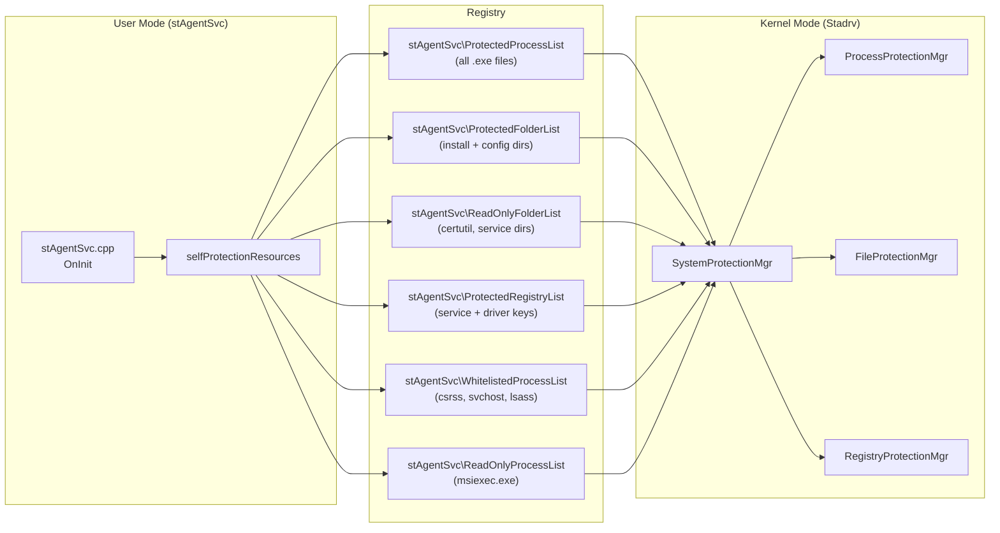
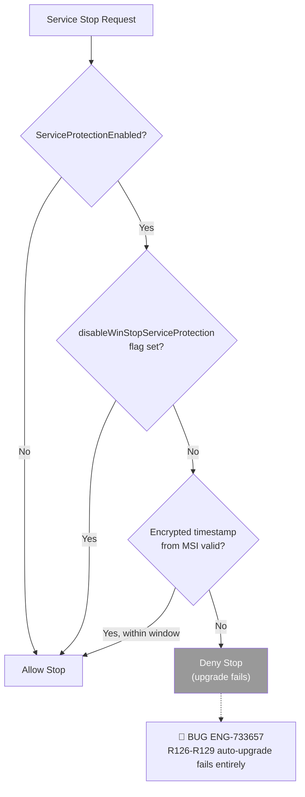
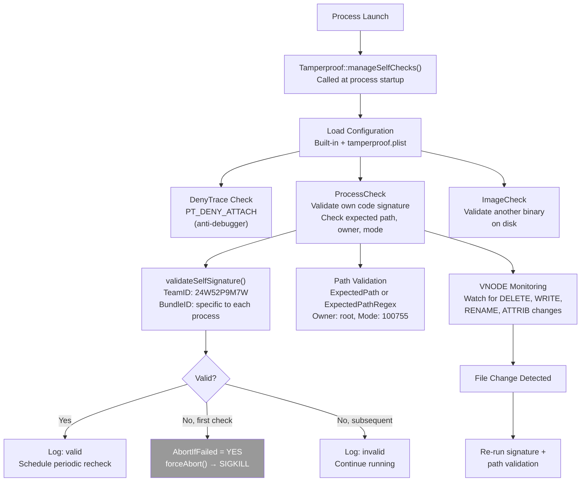
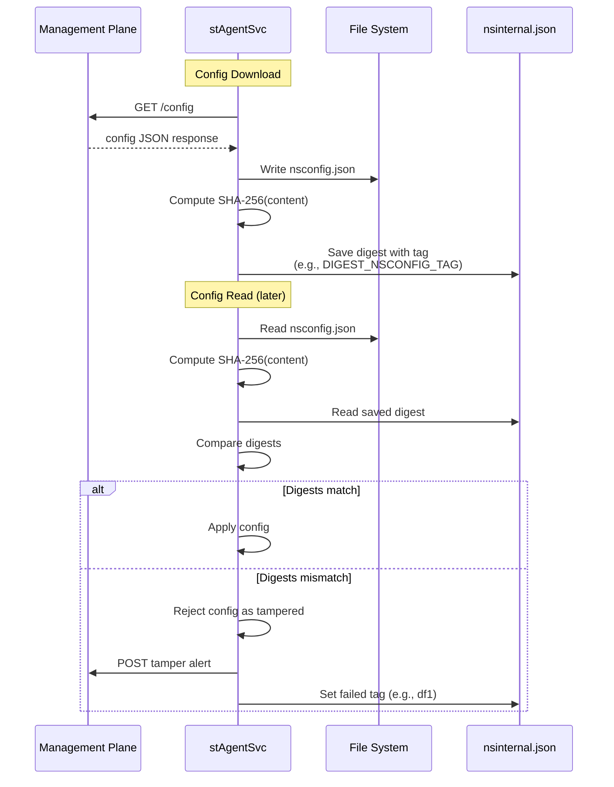
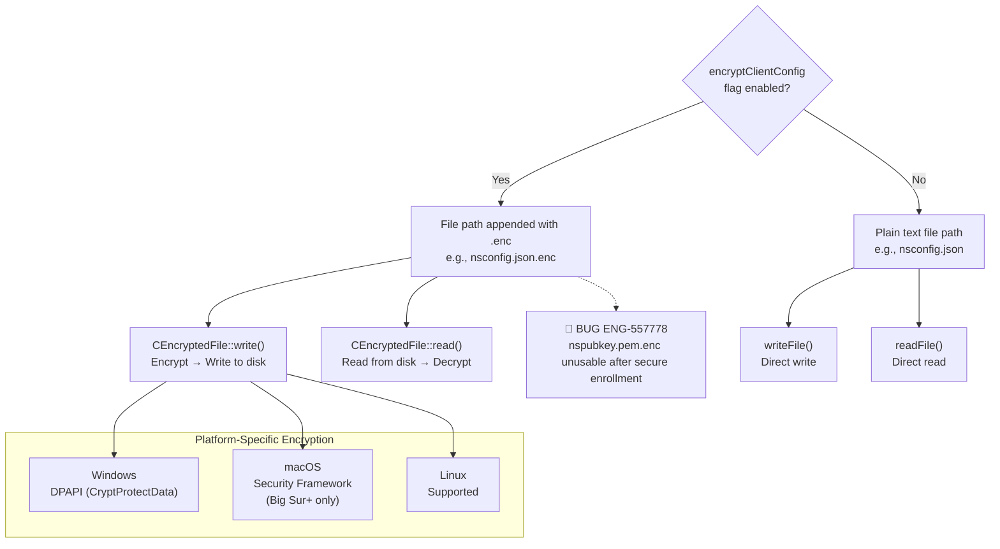
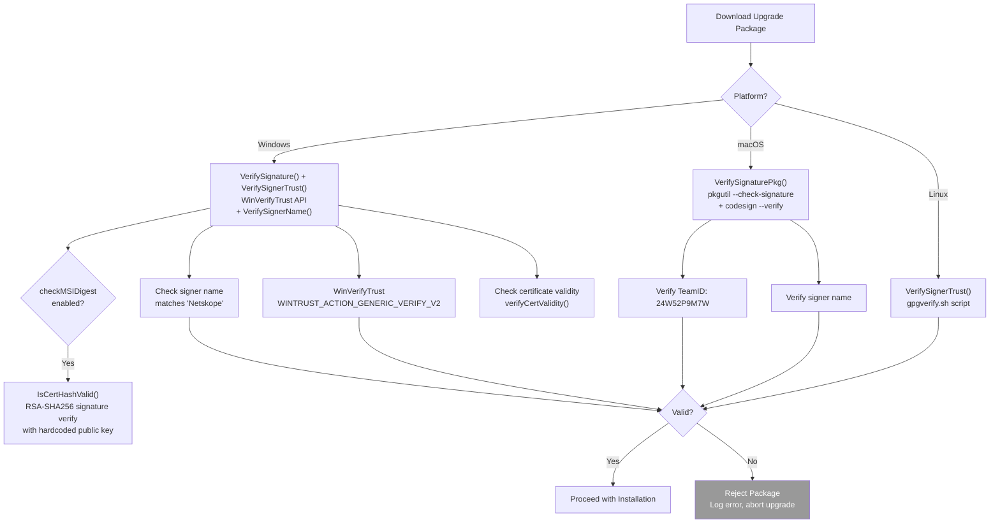
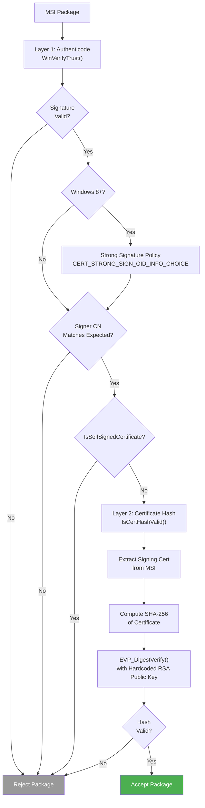
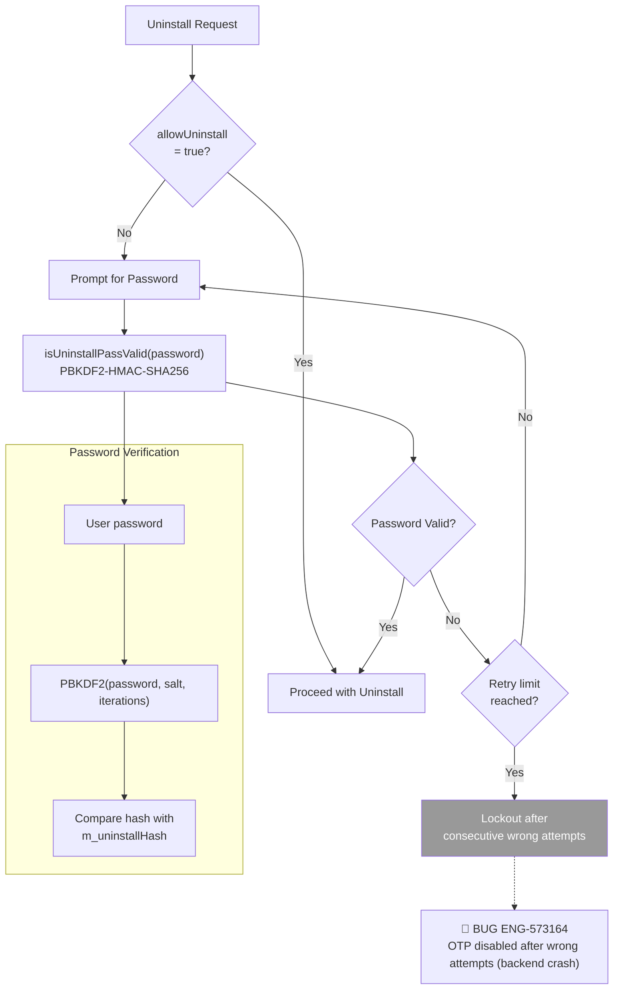
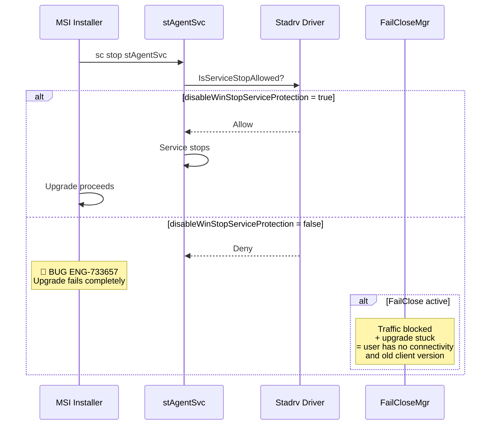

# 18. Security Mechanisms

**Escalation Bug Count**: 11 | **Day-1**: 4 (44%) | **Test Gap**: 3 (33%) | **Regression**: 1 (11%) | **Corner Case**: 2 (22%)

📋 **[Test Cases — Google Sheet](https://docs.google.com/spreadsheets/d/1ackCZ-EcepXw1BkSGoi5Go9Ex1I72-fXqcqLGMGiuio/edit?gid=1855178218#gid=1855178218)**

> This chapter covers NSClient's security features: self-protection (tamperproof), config integrity verification, package signing, config encryption, and uninstall protection. These layers work together to prevent unauthorized modification, ensure authentic configuration, and protect the client from removal. Each flow is illustrated with mermaid diagrams annotated with known escalation bug failure points (🔴 red) and predicted risk points (🟡 yellow).

---

## Overview

NSClient implements a defense-in-depth strategy with five security layers:

1. **Self-Protection (Tamperproof)** -- Prevents unauthorized termination, modification, or debugging of the client process, driver, files, and registry keys
2. **Config Integrity (Digest Verification)** -- Detects local tampering of config files via SHA-256 digests stored in `nsinternal.json`
3. **Package Signing** -- Verifies upgrade packages are authentically signed by Netskope before installation
4. **Config Encryption** -- Encrypts config files at rest (`.enc` files) so they cannot be read or modified by local tools
5. **Uninstall Protection** -- Requires admin password or OTP to uninstall, with lockout on wrong attempts

The interaction between self-protection and the upgrade flow is the highest-risk area. When self-protection is enabled, the service cannot be stopped -- including by the MSI installer during an upgrade. The `disableWinStopServiceProtection` flag (ENG-733657) was introduced as a workaround, but tenants that do not set this flag experience complete upgrade failure.

**Known Escalation Bugs**:

| Bug ID | Summary | Severity |
|---|---|---|
| **ENG-487939** | Self-Protection blocks service stop during upgrade | S2 |
| **ENG-733657** | `disableWinStopServiceProtection` flag required post-R125 | S2 |
| **ENG-557778** | `nspubkey.pem.enc` unusable after secure enrollment | S2 |
| **ENG-573164** | OTP disabled after consecutive wrong attempts | S3 |

---

## Self-Protection Architecture

Self-protection uses a different mechanism on each platform. On Windows, the kernel-mode driver (`Stadrv`) intercepts process, file, and registry operations at the OS level. On macOS, the `nsTamperproof` library uses Apple's Code Signing framework and VFS monitoring to validate process integrity at runtime. On Linux, protection relies on standard POSIX file permissions and systemd service hardening.

The following diagram shows what each platform protects and the mechanism used.

```mermaid
graph TB
    subgraph "Self-Protection Layers"
        SP[Self-Protection Manager]
        
        subgraph "Windows — Kernel Driver (Stadrv)"
            W_PROC[Process Protection<br/>Prevent termination of<br/>stAgentSvc, stAgentUI, EPDLP]
            W_FILE[File Protection<br/>Prevent modification of<br/>install dir and config dir]
            W_REG[Registry Protection<br/>Prevent modification of<br/>service and driver keys]
            W_SCM[SCM Protection<br/>Prevent service stop<br/>via SERVICE_CONTROL_PROTECTED_STOP]
        end
        
        subgraph "macOS — nsTamperproof Library"
            M_SIGN[Code Signature Check<br/>Verify TeamID 24W52P9M7W<br/>on self and image files]
            M_TRACE[Anti-Debug<br/>PT_DENY_ATTACH<br/>ptrace denial]
            M_VNODE[VFS Monitoring<br/>DISPATCH_VNODE events<br/>detect file changes]
            M_PERM[File Permissions<br/>Root-owned, mode 0755<br/>path validation]
        end
        
        subgraph "Linux — OS-Level"
            L_PERM[File Permissions<br/>Root:root ownership<br/>on config and binary dirs]
            L_SYSD[systemd Protection<br/>Service restart policy<br/>ProtectSystem, NoNewPrivileges]
            L_GPG[GPG Verification<br/>gpgverify.sh for<br/>upgrade packages]
        end
    end
    
    SP --> W_PROC
    SP --> W_FILE
    SP --> W_REG
    SP --> W_SCM
    SP --> M_SIGN
    SP --> M_TRACE
    SP --> M_VNODE
    SP --> M_PERM
    SP --> L_PERM
    SP --> L_SYSD
    SP --> L_GPG

    W_SCM -.-> BUG_487939["🔴 BUG ENG-487939<br/>Self-Protection blocks service stop during upgrade"]
    W_SCM -.-> BUG_733657["🔴 BUG ENG-733657<br/>disableWinStopServiceProtection required post-R125"]
    W_PROC -.-> BUG_925885["🔴 BUG ENG-925885<br/>PSIRT: IOCTL anti-tamper bypass"]
    W_FILE -.-> BUG_718773["🔴 BUG ENG-718773<br/>Protected folder access via Save Logs dialog"]
    W_FILE -.-> BUG_842447["🔴 BUG ENG-842447<br/>NSC crashing deleting user cert<br/>and SE tokens (config encryption)"]
    W_FILE -.-> BUG_873979["🔴 BUG ENG-873979<br/>NSClient disabled on machines<br/>including config encryption issue"]
    M_PERM -.-> BUG_690881["🔴 BUG ENG-690881<br/>macOS admin can uninstall with password protection"]
    SP -.-> BUG_619728["🔴 BUG ENG-619728<br/>Open Redirect leading to<br/>Man-in-the-Middle Attack"]
```



### Self-Protection Node Risk Assessment

| Node | Risk | Assessment |
|---|---|---|
| SCM Protection (Windows) | 🔴 Critical | **ENG-487939**, **ENG-733657** — Self-protection blocks upgrade; requires `disableWinStopServiceProtection` flag |
| Process Protection (Windows) | 🔴 Critical | **ENG-925885**, **ENG-925887** — PSIRT: IOCTL bypass disables anti-tamper |
| File Protection (Windows) | 🔴 High | **ENG-718773** — "Save Logs" dialog allows navigation into protected folders |
| File Permissions (macOS) | 🔴 High | **ENG-690881** — macOS admin-level user can bypass uninstall password |
| Code Signature (macOS) | 🟡 Medium | Predicted: tamperproof checks disabled by default in built-in config |
| GPG Verification (Linux) | 🟡 Low | Predicted: GPG key rotation may break upgrade verification |

### Config Flag

Self-protection is controlled by the `enableClientSelfProtection` flag in `nsconfig.json`:

```json
{
  "clientConfig": {
    "enableClientSelfProtection": true
  }
}
```

When the flag changes, the service notifies the driver (Windows) or reconfigures protection (macOS). The flag is read from `config.cpp::readConfigFile()` and persisted locally.

**Pseudo Code**:

```cpp
// lib/nsConfig/config.cpp
void CConfig::updateAdminSettings(ptree &pt) {
    bool enableSelfProtection = pt.get<bool>(ENABLE_SELF_PROTECTION, false);
    if (enableSelfProtection != m_enableSelfProtection) {
        m_enableSelfProtection = enableSelfProtection;
        writeToConfigFile(CLIENT_CONFIG ENABLE_SELF_PROTECTION, m_enableSelfProtection);
        // Notify driver/service to update protection state
        m_configNotify->onClientAllowServiceStop(m_allowUninstall);
    }
}
```

---

## Windows Self-Protection

Windows self-protection is the most comprehensive implementation, operating at both kernel level (driver) and user level (service).

### Driver-Level Protection (Stadrv)

The `Stadrv` kernel-mode driver implements three protection managers that are loaded from registry at driver init:

| Manager | Class | What It Protects |
|---|---|---|
| **ProcessProtectionMgr** | `stAgent/stadrv/stadrv6x/selfprotection/` | Prevents termination or debugging of Netskope processes |
| **FileProtectionMgr** | `stAgent/stadrv/stadrv6x/selfprotection/` | Prevents write/delete/rename of protected folders |
| **RegistryProtectionMgr** | `stAgent/stadrv/stadrv6x/selfprotection/` | Prevents modification of service/driver registry keys |

The `SystemProtectionMgr` class (`stAgent/stadrv/stadrv6x/selfprotection/SystemProtectionMgr.h`) coordinates all three managers and exposes the overall `SelfProtectionStatus` enum:

```cpp
enum SelfProtectionStatus : ULONG {
    Disabled = 0,
    Enabled = 1
};
```

### Registry-Based Configuration

The service writes protection lists to registry keys that the driver reads at startup. This design allows the service to dynamically update what is protected without reloading the driver.



The protected resource registration is shown in the diagram above. Resources include certutil (ReadOnly), service directory (ReadOnly + IncludingExecutables), config directory (Default), BWAN and EPDLP paths (ReadOnly + IncludingExecutables).

The `ProtectedFlags` enum controls what level of protection each path receives:

| Flag | Value | Effect |
|---|---|---|
| `Default` | 0 | Block all writes and deletes |
| `ReadOnly` | 1 | Allow read, block write/delete |
| `IncludingExecutables` | 2 | Also enumerate all `.exe` files and add to protected process list |

**Protected Registry Keys** (hardcoded in `selfProtectionResources::addProtectedRegistries()`):

- `HKLM\SYSTEM\CurrentControlSet\Services\stAgentSvc`
- `HKLM\SYSTEM\CurrentControlSet\Services\Stadrv`
- `HKLM\SOFTWARE\Netskope`
- `HKLM\SOFTWARE\WOW6432Node\Netskope`
- `HKLM\SYSTEM\CurrentControlSet\Services\epdlp`
- `HKLM\SYSTEM\CurrentControlSet\Services\epdlpdrv`
- `HKLM\SYSTEM\CurrentControlSet\Services\epdlp_dev_ctrl`

**Whitelisted Processes** (allowed to interact with protected resources):

- `csrss.exe`, `svchost.exe`, `services.exe`, `lsass.exe` (system processes)
- `msiexec.exe` (read-only access for upgrades)

### Service-Level Protection (SCM)

On Windows, the service implements `SERVICE_CONTROL_PROTECTED_STOP` -- a custom control code that only the service itself can process. External `sc stop stAgentSvc` calls are blocked when protection is enabled.

The decision flow for whether to allow service stop:



The service stop decision logic (protection enabled check → feature flag bypass → encrypted timestamp window) is fully captured in the flowchart above.

### Self-Protection Status Caching at Logoff

When a user logs off, the service caches the self-protection status in the driver's registry so that the driver can re-enable protection after a reboot before the service starts:

```cpp
// On WTS_SESSION_LOGOFF
if (config.getSelfProtectionEnabled()) {
    addRegValueDWord(HKEY_LOCAL_MACHINE,
        "System\\CurrentControlSet\\Services\\Stadrv\\Instances\\stAgentSelfProtection",
        "SelfProtectionStatus", 1);
}
```

### The disableWinStopServiceProtection Problem (ENG-733657)

Post-R125, self-protection prevents the service from being stopped during upgrades. The MSI installer calls `sc stop stAgentSvc`, which is blocked by the driver. The `disableWinStopServiceProtection` flag was added as a backend config option:

```json
{
  "clientConfig": {
    "disableWinStopServiceProtection": true
  }
}
```

When this flag is `true`, the SCM stop check bypasses self-protection. Without this flag, R126 to R129 auto-upgrades fail entirely. This is the root cause of ENG-733657.

---

## macOS Self-Protection (nsTamperproof)

macOS uses the `nsTamperproof` library (`lib/nsTamperproof/`) which provides code signature validation, anti-debugging, and VFS event monitoring.

### Architecture



### Protected Processes

Each Netskope process has its own tamperproof configuration defined in `lib/nsTamperproof/Launcher.mm`:

| Process | Expected Path | Owner | Mode | DenyTrace |
|---|---|---|---|---|
| **nsdiag** | `/Library/Application Support/Netskope/STAgent/nsdiag` | root(0) | 100755 | No |
| **nsAuxiliarySvc** | `/Applications/Netskope Client.app/Contents/XPCServices/nsAuxiliarySvc` | root(0) | 100755 | No |
| **NetskopeClientMacAppProxy** | `/Library/SystemExtensions/.../NetskopeClientMacAppProxy` (regex) | root(0) | 100755 | No |
| **Netskope Client** (UI) | `/Applications/Netskope Client.app/Contents/MacOS/Netskope Client` | root(0) | 100755 | No |

Note: In the built-in configuration, `Enabled` is set to `NO` for all checks. This can be overridden by the `tamperproof.plist` file at `/Library/Application Support/Netskope/STAgent/tamperproof.plist` (must be root-owned, mode 0644 or 0444).

### Code Signature Validation

The signature requirement string uses Apple's Code Signing API:

```objc
// For Netskope-signed binaries
@"anchor apple generic and "
@"identifier \"%@\" and "
@"certificate leaf[subject.OU] = \"24W52P9M7W\""

// For Apple-signed binaries
@"anchor apple and "
@"identifier \"%@\""
```

Validation uses `SecCodeCheckValidityWithErrors()` for the running process and `SecStaticCodeCheckValidityWithErrors()` for on-disk images, with `kSecCSStrictValidate` flag.

### VNODE File Monitoring

When monitoring is enabled, the library sets up `DISPATCH_SOURCE_TYPE_VNODE` monitors on all directories from the monitoring root to the protected file. It watches for:

- `DISPATCH_VNODE_DELETE` -- File or directory deleted
- `DISPATCH_VNODE_WRITE` -- File content modified
- `DISPATCH_VNODE_RENAME` -- File or directory renamed
- `DISPATCH_VNODE_ATTRIB` -- File attributes changed
- `DISPATCH_VNODE_REVOKE` -- File access revoked

On any change detection, the signature check is re-run with rate limiting (minimum 1.0 second between checks).

### macOS SIP and MDM Interaction

macOS System Integrity Protection (SIP) provides an additional layer:
- System Extensions under `/Library/SystemExtensions/` are managed by macOS and cannot be modified even by root
- The UI app at `/Applications/Netskope Client.app/` is protected by SIP if installed via MDM
- Uninstall via MDM requires the MDM profile to be removed first

---

## Linux Self-Protection

Linux self-protection is simpler than Windows and macOS, relying on standard POSIX mechanisms.

### File Permission Protection

| Path | Owner | Permissions | Purpose |
|---|---|---|---|
| `/opt/netskope/stagent/` | root:root | 755 | Binary installation directory |
| `/opt/netskope/stagent/data/` | root:root | 700 | Config files directory |
| `/opt/netskope/stagent/scripts/` | root:root | 755 | Utility scripts |

### systemd Service Protection

The `stAgentSvc` service is registered as a systemd unit with restart-on-failure. Key properties:
- `Restart=on-failure` -- Auto-restart if process dies unexpectedly
- `RestartSec=5` -- Wait 5 seconds before restart
- Service start type prevents non-root users from stopping it

### Package Verification

Linux uses GPG signature verification for upgrade packages via `/opt/netskope/stagent/scripts/gpgverify.sh`. The `VerifySignerTrust()` function on Linux delegates entirely to this script:

```cpp
// lib/nsUtils/sign.cpp (Linux implementation)
bool VerifySignerTrust(const wstring& filename, bool useStrongHash) {
    string verify_sh = "/opt/netskope/stagent/scripts/gpgverify.sh ";
    verify_sh += runfile;
    string outfile;
    if (ExecCommand(verify_sh, outfile, false)) return true;
    else return false;
}
```

---

## Config Integrity (Digest Verification)

NSClient verifies config file integrity using SHA-256 digests stored in `nsinternal.json`. Every time a config file is downloaded or written, its digest is computed and saved. When the file is later read, the digest is recomputed and compared.

### Digest Flow



### Protected Config Files

Each config file has a corresponding digest tag:

| Config File | Digest Tag | Failed Tag | Alert Message |
|---|---|---|---|
| `nsconfig.json` | `DIGEST_NSCONFIG_TAG` | (inline check) | Config tampered |
| `nssteering.json` | `DIGEST_NSDOMAIN_TAG` | `df1` | `DOMAIN_LIST_TAMPERED_MSG` |
| `nsbypass.json` | `DIGEST_NSBYPASS_TAG` | `df2` | `BYPASS_LIST_TAMPERED_MSG` |
| `nsexception.json` | `DIGEST_NSEXCEPTION_TAG` | `df3` | Exception list tampered |
| `eventcache.json` | `DIGEST_EVENTCACHE_TAG` | (per-instance) | Event cache tampered |

### Digest Validation Logic

The read/validate/write cycle (read → SHA-256 → compare with stored digest; write → compute SHA-256 → save digest) is visualized in the sequence diagram above.

### Tamper Detection and Reporting

When tampering is detected, the client:
1. Sets a `df*` failed tag in `nsinternal.json`
2. On the next successful connection to MP, posts a tamper alert message
3. Resets the failed tag after successful reporting
4. Attempts to re-download the config from MP

```cpp
// lib/nsConfig/config.cpp
// After failed steering config digest check
if (err == SteeringConfig::ErrorCode::TamperedFile) {
    setIntJsonValue(DIGEST_NSDOMAIN_FAILED_TAG, true);
}

// On next config cycle, report if pending
if (getIntJsonValue(DIGEST_NSDOMAIN_FAILED_TAG)) {
    if (postLogMsg(DOMAIN_LIST_TAMPERED_MSG)) {
        setIntJsonValue(DIGEST_NSDOMAIN_FAILED_TAG, false);
    }
}
```

### Digest vs Config Encryption

When config encryption is enabled (`encryptClientConfig` flag), digest validation is skipped because the encryption itself provides integrity protection. This is visible in the steering config:

```cpp
// lib/nsConfig/SteeringConfig.cpp
if (!m_useDevConfig && !m_configSec.configEncryptionEnabled()
    && !validateDigest(m_dataPath, configPath, DIGEST_NSDOMAIN_TAG)) {
    ns_error(module, "Failed to validate integrity of steering config.");
    return ErrorCode::TamperedFile;
}
```

---

## Config Encryption

NSClient supports encrypting config files at rest. When enabled, files are stored with a `.enc` extension and encrypted/decrypted transparently by the `CConfigSec` class.

### Encryption Architecture



### CConfigSec Class

The `CConfigSec` class (`lib/nsConfig/nsConfigSec.h`) abstracts encrypted vs plaintext config I/O:

```cpp
class CConfigSec {
public:
    void setConfigEncryption(bool encryptConfig, ...);
    bool readConfigFile(const wstring &configFilePath, string &content, bool readAny = false);
    bool writeConfigFile(const wstring &configFilePath, const string &content);
    
    string getPath(const string &pathStr) {
        if (configEncryptionEnabled()) {
            return pathStr + ".enc";
        }
        return pathStr;
    }
    
    bool configEncryptionEnabled() {
#if defined(WIN32) || defined(__APPLE__) || defined(__LINUX__)
#ifdef __APPLE__
        if (!bigSurOrAbove()) return false;  // macOS: only Big Sur+
#endif
        return m_encryptConfig;
#else
        return false;  // Mobile: not supported
#endif
    }
    
private:
    bool m_encryptConfig = false;
    const vector<string> m_ignoredFiles = {
        "nsinternal.json",    // Digest file itself is not encrypted
        "nspubkey.pem",       // Log encryption public key
        "certutil.json",      // Firefox cert util
        "nsbranding.json",    // Branding must be readable pre-enrollment
        "nsenforceEnrollExceptions.json"
    };
};
```

### CEncryptedFile Class

The `CEncryptedFile` class (`lib/nsCrypto/nsEncryptedFile.h`) provides the actual encrypt/decrypt operations:

```cpp
class CEncryptedFile {
public:
    CEncryptedFile(const string path, bool perUser);
    
    bool read(string &plainText);     // Read + decrypt
    bool write(const string &plainText, bool safe = false);  // Encrypt + write
    
    string decrypt(const string &cryptText);  // Platform-specific decrypt
    string encrypt(const string &plainText);  // Platform-specific encrypt
};
```

### Branding Encryption

Branding files (`nsbranding.json`) have their own encryption flag (`EncryptBranding`) which is separate from config encryption:

```cpp
// lib/nsConfig/branding.cpp
bool isBrandingEncryptionEnabled(wstring brandingPath, string brandingJson) {
    // Case 0: Non-Windows platforms — disabled
    // Case 1: Already an encrypted file exists → enabled
    // Case 2: JSON contains "encryptbranding" : "true" → enabled
    // Case 3: Default → disabled
}
```

### Migration on Config Encryption Toggle

When `encryptClientConfig` is toggled, the `CConfigSec::setConfigEncryption()` method handles migration:
- **Enabling**: Reads all `.json` and `.pem` files, encrypts them, writes `.enc` files, deletes plaintext originals
- **Disabling**: Reads `.enc` files, decrypts them, writes plaintext files, deletes encrypted copies
- **Ignored files** (`nsinternal.json`, `nspubkey.pem`, etc.) are not encrypted

### ENG-557778: nspubkey.pem.enc

The `nspubkey.pem` file (log encryption public key) was incorrectly encrypted after secure enrollment, making it unusable for remote log collection. This was caused by the file not being in the ignored list in an earlier version. The fix added `nspubkey.pem` to `m_ignoredFiles`.

---

## Package Signing and Verification

Upgrade packages are verified before installation to prevent supply chain attacks. Each platform uses a different mechanism.

### Package Verification Flow



### Windows: Authenticode + Custom Certificate Verification



Windows package verification has two layers:

**Layer 1 -- Authenticode** (`lib/nsUtils/sign.cpp`):
- Uses `WinVerifyTrust()` with `WINTRUST_ACTION_GENERIC_VERIFY_V2` to verify the MSI is validly signed
- Optionally uses strong signature policy (`CERT_STRONG_SIGN_OID_INFO_CHOICE`) on Windows 8+
- Verifies the signer name matches expected CN

**Layer 2 -- Certificate Hash Verification** (`IsCertHashValid()`):
- Extracts the signing certificate from the MSI
- Computes SHA-256 of the certificate
- Verifies using `EVP_DigestVerify()` with a hardcoded RSA public key (`publicKeyForVerifyCertHash`)
- The digest is stored as an MSI property (`CERT_DIGEST`)

**Anti-Self-Signed Check**:
```cpp
// Reject self-signed certificates
if (IsSelfSignedCertificate(pCertContext)) {
    ns_error(module, "Certificate is self-signed.");
    break;
}
```

### macOS: pkgutil and codesign

macOS uses two system tools:

**Package Signature** (`VerifySignaturePkg()`):
```bash
pkgutil --check-signature "<package_path>"
# Must contain TeamID "24W52P9M7W" and expected signer name
```

**Code Signature** (`VerifySignerTrust()`):
```bash
codesign --verify "<binary_path>"
# Exit code 0 = valid signature
```

### Signature Data File (ctdata.bin)

In addition to package signing, NSClient downloads signature data files from the downloader service:
- `ctdata.bin` -- Signature data file
- `ctdataversion.json` -- Signature version

The signature file is validated via `validateSHA256Digest()`:

```cpp
// lib/nsConfig/config.cpp
if (!validateSHA256Digest(buffer_content, m_expectedSignatureChecksum)) {
    ns_error(module, "Checksum for downloaded signature file does not match");
    return false;
}
```

---

## Uninstall Protection

Uninstall protection prevents unauthorized removal of the client. It is controlled by two config settings:

| Setting | JSON Path | Default | Effect |
|---|---|---|---|
| `allowUninstall` | `clientConfig.clientUninstall.allowUninstall` | `true` | When `false`, requires password to uninstall |
| Uninstall password | `clientConfig.clientUninstall.uninstallHash` / `uninstallSalt` | empty | PBKDF2 hash + salt for password verification |

### Uninstall Protection Flow



### Password Verification Implementation

The PBKDF2-HMAC-SHA256 password verification flow (hash input password → hex encode → compare against stored hash) is shown in the uninstall protection flowchart above.

### Platform-Specific Uninstall Flows

**Windows** (`stAgent/installer/win/nsInstallerHelper/CustomAction.cpp`):
- MSI Custom Action `CA_ValidateUninstallPassword` prompts for password
- If self-protection is enabled, service stop is also blocked (see SCM protection above)
- Password dialog is presented by the MSI installer UI

**macOS** (`stAgent/stAgentUI/osx/nsUIUtils/`):
- The `nsUIUtils` binary checks `allowUninstall` and prompts for password
- `InstallerUtil` runs the actual uninstall after password verification

**Linux** (`stAgent/installer/linux/installerutil/InstallerHelper.cpp`):
- `InstallerHelper::verifyUninstallPassword()` reads config and validates
- Command-line: `InstallerUtil --verifypassword <pwd>`

### OTP (One-Time Password) Disable

The OTP mechanism allows temporary disabling of the client by requesting a one-time password from the admin:

```json
{
  "clientConfig": {
    "clientOneTimeDisable": {
      "allowClientDisable": "otp",
      "clientDisableDuration": 3600,
      "allowNPADisable": "otp",
      "npaDisableDuration": 3600
    }
  }
}
```

When `allowClientDisable` is set to `"otp"`:
- The UI presents an OTP input field
- The user requests an OTP from the admin
- The OTP is validated via a backend API call
- If valid, the client is disabled for `clientDisableDuration` seconds

**ENG-573164**: The backend API (`addonman`) crashes when an incorrect payload is sent repeatedly. This causes OTP to become permanently disabled until the backend service restarts.

---

## Platform Differences

| Feature | Windows | macOS | Linux | iOS | Android |
|---|---|---|---|---|---|
| **Self-Protection** | Kernel driver (Stadrv) + SCM | Code signing + VNODE | File permissions + systemd | MDM-managed | Device admin |
| **Process Protection** | ProtectedProcessList (driver) | PT_DENY_ATTACH + signature | N/A | N/A | N/A |
| **File Protection** | ProtectedFolderList (driver) | VNODE monitoring + SIP | Root ownership | Sandbox | Sandbox |
| **Registry Protection** | ProtectedRegistryList (driver) | N/A | N/A | N/A | N/A |
| **Package Signing** | Authenticode + CERT_DIGEST | pkgutil + codesign | GPG verify script | App Store | Play Store |
| **Config Encryption** | DPAPI | Security Framework (Big Sur+) | Supported | Not supported | Not supported |
| **Uninstall Password** | MSI dialog | nsUIUtils prompt | CLI verify | MDM removal | Device admin |
| **OTP Disable** | UI + backend API | UI + backend API | CLI + backend API | UI + backend API | UI + backend API |
| **Anti-Debug** | Driver blocks termination | ptrace(PT_DENY_ATTACH) | N/A | N/A | N/A |

---

## Troubleshooting

### Self-Protection Blocking Upgrade

**Symptoms**: Auto-upgrade fails, service cannot be stopped, MSI installer hangs or reports error

**Diagnostic Steps**:
```bash
# Check if self-protection is enabled
grep -i "enableClientSelfProtection" nsconfig.json

# Check if the bypass flag is set
grep -i "disableWinStopServiceProtection" nsconfig.json

# Look for service stop failures
grep -i "service.*stop\|protection.*enabled\|ServiceProtectionEnabled" nsdebuglog.log

# Check driver self-protection status (Windows registry)
reg query "HKLM\SYSTEM\CurrentControlSet\Services\Stadrv\Instances\stAgentSelfProtection"
```

**Resolution**: Set `disableWinStopServiceProtection: true` in the tenant config via MP.

### Config Tampering Detected

**Symptoms**: Config files rejected, client re-downloads config, `df*` flags set

**Diagnostic Steps**:
```bash
# Check for tamper detection messages
grep -i "tamper\|integrity\|digest.*fail\|validation failed" nsdebuglog.log

# Check nsinternal.json for failed flags
cat nsinternal.json | grep "df"

# Check if config encryption is enabled (digests skipped when encrypted)
grep -i "encryptClientConfig" nsconfig.json
```

**Resolution**: Config will be automatically re-downloaded. If persistent, check for third-party security tools modifying config files.

### Package Signature Verification Failure

**Symptoms**: Upgrade package rejected, error in log about signature or signer name

**Diagnostic Steps**:
```bash
# Windows
grep -i "signature\|signer.*name\|CryptQueryObject\|WinVerifyTrust" nsdebuglog.log

# macOS
grep -i "pkgutil\|codesign\|24W52P9M7W\|signature.*verify" nsdebuglog.log

# Linux
grep -i "gpgverify\|signature\|VerifySignerTrust" nsdebuglog.log
```

### OTP Not Working (ENG-573164)

**Symptoms**: OTP field disabled in UI, backend returns error on OTP validation

**Diagnostic Steps**:
```bash
grep -i "OTP\|oneTimeDisable\|disableMode" nsdebuglog.log
```

**Resolution**: Backend `addonman` service may need restart. Check if `clientOneTimeDisable` is properly configured.

### Tamperproof Abort on macOS

**Symptoms**: Netskope process immediately crashes at launch with SIGKILL

**Diagnostic Steps**:
```bash
# Check tamperproof logs
log show --predicate 'subsystem == "netskope" AND category == "tamperproof"' --last 5m

# Check for abort logs
ls -la /Library/Logs/Netskope/abort-*.log
ls -la ~/Library/Logs/Netskope/abort-*.log

# Verify code signature manually
codesign --verify --deep --strict "/Applications/Netskope Client.app"
```

**Resolution**: Ensure the app bundle is not modified. Reinstall if signature is broken.

---

## Windows Platform Bugs

**Bug Count**: 6 | **Key Gaps**: Self-protection vs upgrade, PSIRT IOCTL, tamperproof bypass, config encryption

### Windows Confirmed Bug Mapping

| Flow Step | Known Bugs | Root Cause | Automation |
|---|---|---|---|
| SCM Service Stop | ENG-487939 (upgrade block) | Self-protection blocks service stop during upgrade | ⚠️ Partial (auto_upgrade/) |
| SCM Service Stop | ENG-733657 (flag required) | disableWinStopServiceProtection mandatory post-R125 | ⚠️ Partial (auto_upgrade/) |
| Driver IOCTL | ENG-925885 (PSIRT) | IOCTL anti-tamper bypass in stadrv | ❌ Not covered |
| Driver IOCTL | ENG-925887 (PSIRT) | Client disable via IOCTL bypass | ❌ Not covered |
| File Protection | ENG-718773 (Save Logs bypass) | "Save Logs" dialog navigates into protected folders | ❌ Not covered |
| Config Encryption | ENG-557778 (nspubkey.pem.enc) | nspubkey.pem encrypted after secure enrollment, breaks log collection | ❌ Not covered |

## macOS Platform Bugs

**Bug Count**: 1 | **Key Gap**: Admin uninstall bypass

### macOS Confirmed Bug Mapping

| Flow Step | Known Bugs | Root Cause | Automation |
|---|---|---|---|
| Uninstall Password | ENG-690881 (admin bypass) | macOS admin-level user can uninstall despite password protection | ❌ Not covered |

## Automation Coverage Summary

### Golden Regression Suite Mapping

| Test Directory | Test Count | Ch18 Concept | Coverage |
|---|---|---|---|
| `master_passcode/` | 1 | Master passcode protection | ⚠️ Partial |
| `otp/` | 2 | OTP disable mechanism | ⚠️ Partial |
| `uninstall_password/` | 1 | Uninstall password verification | ⚠️ Partial |
| `auto_upgrade/` | 2 | Self-protection vs upgrade (indirect) | ⚠️ Partial |

**Total**: 6 tests | **Coverage**: ⚠️ Partial — covers password/OTP flows but not driver security or tamper detection

### Coverage Gaps

| Gap Area | Impact | Priority |
|---|---|---|
| PSIRT IOCTL driver bypass | Attacker disables NSClient silently | P1 |
| Self-protection vs upgrade | Enterprise-wide upgrade failure | P1 |
| macOS admin uninstall bypass | Unauthorized removal | P1 |
| OTP backend crash | OTP permanently disabled | P1 |
| Config tamper detection | Steering config modified undetected | P2 |
| Package signature verification | Supply chain attack | P2 |
| File protection bypass via Save Logs | Protected files exposed | P2 |
| Config encryption ignored files | Remote log collection broken | P2 |

---

## Cross-Flow Interactions

Security mechanisms interact with installation, upgrade, FailClose, and config management in complex ways.

### Cross-Flow Risk Matrix

| Ch18 Area | Interacting Chapter | Risk | Known Bugs |
|---|---|---|---|
| Self-Protection ↔ Installation | [01_installation.md](01_installation.md) | 🔴 Critical | ENG-487939, ENG-733657 — upgrade blocked by self-protection |
| Self-Protection ↔ FailClose | [11_failclose.md](11_failclose.md) | 🔴 High | FailClose + self-protection + upgrade = compound failure |
| Config Encryption ↔ Supportability | [20_supportability.md](20_supportability.md) | 🔴 High | ENG-557778 — nspubkey.pem.enc breaks log collection |
| Config Digest ↔ Steering | [05_steering_config.md](05_steering_config.md) | 🟡 Medium | Tampered steering config bypasses security controls |
| IOCTL Security ↔ Traffic Steering | [09_traffic_steering.md](09_traffic_steering.md) | 🔴 Critical | ENG-925885/887 — driver IOCTL bypass also affects WFP |
| Package Signing ↔ Cert Management | [13_certificate_management.md](13_certificate_management.md) | 🟡 Medium | Certificate chain verification for upgrade packages |

### Cross-Flow Interaction: Self-Protection ↔ Upgrade ↔ FailClose

The most dangerous compound failure: when self-protection, FailClose, and auto-upgrade intersect. If self-protection blocks the service stop AND FailClose is active, the MSI installer cannot complete, the service cannot restart, and the user is stuck with an old version while FailClose blocks traffic.



## Appendix A: Bug Quick Reference

| Bug ID | Problem Summary | Root Cause | Platform | Type |
|---|---|---|---|---|
| **ENG-487939** | Self-protection blocks service stop during upgrade | SCM protection denies stop command | Windows | Regression |
| **ENG-557778** | nspubkey.pem.enc unusable after secure enrollment | File not in encryption ignored list | Windows | Test Gap |
| **ENG-573164** | OTP disabled after consecutive wrong attempts | Backend addonman API crash on malformed payload | All (Backend) | Test Gap |
| **ENG-619327** | Out-of-Bounds Read vulnerability (PSIRT) | Malformed DNS packet corrupts stack | Windows | Corner Case |
| **ENG-690881** | macOS admin can uninstall with password protection | CLI bypass of uninstall password check | macOS | Day-1 |
| **ENG-718773** | Tamperproof file protection bypass via Save Logs | UI dialog navigates into protected folders | Windows | Day-1 |
| **ENG-733657** | disableWinStopServiceProtection required post-R125 | Self-protection + FailClose + upgrade compound failure | Windows | Test Gap |
| **ENG-925885** | PSIRT: Anti-tamper IOCTL bypass in driver | Unauthorized IOCTL to stadrv disables protection | Windows | Day-1 |
| **ENG-925887** | PSIRT: Client disable via IOCTL bypass | Driver IOCTL vulnerability | Windows | Day-1 |
| [ENG-842447](https://netskope.atlassian.net/browse/ENG-842447) | [Bharat Heavy] NSC crashing deleting user cert and SE tokens. |
| [ENG-873979](https://netskope.atlassian.net/browse/ENG-873979) | [NPP][Corebridge Financial (SAFG)] NSClient is disabled on multiple machines inc |

---

## Appendix B: Methodology

### Severity Ratings

| Level | Description |
|---|---|
| **S1** | Security bypass, data leak, crash, or complete feature failure |
| **S2** | Significant functional issue affecting a common workflow |
| **S3** | Minor issue with workaround available |
| **S4** | Cosmetic or edge case with minimal impact |
| **S5** | Enhancement or optimization request |

### Gap Types

| Type | Description |
|---|---|
| **Regression** | Previously working feature broken by code change |
| **Day-1** | Feature never worked correctly since introduction |
| **Test Gap** | Insufficient test coverage for known risk area |
| **Corner Case** | Unusual configuration or environment not anticipated |

### Automation Priority

| Priority | Description |
|---|---|
| **P1** | Must automate — high-severity gap with customer impact |
| **P2** | Should automate — moderate risk, currently manual-only |
| **P3** | Nice to automate — low risk but improves coverage |

### Test Case Format

Each test case uses TC-XX-NN format where XX is the chapter number and NN is the sequential test ID. Fields include: Severity, Related Bugs (verified ENG-XXXXXX IDs from `bugs/*.md`), Flow Point (diagram node reference), Gap Type, Automation Priority, Preconditions, Steps, Expected Result, Failure Indicators (log grep patterns), and Risk if Untested.

---

## Related Chapters

- [01_installation.md](01_installation.md) -- Self-Protection interacts with upgrade flow (ENG-487939, ENG-733657)
- [04_config_download.md](04_config_download.md) -- Config digest verification on download
- [05_steering_config.md](05_steering_config.md) -- Steering config digest validation (TamperedFile error code)
- [09_traffic_steering.md](09_traffic_steering.md) -- Driver IOCTL security affects WFP traffic interception
- [11_failclose.md](11_failclose.md) -- FailClose + Self-Protection compound failure during upgrade
- [13_certificate_management.md](13_certificate_management.md) -- Package signature and certificate chain verification
- [20_supportability.md](20_supportability.md) -- Remote log collection depends on nspubkey.pem (ENG-557778)

---

**Chapter Summary**: NSClient's security mechanisms span five layers -- self-protection (driver-level on Windows, code signing on macOS, POSIX on Linux), config digest verification, package signing, config encryption, and uninstall password protection. The most critical known issues are the PSIRT IOCTL bypasses (ENG-925885, ENG-925887) that allow attackers to disable anti-tamper protection, and the self-protection vs upgrade conflict (ENG-733657) where the `disableWinStopServiceProtection` flag must be set for upgrades to succeed. The macOS tamperproof library provides sophisticated code signature validation with VFS monitoring and anti-debugging, though admin-level users can bypass uninstall protection (ENG-690881). Config integrity uses SHA-256 digests that are bypassed when config encryption is enabled, as encryption provides its own integrity guarantees.
