# 19. Multi-Component Integration Architecture

**Escalation Bug Count**: 11 | **Regression**: 4 (36%) | **Day-1**: 3 (27%) | **Test Gap**: 2 (18%) | **Corner Case**: 4 (36%)

📋 **[Test Cases — Google Sheet](https://docs.google.com/spreadsheets/d/1ackCZ-EcepXw1BkSGoi5Go9Ex1I72-fXqcqLGMGiuio/edit?gid=1986053253#gid=1986053253)**

> This chapter covers how NSClient operates as a platform hosting multiple Netskope endpoint security components. It documents the shared service process, driver resources, config callback mechanism, IPC channels, and per-platform integration details. Bug analysis maps 11 escalation bugs to integration failure points across BWAN driver conflicts, NPA coexistence issues, DEM data corruption, and config callback ordering.

---

## Overview

NSClient is not a single-purpose application. It is a **platform process** that orchestrates several independent security components, each of which has its own tunnel, config namespace, and lifecycle, but all of which share a single service process, a single packet filter driver, and a single IPC bus. Understanding this architecture is critical for grey box testing because the most severe integration bugs occur at the boundary between components: driver contention, config callback ordering, and shared state corruption.

The five components that run inside or alongside the NSClient platform are:

| Component | Full Name | Purpose | Runs Inside stAgentSvc? |
|-----------|-----------|---------|------------------------|
| **NSC (SWG)** | Netskope Secure Web Gateway | Steer web/cloud traffic to Netskope Cloud | Yes -- the core service itself |
| **NPA** | Netskope Private Access | Zero Trust access to private applications | Yes -- `CNpaTunnelMgr` is in-process |
| **EPDLP** | Endpoint Data Loss Prevention | Inspect and block sensitive data at the endpoint | No -- separate process, managed by `EpdlpSvcStub` |
| **BWAN** | Borderless WAN (Endpoint SD-WAN) | Route branch-office traffic through Netskope hubs | No -- separate services (`BwanClientManager`, `bwanClientSvc`) |
| **DEM** | Digital Experience Monitoring | Collect latency, hop, and availability probes | Yes -- `CDemMgr` is in-process |

The fundamental design decision is to keep traffic-handling components (NSC, NPA) in-process for low latency access to the shared `nsFilterDevice` driver, while running components that have their own driver requirements (EPDLP, BWAN) as separate services that stAgentSvc starts, stops, and monitors.

Of the 11 escalation bugs mapped to this chapter, the highest-risk areas are:

1. **BWAN + NSC driver contention** (ENG-625957, ENG-918295): WinDivert and WFP drivers capturing the same packets create DNS loops and NPA interception failures
2. **NPA coexistence after state changes** (ENG-773191, ENG-393015): NPA tunnel breaks after upgrade, network switch, or disable/enable cycles
3. **DEM data corruption from shared config** (ENG-637576, ENG-534944): Config callback sequencing causes tenant ID reset or stale timestamps
4. **Third-party driver conflicts** (ENG-805334, ENG-654108): VPN and AV drivers interacting with NSC's WFP callout in CFW mode

---

## Component Architecture (All Platforms)

The diagram below shows how the five components relate to the shared stAgentSvc process, the shared driver, and each other. Three confirmed bug clusters are annotated: the BWAN WinDivert driver conflict zone, the NPA coexistence zone after state changes, and the DEM config callback data integrity zone.

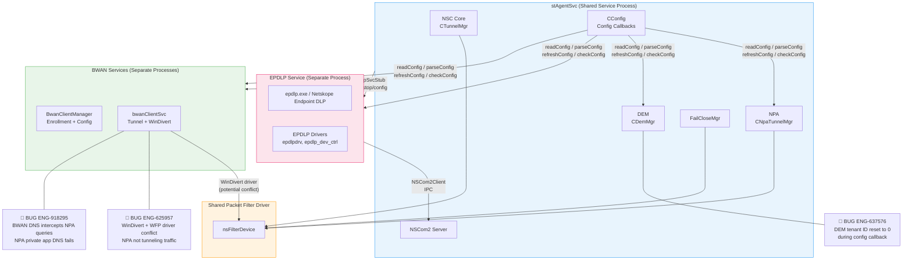

**Node Risk Assessment**:

| Node | Risk | Assessment |
|---|---|---|
| NSC Core (CTunnelMgr) | Medium | Core tunnel -- stable, but interacts with all other components |
| NPA (CNpaTunnelMgr) | High | **ENG-393015** crash on network switch; **ENG-773191** tunnel stops after upgrade |
| DEM (CDemMgr) | Medium | **ENG-637576** tenant ID reset; **ENG-534944** stale timestamps after upgrade |
| FailCloseMgr | Medium | Shared between NSC and NPA -- state conflicts possible |
| CConfig Callbacks | High | Sequential execution delays; all component config passes through here |
| NSCom2 Server | Low | Stable IPC bus; EPDLP and UI connect as clients |
| nsFilterDevice | High | Shared between NSC and NPA; contention with BWAN WinDivert |
| EPDLP Service | Medium | Bypass app registration timing risk; environment.json race condition |
| BWAN Services | High | **ENG-625957** WinDivert conflict; **ENG-918295** DNS query interception |
| bwanClientSvc + WinDivert | High | Driver-level conflict zone with WFP; DNS packet loop risk |

---

## Config Callback Architecture (All Platforms)

The `CConfigCallback` interface is the primary integration mechanism. Every component implements this interface and registers with `CConfig::registerConfigCallback()`. When config is read, parsed, or refreshed, CConfig iterates over `m_configCallbacks` and invokes each callback in registration order.

The DEM tenant ID corruption bug (ENG-637576) demonstrates why config callback ordering matters: during a secure enrollment token rotation, an error in the config update path caused the tenant ID to be reset to '0', which corrupted all subsequent DEM data submissions.

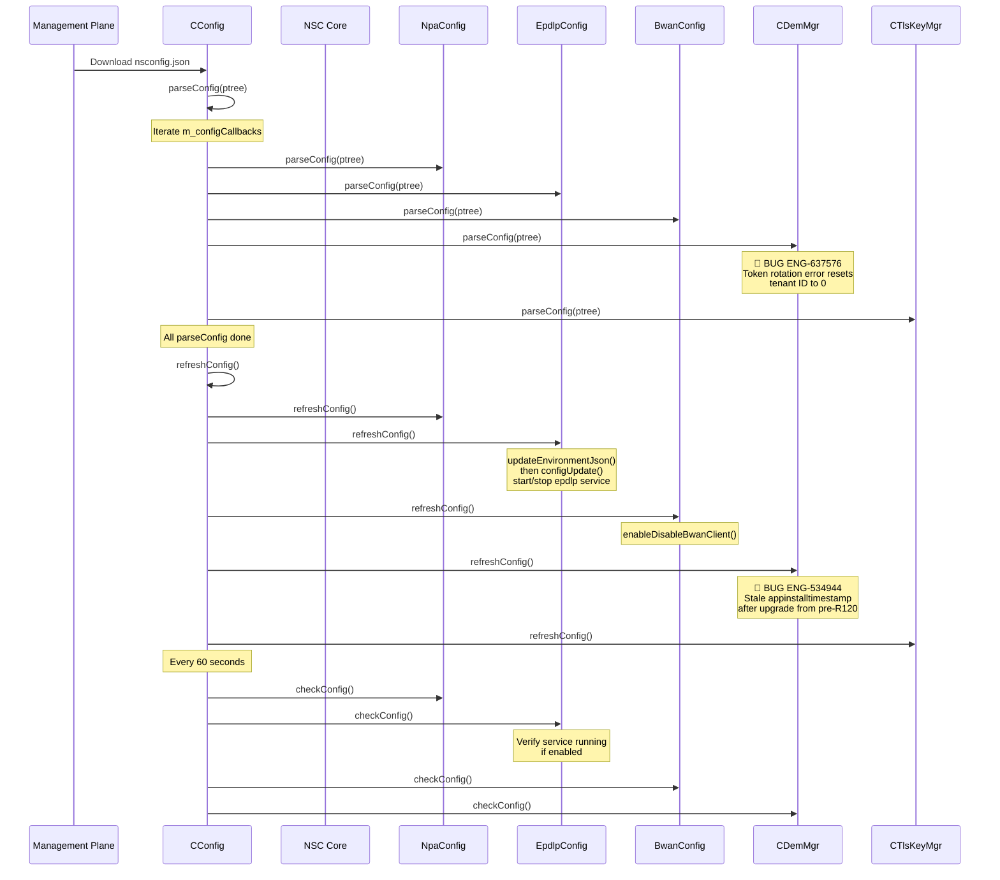

**CConfigCallback interface** (from `lib/nsConfig/config.h`):

```cpp
class CConfigCallback {
public:
    virtual bool readConfig(const boost::property_tree::ptree &pt) = 0;
    virtual bool parseConfig(const boost::property_tree::ptree &pt) = 0;
    virtual void refreshConfig() = 0;
    virtual bool updateConfig(boost::property_tree::ptree &pt) { return true; }
    virtual bool readSteeringConfig(const boost::property_tree::ptree &pt) { return true; }
    virtual void checkConfig() {}
    virtual void refreshDeviceClassificationStatus(uint32_t sessId) {}
    virtual void refreshUserConfig(uint32_t sessId) {}
};
```

The registration order across platforms (from `stAgentSvc::OnInit()`):

| Order | Component | Windows | macOS | Linux | Android |
|-------|-----------|---------|-------|-------|---------|
| 1 | NPA (`npaConfig`) | Yes | Yes | Yes | Yes |
| 2 | EPDLP (`m_epdlpSvc->getConfig()`) | Yes | Yes | No | No |
| 3 | BWAN (`m_bwanSvcConfig`) | Yes | Yes | Yes | No |
| 4 | DEM (`m_demMgr`) | Yes | Yes | Yes | Yes |
| 5 | TLS Key Mgr (`m_tlsKeyMgr`) | Yes | No | No | No |

**Confirmed Bug Mapping (Config Callbacks)**:

| Callback Step | Known Bugs | Root Cause | Automation |
|---|---|---|---|
| DEM parseConfig | ENG-637576 (tenant ID reset) | Token rotation error resets tenant ID to '0' during config update | ❌ Not covered |
| DEM refreshConfig | ENG-534944 (stale install timestamp) | Upgrade from pre-R120 lacks `appinstalltimestamp` in nsconfig.json | ❌ Not covered |
| DEM refreshConfig | ENG-429954 (install time changes) | `client_install_time` keeps changing in client_status | ❌ Not covered |
| EPDLP refreshConfig | (Predicted risk) | Blocking service start delays BWAN and DEM callbacks | ❌ Not covered |

---

## Shared vs. Independent Resources

| Resource | Shared or Independent | Details |
|----------|----------------------|---------|
| **Service process** (stAgentSvc) | Shared | Single process hosts NSC, NPA, DEM. Manages EPDLP and BWAN lifecycle. |
| **Packet filter driver** (nsFilterDevice) | Shared between NSC and NPA | Both `CTunnelMgr` and `CNpaTunnelMgr` operate on the same `nsFilterDevice` instance. EPDLP and BWAN have their own drivers. |
| **Config file** (nsconfig.json) | Shared backbone | All components read from the same `nsconfig.json` through `CConfigCallback`. Each component reads its own JSON subtree. |
| **Config callback chain** | Shared | `CConfig::m_configCallbacks` is a single vector; all callbacks fire sequentially in registration order. |
| **IPC bus** (NSCom2) | Shared | stAgentSvc runs a single `CNSCom2` server. The UI process, nsdiag, and EPDLP connect as clients. |
| **Tunnel** (SPDY to DP) | Independent per component | NSC has its own tunnel (via `CTunnelMgr`). NPA has its own tunnel (via `CNpaTunnelMgr`). BWAN has its own tunnel (via `bwanClientSvc`). EPDLP connects to its own MP/DP endpoints. |
| **Config namespace** | Independent | NSC uses top-level JSON keys. NPA uses `npa.*`. EPDLP uses `epdlp.*` and a separate `nsepdlpconfig.json`. BWAN uses `nsbwanconfig.json` plus registry entries. |
| **FailClose** | Shared between NSC and NPA | `CFailCloseMgr` is initialized with `CTunnelMgr` and also passed to `CNpaTunnelMgr`. |
| **Self-protection** | Shared | The driver-level self-protection covers NSC install path, EPDLP install path, and BWAN install path (all registered in `selfProtectionResources`). |
| **Bypass app list** | Shared | `BypassAppMgr` is a single list. EPDLP registers its own process (`epdlp.exe`) via `registerBypassClientApp()` so its traffic is not intercepted by NSC. |
| **Certificate store** | Shared | NSC's CA cert, tenant cert, and user cert are shared with EPDLP through the `environment.json` bridge file. |

---

## Component Lifecycle Management

Each component follows a lifecycle governed by its config state. The stAgentSvc constructor creates stub objects, `OnInit()` registers callbacks, and config updates trigger enable/disable transitions.

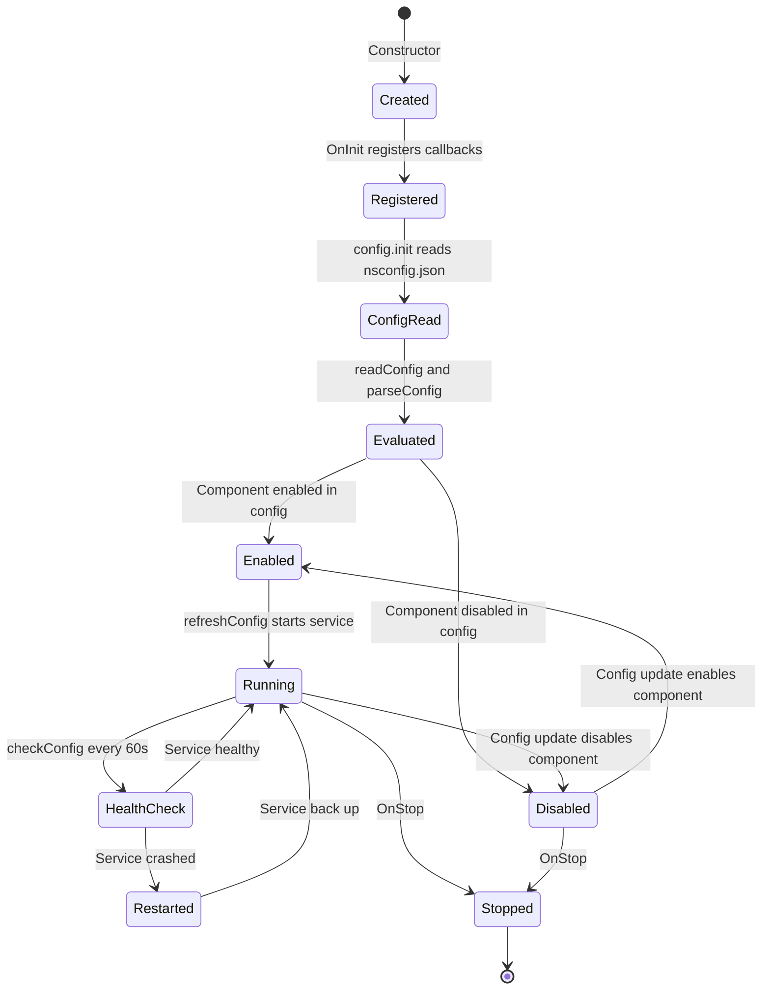

### EPDLP Lifecycle

EPDLP runs as a separate OS service. The `EpdlpSvcStub` inside stAgentSvc acts as a bridge:

1. **Constructor**: `EpdlpSvcStub` is created in `stAgentService` constructor. It creates an `EpdlpConfig` object that reads the `epdlp.*` namespace from `nsconfig.json`.
2. **Config update**: When `EpdlpConfig::refreshConfig()` fires, it writes an `environment.json` bridge file to `%ProgramData%\Netskope\EPDLP\config\` (Windows) or `/Library/Application Support/Netskope/EPDLP/config/` (macOS). This file passes tenant ID, user email, certs, proxy, log level, and device classification to the EPDLP process.
3. **Service start/stop**: `EpdlpSvcStub::configUpdate()` calls platform-specific service management:
   - **Windows**: `OpenSCManager()` / `CreateService()` / `StartService()` / `ControlService()`
   - **macOS**: `launchctl load/start` and `launchctl stop/unload`
4. **Health check**: `EpdlpSvcStub::configCheck()` runs every 60 seconds. If EPDLP is enabled but not running, it restarts the service.
5. **Bypass registration**: When EPDLP starts, its process (`epdlp.exe`) is registered in the bypass app list so NSC does not intercept EPDLP's own network traffic.
6. **OTP disable**: EPDLP supports One-Time Password temporary disable. The OTP state is stored in `nsepdlpconfig.json`, separate from `nsconfig.json`.
7. **IPC**: EPDLP uses `NSCom2Client` to connect back to stAgentSvc for bidirectional communication (config policy update requests, status reporting).

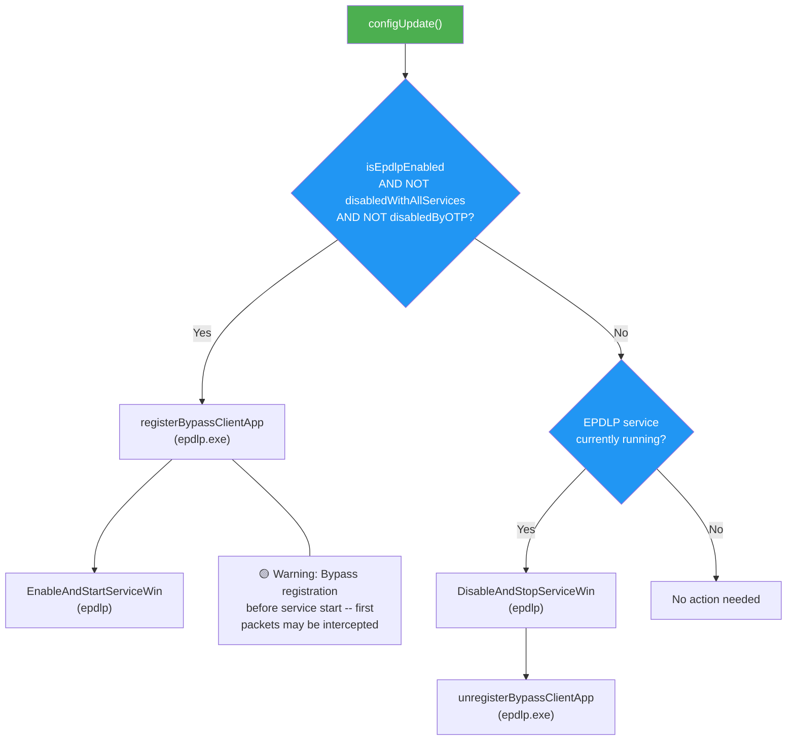

### BWAN Lifecycle

BWAN is a two-service architecture: `BwanClientManager` handles enrollment and config, while `bwanClientSvc` manages the actual tunnel and WinDivert driver.

1. **Constructor**: `BwanConfig` is created in `stAgentService` constructor. It implements `CConfigCallback`, `CClientMessageCallback`, `CClientServiceCallback`, and `ICaptivePortalDetectionCallback`.
2. **Config read**: `BwanConfig::readConfig()` reads BWAN-specific settings from the `nsconfig.json` steering config, including feature flags (`m_bwan_apps_enabled`, `m_bwan_apps_on_prem`, `m_bwan_apps_off_prem`) and enrollment URL.
3. **Service start/stop** (Windows): `EnableAndStartBWanSvcs()` sets `BwanClientManager` to `SERVICE_AUTO_START` and `bwanClientSvc` to `SERVICE_DEMAND_START` (started by the manager). `StopAndDisableBWanSvcs()` stops both and sets them to `SERVICE_DISABLED`.
4. **Tunnel monitoring** (Windows): A dedicated thread (`bwanTunnelMonitorThread`) watches for WinDivert driver readiness and BWAN tunnel status via registry keys under `HKLM\SOFTWARE\Netskope\bwan`.
5. **On-prem detection**: BWAN participates in on-prem/off-prem detection and adjusts its tunnel behavior based on `NS_BWAN_ON_PREM_STATUS`.
6. **Captive portal integration**: BWAN registers as a `ICaptivePortalDetectionCallback` to receive captive portal detection events.

### NPA Lifecycle

NPA runs in-process as `CNpaTunnelMgr`. Unlike EPDLP and BWAN, NPA shares the same process space and directly accesses `nsFilterDevice`:

1. **Constructor**: `CNpaTunnelMgr` is initialized with references to `nsFilterDevice`, `ProxyMgr`, and `FailCloseMgr`.
2. **Packet steering**: NPA registers as a `ClientPacketSteerCallback` on `CTunnelMgr` to intercept packets destined for private applications.
3. **Independent tunnel**: NPA maintains its own tunnel connection to the NPA gateway, separate from the NSC SWG tunnel.
4. **Config namespace**: NPA config is read from the `npa.*` subtree in `nsconfig.json` through `NpaConfig` (which implements `CConfigCallback`).

### DEM Lifecycle

DEM runs in-process as `CDemMgr`:

1. **Init**: `m_demMgr.init()` is called in `stAgentService::OnInit()` on all platforms (Windows, macOS, Linux, Android).
2. **Registration**: DEM registers itself as a `CConfigCallback` and `CClientServiceCallback` in its `init()` method.
3. **Heartbeat**: A scheduled task (`TASKID_DEM_HEARTBEAT`) runs every 5 minutes to send DEM probe data.

---

## BWAN + NSC Driver Interaction (Windows)

The most significant integration failure pattern involves BWAN's WinDivert driver and NSC's WFP driver both capturing egress packets on the same network stack. Two confirmed escalation bugs (ENG-625957, ENG-918295) and one predicted risk arise from this interaction.

When BWAN is active, its WinDivert driver can intercept packets that NSC's WFP driver expects to handle. This creates three specific failure modes: (1) DNS packet infinite loops when both drivers capture and reinject the same packet, (2) NPA traffic bypassing NSC when WinDivert diverts egress before WFP can intercept, and (3) NPA DNS queries routed to BWAN instead of NPA's private DNS servers.

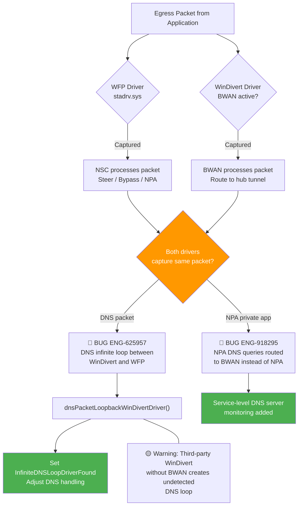

**Confirmed Bug Mapping (Driver Interaction)**:

| Interaction | Known Bugs | Root Cause | Severity | Automation |
|---|---|---|---|---|
| WinDivert + WFP egress capture | ENG-625957 | WinDivert intercepts NPA egress before WFP; NSC driver misses packets | S2 | ❌ Not covered |
| BWAN DNS server + NPA DNS | ENG-918295 | BWAN pushes DNS at service level; NSC only reads global DNS; NPA queries miss | S2 | ❌ Not covered |
| Third-party WinDivert without BWAN | (Predicted risk) | Detection logic assumes BWAN coordinates; partial install breaks assumption | S2 | ❌ Not covered |

---

## NPA Coexistence Flow (All Platforms)

NPA runs in-process sharing the same `nsFilterDevice` as NSC. The most dangerous NPA integration failure pattern occurs during state transitions: upgrades, network switches, and disable/enable cycles. Two confirmed escalation bugs demonstrate these risks.

ENG-773191 shows that after upgrading from R130 to R131 on macOS 15.x, the transparent proxy stops when NPA is in DISABLED state, preventing all NPA traffic from being tunneled. ENG-393015 shows that switching networks while both NSC and NPA tunnels are active causes a crash due to simultaneous tunnel teardown and re-establishment.

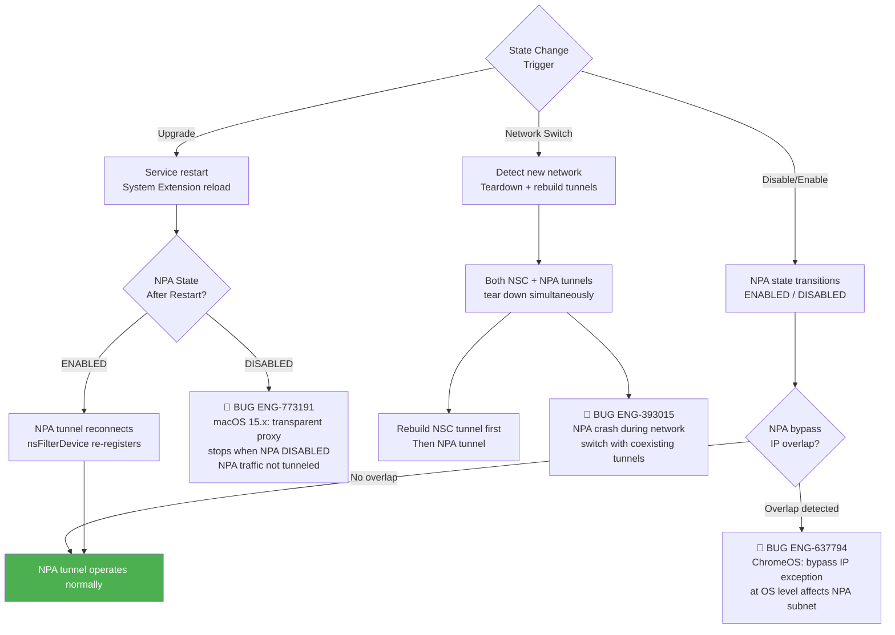

**Confirmed Bug Mapping (NPA Coexistence)**:

| State Change | Known Bugs | Platform | Root Cause | Severity | Automation |
|---|---|---|---|---|---|
| Upgrade R130 to R131 | ENG-773191 | macOS | Transparent proxy stops when NPA DISABLED on macOS 15.x | S1 | ❌ Not covered |
| Network switch (NSC + NPA) | ENG-393015 | Windows | Dual tunnel teardown race condition causes crash | S1 | ❌ Not covered |
| Bypass IP exception + NPA | ENG-637794 | ChromeOS | `bypassIpExceptionAtAndroidOs` FF bypasses NPA subnet at OS level | S2 | ❌ Not covered |

---

## Traffic Mode and CFW Integration (Windows)

NSClient supports three traffic steering modes that affect how components interact with the packet filter:

| Traffic Mode | Constant | Steering Scope | Impact on Components |
|-------------|----------|---------------|---------------------|
| **Web** | `WEB` (2) | HTTP/HTTPS only | Only web traffic goes through NSC tunnel. BWAN handles non-web. |
| **Cloud** (CASB) | `CLOUD` (1) | Cloud app traffic | Cloud SaaS traffic steered. Default mode. |
| **Firewall** (CFW) | `FIREWALL` (3) | All TCP/UDP traffic | All egress traffic steered. Conflicts with BWAN WinDivert. |

When CFW mode is active, the `nsFilterDevice` driver intercepts all egress traffic (not just web). This creates contention with BWAN's WinDivert driver, which also captures egress traffic for its own tunnel. The `handleExceptionsAtDriver` feature flag was introduced to move exception handling from the service level to the driver level, specifically to address IPv4/IPv6 exception conflicts in CFW mode (ENG-654108).

Additionally, third-party VPN clients (Citrix Secure Access, Cisco AnyConnect) interact with NSC's WFP driver in ways that depend on the traffic mode. ENG-805334 demonstrates that enabling WFP mode in Citrix Secure Access causes DNS failures that require the `injectDNSAtNetworkLayer` flag, which in turn conflicts with Cisco AnyConnect users.

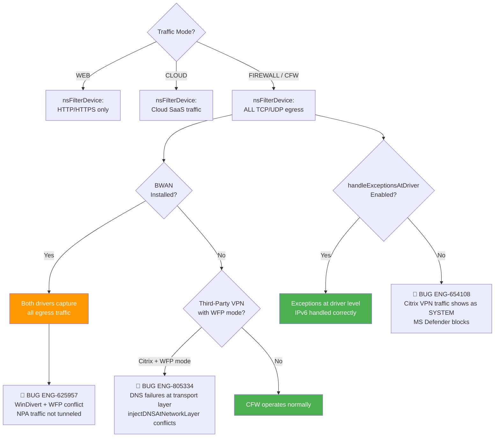

**Node Risk Assessment**:

| Node | Risk | Assessment |
|---|---|---|
| WEB mode | Low | Only HTTP/HTTPS; no BWAN conflict |
| CLOUD mode | Low | Default mode; no contention |
| CFW mode + BWAN | High | **ENG-625957** -- both drivers capture all egress |
| CFW mode + VPN | High | **ENG-805334** -- Citrix WFP mode DNS failures; **ENG-654108** -- IPv6 exception mishandling |
| handleExceptionsAtDriver ON | Low | Resolves IPv6 conflicts |
| handleExceptionsAtDriver OFF | Medium | Risk of IPv4/IPv6 exception mismatch |

---

## Windows

**Bug Count**: 6 | **Key Gaps**: BWAN + NSC driver coexistence, third-party VPN/AV interop, DEM config integrity

On Windows, stAgentSvc runs as a Windows service (`stAgentSvc.exe`). It manages EPDLP and BWAN through the Windows Service Control Manager (SCM). The packet filter is a WFP (Windows Filtering Platform) callout driver (`stadrv.sys`). Windows has the highest integration bug count because it is the only platform where all five components (NSC, NPA, EPDLP, BWAN, DEM) are active simultaneously with kernel-mode drivers.

### Windows Component Layout

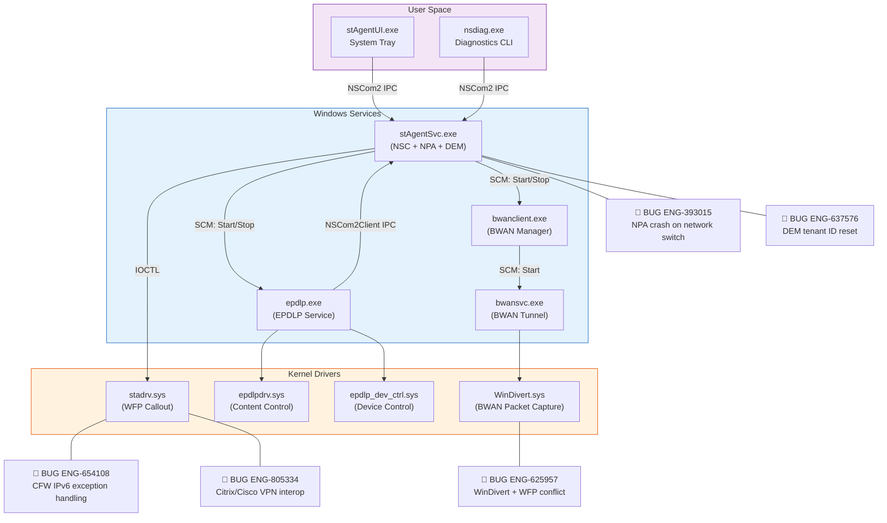

### Windows Self-Protection Scope

The self-protection driver (`stadrv.sys`) protects the file system paths and processes of multiple components:

```cpp
// From stAgentSvc::OnInit() -- self-protection registration
selfProtectionResources protectedResources;
protectedResources.addProtectedResources({
    {certutil_path,       ReadOnly},
    {svcPath,             ReadOnly | IncludingExecutables},   // stAgentSvc install dir
    {configPath},                                              // config dir
    {BWANInstallPath(),   ReadOnly | IncludingExecutables},   // C:\Program Files\Netskope\BWAN
    {epdlpInstallPath,    ReadOnly | IncludingExecutables},   // C:\Program Files\Netskope\EPDLP
    {epdlpDeploymentDir}                                       // EPDLP deployment folder
});
```

### Windows Service Dependencies

| Service | Start Type | Depends On | Started By |
|---------|-----------|-----------|-----------|
| stAgentSvc | Auto | (OS boot) | Windows SCM |
| epdlp | Disabled -> Auto (when enabled) | None | stAgentSvc via EpdlpSvcStub |
| BwanClientManager | Disabled -> Auto (when enabled) | None | stAgentSvc via BwanConfig |
| bwanClientSvc | Disabled -> Demand (when enabled) | BwanClientManager | BwanClientManager |

### WinDivert Driver Conflict Detail (ENG-625957)

**Problem**: BWAN uses the WinDivert driver to capture and redirect traffic to its hub tunnel. NSC's `nsFilterDevice` driver also captures traffic via WFP. When both are active, NPA outbound/egress packets injected by third-party drivers (such as Checkpoint VPN or Windows Defender) are not captured by NSC's WFP driver in the presence of WinDivert.

**Detection logic** (in `lib/nsUtils/osUtils.cpp`):

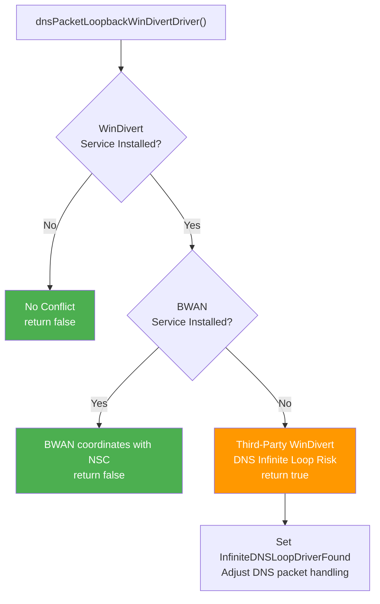

**Fix**: Divert all egress packets to BWAN when BWAN is configured with Internet bypass AppX rule, ensuring NSC sees the packets after BWAN processes them.

## macOS

**Bug Count**: 3 | **Key Gaps**: NPA after upgrade, BWAN + NPA DNS routing, EPDLP launchd lifecycle

On macOS, stAgentSvc runs as a launchd daemon. The Network Extension (NE) is shared between NSC and NPA for packet filtering. EPDLP runs as a separate launchd daemon (`com.netskope.epdlp.client`), and BWAN uses its own launchd-managed services.

### macOS Component Layout

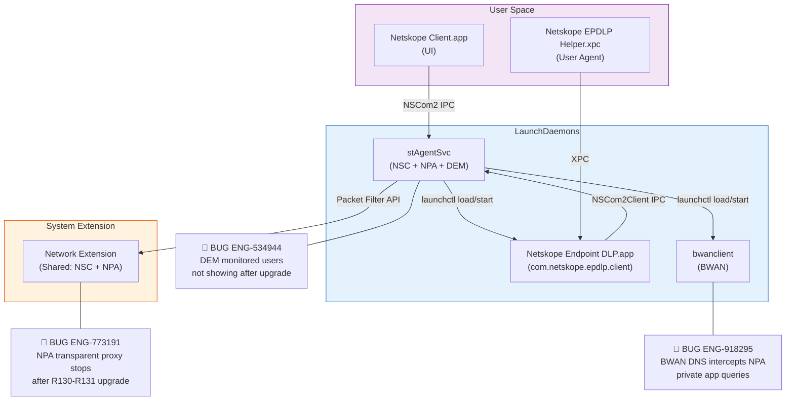

### macOS-Specific Integration Issues

| Issue | Bug ID | Description | Severity |
|-------|--------|-------------|----------|
| NPA after upgrade | ENG-773191 | After R130 to R131 upgrade on macOS 15.x, transparent proxy stops when NPA is in DISABLED state. NPA traffic not tunneled. | S1 |
| BWAN DNS intercept | ENG-918295 | When BWAN active, DNS queries routed to BWAN service instead of NPA; NSC only reads global DNS servers, misses service-level DNS pushed by BWAN | S2 |
| DEM stale timestamps | ENG-534944 | After upgrade from pre-R120, DEM monitored users not showing because `appinstalltimestamp` missing from nsconfig.json | S2 |

## Linux

**Bug Count**: 0 direct | **Key Gaps**: BWAN integration testing on Linux

On Linux, stAgentSvc runs as a systemd service. NPA runs in-process. BWAN is supported with its own service. EPDLP is **not supported** on Linux.

### Linux Component Summary

| Component | Status | Notes |
|-----------|--------|-------|
| NSC | In-process | Core service |
| NPA | In-process | Shared `nsFilterDevice` (VIF/TUN) |
| DEM | In-process | Same as other platforms |
| BWAN | Separate service | `/opt/netskope/bwan/` install path, `nsbwanconfig.json` config |
| EPDLP | Not supported | `EpdlpSvcStub` not compiled on Linux |

### Linux BWAN Config Paths

| Item | Path |
|------|------|
| BWAN install directory | `/opt/netskope/bwan/` |
| BWAN config file | `/opt/netskope/bwan/config/nsbwanconfig.json` |
| BWAN on-prem config | `/opt/netskope/bwan/config/nsbwanonpremconfig.json` |
| BWAN DC config | `/opt/netskope/bwan/config/nsdcconfig.json` |
| BWAN user permission | `/opt/netskope/bwan/config/userpermission.json` |

*No Linux-specific integration bugs have been escalated. Test coverage should mirror Windows BWAN + NPA test cases adapted for user-space tunnel (no WinDivert driver on Linux).*

---

## Android

**Bug Count**: 1 | **Key Gaps**: NPA bypass IP overlap with OS-level exceptions

On Android, the NSClient runs within a VPN service (Android VpnService API). NSC and NPA share this single VPN service because Android only allows one active VPN at a time. EPDLP and BWAN are not supported on Android.

### Android / ChromeOS NPA Bypass Overlap

The `bypassIpExceptionAtAndroidOs` feature flag causes exception IPs to be bypassed at the OS level rather than at the NSClient app level. When NPA subnets overlap with bypass IP ranges, NPA traffic is incorrectly excluded. This was confirmed by ENG-637794 on ChromeOS.

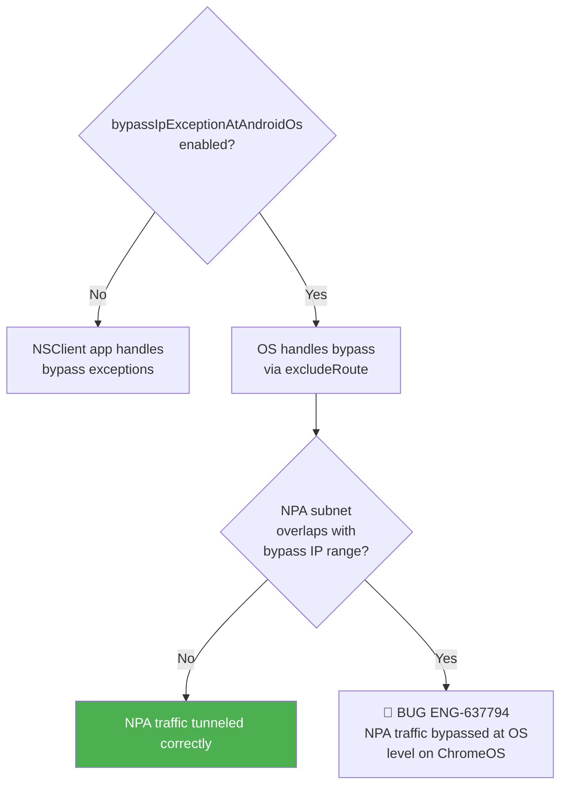

*No Android-specific integration test cases are needed since EPDLP and BWAN are not supported on Android.*

---

## iOS

**Bug Count**: 0 direct | No EPDLP, BWAN, or DEM on iOS

iOS uses the Network Extension framework (NEPacketTunnelProvider). NSC and NPA share a single tunnel. The `stAgentService` constructor on iOS does not create `EpdlpSvcStub` or `BwanConfig` (guarded by `#if defined(WIN32) || defined(__APPLE__) && !defined(__IOS__)`).

*No iOS-specific integration test cases identified.*

---

## ChromeOS

**Bug Count**: 1 | **Key Gaps**: NPA + bypass IP exception overlap

ChromeOS shares the Android codebase for NPA integration. ENG-637794 is the primary integration bug, where NPA traffic was bypassed at the OS level due to `bypassIpExceptionAtAndroidOs` feature flag behavior.

*See Android section above for ENG-637794 details.*

---

## Backend

No backend-specific integration bugs have been escalated. Config callback interactions between components are handled entirely on the client side.

---

## Platform Comparison Matrix

| Feature | Windows | macOS | Linux | Android | iOS |
|---------|---------|-------|-------|---------|-----|
| **Service process** | stAgentSvc.exe (Windows Service) | stAgentSvc (launchd daemon) | stAgentSvc (systemd) | VPN Service | NE Provider |
| **Packet filter** | WFP callout (stadrv.sys) | Network Extension | VIF (TUN device) | VPN TUN | NE Packet Tunnel |
| **NSC** | In-process | In-process | In-process | In-process | In-process |
| **NPA** | In-process | In-process | In-process | In-process | In-process |
| **DEM** | In-process | In-process | In-process | In-process | No |
| **EPDLP** | Separate service (epdlp.exe) | Separate daemon | Not supported | Not supported | Not supported |
| **BWAN** | Separate services (bwanclient, bwansvc) | Separate daemon | Separate service | Not supported | Not supported |
| **EPDLP driver** | epdlpdrv.sys + epdlp_dev_ctrl.sys | None (user-space) | N/A | N/A | N/A |
| **BWAN driver** | WinDivert.sys | User-space tunnel | User-space tunnel | N/A | N/A |
| **Self-protection** | Driver-level (stadrv.sys) | TBD | No | No | No |
| **IPC mechanism** | NSCom2 (named pipe) | NSCom2 (Unix socket) | NSCom2 (Unix socket) | JNI | XPC |
| **Integration bugs** | 6 | 3 | 0 | 0 | 0 |

---

## Automation Coverage Summary

| Area | Coverage | Details |
|------|----------|---------|
| BWAN + NSC driver coexistence (Windows) | ❌ Not covered | No tests for WinDivert + WFP interaction |
| NPA coexistence after upgrade (macOS) | ❌ Not covered | ENG-773191 requires macOS 15.x + specific NPA state |
| NPA crash on network switch (Windows) | ❌ Not covered | ENG-393015 requires rapid network switching |
| BWAN + NPA DNS routing (macOS) | ❌ Not covered | ENG-918295 requires BWAN + NPA + non-full-tunnel mode |
| CFW + third-party VPN interop (Windows) | ⚠️ Partial | DSE automation covers CFW exceptions; VPN interop not covered |
| DEM config integrity (Windows) | ❌ Not covered | No tests for tenant ID preservation through token rotation |
| DEM install time stability | ❌ Not covered | No tests for `client_install_time` across config updates |
| NPA bypass IP overlap (ChromeOS) | ❌ Not covered | Feature flag interaction with NPA subnets |
| EPDLP bypass registration timing | ❌ Not covered | Predicted risk; no bug filed |
| Config callback blocking | ❌ Not covered | Predicted risk; no bug filed |

---

## Cross-Flow Interactions

Multi-component integration is inherently a cross-flow concern. The bugs in this chapter span tunnel management (Chapter 07), steering config (Chapter 05), FailClose (Chapter 11), and installation/upgrade (Chapter 01).

### Upgrade + NPA + FailClose Chain Reaction

The most dangerous compound failure involves upgrading while NPA and FailClose are both active. During the upgrade, the service restarts, which tears down both the SWG and NPA tunnels. If FailClose activates during this window, and the NPA transparent proxy fails to restart (as in ENG-773191), the result is a device where FailClose is blocking all traffic AND NPA cannot re-establish its tunnel to provide private app access.

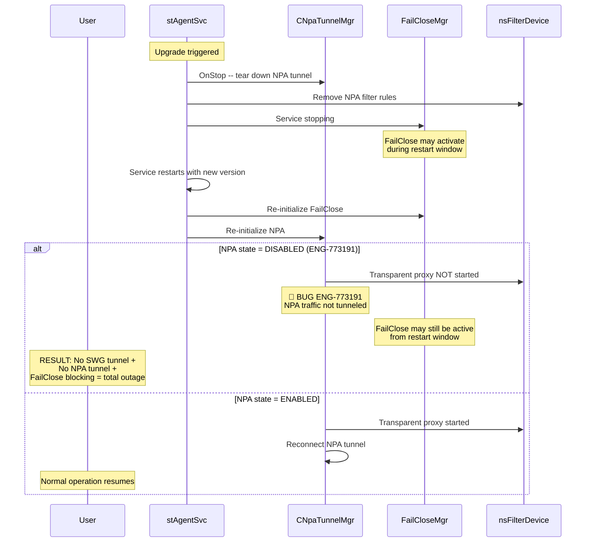

### BWAN + NPA + DNS Resolution Chain

When BWAN is active alongside NPA, the DNS resolution chain becomes three-layered. NPA needs to intercept DNS queries for private applications, but BWAN may push its own DNS servers at the service level. If NSC only reads global DNS servers (pre-fix for ENG-918295), NPA DNS queries for private apps are routed to BWAN instead.

### Cross-Flow Risk Matrix (Chapter-Relevant)

| Interaction | Known Bugs | Severity | Test Priority |
|---|---|---|---|
| Upgrade + NPA + FailClose | ENG-773191, ENG-733657 | **S1** | P1 |
| BWAN + NSC + NPA (Windows) | ENG-625957 | **S1** | P1 |
| NPA network switch + SWG | ENG-393015 | **S1** | P1 |
| BWAN + NPA DNS routing (macOS) | ENG-918295 | **S2** | P2 |
| CFW + third-party VPN | ENG-805334, ENG-654108 | **S2** | P2 |
| DEM config rotation | ENG-637576, ENG-534944 | **S2** | P2 |
| NPA bypass IP overlap (ChromeOS) | ENG-637794 | **S2** | P2 |
| EPDLP bypass timing | (Predicted risk) | **S3** | P3 |
| Config callback blocking | (Predicted risk) | **S3** | P3 |

## Config Namespace Isolation

Each component reads a distinct subtree from the shared `nsconfig.json`. Additionally, EPDLP and BWAN maintain their own config files to avoid polluting the main config.

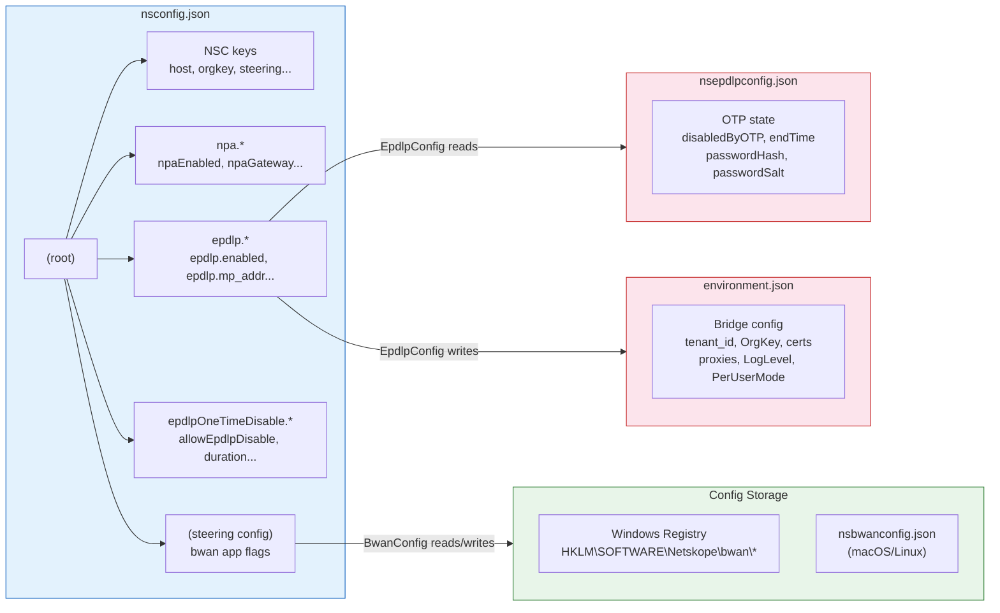

### Config key mapping

| Component | Config Source | Key Prefix | Example Keys |
|-----------|-------------|------------|-------------|
| NSC | nsconfig.json | (root) | `host`, `orgkey`, `steering.*` |
| NPA | nsconfig.json | `npa.*` | `npa.enabled`, `npa.gateway` |
| EPDLP | nsconfig.json | `epdlp.*` | `epdlp.enabled`, `epdlp.mp_addr`, `epdlp.dp_addr` |
| EPDLP OTP | nsepdlpconfig.json | `epdlpOneTimeDisable.*` | `disabledByOTP`, `epdlpDisableEndTime`, password hash/salt |
| EPDLP env | environment.json | (root) | `tenant_id`, `OrgKey`, `ca_cert`, `proxies`, `LogLevel` |
| BWAN | Registry (Win) / JSON (mac/linux) | Various | `status`, `bwanenrollmenturl`, `sse_tunnel_status` |

### EPDLP Environment Bridge File

The `environment.json` bridge file deserves special attention because it is the primary mechanism for passing shared state from stAgentSvc to the EPDLP process. It is written by `EpdlpConfig::updateEnvironmentJson()` whenever EPDLP config is refreshed:

```json
{
    "LogLevel": "info",
    "PerUserMode": "false",
    "NSUserNameMap": { "1": "user@company.com" },
    "NSUserKeyMap": { "1": "abc123" },
    "DeviceClassificationStatus": { "1": "managed" },
    "mp_addr": "https://mp-gateway-us-east1.epdlp.goskope.com",
    "dp_addr": "",
    "epdlp_mp": "us-east1",
    "computer_name": "WORKSTATION-01",
    "device_id": "ABC-DEF-123",
    "ns_unique_id": "unique-device-id",
    "tenant_id": "tenant123",
    "OrgKey": "orgkey123",
    "NSUserName": "user@company.com",
    "EnableClientSelfProtection": true,
    "encryptClientConfig": false,
    "ca_cert": "C:\\ProgramData\\Netskope\\stagent\\data\\nscacert.pem",
    "tenant_cert": "C:\\ProgramData\\Netskope\\stagent\\data\\nstenantcert.pem",
    "any_user_cert": "C:\\ProgramData\\Netskope\\stagent\\1\\nsusercert.pem",
    "any_user_session_id": 1,
    "proxies": "http://proxy.company.com:8080"
}
```

This file is only rewritten when its content changes (diffed against `m_lastEnvironmentString`), and supports config encryption when `encryptClientConfig` is enabled.

---

## Message Callback Architecture

Beyond config callbacks, stAgentSvc provides two additional callback mechanisms for inter-component communication:

### CClientServiceCallback

Components register via `registerClientServiceCallback()` to receive service-level events:

| Event | Fired When | Consumers |
|-------|-----------|-----------|
| `onPremStatusChanged(bool)` | On-prem detection changes | BWAN |
| `onTunnelConnected(sessId)` | NSC tunnel connects | NPA, BWAN, DEM |
| `onTunnelDisconnected(sessId)` | NSC tunnel disconnects | NPA, BWAN, DEM |

**Registered service callbacks by platform**:

| Platform | NPA | BWAN | DEM | TLS Key Mgr |
|----------|-----|------|-----|-------------|
| Windows | Yes | Yes | Yes | Yes |
| macOS | Yes | Yes | Yes | No |
| Linux | Yes | Yes | Yes | No |
| Android | Yes | No | Yes | No |

### CClientMessageCallback

Components register via `registerClientMessageCallback()` to handle IPC messages from the UI process or nsdiag:

| Message | Handler | Purpose |
|---------|---------|---------|
| `SET_ENDPOINT_DLP_STATUS` | EpdlpSvcStub | Enable/disable EPDLP via OTP |
| `SET_STATUS` (ALLSERVICES) | EpdlpSvcStub | Disable all services (affects EPDLP) |
| BWAN-specific messages | BwanConfig | BWAN tunnel control from UI |
| NPA-specific messages | CNpaTunnelMgr | NPA status queries, re-auth |

---

## Troubleshooting

### Log Keywords by Component

| Component | Log Module | Key Search Terms |
|-----------|-----------|-----------------|
| EPDLP lifecycle | `EpdlpSvc` | `epdlp service init`, `register and start epdlp`, `unregister and stop epdlp` |
| EPDLP config | `EpdlpConfig` | `endpoint_dlp is present`, `EPDLP is enabled`, `EPDLP is turned on but it is not available` |
| EPDLP environment | `EpdlpConfig` | `EPDLP is enabled, refresh its env config`, `new env config is written` |
| EPDLP OTP | `EpdlpConfig` | `EPDLP service is disabled by OTP`, `postDeviceOTP success` |
| BWAN lifecycle | `bwanmodule` | `Enabling BWAN services`, `Disabling BWAN services` |
| BWAN tunnel | `bwanmodule` | `bwan tunnel`, `BWAN windivert is loaded` |
| BWAN status | `bwanmodule` | `BWAN status`, `bwaninternetbypass` |
| WinDivert conflict | `osUtils` | `WinDivert is installed`, `BWAN Tunnel manager service is not running` |
| Config callbacks | `config` | `register npa config callback`, `register epdlp config callback`, `register bwan config callback` |
| FilterDevice sharing | `nsFilterDevice` | `InfiniteDNSLoopDriverFound` |
| DEM heartbeat | `DemMgr` | `DEM heartbeat`, `tenant_id`, `payload validation` |
| NPA tunnel | `npaTunnelMgr` | `NPA tunnel`, `transparent proxy`, `NPA disabled` |

---

## Appendix A: Bug Quick Reference

> All escalation bugs referenced in this chapter, sorted by Bug ID.

| Bug ID | Problem Summary | Platform | Root Cause | Severity |
|--------|----------------|----------|------------|----------|
| **ENG-393015** | NPA + SWG crash on network switch | Windows | Dual tunnel teardown race condition during network switch | S1 |
| **ENG-429954** | `client_install_time` changes frequently in client_status | Windows | DEM integration; install time recalculated on config refresh | S3 |
| **ENG-495212** | DEM config exceptions in customer environment | Windows | Third-party library issue in DEM config parsing | S3 |
| **ENG-534944** | DEM monitored users not showing after upgrade | macOS | Missing `appinstalltimestamp` when upgrading from pre-R120 | S2 |
| **ENG-625957** | NPA not tunneling traffic (BWAN WinDivert conflict) | Windows | WinDivert driver intercepts egress before WFP; NSC driver misses NPA packets | S2 |
| **ENG-637576** | DEM tenant ID reset to '0' during config update | Windows | Token rotation error in config callback resets tenant ID | S2 |
| **ENG-637794** | NPA traffic not tunneling on ChromeOS | ChromeOS | `bypassIpExceptionAtAndroidOs` FF bypasses NPA subnet at OS level | S2 |
| **ENG-654108** | Citrix VPN traffic shows as SYSTEM in CFW mode | Windows | R122 moved IPv6 exception handling to service level; breaks VPN interop | S3 |
| **ENG-773191** | NPA traffic not tunneled after R130-R131 upgrade | macOS | macOS 15.x regression: transparent proxy stops when NPA DISABLED | S1 |
| **ENG-805334** | NSC + Citrix/Cisco VPN interop issue | Windows | Citrix WFP mode DNS failures; `injectDNSAtNetworkLayer` conflicts with Cisco | S2 |
| **ENG-918295** | NPA DNS fails when BWAN enabled | macOS | BWAN pushes DNS at service level; NSC only reads global DNS; NPA queries miss | S2 |

---

## Appendix B: Methodology

### Severity Rating

| Level | Label | Definition | Impact Scope |
|---|---|---|---|
| **S1** | Critical | Complete network outage or security mechanism failure | All users, immediate impact |
| **S2** | High | Core functionality anomaly affecting connectivity | Most users under specific conditions |
| **S3** | Medium | Partial functionality failure or performance issue | Specific scenarios, workaround available |
| **S4** | Low | UI/Log anomaly or edge case | Few users, does not affect core functionality |
| **S5** | Enhancement | Feature improvement request | Not a bug |

### Test Case Format

| Field | Description |
|---|---|
| **Severity** | S1-S5 |
| **Related Bugs** | Related ENG-XXXXXX |
| **Flow Point** | Corresponding step in flow diagram |
| **Preconditions** | Prerequisites |
| **Steps** | Test steps |
| **Expected Result** | Expected result |
| **Gap Type** | Missing / Incomplete / Platform-specific |
| **Automation Priority** | P1 (must) / P2 (should) / P3 (manual OK) |

### Gap Type Taxonomy

| Gap Type | Definition |
|---|---|
| **Missing** | No test case exists for this scenario |
| **Incomplete** | Test case exists but does not cover the failure mode |
| **Platform-specific** | Scenario requires specific platform/environment |
| **Regression** | Existing test broke due to code change |
| **Corner Case** | Rare scenario requiring specific conditions |

---

**Related Chapters**:
- [00_overview.md](00_overview.md) -- Product architecture overview
- [03_service_lifecycle.md](03_service_lifecycle.md) -- stAgentSvc service lifecycle
- [04_config_download.md](04_config_download.md) -- Config download and CConfig internals
- [07_tunnel_management.md](07_tunnel_management.md) -- Dual tunnel architecture (NSC + NPA)
- [09_traffic_steering.md](09_traffic_steering.md) -- CFW mode steering and driver interaction
- [10_bypass.md](10_bypass.md) -- Bypass app mechanism used by EPDLP
- [11_failclose.md](11_failclose.md) -- FailClose shared between NSC and NPA
- [15_npa_integration.md](15_npa_integration.md) -- NPA-specific integration details
- [16_dem.md](16_dem.md) -- DEM integration
- [17_ipc_nscom2.md](17_ipc_nscom2.md) -- NSCom2 IPC used by EPDLP and UI
- [18_security.md](18_security.md) -- Self-protection scope covering all components
