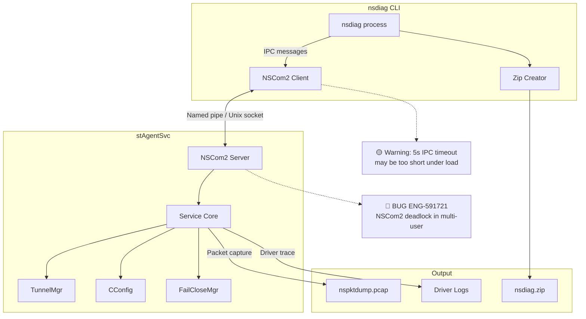
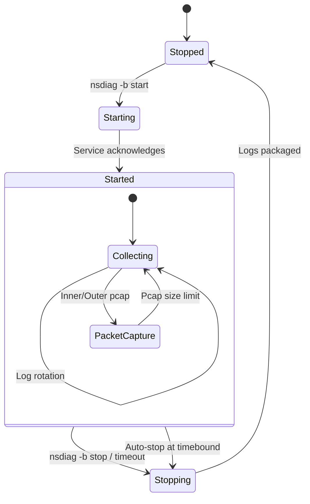
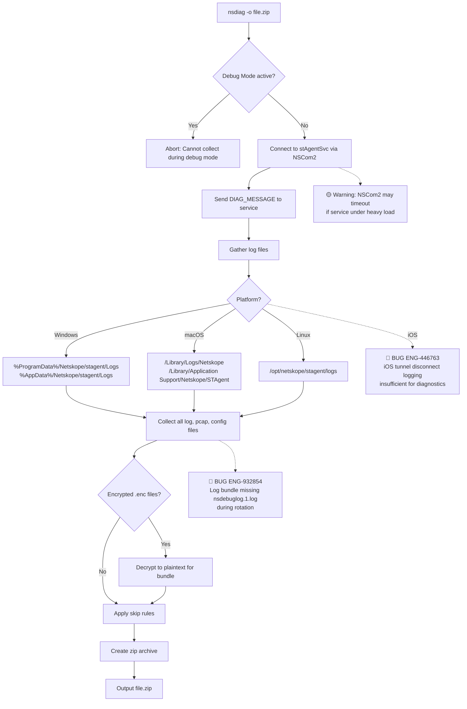
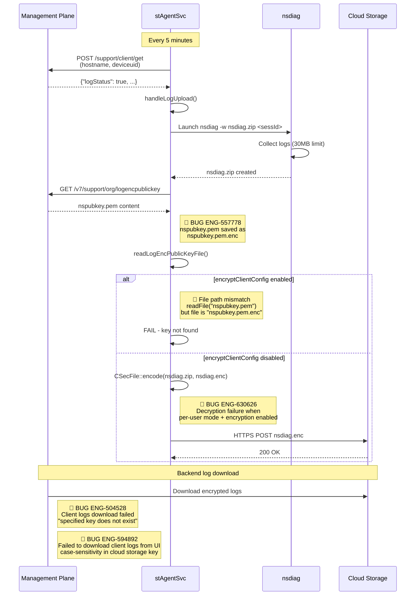
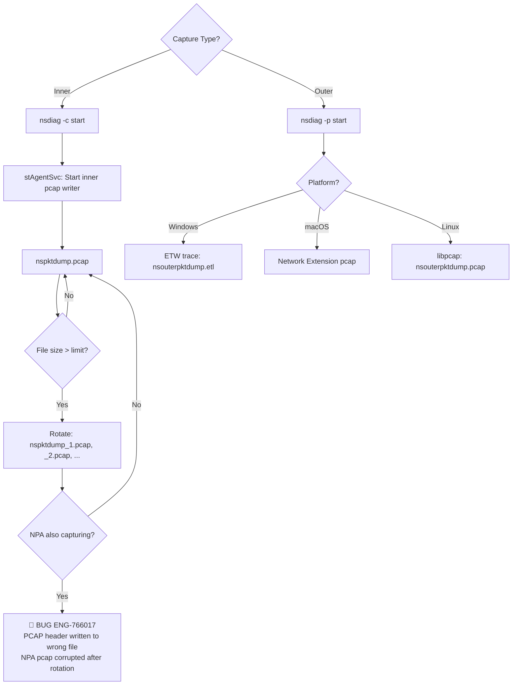
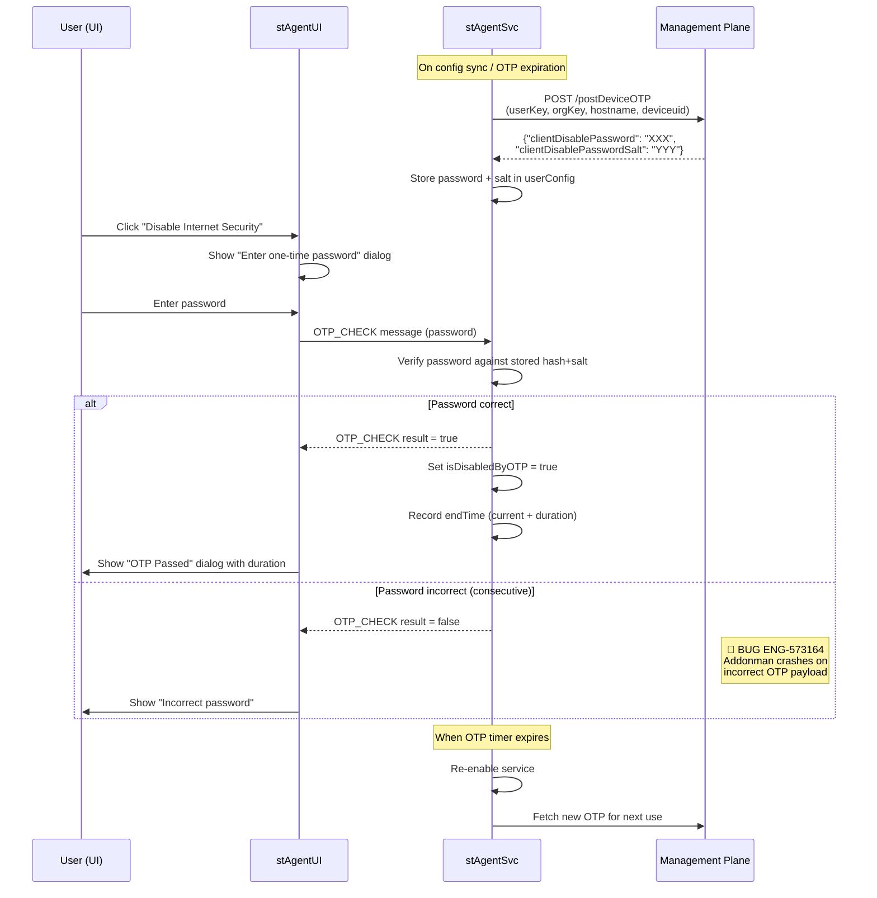
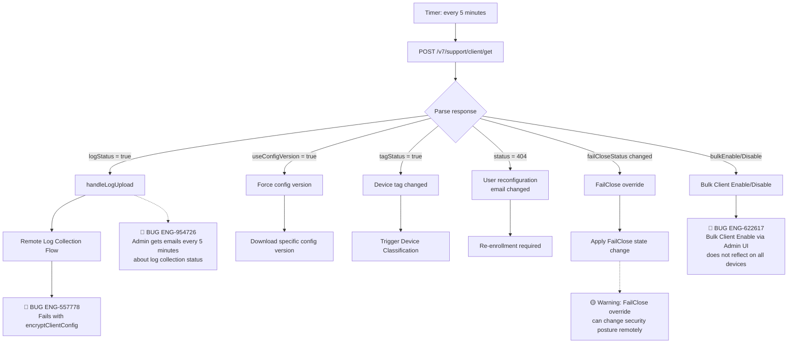
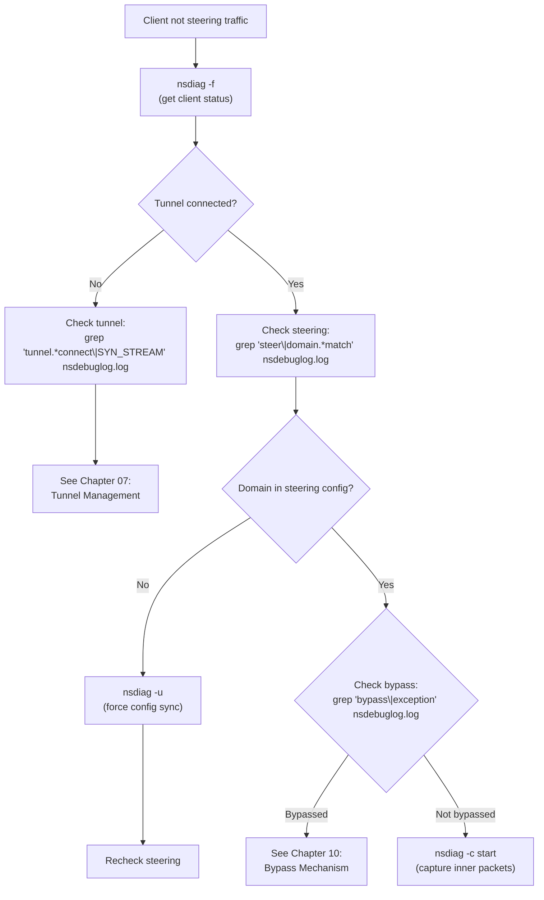
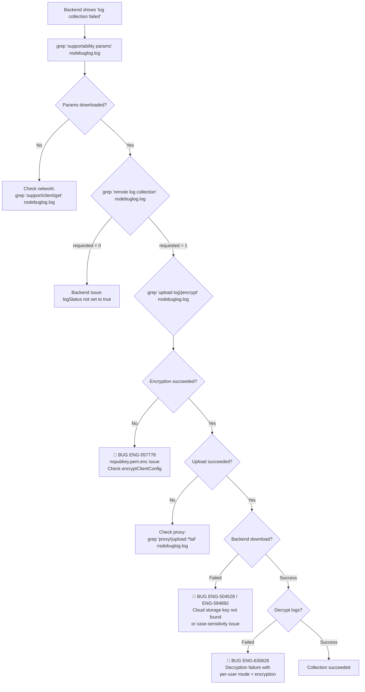
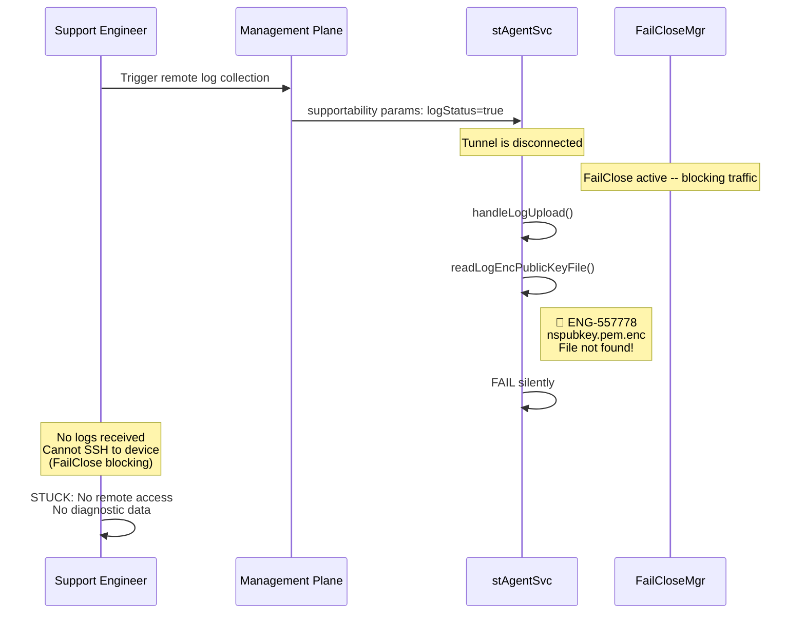

# 20. Supportability & Troubleshooting

**Escalation Bug Count**: 20 | **Regression**: 3 (15%) | **Day-1**: 2 (10%) | **Test Gap**: 7 (35%)

📋 **[Test Cases — Google Sheet](https://docs.google.com/spreadsheets/d/1ackCZ-EcepXw1BkSGoi5Go9Ex1I72-fXqcqLGMGiuio/edit?gid=1676937854#gid=1676937854)**

> This chapter covers NSClient's diagnostic tools, log collection mechanisms, remote log upload, OTP-based service disable, Debug Mode, and platform-specific troubleshooting workflows. Each flow is illustrated with mermaid diagrams annotated with known escalation bug failure points and predicted risk points.

---

## Overview

NSClient provides a layered supportability architecture that spans local diagnostics, remote-triggered log collection, and temporary service disable for troubleshooting. The key components are:

1. **nsdiag CLI** -- A command-line diagnostic tool shipped with every NSClient installation. It communicates with the running `stAgentSvc` service over NSCom2 IPC to collect logs, capture packets, run speed tests, toggle tunnel state, set log levels, and manage Debug Mode.
2. **Remote Log Collection** -- A backend-triggered mechanism where the Management Plane (MP) instructs the client to gather logs, encrypt them with a public key, and upload the encrypted bundle to a cloud storage URL. This allows support engineers to collect diagnostics without physical access to the endpoint.
3. **Debug Mode** -- An extended diagnostics session that raises log verbosity, captures inner/outer packets, records driver logs, and optionally collects CPU profiling and sysdiagnose/Windows Event data. Debug Mode is time-bounded (default 36 hours, max 60 days) and automatically stops to prevent excessive disk usage.
4. **OTP (One-Time Password)** -- A mechanism that allows administrators to temporarily disable Internet Security or Private Apps for a specific user, controlled by a backend-generated password with an expiration time.
5. **Supportability Parameters** -- A periodic polling API (`/support/client/get`) where the client checks the backend for instructions such as "collect logs now", FailClose config overrides, or user reconfiguration commands. This runs every 5 minutes.

The highest-risk area in supportability is **Remote Log Collection with Secure Config** (S2): when `encryptClientConfig` is enabled, the log encryption public key file becomes unusable, silently breaking the entire remote log collection flow. The second critical concern is the **OTP backend crash** (ENG-573164), which disables the OTP feature after consecutive wrong attempts.

Of the 13 bugs mapped to this chapter, 7 are test gaps and 3 are regressions. Remote log collection is particularly fragile: ENG-504528 (download failure on Windows), ENG-594892 (backend case-sensitivity issue), and ENG-630626 (decryption failure with per-user mode + encryption config) compound with the existing ENG-557778 to create multiple failure paths. Log packaging (ENG-932854, missing rotated log files) and supportability parameter notification spam (ENG-954726, admin emails every 5 minutes) further degrade the troubleshooting experience.

---

## nsdiag Architecture (All Platforms)

nsdiag is a standalone CLI executable that communicates with the running service (`stAgentSvc`) via the NSCom2 IPC mechanism. It is not a standalone diagnostic tool -- most of its operations require the service to be running and responsive.

The tool registers itself as an NSCom2 listener, sends command messages to the service, and waits for responses with configurable timeouts. If the service is not running or NSCom2 fails to connect, nsdiag cannot perform most operations. This dependency on IPC creates a single point of failure: if the service is under heavy load or the NSCom2 channel is saturated (as seen in ENG-591721 where NSCom2 deadlocks occur in multi-user environments), nsdiag becomes unresponsive precisely when diagnostics are most needed.



**Node Risk Assessment**:

| Node | Risk | Assessment |
|---|---|---|
| nsdiag process | Low | Standard CLI process launch |
| NSCom2 Client | Medium | 5-second ready timeout (`CONFIG_NSCOM_READY_WAIT_TIME`) may be too short under heavy service load |
| NSCom2 Server | High | **ENG-591721** -- NSCom2 deadlock in multi-user environments blocks all IPC including nsdiag |
| Service Core | Low | Standard message dispatch |
| Zip Creator | Low | Standard file compression |
| TunnelMgr | Low | Status query only via nsdiag |
| CConfig | Low | Config read operations only |
| FailCloseMgr | Low | Status query only via nsdiag |

**Key Design Decisions**:

- nsdiag runs as the invoking user (often Administrator/root), not as the SYSTEM/root service. On Windows, certain operations (outer packet capture, driver logs, memory dumps) require Administrator elevation.
- The NSCom2 connection has a 5-second ready timeout (`CONFIG_NSCOM_READY_WAIT_TIME`). If the service is busy or unresponsive, nsdiag will fail.
- The client name registered with NSCom2 includes the session ID (e.g., `nsdiag_s2`), allowing multiple nsdiag instances in multi-user environments.

---

## nsdiag Commands Reference

nsdiag exposes its functionality through single-letter command-line flags. All options are case-sensitive.

| Flag | Command | Description | Requires Admin | Requires Service |
|------|---------|-------------|:-:|:-:|
| `-o <file>.zip` | Save Diagnostics | Collect all logs, configs, and system info into a zip archive | No | Yes |
| `-oc <file>.zip` | Save Diagnostics + Certs | Same as `-o` but includes CA and tenant certificates | No | Yes |
| `-w <file>.zip` | Web Upload (internal) | Collect logs for backend upload (30MB size limit) | No | Yes |
| `-c start/stop` | Inner Packet Capture | Start/stop capturing tunnel-side (decrypted) packet dumps | No | Yes |
| `-p start/stop` | Outer Packet Capture | Start/stop capturing network-side (encrypted) packet dumps | Windows: Yes | Yes |
| `-d start/stop` | Driver Log Capture | Start/stop capturing FilterDevice driver logs | Windows: Yes | Yes |
| `-b start/stop/status/cleanup` | Debug Mode | Start/stop extended diagnostics session with configurable options | Windows: Admin for full, macOS: root for sysdiagnose | Yes |
| `-l <level>` | Set Log Level | Change runtime log level: dump, debug, info, warning, error, critical | No | Yes |
| `-m <size>` | Set Log Size | Set max log file size in MB (1-1024) | No | Yes |
| `-t enable/disable` | Toggle Tunnel | Enable or disable the client. Disable may require `--password` | No | Yes |
| `-u` | Sync Config | Force configuration synchronization from MP | No | Yes |
| `-f` | Client Status | Print current client status (tunnel, gateway, traffic mode) | No | Yes |
| `-n` | NPA Status | Print NPA enrollment and tunnel status | No | Yes |
| `-v` | Version | Print nsdiag version | No | No |
| `-h` | Help | Print usage information | No | No |
| `-r <URL>` | Latency Test | Measure DNS, connect, TLS, and transfer times for a URL | No | No |
| `-g upload/download -s <size>` | Speed Test | Perform upload/download speed test (1MB/10MB/100MB) | No | Yes |
| `-x <regex> <string>` | Regex Test | Test if a string matches a regular expression (steering rule debugging) | No | No |
| `-a <path>` | Memory Dump (Windows) | Generate full memory dumps of stAgentSvc and stAgentUI | Yes | Yes |
| `--pin [country=XX] [pop=YY]` | Pin POP | Pin connectivity to a specific POP or country | No | Yes |
| `--unpin` | Unpin POP | Revert to automatic POP selection | No | Yes |
| `--pin status` | POP Pin Status | Show current POP pinning status | No | Yes |
| `--check-dc` | Device Classification | Force immediate device classification check | No | Yes |
| `--reset-driver` | Reset Driver (Windows) | Reset driver initialization failure count in Registry | Yes | No |
| `-e enrollauthtoken=X` | Update Enrollment Token | Update enrollment auth/encryption tokens in secure storage | macOS: root | No |

### Debug Mode Options

Debug Mode (`-b start`) accepts additional parameters to control the diagnostics session:

| Sub-flag | Parameter | Description | Default |
|----------|-----------|-------------|---------|
| `-l` | `dump/debug/info/warning/error/critical` | Log level during debug mode | `debug` |
| `-s` | Integer | Packet capture snap length in bytes | 500 |
| `-i` | Integer or `disable` | Max inner pcap total size in MB | 600 MB |
| `-e` | Integer or `disable` | Max outer pcap total size in MB | 800 MB |
| `-m` | Integer | Max number of debug log files (rotation) | 10 |
| `-t` | Integer | Duration in minutes (1 to 86400) | 2160 (36 hours) |
| `-o` | File path | Output archive path (required) | None |
| `-r` | `enable/disable` (Windows only) | Enable/disable driver log capture | `enable` |
| `-d` | `enable/disable` (macOS only) | Enable/disable sysdiagnose collection | `enable` |
| `-c` | Integer or `disable` | CPU sample interval in seconds | `disable` |

**Debug Mode State Machine**:



---

## Log Collection Flow (All Platforms)

### Local Log Collection

When `nsdiag -o <file>.zip` is invoked, the tool performs the following sequence. This flow is shared across all desktop platforms, with platform-specific file paths diverging at the log directory detection step.

The most important behavioral note is that Debug Mode and local log collection are mutually exclusive: nsdiag aborts if a debug session is active, preventing collection of logs that might be most valuable during an ongoing diagnostic investigation.



**Files Included in Log Bundle**:

| File | Content | Rotation |
|------|---------|----------|
| `nsdebuglog.log` | Primary service debug log | 10 MB, 2 files (configurable) |
| `nsdebuglog_old.log` | Previous rotation of service log | -- |
| `nsAppUI.log` / `nsAppUI_old.log` | UI process log | 10 MB, 2 files |
| `nsDiag.log` / `nsDiag_old.log` | nsdiag tool log | 10 MB, 2 files |
| `nsInstallation.log` / `nsInstallation_old.log` | Installation/upgrade log | 10 MB, 2 files |
| `nspktdump.pcap` | Inner packet capture (if running) | Configurable |
| `nsouterpktdump.etl` (Win) / `.pcap` (Mac/Linux) | Outer packet capture (if running) | Configurable |
| `nsconfig.json` / `nsconfig.json.enc` | Client configuration | -- |
| `nsuserconfig.json` | Per-user configuration | -- |
| `nsbwandebuglog.log` | BWAN module log | 10 MB, 2 files |
| `nsSysdiagnose.tar.gz` (macOS) | macOS sysdiagnose output | -- |
| `nsWinEvtApplication.evtx` (Windows, Debug Mode) | Windows Application Event Log | -- |
| `nsWinEvtSystem.evtx` (Windows, Debug Mode) | Windows System Event Log | -- |
| `nsDMCpuUsage*.log` | CPU usage samples (Debug Mode) | -- |
| Crash dumps (macOS) | `DiagnosticReports/stAgentSvc*`, `nsdiag*` | -- |
| `nsPerf.log` | Performance metrics log | 10 MB, 2 files |

**Files Excluded from Log Bundle**:

| File | Reason |
|------|--------|
| `nsusercert.p12` | User private certificate |
| `nspubkey.pem` | Log encryption public key |
| `nsbranding.json` | Contains tenant-specific enrollment data |
| `npatenantcert.pem`, `npaccesskey.pem`, `npaccesscert.pem` | NPA certificates |
| `activation_config.json` | BWAN activation config |
| `.msi`, `.pkg`, `.deb`, `.run`, `.rpm` | Installer packages (too large) |
| `.evtx` (in normal mode) | Windows Event logs (too large for web upload) |

**Web Upload Size Limit**: When collecting for remote upload (`-w` flag), the total bundle is capped at approximately 30 MB. Files are sorted by size ascending, and smaller files are prioritized. Large pcap files and Windows Event logs are excluded.

### Remote Log Collection

Remote log collection is triggered by the Management Plane without any user action. This is the single most impactful supportability feature for field engineering, yet it has a critical bug (ENG-557778) that silently breaks it for any tenant with config encryption enabled. The flow involves five stages: supportability parameter check, nsdiag invocation, public key retrieval, log encryption, and upload.



**Node Risk Assessment**:

| Node | Risk | Assessment |
|---|---|---|
| Supportability params check | Low | Standard HTTP polling every 5 minutes |
| handleLogUpload() | Low | Standard function dispatch |
| nsdiag -w invocation | Medium | 30MB limit may truncate critical pcap files |
| logencpublickey download | Low | Standard API download |
| readLogEncPublicKeyFile() | **Critical** | **ENG-557778** -- file path mismatch with encryptClientConfig |
| CSecFile::encode() | **High** | **ENG-630626** -- decryption failure when per-user mode and encryption config are both enabled |
| HTTPS POST upload | Medium | May fail behind restrictive proxies |
| Backend log download | **High** | **ENG-504528** -- client logs download fails ("specified key does not exist"); **ENG-594892** -- case-sensitivity in cloud storage key name causes download failure from UI |

**Confirmed Bug: ENG-557778 -- Remote Log Collection Fails After Secure Enrollment**

When `encryptClientConfig` is enabled (steering hardening), config files on disk are encrypted and saved with the `.enc` suffix. The log encryption public key `nspubkey.pem` is affected by this, becoming `nspubkey.pem.enc`. When `readLogEncPublicKeyFile()` later tries to read `nspubkey.pem` (without the `.enc` suffix), it fails, causing the entire remote log collection flow to abort silently.

**Root Cause**: The `CConfigSec` layer automatically encrypts files when `configEncryptionEnabled()` returns true, but the `readLogEncPublicKeyFile()` function reads the file path without accounting for the `.enc` transformation. Neither the development team nor QE tested this combination.

**Impact**: Remote log collection is completely broken for any tenant with `encryptClientConfig` enabled. Support engineers cannot collect logs remotely from these endpoints.

**Fix Direction**: `readLogEncPublicKeyFile()` should use `CConfigSec::readConfigFile()` instead of `readFile()` to handle the encrypted file transparently.

---

## Packet Capture Flow (All Platforms)

NSClient supports both inner (decrypted, tunnel-side) and outer (encrypted, network-side) packet capture. The inner capture is managed by the service process, while the outer capture uses platform-specific mechanisms (ETW on Windows, Network Extension on macOS, libpcap on Linux).

A critical bug (ENG-766017) affects NPA packet capture rotation: when the pcap file rotates, the PCAP header is incorrectly written to the SWG file instead of the NPA file, corrupting all NPA pcap files except the first one.



**Confirmed Bug: ENG-766017 -- NPA Inner PCAP Corruption After Rotation**

There is a defect in the NSClient PCAP rotation function. When rotation occurs, the client mistakenly writes the PCAP header to the SWG PCAP file instead of the NPA PCAP file. As a result, all NPA internal PCAP files except the first one are in an invalid format and cannot be analyzed by Wireshark or tcpdump.

| Field | Value |
|---|---|
| **Platform** | Windows & macOS |
| **Regression** | Yes |
| **Bug Type** | Test Gap |
| **Automatable** | Yes |

---

## OTP Mechanism (Windows / macOS)

OTP (One-Time Password) allows administrators to temporarily disable the NSClient Internet Security or Private Apps steering for a specific user. This is used for troubleshooting scenarios where the client is interfering with legitimate traffic.

The OTP flow involves three participants: the Management Plane (generates the password), the service (stores and validates it), and the UI (collects user input). A critical backend bug (ENG-573164) causes the addonman API to crash when receiving an incorrect OTP payload, effectively disabling the OTP feature after consecutive wrong password attempts.

### OTP Flow



**Node Risk Assessment**:

| Node | Risk | Assessment |
|---|---|---|
| POST /postDeviceOTP | Low | Standard API call to fetch OTP credentials |
| Store password + salt | Low | Written to user config file |
| OTP_CHECK message | Low | Standard IPC message via NSCom2 |
| Verify password | Low | Hash comparison |
| isDisabledByOTP flag | Low | Boolean state change |
| Re-enable service | Low | Timer-based state restore |
| Backend addonman API | **High** | **ENG-573164** -- crashes on incorrect payload, disabling OTP entirely |

**Key Implementation Details**:

- OTP is only supported on Windows and macOS desktop platforms
- The OTP is fetched from the backend via `postDeviceOTP()` and stored in the user config file
- When the OTP expiration time passes, a new OTP is automatically fetched
- OTP validation occurs in `stAgentSvcEx.cpp` in the `OTP_CHECK` message handler
- EPDLP has a separate OTP mechanism via `epdlpConfig::checkOTPPassword()` and `allowDisableByOTP()`
- A safety check prevents OTP-based disable if more than 60 seconds have passed since the password was validated (anti-replay)
- The disable duration is configurable by the backend (`getInternetSecurityDisableDuration()`)

**Confirmed Bug: ENG-573164 -- OTP Disabled After Consecutive Wrong Attempts**

The backend API (addonman) crashes on incorrect OTP payload (related to ENG-475524), causing the OTP feature to become non-functional after consecutive wrong password attempts.

| Field | Value |
|---|---|
| **Platform** | Windows (backend issue) |
| **Regression** | No |
| **Bug Type** | Test Gap (Need to include more tests on OTP backend) |
| **Automatable** | No (backend API crash) |

---

## Supportability Parameters (All Platforms)

The client periodically checks the backend for supportability instructions by calling `downloadSuppParams()`. The response is a JSON object that drives several critical behaviors including remote log collection, config version forcing, and FailClose overrides.

The polling interval is every 5 minutes (`SUPP_PARAMS_CHECK_INTERVAL_IN_SECONDS = 300`). If the backend is unreachable, the client falls back to cached values. The FailClose override via `failCloseStatus` is particularly sensitive because it can change security posture remotely without config download.



**Supportability Parameters Response Fields**:

| Field | Type | Purpose |
|-------|------|---------|
| `logStatus` | bool | If `true`, trigger remote log collection |
| `useConfigVersion` | bool | Force specific config version |
| `configVersion` | string | Target config version to use |
| `tagStatus` | bool | Device tag changes detected |
| `status` | string | User reconfiguration status (e.g., `"404"` means email changed) |
| `failCloseStatus` | int | FailClose override from backend |
| `uploadUrl` | string | URL for log upload |

**API Endpoints** (versioned):

| Version | Endpoint | Auth |
|---------|----------|------|
| V3 (deprecated) | `/support/client/get?hashkey=X&orgkey=Y` | Query params |
| V5 | `/v5/support/client/get` | Auth header |
| V7 | `/v7/support/client/get` | Auth header V7 |

---

## Log Files Reference

### Log File Locations by Platform

| Platform | Service Log Directory | UI Log Directory | Config Directory |
|----------|----------------------|-----------------|-----------------|
| **Windows** | `%ProgramData%\Netskope\stagent\Logs` | `%AppData%\Netskope\stagent\Logs` | `%ProgramData%\Netskope\stagent` |
| **macOS** | `/Library/Logs/Netskope` | `/Library/Logs/Netskope` | `/Library/Application Support/Netskope/STAgent` |
| **Linux** | `/opt/netskope/stagent/logs` | `/opt/netskope/stagent/logs` | `/opt/netskope/stagent` |
| **Android** | App-internal storage | App-internal storage | App-internal storage |
| **iOS** | App container | App container | App container |

### Log File Details

| Log File | Process | Content | Default Max Size | Rotation |
|----------|---------|---------|:---:|:---:|
| `nsdebuglog.log` | stAgentSvc | Core service operations, tunnel, steering, config | 10 MB | 2 files |
| `nsdebuglog_old.log` | stAgentSvc | Previous rotation | -- | -- |
| `nsAppUI.log` | stAgentUI | UI events, user interactions, OTP dialogs | 10 MB | 2 files |
| `nsAppUI_old.log` | stAgentUI | Previous rotation | -- | -- |
| `nsDiag.log` | nsdiag | Diagnostic tool operations | 10 MB | 2 files |
| `nsDiag_old.log` | nsdiag | Previous rotation | -- | -- |
| `nsInstallation.log` | Installer | Install, upgrade, uninstall operations | 10 MB | 2 files |
| `nsPerf.log` | stAgentSvc | Performance metrics | 10 MB | 2 files |
| `nsbwandebuglog.log` | BWAN module | SD-WAN operations | 10 MB | 2 files |
| `nsAuxiSvc.log` (macOS) | nsAuxiliarySvc | Auxiliary service (Network Extension helper) | 10 MB | 2 files |
| `nsApp.log` (Linux) | nsApp | Linux application log | 10 MB | 2 files |
| `nsCli.log` (Linux) | nsCli | Linux CLI log | 10 MB | 2 files |
| `nsAppCmd.log` (macOS) | nsdiag | macOS command-line log | 10 MB | 2 files |
| `nswatchdog_log.log` | Watchdog | Service watchdog | 10 MB | 2 files |
| `nspktdump.pcap` | stAgentSvc | Inner (tunnel-side) packet capture | 100 MB per file | 3 files |
| `nsouterpktdump.etl/.pcap` | stAgentSvc | Outer (network-side) packet capture | Configurable | Configurable |
| `npatunnel.pcap` | NPA | NPA tunnel packet capture | 100 MB per file | 3 files |

### Log Level Hierarchy

Log levels from least to most verbose:

```
critical (1) < error (2) < warn (3) < info (4) < debug (5) < dump (6)
```

Default runtime level: `info`. Default nsdiag level: `info`. Debug Mode default: `debug`.

### Log Rotation

The rotation system uses `nsRotationFile`, which:

- Tracks current file size atomically (`m_curFileSize`)
- When the file reaches the max size, renames `current.log` to `_old.log` (or archives with index)
- Supports configurable max file count (2 to 200)
- In Debug Mode, file count increases to 10 (default) to capture more history
- Rotation can be paused during log collection (`ns_pause_rotation()` / `ns_resume_rotation()`) to prevent file renaming while the collector is reading files

### Log Format

Each log line follows this pattern:

```
[timestamp] [PID:TID] [level] [module] [file:line] message
```

Format flags are configured via bitmask:
- `NS_LOG_FORMAT_PID` (0x1): Include process ID
- `NS_LOG_FORMAT_TID` (0x2): Include thread ID
- `NS_LOG_FORMAT_TIMESTAMP` (0x4): Include timestamp
- `NS_LOG_FORMAT_FILEANDLINE` (0x8): Include source file and line
- `NS_LOG_FORMAT_LOGLEVEL` (0x10): Include numeric log level
- `NS_LOG_FORMAT_LOGLEVEL_STR` (0x40): Include log level string

---

## Windows

**Bug Count**: 6 direct | **Key Gaps**: Remote log collection with Secure Config, OTP backend validation, Self-Protection + memory dump interaction, log download failures, log bundle completeness

Windows has the richest nsdiag feature set including memory dump generation, WFP driver log capture, and Windows Event Log collection during Debug Mode. The most critical failure pattern for Windows supportability is the Secure Config + remote log collection interaction (ENG-557778), which breaks the primary remote diagnostic mechanism. Additionally, ENG-504528 causes log download to fail with "specified key does not exist", ENG-630626 breaks log decryption when per-user mode is combined with encryption config, and ENG-932854 causes the log bundle to miss nsdebuglog.1.log during rotation timing.

### Windows-Specific Diagnostics

**Log Locations**:
- Service logs: `%ProgramData%\Netskope\stagent\Logs\nsdebuglog.log`
- UI logs: `%AppData%\Netskope\stagent\Logs\nsAppUI.log`
- nsdiag output: defaults to the service log directory
- BWAN logs (legacy): `%PUBLIC%\Netskope\nsbwandebuglog.log` (migrating to `%ProgramData%`)

**nsdiag Binary**: `C:\Program Files (x86)\Netskope\STAgent\nsdiag.exe` (must run from elevated command prompt for driver operations)

**Windows-Only Commands**:

| Command | Description |
|---------|-------------|
| `nsdiag -a <path>` | Generate full memory dumps of stAgentSvc.exe and stAgentUI.exe (requires Admin, blocked when Self-Protection is enabled) |
| `nsdiag -d start/stop` | Capture WFP driver logs to `.etl` file (requires Admin) |
| `nsdiag --reset-driver` | Reset the driver initialization failure count in Registry (requires Admin) |

**Debug Mode on Windows** additionally collects:
- Windows Application Event Log (`nsWinEvtApplication.evtx`)
- Windows System Event Log (`nsWinEvtSystem.evtx`)
- Driver ETW logs (if enabled)
- Process memory dumps (if Admin and Self-Protection is off)
- CPU usage samples (if configured)

### Windows Self-Protection Interaction

When Self-Protection is enabled, `nsdiag -a` (memory dump) is blocked. This creates a diagnostic gap: the scenarios where memory dumps are most needed (crash investigation, deadlock analysis) are precisely the scenarios where Self-Protection is most likely to be enabled. The check is in `stAgent/nsdiag/` and uses `config.getSelfProtectionEnabled()`.

**Related Bug**: ENG-487939 -- Self-Protection blocking upgrade was caused by a Log Improvement change, demonstrating how supportability changes can have ripple effects into other features.

### Windows Event Viewer Integration

NSClient does not write to the Windows Event Log directly. However, service start/stop events, driver load failures (Error 1275), and crash events are recorded by the OS in:
- `Application` log: stAgentSvc crashes, .NET errors
- `System` log: Driver load failures, service control events
- `Microsoft-Windows-WFP` log: WFP callout registration events

### Windows FailClose Log Event Change

**Bug ENG-566579** identified that FailClose log events did not contain sufficient information for support engineers to diagnose false-positive FailClose activations. The fix improved log messaging to include the specific trigger reason, gateway status, and tunnel state at the time of FailClose activation. This is a diagnostic quality improvement.

### Windows Log Collection Bugs

**Bug ENG-504528 -- Client Logs Download Failed**: When downloading client logs from the backend, the operation fails with "failed to download client logs - the specified key does not exist". The cloud storage key used to reference the uploaded log bundle does not match what the download API expects.

| Field | Value |
|---|---|
| **Platform** | Windows |
| **Regression** | No |
| **Bug Type** | Corner Case |
| **Automatable** | Yes |

**Bug ENG-630626 -- Unable to Download Client Logs (Decryption Failure)**: When both the `encryptClientConfig` flag and per-user mode are enabled, the backend log decryption fails with `AttributeError: 'File_Decrypt' object has no attribute 'backup_pubkey'`. This is a regression introduced when the encryption feature flag was enabled without testing the per-user mode combination.

| Field | Value |
|---|---|
| **Platform** | Windows & macOS |
| **Regression** | Yes |
| **Bug Type** | Test Gap |
| **Automatable** | Yes |

**Bug ENG-932854 -- Log Bundle Missing nsdebuglog.1.log**: When log collection is triggered at the exact moment of log rotation, the rotated file `nsdebuglog.1.log` is not included in the bundle. This is a timing-dependent corner case that is hard to reproduce.

| Field | Value |
|---|---|
| **Platform** | Windows |
| **Regression** | No (Day-1) |
| **Bug Type** | Corner Case |
| **Automatable** | No (timing-dependent) |

## macOS

**Bug Count**: 2 shared (ENG-557778 affects all desktop platforms, ENG-630626 affects Windows & macOS) | **Key Gaps**: sysdiagnose privilege escalation, crash dump collection timing, log decryption with per-user mode

macOS supportability relies heavily on the System Extension architecture. The nsdiag binary requires `sudo` for sysdiagnose collection and outer packet capture. The most unique macOS diagnostic feature is the integration with macOS sysdiagnose, which collects extensive OS-level diagnostics including Network Extension state. ENG-630626 (decryption failure when per-user mode + encryption config are both enabled) also affects macOS log collection workflows.

### macOS-Specific Diagnostics

**Log Locations**:
- Service logs: `/Library/Logs/Netskope/nsdebuglog.log`
- UI logs: `/Library/Logs/Netskope/nsAppUI.log`
- Auxiliary service logs: `/Library/Logs/Netskope/nsAuxiSvc.log`
- Config directory: `/Library/Application Support/Netskope/STAgent`
- Crash reports: `/Library/Logs/DiagnosticReports/stAgentSvc*`, `nsdiag*`, `nsAuxiliarySvc*`

**nsdiag Binary**: `/Library/Application Support/Netskope/STAgent/nsdiag` (must run with `sudo` for sysdiagnose and outer packet capture)

**macOS-Specific Debug Mode Options**:

| Option | Description |
|--------|-------------|
| `-d enable/disable` | Enable/disable macOS sysdiagnose collection (requires `sudo`) |

**sysdiagnose Integration**:

When Debug Mode stops (and sysdiagnose is enabled), nsdiag invokes:
```bash
/usr/bin/sysdiagnose -u -f "/Library/Logs/Netskope" -A nsSysdiagnose.tar.gz
```
This collects extensive macOS system diagnostics including system logs and crash reports, network configuration and state, kernel extensions and system extensions status, and process list and resource usage. The sysdiagnose collection is time-consuming (several minutes) and requires root privilege.

**Crash Report Locations**:

nsdiag automatically scans the following directories for NSClient crash dumps:
- `/Library/Logs/DiagnosticReports/` (system-wide)
- `~/Library/Logs/DiagnosticReports/` (current user)

File patterns searched: `stAgentSvc`, `nsdiag`, `nsAuxiliarySvc`, `bwanclient`, `Netskope Endpoint SD-WAN Module`

## Linux

**Bug Count**: 0 direct | **Key Gaps**: libpcap outer capture, journalctl integration validation

Linux supportability is the simplest of the desktop platforms. nsdiag uses libpcap directly for outer packet capture instead of the platform packet capture mechanisms used on Windows (ETW) and macOS (Network Extension). Linux-specific diagnostics include journalctl integration and network state collection via standard system commands.

### Linux-Specific Diagnostics

**Log Locations**:
- Service logs: `/opt/netskope/stagent/logs/nsdebuglog.log`
- Application log: `/opt/netskope/stagent/logs/nsApp.log`
- CLI log: `/opt/netskope/stagent/logs/nsCli.log`
- Config directory: `/opt/netskope/stagent`

**nsdiag Binary**: `/opt/netskope/stagent/nsdiag`

**Linux-Specific Commands**:

| Command | Description |
|---------|-------------|
| `nsdiag -c startlibpcap -o <path>` | Start libpcap-based outer capture (requires root) |
| `nsdiag -c stoplibpcap` | Stop libpcap capture (requires root) |

Linux uses libpcap directly for outer packet capture with configurable snap length (up to 262144 bytes per libpcap spec). The `CNSLibpcapPC` class handles this.

**journalctl Integration**:

If `stAgentSvc` is managed by systemd, service logs can be queried:
```bash
journalctl -u nsclient -f          # Stream live logs
journalctl -u nsclient --since "1 hour ago"  # Recent logs
journalctl -u nsclient -b          # Boot-time issues
```

**Network Information Collection**:

During log collection on Linux, nsdiag gathers network state by executing system commands:
- `ip addr`, `ip route`, `ip rule`
- `iptables -L`, `ip6tables -L`
- `ss -tulpn` (socket statistics)
- Route table IDs used by the VIF (Virtual Interface)

**Signal Handling**:

nsdiag on Linux explicitly handles `SIGINT` and `SIGTERM` to ensure clean shutdown of packet capture. It also unblocks `SIGTERM` if it was inherited as masked (which can happen in container environments).

## Android

### Android-Specific Diagnostics

**Log Collection**: Android uses `generateLogBundle()` instead of launching an nsdiag subprocess. The log bundle is generated within the service process (`nsAgentService.cpp`).

**Log Locations**: Logs are stored in app-internal storage, accessible only through:
- `adb logcat -s NSClient`
- The in-app "Send Logs" feature
- Remote log collection from the backend

**Key Logcat Tags**:
```bash
adb logcat -s NSClient                            # All NSClient logs
adb logcat | grep -i "tunnel\|spdy\|dtls"          # Tunnel-related
adb logcat | grep -i "steer\|bypass\|domain"        # Steering-related
```

---

## iOS

**Bug Count**: 1 direct | **Key Gaps**: Tunnel disconnect diagnostic logging

### iOS-Specific Diagnostics

**Log Locations**: Logs are stored in the app container, accessible through:
- Xcode Devices and Simulators window
- Apple Configurator 2
- Remote log collection from the backend

**sysdiagnose Integration**: On iOS, a sysdiagnose can be triggered by simultaneously pressing the power button and both volume buttons. The resulting file includes Network Extension logs.

**Bug ENG-446763 -- Tunnel Consistently Getting Disconnected on iOS**: Tunnel disconnections on iOS are not accompanied by sufficient diagnostic logging, making it difficult to determine root cause. The fix is a logging improvement to capture more context around disconnect events. QE and Dev could not replicate the disconnect itself, but the logging gap was confirmed.

| Field | Value |
|---|---|
| **Platform** | iOS |
| **Regression** | No |
| **Bug Type** | Corner Case |
| **Automatable** | No |

---

## ChromeOS

### ChromeOS-Specific Diagnostics

ChromeOS uses a Chrome extension-based client. Debugging is done through:

**Chrome DevTools**:
1. Navigate to `chrome://extensions`
2. Find the Netskope extension
3. Click "Inspect views: background page"
4. Use the Console and Network tabs for diagnostics

---

## Automation Coverage Summary

| Area | GRS Automated | Coverage Assessment |
|------|:---:|---|
| Local log collection (nsdiag -o) | ✅ | `collect_log/test_p0.py::test_06_collect_log` -- full E2E from WebUI trigger to bundle verification |
| Remote log collection | ✅ | `collect_log/test_p0.py::test_06_collect_log` -- covers initiate, upload, download, verify |
| Remote log collection + Secure Config | ❌ | **ENG-557778** -- not tested with `encryptClientConfig` enabled |
| OTP E2E workflow | ✅ | `otp/test_p0.py::test_41_otp_end_to_end_workflow` -- configure, generate, disable, auto-reenable |
| OTP consecutive wrong attempts | ❌ | **ENG-573164** -- no negative test for backend crash |
| Debug Mode start/stop | ❌ | No GRS test covers Debug Mode lifecycle |
| Debug Mode crash recovery | ❌ | No GRS test covers service crash during Debug Mode |
| Memory dump with Self-Protection | ❌ | No GRS test covers `nsdiag -a` interaction with Self-Protection |
| nsdiag under multi-user load | ❌ | No GRS test covers concurrent nsdiag sessions |
| NPA PCAP rotation | ❌ | **ENG-766017** -- no rotation integrity test |
| Supportability params polling | ❌ | No dedicated test for param parsing and action dispatch |
| Client log download (backend) | ❌ | **ENG-504528** -- no test for cloud storage key existence validation |
| Backend log download (case-sensitivity) | ❌ | **ENG-594892** -- no test with mixed-case cloud storage key names |
| Bulk Client Enable/Disable (backend) | ❌ | **ENG-622617** -- no E2E test for bulk enable via Admin UI reflecting on all devices |
| Log decryption with per-user mode | ❌ | **ENG-630626** -- not tested with encryptClientConfig + per-user mode |
| Log bundle during rotation | ❌ | **ENG-932854** -- no test for log collection during log file rotation |
| Log collection status emails | ❌ | **ENG-954726** -- no test verifying admin notification frequency limits |
| iOS tunnel disconnect logging | ❌ | **ENG-446763** -- no test for iOS disconnect diagnostic logging |

---

## Troubleshooting Workflows

### Workflow 1: Client Not Steering Traffic



### Workflow 2: Remote Log Collection Not Working



### Workflow 3: Debug Mode Issues

| Problem | Diagnostic Command | Common Cause |
|---------|-------------------|--------------|
| Debug Mode will not start | `nsdiag -b status` | Previous session not stopped; run `nsdiag -b cleanup` |
| Cannot save log bundle during debug mode | `nsdiag -o file.zip` | Debug Mode blocks `-o`; stop Debug Mode first or use `-b stop -o <file>` |
| Debug Mode stops early | Check `nsdebuglog.log` for timebound | Duration exceeded (default 36 hours) |
| Disk full during Debug Mode | Check file sizes in log directory | Reduce pcap sizes: `-i 100 -e 100` |
| sysdiagnose not collected (macOS) | Check if run as `sudo` | Requires root privilege |

### Common Log Keywords

| Component | Keywords to Grep | Log File |
|-----------|-----------------|----------|
| Tunnel | `tunnel.*connect`, `SYN_STREAM`, `heartbeat`, `TLS.*handshake` | `nsdebuglog.log` |
| FailClose | `FailClose`, `failclosed flow dropped`, `captive portal` | `nsdebuglog.log` |
| Config | `config.*download`, `config.*version`, `supportability params` | `nsdebuglog.log` |
| Steering | `steer`, `domain.*match`, `exception`, `bypass` | `nsdebuglog.log` |
| Gateway | `GSLB`, `gateway`, `POP` | `nsdebuglog.log` |
| Enrollment | `enrollment`, `branding`, `nsbranding` | `nsdebuglog.log` |
| Certificate | `cert.*error`, `SSL.*handshake`, `certificate` | `nsdebuglog.log` |
| NPA | `NPA`, `private.*access`, `npa.*tunnel` | `nsdebuglog.log` |
| OTP | `OTP`, `otp.*verified`, `disable.*password` | `nsdebuglog.log` |
| Upgrade | `upgrade`, `version.*compare`, `MSI`, `package.*download` | `nsdebuglog.log`, `nsInstallation.log` |
| Remote Logs | `remote log collection`, `handleLogUpload`, `uploaded log` | `nsdebuglog.log` |
| Debug Mode | `debug mode`, `DebugMode`, `start debug`, `stop debug` | `nsdebuglog.log`, `nsDiag.log` |
| Driver (Win) | `driver.*init`, `WFP`, `FilterDevice` | `nsdebuglog.log` |
| Network Extension (macOS) | `NetworkExtension`, `transparent proxy`, `NE` | `nsAuxiSvc.log` |
| Proxy | `proxy.*detect`, `proxy.*auth`, `PAC` | `nsdebuglog.log` |
| IPC | `NSCom2`, `NSMsg2`, `IPC` | `nsdebuglog.log` |

---

## Cross-Flow Interactions

### Interaction 1: Remote Log Collection + Secure Config + Tunnel Disconnect

This is the most critical cross-flow failure in supportability. When a customer enables `encryptClientConfig` (steering hardening) and their tunnel disconnects, support engineers attempt remote log collection. Due to ENG-557778, the log collection fails silently. The only workaround is to have someone physically run `nsdiag -o` on the endpoint -- but if the endpoint is in FailClose mode with no tunnel, the support engineer may not be able to reach it remotely.



**Impact**: This compound failure creates a diagnostic dead zone where the customer is experiencing issues, FailClose is blocking remote access, and log collection cannot work.

**Mitigation**: The ENG-557778 fix is required. Additionally, nsdiag should provide a local fallback mechanism that works even when the tunnel is down.

### Interaction 2: OTP + FailClose + Supportability Parameters

When a user needs to temporarily disable FailClose for troubleshooting, they must use OTP. If the OTP backend crashes (ENG-573164), the user cannot disable the client, FailClose continues blocking traffic, and the support engineer cannot collect logs remotely (ENG-557778 if Secure Config is enabled). This creates a triple-failure scenario.

### Cross-Flow Risk Matrix (Chapter-Relevant)

| Feature A | Feature B | Risk | Bug References |
|---|---|---|---|
| Remote Log Collection | encryptClientConfig | Critical | ENG-557778 |
| Remote Log Collection | Per-user mode + encryption | High | ENG-630626 |
| Remote Log Collection | Backend cloud storage key | High | ENG-504528, ENG-594892 |
| OTP | Backend Addonman | High | ENG-573164, ENG-475524 |
| nsdiag IPC | Multi-user VDI | High | ENG-591721 |
| Supportability Params | Bulk Enable/Disable | High | ENG-622617 |
| Supportability Params | Log status notifications | Medium | ENG-954726 |
| Debug Mode | Service Crash | Medium | ENG-587497, ENG-801565 |
| PCAP Rotation | NPA Capture | Medium | ENG-766017 |
| Log Collection | Log file rotation timing | Medium | ENG-932854 |
| iOS Tunnel | Diagnostic logging | Low | ENG-446763 |
| Self-Protection | Memory Dump | Low | ENG-487939 |
| FailClose Log Events | Diagnostics Quality | Low | ENG-566579 |

## Appendix A: Bug Quick Reference

> Problem summaries, root causes, and fixes for all Supportability bugs referenced in this chapter. Sorted by Bug ID for quick lookup.

| Bug ID | Problem Summary | Root Cause | Fix | Platform |
|--------|----------------|-----------|-----|----------|
| **ENG-487939** | Upgrade fails when Self-Protection enabled | Regression from Log Improvement change; Self-Protection blocks service stop during upgrade | Add Self-Protection scenarios to auto-upgrade flow; related to supportability because the Log Improvement change was the trigger | Windows |
| **ENG-557778** | Remote log collection fails with encryptClientConfig | `readLogEncPublicKeyFile()` uses direct file path without `.enc` suffix; `CConfigSec` layer adds `.enc` transparently but reader bypasses it | Use `CConfigSec::readConfigFile()` instead of `readFile()` | Windows (all desktop platforms affected) |
| **ENG-566579** | FailClose log events lack diagnostic detail | Log messages for FailClose activation did not include trigger reason, gateway status, or tunnel state | Improved log event content for FailClose diagnostics | Windows |
| **ENG-573164** | OTP disabled after consecutive wrong attempts | Backend addonman API crashes on incorrect OTP payload (related to ENG-475524) | Fix backend OTP API payload validation; rate-limit OTP check requests | Windows (backend) |
| **ENG-591721** | NSCom2 deadlock in multi-user environment | NSComs module cannot handle concurrent socket connections between stAgentSvc and multiple UI instances | Fix NSComs communication module connection handling | Windows |
| **ENG-766017** | NPA inner pcaps corrupted after rotation | PCAP rotation function writes header to SWG pcap file instead of NPA pcap file | Fix rotation function to write header to correct file | Windows & macOS |
| **ENG-446763** | iOS tunnel disconnect logging insufficient for diagnostics | Tunnel disconnect events on iOS lack context in logs, making root cause analysis impossible | Logging improvement to capture more context around disconnect events | iOS |
| **ENG-504528** | Client logs download failed ("specified key does not exist") | Cloud storage key used for uploaded log bundle does not match what the download API expects | Fix key name consistency between upload and download paths | Windows |
| **ENG-594892** | Failed to download client logs from UI (case-sensitivity) | Backend uses case-sensitive cloud storage key lookup; key name case mismatch between upload and download | Normalize key names to consistent casing across upload/download APIs | Backend |
| **ENG-622617** | Bulk Client Enable via Admin UI does not reflect on all devices | Backend cache clearing gap combined with a provisioner-side change causes bulk enable/disable to not propagate to all devices | Fix backend cache invalidation and provisioner integration for bulk operations | Backend |
| **ENG-630626** | Unable to download client logs -- decryption failure | When both `encryptClientConfig` flag and per-user mode are enabled, `File_Decrypt` object lacks `backup_pubkey` attribute | Fix `File_Decrypt` to handle backup public key in per-user + encryption mode | Windows & macOS |
| **ENG-932854** | Log bundle missing nsdebuglog.1.log during rotation | Log collection triggered at exact moment of log rotation misses the rotated file | Fix collection timing to pause rotation or retry when rotation is in progress | Windows |
| **ENG-954726** | Admin gets emails every 5 minutes about log collection status | Supportability params polling (every 5 minutes) triggers repeated admin email notifications about log collection status without deduplication | Add deduplication or rate-limiting for admin log collection status notifications | All |

---

## Appendix B: Methodology

### Severity Rating

| Level | Label | Definition | Impact Scope |
|---|---|---|---|
| **S1** | Critical | Complete loss of diagnostic capability or security mechanism failure | All users, immediate impact |
| **S2** | High | Core diagnostic functionality broken affecting support operations | Most users under specific conditions |
| **S3** | Medium | Partial diagnostic failure or data quality issue | Specific scenarios, workaround available |
| **S4** | Low | UI/Log anomaly or diagnostic edge case | Few users, does not affect core functionality |
| **S5** | Enhancement | Feature improvement request | Not a bug |

### Test Case Format

| Field | Description |
|---|---|
| **Severity** | S1-S5 |
| **Related Bugs** | Related ENG-XXXXXX |
| **Flow Point** | Corresponding step in flow diagram |
| **Preconditions** | Prerequisites |
| **Steps** | Test steps |
| **Expected Result** | Expected result |
| **Gap Type** | Missing / Incomplete / Platform-specific |
| **Automation Priority** | P1 (must) / P2 (should) / P3 (manual OK) |

### Bug Classification for Supportability

| Category | Scope | Examples in This Chapter |
|---|---|---|
| **Diagnostic Tool Failure** | nsdiag or debug mode malfunction | ENG-591721 (NSCom2 deadlock) |
| **Remote Collection Failure** | Backend-triggered log upload fails | ENG-557778 (Secure Config path mismatch), ENG-504528 (download key not found), ENG-594892 (case-sensitivity), ENG-630626 (decryption failure) |
| **OTP/Disable Failure** | OTP-based troubleshooting mechanism broken | ENG-573164 (backend crash) |
| **Backend Admin Failure** | Admin UI action not propagating | ENG-622617 (bulk enable not reflecting) |
| **Data Quality Issue** | Collected data is corrupt or incomplete | ENG-766017 (PCAP rotation), ENG-566579 (log events), ENG-932854 (missing rotated log) |
| **Notification Issue** | Excessive or incorrect admin notifications | ENG-954726 (email every 5 minutes) |
| **Platform Logging Gap** | Insufficient diagnostic logging on platform | ENG-446763 (iOS disconnect logging) |
| **Cross-Flow Diagnostic Gap** | Supportability fails due to interaction with another feature | ENG-557778 + FailClose compound failure |

---

**Related Chapters**:
- [04_config_download.md](04_config_download.md) -- Config sync triggered by `nsdiag -u`
- [06_client_status.md](06_client_status.md) -- Client status reported via supportability params
- [07_tunnel_management.md](07_tunnel_management.md) -- Tunnel enable/disable via `nsdiag -t`
- [08_gateway_selection.md](08_gateway_selection.md) -- POP pinning via `nsdiag --pin`
- [11_failclose.md](11_failclose.md) -- FailClose config override via supportability params
- [12_device_classification.md](12_device_classification.md) -- DC check via `nsdiag --check-dc`
- [13_certificate_management.md](13_certificate_management.md) -- nspubkey.pem used for log encryption
- [18_security.md](18_security.md) -- OTP mechanism, Self-Protection interaction
