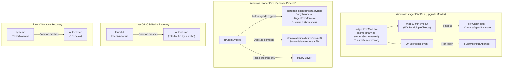
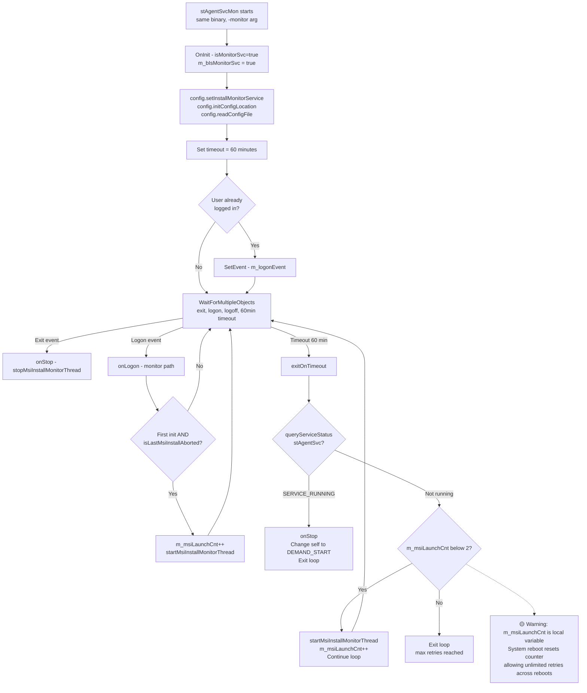
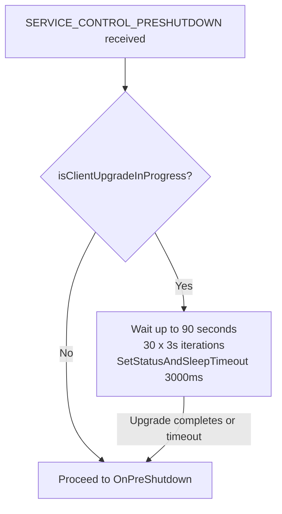

# 21. Watchdog

**Escalation Bug Count**: 3 (cross-referenced) | **Predicted Risks**: 3

📋 **[Test Cases — Google Sheet](https://docs.google.com/spreadsheets/d/1ackCZ-EcepXw1BkSGoi5Go9Ex1I72-fXqcqLGMGiuio/edit?gid=442475875#gid=442475875)**

> This chapter covers the Watchdog (stAgentSvcMon) — an upgrade resilience mechanism that monitors whether the agent service recovers after an auto-upgrade, and retries aborted MSI installations. The Watchdog runs as a separate usermode process and does not interact with kernel components or the `stadrv` driver. For Watchdog behavior during install/upgrade flow, see [01. Installation & Upgrade](01_installation.md#windows-watchdog-in-installupgrade-context).

---

## Overview

The Watchdog (`stAgentSvcMon`) is an upgrade-resilience mechanism that ensures the Netskope Client service comes back online after an auto-upgrade. It addresses one primary failure scenario:

1. **Aborted upgrade recovery** — Detects that `stAgentSvc` is not running after an upgrade attempt (system reboot, power loss, or installer crash), and retries the MSI installation

The Watchdog is created dynamically during auto-upgrade: the agent service copies its own binary (`stAgentSvc.exe`) to a new file (`stAgentSvcMon.exe`), registers it as a Windows service named `stAgentSvcMon`, and starts it. This monitor process uses the same codebase but runs in monitor mode via the `-monitor` command-line argument. It is a completely separate process from the agent service.

**Critical design facts**:
- `stAgentSvcMon` does **not** communicate with the `stadrv` driver — only `stAgentSvc` connects to `stadrv` for packet steering
- The Watchdog uses standard OS timers in usermode — there is no driver-level timer or kernel component involved
- The Watchdog is **not** a continuous health monitor — it exists only during and after auto-upgrade to ensure the upgrade completes

The Watchdog is Windows-specific because macOS uses `launchd` (KeepAlive=true) and Linux uses `systemd` (Restart=always) which provide built-in restart mechanisms. Neither platform has an equivalent upgrade-retry mechanism.

---

## Watchdog Architecture (All Platforms)

The Watchdog operates purely in usermode. On Windows, it is a temporary monitor service (`stAgentSvcMon.exe`) created during auto-upgrade. macOS and Linux rely on OS-native service managers for crash recovery but have no equivalent upgrade-retry mechanism.

**Component Summary**:

| Component | Platform | Location | Purpose |
|---|---|---|---|
| stAgentSvcMon service | Windows | `stAgentSvcMon.exe` (copied from `stAgentSvc.exe`) | Upgrade resilience: retry aborted MSI |
| `startInstallationMonitorService()` | Windows | `lib/nsUtils/packageUtils.cpp` | Creates and starts monitor service before upgrade |
| `stopInstallationMonitorService()` | Windows | `lib/nsUtils/packageUtils.cpp` | Stops and removes monitor service after upgrade |
| `exitOnTimeout()` | Windows | `stAgent/stAgentSvc/stAgentSvcEx.cpp` | 60-min check: if stAgentSvc is running, stop self; if not, retry |
| `isLastMsiInstallAborted()` | Windows | `lib/nsUtils/packageUtils.cpp` | Checks registry for UpgradeInProgress flag |
| `isClientUpgradeInProgress()` | Windows | `lib/nsUtils/osUtils.cpp` | Checks UpgradeInProgress registry value |
| launchd KeepAlive | macOS | `com.netskope.client.stAgentSvc.plist` | Daemon auto-restart |
| systemd Restart | Linux | `stagentd.service` | Daemon auto-restart |

---

## Windows

**Cross-Referenced Bugs**: 3 | **Key Gaps**: Retry counter reset on reboot, no notification on max retries, upgrade race condition

Windows is the only platform with the `stAgentSvcMon` upgrade monitor because Windows Service architecture (Session 0 isolation, SC Manager) requires explicit handling of upgrade failures across system reboots.

### Lifecycle

The monitor service has a well-defined lifecycle:

1. **Creation**: When `stAgentSvc` triggers auto-upgrade, `startInstallationMonitorService()` copies the binary to `stAgentSvcMon.exe`, registers it with `SERVICE_AUTO_START`, creates the `UpgradeInProgress` registry key, and starts the service
2. **Running**: `stAgentSvcMon` enters its event loop with a 60-minute timeout, waiting for logon/exit/timeout events
3. **Self-termination (success)**: On timeout, if `stAgentSvc` is already `SERVICE_RUNNING`, the monitor calls `onStop()` and changes its own start type to `SERVICE_DEMAND_START` (so it won't restart on next boot)
4. **Retry (failure)**: On timeout or logon, if `stAgentSvc` is NOT running, it retries the MSI install
5. **Cleanup**: After successful upgrade, `stAgentSvc` calls `stopInstallationMonitorService()` which stops the service, deletes it from SCM, and removes the `stAgentSvcMon.exe` file

### Monitor Service Event Loop

The monitor service uses the same `Run()` function as the agent service but with `m_bIsMonitorSvc = true`, which sets the `WaitForMultipleObjects` timeout to 60 minutes (vs. `INFINITE` for the agent service). The three events monitored are: exit, logon, and logoff.

**Key Design Points**:

| Aspect | Detail |
|---|---|
| Timeout | 60 minutes (`60 * 60 * 1000` ms) |
| Retry limit | `m_msiLaunchCnt < 2` in `exitOnTimeout()` (2 retries max from timeout path) |
| Registry retry limit | `UpgradeInProgress` value incremented each retry, stops at `value >= 3` |
| PreShutdown handling | Waits up to 90 seconds if upgrade in progress before allowing shutdown |
| Self-cleanup | Changes own start type to `SERVICE_DEMAND_START` on success |

### Registry Markers

| Registry Path | Value | Purpose | Set By |
|---|---|---|---|
| `HKLM\SOFTWARE\Netskope\UpgradeInProgress` | DWORD (1-3) | Tracks retry count; MSI retried while value < 3 | `startInstallationMonitorService()` sets to 1; `isLastMsiInstallAborted()` increments |
| `HKLM\SOFTWARE\Netskope\InstallPath` | REG_SZ | Install directory for locating `stAgentSvc.exe` | MSI installer |

**Key Code References**:
- `lib/nsUtils/packageUtils.cpp::startInstallationMonitorService()` — Creates monitor service
- `lib/nsUtils/packageUtils.cpp::stopInstallationMonitorService()` — Stops and removes monitor service
- `lib/nsUtils/packageUtils.cpp::isLastMsiInstallAborted()` — Checks UpgradeInProgress registry, increments counter
- `lib/nsUtils/packageUtils.cpp::relaunchLastAbortedMsiInstall()` — Thread that re-runs MSI install
- `lib/nsUtils/osUtils.cpp::isClientUpgradeInProgress()` — Checks UpgradeInProgress > 0
- `stAgent/stAgentSvc/stAgentSvcEx.cpp::exitOnTimeout()` — 60-min timeout handler
- `stAgent/stAgentSvc/win/stAgentSvc.cpp::Run()` — Event loop with timeout for monitor mode
- `lib/nsWinSvc/nsWinSvc.cpp::ParseStandardArgs()` — Handles `-monitor` argument

### Windows Use Cases

#### Normal Auto-Upgrade (Happy Path)

1. `stAgentSvc` receives new version from management plane
2. `startInstallationMonitorService()` copies binary to `stAgentSvcMon.exe`, creates service, sets `UpgradeInProgress=1`
3. MSI installer starts, stops `stAgentSvc`, installs new version, starts `stAgentSvc`
4. New `stAgentSvc` starts, calls `stopInstallationMonitorService()` → stops + deletes `stAgentSvcMon`, deletes `UpgradeInProgress` registry, deletes `stAgentSvcMon.exe` file
5. Alternatively: `stAgentSvcMon` timeout fires, sees `stAgentSvc` running, changes self to `DEMAND_START` and exits

#### Upgrade Interrupted by Reboot

1. Auto-upgrade starts, `stAgentSvcMon` is running with `SERVICE_AUTO_START`
2. System reboots during MSI install
3. On boot, `stAgentSvcMon` starts automatically (AUTO_START)
4. On user logon → `onLogon()` → `isLastMsiInstallAborted()` → `UpgradeInProgress` exists and value < 3 → increments value → launches MSI retry
5. If retry succeeds, new `stAgentSvc` cleans up the monitor service
6. If retry fails, next timeout (60 min) tries again up to `m_msiLaunchCnt < 2`

#### Upgrade Fails Repeatedly

1. MSI consistently fails (e.g., corrupted package, disk full)
2. `isLastMsiInstallAborted()` increments `UpgradeInProgress` each retry → at value 3, returns false (no more retries)
3. `exitOnTimeout()` also caps at `m_msiLaunchCnt >= 2` (but this counter resets on reboot)

**Gap**: The registry-based counter persists across reboots (correct), but the in-memory `m_msiLaunchCnt` counter in `exitOnTimeout()` resets on reboot. The two mechanisms overlap but don't fully coordinate — the registry counter caps at 3 total attempts, while `m_msiLaunchCnt` caps at 2 per boot cycle.

### PreShutdown Handling

When Windows sends `SERVICE_CONTROL_PRESHUTDOWN` to `stAgentSvcMon`, the handler checks `isClientUpgradeInProgress()`. If an upgrade is active, it waits up to 90 seconds (30 iterations × 3000ms) before allowing shutdown, giving the MSI install time to complete.

---

## macOS

macOS does not have a custom Watchdog or upgrade monitor. It relies on `launchd`'s built-in `KeepAlive=true` directive for crash recovery. launchd includes built-in rate limiting to prevent crash loops.

**macOS Service Recovery**:

| Component | Recovery Mechanism | Rate Limiting |
|---|---|---|
| `stAgentSvc` daemon | launchd `KeepAlive=true` | launchd built-in (throttles after repeated crashes) |
| `stAgentUI` agent | launchd `KeepAlive=true` | launchd built-in |
| `nsAuxiliarySvc` | launchd `KeepAlive=true` | launchd built-in |
| System Extension | NE framework managed | OS-managed |

**Key Differences from Windows**:
- launchd manages crash recovery with built-in rate limiting
- No upgrade monitor equivalent — aborted upgrades are not automatically retried
- No registry-based retry counter mechanism

For macOS service verification, see [01. Installation & Upgrade — macOS Verification Checklist](01_installation.md#macos-verification-checklist).

---

## Linux

Linux relies on `systemd` for service crash recovery. The `stagentd.service` unit is configured with `Restart=always` and a 10-second restart delay, providing automatic recovery with built-in rate limiting via systemd's `StartLimitBurst` and `StartLimitIntervalSec` defaults.

**Linux Service Recovery**:

| Service | Restart Policy | Delay | Rate Limiting |
|---|---|---|---|
| `stagentd.service` | `always` | 10 seconds | systemd default (5 starts per 10 seconds) |
| `stagentapp.service` | `on-failure` | 5 seconds | systemd default |

**Key Differences from Windows**:
- No upgrade monitor equivalent
- The `.run` auto-upgrade script handles its own retry logic but does not detect aborted upgrades across reboots

For Linux service verification, see [01. Installation & Upgrade — Linux Verification Checklist](01_installation.md#linux-verification-checklist).

---

## Cross-Flow Interactions

### Upgrade Monitor + Service Protection Interaction

When service protection (`disableWinStopServiceProtection`) is enabled, the MSI installer must use a time-based token and global event mechanism to stop `stAgentSvc`. The monitor service passes `config.getSelfProtectionEnabled()` to `relaunchLastAbortedMsiInstall()` which affects how the MSI is relaunched.

### Upgrade Monitor + FailClose Interaction

During the upgrade window (between `stAgentSvc` stopping for upgrade and the new version starting), FailClose may activate if the driver detects the service is not running. After the monitor retries the upgrade and the new service starts, FailClose should deactivate once the tunnel reconnects. The risk is extended FailClose blocking if the upgrade repeatedly fails.

### PreShutdown + Upgrade Race

If the system is shutting down while an MSI install is in progress, the monitor's PreShutdown handler gives the install up to 90 seconds to complete. If the MSI does not finish in time, the upgrade is aborted and retried on next boot.

### Cross-Flow Risk Matrix

| Interaction | Risk | Severity | Test Priority |
|---|---|---|---|
| Upgrade retry + FailClose active | Extended network blocking during repeated failed upgrades | **S1** | P1 |
| Monitor + Service Protection | MSI retry may fail if service protection blocks stop operation | **S2** | P1 |
| Reboot during upgrade + counter mismatch | Registry counter (3 max) vs in-memory counter (2 max) not coordinated | **S2** | P2 |
| PreShutdown + slow MSI | 90-second deadline may not be enough for large installs | **S3** | P3 |

---

## Appendix A: Bug Quick Reference

> **Note**: Watchdog (stAgentSvcMon) is an existing feature but there are no escalation bugs caused by the monitor service itself. The bugs listed below are **cross-referenced interaction risks**: existing escalation bugs from other features whose failure scenarios overlap with the monitor service's operational flow.

| Bug ID | Problem Summary | Root Cause | Monitor Service Relevance | Platform |
|--------|----------------|-----------|--------------------------|----------|
| **ENG-726784** | AOAC upgrade creates duplicate device entries | AOAC devices not tested for install/upgrade; device UID generation falls back to legacy method | If monitor retries upgrade during AOAC wake, duplicate device IDs may be generated | Windows |
| **ENG-733657** | R126→R129 auto-upgrade failure | Post R125 must enable `disableWinStopServiceProtection: true` flag | Monitor's MSI retry will also fail if service protection blocks the upgrade | Windows |
| **ENG-446703** | MSI file pile-up | Residual MSI files not cleaned after install failure | `relaunchLastAbortedMsiInstall()` copies MSI to UUID-named file each retry; repeated failures accumulate files | Windows |

**Predicted Risk Summary**:

| Risk | Severity | Description | Recommended Fix |
|------|----------|-------------|----------------|
| Retry counter not coordinated | 🟡 High | Registry counter (caps at 3) and in-memory `m_msiLaunchCnt` (caps at 2, resets on reboot) overlap without coordination | Rely solely on registry counter; remove in-memory limit or sync them |
| MSI file pile-up on retry | 🟡 Medium | Each retry in `relaunchLastAbortedMsiInstall()` copies MSI to new UUID-named file without cleaning previous copies | Add cleanup of failed MSI copies before retry |
| No failure notification | 🟡 Medium | When max retries are exhausted, no notification is sent to user or management plane | Post upgrade-failed status message when retries are exhausted |

---

## Appendix B: Methodology

### Severity Rating

| Level | Label | Definition | Impact Scope |
|---|---|---|---|
| **S1** | Critical | Complete network outage or security mechanism failure | All users, immediate impact |
| **S2** | High | Core functionality anomaly affecting connectivity | Most users under specific conditions |
| **S3** | Medium | Partial functionality failure or performance issue | Specific scenarios, workaround available |
| **S4** | Low | UI/Log anomaly or edge case | Few users, does not affect core functionality |
| **S5** | Enhancement | Feature improvement request | Not a bug |

### Test Case Format

| Field | Description |
|---|---|
| **Severity** | S1-S5 |
| **Related Bugs** | Related ENG-XXXXXX |
| **Flow Point** | Corresponding step in flow diagram |
| **Preconditions** | Prerequisites |
| **Steps** | Test steps |
| **Expected Result** | Expected result |
| **Gap Type** | Missing / Incomplete / Platform-specific |
| **Automation Priority** | P1 (must) / P2 (should) / P3 (manual OK) |
