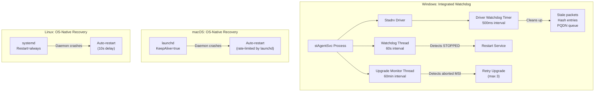
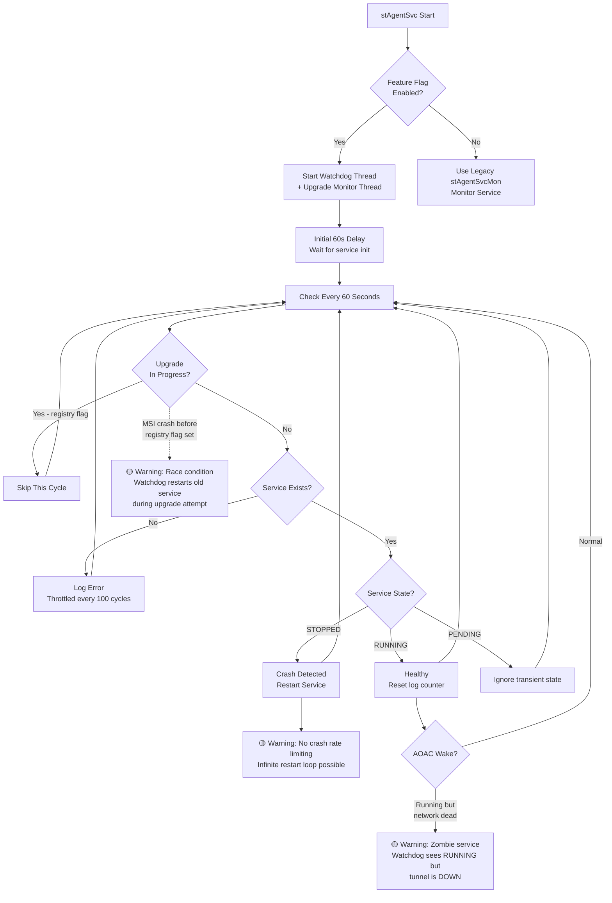
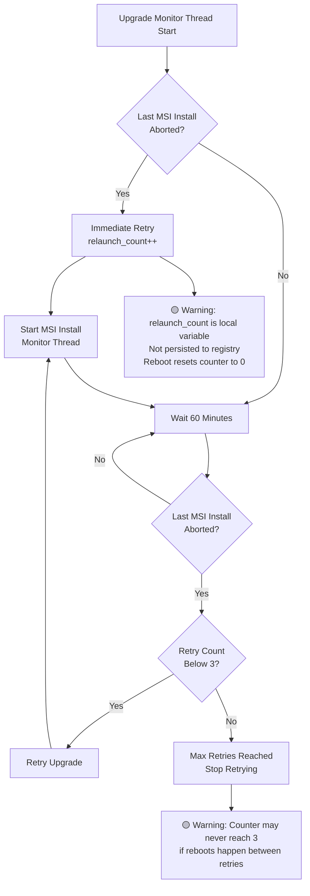
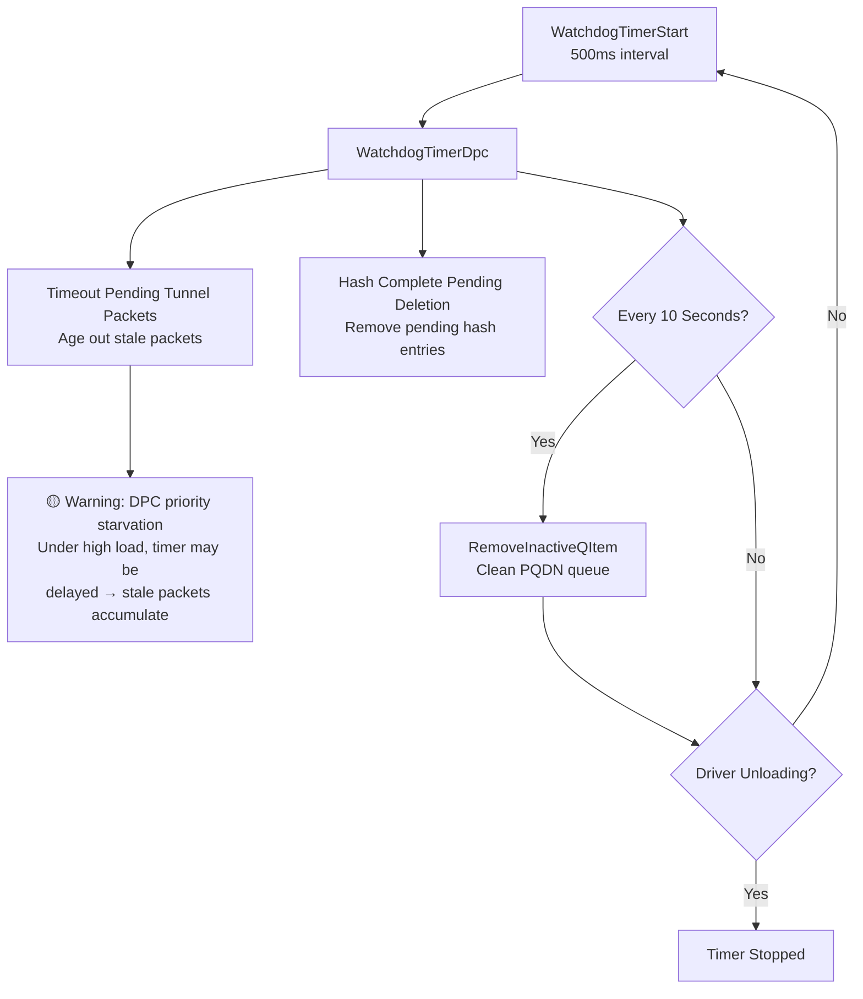

# 21. Watchdog

**Escalation Bug Count**: 3 (cross-referenced) | **Predicted Risks**: 5

📋 **[Test Cases — Google Sheet](https://docs.google.com/spreadsheets/d/1ackCZ-EcepXw1BkSGoi5Go9Ex1I72-fXqcqLGMGiuio/edit?gid=442475875#gid=442475875)**

> This chapter covers the Watchdog feature — an automatic service recovery and upgrade resilience mechanism that monitors service health, restarts crashed services, detects aborted upgrades, and cleans up stale kernel resources. The Watchdog operates beyond install/upgrade scope, providing ongoing runtime protection. For Watchdog behavior specifically during install/upgrade, see [01. Installation & Upgrade](01_installation.md#windows-watchdog-in-installupgrade-context).

---

## Overview

The Watchdog feature is a critical reliability mechanism that ensures the Netskope Client service remains operational without user intervention. It addresses three categories of failure:

1. **Service crash recovery** — Detects when `stAgentSvc` stops unexpectedly and restarts it within 60 seconds
2. **Aborted upgrade retry** — Detects incomplete MSI installations (caused by system reboot, power loss, or installer crash) and retries up to 3 times
3. **Kernel resource cleanup** — A driver-level timer that prevents memory leaks from stale network packets, hash table entries, and PQDN queue items

The Watchdog is Windows-specific at the service level because macOS uses `launchd` (KeepAlive=true) and Linux uses `systemd` (Restart=always) which provide built-in restart mechanisms. The driver-level watchdog operates in the Windows kernel across all deployment scenarios.

The highest risks are: **infinite restart loop** when a service has a startup crash bug (no rate limiting), **AOAC zombie state** where the service reports as RUNNING but has stale network handles after Modern Standby wake, and **race condition** between the Watchdog and MSI installer if the upgrade registry flag is not set before the service stops.

---

## Watchdog Architecture (All Platforms)

The Watchdog operates at two levels: a service-level monitor (Windows-specific, integrated into `stAgentSvc`) and a driver-level timer (Windows kernel, inside `Stadrv`). macOS and Linux rely on OS-native service managers for crash recovery, so their "watchdog" equivalent is the platform's service restart policy.

**Component Summary**:

| Component | Platform | Location | Interval | Purpose |
|---|---|---|---|---|
| Watchdog Thread | Windows | `stAgentSvcEx.cpp::ThreadWatchdog()` | 60 seconds | Service crash detection + restart |
| Upgrade Monitor Thread | Windows | `stAgentSvcEx.cpp::ThreadUpgradeMonitor()` | 60 minutes | Aborted upgrade detection + retry |
| Driver Watchdog Timer | Windows | `stadrv/common/source/timer.c::WatchdogTimerDpc()` | 500 ms | Kernel resource cleanup |
| Feature Flag | Windows | `stAgentSvcEx.cpp::GetWatchdogMonitorEnabledFlag()` | — | Enables/disables integrated watchdog |
| launchd KeepAlive | macOS | `com.netskope.client.stAgentSvc.plist` | OS-managed | Daemon auto-restart |
| systemd Restart | Linux | `stagentd.service` | 10 seconds | Daemon auto-restart |

---

## Windows

**Cross-Referenced Bugs**: 3 | **Key Gaps**: No crash rate limiting, AOAC health check missing, retry counter not persisted

Windows is the only platform with a custom Watchdog implementation because Windows Service architecture (Session 0 isolation, SC Manager) requires explicit monitoring. The Watchdog Thread and Upgrade Monitor Thread both run inside the main `stAgentSvc` process, controlled by a feature flag that allows gradual rollout and backward compatibility with the legacy `stAgentSvcMon` monitor service.

### Windows Service-Level Watchdog Flow

The Watchdog Thread checks service status every 60 seconds. It starts with a 60-second initialization delay to avoid false positives during service startup. The critical design constraint is the `isClientUpgradeInProgress()` check — without it, the Watchdog would restart the old service during MSI upgrades, causing upgrade failures.

**Service State Handling**:

| Windows Service State | Watchdog Action | Rationale |
|---|---|---|
| `SERVICE_RUNNING` | No action, reset counters | Service is healthy |
| `SERVICE_STOPPED` | Restart immediately | Service crashed — primary recovery path |
| `SERVICE_START_PENDING` | Ignore | Service is starting, don't interfere |
| `SERVICE_STOP_PENDING` | Ignore | Service is stopping (may be intentional) |
| Service not found | Log error (throttled) | Service was uninstalled — don't restart |

**Key Code**: `stAgent/stAgentSvc/stAgentSvcEx.cpp` — `ThreadWatchdog()` (service monitoring), `isClientUpgradeInProgress()` (registry flag check), `nsWinServiceControl::IsServiceRunning()` / `IsServiceStopped()` / `IsServiceExist()`

### Windows Upgrade Monitor Flow

The Upgrade Monitor Thread runs alongside the Watchdog Thread but at a much lower frequency (every 60 minutes). Its purpose is to detect upgrades that were interrupted by system reboot, power loss, or installer crash. On detection, it retries the upgrade up to 3 times.

A critical gap: the retry counter (`relaunch_count`) is a local variable, not persisted to the registry. This means a system reboot resets the counter, potentially allowing unlimited retries across reboots if the upgrade consistently fails.

**Registry Markers Used**:

| Registry Path | Purpose |
|---|---|
| `HKLM\SOFTWARE\Netskope\STAgent\UpgradeInProgress` | Set by MSI before upgrade, checked by Watchdog Thread |
| `HKLM\SOFTWARE\Netskope\STAgent\LastMsiInstallAborted` | Set when MSI install is interrupted, checked by Upgrade Monitor |

**Key Code**: `stAgent/stAgentSvc/stAgentSvcEx.cpp` — `ThreadUpgradeMonitor()`, `isLastMsiInstallAborted()`, `startMsiInstallMonitorThread()`

### Windows Driver-Level Watchdog

The driver-level watchdog operates in the Windows kernel as a Deferred Procedure Call (DPC) timer. Unlike the service-level watchdog that monitors process health, the driver watchdog prevents kernel memory leaks by cleaning up stale resources every 500 milliseconds.

Under high network load, the DPC timer can be delayed because network packet processing DPCs have higher priority, potentially allowing stale packets to accumulate and cause kernel memory exhaustion.

**Resource Cleanup Schedule**:

| Resource | Cleanup Interval | Risk if Not Cleaned |
|---|---|---|
| Pending tunnel packets | 500ms | Kernel memory leak, eventual BSOD |
| Hash table pending deletions | 500ms | Stale entries consuming pool memory |
| Inactive PQDN queue items | 10 seconds | Memory growth from DNS resolution cache |

**Key Code**: `stAgent/stadrv/common/source/timer.c` — `WatchdogTimerDpc()`, `WatchdogTimerStart()`

### Windows Use Cases

#### AOAC (Modern Standby) Recovery

When a Windows 11 laptop enters Modern Standby, the service continues in a low-power state but network handles may become stale. On wake, the service may crash due to invalid network state. The Watchdog detects the `STOPPED` state and restarts the service within 60 seconds, restoring tunnel connectivity.

**Gap**: The Watchdog only checks Windows Service Manager status. If the service process is technically `RUNNING` but has zombie network handles (common after AOAC wake), the Watchdog takes no action. See RISK_AOAC in the flow diagram above.

**Related Bug**: ENG-726784 — AOAC upgrade creates duplicate device entries, indicating AOAC device UID generation issues that the Watchdog does not address.

#### Third-Party Software Conflict

When antivirus software blocks the Netskope driver from loading, `stAgentSvc` crashes on startup. The Watchdog continuously restarts the service every 60 seconds. While this ensures the service recovers immediately once the conflict is resolved (e.g., after whitelisting), it also means the system runs a crash-restart loop that consumes CPU until the conflict is addressed.

#### VDI/RDS Multi-User Environment

On Windows Server RDS with many concurrent user sessions, a single `stAgentSvc` crash affects all users. The Watchdog restarts the service within 60 seconds, minimizing downtime from hours (manual restart) to under 2 minutes (automatic). Each user session's UI (`stAgentUI`) reconnects independently after the service restarts.

## macOS

macOS does not have a custom Watchdog implementation. Instead, it relies on `launchd`'s built-in `KeepAlive=true` directive, which automatically restarts the daemon if it exits. launchd includes built-in rate limiting to prevent crash loops.

**macOS Service Recovery**:

| Component | Recovery Mechanism | Rate Limiting |
|---|---|---|
| `stAgentSvc` daemon | launchd `KeepAlive=true` | launchd built-in (throttles after repeated crashes) |
| `stAgentUI` agent | launchd `KeepAlive=true` | launchd built-in |
| `nsAuxiliarySvc` | launchd `KeepAlive=true` | launchd built-in |
| System Extension | NE framework managed | OS-managed |

**Key Difference from Windows**: launchd manages the entire restart lifecycle including rate limiting, so the risks of infinite crash loops and resource exhaustion are handled by the OS. However, launchd does not have an equivalent of the Upgrade Monitor — aborted upgrades are not automatically retried.

For macOS service verification, see [01. Installation & Upgrade — macOS Verification Checklist](01_installation.md#macos-verification-checklist).

---

## Linux

Linux relies on `systemd` for service recovery. The `stagentd.service` unit is configured with `Restart=always` and a 10-second restart delay, providing automatic crash recovery with built-in rate limiting via systemd's `StartLimitBurst` and `StartLimitIntervalSec` defaults.

**Linux Service Recovery**:

| Service | Restart Policy | Delay | Rate Limiting |
|---|---|---|---|
| `stagentd.service` | `always` | 10 seconds | systemd default (5 starts per 10 seconds) |
| `stagentapp.service` | `on-failure` | 5 seconds | systemd default |

**Key Difference from Windows**: Like macOS, Linux has no Upgrade Monitor equivalent. The `.run` auto-upgrade script handles its own retry logic but does not detect aborted upgrades across reboots.

For Linux service verification, see [01. Installation & Upgrade — Linux Verification Checklist](01_installation.md#linux-verification-checklist).

---

## Cross-Flow Interactions

### Watchdog + FailClose Interaction

When FailClose is active and the service crashes, the Watchdog restarts the service. During the 60-second detection window, FailClose may activate (blocking all traffic) if the driver detects the service is not running. After Watchdog restarts the service, FailClose should deactivate once the tunnel reconnects. The risk is that FailClose enters a stuck state during the crash-restart cycle.

### Watchdog + Tunnel Reconnect Interaction

After Watchdog restarts the service, the tunnel management module must re-establish the connection. If the tunnel enters a reconnect backoff loop (exponential backoff up to the maximum interval), the user may experience extended downtime despite the Watchdog restarting the service quickly.

### Cross-Flow Risk Matrix (Watchdog-Relevant)

| Interaction | Risk | Severity | Test Priority |
|---|---|---|---|
| Watchdog restart + FailClose active | FailClose stuck in blocking state during restart | **S1** | P1 |
| Watchdog restart + Tunnel reconnect backoff | Extended downtime despite fast restart | **S2** | P2 |
| Watchdog + MSI upgrade race | Watchdog restarts old service, blocking upgrade | **S2** | P1 |
| AOAC wake + Watchdog health check gap | Zombie service not detected | **S2** | P2 |
| Driver watchdog + high load | Kernel memory leak from delayed cleanup | **S2** | P2 |

## Appendix A: Bug Quick Reference

> **Note**: Watchdog is an unreleased feature — there are no escalation bugs caused by the Watchdog itself. The bugs listed below are **cross-referenced interaction risks**: existing escalation bugs from other features whose failure scenarios overlap with Watchdog's operational flow. These are included to identify scenarios that Watchdog must handle correctly to avoid triggering or amplifying known failure patterns.

| Bug ID | Problem Summary | Root Cause | Watchdog Relevance | Platform |
|--------|----------------|-----------|-------------------|----------|
| **ENG-726784** | AOAC upgrade creates duplicate device entries | AOAC devices not tested for install/upgrade; device UID generation falls back to legacy method | Watchdog AOAC recovery may trigger duplicate device ID if UID generation is not idempotent | Windows |
| **ENG-733657** | R126→R129 auto-upgrade failure | Post R125 must enable `disableWinStopServiceProtection: true` flag | Watchdog must not interfere with upgrade; `isClientUpgradeInProgress()` is the critical gate | Windows |
| **ENG-446703** | MSI file pile-up | Residual MSI files not cleaned after install failure | Upgrade Monitor retries may compound MSI pile-up if cleanup is insufficient | Windows |

**Predicted Risk Summary**:

| Risk | Severity | Description | Recommended Fix |
|------|----------|-------------|----------------|
| Infinite restart loop | 🟡 High | No crash rate limiting in Watchdog Thread | Add crash count + cooldown (e.g., pause after 5 crashes in 5 minutes) |
| AOAC zombie state | 🟡 High | Watchdog only checks SC Manager status, not actual service health | Add internal health ping after AOAC wake detection |
| Retry counter not persisted | 🟡 Medium | `relaunch_count` is local variable, reset on reboot | Persist counter in registry |
| Log throttle mismatch | 🟢 Low | Code comment says "30 min" but actual throttle is ~100 min | Fix comment to match code |
| DPC timer starvation | 🟡 High | Driver watchdog DPC delayed under high network load | Monitor DPC latency; consider higher-priority timer |

---

## Appendix B: Methodology

### Severity Rating

| Level | Label | Definition | Impact Scope |
|---|---|---|---|
| **S1** | Critical | Complete network outage or security mechanism failure | All users, immediate impact |
| **S2** | High | Core functionality anomaly affecting connectivity | Most users under specific conditions |
| **S3** | Medium | Partial functionality failure or performance issue | Specific scenarios, workaround available |
| **S4** | Low | UI/Log anomaly or edge case | Few users, does not affect core functionality |
| **S5** | Enhancement | Feature improvement request | Not a bug |

### Test Case Format

| Field | Description |
|---|---|
| **Severity** | S1-S5 |
| **Related Bugs** | Related ENG-XXXXXX |
| **Flow Point** | Corresponding step in flow diagram |
| **Preconditions** | Prerequisites |
| **Steps** | Test steps |
| **Expected Result** | Expected result |
| **Gap Type** | Missing / Incomplete / Platform-specific |
| **Automation Priority** | P1 (must) / P2 (should) / P3 (manual OK) |
