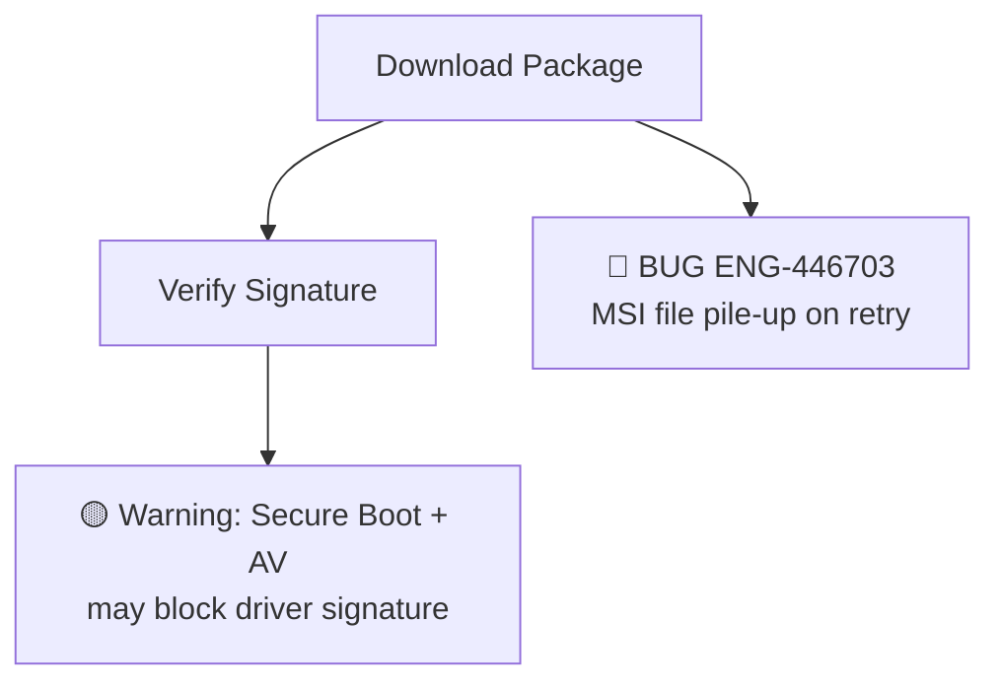

# Playbook: How to Write a Chapter

> This document turns the iterative process used to build all 22 chapters into a repeatable recipe. Follow it step by step to produce a chapter of the same quality — whether you're using Claude Code, another LLM, or writing manually.

---

## Prerequisites

Before you start, you need:

| Item | Where to get it | Why |
|------|----------------|-----|
| **Bug data file** | `bugs/*.md` — one file per feature area | Every bug annotation in a chapter must trace back to a real ENG-XXXXXX in these files |
| **Client source code** | A local checkout of the NSClient codebase | For code flow analysis — the diagrams model real code paths, not guesses |
| **Golden regression suite** (optional) | The existing automation test repo | To map which flows already have test coverage and which don't |

---

## The 5 Stages

### Stage 1: Extract and Classify Bugs

**Input**: A `bugs/*.md` file (e.g., `bugs/install_upgrade.md`)
**Output**: A structured list of bugs with metadata

For each entry in the bug data file, extract:
- Bug ID (ENG-XXXXXX)
- Platform (Windows / macOS / Linux / Android / iOS / ChromeOS / Backend)
- Bug description and root cause
- Classification: Regression, Day-1, Test Gap, or Corner Case
- Which code flow step it affects

**Key rule**: If a bug has no real ENG-XXXXXX ID, skip it — it's a summary or review note.

For **cross-referenced chapters** (chapters that don't have their own dedicated bug file), scan ALL 4 bug files for bugs that touch the chapter's topic area.

### Stage 2: Map Bugs to Code Flows

**Input**: Classified bugs + source code
**Output**: A mapping of which bugs hit which code flow steps

For each bug, read the root cause from the Comments field, then find the corresponding function/module in the source code. This produces mappings like:

```
ENG-446703 → MSI file pile-up → Auto-Upgrade Flow → "Package Download" step
ENG-497728 → Cache key collision → MSI Installation Flow → "CA_GetNsbrandingJsonFile" step
```

Also identify **predicted risks**: places where code analysis reveals potential failure but no escalation bug exists yet. These become 🟡 Warning nodes.

### Stage 3: Build Mermaid Diagrams

**Input**: Bug-to-flow mappings
**Output**: Annotated flow diagrams in Mermaid syntax

Each diagram models a real code flow. Bugs are annotated directly on the diagram:



**Styling rules**:
- 🔴 in node label = confirmed bug (must have ENG-XXXXXX)
- 🟡 in node label = predicted risk (no bug ID)
- Do NOT use `style fill` for bug/risk nodes
- Green `fill:#4CAF50` and blue `fill:#2196F3` are OK for functional endpoints

### Stage 4: Write the Chapter

**Input**: Diagrams + bug data + template
**Output**: A complete chapter `.md` file

Follow the structure in [chapter_template.md](chapter_template.md) exactly. The key principles:

1. **Narrative before every diagram** — explain what the diagram shows and why it matters before the reader sees it
2. **Platform sections** — organize platform-specific bugs and flows under Windows / macOS / Linux / Android / iOS / ChromeOS / Backend
3. **Test cases** — every test case references real bugs and includes Severity, Auto Priority, Gap Type
4. **Bug table in appendix** — the full bug lookup table goes at the end, not the beginning

Write in **English only** — including all Mermaid node labels and edge labels.

### Stage 5: Review and Deploy

**Review checklist** (every item must pass):

- [ ] Every 🔴 node has a real ENG-XXXXXX verifiable in `bugs/*.md`
- [ ] Every 🟡 node is covered by at least one test case
- [ ] Every diagram has a preceding narrative paragraph
- [ ] Platform sections cover at least Windows / macOS / Linux
- [ ] Test cases have Severity, Auto Priority, and Gap Type
- [ ] Bug Quick Reference is in Appendix A (at the end)
- [ ] All content is in English
- [ ] No line number references in code citations

**Deploy to Confluence**:
```bash
cd scripts/
export CONFLUENCE_API_TOKEN="your-token"
python3 render_mermaid_and_convert.py 01    # single chapter
python3 render_mermaid_and_convert.py all   # all chapters
```

---

## Using Claude Code to Write a Chapter

If you're using Claude Code (or another LLM) to assist, here's the prompt sequence that works. Each step builds on the previous output.

### Prompt 1: Bug extraction

```
Read bugs/install_upgrade.md and extract every entry that has a real ENG-XXXXXX ID.
For each bug, give me: Bug ID, Platform, Description, Root Cause, Classification
(Regression/Day-1/Test Gap/Corner Case). Skip entries without real bug IDs.
```

### Prompt 2: Code flow mapping

```
For each bug from the previous extraction, find the relevant code flow in the
source code at [path to client code]. Map each bug to:
- Which module/function it affects
- Which flow step it breaks
- What the expected vs actual behavior is
```

### Prompt 3: Diagram creation

```
Build Mermaid flow diagrams for [feature area]. Use the bug-to-flow mappings
to annotate each diagram with 🔴 nodes for confirmed bugs and 🟡 nodes for
predicted risks. Follow the styling rules in docs/chapter_template.md.
```

### Prompt 4: Chapter assembly

```
Assemble the complete chapter following the template in docs/chapter_template.md.
Include all platform sections, test cases, cross-flow interactions, and appendices.
Every bug annotation must trace to a real ENG-XXXXXX from the bug data file.
```

### Prompt 5: Quality review

```
Review the chapter against the quality checklist in docs/chapter_template.md.
Flag any 🔴 node without a real bug ID, any diagram without a preceding
narrative, or any test case missing Severity/Auto Priority/Gap Type.
```

### Iteration tips

- You will likely go through 3-5 rounds of review to get a chapter to quality
- The most common issues: hallucinated bug IDs, missing narrative paragraphs, diagrams too complex to render
- If Mermaid rendering fails, simplify the diagram (split into smaller sub-diagrams)
- Cross-referenced chapters need extra care — verify every ENG-XXXXXX against ALL 4 bug files

---

## How the Original 22 Chapters Were Built

The chapters were not created in one shot. The iterative process was:

1. **Bug data collection** — 174 escalation bugs collected from Jira, manually categorized into 4 feature areas, stored in `bugs/*.md`
2. **First draft** — Claude Code generated initial chapters from bug data + source code analysis
3. **Quality enforcement** — Rules were added one by one as issues were found:
   - Fake bug IDs discovered → rule: every ENG-XXXXXX must exist in bug data files
   - Mermaid colors didn't render on Confluence → rule: use emoji, not `style fill`
   - Chapters without enough bug data had fabricated content → rule: only chapters 01/05/07/11 are data-rich; all others are cross-referenced
4. **Template standardization** — After chapter 01 was at quality, its structure became the template for all others
5. **Confluence deployment** — Scripts were built to automate the markdown → rendered PNG → Confluence HTML pipeline

The accumulated rules are in [writing_methodology.md](writing_methodology.md) and [chapter_template.md](chapter_template.md). They exist because each rule fixed a real mistake.
